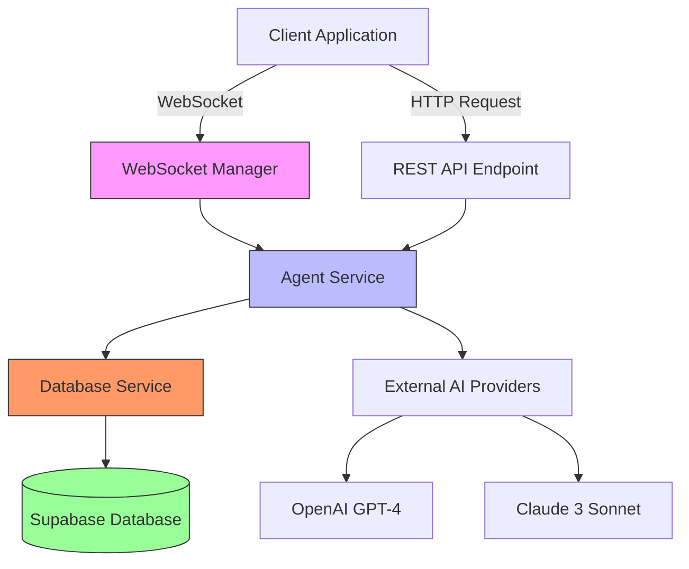
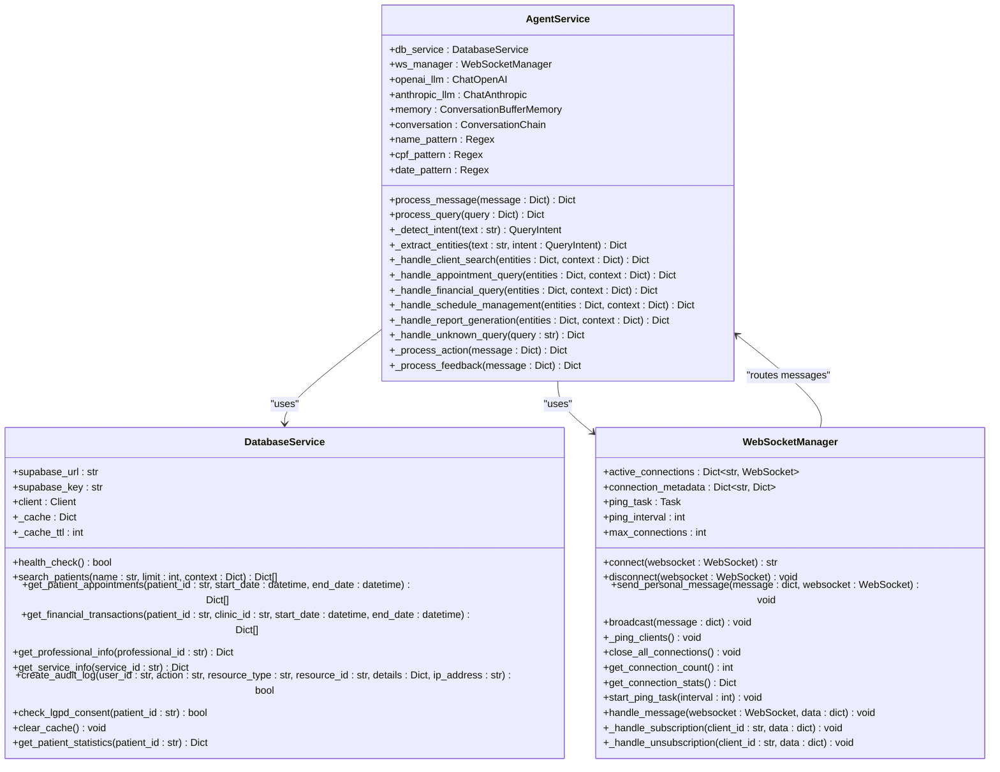
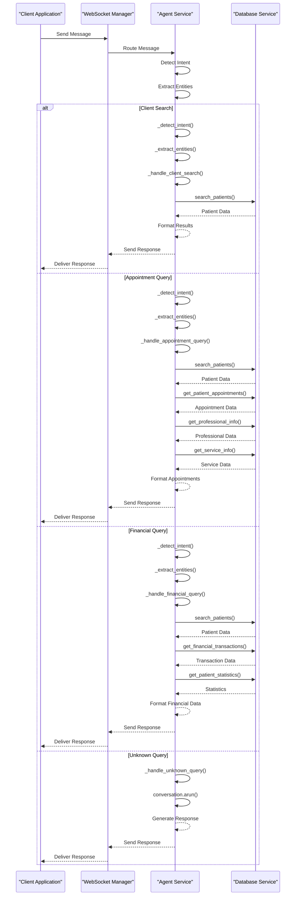
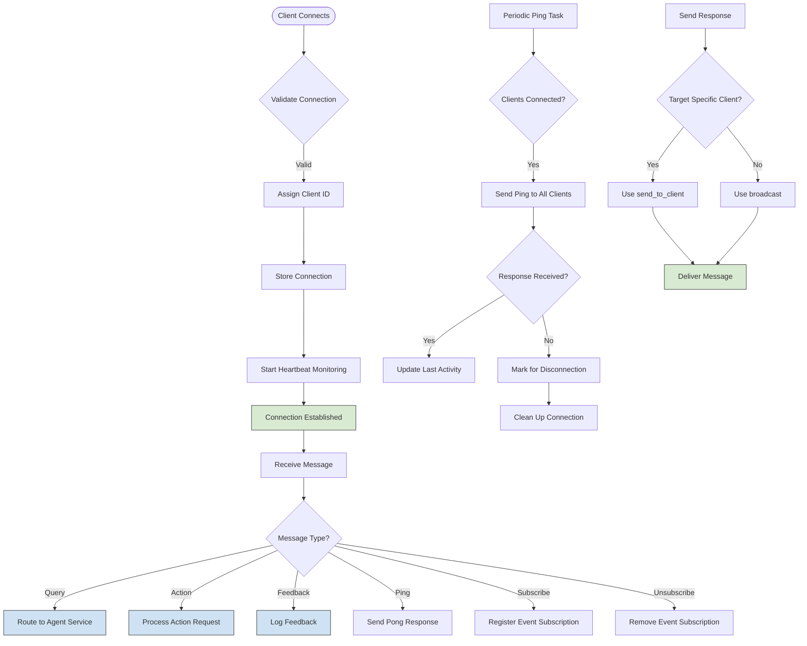
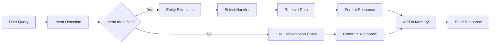

# AI Agent Service

<cite>
**Referenced Files in This Document**
- [main.py](file://apps/ai-agent/main.py)
- [config.py](file://apps/ai-agent/config.py)
- [agent_service.py](file://apps/ai-agent/services/agent_service.py)
- [database_service.py](file://apps/ai-agent/services/database_service.py)
- [websocket_manager.py](file://apps/ai-agent/services/websocket_manager.py)
- [healthcare_data_service.py](file://apps/api/agents/ag-ui-rag-agent/healthcare_data_service.py)
- [agui_protocol.py](file://apps/api/agents/ag-ui-rag-agent/agui_protocol.py)
- [agent_config.py](file://apps/api/agents/ag-ui-rag-agent/agent_config.py)
- [tls_config.py](file://apps/api/agents/ag-ui-rag-agent/tls_config.py)
</cite>

## Table of Contents

1. [Introduction](#introduction)
2. [Architecture Overview](#architecture-overview)
3. [Core Components](#core-components)
4. [Agent Orchestration](#agent-orchestration)
5. [WebSocket Communication](#websocket-communication)
6. [External AI Provider Integration](#external-ai-provider-integration)
7. [Data Processing and Response Generation](#data-processing-and-response-generation)
8. [Practical Implementations](#practical-implementations)
9. [Error Recovery and Fallback Strategies](#error-recovery-and-fallback-strategies)
10. [Performance Optimization](#performance-optimization)
11. [Configuration and Extensibility](#configuration-and-extensibility)

## Introduction

The AI Agent Service is a Python-based AI processing engine built with FastAPI that serves as the central intelligence component for the NeonPro platform. This service handles natural language processing, clinical decision support, and financial analysis tasks for healthcare applications. The architecture is designed to process user queries through multiple communication channels, including WebSocket and REST API endpoints, while maintaining compliance with Brazilian healthcare regulations like LGPD.

The service integrates with external AI providers such as OpenAI and Anthropic, leveraging their large language models (LLMs) to understand user intent and generate appropriate responses. It processes requests by first detecting the user's intent, extracting relevant entities from the query, and then orchestrating the appropriate data retrieval and response generation workflow. The system supports various healthcare-specific use cases including patient search, appointment queries, financial data access, and report generation.

This documentation provides both conceptual overviews for beginners and technical details for experienced developers, covering the complete request processing pipeline from initial connection to final response delivery.

**Section sources**

- [main.py](file://apps/ai-agent/main.py#L1-L180)
- [config.py](file://apps/ai-agent/config.py#L1-L90)

## Architecture Overview

The AI Agent Service follows a modular microservices architecture with clear separation of concerns between components. At its core, the service consists of three main components: the agent service responsible for business logic and AI processing, the database service for data access, and the WebSocket manager for real-time communication. These components work together to process user requests and deliver intelligent responses.

The service exposes two primary interfaces: a WebSocket endpoint for real-time interactive communication using the AG-UI protocol, and a REST API endpoint for traditional HTTP requests. When a client connects, the WebSocket manager establishes and maintains the connection, handling authentication and session management. Incoming messages are routed to the agent service, which processes the request by detecting intent, extracting entities, and determining the appropriate action.

For data access, the agent service interacts with the database service, which provides a clean abstraction layer over the Supabase database. This service implements caching mechanisms to improve performance and includes healthcare-specific features like LGPD compliance checks. The agent service also maintains conversation memory to provide context-aware responses across multiple interactions.

**Diagram sources **

- [main.py](file://apps/ai-agent/main.py#L1-L180)
- [agent_service.py](file://apps/ai-agent/services/agent_service.py#L1-L480)
- [database_service.py](file://apps/ai-agent/services/database_service.py#L1-L284)
- [websocket_manager.py](file://apps/ai-agent/services/websocket_manager.py#L1-L230)

## Core Components

The AI Agent Service comprises several core components that work together to deliver intelligent healthcare assistance. The main entry point is the FastAPI application defined in main.py, which initializes all services and sets up the routing for both WebSocket and REST endpoints. The configuration is managed through a settings object that loads environment variables and provides default values for various parameters including server configuration, database credentials, and AI model settings.

The AgentService class is the central component responsible for processing user requests. It initializes connections to external AI providers using the ChatOpenAI and ChatAnthropic classes from LangChain, configuring them with specific models and temperature settings to ensure consistent, reliable responses. The service also sets up conversation memory using ConversationBufferMemory to maintain context across multiple interactions, allowing for more natural and coherent dialogues.

The DatabaseService provides a comprehensive interface for accessing healthcare data stored in Supabase. It implements methods for searching patients, retrieving appointments, accessing financial transactions, and gathering patient statistics. The service includes built-in caching to reduce database load and improve response times, with a configurable TTL (time-to-live) for cached results. It also enforces healthcare compliance requirements such as LGPD consent checks and audit logging for sensitive operations.

**Diagram sources **

- [agent_service.py](file://apps/ai-agent/services/agent_service.py#L1-L480)
- [database_service.py](file://apps/ai-agent/services/database_service.py#L1-L284)
- [websocket_manager.py](file://apps/ai-agent/services/websocket_manager.py#L1-L230)

**Section sources**

- [agent_service.py](file://apps/ai-agent/services/agent_service.py#L1-L480)
- [database_service.py](file://apps/ai-agent/services/database_service.py#L1-L284)
- [websocket_manager.py](file://apps/ai-agent/services/websocket_manager.py#L1-L230)

## Agent Orchestration

The agent orchestration system in the AI Agent Service is responsible for coordinating the processing of user requests from initial receipt to final response generation. The AgentService class acts as the central orchestrator, managing the flow of information between different components and ensuring that each request is handled appropriately based on its intent and content.

When a message arrives, the process_message method serves as the entry point, routing the message based on its type (query, action, or feedback). For query messages, the system first detects the user's intent by analyzing the text for specific keywords and patterns related to healthcare operations such as patient search, appointment queries, or financial data access. This intent detection uses simple pattern matching with case-insensitive string comparisons to identify the user's goal.

Once the intent is determined, the system extracts relevant entities from the query using regular expressions and contextual analysis. For example, it identifies patient names using a pattern that matches capitalized first and last names, extracts CPF numbers using a Brazilian tax ID pattern, and detects dates in common formats. The entity extraction process is enhanced by the specific intent, allowing for more targeted extraction of relevant information such as appointment status or transaction types.

Based on the detected intent and extracted entities, the orchestrator routes the request to the appropriate handler method. Each handler is responsible for a specific domain of functionality, such as _handle_client_search for patient lookups or _handle_financial_query for financial data retrieval. These handlers interact with the database service to fetch the required data, format it appropriately, and return a structured response. For unrecognized queries, the system falls back to a general conversation chain that can provide helpful responses based on the available context.

**Diagram sources **

- [agent_service.py](file://apps/ai-agent/services/agent_service.py#L1-L480)
- [database_service.py](file://apps/ai-agent/services/database_service.py#L1-L284)

## WebSocket Communication

The WebSocket communication system in the AI Agent Service enables real-time, bidirectional interaction between clients and the AI processing engine. Implemented through the WebSocketManager class, this system manages persistent connections, handles message routing, and ensures reliable communication even in unstable network conditions.

The WebSocketManager maintains a dictionary of active connections, mapping unique client IDs to their respective WebSocket objects. When a client connects, the connect method assigns a random client ID, stores the connection, and returns the ID to the client for future reference. The system also maintains connection metadata including last activity timestamps, which helps identify and clean up inactive connections.

To ensure connection health, the WebSocketManager implements a periodic ping mechanism through the _ping_clients method. This background task sends ping messages to all connected clients at regular intervals (configurable via the ping_interval setting), allowing the system to detect disconnected clients promptly. Clients are expected to respond with pong messages, confirming their active status.

The system supports various message types beyond simple chat messages, including subscription requests for real-time updates, heartbeat messages for connection monitoring, and feedback submissions for improving the AI system. The handle_message method processes incoming messages, updating connection metadata and routing messages to appropriate handlers based on their type. For standard messages, the content is passed to the agent service for processing, while control messages like subscriptions are handled directly by the WebSocket manager.

The broadcast method enables the system to send messages to all connected clients simultaneously, which is useful for announcements or system-wide notifications. The send_to_client method allows targeted messaging to specific clients, supporting personalized interactions. Both methods include error handling to gracefully manage delivery failures, automatically disconnecting clients that cannot receive messages.

**Diagram sources **

- [websocket_manager.py](file://apps/ai-agent/services/websocket_manager.py#L1-L230)

## External AI Provider Integration

The AI Agent Service integrates with external AI providers through a flexible and resilient architecture that supports multiple large language models (LLMs) from different vendors. The primary integration points are with OpenAI and Anthropic, accessed through their respective APIs using the ChatOpenAI and ChatAnthropic classes from the LangChain framework.

In the AgentService initialization, both providers are configured with specific model versions and parameters. The OpenAI integration uses the "gpt-4-turbo-preview" model with a low temperature setting of 0.1 to ensure focused, deterministic responses suitable for healthcare applications where accuracy is critical. Similarly, the Anthropic integration uses the "claude-3-sonnet-20240229" model with the same temperature setting to maintain consistency in response behavior.

The integration is designed with fallback capabilities, allowing the system to switch between providers if one becomes unavailable. While the current implementation primarily uses the OpenAI model through the ConversationChain, the architecture supports using either provider based on the specific requirements of each task. This dual-provider setup enhances reliability and provides redundancy in case of service outages or rate limiting issues.

Authentication with external providers is managed through API keys stored in environment variables, accessed via the configuration system. This approach ensures that sensitive credentials are not hardcoded in the source code and can be easily rotated without modifying the application. The config.py file defines the environment variable names (OPENAI_API_KEY and ANTHROPIC_API_KEY) and validates their presence during application startup.

The integration also includes error handling mechanisms to gracefully manage issues with external providers. If an API call fails due to network issues, rate limits, or other errors, the system logs the error and returns an appropriate error response to the user rather than crashing. This resilience is crucial for maintaining service availability in production environments where external dependencies may experience temporary disruptions.

**Section sources**

- [agent_service.py](file://apps/ai-agent/services/agent_service.py#L1-L480)
- [config.py](file://apps/ai-agent/config.py#L1-L90)

## Data Processing and Response Generation

The data processing and response generation pipeline in the AI Agent Service transforms user queries into meaningful, actionable responses through a multi-stage process. This pipeline begins with intent detection and entity extraction, followed by data retrieval from the database, and concludes with response formatting and delivery.

When a user submits a query, the system first analyzes the text to determine the user's intent using keyword matching patterns. Different intents trigger specialized entity extraction routines that identify relevant information such as patient names, CPF numbers, dates, and other context-specific data. For example, a financial query might extract transaction types and statuses, while an appointment query might identify desired appointment status (upcoming, past, or cancelled).

Once the intent and entities are identified, the appropriate handler method retrieves the necessary data from the database service. The database service abstracts the Supabase interactions, providing methods to search patients, retrieve appointments, access financial records, and gather patient statistics. These methods include proper filtering based on user context (such as clinic ID) and implement caching to improve performance for frequently accessed data.

The retrieved data is then formatted into a structured response appropriate for the requested operation. Patient search results include essential information like name, contact details, and LGPD consent status, while appointment queries include professional and service details alongside scheduling information. Financial queries return transaction lists along with summary statistics like total revenue and pending payments.

For queries that don't match specific handlers, the system uses a conversation chain powered by the OpenAI model to generate appropriate responses. This fallback mechanism allows the AI to provide helpful information even for unexpected queries, maintaining a conversational experience. Throughout the process, the system maintains conversation memory to preserve context across multiple interactions, enabling more natural and coherent dialogues.

**Diagram sources **

- [agent_service.py](file://apps/ai-agent/services/agent_service.py#L1-L480)
- [database_service.py](file://apps/ai-agent/services/database_service.py#L1-L284)

## Practical Implementations

The AI Agent Service has been implemented in practical applications such as the ag-ui-rag-agent and healthcare_data_service.py, demonstrating its capabilities in real-world healthcare scenarios. These implementations showcase how the core AI processing engine can be adapted to specific use cases while maintaining the underlying architecture and principles.

The ag-ui-rag-agent implementation extends the basic agent functionality with Retrieval-Augmented Generation (RAG) capabilities, allowing it to answer questions based on specific documents or knowledge bases. This agent uses the AG-UI protocol for real-time communication, supporting both WebSocket and HTTP fallback endpoints. It implements role-based access control, ensuring that users only see data appropriate to their permissions level, and includes LGPD compliance features like data masking for phone numbers and email addresses.

The healthcare_data_service.py implementation focuses on UI/UX optimization for healthcare professionals. It formats data specifically for mobile responsiveness, creating compact representations of appointments and patient information that work well on smaller screens. The service includes accessibility features like ARIA labels and descriptive text for screen readers, making it usable for healthcare professionals with visual impairments. It also implements action buttons that are context-aware, showing appropriate actions based on appointment status or user role.

Both implementations demonstrate the flexibility of the AI Agent Service architecture. They reuse the core agent service components while adding specialized functionality for their domains. The ag-ui-rag-agent builds on the WebSocket communication system to create a rich, interactive experience, while the healthcare_data_service enhances the data formatting capabilities to meet specific user interface requirements. These examples show how new AI capabilities can be added by extending existing components rather than building entirely new systems.

**Section sources**

- [agui_protocol.py](file://apps/api/agents/ag-ui-rag-agent/agui_protocol.py#L1-L429)
- [healthcare_data_service.py](file://apps/api/agents/ag-ui-rag-agent/healthcare_data_service.py#L1-L412)
- [main.py](file://apps/api/agents/ag-ui-rag-agent/main.py#L1-L646)

## Error Recovery and Fallback Strategies

The AI Agent Service implements comprehensive error recovery and fallback strategies to ensure reliable operation in production environments. These strategies address various failure modes, from network connectivity issues to external provider outages, ensuring that the system remains available and responsive to users.

For database operations, the system implements try-except blocks around all data access methods, catching exceptions and returning appropriate error responses rather than propagating errors to the client. The database service includes retry logic for transient failures and maintains a cache of recent results to serve stale-but-available data when the database is temporarily unreachable. Audit logging is performed for all sensitive operations, with fallback mechanisms to store logs locally if the primary audit log destination is unavailable.

When communicating with external AI providers, the system includes timeout handling and circuit breaker patterns to prevent cascading failures. If an API call exceeds the maximum allowed response time, it is terminated and treated as a failure, allowing the system to respond to the user rather than hanging indefinitely. The conversation chain used for unknown queries includes exception handling that returns a generic helpful response when the AI provider fails, maintaining usability even when the primary AI system is down.

The WebSocket communication layer implements connection resilience features, including automatic reconnection attempts and message queuing for offline clients. The ping-pong mechanism detects dead connections quickly, allowing the system to free up resources and notify users of connectivity issues. For critical operations, the system implements idempotency, ensuring that repeated requests have the same effect as a single request, preventing data corruption during network retries.

These error recovery mechanisms are complemented by comprehensive logging that captures detailed information about failures, including timestamps, error messages, and relevant context. This logging enables rapid diagnosis and resolution of issues, while also providing data for improving the system's resilience over time through analysis of failure patterns.

**Section sources**

- [agent_service.py](file://apps/ai-agent/services/agent_service.py#L1-L480)
- [database_service.py](file://apps/ai-agent/services/database_service.py#L1-L284)
- [websocket_manager.py](file://apps/ai-agent/services/websocket_manager.py#L1-L230)

## Performance Optimization

The AI Agent Service incorporates several performance optimization techniques to ensure responsive interactions and efficient resource utilization. These optimizations address latency reduction, token usage management, and overall system efficiency to deliver a smooth user experience.

Latency optimization is achieved through multiple strategies, including connection pooling for database access, caching of frequently accessed data, and asynchronous processing of all I/O operations. The database service implements a time-based cache with a configurable TTL (currently set to 300 seconds), reducing the number of round trips to the Supabase database for common queries. The WebSocket manager uses non-blocking I/O operations to handle multiple concurrent connections efficiently, preventing any single slow operation from blocking others.

Token usage management is critical when working with external AI providers that charge based on token consumption. The system optimizes token usage by preprocessing queries to remove unnecessary information, using concise prompts, and implementing early termination when sufficient information has been gathered. The conversation memory is carefully managed to include only relevant context, avoiding the inclusion of excessive historical information that would increase token count without adding value.

The system also implements rate limiting and request queuing to prevent overload during peak usage periods. The WebSocket manager limits the maximum number of concurrent connections (configurable via WS_MAX_CONNECTIONS) to ensure stable performance. Background tasks like the ping mechanism are optimized to minimize CPU usage, with appropriate sleep intervals between operations.

Additional performance considerations include efficient data serialization and deserialization, using JSON for message payloads with minimal overhead. The system avoids unnecessary data transfer by requesting only the fields needed for each operation, reducing bandwidth usage and improving response times. For high-frequency operations, bulk operations are preferred over individual requests to minimize network round trips.

**Section sources**

- [agent_service.py](file://apps/ai-agent/services/agent_service.py#L1-L480)
- [database_service.py](file://apps/ai-agent/services/database_service.py#L1-L284)
- [websocket_manager.py](file://apps/ai-agent/services/websocket_manager.py#L1-L230)

## Configuration and Extensibility

The AI Agent Service is designed with extensibility in mind, allowing for easy addition of new AI capabilities and configuration of different LLM providers. The configuration system, implemented in config.py, uses Pydantic settings to provide type-safe access to environment variables with sensible defaults. This approach allows deployment across different environments (development, staging, production) without code changes, simply by adjusting environment variables.

Adding new AI capabilities follows a modular pattern where new handler methods can be added to the AgentService class for specific intents. Each handler follows a consistent structure: validate input parameters, retrieve necessary data through the database service, format the response appropriately, and return a standardized response structure. This consistency makes it easy to understand and maintain new capabilities as they are added.

Configuring different LLM providers is straightforward, requiring only updates to the initialization code in the AgentService constructor. The system could be extended to support dynamic provider selection based on factors like cost, latency, or specific capabilities needed for particular tasks. The current implementation already includes both OpenAI and Anthropic integrations, demonstrating the feasibility of multi-provider support.

The WebSocket communication system is designed to be extensible, with support for custom message types and event handlers. New message types can be added by extending the message processing logic, while new event handlers can be registered to respond to specific events. This flexibility allows the system to evolve with changing requirements without major architectural changes.

Security and compliance configurations are centralized in the tls_config.py file for the AG-UI implementation, showing how security settings can be managed separately from business logic. This separation allows security policies to be updated independently of application functionality, facilitating compliance with evolving regulations.

**Section sources**

- [config.py](file://apps/ai-agent/config.py#L1-L90)
- [agent_service.py](file://apps/ai-agent/services/agent_service.py#L1-L480)
- [tls_config.py](file://apps/api/agents/ag-ui-rag-agent/tls_config.py#L1-L195)
