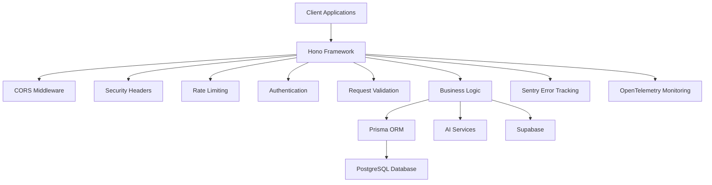
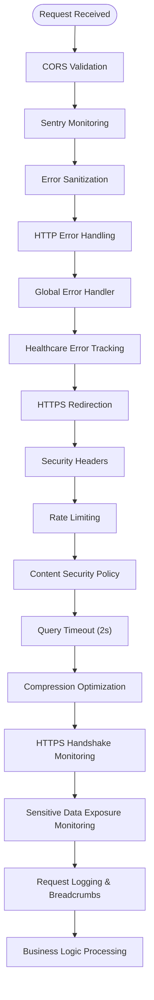
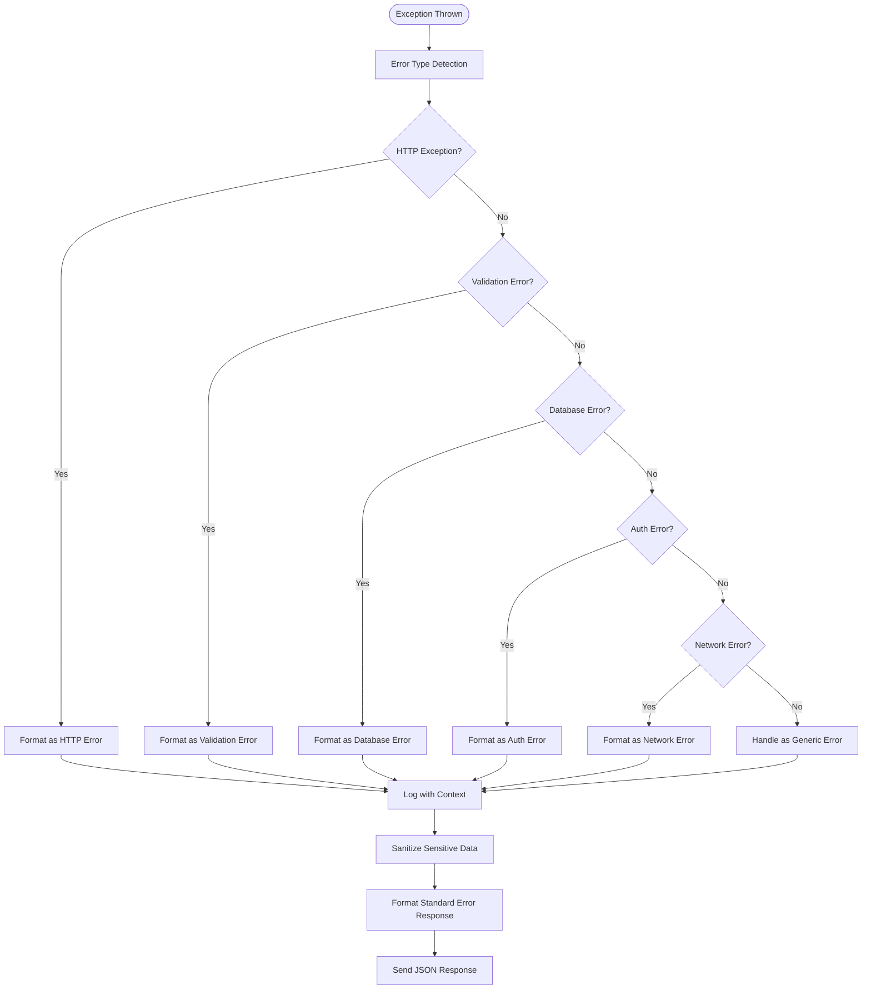

# API Service

<cite>
**Referenced Files in This Document**   
- [index.ts](file://apps/api/src/index.ts)
- [app.ts](file://apps/api/src/app.ts)
- [error-tracking.ts](file://apps/api/src/config/error-tracking.ts)
- [error-sanitization.ts](file://apps/api/src/middleware/error-sanitization.ts)
- [http-error-handling.ts](file://apps/api/src/middleware/http-error-handling.ts)
- [security-headers.ts](file://apps/api/src/middleware/security-headers.ts)
- [rate-limiting.ts](file://apps/api/src/middleware/rate-limiting.ts)
- [openapi-generator.ts](file://apps/api/src/lib/openapi-generator.ts)
</cite>

## Table of Contents
1. [Introduction](#introduction)
2. [Architecture Overview](#architecture-overview)
3. [Middleware Pipeline](#middleware-pipeline)
4. [Route Structure and Endpoint Management](#route-structure-and-endpoint-management)
5. [Error Handling Mechanisms](#error-handling-mechanisms)
6. [Security Implementation](#security-implementation)
7. [tRPC Integration and Type Safety](#trpc-integration-and-type-safety)
8. [OpenAPI Specification Generation](#openapi-specification-generation)
9. [Database Connectivity with Prisma](#database-connectivity-with-prisma)
10. [Real-time Features and WebSocket Integration](#real-time-features-and-websocket-integration)
11. [Practical Examples from Key Routes](#practical-examples-from-key-routes)
12. [Common Issues and Troubleshooting](#common-issues-and-troubleshooting)
13. [Adding New tRPC Routers](#adding-new-trpc-routers)

## Introduction

The API service in the neonpro repository serves as the backend server for the NeonPro Healthcare Platform, built using the Hono framework. It functions as the central intermediary between frontend applications and various backend services including databases and AI systems. The API handles business logic processing, data transformation, authentication, authorization, and compliance requirements specific to healthcare applications in Brazil.

This documentation provides comprehensive coverage of the API's architecture, middleware pipeline, route structure, error handling mechanisms, and security implementation. It includes both conceptual overviews for developers new to the system and technical details for experienced developers working with advanced features like tRPC integration, OpenAPI specification generation, database connectivity through Prisma, and real-time capabilities.

The API is designed with healthcare compliance at its core, implementing LGPD (Lei Geral de Proteção de Dados), ANVISA, and CFM regulations throughout its architecture. It processes sensitive medical and personal data while maintaining strict audit trails, data protection measures, and access controls.

**Section sources**
- [app.ts](file://apps/api/src/app.ts#L1-L572)
- [index.ts](file://apps/api/src/index.ts#L1-L96)

## Architecture Overview

The API service follows a layered architecture built on the Hono framework, which provides a lightweight and performant foundation for building RESTful APIs and web services. The architecture is designed to handle high-throughput requests while maintaining strict healthcare compliance standards.

At the entry point, the `index.ts` file initializes the server and sets up graceful shutdown procedures. When not running in Vercel's serverless environment, it creates an HTTP server that listens on port 3005 and initializes WebSocket support for the AG-UI Protocol. The main application logic is contained in `app.ts`, which creates an OpenAPI-compliant Hono application instance.

The architecture incorporates multiple layers of functionality:
- **Security Layer**: Implements CORS, HTTPS redirection, security headers, and rate limiting
- **Monitoring Layer**: Integrates Sentry for error tracking and OpenTelemetry for performance monitoring
- **Validation Layer**: Uses Zod schemas for request validation and data integrity
- **Business Logic Layer**: Contains route handlers for various domain-specific operations
- **Data Access Layer**: Connects to databases through Prisma ORM

The system is designed to run both in traditional Node.js environments and serverless platforms like Vercel, with conditional logic that adapts the server initialization process based on the execution environment.



**Diagram sources**
- [index.ts](file://apps/api/src/index.ts#L1-L96)
- [app.ts](file://apps/api/src/app.ts#L1-L572)

## Middleware Pipeline

The API implements a comprehensive middleware pipeline that processes requests through multiple stages of security, validation, and monitoring. The middleware stack is applied globally to all routes, ensuring consistent behavior across the entire API surface.

The pipeline begins with CORS (Cross-Origin Resource Sharing) configuration, which restricts access to trusted origins based on the environment. In production, only `neonpro.com.br` and `neonpro.vercel.app` are allowed, while development environments permit localhost connections. The CORS configuration also supports credentials and specifies allowed methods and headers.

Following CORS, the API applies several security-focused middleware components:
- **Sentry Middleware**: Captures errors and performance metrics for monitoring
- **Error Sanitization**: Removes sensitive data from error messages before logging
- **HTTP Error Handling**: Standardizes error responses across the API
- **Global Error Handler**: Provides centralized error processing
- **Healthcare Error Tracking**: Specialized error tracking with compliance considerations

Security enhancements include HTTPS redirection for production traffic, enhanced security headers (HSTS, CSP, X-XSS-Protection), and healthcare-specific Content Security Policy rules that allow connections to AI services like OpenAI while blocking potentially dangerous content.

Performance optimizations include query timeout middleware (enforcing sub-2-second response times for healthcare compliance), compression middleware for HTTPS responses, and HTTPS handshake monitoring to ensure fast connection establishment.

The middleware pipeline also incorporates sensitive data exposure monitoring and audit logging for compliance purposes. Each request passes through this comprehensive pipeline before reaching the business logic layer, ensuring that security, performance, and compliance requirements are met consistently.



**Diagram sources**
- [app.ts](file://apps/api/src/app.ts#L1-L572)
- [error-sanitization.ts](file://apps/api/src/middleware/error-sanitization.ts#L1-L147)
- [http-error-handling.ts](file://apps/api/src/middleware/http-error-handling.ts#L1-L255)
- [security-headers.ts](file://apps/api/src/middleware/security-headers.ts#L1-L382)
- [rate-limiting.ts](file://apps/api/src/middleware/rate-limiting.ts#L1-L215)

**Section sources**
- [app.ts](file://apps/api/src/app.ts#L1-L572)

## Route Structure and Endpoint Management

The API organizes its endpoints through a structured routing system that groups related functionality into dedicated modules. The route structure follows a versioned approach with different paths for various API versions and service types.

Key route groupings include:
- `/v1/chat`: Chat-related functionality
- `/v1/appointments`: Appointment management
- `/v1/medical-records`: Medical record access
- `/v1/billing`: Financial and billing operations
- `/api/v2/patients`: Patient management (version 2)
- `/api/v2/ai`: AI-powered services
- `/api/v2/financial-copilot`: Financial advisory services
- `/api/v1`: Legacy v1 API endpoints
- `/trpc`: tRPC router for type-safe API access

The routing system uses Hono's `route` method to mount these individual routers at their respective paths. For example, the chat router is mounted at `/v1/chat`, making endpoints like `/v1/chat/conversation` accessible. This modular approach allows teams to work on specific domains independently while maintaining a cohesive API structure.

Health endpoints follow a tiered approach:
- `/health`: Basic health check returning minimal status
- `/v1/health`: Detailed health check with system information
- `/v1/info`: System information endpoint with security features list
- `/v1/monitoring/https`: HTTPS monitoring status for compliance

The API also includes specialized endpoints for security and compliance:
- `/v1/security/status`: Security configuration overview
- `/v1/compliance/lgpd`: LGPD compliance status
- `/api/security/csp-violations`: CSP violation reporting
- `/api/docs/*`: Interactive documentation endpoints

Wildcard routes handle 404 cases with proper logging, capturing request details for monitoring and debugging purposes. The routing system is designed to be extensible, allowing new modules to be added without disrupting existing functionality.

**Section sources**
- [app.ts](file://apps/api/src/app.ts#L1-L572)

## Error Handling Mechanisms

The API implements a comprehensive error handling system that ensures consistent, secure, and informative error responses while protecting sensitive data. The error handling mechanism operates at multiple levels, from low-level exception capture to user-facing error formatting.

The primary error handling occurs through the `httpErrorHandlingMiddleware` function, which catches exceptions and categorizes them into specific types for appropriate handling. The system recognizes several error categories:

- **HTTP Exceptions**: Standard Hono HTTP exceptions with status codes
- **Validation Errors**: Schema validation failures from Zod or similar libraries
- **Database Errors**: Prisma client errors and database connectivity issues
- **Authentication/Authorization Errors**: JWT validation failures and permission denials
- **Network/Timeout Errors**: External service connectivity problems
- **Generic Errors**: Unhandled exceptions and unexpected failures

For each error type, the middleware logs detailed context including the request path, method, user agent, IP address, and request ID. Sensitive information is automatically redacted from error messages through the error sanitization process.

Error responses follow a standardized format defined in the OpenAPI specification, containing:
- Success flag (always false for errors)
- Error object with message, code, and category
- Request ID for tracing
- Timestamp for correlation

The system distinguishes between client errors (4xx) and server errors (5xx), providing appropriate guidance in error messages. Client errors typically result from invalid input or unauthorized access, while server errors indicate internal system problems.

Special handling exists for authentication errors, where failed login attempts are rate-limited separately from other endpoints to prevent brute force attacks. Database errors trigger alerts and may initiate failover procedures depending on the severity.

The error handling system integrates with external monitoring tools like Sentry, capturing stack traces and contextual data while automatically removing sensitive healthcare information such as patient data, CPF numbers, and health records before transmission.



**Diagram sources**
- [http-error-handling.ts](file://apps/api/src/middleware/http-error-handling.ts#L1-L255)
- [error-sanitization.ts](file://apps/api/src/middleware/error-sanitization.ts#L1-L147)

**Section sources**
- [http-error-handling.ts](file://apps/api/src/middleware/http-error-handling.ts#L1-L255)

## Security Implementation

The API implements a multi-layered security approach that addresses both general web application vulnerabilities and healthcare-specific compliance requirements. The security architecture follows defense-in-depth principles, with multiple overlapping controls protecting sensitive medical and personal data.

### Authentication and Authorization
The system requires JWT bearer tokens for most endpoints, with additional API keys for service-to-service communication. The authentication process validates tokens and extracts user and clinic identifiers for audit logging and multi-tenant isolation. Role-based access control ensures users can only access resources appropriate to their permissions.

### Transport Security
All production traffic is redirected to HTTPS using HSTS (HTTP Strict Transport Security) with a one-year max-age, includeSubDomains, and preload directives. The Content Security Policy (CSP) restricts content sources to prevent XSS attacks, while allowing necessary connections to AI services like OpenAI and Supabase WebSockets.

### Input Validation and Sanitization
The API employs rigorous input validation using Zod schemas to prevent injection attacks. All error messages pass through sanitization filters that remove sensitive patterns including passwords, tokens, CPF numbers, emails, phone numbers, and medical terminology. This prevents accidental data leakage through error responses.

### Rate Limiting
A sophisticated rate limiting system protects against abuse and denial-of-service attacks:
- **Healthcare data endpoints**: 50 requests per 15 minutes
- **AI/Chat endpoints**: 20 requests per minute
- **Authentication endpoints**: 10 attempts per 15 minutes (failed only)
- **General API endpoints**: 100 requests per 15 minutes

Rate limits are enforced by IP address and return standard rate limit headers (X-RateLimit-Limit, X-RateLimit-Remaining, Retry-After).

### Audit Logging
All access to patient data triggers audit log entries containing:
- Event type (data_access, data_export, etc.)
- Timestamp
- User ID
- Clinic ID
- Data classification
- Compliance notes
- Audit trail ID

### Data Protection
The system implements data masking for sensitive fields and removes PII from monitoring systems. Before sending error reports to Sentry, the system strips patient data, personal information, CPF numbers, and health data from event payloads.

### Header Security
The API sets multiple security headers:
- Strict-Transport-Security: Enforces HTTPS
- X-Frame-Options: Prevents clickjacking
- X-Content-Type-Options: Blocks MIME sniffing
- X-XSS-Protection: Enables browser XSS filter
- Referrer-Policy: Limits referrer information
- Permissions-Policy: Disables unnecessary browser features

These security measures collectively ensure compliance with LGPD, ANVISA, and CFM regulations while protecting patient privacy and data integrity.

```mermaid
graph TD
A[Security Implementation] --> B[Authentication]
A --> C[Transport Security]
A --> D[Input Validation]
A --> E[Rate Limiting]
A --> F[Audit Logging]
A --> G[Data Protection]
A --> H[Header Security]
B --> B1[JWT Bearer Tokens]
B --> B2[API Keys]
B --> B3[Role-Based Access]
C --> C1[HTTPS Redirection]
C --> C2[HSTS Enforcement]
C --> C3[CSP Policies]
D --> D1[Zod Schema Validation]
D --> D2[SQL Injection Protection]
D --> D3[XSS Prevention]
E --> E1[Healthcare Endpoints: 50/15m]
E --> E2[AI Endpoints: 20/m]
E --> E3[Auth Endpoints: 10/15m]
F --> F1[Data Access Logging]
F --> F2[Export/Deletion Logs]
F --> F3[Consent Updates]
G --> G1[PII Removal from Logs]
G --> G2[Data Masking]
G --> G3[Secure Error Reporting]
H --> H1[X-Frame-Options]
H --> H2[X-Content-Type-Options]
H --> H3[X-XSS-Protection]
H --> H4[Referrer-Policy]
```



**Diagram sources**
- [security-headers.ts](file://apps/api/src/middleware/security-headers.ts#L1-L382)
- [rate-limiting.ts](file://apps/api/src/middleware/rate-limiting.ts#L1-L215)
- [error-sanitization.ts](file://apps/api/src/middleware/error-sanitization.ts#L1-L147)

**Section sources**
- [security-headers.ts](file://apps/api/src/middleware/security-headers.ts#L1-L382)
- [rate-limiting.ts](file://apps/api/src/middleware/rate-limiting.ts#L1-L215)

## tRPC Integration and Type Safety

The API integrates tRPC (TypeScript Remote Procedure Call) to provide end-to-end type safety between the frontend and backend. This integration enables strongly-typed API endpoints where both request parameters and response structures are fully typed, eliminating runtime type errors and improving developer experience.

The tRPC router is mounted at the `/trpc` endpoint and configured with a context creation function that extracts relevant information from incoming requests. The context includes:
- `userId`: Extracted from x-user-id header
- `clinicId`: Extracted from x-clinic-id header
- `auditMeta`: Additional metadata for audit logging including IP address, user agent, and session ID

This context is available to all tRPC procedures, enabling secure and auditable access to protected resources. The type definitions for the context are located in `./trpc/context`, ensuring consistency across the application.

The tRPC integration works alongside traditional REST endpoints, providing an alternative interface optimized for TypeScript applications. This dual approach allows different parts of the system to use the most appropriate communication pattern—REST for external integrations and tRPC for internal, type-safe communication with the frontend.

Type safety extends to validation, where input parameters are validated against TypeScript types at runtime. This eliminates the need for separate validation schemas while ensuring data integrity. The tight coupling between types and implementation reduces bugs and makes refactoring safer, as changes to API contracts are immediately visible throughout the codebase.

The system maintains type consistency across layers by sharing type definitions between the API and frontend through shared packages. This ensures that both sides of the application agree on data structures, reducing integration errors and improving development velocity.

**Section sources**
- [app.ts](file://apps/api/src/app.ts#L1-L572)

## OpenAPI Specification Generation

The API generates comprehensive OpenAPI specifications using the `@hono/zod-openapi` library, providing machine-readable documentation that describes all available endpoints, request/response formats, and security requirements. The OpenAPI generator is implemented in `openapi-generator.ts` and creates healthcare-compliant API documentation.

The generated specification includes:
- **Info Object**: Contains API title, version, description, contact information, and license details
- **Servers Array**: Lists production, staging, and development server URLs
- **Components**: Defines reusable schemas, parameters, security schemes, and responses
- **Paths**: Describes all available endpoints with methods, parameters, request bodies, and responses

Healthcare-specific extensions are included in the specification:
- `x-healthcare-compliance`: Details LGPD, ANVISA, and CFM compliance status
- `x-security-features`: Lists implemented security measures
- `x-data-classification`: Classifies endpoints by data sensitivity (public, internal, personal, medical, financial)
- `x-audit-required`: Indicates whether audit logging is required for the endpoint

The system defines common healthcare schemas including:
- **SuccessResponse**: Standard success response format
- **ErrorResponse**: Standard error response with code, message, and category
- **PaginatedResponse**: Structure for paginated results
- **AuditEvent**: Schema for audit log entries
- **Brazilian document validators**: CPF, RG, CNPJ, CEP formats

Security schemes are registered for both JWT Bearer tokens and API keys, with appropriate descriptions and usage guidelines. The specification also includes examples of common operations like patient registration, appointment scheduling, and medical record access.

Interactive documentation is served at multiple endpoints (`/swagger`, `/docs`, `/documentation`) using Swagger UI with healthcare-branded styling. The documentation includes:
- Try-it-out functionality for testing endpoints
- Request snippets in multiple languages
- Filterable operations
- Expandable models
- Persistent authorization

Additional documentation endpoints provide:
- `/api/docs/examples`: Real-world usage examples
- `/api/docs/compliance`: Compliance summary for all endpoints
- `/api/docs/health`: Documentation system health status

This comprehensive documentation approach ensures that developers can understand and use the API effectively while maintaining healthcare compliance requirements.

```mermaid
graph TD
A[OpenAPI Generator] --> B[Documentation Configuration]
A --> C[Schema Definitions]
A --> D[Security Schemes]
A --> E[Response Templates]
A --> F[Route Registration]
B --> B1[Title: NeonPro Healthcare Platform API]
B --> B2[Version: 1.0.0]
B --> B3[Description: LGPD-compliant medical system]
B --> B4[Servers: Production, Staging, Development]
C --> C1[SuccessResponse]
C --> C2[ErrorResponse]
C --> C3[PaginatedResponse]
C --> C4[AuditEvent]
C --> C5[Brazilian Validators]
D --> D1[BearerAuth: JWT tokens]
D --> D2[ApiKeyAuth: Service keys]
E --> E1[UnauthorizedError]
E --> E2[ForbiddenError]
E --> E3[ValidationError]
E --> E4[NotFoundError]
E --> E5[InternalServerError]
F --> F1[Register Components]
F --> F2[Generate Paths]
F --> F3[Apply Extensions]
F --> F4[Serve Specification]
F4 --> G[Swagger UI]
G --> G1[/swagger]
G --> G2[/docs]
G --> G3[/documentation]
G --> G4[/api/docs]
G --> H[Additional Endpoints]
H --> H1[/api/docs/examples]
H --> H2[/api/docs/compliance]
H --> H3[/api/docs/health]
```

**Diagram sources**
- [openapi-generator.ts](file://apps/api/src/lib/openapi-generator.ts#L1-L598)

**Section sources**
- [openapi-generator.ts](file://apps/api/src/lib/openapi-generator.ts#L1-L598)

## Database Connectivity with Prisma

The API connects to databases using Prisma ORM, which provides a type-safe database client and schema migration system. While the direct Prisma client configuration is not visible in the analyzed files, the presence of database-related routes and services indicates Prisma is used as the primary data access layer.

The architecture suggests a multi-database approach with different data stores for various purposes:
- **PostgreSQL**: Primary relational database for patient records, appointments, and clinical data
- **Supabase**: Used for real-time features, authentication, and possibly storage
- **AI Agent Database**: Separate database for AI agent operations and state management

Prisma enables type-safe database operations through generated client code that matches the database schema. This ensures compile-time verification of queries and reduces runtime errors. The type definitions likely flow from the database schema through Prisma to the API layer, maintaining consistency across the stack.

Database connectivity is abstracted through service classes that encapsulate data access logic. These services are imported into route handlers, keeping business logic separate from data access concerns. The use of dependency injection or service location patterns allows for easy testing and mocking during development.

Connection pooling and query optimization are handled by Prisma, with additional query timeout middleware enforcing healthcare compliance requirements (sub-2-second response times). The system likely implements connection health checks and failover mechanisms to maintain availability during database maintenance or outages.

Security measures for database access include:
- Environment variable-based connection strings
- Role-based database permissions
- Row-Level Security (RLS) policies for multi-tenancy
- Audit logging of database operations
- Protection against SQL injection through parameterized queries

The database schema is designed to comply with healthcare regulations, including proper indexing for performance, encryption at rest, and retention policies for sensitive data. Migration scripts are managed through Prisma's migration system, ensuring controlled and reversible schema changes.

**Section sources**
- [app.ts](file://apps/api/src/app.ts#L1-L572)

## Real-time Features and WebSocket Integration

The API supports real-time communication through WebSocket integration, primarily for the AG-UI Protocol used by AI agents. The WebSocket server is initialized in the `index.ts` file, where it's attached to the HTTP server instance.

The WebSocket integration enables bidirectional communication between clients and the AI agent system, allowing for:
- Real-time AI responses and streaming
- Live updates for collaborative workflows
- Interactive diagnostic sessions
- Telemedicine applications
- Real-time data synchronization

The WebSocket server is created through the `createWebSocketServer` function imported from `./middleware/websocket-server`. This middleware handles WebSocket connection lifecycle events, message routing, and security validation.

Security measures for WebSockets include:
- Origin validation matching the CORS policy
- Authentication via JWT tokens passed during connection initiation
- Message validation to prevent injection attacks
- Rate limiting for connection attempts
- Secure WebSocket (wss://) enforcement in production

The system monitors WebSocket performance through the HTTPS monitoring service, tracking handshake times and connection stability to ensure compliance with healthcare requirements. Active connections are logged for audit purposes, and abnormal disconnections trigger alerts.

The WebSocket architecture follows a publish-subscribe pattern, where clients subscribe to specific channels based on their needs (e.g., patient updates, AI responses, system notifications). The server manages these subscriptions and efficiently broadcasts messages to relevant clients.

Error handling for WebSockets includes automatic reconnection logic, message queuing during temporary disconnects, and graceful degradation when real-time features are unavailable. The system maintains message ordering and delivery guarantees where required by healthcare workflows.

**Section sources**
- [index.ts](file://apps/api/src/index.ts#L1-L96)

## Practical Examples from Key Routes

The API includes several practical examples that demonstrate its capabilities in handling healthcare workflows. These examples illustrate how the system processes real-world scenarios while maintaining compliance and security.

### Patients Module
The patients module (mounted at `/api/v2/patients`) handles patient registration and management. When creating a new patient, the API:
1. Validates input against Zod schemas including CPF format validation
2. Checks for duplicate patients using unique constraints
3. Hashes sensitive data before storage
4. Creates audit log entries for GDPR/LGPD compliance
5. Returns standardized success responses with request IDs

Example request:
```json
{
  "name": "João Silva",
  "email": "joao.silva@example.com",
  "cpf": "123.456.789-00",
  "birth_date": "1990-01-01",
  "lgpd_consent": {
    "data_processing": true,
    "marketing_comms": false
  }
}
```

### Appointments Module
The appointments module (mounted at `/v1/appointments`) manages scheduling and calendar operations. It enforces business rules such as:
- Preventing double-booking of time slots
- Validating provider availability
- Ensuring proper lead times for different appointment types
- Sending automated reminders through integrated services

The system handles conflicts through optimistic locking and returns appropriate error codes when scheduling is not possible.

### AI Services
The AI services (mounted at `/api/v2/ai`) integrate with external AI providers for clinical decision support. These endpoints:
- Stream responses from large language models
- Apply healthcare-specific prompt engineering
- Filter outputs for patient safety
- Log interactions for quality assurance
- Implement rate limiting to manage AI service costs

The financial copilot service provides AI-driven financial advice while maintaining separation between clinical and financial data domains.

These practical implementations demonstrate how the API balances functionality, performance, and compliance requirements in a healthcare setting.

**Section sources**
- [app.ts](file://apps/api/src/app.ts#L1-L572)

## Common Issues and Troubleshooting

The API implementation addresses several common issues that developers may encounter when working with the system. Understanding these issues and their solutions helps maintain system reliability and developer productivity.

### CORS Configuration Issues
Developers may encounter CORS errors when testing locally. The API allows localhost origins in development mode but restricts them in production. To resolve CORS issues:
- Ensure the origin matches exactly (including protocol and port)
- Verify credentials are properly included in requests
- Check that required headers (Content-Type, Authorization) are permitted
- Use the development environment variables when testing locally

### Rate Limiting Challenges
The aggressive rate limiting on healthcare data endpoints can impact development workflows. Solutions include:
- Using the development environment where limits are more generous
- Implementing exponential backoff in client applications
- Monitoring rate limit headers (X-RateLimit-Remaining, Retry-After)
- Requesting temporary limit increases for bulk operations

### Authentication Token Validation
JWT token validation issues commonly occur due to:
- Expired tokens (default expiration likely set to 24 hours)
- Invalid signatures (mismatched secrets between services)
- Missing required claims (x-user-id, x-clinic-id)
- Clock skew between services

Troubleshooting steps include verifying token structure, checking system clocks, and validating secret keys across services.

### Database Connection Problems
Intermittent database connectivity can cause 500 errors. Mitigation strategies include:
- Implementing retry logic with exponential backoff
- Monitoring connection pool utilization
- Checking network connectivity between API and database
- Verifying database credentials in environment variables
- Reviewing database performance metrics

### Error Tracking Configuration
When error tracking isn't working as expected:
- Verify SENTRY_DSN environment variable is set
- Check network connectivity to Sentry endpoints
- Validate that sensitive data filtering is properly configured
- Ensure sample rates are appropriate for the environment
- Confirm that breadcrumbs are capturing sufficient context

### Performance Bottlenecks
To address slow endpoint performance:
- Check query timeout middleware logs for slow database queries
- Optimize database indexes for frequently accessed fields
- Implement caching for read-heavy endpoints
- Monitor WebSocket handshake times
- Review compression settings for large responses

Understanding these common issues and their solutions helps maintain system stability and developer efficiency.

**Section sources**
- [app.ts](file://apps/api/src/app.ts#L1-L572)
- [error-tracking.ts](file://apps/api/src/config/error-tracking.ts#L1-L288)
- [rate-limiting.ts](file://apps/api/src/middleware/rate-limiting.ts#L1-L215)

## Adding New tRPC Routers

Adding new tRPC routers to the API involves several steps that ensure type safety, proper routing, and integration with existing security and monitoring systems. The process maintains consistency across the codebase while enabling rapid feature development.

To add a new tRPC router:

1. **Create the Router File**: Create a new file in the `src/trpc/routers/` directory following the naming convention `[feature].ts`. The router should export a procedure or router that defines the API methods.

2. **Define Input and Output Types**: Use Zod schemas to define validation rules for input parameters and response structures. Leverage existing shared types when possible to maintain consistency.

3. **Implement Business Logic**: Write the actual functionality within the tRPC procedures, importing necessary services and utilities. Keep business logic separate from data access concerns.

4. **Integrate with Main Router**: Import the new router into `src/trpc/router.ts` and merge it with the existing appRouter using the merge method.

5. **Configure Context Usage**: Ensure the router properly utilizes the context object containing userId, clinicId, and audit metadata for security and logging purposes.

6. **Add Error Handling**: Implement appropriate error handling using the standardized error response format, categorizing errors by type (validation, business logic, database, etc.).

7. **Include Monitoring**: Add performance monitoring and error tracking calls to capture metrics and facilitate debugging.

8. **Write Tests**: Create unit and integration tests in the corresponding test directories to verify functionality and edge cases.

9. **Update Documentation**: Ensure the OpenAPI specification reflects any new endpoints or modified behaviors, either automatically through tRPC integration or manually if needed.

10. **Verify Security**: Confirm that the new router respects existing security policies, including authentication requirements, rate limiting, and data protection measures.

The tRPC integration automatically provides end-to-end type safety, so frontend consumers will immediately see the new endpoints with complete type information. This reduces integration errors and improves development velocity across the full stack.

**Section sources**
- [app.ts](file://apps/api/src/app.ts#L1-L572)