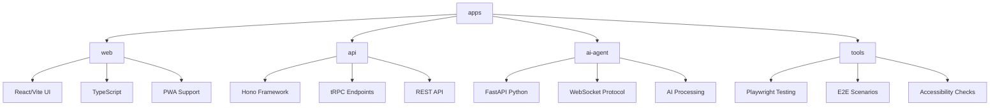
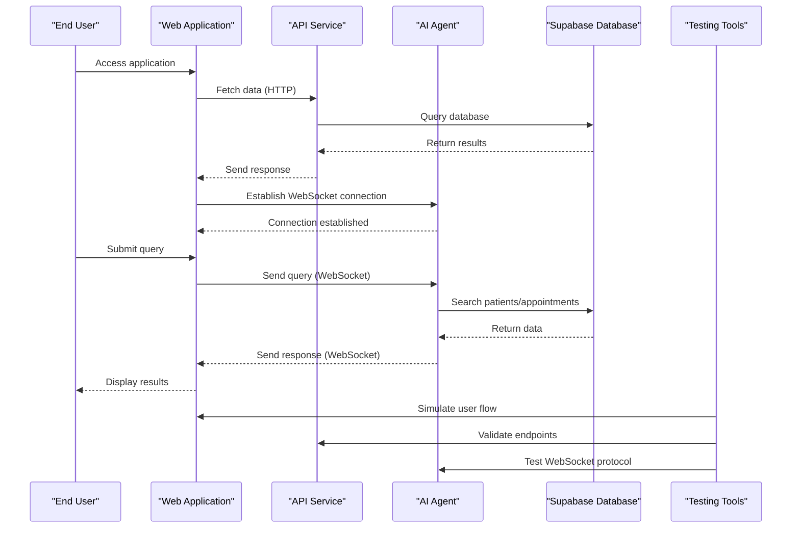
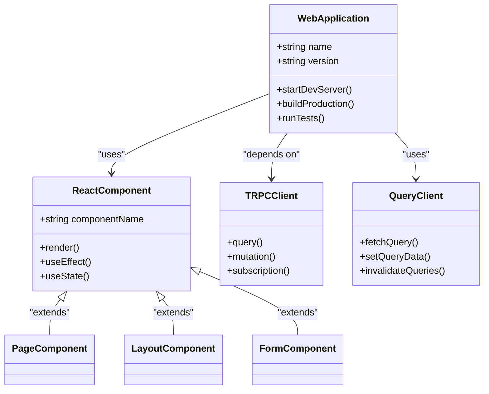
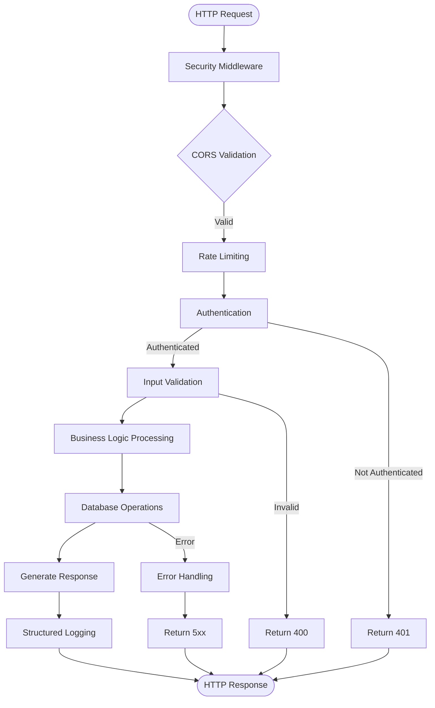
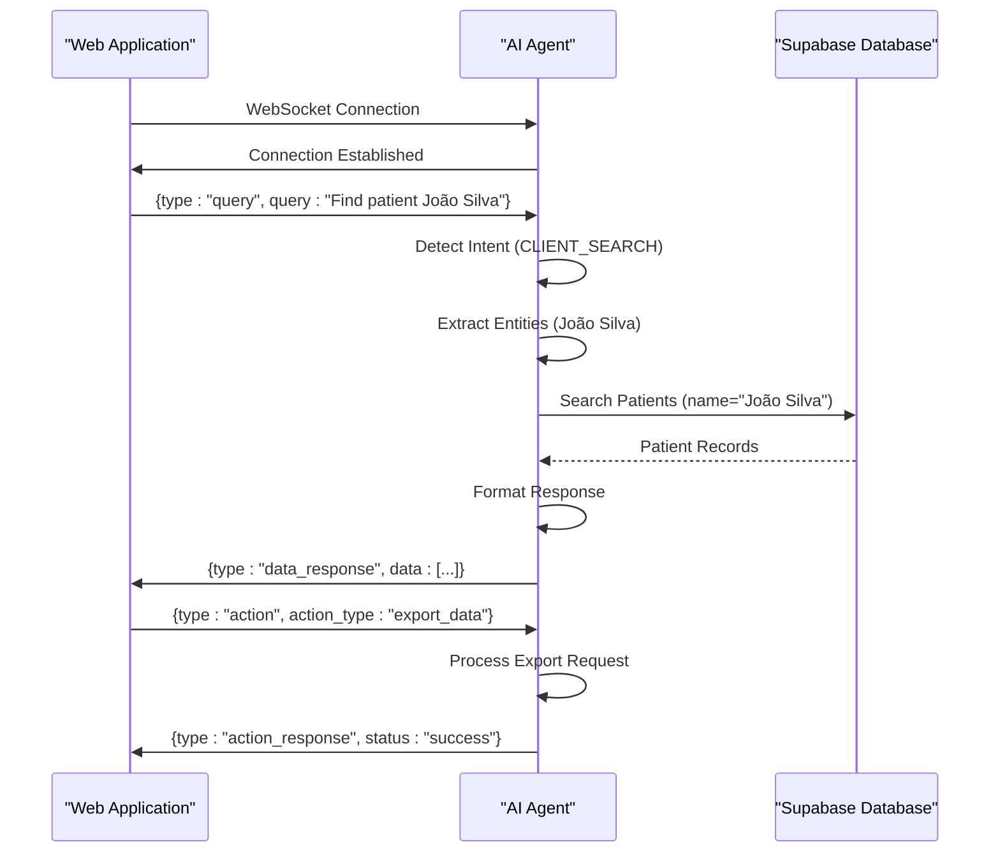
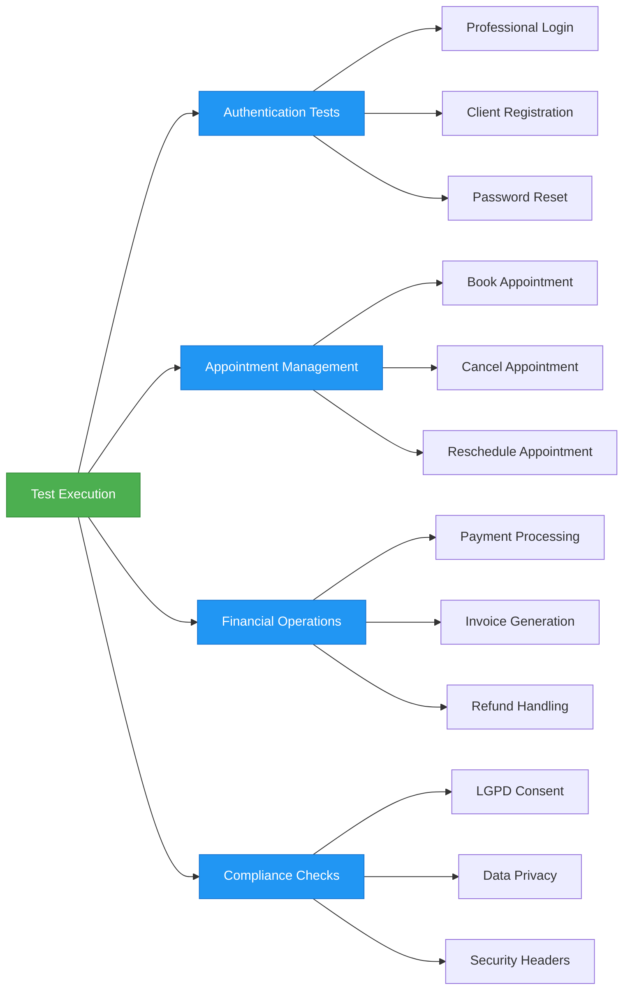

# Apps Directory

<cite>
**Referenced Files in This Document**
- [main.py](file://apps/ai-agent/main.py)
- [config.py](file://apps/ai-agent/config.py)
- [agent_service.py](file://apps/ai-agent/services/agent_service.py)
- [database_service.py](file://apps/ai-agent/services/database_service.py)
- [websocket_manager.py](file://apps/ai-agent/services/websocket_manager.py)
- [package.json](file://apps/api/package.json)
- [index.ts](file://apps/api/src/index.ts)
- [app.ts](file://apps/api/src/app.ts)
- [package.json](file://apps/tools/package.json)
- [clinic-authentication.spec.ts](file://apps/tools/e2e/clinic-authentication.spec.ts)
- [package.json](file://apps/web/package.json)
- [main.tsx](file://apps/web/src/main.tsx)
- [TRPCProvider.tsx](file://apps/web/src/components/providers/TRPCProvider.tsx)
</cite>

## Table of Contents
1. [Introduction](#introduction)
2. [Project Structure](#project-structure)
3. [Core Components](#core-components)
4. [Architecture Overview](#architecture-overview)
5. [Detailed Component Analysis](#detailed-component-analysis)
6. [Dependency Analysis](#dependency-analysis)
7. [Performance Considerations](#performance-considerations)
8. [Troubleshooting Guide](#troubleshooting-guide)
9. [Conclusion](#conclusion)

## Introduction
The apps directory serves as the central container for all main applications within the neonpro monorepo, organizing distinct but interconnected services that form a comprehensive healthcare platform for Brazilian aesthetic clinics. This directory follows a monorepo architecture pattern, housing four primary applications: web (frontend), api (backend), ai-agent (AI services), and tools (testing infrastructure). Each application has its own dedicated subdirectory with independent configuration, dependencies, and build processes while sharing common components through the packages directory. The web application provides the user interface using React and Vite, the API service handles backend logic with the Hono framework, the AI agent delivers intelligent processing capabilities via FastAPI in Python, and the tools application ensures quality through end-to-end testing with Playwright. This structure enables teams to develop, test, and deploy applications independently while maintaining shared standards and facilitating cross-application communication through well-defined APIs and WebSockets.

## Project Structure
The apps directory contains four main applications, each serving a specific purpose within the NeonPro ecosystem. The web application implements the frontend user interface with React and Vite, providing a modern healthcare platform experience. The api application hosts the backend services built with the Hono framework, exposing RESTful endpoints and tRPC interfaces for data access and business logic. The ai-agent application runs AI processing services using FastAPI in Python, enabling natural language interactions and data analysis. The tools application manages end-to-end testing infrastructure with Playwright, ensuring application reliability across different scenarios. Each application maintains its own package.json file for dependency management, configuration files for build processes, and source code organized according to functional responsibilities. This structure supports independent development workflows while allowing for shared functionality through the packages directory at the repository root.



**Diagram sources**
- [package.json](file://apps/web/package.json)
- [package.json](file://apps/api/package.json)
- [main.py](file://apps/ai-agent/main.py)
- [package.json](file://apps/tools/package.json)

**Section sources**
- [package.json](file://apps/web/package.json)
- [package.json](file://apps/api/package.json)
- [main.py](file://apps/ai-agent/main.py)
- [package.json](file://apps/tools/package.json)

## Core Components
The core components of the apps directory include the web application built with React and Vite for user interface presentation, the API service utilizing the Hono framework for backend logic execution, the AI agent implemented with FastAPI in Python for artificial intelligence processing, and the tools application leveraging Playwright for end-to-end testing. These components work together to deliver a comprehensive healthcare platform with specialized responsibilities. The web application serves as the primary user interface, implementing React components with TypeScript and supporting Progressive Web App features. The API service exposes both RESTful endpoints and tRPC interfaces, handling authentication, data validation, and business logic operations. The AI agent processes natural language queries through WebSocket connections, integrating with Supabase for database access and implementing RAG capabilities for healthcare data retrieval. The tools application executes automated tests across different user roles and device types, validating authentication flows, appointment management, and compliance requirements.

**Section sources**
- [package.json](file://apps/web/package.json)
- [package.json](file://apps/api/package.json)
- [main.py](file://apps/ai-agent/main.py)
- [package.json](file://apps/tools/package.json)

## Architecture Overview
The architecture of the apps directory follows a microservices-inspired monorepo pattern where each application operates as an independent service with its own technology stack, configuration, and deployment lifecycle. The web application acts as the frontend client, communicating with the API service through HTTP requests and tRPC calls while establishing WebSocket connections to the AI agent for real-time interactions. The API service serves as the backend gateway, exposing endpoints for data access, authentication, and business logic while forwarding AI-specific requests to the AI agent when necessary. The AI agent operates as a specialized service handling natural language processing and data retrieval tasks, connecting directly to the Supabase database for patient information and appointment data. The tools application functions as a testing harness, simulating user interactions across different roles and devices to validate system behavior. Communication between components occurs through standardized protocols including HTTP/HTTPS for RESTful interactions, WebSockets for real-time messaging, and environment variables for configuration sharing.



**Diagram sources**
- [main.tsx](file://apps/web/src/main.tsx)
- [index.ts](file://apps/api/src/index.ts)
- [main.py](file://apps/ai-agent/main.py)
- [clinic-authentication.spec.ts](file://apps/tools/e2e/clinic-authentication.spec.ts)

## Detailed Component Analysis

### Web Application Analysis
The web application serves as the user-facing interface for the NeonPro platform, built with React and Vite to provide a responsive and interactive experience for both clinic professionals and clients. Implemented as a single-page application, it leverages React Router for navigation, TanStack Query for data fetching and caching, and tRPC for type-safe communication with the backend API. The application supports Progressive Web App features including offline functionality through service workers and installability on mobile devices. Authentication is handled through Supabase integration, with role-based access control determining which dashboard features are available to different user types. The UI components are organized into reusable modules following atomic design principles, with styling managed through Tailwind CSS and component libraries. Data state is managed centrally using React Query, reducing the need for prop drilling and improving performance through intelligent caching strategies.



**Diagram sources**
- [package.json](file://apps/web/package.json)
- [main.tsx](file://apps/web/src/main.tsx)
- [TRPCProvider.tsx](file://apps/web/src/components/providers/TRPCProvider.tsx)

**Section sources**
- [package.json](file://apps/web/package.json)
- [main.tsx](file://apps/web/src/main.tsx)
- [TRPCProvider.tsx](file://apps/web/src/components/providers/TRPCProvider.tsx)

### API Service Analysis
The API service functions as the backend engine for the NeonPro platform, implemented with the Hono framework to provide high-performance HTTP handling with minimal overhead. It exposes multiple entry points including RESTful endpoints, tRPC routes, and OpenAPI-compliant interfaces, allowing clients to interact with the system through various protocols. The service implements comprehensive middleware for security, error handling, rate limiting, and logging, ensuring compliance with Brazilian healthcare regulations such as LGPD. Authentication is managed through JWT tokens with role-based access control, while data validation uses Zod schemas to ensure input integrity. The API connects to the Supabase database through Prisma ORM, abstracting database operations and providing type safety. Monitoring and observability features include structured logging, error tracking with Sentry, and performance metrics collection, enabling proactive issue detection and resolution.



**Diagram sources**
- [package.json](file://apps/api/package.json)
- [index.ts](file://apps/api/src/index.ts)
- [app.ts](file://apps/api/src/app.ts)

**Section sources**
- [package.json](file://apps/api/package.json)
- [index.ts](file://apps/api/src/index.ts)
- [app.ts](file://apps/api/src/app.ts)

### AI Agent Analysis
The AI agent provides intelligent processing capabilities for the NeonPro platform, implemented with FastAPI in Python to leverage advanced AI libraries and frameworks. It operates as a standalone service accessible through both WebSocket and RESTful interfaces, enabling real-time interactions and batch processing of natural language queries. The agent implements Retrieval-Augmented Generation (RAG) patterns to answer questions about patient data, appointments, and financial records by retrieving relevant information from the database before generating responses. Intent detection algorithms classify user queries into categories such as client search, appointment inquiry, or financial request, routing them to appropriate handlers. Entity extraction identifies names, CPF numbers, dates, and other relevant information from natural language input, improving the accuracy of database queries. The service maintains conversation history through memory buffers, allowing for context-aware interactions across multiple turns. Security measures include JWT validation, input sanitization, and audit logging to ensure compliance with healthcare privacy regulations.



**Diagram sources**
- [main.py](file://apps/ai-agent/main.py)
- [agent_service.py](file://apps/ai-agent/services/agent_service.py)
- [database_service.py](file://apps/ai-agent/services/database_service.py)

**Section sources**
- [main.py](file://apps/ai-agent/main.py)
- [config.py](file://apps/ai-agent/config.py)
- [agent_service.py](file://apps/ai-agent/services/agent_service.py)
- [database_service.py](file://apps/ai-agent/services/database_service.py)
- [websocket_manager.py](file://apps/ai-agent/services/websocket_manager.py)

### Tools Application Analysis
The tools application provides end-to-end testing infrastructure for the NeonPro platform, implemented with Playwright to automate browser interactions across different devices and user roles. It contains test suites for authentication flows, appointment management, financial operations, and compliance requirements, ensuring the system behaves correctly under various scenarios. Tests are organized by feature area and user type, with separate specifications for clinic professionals and clients. The testing framework supports multiple execution modes including headless, headed, and debugging configurations, allowing developers to choose the appropriate level of visibility during test runs. Accessibility checks verify compliance with WCAG standards, while performance testing ensures pages load within acceptable time limits. Test reports provide detailed information about failures, including screenshots, videos, and trace logs, facilitating rapid diagnosis and resolution of issues. The tools also support visual regression testing, detecting unintended changes to the user interface across deployments.



**Diagram sources**
- [package.json](file://apps/tools/package.json)
- [clinic-authentication.spec.ts](file://apps/tools/e2e/clinic-authentication.spec.ts)

**Section sources**
- [package.json](file://apps/tools/package.json)
- [clinic-authentication.spec.ts](file://apps/tools/e2e/clinic-authentication.spec.ts)

## Dependency Analysis
The applications within the apps directory maintain their own dependency trees while sharing common functionality through the packages directory at the repository root. Each application specifies its dependencies in a package.json file (for JavaScript/TypeScript applications) or requirements.txt (for Python applications), allowing for independent version management and updates. The web and api applications share several dependencies including React, TypeScript, and testing utilities, ensuring consistency in development practices. The AI agent relies on Python-specific libraries such as FastAPI, LangChain, and Supabase client, isolated from the JavaScript ecosystem through its dedicated virtual environment. Shared components like data models, validation schemas, and utility functions are published as internal packages, consumed by multiple applications through workspace references. This approach balances independence with consistency, allowing teams to innovate within their domains while maintaining alignment on core platform standards. Version conflicts are managed through the monorepo's centralized dependency management strategy, with regular audits to identify and resolve potential issues.

```mermaid
graph TD
A[Root Dependencies] --> B[Web Dependencies]
A --> C[API Dependencies]
A --> D[Tools Dependencies]
A --> E[Shared Packages]
B --> F[React]
B --> G[Vite]
B --> H[TypeScript]
B --> I[TanStack Query]
C --> J[Hono]
C --> K[tRPC]
C --> L[Prisma]
C --> M[Zod]
D --> N[Playwright]
D --> O[Axe-Core]
D --> P[Lighthouse]
E --> Q[@neonpro/shared]
E --> R[@neonpro/types]
E --> S[@neonpro/utils]
B --> Q
B --> R
C --> Q
C --> R
C --> S
D --> R
D --> S
```

**Diagram sources**
- [package.json](file://apps/web/package.json)
- [package.json](file://apps/api/package.json)
- [package.json](file://apps/tools/package.json)
- [requirements.txt](file://apps/ai-agent/requirements.txt)

## Performance Considerations
Performance optimization across the apps directory involves careful consideration of both individual application characteristics and cross-application interactions. The web application employs code splitting, lazy loading, and asset optimization to minimize initial load times and improve runtime performance. The API service implements query timeout middleware, compression, and caching strategies to ensure responses meet healthcare compliance requirements for responsiveness. The AI agent utilizes connection pooling, message batching, and efficient database queries to handle concurrent WebSocket connections without degradation in service quality. End-to-end tests measure critical user journeys, identifying bottlenecks in authentication, data loading, and form submission workflows. Monitoring infrastructure tracks key performance indicators including API response times, WebSocket latency, and page load metrics, triggering alerts when thresholds are exceeded. Deployment configurations optimize resource allocation based on expected traffic patterns, with auto-scaling rules to handle peak loads during business hours. These measures collectively ensure the platform delivers a responsive and reliable experience for users across different network conditions and device capabilities.

## Troubleshooting Guide
Common issues in the apps directory typically involve configuration mismatches, dependency conflicts, or communication failures between applications. When adding new applications to the monorepo, ensure proper workspace configuration in package.json files and consistent naming conventions across directories. For dependency management issues, verify that shared packages are correctly referenced as workspace dependencies and that version ranges do not create conflicts. API connectivity problems often stem from incorrect environment variables or firewall restrictions; validate configuration settings in .env files and ensure required ports are accessible. WebSocket connection failures may indicate SSL/TLS configuration issues or CORS policy violations; check certificate validity and origin whitelisting settings. Testing infrastructure problems frequently relate to browser compatibility or timing issues; adjust timeouts and use waitFor methods appropriately in Playwright tests. When encountering build errors, clear node_modules directories and reinstall dependencies to resolve corrupted installations. Monitor logs from all applications simultaneously to identify cascading failures and correlation between events across services.

**Section sources**
- [package.json](file://apps/web/package.json)
- [package.json](file://apps/api/package.json)
- [main.py](file://apps/ai-agent/main.py)
- [package.json](file://apps/tools/package.json)

## Conclusion
The apps directory represents a well-structured monorepo implementation that effectively balances modularity with integration, enabling independent development of specialized applications while maintaining a cohesive platform experience. By separating concerns into distinct applications—web for user interface, api for business logic, ai-agent for intelligent processing, and tools for quality assurance—the architecture supports scalable growth and focused team ownership. The use of standardized technologies within each application domain allows developers to leverage domain-specific optimizations while shared packages promote consistency across the ecosystem. Communication patterns through APIs and WebSockets enable loose coupling between components, facilitating independent deployment and versioning. This structure provides a solid foundation for future expansion, allowing new applications to be added following established patterns while maintaining the overall integrity and performance of the NeonPro platform.