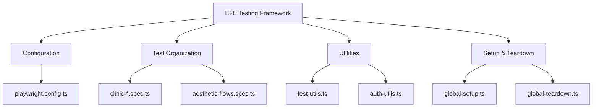
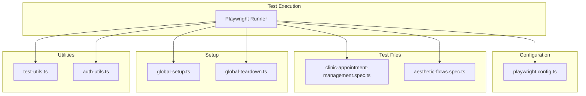
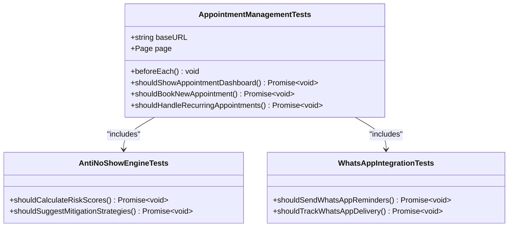
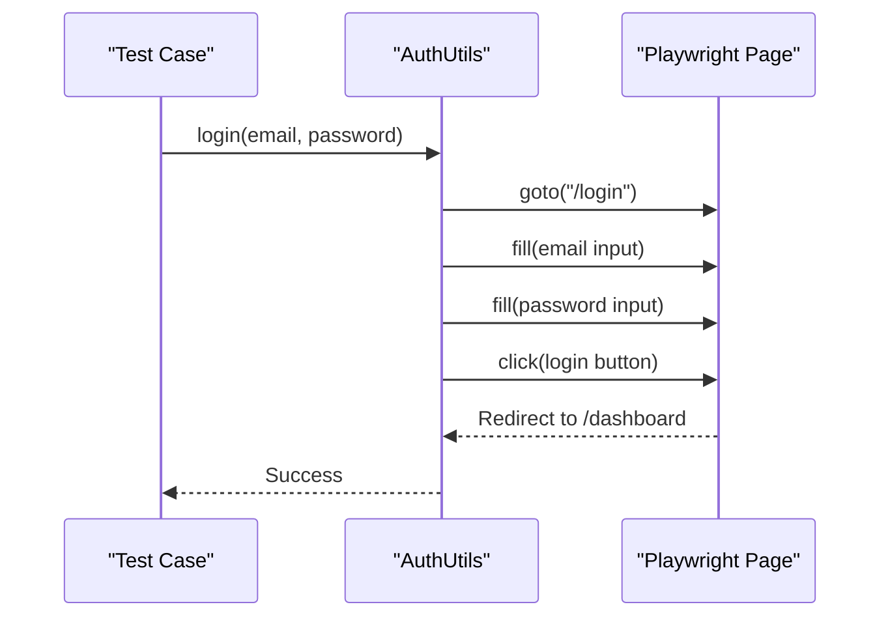
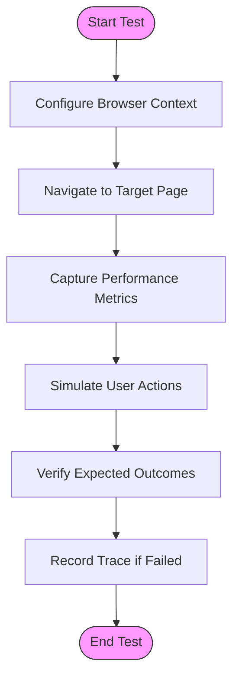
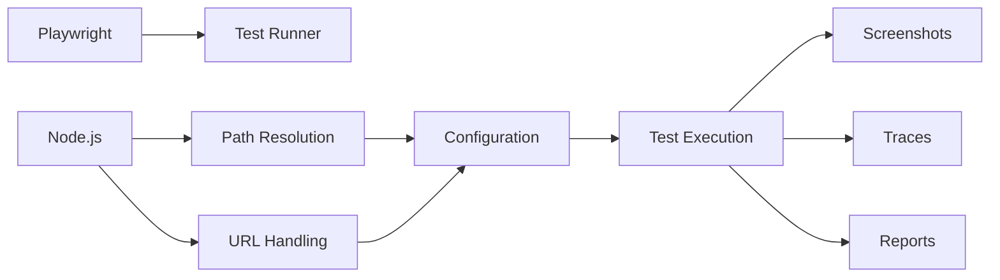

# Tools Infrastructure

<cite>
**Referenced Files in This Document **
- [playwright.config.ts](file://apps/tools/playwright.config.ts)
- [clinic-appointment-management.spec.ts](file://apps/tools/e2e/clinic-appointment-management.spec.ts)
- [aesthetic-flows.spec.ts](file://apps/tools/e2e/aesthetic-flows.spec.ts)
- [global-setup.ts](file://apps/tools/e2e/setup/global-setup.ts)
- [global-teardown.ts](file://apps/tools/e2e/setup/global-teardown.ts)
- [test-utils.ts](file://apps/tools/e2e/utils/test-utils.ts)
- [auth-utils.ts](file://apps/tools/e2e/utils/auth-utils.ts)
</cite>

## Table of Contents

1. [Introduction](#introduction)
2. [Project Structure](#project-structure)
3. [Core Components](#core-components)
4. [Architecture Overview](#architecture-overview)
5. [Detailed Component Analysis](#detailed-component-analysis)
6. [Dependency Analysis](#dependency-analysis)
7. [Performance Considerations](#performance-considerations)
8. [Troubleshooting Guide](#troubleshooting-guide)
9. [Conclusion](#conclusion)

## Introduction

The tools infrastructure in the neonpro repository serves as the testing and quality assurance framework for the healthcare application, with a primary focus on end-to-end (E2E) testing using Playwright. This framework ensures critical user workflows are thoroughly tested across various scenarios, particularly those relevant to aesthetic clinics. The system is designed to validate functionality, performance, and compliance with healthcare regulations such as LGPD. It supports multiple test environments, including desktop, mobile, and tablet configurations, and integrates seamlessly with CI/CD pipelines to maintain high software quality standards.

## Project Structure

The E2E testing infrastructure is organized under the `apps/tools/e2e` directory, which contains specialized subdirectories for different aspects of testing. The structure includes dedicated folders for authentication tests, setup scripts, utility functions, and individual test files that target specific clinic workflows. Configuration is managed through Playwright's configuration file, while reusable utilities and test helpers are encapsulated in separate modules to promote code reuse and maintainability.

**Diagram sources **

- [playwright.config.ts](file://apps/tools/playwright.config.ts)
- [clinic-appointment-management.spec.ts](file://apps/tools/e2e/clinic-appointment-management.spec.ts)
- [aesthetic-flows.spec.ts](file://apps/tools/e2e/aesthetic-flows.spec.ts)

**Section sources**

- [playwright.config.ts](file://apps/tools/playwright.config.ts)
- [apps/tools/e2e](file://apps/tools/e2e)

## Core Components

The core components of the tools infrastructure include the Playwright configuration, test specification files, global setup and teardown scripts, and utility classes for authentication and general test operations. These components work together to provide a robust testing environment that can simulate real-world user interactions, manage test data, and verify application behavior under various conditions.

**Section sources**

- [playwright.config.ts](file://apps/tools/playwright.config.ts)
- [clinic-appointment-management.spec.ts](file://apps/tools/e2e/clinic-appointment-management.spec.ts)
- [aesthetic-flows.spec.ts](file://apps/tools/e2e/aesthetic-flows.spec.ts)

## Architecture Overview

The architecture of the E2E testing framework is built around Playwright's capabilities for browser automation, with an emphasis on scalability, reliability, and ease of maintenance. Tests are organized by workflow domains such as appointment management, authentication, and treatment planning. The framework leverages global setup and teardown hooks to initialize and clean up test environments, ensuring isolation between test runs. Configuration options allow for parallel execution, screenshot capture on failure, and trace recording for debugging purposes.

**Diagram sources **

- [playwright.config.ts](file://apps/tools/playwright.config.ts)
- [clinic-appointment-management.spec.ts](file://apps/tools/e2e/clinic-appointment-management.spec.ts)
- [aesthetic-flows.spec.ts](file://apps/tools/e2e/aesthetic-flows.spec.ts)
- [global-setup.ts](file://apps/tools/e2e/setup/global-setup.ts)
- [global-teardown.ts](file://apps/tools/e2e/setup/global-teardown.ts)

## Detailed Component Analysis

### Test Organization by Clinic Workflows

The test suite is organized around key clinic workflows, with each major functionality area having its own dedicated test file. For example, `clinic-appointment-management.spec.ts` focuses on appointment-related features such as booking, editing, and canceling appointments, while also covering advanced features like AI-driven time optimization and no-show risk assessment. This modular approach allows teams to easily locate and extend tests for specific domains.

#### For Object-Oriented Components:

**Diagram sources **

- [clinic-appointment-management.spec.ts](file://apps/tools/e2e/clinic-appointment-management.spec.ts)

**Section sources**

- [clinic-appointment-management.spec.ts](file://apps/tools/e2e/clinic-appointment-management.spec.ts)

### Authentication Testing Patterns

Authentication testing follows a consistent pattern across different user roles, leveraging reusable utility functions defined in `auth-utils.ts`. The `AuthUtils` class provides methods for logging in, registering, resetting passwords, and verifying user state, which are used across multiple test files. This abstraction simplifies test creation and ensures consistency in how authentication flows are tested.

#### For API/Service Components:

**Diagram sources **

- [auth-utils.ts](file://apps/tools/e2e/utils/auth-utils.ts)

**Section sources**

- [auth-utils.ts](file://apps/tools/e2e/utils/auth-utils.ts)

### Performance Measurement Capabilities

The framework includes built-in support for performance measurement through Playwright's metrics collection and custom utility functions. The `TestUtils` class provides a `getPerformanceMetrics()` method that captures browser-level performance data, while Playwright's tracing feature records detailed execution timelines for failed tests. Configuration settings optimize performance testing with appropriate timeouts and viewport sizes.

#### For Complex Logic Components:

**Diagram sources **

- [test-utils.ts](file://apps/tools/e2e/utils/test-utils.ts)
- [playwright.config.ts](file://apps/tools/playwright.config.ts)

**Section sources**

- [test-utils.ts](file://apps/tools/e2e/utils/test-utils.ts)
- [playwright.config.ts](file://apps/tools/playwright.config.ts)

## Dependency Analysis

The E2E testing framework depends on several external libraries and internal modules to function correctly. The primary dependency is Playwright itself, which provides the browser automation capabilities. Additional dependencies include Node.js built-in modules for path resolution and URL handling. Internally, the framework relies on shared utilities and configuration files to maintain consistency across test runs.

**Diagram sources **

- [playwright.config.ts](file://apps/tools/playwright.config.ts)

**Section sources**

- [playwright.config.ts](file://apps/tools/playwright.config.ts)

## Performance Considerations

The framework is configured with performance optimizations that balance thoroughness with execution speed. Key considerations include parallel test execution, controlled retry policies, and efficient resource utilization. In CI environments, tests run with reduced concurrency and increased retries to handle transient failures, while local development allows for faster feedback loops. Screenshot and video capture are strategically enabled only on failure or first retry to minimize storage overhead without sacrificing debuggability.

## Troubleshooting Guide

Common issues in the E2E testing framework include flaky tests due to timing inconsistencies, synchronization problems with asynchronous operations, and test data management challenges. To address these, the framework employs explicit waiting strategies, robust element locators, and isolated test environments. Flaky tests should be investigated for race conditions or unstable network dependencies. When extending the test suite, new scenarios should follow existing patterns for fixture management and leverage the provided utility functions to ensure consistency.

**Section sources**

- [test-utils.ts](file://apps/tools/e2e/utils/test-utils.ts)
- [global-setup.ts](file://apps/tools/e2e/setup/global-setup.ts)
- [global-teardown.ts](file://apps/tools/e2e/setup/global-teardown.ts)

## Conclusion

The tools infrastructure in the neonpro repository provides a comprehensive foundation for end-to-end testing of the healthcare application. By organizing tests around clinic workflows, standardizing authentication patterns, and incorporating performance measurement capabilities, it enables reliable validation of critical user journeys. The use of Playwright ensures cross-browser compatibility and rich debugging features, while thoughtful configuration and utility abstractions make the framework accessible to both beginners and experienced developers. As the application evolves, this infrastructure will continue to serve as a vital safeguard for quality and compliance.
