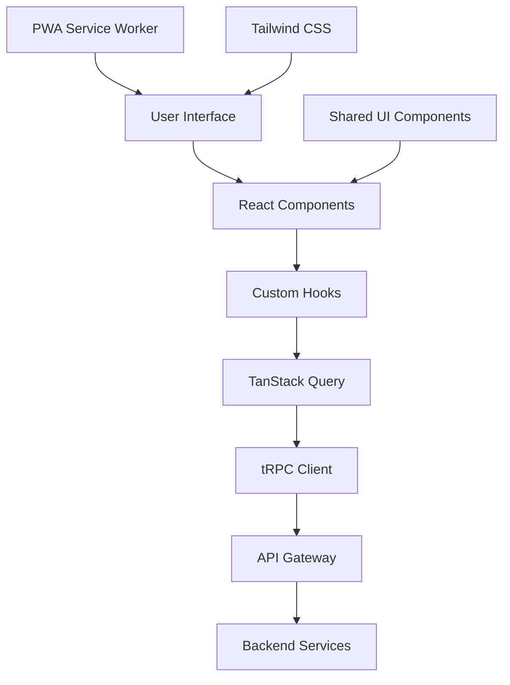
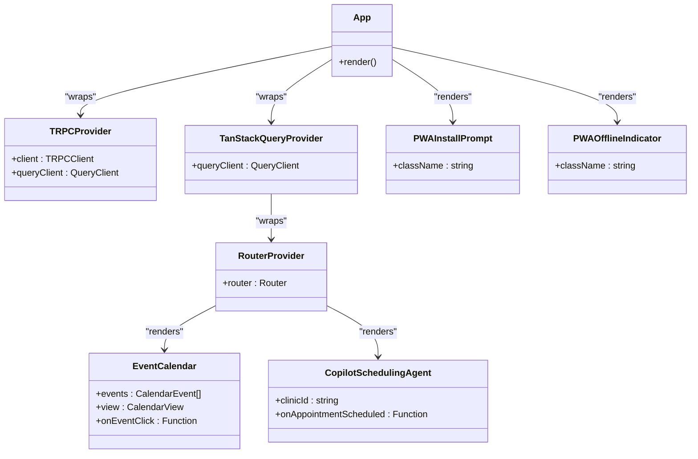
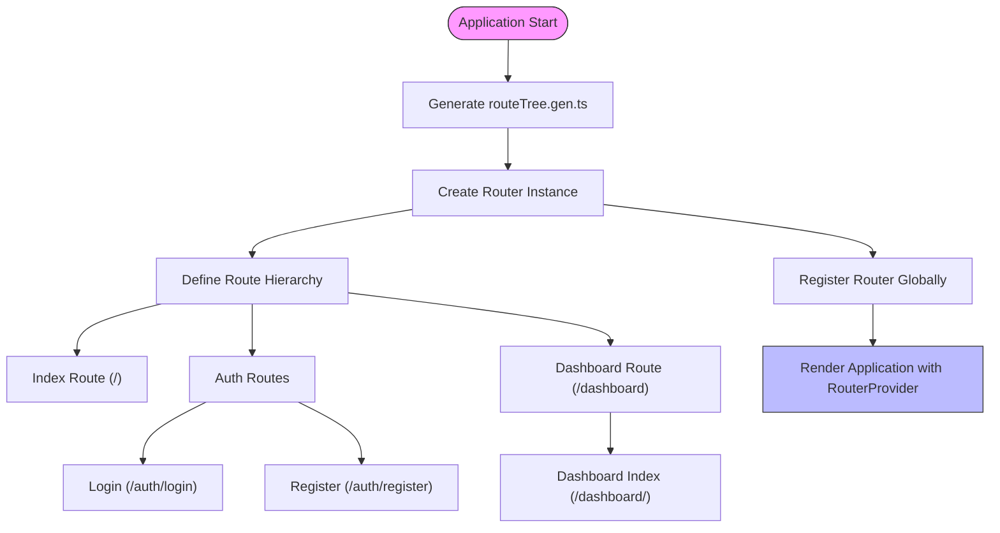
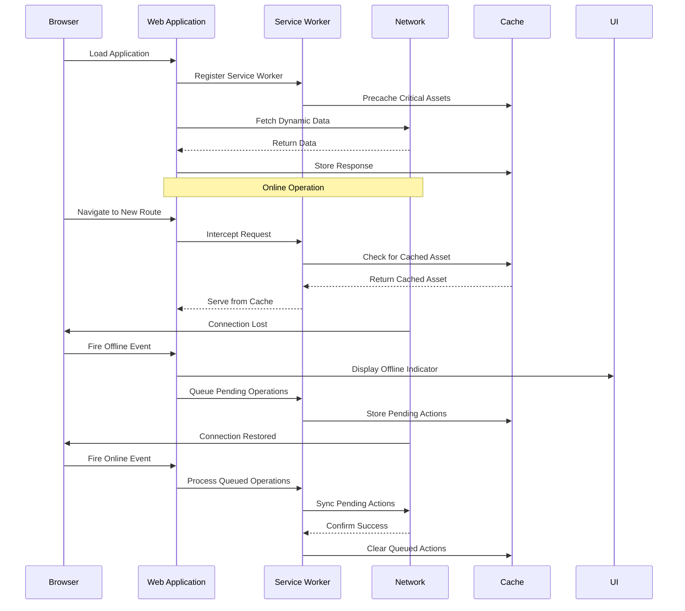
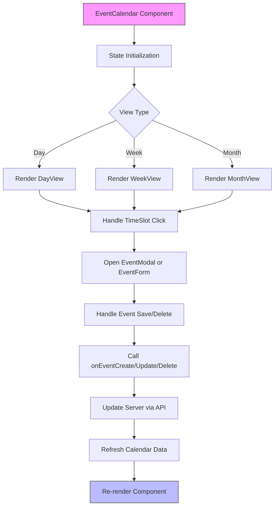
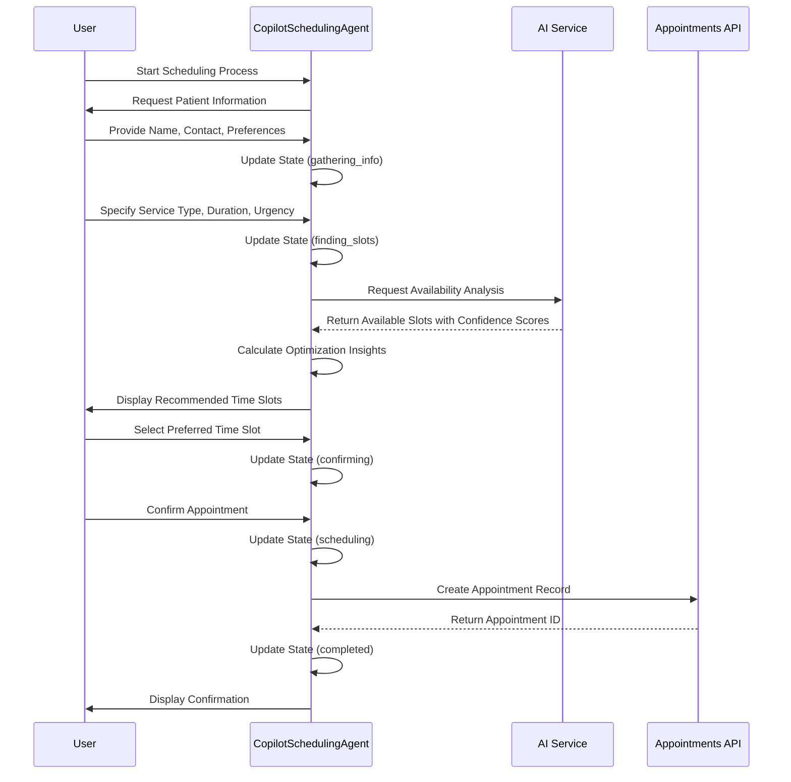

# Web Application

<cite>
**Referenced Files in This Document**
- [App.tsx](file://apps/web/src/App.tsx)
- [main.tsx](file://apps/web/src/main.tsx)
- [routeTree.gen.ts](file://apps/web/src/routeTree.gen.ts)
- [router.ts](file://apps/web/src/router.ts)
- [EventCalendar.tsx](file://apps/web/src/components/event-calendar/EventCalendar.tsx)
- [copilot-scheduling-agent.tsx](file://apps/web/src/components/ai-scheduling/copilot-scheduling-agent.tsx)
- [TRPCProvider.tsx](file://apps/web/src/components/providers/TRPCProvider.tsx)
- [TanStackQueryProvider.tsx](file://apps/web/src/components/providers/TanStackQueryProvider.tsx)
</cite>

## Table of Contents

1. [Introduction](#introduction)
2. [Architecture Overview](#architecture-overview)
3. [Component Hierarchy](#component-hierarchy)
4. [Routing System](#routing-system)
5. [State Management](#state-management)
6. [Backend Integration](#backend-integration)
7. [PWA Capabilities](#pwa-capabilities)
8. [Theming with Tailwind CSS](#theming-with-tailwind-css)
9. [Shared UI Components](#shared-ui-components)
10. [Performance Optimization](#performance-optimization)
11. [Accessibility Features](#accessibility-features)
12. [Testing Setup](#testing-setup)
13. [Common Issues and Solutions](#common-issues-and-solutions)
14. [Practical Examples](#practical-examples)

## Introduction

The web application in the neonpro repository serves as the frontend interface for a healthcare platform, built using React and Vite. It provides user interaction capabilities and handles presentation layer functionality for aesthetic clinics in Brazil. The application is designed to be responsive, accessible, and performant, with progressive web app (PWA) capabilities that allow offline functionality and installation on user devices.

As the primary user-facing component of the system, this web application integrates with various backend services through tRPC and REST APIs to provide real-time data synchronization and AI-powered features. It follows modern React patterns including component-based architecture, hooks for state management, and server-side rendering capabilities. The application supports multiple workflows including patient management, appointment scheduling, treatment planning, and financial operations.

The codebase emphasizes type safety through TypeScript, with comprehensive typing across components, props, and API interactions. It leverages modern tooling including Vite for fast development builds, TanStack Router for routing, and React Query for data fetching and caching. The application also implements internationalization support and adheres to Brazilian healthcare regulations (LGPD) in its data handling practices.

**Section sources**

- [App.tsx](file://apps/web/src/App.tsx#L1-L95)
- [main.tsx](file://apps/web/src/main.tsx#L1-L98)

## Architecture Overview

The web application follows a layered architecture pattern with clear separation between presentation, state management, and data access layers. At its core, it uses React 19 with TypeScript, providing type safety throughout the codebase. The build system is powered by Vite, offering rapid development server startup and hot module replacement.

The application structure is organized into several key directories within `apps/web/src`: components, hooks, integrations, routes, styles, types, and utils. This organization follows feature-based grouping principles, making it easier to locate related functionality. The entry point is `main.tsx`, which initializes the React application and sets up global providers for state management and routing.

Data flow in the application follows unidirectional patterns, with state changes propagated through React's context API and custom hooks. The application uses a combination of client-side state (via React useState and useReducer) and server-state management (via TanStack Query) to maintain consistency between UI and backend data. Error boundaries are implemented at strategic points to prevent cascading failures.

**Diagram sources **

- [main.tsx](file://apps/web/src/main.tsx#L1-L98)
- [App.tsx](file://apps/web/src/App.tsx#L1-L95)

**Section sources**

- [main.tsx](file://apps/web/src/main.tsx#L1-L98)
- [App.tsx](file://apps/web/src/App.tsx#L1-L95)

## Component Hierarchy

The application follows a well-defined component hierarchy with atomic design principles. Components are organized in the `src/components` directory with subdirectories for major feature areas such as event-calendar, ai-scheduling, chat, and ui. The root component is App.tsx, which serves as the top-level container for all other components.

At the foundation are primitive UI components like Button, Input, Card, and Badge located in `components/ui`. These are built using Radix UI primitives for accessibility and wrapped with Tailwind CSS for styling. Higher-level components compose these primitives to create domain-specific interfaces such as the EventCalendar and CopilotSchedulingAgent.

Specialized provider components like TRPCProvider and TanStackQueryProvider sit near the top of the component tree, supplying context to all child components. PWA-related components such as PWAInstallPrompt and PWAOfflineIndicator are rendered directly in the App component to ensure they're available throughout the application lifecycle.

The component hierarchy enforces reusability and maintainability through strict prop typing and separation of concerns. Presentational components are kept separate from logic components, with hooks used to encapsulate reusable behavior. This allows components to remain focused on their specific responsibilities while sharing common functionality through the hook system.

**Diagram sources **

- [App.tsx](file://apps/web/src/App.tsx#L1-L95)
- [components/event-calendar/EventCalendar.tsx](file://apps/web/src/components/event-calendar/EventCalendar.tsx#L1-L241)
- [components/ai-scheduling/copilot-scheduling-agent.tsx](file://apps/web/src/components/ai-scheduling/copilot-scheduling-agent.tsx#L1-L524)

**Section sources**

- [App.tsx](file://apps/web/src/App.tsx#L1-L95)
- [components/event-calendar/EventCalendar.tsx](file://apps/web/src/components/event-calendar/EventCalendar.tsx#L1-L241)
- [components/ai-scheduling/copilot-scheduling-agent.tsx](file://apps/web/src/components/ai-scheduling/copilot-scheduling-agent.tsx#L1-L524)

## Routing System

The application implements a robust routing system using TanStack Router, with route definitions generated automatically in `routeTree.gen.ts`. This file is auto-generated based on the directory structure under `src/routes`, following a file-based routing convention. The router configuration is initialized in `router.ts` and consumed by the `RouterProvider` component.

Route definitions include metadata such as path, ID, and parent-child relationships, enabling nested layouts and complex navigation patterns. The system supports dynamic routing, route guards, and lazy loading of route components to optimize bundle size. Routes are organized by feature area such as aesthetic-scheduling, ai-clinical-support, analytics, auth, compliance, coordination, dashboard, financial-management, inventory, patient-engagement, and treatment-plans.

The routing system integrates with authentication flows, redirecting unauthenticated users from protected routes to the login page. It also supports query parameters and URL state management, allowing deep linking and bookmarkable URLs. Route transitions are handled smoothly with React's concurrent features, preventing layout shifts during navigation.

Type safety is enforced throughout the routing system, with generated types ensuring that route parameters and search parameters are properly typed. This prevents runtime errors related to incorrect parameter usage and provides excellent developer experience with autocomplete and error detection in IDEs.

**Diagram sources **

- [routeTree.gen.ts](file://apps/web/src/routeTree.gen.ts#L1-L113)
- [router.ts](file://apps/web/src/router.ts#L1-L11)

**Section sources**

- [routeTree.gen.ts](file://apps/web/src/routeTree.gen.ts#L1-L113)
- [router.ts](file://apps/web/src/router.ts#L1-L11)

## State Management

The application employs a hybrid state management approach combining React's built-in state mechanisms with external libraries for different concerns. For local component state, React hooks like useState, useReducer, and useCallback are used extensively. For global client state and server state, TanStack Query provides a powerful caching and synchronization layer.

The `TanStackQueryProvider` wraps the entire application, providing a shared QueryClient instance configured with optimal settings for stale time, garbage collection, and refetch behavior. Queries are automatically deduplicated and cached, reducing unnecessary network requests. Mutations are handled with proper optimistic updates and error rollback capabilities.

For tRPC integration, the `TRPCProvider` connects the frontend to backend procedures through type-safe endpoints. This enables autocompletion and compile-time checking of API calls, significantly reducing bugs related to incorrect API usage. The tRPC client is configured with proper error handling and retry logic.

In AI-powered components like the CopilotSchedulingAgent, CopilotKit's useCoAgent hook provides agent-based state management, allowing complex workflows to be represented as state machines. This is combined with useCopilotAction and useCopilotReadable hooks to expose functionality to AI assistants while maintaining proper React reactivity.

Form state is managed using controlled components with validation handled through custom hooks. Complex forms like appointment creation use context providers to share state between multiple components without prop drilling. All state changes are instrumented with proper error boundaries to prevent crashes.

**Section sources**

- [TanStackQueryProvider.tsx](file://apps/web/src/components/providers/TanStackQueryProvider.tsx#L1-L57)
- [TRPCProvider.tsx](file://apps/web/src/components/providers/TRPCProvider.tsx#L1-L16)
- [copilot-scheduling-agent.tsx](file://apps/web/src/components/ai-scheduling/copilot-scheduling-agent.tsx#L1-L524)

## Backend Integration

The web application integrates with backend services through both tRPC and traditional REST APIs, providing type-safe and efficient communication channels. The tRPC integration is facilitated by the TRPCProvider component, which establishes a connection to backend procedures with end-to-end TypeScript type safety.

tRPC is used for most application data needs, exposing backend functions as if they were local methods while handling serialization, networking, and error handling transparently. This approach eliminates the need for separate API documentation and reduces bugs caused by mismatched request/response schemas. Authentication headers and other contextual information are automatically included in requests.

For AI agent communication, WebSocket connections are established to the AI Agent service, enabling real-time bidirectional communication for conversational interfaces. The AG-UI protocol is implemented over WebSockets, allowing rich interactions between the frontend and AI agents that process healthcare data queries.

REST APIs are used for specific endpoints that don't require the full tRPC feature set, such as file uploads or third-party service integrations. These are accessed through standard fetch calls with proper error handling and retry logic. The application also implements service workers to cache API responses and enable offline functionality.

Environment-specific configuration ensures that API endpoints point to the correct backend instances based on deployment environment. Security measures include proper CORS configuration, HTTPS enforcement, and input validation to prevent injection attacks. All sensitive data transmissions are encrypted in transit.

**Section sources**

- [TRPCProvider.tsx](file://apps/web/src/components/providers/TRPCProvider.tsx#L1-L16)
- [copilot-scheduling-agent.tsx](file://apps/web/src/components/ai-scheduling/copilot-scheduling-agent.tsx#L1-L524)
- [App.tsx](file://apps/web/src/App.tsx#L1-L95)

## PWA Capabilities

The application is designed as a Progressive Web App (PWA) with full offline capabilities, installability, and native-like performance. Service worker registration is handled in both `main.tsx` and `App.tsx`, ensuring reliable installation across different browsers and devices.

The service worker (`sw.js`) caches critical assets and API responses, allowing the application to function even when network connectivity is lost. It implements a cache-first strategy for static assets and a network-first strategy with fallback for dynamic content. This ensures users always see the latest data when online but can continue working when offline.

PWA installation prompts are managed through the BeforeInstallPrompt event, with custom UI elements displayed to encourage users to add the app to their home screen. Once installed, the application runs in standalone mode, hiding browser chrome and providing a native app experience.

Offline status is visually indicated through the PWAOfflineIndicator component, which appears in the corner of the screen when connectivity is lost. The application continues to accept user input during offline periods, queuing actions to be synchronized when connectivity is restored.

Additional PWA features include:

- Web App Manifest with proper icons and theme colors
- Splash screen customization
- Background sync for queued operations
- Push notifications support
- Periodic background updates

These capabilities make the application suitable for clinical environments where network reliability may vary, ensuring healthcare providers can continue managing appointments and patient data regardless of internet connectivity.

**Diagram sources **

- [main.tsx](file://apps/web/src/main.tsx#L1-L98)
- [App.tsx](file://apps/web/src/App.tsx#L1-L95)
- [public/sw.js](file://apps/web/public/sw.js)

**Section sources**

- [main.tsx](file://apps/web/src/main.tsx#L1-L98)
- [App.tsx](file://apps/web/src/App.tsx#L1-L95)

## Theming with Tailwind CSS

The application utilizes Tailwind CSS for styling, providing a utility-first approach that enables rapid UI development while maintaining consistency across components. The configuration is optimized for the healthcare domain, with color palettes that meet accessibility requirements and convey appropriate medical associations.

Theme customization is implemented through the `tailwind.config.ts` file, which extends the default configuration with project-specific values. Key aspects include:

- **Color Palette**: Custom colors for primary (healthcare blue), secondary (aesthetic purple), success (green), warning (yellow), and error (red) states
- **Typography**: Font families and sizes optimized for readability in clinical settings
- **Spacing**: Consistent spacing scale for layout and component padding
- **Border Radius**: Rounded corners appropriate for modern medical applications
- **Shadows**: Subtle elevation effects for depth perception

Dark mode is supported through CSS variables and media queries, allowing users to switch between light and dark themes based on preference or ambient lighting conditions. The theme system is designed to be extensible, supporting future clinic-branded variations.

Component styling follows a consistent methodology:

1. Base styles using Tailwind utilities
2. Component-specific overrides in dedicated CSS modules when necessary
3. Responsive design using Tailwind's breakpoint system
4. Accessibility considerations like focus states and contrast ratios

The build process optimizes CSS output through PurgeCSS, removing unused utilities to minimize bundle size. This is particularly important for a PWA where download size impacts installation conversion rates.

**Section sources**

- [App.tsx](file://apps/web/src/App.tsx#L1-L95)
- [components/event-calendar/EventCalendar.tsx](file://apps/web/src/components/event-calendar/EventCalendar.tsx#L1-L241)
- [components/ai-scheduling/copilot-scheduling-agent.tsx](file://apps/web/src/components/ai-scheduling/copilot-scheduling-agent.tsx#L1-L524)

## Shared UI Components

The application leverages shared UI components from the `@neonpro/ui` package, ensuring consistency across different parts of the platform. These components are imported and used throughout the codebase, providing standardized buttons, inputs, cards, alerts, and other interface elements.

The shared component library includes:

- **Primitive Components**: Button, Input, Label, Select, Checkbox, Radio, Switch
- **Composite Components**: Form fields with validation, data tables, modals, tooltips
- **Layout Components**: Grid system, containers, aspect ratios
- **Feedback Components**: Alerts, toast notifications, progress indicators
- **Navigation Components**: Tabs, breadcrumbs, pagination

These components are designed with accessibility as a primary concern, following WCAG guidelines and implementing proper ARIA attributes. They support keyboard navigation, screen reader compatibility, and high contrast modes.

Theming is handled through CSS variables, allowing the shared components to adapt to the application's current theme (light/dark mode) and brand colors. Prop interfaces are fully typed with TypeScript, providing excellent developer experience with autocomplete and error detection.

The integration approach follows best practices:

- Components are imported individually to avoid bundling unused ones
- Props are strictly typed with interfaces defined in the shared package
- Customization is possible through className overrides
- Event handlers are passed as standard React props
- Default behaviors can be overridden when necessary

This shared component system enables rapid development of new features while maintaining visual and behavioral consistency across the application.

**Section sources**

- [components/ui/button.tsx](file://apps/web/src/components/ui/button.tsx)
- [components/ui/input.tsx](file://apps/web/src/components/ui/input.tsx)
- [components/ui/card.tsx](file://apps/web/src/components/ui/card.tsx)

## Performance Optimization

The application implements multiple performance optimization strategies to ensure fast load times, smooth interactions, and efficient resource usage. These optimizations address both initial loading performance and runtime performance.

Bundle size is minimized through several techniques:

- Code splitting via dynamic imports for routes
- Tree shaking to eliminate dead code
- Compression of assets through Vite's build process
- Lazy loading of non-critical components
- Deduplication of dependencies through pnpm workspaces

Critical rendering path optimization includes:

- Inlining of above-the-fold CSS
- Preloading of key resources
- Minification of JavaScript and CSS
- Image optimization with appropriate formats and sizes
- Efficient font loading strategies

Runtime performance is enhanced through:

- Memoization of expensive calculations with useMemo
- Prevention of unnecessary re-renders with useCallback
- Virtualization of long lists to reduce DOM nodes
- Debouncing of frequent events like search inputs
- Efficient state updates that batch changes

The application also implements performance monitoring through Web Vitals tracking, collecting metrics like Largest Contentful Paint, First Input Delay, and Cumulative Layout Shift. This data is used to identify and address performance bottlenecks.

Specific optimizations for the healthcare use case include:

- Prefetching of patient data when navigating to appointment views
- Caching of frequently accessed reference data
- Optimistic updates for form submissions
- Background synchronization of offline changes
- Efficient diffing algorithms for calendar rendering

These optimizations ensure the application remains responsive even when handling large datasets typical in medical practices.

**Section sources**

- [vite.config.ts](file://apps/web/vite.config.ts)
- [App.tsx](file://apps/web/src/App.tsx#L1-L95)
- [EventCalendar.tsx](file://apps/web/src/components/event-calendar/EventCalendar.tsx#L1-L241)

## Accessibility Features

The application prioritizes accessibility to ensure usability for all users, including those with disabilities. It follows WCAG 2.1 AA guidelines and implements numerous accessibility features throughout the codebase.

Key accessibility implementations include:

- Semantic HTML structure with proper heading hierarchy
- ARIA attributes for dynamic content and complex widgets
- Keyboard navigation support for all interactive elements
- Focus management during component transitions
- Screen reader-friendly labels and instructions
- Sufficient color contrast ratios
- Resizable text without loss of functionality
- Alternative text for images and icons

Specific components demonstrate advanced accessibility patterns:

- The EventCalendar provides keyboard navigation between dates and events
- Form controls have associated labels and error messages
- Modal dialogs trap focus and announce their presence to screen readers
- Live regions announce dynamic content changes
- Skip links allow bypassing repetitive navigation

The application also includes an accessibility configuration file that defines standards and guidelines for new components. Automated accessibility testing is integrated into the development workflow, catching issues early.

For healthcare-specific accessibility needs, the application supports:

- High contrast mode for users with low vision
- Reduced motion preferences for users with vestibular disorders
- Language support for Portuguese (Brazilian)
- Clear typography optimized for readability
- Simple, intuitive navigation patterns

These features ensure the application can be used effectively by healthcare professionals and patients with diverse abilities and needs.

**Section sources**

- [config/accessibility.ts](file://apps/web/src/config/accessibility.ts)
- [components/chat/ACCESSIBILITY_GUIDE.md](file://apps/web/src/components/chat/ACCESSIBILITY_GUIDE.md)
- [components/chat/accessibility.css](file://apps/web/src/components/chat/accessibility.css)

## Testing Setup

The application includes a comprehensive testing setup with multiple testing strategies to ensure reliability and maintainability. Tests are organized in the `__tests__` directories throughout the codebase, following a structure that mirrors the source files.

The testing stack includes:

- **Unit Tests**: Using Vitest for isolated component and utility testing
- **Integration Tests**: Testing component interactions and data flow
- **End-to-End Tests**: Using Playwright for browser automation
- **Performance Tests**: Measuring critical user journeys
- **Accessibility Tests**: Automated checks against WCAG standards

Test files are co-located with their corresponding implementation files, making them easy to find and maintain. The test suite covers critical functionality including:

- Event calendar rendering and interaction
- Appointment scheduling workflows
- Form validation and submission
- Authentication flows
- Error handling scenarios
- PWA installation and offline behavior

Mocking is used extensively to isolate tests from external dependencies like API calls and browser APIs. MSW (Mock Service Worker) is employed to intercept network requests and return predictable responses, enabling reliable testing of data-dependent components.

The testing configuration supports multiple environments:

- Development: Fast feedback with focused testing
- CI/CD: Comprehensive test runs with coverage reporting
- Browser: Cross-browser testing on multiple platforms
- Mobile: Responsive design verification

Code coverage thresholds are enforced to maintain quality standards, with particular emphasis on business-critical paths like appointment booking and patient data management.

**Section sources**

- [**tests**/basic.test.tsx](file://apps/web/src/__tests__/basic.test.tsx)
- [**tests**/integration/aesthetic-clinic-workflows.test.tsx](file://apps/web/src/__tests__/integration/aesthetic-clinic-workflows.test.tsx)
- [test-setup.ts](file://apps/web/src/test-setup.ts)

## Common Issues and Solutions

The application addresses several common frontend development challenges with targeted solutions:

### Hydration Errors

Hydration mismatches between server and client rendering are prevented by:

- Ensuring consistent initial state across server and client
- Using useEffect for client-only operations
- Properly handling browser APIs that aren't available during SSR
- Implementing suspense boundaries for async components

### Bundle Size Optimization

Large bundle sizes are mitigated through:

- Code splitting at route level
- Dynamic imports for heavy dependencies
- Tree shaking configuration in Vite
- Compression with Brotli in production
- Analyzing bundle composition with visualization tools

### Environment Configuration

Environment-specific settings are managed through:

- .env files with appropriate prefixes
- Validation of required environment variables
- Default values for optional configuration
- Type-safe access through configuration modules
- Secure handling of sensitive credentials

### Memory Leaks

Potential memory leaks are prevented by:

- Cleaning up event listeners in useEffect cleanup functions
- Canceling pending promises and subscriptions
- Properly disposing of timers and intervals
- Avoiding circular references in component state
- Monitoring performance in development mode

### Race Conditions

Data race conditions are handled through:

- Proper async/await patterns
- Cancellation tokens for fetch operations
- Versioning of data to detect conflicts
- Optimistic updates with rollback capability
- Idempotent mutation designs

### Cross-Browser Compatibility

Browser inconsistencies are addressed by:

- Using standardized APIs with polyfills when necessary
- Progressive enhancement for older browsers
- Feature detection rather than browser detection
- Regular testing on target browser versions
- Following web standards compliance

These solutions ensure the application remains stable and performant across different usage scenarios and deployment environments.

**Section sources**

- [main.tsx](file://apps/web/src/main.tsx#L1-L98)
- [App.tsx](file://apps/web/src/App.tsx#L1-L95)
- [vite.config.ts](file://apps/web/vite.config.ts)

## Practical Examples

### Event Calendar Implementation

The EventCalendar component demonstrates a complex, interactive UI element that manages appointment scheduling. It accepts props for events, view state, filters, and callback functions for CRUD operations. The component maintains internal state for the current date, selected event, and loading status.

Key features include:

- Multiple view modes (day, week, month)
- Drag-and-drop event creation
- Filtering by type, status, professional, and patient
- Real-time updates through WebSocket connections
- Responsive design for mobile and desktop
- Accessibility support for keyboard navigation

The implementation uses React hooks for state management, with useCallback to prevent unnecessary re-renders of event handlers. It integrates with TanStack Query for data fetching and mutation, ensuring server state stays synchronized with UI changes.

**Diagram sources **

- [components/event-calendar/EventCalendar.tsx](file://apps/web/src/components/event-calendar/EventCalendar.tsx#L1-L241)

### AI Scheduling Agent

The CopilotSchedulingAgent component showcases integration with AI-powered functionality for intelligent appointment scheduling. It uses CopilotKit to create an agent-based interface that guides users through the scheduling workflow.

Key aspects include:

- Multi-step process with progress indication
- Natural language interaction through CopilotChat
- AI-driven availability analysis and optimization
- Confidence scoring for time slot recommendations
- Risk factor identification for no-show prediction
- Resource optimization suggestions

The component maintains a comprehensive state object tracking the scheduling process, patient information, appointment requirements, and optimization insights. It uses useCoAgent for state management, allowing the AI assistant to modify state directly through defined actions.

Integration with backend services occurs through both direct API calls and tRPC procedures. The agent considers multiple factors including patient preferences, professional availability, room constraints, and historical attendance patterns to recommend optimal appointment times.

The UI presents available slots with visual indicators of match quality and provides educational content about scheduling considerations. This helps clinic staff make informed decisions while leveraging AI recommendations.

**Diagram sources **

- [components/ai-scheduling/copilot-scheduling-agent.tsx](file://apps/web/src/components/ai-scheduling/copilot-scheduling-agent.tsx#L1-L524)

**Section sources**

- [components/event-calendar/EventCalendar.tsx](file://apps/web/src/components/event-calendar/EventCalendar.tsx#L1-L241)
- [components/ai-scheduling/copilot-scheduling-agent.tsx](file://apps/web/src/components/ai-scheduling/copilot-scheduling-agent.tsx#L1-L524)
