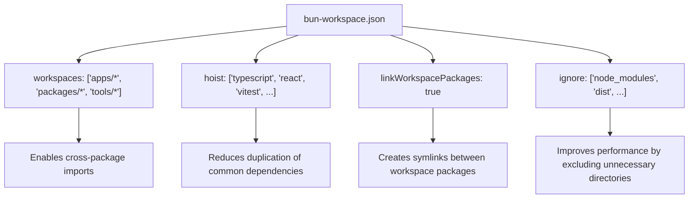
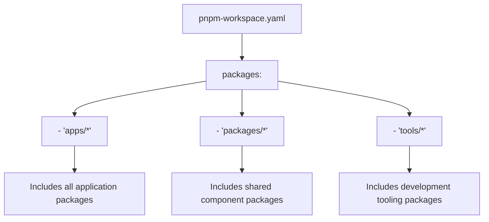
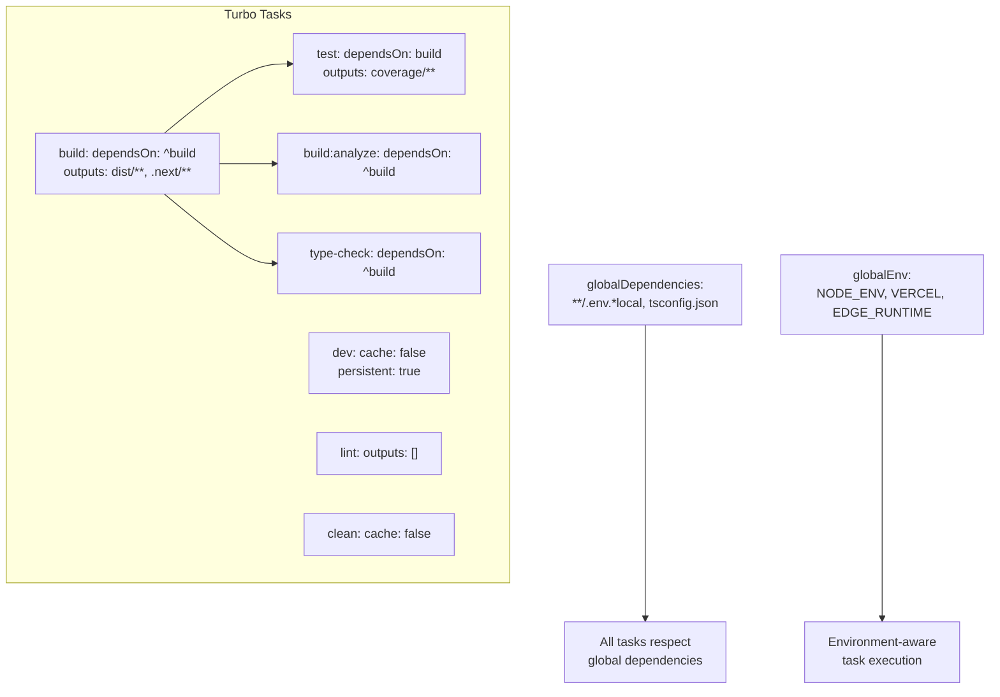
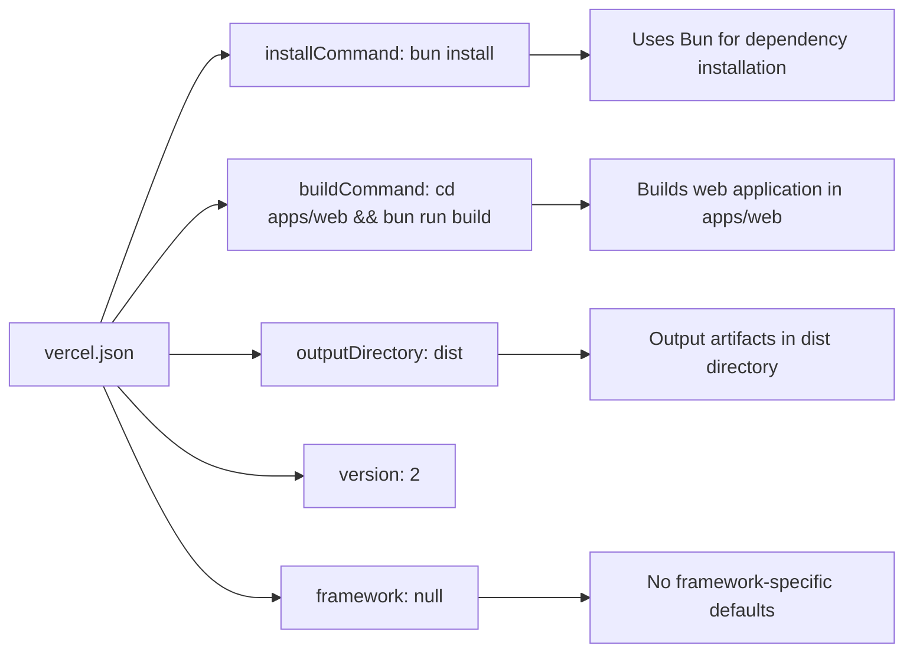
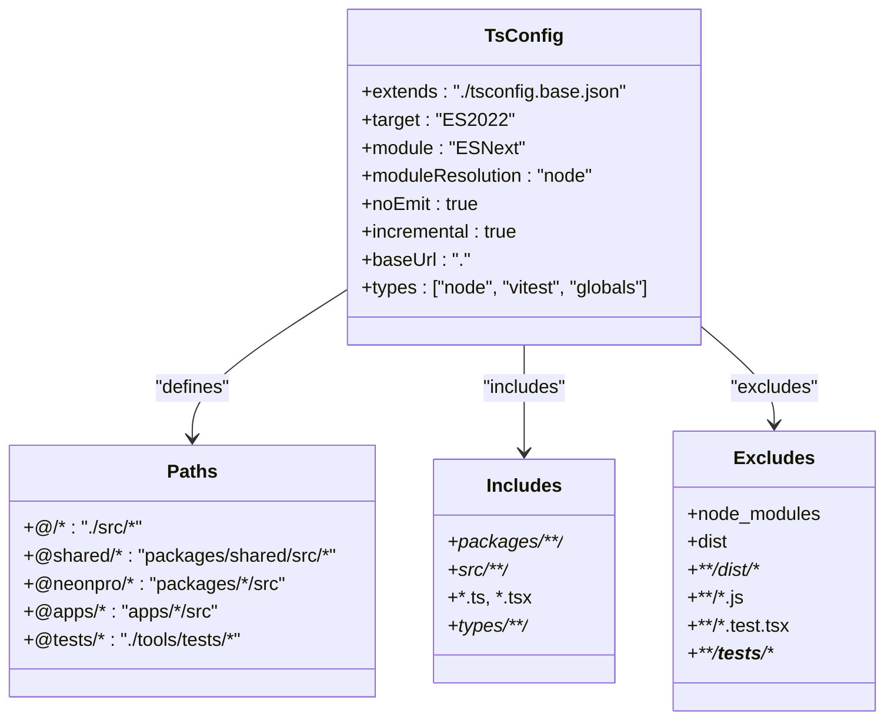
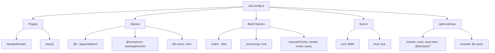

# Configuration Files

<cite>
**Referenced Files in This Document**
- [bun-workspace.json](file://bun-workspace.json)
- [pnpm-workspace.yaml](file://pnpm-workspace.yaml)
- [turbo.json](file://turbo.json)
- [vercel.json](file://vercel.json)
- [tsconfig.json](file://tsconfig.json)
- [vite.config.ts](file://vite.config.ts)
- [apps/api/tsconfig.json](file://apps/api/tsconfig.json)
- [apps/web/tsconfig.json](file://apps/web/tsconfig.json)
- [apps/api/vite.config.ts](file://apps/api/vite.config.ts)
</cite>

## Table of Contents
1. [Introduction](#introduction)
2. [Package Manager Workspace Configuration](#package-manager-workspace-configuration)
   - [bun-workspace.json](#bun-workspacejson)
   - [pnpm-workspace.yaml](#pnpm-workspaceyaml)
3. [Build System and Task Orchestration](#build-system-and-task-orchestration)
   - [turbo.json](#turbojson)
4. [Deployment Configuration](#deployment-configuration)
   - [vercel.json](#verceljson)
5. [TypeScript Compilation Settings](#typescript-compilation-settings)
   - [tsconfig.json](#tsconfigjson)
6. [Frontend Build Configuration](#frontend-build-configuration)
   - [vite.config.ts](#viteconfigts)
7. [Configuration Integration and Workflow Impact](#configuration-integration-and-workflow-impact)
8. [Common Issues and Troubleshooting](#common-issues-and-troubleshooting)
9. [Extending and Customizing Configurations](#extending-and-customizing-configurations)
10. [Conclusion](#conclusion)

## Introduction
The neonpro monorepo relies on a sophisticated configuration system that coordinates package management, build optimization, deployment settings, type checking, and frontend compilation. These configuration files work together to enable efficient development workflows, fast incremental builds, and reliable deployments across multiple applications and packages. This document provides comprehensive coverage of the key configuration files: bun-workspace.json and pnpm-workspace.yaml for workspace setup, turbo.json for task coordination, vercel.json for deployment, tsconfig.json for TypeScript compilation, and vite.config.ts for frontend build configuration. The analysis includes both conceptual overviews for developers new to the repository and technical details for experienced contributors.

## Package Manager Workspace Configuration

### bun-workspace.json
The `bun-workspace.json` file defines the monorepo structure for Bun package manager, specifying which directories contain packages that should be linked together. It establishes the workspace root and enables dependency hoisting for improved installation performance and reduced disk usage.

**Diagram sources**
- [bun-workspace.json](file://bun-workspace.json#L1-L15)

**Section sources**
- [bun-workspace.json](file://bun-workspace.json#L1-L15)

### pnpm-workspace.yaml
The `pnpm-workspace.yaml` file serves a similar purpose for PNPM package manager, defining the same workspace structure to ensure compatibility across different package managers. This dual configuration allows developers to choose their preferred package manager while maintaining consistent workspace behavior.

**Diagram sources**
- [pnpm-workspace.yaml](file://pnpm-workspace.yaml#L1-L4)

**Section sources**
- [pnpm-workspace.yaml](file://pnpm-workspace.yaml#L1-L4)

## Build System and Task Orchestration

### turbo.json
The `turbo.json` file configures Turbo, a high-performance build system that enables intelligent caching and task orchestration across the monorepo. It defines task dependencies, output locations, and global environment variables to optimize the development workflow.

**Diagram sources**
- [turbo.json](file://turbo.json#L1-L47)

**Section sources**
- [turbo.json](file://turbo.json#L1-L47)

## Deployment Configuration

### vercel.json
The `vercel.json` file specifies deployment settings for Vercel, including installation and build commands, output directory, and framework configuration. It ensures consistent deployment behavior across different environments.

**Diagram sources**
- [vercel.json](file://vercel.json#L1-L8)

**Section sources**
- [vercel.json](file://vercel.json#L1-L8)

## TypeScript Compilation Settings

### tsconfig.json
The root `tsconfig.json` file establishes base TypeScript compiler options for the entire monorepo, extended by individual projects. It configures module resolution, path aliases, type checking, and project references to enable seamless type safety across packages.

**Diagram sources**
- [tsconfig.json](file://tsconfig.json#L1-L100)

**Section sources**
- [tsconfig.json](file://tsconfig.json#L1-L100)
- [apps/api/tsconfig.json](file://apps/api/tsconfig.json#L1-L55)
- [apps/web/tsconfig.json](file://apps/web/tsconfig.json#L1-L53)

## Frontend Build Configuration

### vite.config.ts
The root `vite.config.ts` file configures Vite for the frontend application, defining plugins, aliases, build options, and server settings. It enables advanced features like code splitting, dependency optimization, and development server configuration.

**Diagram sources**
- [vite.config.ts](file://vite.config.ts#L1-L125)
- [apps/api/vite.config.ts](file://apps/api/vite.config.ts#L1-L94)

**Section sources**
- [vite.config.ts](file://vite.config.ts#L1-L125)
- [apps/api/vite.config.ts](file://apps/api/vite.config.ts#L1-L94)

## Configuration Integration and Workflow Impact
The configuration files in the neonpro repository work together to create an optimized development and deployment pipeline. When a developer runs `turbo build`, the system leverages the workspace configuration to resolve package dependencies, uses TypeScript configuration for type checking, applies Vite configuration for frontend compilation, and follows Vercel configuration for deployment preparation. This integrated approach enables features like incremental builds, where only changed packages are rebuilt, and intelligent caching, where unchanged tasks are skipped based on content hashes. The combination of bun-workspace.json and pnpm-workspace.yaml ensures package manager flexibility, while turbo.json orchestrates task execution across the monorepo. The tsconfig.json hierarchy provides consistent type checking, and the vite.config.ts files enable optimized frontend builds with code splitting and dependency pre-bundling.

## Common Issues and Troubleshooting
Common configuration issues in the neonpro repository include workspace package linking problems, Turbo cache invalidation issues, TypeScript path resolution errors, Vite plugin conflicts, and Vercel deployment failures. For workspace issues, verify that package names in package.json match the workspace patterns in bun-workspace.json and pnpm-workspace.yaml. For Turbo issues, use `turbo clean` to reset the cache when tasks aren't executing as expected. TypeScript path errors can often be resolved by checking the baseUrl and paths configuration in tsconfig.json and ensuring proper extends chain. Vite configuration problems may require verifying plugin order or checking alias resolution. Deployment issues should first check the build command in vercel.json and ensure all required environment variables are available. When troubleshooting, always verify that configuration changes are properly synchronized across related files, such as ensuring tsconfig.json updates are reflected in project-specific configurations.

## Extending and Customizing Configurations
To extend the configuration system for new requirements, developers should follow established patterns. Adding new workspace packages requires updating both bun-workspace.json and pnpm-workspace.yaml with appropriate glob patterns. New Turbo tasks should be added to turbo.json with proper dependency declarations and output specifications. Additional TypeScript configurations can extend the base tsconfig.json while maintaining consistent compiler options. Vite configuration extensions should preserve existing plugins and build optimizations while adding new functionality. Deployment configuration changes in vercel.json should maintain backward compatibility with existing deployment processes. When customizing configurations, always consider the impact on the entire monorepo and test changes thoroughly across different scenarios, including local development, CI/CD pipelines, and production deployments.

## Conclusion
The configuration files in the neonpro repository form a cohesive system that enables efficient monorepo management, optimized builds, and reliable deployments. By understanding the roles and interactions of bun-workspace.json, pnpm-workspace.yaml, turbo.json, vercel.json, tsconfig.json, and vite.config.ts, developers can effectively navigate and enhance the development workflow. These configurations provide the foundation for scalable development practices, enabling the team to maintain high productivity while ensuring code quality and deployment reliability across multiple applications and packages.