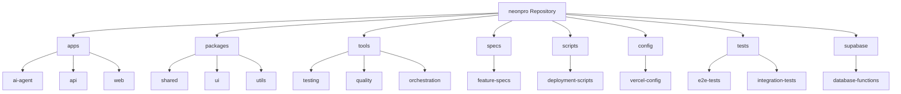

# Directory Structure Breakdown

<cite>
**Referenced Files in This Document**
- [bun-workspace.json](file://bun-workspace.json)
- [turbo.json](file://turbo.json)
- [vercel.json](file://vercel.json)
- [apps/api/package.json](file://apps/api/package.json)
- [apps/ai-agent/main.py](file://apps/ai-agent/main.py)
- [apps/web/package.json](file://apps/web/package.json)
- [packages/shared/src/index.ts](file://packages/shared/src/index.ts)
- [tools/orchestration/index.ts](file://tools/orchestration/index.ts)
- [specs/006-implemente-o-https/spec.md](file://specs/006-implemente-o-https/spec.md)
- [supabase/functions/patient-lookup/index.ts](file://supabase/functions/patient-lookup/index.ts)
- [scripts/deploy.sh](file://scripts/deploy.sh)
- [config/vercel/edge-config.ts](file://config/vercel/edge-config.ts)
- [apps/api/src/app.ts](file://apps/api/src/app.ts)
</cite>

## Table of Contents

1. [Introduction](#introduction)
2. [Top-Level Directory Overview](#top-level-directory-overview)
3. [Apps Directory: Main Applications](#apps-directory-main-applications)
4. [Packages Directory: Shared Reusable Components](#packages-directory-shared-reusable-components)
5. [Tools Directory: Development and Testing Utilities](#tools-directory-development-and-testing-utilities)
6. [Specs Directory: Feature Specifications](#specs-directory-feature-specifications)
7. [Scripts Directory: Deployment Automation](#scripts-directory-deployment-automation)
8. [Config Directory: Environment Configuration](#config-directory-environment-configuration)
9. [Tests Directory: Additional Test Suites](#tests-directory-additional-test-suites)
10. [Supabase Directory: Database Functions](#supabase-directory-database-functions)
11. [Workspace Configuration: bun-workspace.json](#workspace-configuration-bun-workspacejson)
12. [Build System Coordination: turbo.json](#build-system-coordination-turbojson)
13. [Deployment Settings: vercel.json](#deployment-settings-verceljson)
14. [Navigation Guide and Best Practices](#navigation-guide-and-best-practices)

## Introduction

The neonpro repository follows a monorepo architecture with a well-organized directory structure designed to support multiple applications, shared packages, development tools, specifications, scripts, configuration files, tests, and database functions. This document provides a comprehensive breakdown of the directory structure, explaining the purpose of each top-level directory and its contents. The analysis includes both conceptual overviews for beginners and technical details for experienced developers, covering workspace configuration through bun-workspace.json, build system coordination via turbo.json, and deployment settings in vercel.json. Practical examples of component location, common navigation issues, and guidance on organizing new components are also provided.

## Top-Level Directory Overview

The neonpro repository is organized into several key directories that serve distinct purposes in the development lifecycle:

- **apps**: Contains main applications such as AI agents, API services, web interfaces, and development tools
- **packages**: Houses shared reusable packages that can be consumed across different applications
- **tools**: Includes testing frameworks, quality assurance tools, and development utilities
- **specs**: Stores specification documents that define feature requirements and implementation guidelines
- **scripts**: Contains deployment scripts and automation tools for various environments
- **config**: Holds configuration files for different environments and services
- **tests**: Contains additional test suites beyond those located within individual applications
- **supabase**: Manages database functions and related configurations

This modular structure enables efficient code sharing, consistent development practices, and streamlined deployment processes across the organization's healthcare technology platform.

**Diagram sources**

- [project_structure](file://project_structure)
- [bun-workspace.json](file://bun-workspace.json)

## Apps Directory: Main Applications

The apps directory contains the primary applications that make up the NeonPro platform. Each subdirectory represents a distinct application with its own set of dependencies, configuration files, and source code. The ai-agent application implements an AI-powered healthcare data assistant using Python and FastAPI, providing WebSocket endpoints for AG-UI protocol communication and REST APIs for agent queries. The api application serves as the backend service for the healthcare platform, built with TypeScript and Hono framework, handling various routes for AI, appointments, billing, chat, medical records, and patients. The web application provides the frontend interface using React and modern web technologies, offering a user-friendly experience for healthcare professionals. The tools application contains Playwright-based end-to-end tests for validating application flows and ensuring quality.

Each application follows a consistent structure with source code in src/, configuration files, package.json for dependencies, and appropriate build and test scripts. The applications are designed to work together as part of a cohesive healthcare technology ecosystem, with clear separation of concerns and well-defined interfaces between components.

**Section sources**

- [apps/ai-agent/main.py](file://apps/ai-agent/main.py)
- [apps/api/package.json](file://apps/api/package.json)
- [apps/web/package.json](file://apps/web/package.json)

## Packages Directory: Shared Reusable Components

The packages directory contains shared reusable components that can be consumed across multiple applications within the monorepo. These packages promote code reuse, consistency, and maintainability throughout the codebase. The shared package exports core functionality including telemetry models, validation helpers for Brazilian healthcare data (CPF, CNPJ, CRM), environment configuration, authentication utilities, API clients, hooks, realtime capabilities, internationalization support, WebRTC infrastructure, and telemetry services. The ui package provides reusable UI components with Tailwind CSS integration, while the utils package offers various utility functions for currency formatting, logging, redaction, and healthcare-specific error handling.

Other notable packages include agui-protocol for implementing the AG-UI protocol, ai-providers for integrating with different AI services, analytics for data collection and processing, chat-domain for chat-related functionality, cli for command-line interfaces, compliance for regulatory requirements, config for centralized configuration management, core-services for essential business logic, database for database operations, domain for domain-driven design elements, governance for healthcare governance, monitoring for observability features, schemas for data schemas, security for security-related functionality, types for type definitions, validators for input validation, and more.

These packages are versioned independently and can be updated without affecting all applications simultaneously, allowing for controlled evolution of shared functionality.

**Section sources**

- [packages/shared/src/index.ts](file://packages/shared/src/index.ts)

## Tools Directory: Development and Testing Utilities

The tools directory houses various development and testing utilities that support the software development lifecycle. It contains specialized tools for different aspects of development, including audit-consolidated for consolidated auditing, backend for backend-specific tooling, database for database-related utilities, frontend for frontend development tools, monitoring for observability and alerting, orchestration for coordinating complex workflows, performance for performance testing and optimization, quality for code quality assurance, shared for shared tooling components, testing for end-to-end and integration testing, testing-toolkit for comprehensive testing capabilities, and documentation in AGENTS.md about available agents.

The orchestration tools provide sophisticated workflow management capabilities, allowing for the coordination of multiple agents and services in complex healthcare scenarios. The testing tools include Playwright-based end-to-end tests, unit tests, integration tests, and contract tests to ensure high-quality software delivery. The quality tools enforce coding standards, perform linting, formatting, and static analysis to maintain code quality across the codebase. The monitoring tools provide dashboards, alerts, and health checks to ensure system reliability and performance.

These tools are designed to work together seamlessly, providing a comprehensive development environment that supports rapid iteration, thorough testing, and reliable deployment of healthcare applications.

**Section sources**

- [tools/orchestration/index.ts](file://tools/orchestration/index.ts)

## Specs Directory: Feature Specifications

The specs directory contains detailed feature specifications that guide the development of new functionality within the NeonPro platform. Each specification is organized in its own subdirectory with a consistent structure including contracts (OpenAPI specifications), data-model.md (data model documentation), plan.md (implementation plan), quickstart.md (quick start guide), research.md (research findings), spec.md (detailed feature specification), and tasks.md (task breakdown). These specifications follow a standardized format that includes user scenarios, acceptance criteria, edge cases, functional and non-functional requirements, key entities, and review checklists.

For example, the 006-implemente-o-https specification details the implementation of HTTPS with TLS 1.3 or higher, HTTP Strict Transport Security (HSTS) with max-age ≥ 31536000 (1 year), automatic SSL/TLS certificate renewal, comprehensive security headers, prevention of mixed content, support for Perfect Forward Secrecy (PFS) cipher suites, and Certificate Transparency logging. The specifications ensure that all team members have a clear understanding of what needs to be implemented, how it should behave, and what quality standards must be met before deployment.

These specifications serve as the single source of truth for feature development, enabling effective collaboration between product managers, designers, developers, and quality assurance engineers.

**Section sources**

- [specs/006-implemente-o-https/spec.md](file://specs/006-implemente-o-https/spec.md)

## Scripts Directory: Deployment Automation

The scripts directory contains automation scripts that streamline the deployment process for the NeonPro platform. These scripts handle various aspects of the deployment pipeline, including dependency installation, application building, environment setup, security analysis, compliance validation, deployment execution, rollback procedures, and post-deployment verification. The deploy.sh script orchestrates the entire deployment process, installing dependencies with bun install, building the application with bun run vercel-build, and deploying to Vercel with appropriate environment flags for production, staging, or preview deployments.

Additional scripts provide specialized functionality such as analyze-healthcare-bundle.js for analyzing healthcare bundle sizes, audit-unified.sh for unified auditing, debug-detection.ts and debug-validation.ts for debugging purposes, deploy-api-separate.sh and deploy-unified.sh for targeted deployments, deployment-health-check.sh and deployment-validation.sh for post-deployment verification, dev-setup.sh for developer environment setup, emergency-rollback.sh for emergency recovery, various fix-* scripts for automated code corrections, guard-test-placement.sh for test organization, healthcare-compliance-validation.sh for compliance checking, install-hooks.sh for Git hook installation, package-manager-fallback.sh for package manager fallback, quick-lint-fix.sh for rapid linting fixes, security-analysis.ts and security-audit.ts for security assessments, setup-package-scripts.sh for package script setup, and setup-supabase-migrations.sh for Supabase migration configuration.

These scripts enable consistent, repeatable, and reliable deployments across different environments, reducing the risk of human error and ensuring that best practices are followed consistently.

**Section sources**

- [scripts/deploy.sh](file://scripts/deploy.sh)

## Config Directory: Environment Configuration

The config directory contains environment-specific configuration files that control various aspects of the NeonPro platform's behavior. The vercel subdirectory holds configuration files for Vercel deployment, including edge-config.ts for edge computing settings, healthcare-compliance-config.ts for healthcare-specific compliance requirements, middleware.ts for request processing middleware, monitoring-config.ts for observability settings, and performance-config.ts for performance optimization parameters.

The edge-config.ts file defines critical settings for healthcare compliance, including region (Brazil for LGPD compliance), data residency (São Paulo region), encryption requirements, audit logging, retention periods for medical records (25 years), security policies (session duration, login attempts, password complexity), rate limiting rules, caching strategies (with no caching for patient and medical data), monitoring sample rates (100% for healthcare), compliance features (LGPD, ANVISA, CFM), backup and disaster recovery settings, and performance optimization options. These configurations ensure that the platform meets stringent healthcare regulations and provides optimal performance for medical applications.

By centralizing these configurations, the platform maintains consistency across deployments while allowing for environment-specific adjustments when necessary.

**Section sources**

- [config/vercel/edge-config.ts](file://config/vercel/edge-config.ts)

## Tests Directory: Additional Test Suites

The tests directory contains additional test suites that complement the tests located within individual applications. It includes end-to-end (e2e) tests that validate complete user journeys across multiple components, integration tests that verify interactions between different services and systems, tdd-infrastructure tests that ensure the test-driven development infrastructure is functioning correctly, and unit tests that focus on isolated functionality. The e2e directory contains Playwright-based tests for critical user flows such as AI chat interactions, appointment queries, feedback submission, HTTPS enforcement, performance handshake, response time, and session management.

The integration tests cover various aspects of the system, including appointment query functionality, data agent endpoint behavior, feedback endpoint operation, HTTPS enforcement mechanisms, performance characteristics during handshake and response phases, and sessions endpoint correctness. The tdd-infrastructure tests verify missing configurations and validate Vitest configuration integrity, ensuring that the testing infrastructure itself is reliable. The unit tests focus on specific components such as AI data services, intent parsers, and response formatters, providing granular verification of individual units of code.

These tests work in conjunction with the application-specific tests to provide comprehensive coverage of the platform's functionality, helping to catch bugs early in the development process and maintain high software quality.

## Supabase Directory: Database Functions

The supabase directory manages database functions and related configurations for the NeonPro platform. It contains Edge Functions written in TypeScript that run on the Supabase platform, providing serverless capabilities for various healthcare use cases. The functions directory includes specialized functions such as anvisa-adverse-events for reporting adverse events to ANVISA, appointment-reminders for sending appointment reminders to patients, healthcare-performance-monitor for monitoring healthcare performance metrics, and patient-lookup for securely searching patient records with LGPD compliance.

The patient-lookup function demonstrates sophisticated healthcare-specific functionality, implementing CPF/CNS validation for Brazilian healthcare identifiers, privacy-by-design principles with data minimization based on requester role and purpose, audit logging for all lookup operations, multi-tenant clinic isolation, and emergency access overrides. The function applies role-based data access controls, masking sensitive information for lower-privilege users while providing appropriate access for doctors, nurses, receptionists, and administrators based on their roles and the purpose of the lookup.

The directory also contains configuration files (config-full.toml and config.toml) that define Supabase project settings, ensuring consistent deployment and management of database resources. These database functions extend the capabilities of the Supabase platform, enabling complex healthcare workflows while maintaining strict compliance with Brazilian regulations.

**Section sources**

- [supabase/functions/patient-lookup/index.ts](file://supabase/functions/patient-lookup/index.ts)

## Workspace Configuration: bun-workspace.json

The bun-workspace.json file defines the workspace configuration for the NeonPro monorepo, specifying which directories contain packages that should be linked together. The configuration includes workspaces for apps/_, packages/_, and tools/*, enabling seamless sharing of code between these directories. The ignore array specifies directories and files that should not be included in the workspace, such as node_modules, dist, build, .git, and log files, preventing unnecessary processing and potential conflicts.

The hoist array lists dependencies that should be installed at the root level of the workspace, including TypeScript, React, React DOM, type definitions, Tailwind CSS, Vitest, and Turbo. This optimization reduces duplication and improves installation performance by avoiding multiple copies of commonly used packages. The strict setting enforces stricter validation of workspace dependencies, helping to catch potential issues early. The linkWorkspacePackages setting enables direct linking between workspace packages, allowing for immediate access to changes without requiring publication or installation steps.

This workspace configuration enables efficient development workflows, where changes to shared packages are immediately available to consuming applications, facilitating rapid iteration and reducing the overhead of package management.

**Section sources**

- [bun-workspace.json](file://bun-workspace.json)

## Build System Coordination: turbo.json

The turbo.json file coordinates the build system for the NeonPro monorepo, defining tasks and dependencies that enable efficient incremental builds and caching. The globalDependencies array specifies files that affect all tasks, including environment variables (.env._local), TypeScript configuration files (tsconfig.json and tsconfig._.json), ensuring that changes to these files trigger appropriate rebuilds. The tasks object defines various operations such as build, dev, test, lint, format, type-check, clean, build:analyze, build:copilot, with appropriate dependencies, outputs, and caching settings.

The build task depends on upstream build tasks (^build), ensuring proper ordering of builds across the monorepo, and specifies output directories (dist/**, .next/**) while excluding cache directories from caching (!.next/cache/**). The dev task disables caching and runs persistently, suitable for development servers. The test task depends on build and specifies coverage output directories. Linting and formatting tasks have empty outputs since they don't produce build artifacts. The type-check task depends on upstream builds to ensure type safety across package boundaries.

Specialized tasks like build:analyze generate bundle analysis reports, while build:copilot creates optimized builds for CopilotKit integration. The globalEnv array specifies environment variables that affect task execution, including NODE_ENV, VERCEL, VERCEL_ENV, and EDGE_RUNTIME. This configuration enables fast, reliable, and consistent builds across the monorepo, leveraging Turborepo's powerful caching and task orchestration capabilities.

**Section sources**

- [turbo.json](file://turbo.json)

## Deployment Settings: vercel.json

The vercel.json file contains deployment settings for the NeonPro platform when deployed to Vercel. It specifies the schema URL for validation, sets the version to 2, defines the installCommand as "bun install" to use Bun as the package manager, and sets the buildCommand to "cd apps/web && bun run build" to build the web application specifically. The outputDirectory is set to "dist", indicating where the built assets will be located, and the framework is set to null since the deployment uses custom configuration rather than a predefined framework preset.

This configuration ensures that the platform is deployed efficiently using Bun's fast installation capabilities and builds only the necessary components for the web interface. The settings are optimized for the monorepo structure, targeting the specific application that needs to be deployed while respecting the overall architecture. By specifying these deployment parameters explicitly, the configuration provides reproducible deployments that can be easily understood and modified as needed.

**Section sources**

- [vercel.json](file://vercel.json)

## Navigation Guide and Best Practices

Navigating the neonpro repository effectively requires understanding both the high-level directory structure and the relationships between components. To locate specific functionality, start by identifying whether it belongs to an application (apps), shared package (packages), tool (tools), specification (specs), script (scripts), configuration (config), test (tests), or database function (supabase). For example, AI-related functionality might be found in apps/ai-agent or packages/ai-providers, while UI components would likely reside in packages/ui.

Common navigation issues include difficulty finding shared functionality across packages, confusion about which application contains specific features, and challenges in understanding the relationship between specifications and implementation. These can be addressed by using search tools to find relevant files, examining package.json dependencies to understand component relationships, and consulting specification documents to understand feature requirements and implementation scope.

When adding new components, follow established patterns: place application-specific code in the appropriate apps subdirectory, create shared functionality as packages in the packages directory, add development tools to the tools directory, document new features in the specs directory, create deployment scripts in the scripts directory, store environment-specific configurations in the config directory, add comprehensive tests in the tests directory, and implement database functions in the supabase directory. Always update relevant configuration files (bun-workspace.json, turbo.json, vercel.json) as needed and ensure new components adhere to existing coding standards and architectural principles.

Following these guidelines ensures consistency across the codebase, facilitates collaboration among team members, and maintains the long-term maintainability of the NeonPro platform.

**Section sources**

- [bun-workspace.json](file://bun-workspace.json)
- [turbo.json](file://turbo.json)
- [vercel.json](file://vercel.json)
