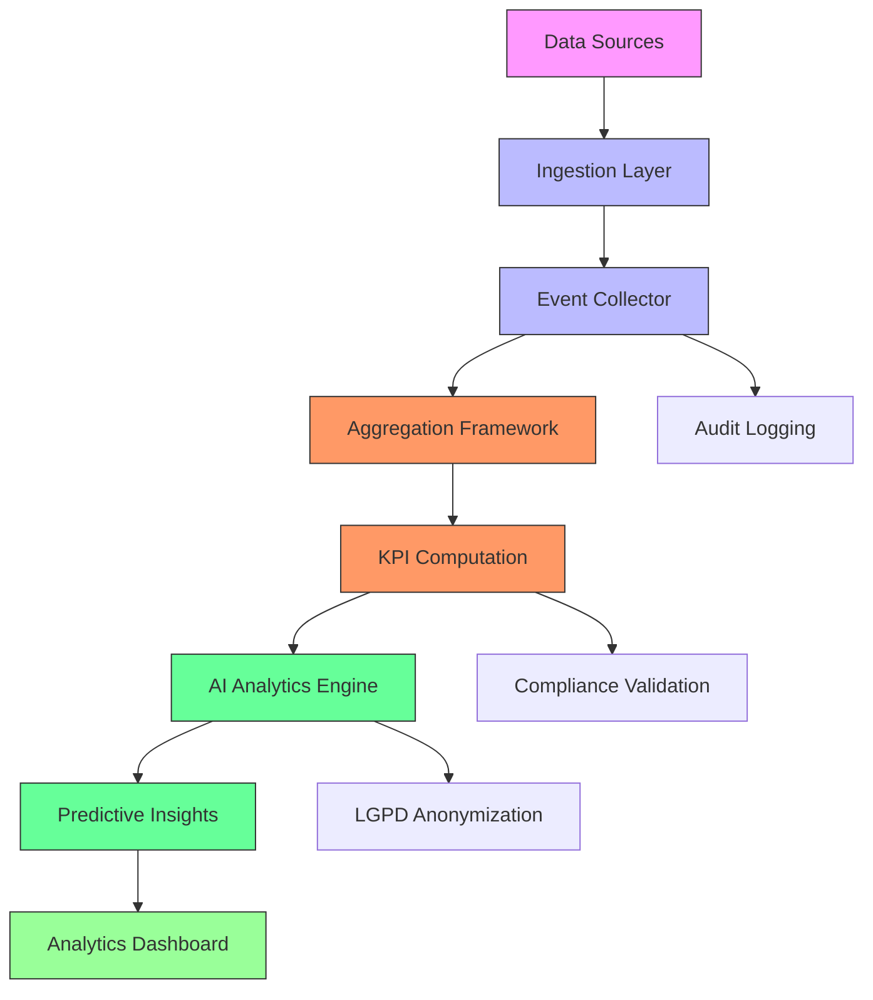
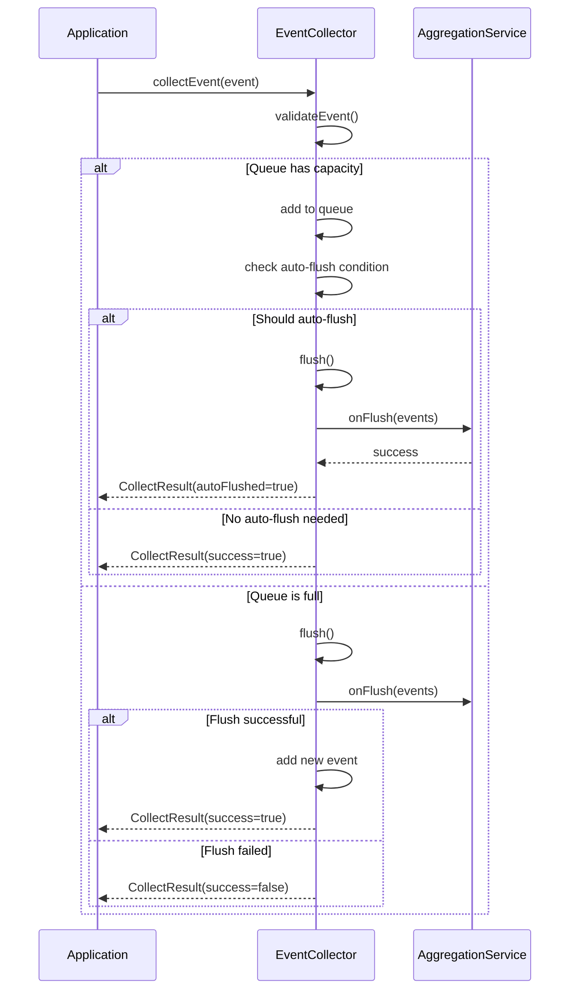
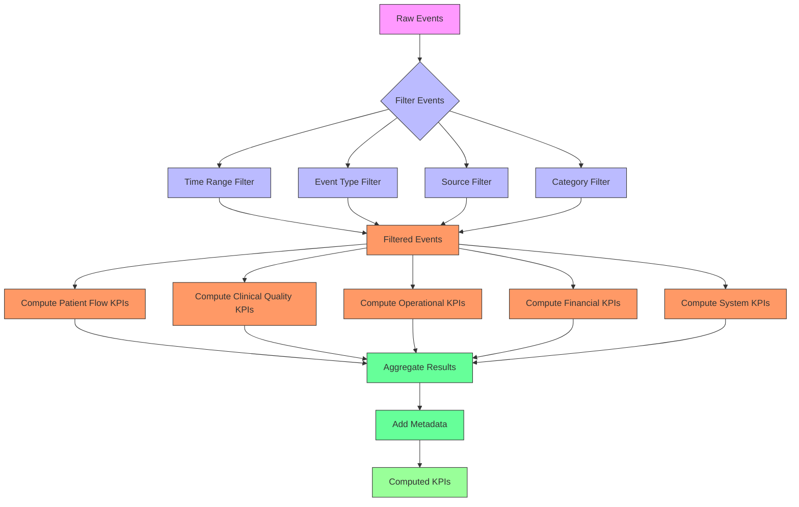

# Analytics Package

<cite>
**Referenced Files in This Document**
- [index.ts](file://packages/analytics/src/index.ts)
- [event-collector.ts](file://packages/analytics/src/ingestion/event-collector.ts)
- [ingestion/index.ts](file://packages/analytics/src/ingestion/index.ts)
- [types/ingestion.ts](file://packages/analytics/src/types/ingestion.ts)
- [types/base-metrics.ts](file://packages/analytics/src/types/base-metrics.ts)
- [types/clinical-kpis.ts](file://packages/analytics/src/types/clinical-kpis.ts)
- [types/financial-kpis.ts](file://packages/analytics/src/types/financial-kpis.ts)
- [aggregation/kpis.ts](file://packages/analytics/src/aggregation/kpis.ts)
- [ai-analytics/predictive-analytics.service.ts](file://packages/analytics/src/ai-analytics/predictive-analytics.service.ts)
- [ai-analytics/healthcare-ai-orchestrator.ts](file://packages/analytics/src/ai-analytics/healthcare-ai-orchestrator.ts)
- [ai-analytics/types.ts](file://packages/analytics/src/ai-analytics/types.ts)
- [ml/interfaces.ts](file://packages/analytics/src/ml/interfaces.ts)
- [ml/stub-provider.ts](file://packages/analytics/src/ml/stub-provider.ts)
</cite>

## Table of Contents

1. [Introduction](#introduction)
2. [Core Architecture Overview](#core-architecture-overview)
3. [Data Ingestion Pipeline](#data-ingestion-pipeline)
4. [Event Collection System](#event-collection-system)
5. [KPI Computation Framework](#kpi-computation-framework)
6. [Clinical and Financial KPIs](#clinical-and-financial-kpis)
7. [AI-Powered Predictive Analytics](#ai-powered-predictive-analytics)
8. [Healthcare Compliance Integration](#healthcare-compliance-integration)
9. [Practical Implementation Guide](#practical-implementation-guide)
10. [Performance Optimization and Troubleshooting](#performance-optimization-and-troubleshooting)

## Introduction

The Analytics Package is a comprehensive healthcare analytics system designed for the NeonPro platform, specifically tailored to meet Brazilian healthcare compliance standards including LGPD (Lei Geral de Proteção de Dados), ANVISA (Agência Nacional de Vigilância Sanitária), and CFM (Conselho Federal de Medicina). This package provides a robust framework for collecting, processing, and analyzing operational data from healthcare facilities to generate actionable clinical and financial Key Performance Indicators (KPIs).

At its core, the analytics system enables healthcare organizations to transform raw operational data into meaningful insights that drive quality improvement, financial optimization, and regulatory compliance. The package supports real-time event collection, sophisticated aggregation algorithms, and AI-powered predictive analytics, all while maintaining strict adherence to Brazilian healthcare regulations.

For beginners, this documentation provides conceptual overviews of healthcare analytics fundamentals, explaining how operational data translates into clinical outcomes and financial performance metrics. For experienced developers, detailed technical specifications cover event schema design, real-time processing patterns, machine learning integration, and best practices for implementing custom analytics solutions.

The analytics package is structured around three main components: a high-performance ingestion pipeline that collects events from various sources, an aggregation framework that computes KPIs from collected data, and an AI analytics layer that provides predictive insights and advanced recommendations. Each component is designed with extensibility in mind, allowing healthcare organizations to customize the system to their specific needs while maintaining compliance with regulatory requirements.

**Section sources**

- [index.ts](file://packages/analytics/src/index.ts#L1-L216)

## Core Architecture Overview

The Analytics Package follows a modular architecture with clearly defined layers for data ingestion, aggregation, and advanced analytics. This layered approach ensures separation of concerns while enabling seamless integration between components. The system is designed to handle healthcare operational data at scale, providing both real-time monitoring capabilities and historical trend analysis.

The architecture consists of three primary layers: the ingestion layer responsible for collecting and validating incoming events, the aggregation layer that processes collected data to compute KPIs, and the AI analytics layer that applies machine learning models to generate predictive insights. These layers work together through well-defined interfaces, allowing each component to be developed, tested, and maintained independently.

Data flows through the system in a pipeline fashion, starting with event collection from various sources such as electronic health records, appointment scheduling systems, billing platforms, and clinical workflows. Events are temporarily stored in an in-memory queue with configurable auto-flush mechanisms to ensure reliable delivery even during periods of high volume or system stress. Once events are processed, they feed into the aggregation framework which computes both standard and custom KPIs according to predefined business rules.

The AI analytics layer sits atop the aggregated data, applying machine learning models to identify patterns, predict future outcomes, and generate actionable recommendations. This layer includes specialized services for predicting patient no-show risks, revenue forecasts, and clinical outcomes, all while maintaining compliance with Brazilian privacy regulations through built-in data anonymization and audit logging features.



**Diagram sources **

- [index.ts](file://packages/analytics/src/index.ts#L1-L216)
- [event-collector.ts](file://packages/analytics/src/ingestion/event-collector.ts#L1-L426)
- [kpis.ts](file://packages/analytics/src/aggregation/kpis.ts#L1-L795)
- [predictive-analytics.service.ts](file://packages/analytics/src/ai-analytics/predictive-analytics.service.ts#L1-L469)

## Data Ingestion Pipeline

The data ingestion pipeline forms the foundation of the analytics system, responsible for reliably collecting healthcare operational events from various sources while ensuring data quality and compliance. The pipeline is designed to handle diverse data types including patient visits, appointments, treatments, payments, and clinical interventions, transforming them into standardized analytics events that can be processed by downstream components.

At the heart of the ingestion system is a flexible configuration model that defines how data should be collected, validated, and transformed before storage. The `IngestionConfig` interface specifies source identifiers, connection details, processing options, security requirements, and error handling policies. This configuration-driven approach allows healthcare organizations to adapt the ingestion pipeline to different data sources without modifying code, supporting database connections, API integrations, file imports, streaming data, and webhook notifications.

Data validation is a critical aspect of the ingestion pipeline, with comprehensive rules defined through the `ValidationRule` interface. These rules specify field-level validations for required fields, format constraints, range limitations, and custom validation logic. Each rule includes an error handling strategy that determines whether invalid data should be rejected, transformed, skipped, or trigger a warning. This flexibility enables organizations to balance data quality requirements with operational realities, particularly when integrating with legacy healthcare systems that may have inconsistent data formats.

Data transformation occurs through `TransformationRule` configurations that define how source fields should be mapped, aggregated, filtered, anonymized, or calculated to produce analytics-ready data. These transformations support conditional application based on specific criteria, allowing complex business logic to be implemented declaratively. For healthcare-specific requirements, transformations include automatic anonymization of sensitive patient information to comply with LGPD regulations and conversion of clinical codes to standardized formats for consistent analysis.

The ingestion pipeline also incorporates robust error handling and reliability features, including retry mechanisms with configurable backoff strategies, dead letter queues for failed events, and comprehensive audit logging. Monitoring metrics track throughput, latency, error rates, and data quality scores, providing visibility into pipeline health and performance. Webhook configurations enable real-time notifications for specific events, facilitating integration with external alerting systems and compliance monitoring tools.

**Section sources**

- [types/ingestion.ts](file://packages/analytics/src/types/ingestion.ts#L1-L461)

## Event Collection System

The Event Collection System provides a high-performance, in-memory queuing mechanism for real-time event collection with configurable flush operations and healthcare compliance features. At its core is the `EventCollector` class, which implements a FIFO (First-In, First-Out) queue with thread-safe operations, automatic flushing, and batch processing capabilities optimized for healthcare analytics workloads.

The system operates through a simple yet powerful interface centered around the `collectEvent` method, which accepts `IngestionEvent` objects containing event type, source information, timestamp, payload data, and optional metadata. When an event is collected, it undergoes validation to ensure required fields are present and properly formatted, with special validation rules for healthcare-specific data such as patient identifiers. Validated events are enriched with timestamps if not already provided and added to the in-memory queue.

Queue management is handled automatically through configurable parameters defined in `EventCollectorConfig`. The system monitors queue size and triggers auto-flush operations when either the maximum queue size is reached or a configurable batch size threshold is exceeded. Auto-flush intervals can be set to ensure regular processing even during periods of low event volume. The default configuration supports up to 1,000 events in the queue with auto-flushing every 30 seconds or when 100 events are collected, providing a balance between real-time processing and system efficiency.

The flush operation processes queued events in batches, invoking a configurable `onFlush` handler function that typically forwards events to the aggregation framework or persistent storage. Error handling is comprehensive, with failed batches tracked separately and appropriate counters updated to maintain accurate statistics. The system maintains detailed statistics through the `getStats` method, providing visibility into queue size, collection rates, processing status, and timing information.

Audit logging is integrated into the event collection process, recording key operations such as event collection and batch flushing. While the current implementation logs to console, production deployments would integrate with proper audit systems to meet Brazilian healthcare compliance requirements. Error handling is customizable through an `onError` callback, allowing applications to implement sophisticated error recovery strategies or integrate with centralized monitoring solutions.



**Diagram sources **

- [event-collector.ts](file://packages/analytics/src/ingestion/event-collector.ts#L1-L426)
- [index.ts](file://packages/analytics/src/ingestion/index.ts#L1-L23)

## KPI Computation Framework

The KPI Computation Framework provides a comprehensive system for calculating healthcare performance indicators from collected analytics events, with support for filtering, aggregation, and validation across multiple dimensions. The core functionality is exposed through the `computeKPIs` function, which processes arrays of analytics or ingestion events to generate a structured result containing patient flow, clinical quality, operational efficiency, financial performance, and system health metrics.

The computation process begins with event filtering based on configurable options specified in `KPIComputationOptions`. These options allow filtering by time range, event types, source systems, and specific KPI categories, enabling targeted analysis of particular aspects of healthcare operations. Time-based filtering supports both explicit date ranges and automatic determination from the event dataset, while category filtering allows selective computation of only relevant KPIs to optimize performance.

Patient flow KPIs include metrics such as total visits, average wait time, no-show rate, patient satisfaction score, and appointment utilization. These are computed by analyzing appointment-related events, feedback submissions, and visit records, with calculations that account for edge cases like missing data or incomplete records. Clinical quality KPIs measure diagnosis accuracy, treatment completion rates, readmission rates, emergency interventions, and medication adherence by examining clinical workflow events and treatment outcomes.

Operational efficiency metrics assess resource utilization, staff efficiency, equipment usage, scheduling effectiveness, and average service time by analyzing resource allocation events, staff activity logs, and equipment monitoring data. Financial performance KPIs calculate revenue per patient, cost per treatment, insurance claim success rates, payment collection rates, and profit margins by processing billing, payment, and cost tracking events.

System health metrics provide insight into data quality, compliance status, system uptime, error rates, and overall performance scores. Data quality assessment leverages information from ingestion events to calculate validity percentages across completeness, accuracy, consistency, and timeliness dimensions. Compliance scoring evaluates adherence to Brazilian healthcare regulations by checking for proper data handling practices and audit trail completeness.

The framework includes extensive error handling and validation, with options for strict mode processing, minimum event count requirements, and data quality validation. Metadata is automatically generated with each computation, capturing the timestamp, event count, time range, and coverage statistics to provide context for the results. Helper functions support testing and development by generating mock events with realistic healthcare data patterns.



**Diagram sources **

- [kpis.ts](file://packages/analytics/src/aggregation/kpis.ts#L1-L795)

## Clinical and Financial KPIs

The analytics package provides comprehensive support for both clinical and financial Key Performance Indicators (KPIs) through specialized type definitions and factory functions that ensure consistency, compliance, and ease of use. These KPIs are designed to align with Brazilian healthcare standards and regulatory requirements while providing actionable insights for quality improvement and financial optimization.

Clinical KPIs are organized around the `ClinicalKPI` interface, which extends the base metric structure with healthcare-specific properties including clinical category, specialty context, patient population demographics, outcome type, and evidence level. The system supports multiple clinical categories such as patient safety, clinical quality, patient outcomes, care coordination, medication safety, infection control, diagnostic accuracy, treatment effectiveness, patient satisfaction, readmission rates, and mortality rates. Each category has specialized interfaces with additional properties relevant to that domain, such as safety event details for patient safety KPIs or infection characteristics for infection control metrics.

Financial KPIs are structured through the `FinancialKPI` interface, which extends base metrics with currency specification, healthcare business context including cost center and service line identification, financial period information, budget context, and audit requirements. The system supports financial categories including revenue cycle management, cost management, billing efficiency, insurance claims processing, accounts receivable, profitability analysis, cash flow, reimbursement, cost per case, productivity, denials management, and patient financial experience.

Factory functions simplify KPI creation while ensuring compliance with Brazilian regulations. The `createPatientSafetyKPI` function generates patient safety metrics with automatic risk level assessment based on event severity and compliance framework assignment for CFM and ANVISA requirements. Similarly, `createRevenueCycleKPI` creates financial metrics with appropriate currency settings and compliance frameworks for LGPD. These factory functions handle ID generation, timestamp assignment, and default value population, reducing boilerplate code and ensuring consistency across implementations.

The system includes specialized KPI implementations for common healthcare metrics, such as hospital-acquired infection rates, medication error rates, patient fall rates, 30-day readmission rates, surgical site infection rates, patient satisfaction scores, risk-adjusted mortality rates, and diagnostic accuracy rates. Each implementation includes domain-specific properties and validation rules to ensure data quality and regulatory compliance. For example, medication error rate KPIs include classification by NCC MERP scale severity levels, while readmission rate KPIs capture information about preventability and same-condition recurrence.

Utility functions enhance KPI analysis by providing automated risk scoring and compliance validation. The `calculateClinicalRiskScore` function analyzes multiple clinical KPIs to produce an overall risk assessment with identified critical areas and recommended interventions. Similarly, `calculateFinancialHealthScore` evaluates financial KPIs against weighted performance targets to generate a comprehensive financial health assessment with performance indicators by category.

**Section sources**

- [types/clinical-kpis.ts](file://packages/analytics/src/types/clinical-kpis.ts#L1-L670)
- [types/financial-kpis.ts](file://packages/analytics/src/types/financial-kpis.ts#L1-L638)

## AI-Powered Predictive Analytics

The AI-Powered Predictive Analytics system provides advanced machine learning capabilities for forecasting healthcare outcomes, optimizing operations, and generating actionable insights while maintaining strict compliance with Brazilian regulations. At the core of this system is the `PredictiveAnalyticsService` class, which orchestrates predictions from ML models while applying LGPD-compliant data anonymization and comprehensive audit logging.

The predictive analytics engine supports multiple prediction types through the `PredictionType` enumeration, including patient outcomes, readmission risks, treatment effectiveness, cost predictions, no-show risks, resource utilization, clinical deterioration, and medication adherence. Each prediction request is structured as a `PredictionInput` object containing the prediction type, feature values, and optional context information. The system validates inputs against model requirements before processing, ensuring that only complete and appropriate data is used for predictions.

Machine learning integration is abstracted through the `ModelProvider` interface, which defines a contract for initializing models, making predictions, validating inputs, performing health checks, and cleaning up resources. This abstraction allows different ML implementations to be swapped seamlessly, from local models to cloud-based AI services. The package includes a `StubModelProvider` implementation for development and testing, which simulates realistic predictions with configurable accuracy, latency, and failure rates without requiring actual ML infrastructure.

The `PredictiveAnalyticsService` applies LGPD compliance measures by automatically anonymizing sensitive patient data before it reaches ML models. The service uses inline utilities to mask CPF numbers, email addresses, phone numbers, and other personally identifiable information while preserving the analytical value of the data. This anonymization process is configurable, allowing organizations to adjust the level of data protection based on their specific compliance requirements and risk tolerance.

Key prediction endpoints include `predictNoShowRisk`, which forecasts the likelihood of patient appointment no-shows based on demographic, medical history, and behavioral factors; `predictRevenueForecast`, which projects future revenue based on historical trends, procedure mix, and market conditions; and `predictPatientOutcome`, which estimates treatment success probabilities based on patient characteristics and clinical indicators. Each prediction returns a `PredictiveInsight` object containing the forecast, confidence level, impact assessment, descriptive explanation, and actionable recommendations.

The system generates comprehensive insights through the `generateInsights` method, which coordinates multiple prediction types to produce a holistic view of organizational performance. These insights are packaged with metadata including generation timestamp, model version, and compliance status, providing transparency into the prediction process. The service also produces compliance reports that document data handling practices, anonymization procedures, and audit trail completeness, supporting regulatory requirements for AI-assisted decision making in healthcare.

```mermaid
classDiagram
class PredictiveAnalyticsService {
+modelProvider : ModelProvider
+enableLGPDCompliance : boolean
+initialized : boolean
+getAnalyticsMetrics() : Promise~AnalyticsMetrics~
+predictNoShowRisk(request : PredictiveRequest) : Promise~PredictiveInsight~
+predictRevenueForecast(request : PredictiveRequest) : Promise~PredictiveInsight~
+predictPatientOutcome(request : PredictiveRequest) : Promise~PredictiveInsinkt~
+generateInsights(request : PredictiveRequest) : Promise~PredictiveInsight[]~
+generateComplianceReport() : Promise~ComplianceReport~
}
class ModelProvider {
<<interface>>
+metadata : ModelMetadata
+initialize(config? : Record~string, unknown~) : Promise~void~
+predict(input : PredictionInput) : Promise~PredictionResult~
+batchPredict(input : BatchPredictionInput) : Promise~BatchPredictionResult~
+validateInput(input : PredictionInput) : boolean
+healthCheck() : Promise~{status : string, details? : Record~string, unknown~}~
+dispose() : Promise~void~
}
class StubModelProvider {
+_config : StubModelConfig
+_metadata : ModelMetadata
+_initialized : boolean
+initialize(config? : Record~string, unknown~) : Promise~void~
+predict(input : PredictionInput) : Promise~PredictionResult~
+batchPredict(input : BatchPredictionInput) : Promise~BatchPredictionResult~
+validateInput(input : PredictionInput) : boolean
+healthCheck() : Promise~{status : string, details? : Record~string, unknown~}~
+dispose() : Promise~void~
}
class PredictionInput {
+type : PredictionType
+features : Record~string, unknown~
+patientId? : string
+clinicId? : string
+metadata? : Record~string, unknown~
}
class PredictionResult {
+prediction : unknown
+confidence : number
+confidenceLevel : ConfidenceLevel
+featureImportance? : FeatureImportance[]
+metadata? : Record~string, unknown~
+timestamp : Date
}
PredictiveAnalyticsService --> ModelProvider : "uses"
StubModelProvider ..|> ModelProvider : "implements"
PredictiveAnalyticsService --> PredictionInput : "accepts"
PredictiveAnalyticsService --> PredictionResult : "returns"
PredictionResult --> FeatureImportance : "contains"
```

**Diagram sources **

- [predictive-analytics.service.ts](file://packages/analytics/src/ai-analytics/predictive-analytics.service.ts#L1-L469)
- [interfaces.ts](file://packages/analytics/src/ml/interfaces.ts#L1-L314)
- [stub-provider.ts](file://packages/analytics/src/ml/stub-provider.ts#L1-L358)

## Healthcare Compliance Integration

The analytics package integrates comprehensive healthcare compliance features throughout its architecture, ensuring adherence to Brazilian regulations including LGPD, ANVISA, and CFM. Compliance is not treated as an afterthought but as a fundamental design principle embedded in data collection, processing, storage, and analysis workflows.

LGPD (Lei Geral de Proteção de Dados) compliance is implemented through multiple layers of data protection. The system automatically anonymizes personally identifiable information using techniques such as data masking, generalization, and suppression. Sensitive fields like CPF numbers, email addresses, and phone numbers are masked according to LGPD requirements, with configurable reveal lengths that balance privacy protection with operational needs. Audit logging captures all data access and processing activities, creating a verifiable trail for compliance verification. Data retention policies enforce automatic deletion of records after the legally required period, currently configured for seven years to meet Brazilian healthcare standards.

ANVISA (Agência Nacional de Vigilância Sanitária) compliance is addressed through specialized validation rules and reporting mechanisms for medical device software and pharmaceutical products. The system includes specific KPIs for monitoring adverse events, medication errors, and infection control metrics that align with ANVISA reporting requirements. Automated alerts notify administrators when thresholds for reportable incidents are approached or exceeded, ensuring timely submission of mandatory reports. The analytics framework supports SIGTAP (Sistema de Gerenciamento da Tabela de Procedimentos, Medicamentos e OPME do SUS) coding validation for public health services, ensuring proper procedure classification and reimbursement eligibility.

CFM (Conselho Federal de Medicina) compliance is integrated through professional standards enforcement and clinical governance features. The system validates that clinical documentation meets CFM requirements for completeness and accuracy, with automated checks for essential elements like diagnosis justification, treatment rationale, and informed consent documentation. Quality indicators track adherence to clinical guidelines and best practices, supporting continuous quality improvement initiatives. The analytics package includes specific KPIs for monitoring critical safety events that require CFM notification, with automated recommendation engines suggesting appropriate follow-up actions and documentation requirements.

Compliance validation is performed at multiple points in the data pipeline. During ingestion, validation rules check for proper consent documentation, data minimization principles, and purpose limitation. During aggregation, compliance scores are calculated based on audit trail completeness, access control enforcement, and data integrity measures. The AI analytics layer performs additional compliance checks to ensure that predictive models do not introduce bias or discrimination in patient care decisions. Comprehensive compliance reports aggregate findings from all system components, providing a unified view of organizational compliance status with detailed recommendations for improvement.

**Section sources**

- [index.ts](file://packages/analytics/src/index.ts#L1-L216)
- [base-metrics.ts](file://packages/analytics/src/types/base-metrics.ts#L1-L558)
- [clinical-kpis.ts](file://packages/analytics/src/types/clinical-kpis.ts#L1-L670)
- [financial-kpis.ts](file://packages/analytics/src/types/financial-kpis.ts#L1-L638)
- [predictive-analytics.service.ts](file://packages/analytics/src/ai-analytics/predictive-analytics.service.ts#L1-L469)

## Practical Implementation Guide

Implementing the analytics package in a healthcare application involves several key steps, from initialization and event instrumentation to KPI creation and insight consumption. This guide provides practical examples and best practices for leveraging the full capabilities of the system while maintaining compliance and performance.

To begin using the analytics system, initialize the core components and configure them for your specific environment. The package exports a default event collector instance that can be used immediately for basic scenarios, or you can create custom instances with specific configurations:

```typescript
import { defaultEventCollector, createAnalyticsConfig } from '@neonpro/analytics';

// Configure analytics for your clinic
const analyticsConfig = createAnalyticsConfig({
  clinicId: 'CLINIC-001',
  complianceFrameworks: ['LGPD', 'ANVISA'],
  enableEncryption: true,
  enableAnonymization: true,
  retentionDays: 2555 // 7 years
});

// Use the default collector or create a custom one
defaultEventCollector.config.onFlush = async (events) => {
  // Forward events to your aggregation service
  await sendToAggregationService(events);
};
```

Instrument your application to collect meaningful events by calling the `collectEvent` method with appropriately structured data. Focus on capturing key operational touchpoints such as patient interactions, clinical workflows, and financial transactions:

```typescript
// Example: Track patient appointment
await defaultEventCollector.collectEvent({
  eventType: 'appointment_scheduled',
  source: 'scheduling_system',
  data: {
    procedure: 'consultation',
    duration: 30,
    providerId: 'DR-123'
  },
  metadata: {
    patientId: 'PAT-456',
    sessionId: 'SESS-789'
  }
});

// Example: Track treatment outcome
await defaultEventCollector.collectEvent({
  eventType: 'treatment_completed',
  source: 'emr_system',
  data: {
    diagnosis: 'hypertension',
    treatment: 'medication',
    outcome: 'improved',
    satisfaction: 4
  },
  metadata: {
    patientId: 'PAT-456',
    providerId: 'DR-123'
  }
});
```

Create custom KPIs using the factory functions provided for clinical and financial metrics. These functions ensure proper formatting, compliance framework assignment, and risk level assessment:

```typescript
import { 
  createPatientSafetyKPI, 
  createRevenueCycleKPI,
  computeKPIs 
} from '@neonpro/analytics';

// Create a patient safety KPI for medication errors
const medicationErrorKPI = createPatientSafetyKPI({
  name: 'Medication Administration Error',
  value: 1,
  clinicId: 'CLINIC-001',
  eventType: 'medication_error',
  severity: 'moderate'
});

// Create a revenue cycle KPI for billing efficiency
const billingEfficiencyKPI = createRevenueCycleKPI({
  name: 'Charge Capture Rate',
  value: 98.5,
  currency: 'BRL',
  clinicId: 'CLINIC-001',
  stage: 'charge_capture'
});

// Compute KPIs from collected events
const kpis = computeKPIs(events, {
  timeRange: {
    start: new Date('2024-01-01'),
    end: new Date('2024-01-31')
  },
  categories: {
    includeClinicalQuality: true,
    includeFinancial: true
  }
});
```

Consume analytical insights by integrating with the AI-powered predictive analytics service. This enables proactive decision-making based on forecasted outcomes rather than reactive responses to historical data:

```typescript
import { HealthcareAIOrchestrator } from '@neonpro/analytics/ai-analytics';

const aiOrchestrator = new HealthcareAIOrchestrator();

// Get comprehensive dashboard data
const dashboardData = await aiOrchestrator.getDashboardData('month');

// Generate specific predictive insights
const insights = await aiOrchestrator.generateHealthcareInsights({
  timeframe: 'quarter',
  patientData: {
    age: 65,
    gender: 'female',
    medicalHistory: ['diabetes', 'hypertension']
  }
});

// Display insights to users
insights.insights.forEach(insight => {
  console.log(`${insight.title}: ${insight.prediction}`);
  console.log(`Confidence: ${insight.confidence}`);
  console.log(`Recommendation: ${insight.recommendation}`);
});
```

Best practices for implementation include batching events to reduce overhead, implementing proper error handling for failed collections, monitoring queue sizes to prevent memory issues, and regularly validating data quality through the built-in assessment tools. For production deployments, ensure that audit logging is integrated with your organization's security information and event management (SIEM) system, and establish regular review processes for compliance reports and predictive insights.

**Section sources**

- [index.ts](file://packages/analytics/src/index.ts#L1-L216)
- [event-collector.ts](file://packages/analytics/src/ingestion/event-collector.ts#L1-L426)
- [kpis.ts](file://packages/analytics/src/aggregation/kpis.ts#L1-L795)
- [clinical-kpis.ts](file://packages/analytics/src/types/clinical-kpis.ts#L1-L670)
- [financial-kpis.ts](file://packages/analytics/src/types/financial-kpis.ts#L1-L638)
- [healthcare-ai-orchestrator.ts](file://packages/analytics/src/ai-analytics/healthcare-ai-orchestrator.ts#L1-L223)

## Performance Optimization and Troubleshooting

Optimizing the performance of the analytics package and troubleshooting common issues requires understanding the system's behavior under different loads and configurations. This section addresses key performance considerations, identifies common problems, and provides solutions for maintaining reliable and efficient analytics operations in healthcare environments.

Performance bottlenecks often occur in the event collection and processing pipeline, particularly when handling high volumes of concurrent events. The in-memory queue in the `EventCollector` class has default limits of 1,000 events and auto-flush intervals of 30 seconds, which may need adjustment based on your specific workload. For high-throughput scenarios, increase the `maxQueueSize` and `maxBatchSize` parameters to reduce the frequency of flush operations and improve overall throughput:

```typescript
const highVolumeCollector = createEventCollector({
  maxQueueSize: 5000,
  maxBatchSize: 500,
  autoFlushInterval: 60000 // Flush every minute
});
```

Memory usage is a critical consideration when scaling the event collection system. Each event consumes memory for its payload, metadata, and internal tracking information. Monitor the queue size through the `getStats` method and implement alerting when it approaches dangerous levels. Consider implementing a secondary persistence layer for events during peak loads to prevent memory exhaustion:

```typescript
const collector = createEventCollector({
  onError: (error, event) => {
    if (error.message.includes('Queue full')) {
      // Persist event to disk/database as backup
      backupEventToPersistentStorage(event);
    }
  }
});
```

Data quality issues are among the most common problems in healthcare analytics implementations. Invalid or malformed events can cause processing failures and skew KPI calculations. Implement comprehensive validation at the point of event creation and use the built-in `validateMetricCompliance` function to verify data quality before aggregation:

```typescript
function isValidEvent(event) {
  const baseValidation = event.eventType && event.source && event.data;
  const complianceValidation = validateMetricCompliance(event);
  return baseValidation && complianceValidation.isValid;
}

// Filter events before processing
const validEvents = rawEvents.filter(isValidEvent);
const kpis = computeKPIs(validEvents);
```

Network connectivity problems can disrupt the ingestion pipeline, particularly when forwarding events to remote aggregation services. Implement robust retry logic with exponential backoff and circuit breaker patterns to handle transient failures:

```typescript
collector.config.onFlush = async (events) => {
  let attempts = 0;
  const maxAttempts = 3;
  
  while (attempts < maxAttempts) {
    try {
      await sendToAggregationService(events);
      return; // Success
    } catch (error) {
      attempts++;
      if (attempts >= maxAttempts) throw error;
      
      // Exponential backoff
      const delay = Math.pow(2, attempts) * 1000;
      await new Promise(resolve => setTimeout(resolve, delay));
    }
  }
};
```

For AI-powered analytics, model initialization and prediction latency can impact user experience. Pre-initialize the predictive analytics service during application startup to avoid delays when generating insights:

```typescript
// Initialize during app startup
const predictiveService = new PredictiveAnalyticsService();
await predictiveService.initialize();

// Use pre-initialized service for requests
app.get('/insights', async (req, res) => {
  const insights = await predictiveService.generateInsights(req.body);
  res.json(insights);
});
```

Regular monitoring and alerting are essential for maintaining system health. Track key metrics such as event collection rate, processing latency, error rates, data quality scores, and compliance status. Set up alerts for critical conditions like sustained high error rates, data quality degradation, or compliance violations. Implement automated health checks that verify all components are functioning correctly and can recover from common failure modes.

When troubleshooting specific issues, consult the audit logs for detailed information about event processing and system operations. The logs capture key events like event collection, batch flushing, and error conditions, providing valuable context for diagnosing problems. For complex issues, enable verbose logging temporarily to gather more detailed information, but remember to disable it in production to avoid performance impacts and potential privacy violations.

**Section sources**

- [event-collector.ts](file://packages/analytics/src/ingestion/event-collector.ts#L1-L426)
- [base-metrics.ts](file://packages/analytics/src/types/base-metrics.ts#L1-L558)
- [kpis.ts](file://packages/analytics/src/aggregation/kpis.ts#L1-L795)
- [predictive-analytics.service.ts](file://packages/analytics/src/ai-analytics/predictive-analytics.service.ts#L1-L469)
