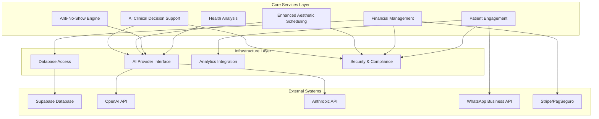
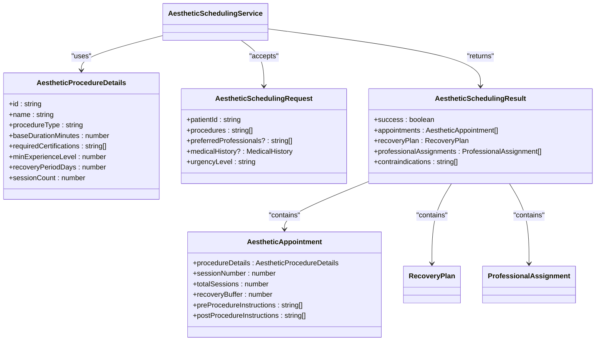
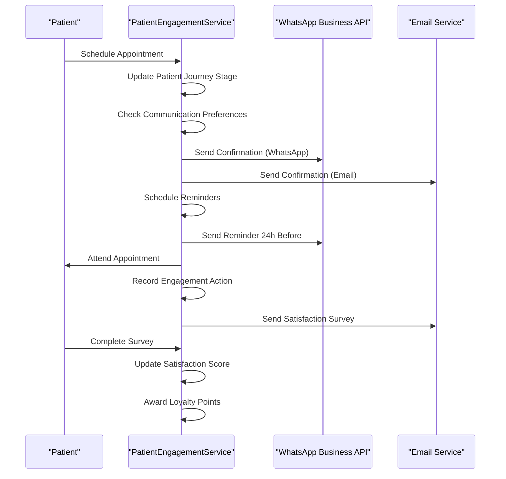
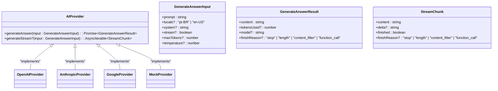
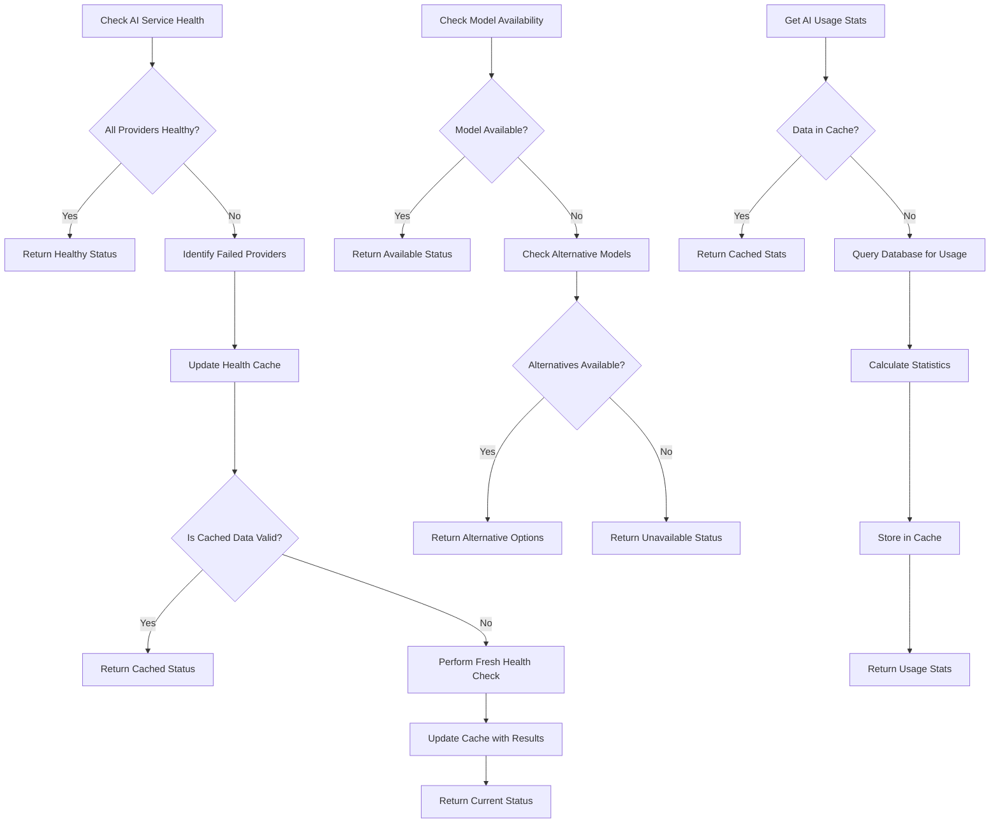
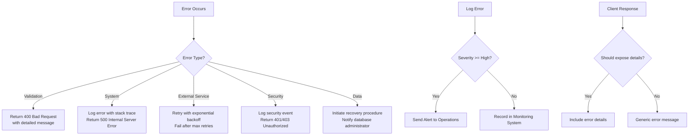

# Core Services Package

<cite>
**Referenced Files in This Document**   
- [ai-clinical-decision-support.ts](file://packages/core-services/src/services/ai-clinical-decision-support.ts)
- [enhanced-aesthetic-scheduling-service.ts](file://packages/core-services/src/services/enhanced-aesthetic-scheduling-service.ts)
- [financial-management-service.ts](file://packages/core-services/src/services/financial-management-service.ts)
- [patient-engagement-service.ts](file://packages/core-services/src/services/patient-engagement-service.ts)
- [ai-provider.ts](file://packages/core-services/src/services/ai-provider.ts)
- [ai-service-management.ts](file://packages/core-services/src/services/ai-service-management.ts)
- [health-analysis-service.ts](file://packages/core-services/src/services/health-analysis/health-analysis-service.ts)
- [anti-no-show-engine.ts](file://packages/core-services/src/services/anti-no-show-engine.ts)
</cite>

## Table of Contents
1. [Introduction](#introduction)
2. [Architecture Overview](#architecture-overview)
3. [Core Service Components](#core-service-components)
4. [Service Interfaces and Dependencies](#service-interfaces-and-dependencies)
5. [Integration with External Systems](#integration-with-external-systems)
6. [Error Handling Patterns](#error-handling-patterns)
7. [Practical Usage Examples](#practical-usage-examples)
8. [Common Issues and Solutions](#common-issues-and-solutions)
9. [Performance Optimization](#performance-optimization)
10. [Conclusion](#conclusion)

## Introduction

The core-services package serves as the central business logic layer for the neonpro healthcare platform, providing domain-specific services that power aesthetic clinics and medical practices. This package implements a service-oriented architecture that encapsulates complex business rules and workflows for AI clinical decision support, aesthetic scheduling, financial management, and patient engagement.

Designed with healthcare compliance in mind, these services adhere to Brazilian regulations including LGPD (General Data Protection Law), CFM (Federal Council of Medicine) guidelines, and ANVISA standards. The services are built to be consumed by various applications within the monorepo, providing a consistent interface for critical healthcare operations while maintaining separation of concerns between business logic and presentation layers.

The core-services package follows a modular design pattern, allowing individual services to be developed, tested, and deployed independently while sharing common infrastructure for error handling, logging, and security. This approach enables rapid iteration on specific business capabilities without affecting the stability of the overall system.

**Section sources**
- [ai-clinical-decision-support.ts](file://packages/core-services/src/services/ai-clinical-decision-support.ts#L1-L815)
- [enhanced-aesthetic-scheduling-service.ts](file://packages/core-services/src/services/enhanced-aesthetic-scheduling-service.ts#L1-L690)

## Architecture Overview

The core-services package implements a layered architecture with clear separation between service interfaces, business logic, and data access patterns. At its foundation is an AI provider abstraction layer that enables pluggable AI models from different vendors, ensuring vendor independence and failover capabilities.



**Diagram sources **
- [ai-provider.ts](file://packages/core-services/src/services/ai-provider.ts#L1-L30)
- [ai-clinical-decision-support.ts](file://packages/core-services/src/services/ai-clinical-decision-support.ts#L1-L815)
- [financial-management-service.ts](file://packages/core-services/src/services/financial-management-service.ts#L1-L1105)
- [patient-engagement-service.ts](file://packages/core-services/src/services/patient-engagement-service.ts#L1-L744)

The architecture follows the dependency inversion principle, where high-level modules (services) define their dependencies on abstractions rather than concrete implementations. This allows for easier testing through mocking and greater flexibility in swapping out components. Each service is designed to be stateless and idempotent where possible, facilitating horizontal scaling in high-throughput scenarios.

The services communicate with external systems through well-defined adapters that handle protocol translation, error recovery, and data transformation. This abstraction layer protects the core business logic from changes in external APIs and provides a consistent interface for retry mechanisms, circuit breaking, and rate limiting.

**Section sources**
- [ai-service-management.ts](file://packages/core-services/src/services/ai-service-management.ts#L1-L503)
- [ai-provider-factory.ts](file://packages/core-services/src/services/ai-provider-factory.ts#L1-L166)

## Core Service Components

### AI Clinical Decision Support Service

The AI Clinical Decision Support service provides intelligent treatment recommendations, contraindication detection, and clinical guidance for aesthetic procedures. It analyzes patient assessments including skin type, medical history, aesthetic goals, and budget constraints to generate evidence-based treatment plans.

Key features include:
- Comprehensive treatment recommendation engine with suitability scoring
- Contraindication analysis based on patient medical history and procedure requirements
- Evidence-based medicine level classification (A-D)
- Treatment plan prioritization and phased approach generation
- Risk assessment with mitigation strategies
- Follow-up schedule generation

The service integrates with the enhanced aesthetic scheduling service to ensure recommended treatments can be properly scheduled based on professional availability and certification requirements.

**Section sources**
- [ai-clinical-decision-support.ts](file://packages/core-services/src/services/ai-clinical-decision-support.ts#L1-L815)

### Enhanced Aesthetic Scheduling Service

The Enhanced Aesthetic Scheduling service specializes in managing appointments for aesthetic procedures with multi-session support, recovery planning, and professional certification validation. It extends the base appointment scheduling functionality with domain-specific requirements for aesthetic clinics.

Key capabilities include:
- Variable duration calculation based on procedure complexity and patient factors
- Professional certification and experience level validation
- Recovery period planning with follow-up appointments
- Room allocation optimization considering special equipment requirements
- Treatment package scheduling with recommended intervals between sessions
- Alternative treatment option generation based on patient preferences

The service ensures that only qualified professionals are assigned to procedures requiring specific certifications, maintaining compliance with medical board regulations.



**Diagram sources **
- [enhanced-aesthetic-scheduling-service.ts](file://packages/core-services/src/services/enhanced-aesthetic-scheduling-service.ts#L1-L690)

### Financial Management Service

The Financial Management service handles comprehensive billing, payment processing, and financial analytics with Brazilian tax compliance and multi-currency support. It manages clinic financial operations including service pricing, treatment packages, invoicing, and professional commissions.

Key functionalities:
- Multi-currency support (BRL, USD, EUR) with exchange rate handling
- Brazilian tax calculation and compliance (ISS, PIS, COFINS)
- Service pricing with professional council type differentiation
- Treatment package management with validity periods and discounts
- Invoice generation with automatic numbering and tax calculations
- Payment processing integration with multiple providers (PIX, boleto, credit card)
- Professional commission tracking and payout management
- Financial goal setting and progress tracking

The service validates all financial transactions against Brazilian regulatory requirements and maintains audit trails for compliance purposes.

**Section sources**
- [financial-management-service.ts](file://packages/core-services/src/services/financial-management-service.ts#L1-L1105)

### Patient Engagement Service

The Patient Engagement service manages communication preferences, automated messaging, loyalty programs, and satisfaction surveys to enhance patient retention and satisfaction. It personalizes interactions based on patient journey stages and behavioral patterns.

Core features include:
- Communication preference management across multiple channels (WhatsApp, SMS, email)
- Automated appointment reminders and follow-up care instructions
- Birthday greetings and reengagement campaigns for inactive patients
- Loyalty program management with tiered benefits and point accumulation
- Patient satisfaction surveys with Net Promoter Score (NPS) tracking
- Engagement campaign automation with trigger-based messaging sequences
- Patient journey stage tracking with engagement and satisfaction scoring

The service respects patient communication preferences and complies with anti-spam regulations, allowing patients to opt out of specific communication types.



**Diagram sources **
- [patient-engagement-service.ts](file://packages/core-services/src/services/patient-engagement-service.ts#L1-L744)

### Anti-No-Show Engine

The Anti-No-Show Engine uses AI-powered prediction and intervention strategies to reduce appointment no-shows in aesthetic clinics. It analyzes patient history, appointment characteristics, and behavioral patterns to assess no-show risk and automatically execute targeted interventions.

Key components:
- No-show risk prediction using machine learning models
- Risk level classification (low, medium, high) with confidence scoring
- Contributing factor identification for personalized interventions
- Multi-channel intervention execution (WhatsApp, SMS, phone, email)
- Optimal timing prediction for intervention effectiveness
- Intervention effectiveness analysis with ROI calculation
- Health checks for dependent services (ML provider, WhatsApp)

The engine adapts intervention strategies based on risk level, with more intensive approaches for high-risk appointments while minimizing costs for low-risk cases.

**Section sources**
- [anti-no-show-engine.ts](file://packages/core-services/src/services/anti-no-show-engine.ts#L1-L711)

### Health Analysis Service

The Health Analysis service provides AI-powered health insights generation by gathering patient data from multiple sources and analyzing it through structured prompts. It supports clinical decision-making with comprehensive health assessments.

Main capabilities:
- Patient data gathering from electronic health records and appointment history
- Structured prompt building for consistent AI analysis
- AI response parsing and validation for reliable output
- Health analysis result storage with metadata tracking
- Brazilian healthcare compliance (LGPD, CFM, ANVISA)
- Multi-provider AI support with failover mechanisms

The service ensures that AI-generated health insights are presented in a standardized format that clinicians can easily interpret and act upon.

**Section sources**
- [health-analysis-service.ts](file://packages/core-services/src/services/health-analysis/health-analysis-service.ts#L1-L384)

## Service Interfaces and Dependencies

### AI Provider Interface

The AI provider interface defines a common contract for AI services, enabling pluggable AI models from different vendors. This abstraction layer ensures that core services remain independent of specific AI provider implementations.



**Diagram sources **
- [ai-provider.ts](file://packages/core-services/src/services/ai-provider.ts#L1-L30)

### Service Dependencies

Core services depend on several shared packages and external systems to fulfill their responsibilities:

- **Database**: Supabase for persistent storage of clinical, financial, and patient data
- **Analytics**: Custom analytics package for usage tracking and business intelligence
- **Security**: Shared security package for authentication, authorization, and data protection
- **AI Providers**: Multiple AI vendors (OpenAI, Anthropic, Google) for generative capabilities
- **Communication Channels**: WhatsApp Business API, email services, and SMS gateways
- **Payment Processors**: Stripe, MercadoPago, and PagSeguro for financial transactions

The dependency structure follows the Hollywood Principle ("don't call us, we'll call you"), where core services declare their dependencies through constructor injection rather than directly instantiating dependent components. This promotes loose coupling and facilitates testing with mock dependencies.

**Section sources**
- [ai-provider-factory.ts](file://packages/core-services/src/services/ai-provider-factory.ts#L1-L166)
- [ai-service-management.ts](file://packages/core-services/src/services/ai-service-management.ts#L1-L503)

## Integration with External Systems

### AI Service Management

The AI Service Management component monitors the health and availability of AI services, providing crucial operational insights and failover capabilities. It implements comprehensive monitoring for AI providers and models.

Key integration points:
- **Health Checks**: Regular monitoring of AI provider endpoints to detect outages
- **Model Availability**: Verification of specific AI models' accessibility and performance
- **Usage Statistics**: Collection and reporting of AI usage metrics for cost optimization
- **Caching**: Local caching of health and availability information to reduce external calls
- **Failover**: Automatic switching to alternative providers when primary services fail

The service management system provides both real-time monitoring and historical analytics, enabling proactive maintenance and capacity planning for AI-dependent workflows.



**Diagram sources **
- [ai-service-management.ts](file://packages/core-services/src/services/ai-service-management.ts#L1-L503)

### Database Integration

Core services integrate with Supabase as the primary database system, leveraging its PostgreSQL foundation and additional features like real-time subscriptions and authentication. The integration follows repository pattern principles to abstract data access logic.

Key aspects of database integration:
- **Row Level Security (RLS)**: Implementation of fine-grained access controls based on user roles and permissions
- **Real-time Updates**: Utilization of Supabase's real-time capabilities for live data synchronization
- **Stored Procedures**: Use of database functions for complex operations that benefit from server-side execution
- **Full Text Search**: Implementation of advanced search capabilities for patient records and clinical notes
- **Geospatial Queries**: Support for location-based services and clinic proximity calculations

The financial management service additionally implements strict transactional integrity for financial operations, ensuring atomicity and consistency of accounting records.

**Section sources**
- [financial-management-service.ts](file://packages/core-services/src/services/financial-management-service.ts#L1-L1105)
- [patient-engagement-service.ts](file://packages/core-services/src/services/patient-engagement-service.ts#L1-L744)

### Third-party API Integrations

Core services integrate with various third-party APIs to extend functionality beyond the core platform:

- **WhatsApp Business API**: For patient communication, appointment reminders, and interactive messaging
- **Payment Processors**: Stripe, MercadoPago, and PagSeguro for secure payment processing
- **Email Services**: Transactional email providers for appointment confirmations and newsletters
- **SMS Gateways**: For text message notifications and verification codes
- **Video Conferencing**: Integration with WebRTC platforms for telemedicine consultations

These integrations follow a adapter pattern, where each external service has a dedicated adapter that translates between the service's internal data model and the external API's requirements. This abstraction layer isolates the core business logic from changes in external APIs and provides a consistent interface for error handling and retry mechanisms.

**Section sources**
- [patient-engagement-service.ts](file://packages/core-services/src/services/patient-engagement-service.ts#L1-L744)
- [financial-management-service.ts](file://packages/core-services/src/services/financial-management-service.ts#L1-L1105)

## Error Handling Patterns

### Centralized Error Management

The core-services package implements a comprehensive error handling strategy that categorizes errors by type and severity, providing appropriate responses and logging for each scenario.

Error categories include:
- **Validation Errors**: Invalid input parameters or business rule violations
- **System Errors**: Failures in internal components or dependencies
- **External Service Errors**: Failures in third-party APIs or network issues
- **Security Errors**: Authentication failures, authorization violations, or policy breaches
- **Data Errors**: Database connectivity issues, constraint violations, or data corruption

Each error type follows specific handling patterns:
- Validation errors return descriptive messages to clients to enable correction
- System errors trigger alerts to operations teams while returning generic messages to clients
- External service errors implement retry mechanisms with exponential backoff
- Security errors are logged extensively for audit purposes and may trigger account lockouts
- Data errors initiate recovery procedures and data integrity checks



**Diagram sources **
- [ai-clinical-decision-support.ts](file://packages/core-services/src/services/ai-clinical-decision-support.ts#L1-L815)
- [financial-management-service.ts](file://packages/core-services/src/services/financial-management-service.ts#L1-L1105)

### Resilience Patterns

Core services implement several resilience patterns to maintain availability and reliability under adverse conditions:

- **Circuit Breaker**: Prevents cascading failures by temporarily halting requests to failing services
- **Retry with Exponential Backoff**: Automatically retries failed operations with increasing delays
- **Bulkhead Isolation**: Limits resource consumption to prevent one failing component from affecting others
- **Fallback Mechanisms**: Provides degraded functionality when primary services are unavailable
- **Rate Limiting**: Protects services from overload by limiting request rates

The AI provider factory implements a sophisticated failover mechanism that attempts multiple AI providers in sequence when the primary provider fails, ensuring continuity of AI-powered features even during partial outages.

**Section sources**
- [ai-provider-factory.ts](file://packages/core-services/src/services/ai-provider-factory.ts#L1-L166)
- [ai-service-management.ts](file://packages/core-services/src/services/ai-service-management.ts#L1-L503)

## Practical Usage Examples

### Using AI Clinical Decision Support

To generate treatment recommendations for a patient assessment:

```typescript
// SPEC AISERVICE@generateTreatmentRecommendations(file://packages/core-services/src/services/ai-clinical-decision-support.ts#L150-L180)
const assessment: PatientAssessment = {
  patientId: "pat_123",
  skinType: "III",
  fitzpatrickScale: 3,
  skinConditions: ["acne", "hyperpigmentation"],
  medicalHistory: {
    allergies: ["penicillin"],
    medications: [],
    previousTreatments: ["chemical_peel"],
    chronicConditions: [],
    pregnancyStatus: "none"
  },
  aestheticGoals: ["reduce acne scars", "improve skin texture"],
  budgetRange: { min: 1000, max: 3000, currency: "BRL" }
};

const aiSupport = AIClinicalDecisionSupport.getInstance();
const recommendations = await aiSupport.generateTreatmentRecommendations(assessment);
```

To analyze contraindications for specific procedures:

```typescript
// SPEC AISERVICE@analyzeContraindications(file://packages/core-services/src/services/ai-clinical-decision-support.ts#L250-L280)
const analyses = await aiSupport.analyzeContraindications(
  "pat_123", 
  ["botox", "hyaluronic_fillers"]
);
```

### Implementing Aesthetic Scheduling

To schedule aesthetic procedures for a patient:

```typescript
// SPEC ENHANCEDAESTHETICSCHEDULINGSERVICE@scheduleAestheticProcedures(file://packages/core-services/src/services/enhanced-aesthetic-scheduling-service.ts#L100-L150)
const schedulingService = new EnhancedAestheticSchedulingService();

const request: AestheticSchedulingRequest = {
  patientId: "pat_123",
  procedures: ["botox", "hyaluronic_fillers"],
  preferredDates: [new Date("2024-03-15")],
  medicalHistory: {
    allergies: ["penicillin"],
    medications: [],
    previousProcedures: ["chemical_peel"],
    skinConditions: ["acne"],
    contraindications: []
  },
  urgencyLevel: "medium"
};

const result = await schedulingService.scheduleAestheticProcedures(request);
```

To validate professional certifications for a procedure:

```typescript
// SPEC ENHANCEDAESTHETICSCHEDULINGSERVICE@validateProfessionalCertifications(file://packages/core-services/src/services/enhanced-aesthetic-scheduling-service.ts#L250-L280)
const validation = await schedulingService.validateProfessionalCertifications(
  "prof_456", 
  ["botox"]
);
```

### Managing Financial Operations

To create a new service price:

```typescript
// SPEC FINANCIALMANAGEMENTSERVICE@createServicePrice(file://packages/core-services/src/services/financial-management-service.ts#L300-L330)
const financialService = new FinancialManagementService({
  supabaseUrl: process.env.SUPABASE_URL!,
  supabaseKey: process.env.SUPABASE_KEY!
});

const priceInput: ServicePriceInput = {
  clinicId: "clinic_789",
  serviceId: "botox",
  professionalCouncilType: "CFM",
  basePrice: 800,
  durationMinutes: 30,
  costOfMaterials: 200,
  professionalCommissionRate: 40,
  clinicRevenueRate: 60,
  effectiveDate: "2024-03-01"
};

const servicePrice = await financialService.createServicePrice(priceInput);
```

To process a payment transaction:

```typescript
// SPEC FINANCIALMANAGEMENTSERVICE@createPaymentTransaction(file://packages/core-services/src/services/financial-management-service.ts#L700-L730)
const paymentInput: PaymentTransactionInput = {
  clinicId: "clinic_789",
  invoiceId: "inv_123",
  patientId: "pat_123",
  transactionId: "txn_456",
  paymentMethod: "pix",
  paymentProvider: "mercadopago",
  amount: 800,
  currency: "BRL",
  installments: 1
};

const transaction = await financialService.createPaymentTransaction(paymentInput);
```

### Engaging Patients

To send a personalized communication:

```typescript
// SPEC PATIENTENGAGEMENTSERVICE@sendCommunication(file://packages/core-services/src/services/patient-engagement-service.ts#L200-L230)
const engagementService = new PatientEngagementService({
  supabaseUrl: process.env.SUPABASE_URL!,
  supabaseKey: process.env.SUPABASE_KEY!
});

const communication: CommunicationHistoryInput = {
  patientId: "pat_123",
  clinicId: "clinic_789",
  communicationType: "appointment_reminder",
  channel: "whatsapp",
  messageContent: "Seu agendamento para tratamento estético está marcado para amanhã às 14h.",
  status: "pending"
};

const result = await engagementService.sendCommunication(communication);
```

To update a patient's journey stage:

```typescript
// SPEC PATIENTENGAGEMENTSERVICE@updatePatientJourneyStage(file://packages/core-services/src/services/patient-engagement-service.ts#L350-L380)
const journeyUpdate: PatientJourneyStageInput = {
  patientId: "pat_123",
  clinicId: "clinic_789",
  currentStage: "treatment_in_progress",
  engagementScore: 85,
  satisfactionScore: 4,
  loyaltyTier: "gold",
  lastTreatmentDate: new Date(),
  nextRecommendedTreatmentDate: new Date(Date.now() + 30 * 24 * 60 * 60 * 1000)
};

await engagementService.updatePatientJourneyStage(journeyUpdate);
```

## Common Issues and Solutions

### Service Composition Challenges

When composing multiple services to accomplish complex workflows, developers may encounter several challenges:

**Issue**: Circular dependencies between services
**Solution**: Introduce mediator objects or events to break direct dependencies. For example, instead of the financial service directly calling the patient engagement service to send payment receipts, emit a "payment_processed" event that the engagement service listens for.

**Issue**: Transaction management across service boundaries
**Solution**: Implement distributed transaction patterns such as Saga pattern, where a series of local transactions are coordinated through events. Each service completes its work and publishes an event, with compensating actions available if subsequent steps fail.

**Issue**: Inconsistent data between services
**Solution**: Implement eventual consistency through event sourcing. When one service updates data, it publishes events that other services consume to update their own data stores, ensuring all views eventually converge.

### Data Consistency Problems

Maintaining data consistency across multiple services and databases requires careful design:

**Issue**: Race conditions in appointment scheduling
**Solution**: Implement optimistic concurrency control with version numbers. When updating appointment status, include the expected version number, and reject updates if the actual version differs, indicating another process modified the record.

**Issue**: Financial discrepancies between services
**Solution**: Implement double-entry bookkeeping principles where every financial transaction is recorded in at least two accounts (debit and credit). Regular reconciliation processes verify that all entries balance across systems.

**Issue**: Patient data synchronization delays
**Solution**: Use real-time database subscriptions to immediately propagate critical patient data changes. For non-critical updates, implement batch synchronization with conflict resolution strategies.

### Performance Bottlenecks

High-throughput scenarios can reveal performance limitations:

**Issue**: AI service latency affecting user experience
**Solution**: Implement caching of AI responses for identical or similar queries. Use streaming responses where appropriate to provide incremental results rather than waiting for complete processing.

**Issue**: Database query performance degradation
**Solution**: Implement query optimization through proper indexing, query batching, and read replicas for reporting queries. Use connection pooling to minimize database connection overhead.

**Issue**: Third-party API rate limiting
**Solution**: Implement request queuing and prioritization. Cache responses where appropriate and use bulk operations when available to reduce API call volume.

## Performance Optimization

### High-Throughput Considerations

For high-throughput scenarios, several optimization strategies can be applied:

**Caching Strategies**:
- Implement multi-layer caching with appropriate TTLs
- Cache AI service responses for identical inputs
- Cache frequently accessed reference data (procedure definitions, pricing)
- Use cache invalidation patterns to ensure data freshness

**Database Optimization**:
- Implement connection pooling to reduce connection overhead
- Use batch operations for bulk data processing
- Optimize queries with proper indexing and query planning
- Consider read replicas for reporting and analytics workloads

**Concurrency Patterns**:
- Use async/await patterns to maximize I/O utilization
- Implement worker queues for background processing of non-critical tasks
- Use parallel processing for independent operations
- Apply backpressure mechanisms to prevent system overload

### Scalability Approaches

To ensure services can scale with increasing demand:

**Horizontal Scaling**:
- Design services to be stateless where possible
- Externalize session state to distributed caches
- Use load balancers to distribute traffic across instances
- Implement health checks for automatic instance management

**Resource Management**:
- Implement rate limiting to protect services from overload
- Use circuit breakers to prevent cascading failures
- Apply bulkhead isolation to contain failures
- Monitor resource utilization for capacity planning

**Efficient Data Processing**:
- Use streaming for large data transfers
- Implement pagination for large result sets
- Apply data compression where appropriate
- Optimize payload sizes for network efficiency

## Conclusion

The core-services package provides a robust foundation for healthcare applications, implementing domain-specific business logic for AI clinical decision support, aesthetic scheduling, financial management, and patient engagement. By following service-oriented architecture principles, these components offer well-defined interfaces that can be consumed by various applications within the monorepo while maintaining separation of concerns.

The services demonstrate thoughtful design patterns including dependency injection, abstraction layers for external systems, comprehensive error handling, and resilience mechanisms. They integrate seamlessly with external systems through adapter patterns while maintaining compliance with healthcare regulations.

For developers, the package offers clear interfaces and practical examples for implementation. The documentation covers both conceptual overviews for beginners and technical details for experienced developers, addressing common issues and providing performance optimization tips for high-throughput scenarios.

As the healthcare platform evolves, the core-services package can be extended with additional domain services while maintaining backward compatibility through careful versioning and deprecation strategies. The modular design enables continuous improvement of individual services without disrupting the overall system stability.