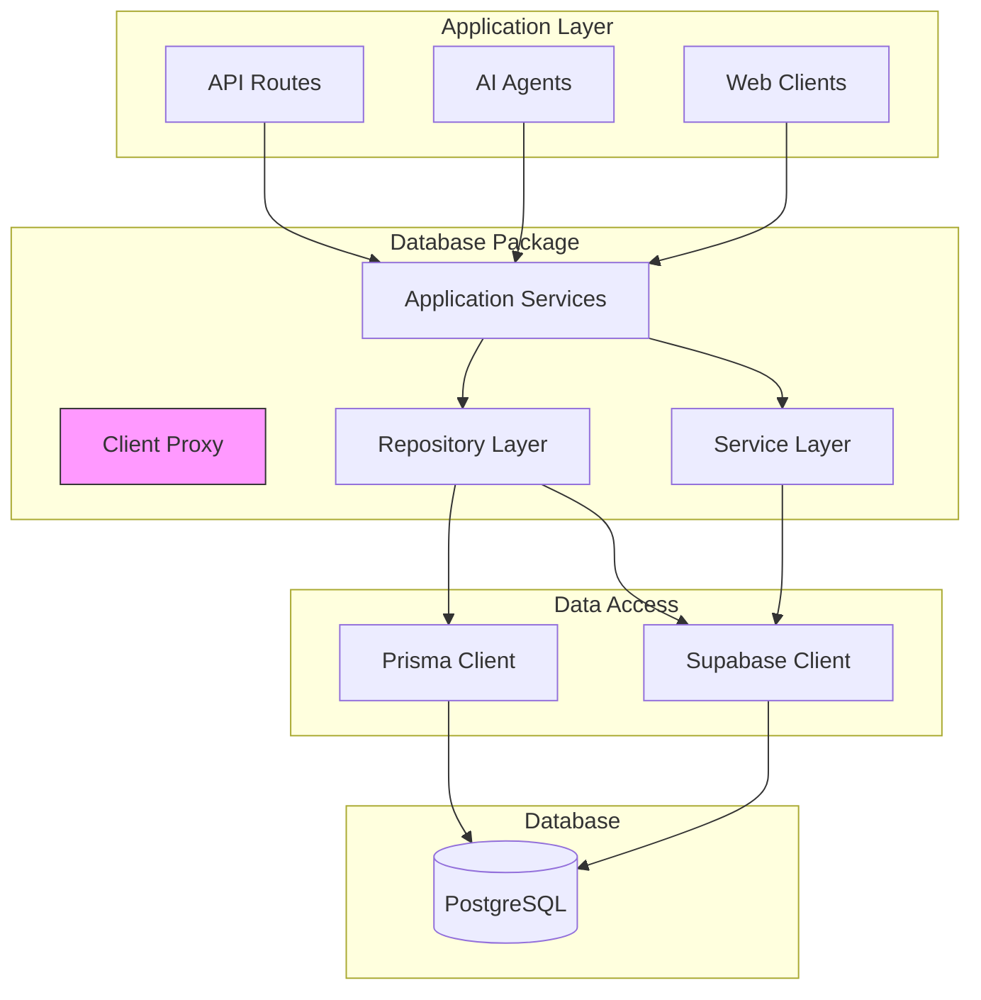
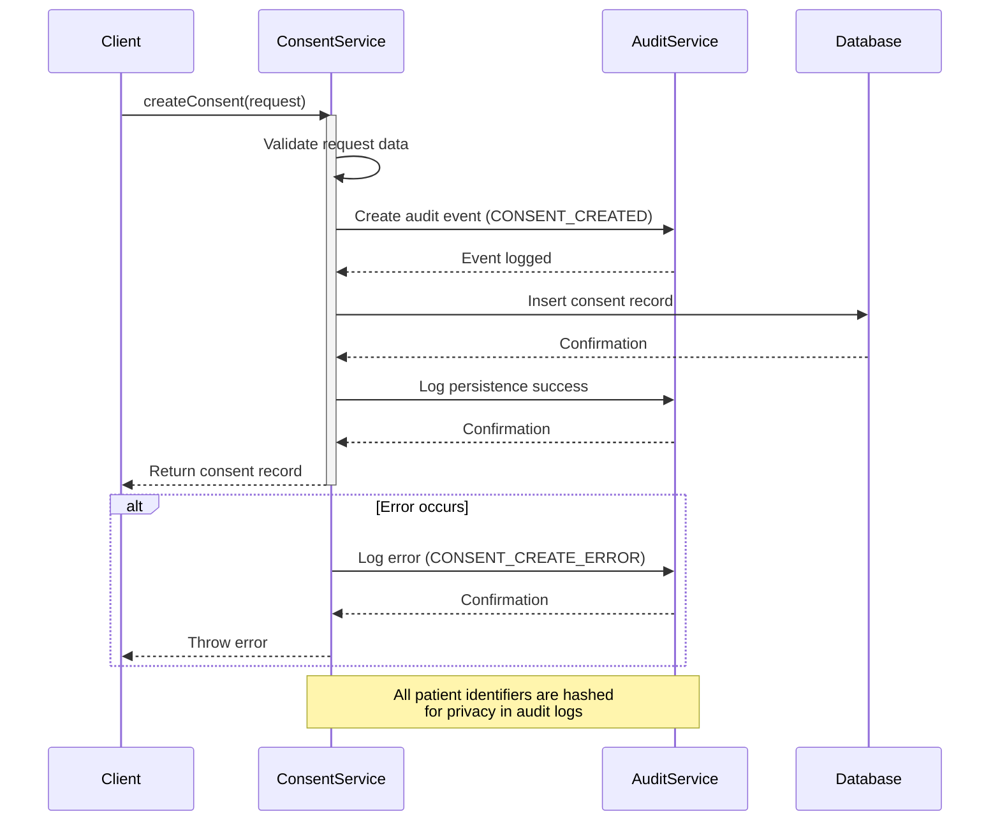
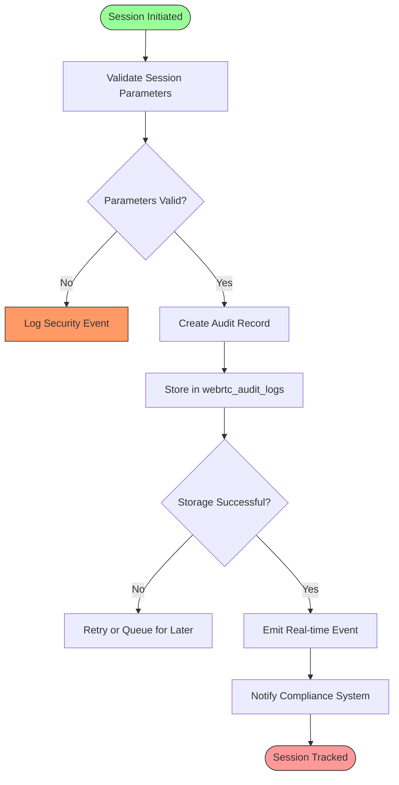
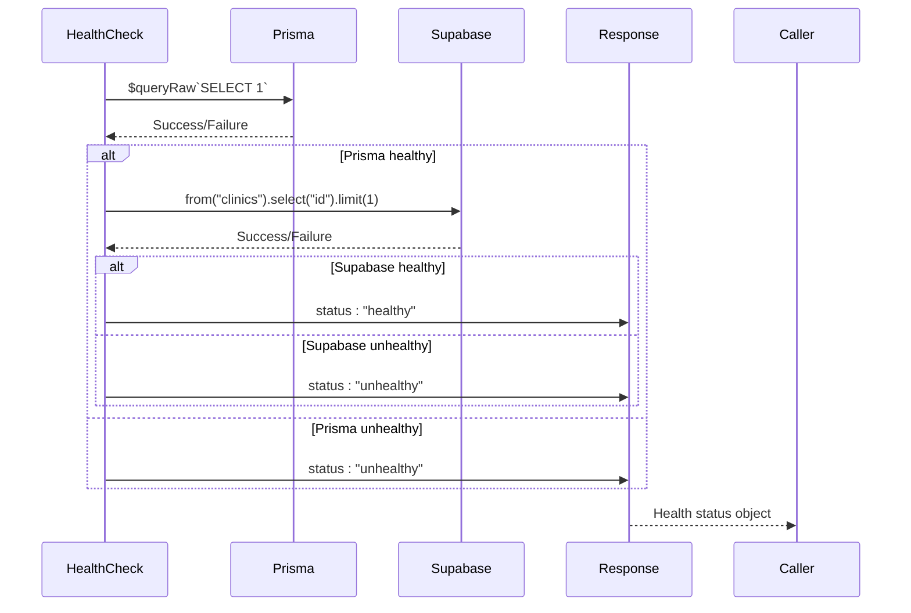
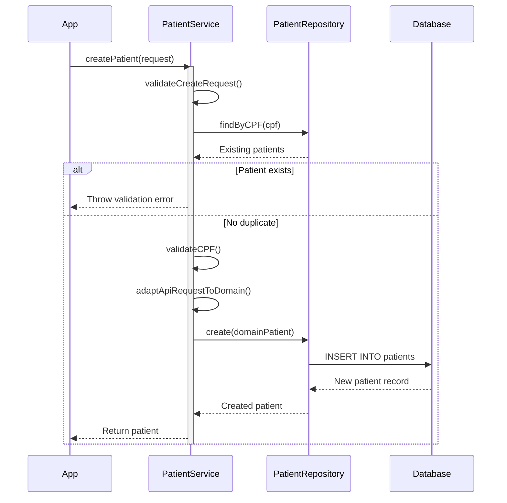

# Database Package

<cite>
**Referenced Files in This Document**   
- [client.ts](file://packages/database/src/client.ts)
- [index.ts](file://packages/database/src/index.ts)
- [patient-repository.ts](file://packages/database/src/repositories/patient-repository.ts)
- [consent-service.ts](file://packages/database/src/services/consent-service.ts)
- [audit-service.ts](file://packages/database/src/services/audit-service.ts)
- [patient-service.ts](file://packages/database/src/application/patient-service.ts)
- [repository-container.ts](file://packages/database/src/containers/repository-container.ts)
</cite>

## Table of Contents
1. [Introduction](#introduction)
2. [Core Architecture](#core-architecture)
3. [Repository Pattern Implementation](#repository-pattern-implementation)
4. [Service Layer Design](#service-layer-design)
5. [Connection Management](#connection-management)
6. [Health Monitoring and Graceful Shutdown](#health-monitoring-and-graceful-shutdown)
7. [Dependency Injection with Repository Container](#dependency-injection-with-repository-container)
8. [CRUD Operations Example](#crud-operations-example)
9. [Complex Query Implementation](#complex-query-implementation)
10. [Error Handling Strategy](#error-handling-strategy)
11. [Performance Optimization](#performance-optimization)
12. [Extending the Package](#extending-the-package)

## Introduction

The database package serves as the centralized data access layer for the neonpro monorepo, providing type-safe database operations through a combination of Prisma ORM and Supabase. Designed specifically for healthcare workloads, this package implements robust patterns for data access, transaction management, and compliance monitoring. The architecture follows clean separation of concerns with distinct repository and service layers, enabling both simplicity for common operations and flexibility for complex business logic.

This documentation provides comprehensive guidance for developers at all levels, from beginners learning database abstraction patterns to experienced developers implementing advanced query optimizations and transaction management strategies. The package is optimized for LGPD compliance and healthcare-specific requirements, including audit logging, consent management, and patient data protection.

## Core Architecture

The database package implements a multi-layer architecture that combines the strengths of Prisma ORM for type safety and Supabase for real-time capabilities and Row Level Security (RLS). This hybrid approach allows the system to leverage Prisma's excellent TypeScript integration while maintaining compatibility with Supabase's authentication and authorization features.



**Diagram sources**
- [client.ts](file://packages/database/src/client.ts)
- [index.ts](file://packages/database/src/index.ts)

**Section sources**
- [client.ts](file://packages/database/src/client.ts#L1-L268)
- [index.ts](file://packages/database/src/index.ts#L1-L56)

## Repository Pattern Implementation

The repository pattern is implemented to abstract database operations and provide a clean interface between the domain layer and data storage. Each repository encapsulates all data access logic for a specific entity, following the interface segregation principle.

### Patient Repository Analysis

The `PatientRepository` class demonstrates a comprehensive implementation of the repository pattern with proper error handling, logging, and data transformation.

```mermaid
classDiagram
class IPatientRepository {
<<interface>>
+findById(id : string) : Promise~Patient | null~
+findByMedicalRecordNumber(mrn : string) : Promise~Patient | null~
+findByCPF(cpf : string) : Promise~Patient[]~
+findByClinicId(clinicId : string, options? : PatientQueryOptions) : Promise~PatientSearchResult~
+findWithFilter(filter : PatientFilters, options? : PatientQueryOptions) : Promise~PatientSearchResult~
+create(patientData : CreatePatientRequest) : Promise~Patient~
+update(id : string, patientData : UpdatePatientRequest) : Promise~Patient~
+delete(id : string) : Promise~boolean~
+search(query : string, clinicId? : string, options? : PatientQueryOptions) : Promise~PatientSearchResult~
+count(filter : PatientFilters) : Promise~number~
}
class PatientRepository {
-supabase : SupabaseClient
+findById(id : string) : Promise~Patient | null~
+findByMedicalRecordNumber(mrn : string) : Promise~Patient | null~
+findByCPF(cpf : string) : Promise~Patient[]~
+findByClinicId(clinicId : string, options? : PatientQueryOptions) : Promise~PatientSearchResult~
+findWithFilter(filter : PatientFilters, options? : PatientQueryOptions) : Promise~PatientSearchResult~
+create(patientData : CreatePatientRequest) : Promise~Patient~
+update(id : string, patientData : UpdatePatientRequest) : Promise~Patient~
+delete(id : string) : Promise~boolean~
+search(query : string, clinicId? : string, options? : PatientQueryOptions) : Promise~PatientSearchResult~
+count(filter : PatientFilters) : Promise~number~
-mapDatabasePatientToDomain(dbPatient : DatabasePatient) : Patient
-mapCreateRequestToDatabase(request : CreatePatientRequest) : Partial~DatabasePatient~
-mapUpdateRequestToDatabase(request : UpdatePatientRequest) : Partial~DatabasePatient~
}
IPatientRepository <|.. PatientRepository
note right of PatientRepository
Implements Supabase-based data access
with comprehensive error handling and
healthcare-specific logging
end
```

**Diagram sources**
- [patient-repository.ts](file://packages/database/src/repositories/patient-repository.ts#L12-L570)

**Section sources**
- [patient-repository.ts](file://packages/database/src/repositories/patient-repository.ts#L1-L570)

## Service Layer Design

The service layer provides higher-level business logic that orchestrates multiple repository operations and enforces domain rules. Services are designed to be reusable across different application contexts and include specialized functionality for compliance and auditing.

### Consent Service Implementation

The `ConsentService` exemplifies healthcare-specific business logic with LGPD compliance features, audit trails, and privacy-preserving practices.



**Diagram sources**
- [consent-service.ts](file://packages/database/src/services/consent-service.ts#L43-L98)

**Section sources**
- [consent-service.ts](file://packages/database/src/services/consent-service.ts#L1-L670)

### Audit Service Workflow

The `AuditService` manages comprehensive logging for security, compliance, and operational monitoring, particularly for WebRTC telemedicine sessions.



**Diagram sources**
- [audit-service.ts](file://packages/database/src/services/audit-service.ts#L98-L122)

**Section sources**
- [audit-service.ts](file://packages/database/src/services/audit-service.ts#L1-L680)

## Connection Management

The database package implements sophisticated connection management strategies optimized for healthcare workloads, balancing performance, reliability, and resource efficiency.

### Client Configuration

The package exports multiple client types for different use cases:

- **Optimized Supabase Client**: For server-side operations with RLS bypass
- **Browser Supabase Client**: For client-side operations with RLS enforcement  
- **Prisma Client**: For type-safe database operations with advanced query capabilities

```mermaid
classDiagram
class DatabaseClients {
+supabase : SupabaseClient
+supabaseBrowser : SupabaseClient
+prisma : PrismaClient
}
class ClientConfiguration {
+createOptimizedSupabaseClient() : SupabaseClient
+createBrowserSupabaseClient() : SupabaseClient
+createPrismaClient() : PrismaClient
}
class ConnectionPooling {
+maxPoolSize : number
+minPoolSize : number
+acquireTimeoutMillis : number
+idleTimeoutMillis : number
}
DatabaseClients --> ClientConfiguration
DatabaseClients --> ConnectionPooling
note right of ConnectionPooling
Configured for healthcare workloads : <br/>
• maxPoolSize : 20<br/>
• idleTimeoutMillis : 30000<br/>
• Conservative event rates for real-time
end
```

**Section sources**
- [client.ts](file://packages/database/src/client.ts#L1-L268)

## Health Monitoring and Graceful Shutdown

The package includes built-in health monitoring and graceful shutdown capabilities to ensure system reliability and proper resource cleanup.

### Health Check Implementation



**Diagram sources**
- [client.ts](file://packages/database/src/client.ts#L221-L244)

### Graceful Shutdown Process

The package automatically handles process termination signals to ensure proper database connection cleanup:

```mermaid
flowchart LR
A[Process SIGINT/SIGTERM] --> B[closeDatabaseConnections()]
B --> C[prisma.$disconnect()]
C --> D{Disconnect Success?}
D --> |Yes| E[Log success message]
D --> |No| F[Log error details]
F --> G[Continue with shutdown]
E --> G
G --> H[Process exits cleanly]
```

**Diagram sources**
- [client.ts](file://packages/database/src/client.ts#L247-L257)

**Section sources**
- [client.ts](file://packages/database/src/client.ts#L221-L257)

## Dependency Injection with Repository Container

The `RepositoryContainer` implements the service locator pattern to manage dependencies and enable dependency injection across the application.

```mermaid
classDiagram
class RepositoryContainer {
-static instance : RepositoryContainer
-supabase : SupabaseClient
-patientRepository : IPatientRepository
-consentRepository : IConsentRepository
-appointmentRepository : IAppointmentRepository
+initialize(supabase : SupabaseClient) : RepositoryContainer
+getInstance() : RepositoryContainer
+getPatientRepository() : IPatientRepository
+getConsentRepository() : IConsentRepository
+getAppointmentRepository() : IAppointmentRepository
+getAuditService() : AuditDomainService
+getConsentService() : ConsentDomainService
+reset() : void
+getRepositories() : Object
+getServices() : Object
+getDependencies() : Object
}
note right of RepositoryContainer
Singleton pattern ensures single instance<br/>
Lazy loading creates repositories on first access<br/>
Reset method supports testing scenarios
end
```

**Diagram sources**
- [repository-container.ts](file://packages/database/src/containers/repository-container.ts#L19-L169)

**Section sources**
- [repository-container.ts](file://packages/database/src/containers/repository-container.ts#L1-L169)

## CRUD Operations Example

The package provides straightforward interfaces for basic CRUD operations while maintaining proper error handling and logging.

### Creating a Patient



**Section sources**
- [patient-service.ts](file://packages/database/src/application/patient-service.ts#L23-L58)
- [patient-repository.ts](file://packages/database/src/repositories/patient-repository.ts#L18-L44)

## Complex Query Implementation

The repository pattern supports complex queries with filtering, pagination, sorting, and relationship loading.

### Patient Search with Multiple Criteria

When searching for patients, the repository combines multiple query parameters into an efficient database operation:

```typescript
async findWithFilter(
  filter: PatientFilters,
  options?: PatientQueryOptions
): Promise<PatientSearchResult>
```

This method demonstrates several optimization techniques:
- **Conditional query building**: Only applies filters that are specified
- **Efficient pagination**: Uses Supabase's range() method instead of offset/limit
- **Intelligent sorting**: Defaults to creation date when no sort field specified
- **Count optimization**: Uses count: "exact" for accurate totals

The implementation avoids the N+1 query problem by using Supabase's relational queries to load associated data (clinic information and appointment counts) in a single round trip.

**Section sources**
- [patient-repository.ts](file://packages/database/src/repositories/patient-repository.ts#L120-L200)

## Error Handling Strategy

The package implements a comprehensive error handling strategy that prioritizes security, observability, and user experience.

### Healthcare-Specific Error Logging

All database operations include healthcare-aware error logging that:
- Redacts sensitive patient information
- Includes contextual metadata for debugging
- Preserves error types for appropriate handling
- Integrates with the broader observability system

The `logHealthcareError` function ensures that errors are logged consistently across the application while protecting patient privacy.

**Section sources**
- [patient-repository.ts](file://packages/database/src/repositories/patient-repository.ts#L25-L40)
- [patient-repository.ts](file://packages/database/src/repositories/patient-repository.ts#L60-L75)

## Performance Optimization

The database package incorporates several performance optimization techniques tailored to healthcare applications.

### Connection Pooling Configuration

The optimized Supabase client configuration includes settings specifically tuned for healthcare workloads:
- Reduced real-time events per second (10) to prevent overwhelming medical staff
- Server-side session persistence disabled for stateless API operations
- Custom headers for application identification and monitoring

### Query Optimization Techniques

The repositories implement several query optimization patterns:
- **Selective field selection**: Only retrieves needed fields
- **Batch operations**: Minimizes round trips for related data
- **Index-aware queries**: Uses database indexes effectively
- **Caching hints**: Includes metadata for potential caching layers

### Lazy-Loaded Proxies

The main clients (supabase, prisma) are implemented as proxies that are only instantiated when first accessed, reducing startup time and memory usage for modules that don't require database access.

**Section sources**
- [client.ts](file://packages/database/src/client.ts#L1-L268)

## Extending the Package

The modular design allows for easy extension of the database package with new repositories and services.

### Adding a New Repository

To add a new repository:
1. Implement the repository interface in `src/repositories/`
2. Add the export to `src/repositories/index.ts`
3. Register in `RepositoryContainer` if needed
4. Export types in `src/types/`

### Creating a New Service

To create a new service:
1. Implement the service class in `src/services/`
2. Add exports to `src/services/index.ts`
3. Include type exports for external consumption
4. Integrate with existing audit and error handling systems

The package's architecture supports both vertical scaling (adding new entities) and horizontal scaling (adding new capabilities) while maintaining consistency across the codebase.

**Section sources**
- [index.ts](file://packages/database/src/index.ts#L1-L56)