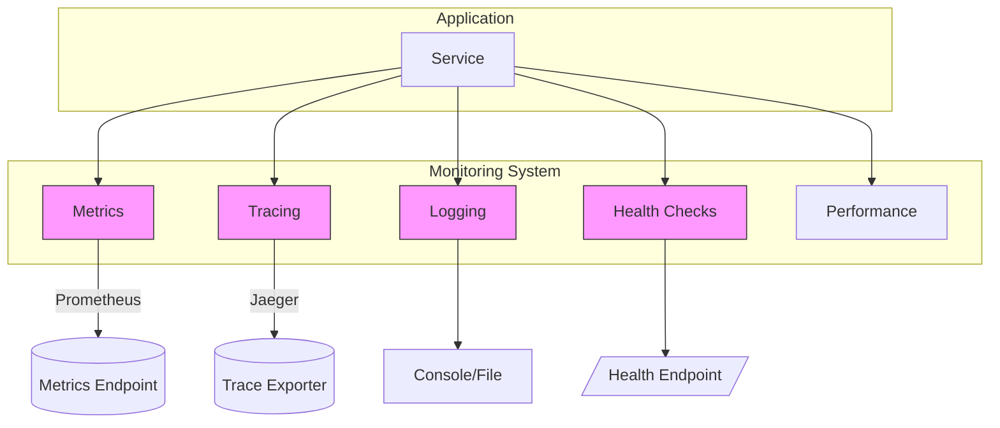
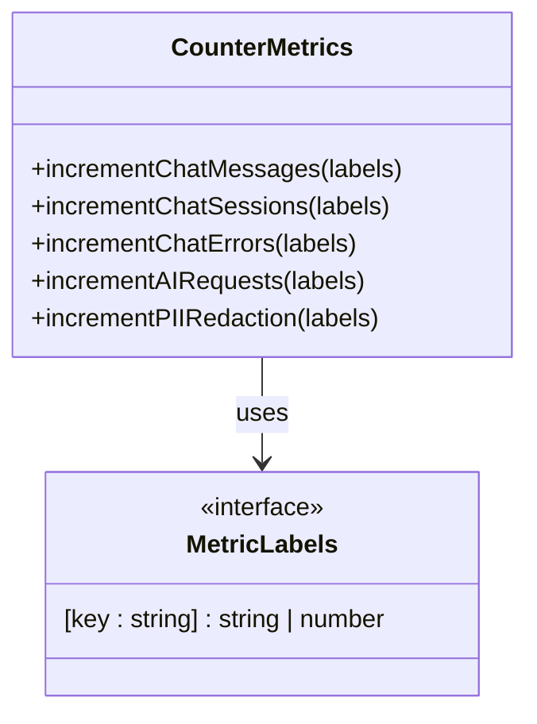
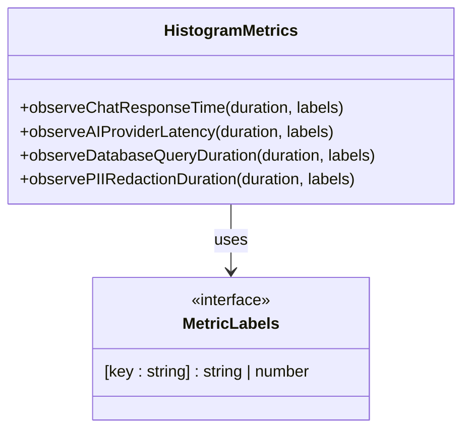
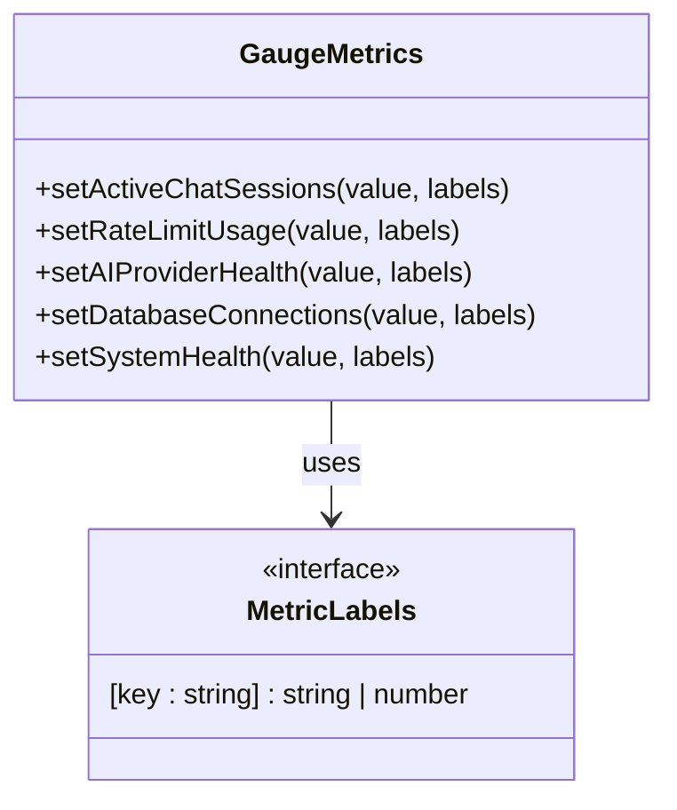
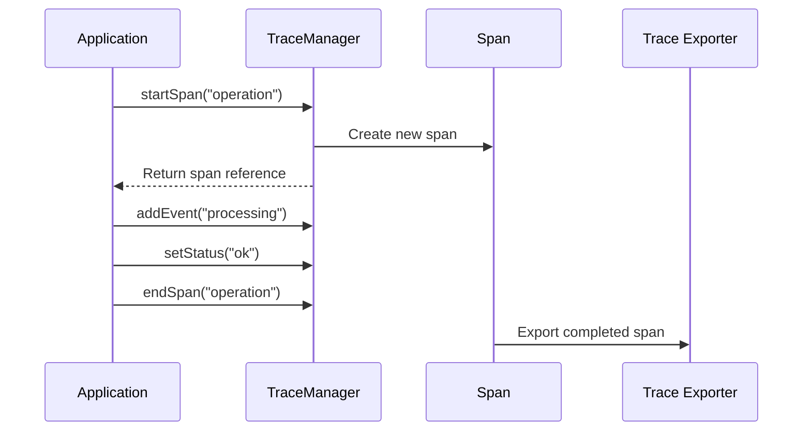

# Monitoring Package

<cite>
**Referenced Files in This Document**
- [index.ts](file://packages/monitoring/src/index.ts)
- [init.ts](file://packages/monitoring/src/init.ts)
- [types.ts](file://packages/monitoring/src/types.ts)
- [metrics/init.ts](file://packages/monitoring/src/metrics/init.ts)
- [metrics/prometheus.ts](file://packages/monitoring/src/metrics/prometheus.ts)
- [metrics/counters.ts](file://packages/monitoring/src/metrics/counters.ts)
- [metrics/histograms.ts](file://packages/monitoring/src/metrics/histograms.ts)
- [metrics/gauges.ts](file://packages/monitoring/src/metrics/gauges.ts)
- [tracing/tracer.ts](file://packages/monitoring/src/tracing/tracer.ts)
- [health/init.ts](file://packages/monitoring/src/health/init.ts)
- [logging/winston.ts](file://packages/monitoring/src/logging/winston.ts)
</cite>

## Table of Contents

1. [Introduction](#introduction)
2. [Core Components](#core-components)
3. [Architecture Overview](#architecture-overview)
4. [Detailed Component Analysis](#detailed-component-analysis)
5. [Dependency Analysis](#dependency-analysis)
6. [Performance Considerations](#performance-considerations)
7. [Troubleshooting Guide](#troubleshooting-guide)
8. [Conclusion](#conclusion)

## Introduction

The monitoring package in the neonpro repository provides comprehensive observability for distributed systems through metrics collection, distributed tracing, and health check endpoints. This documentation explains how the system enables visibility into application performance, error tracking, and service health across microservices architecture. The implementation leverages industry-standard tools including Prometheus for metrics, OpenTelemetry for tracing, and customizable health checks for service availability monitoring. Designed with extensibility in mind, the package offers both high-level initialization functions and granular control over individual monitoring aspects.

## Core Components

The monitoring package is structured around five core capabilities: metrics collection, distributed tracing, logging integration, performance tracking, and health checking. These components are exposed through a unified interface in the main index file, allowing applications to import specific functionality as needed. The system supports configuration-driven initialization through the `initializeMonitoring` function, which sets up all enabled subsystems based on environment-specific settings. Key abstractions include metric types (counters, histograms, gauges), trace management, and health check registration that enable consistent monitoring patterns across services.

**Section sources**

- [index.ts](file://packages/monitoring/src/index.ts#L1-L21)
- [init.ts](file://packages/monitoring/src/init.ts#L0-L101)
- [types.ts](file://packages/monitoring/src/types.ts#L0-L64)

## Architecture Overview



**Diagram sources**

- [init.ts](file://packages/monitoring/src/init.ts#L0-L101)
- [metrics/init.ts](file://packages/monitoring/src/metrics/init.ts#L0-L26)
- [tracing/tracer.ts](file://packages/monitoring/src/tracing/tracer.ts#L0-L109)
- [health/init.ts](file://packages/monitoring/src/health/init.ts#L0-L218)

## Detailed Component Analysis

### Metrics Implementation

The metrics subsystem implements Prometheus-based monitoring with three primary metric types: counters, histograms, and gauges. Counters track cumulative values like request counts and errors, histograms measure distributions such as response times and latencies, while gauges capture instantaneous values including active sessions and system resource usage. The implementation uses prom-client library to create a shared registry with default labels for service identification, version tracking, and environment context.

#### Counter Metrics



**Diagram sources**

- [metrics/counters.ts](file://packages/monitoring/src/metrics/counters.ts#L0-L71)
- [types.ts](file://packages/monitoring/src/types.ts#L0-L64)

#### Histogram Metrics



**Diagram sources**

- [metrics/histograms.ts](file://packages/monitoring/src/metrics/histograms.ts#L0-L74)
- [types.ts](file://packages/monitoring/src/types.ts#L0-L64)

#### Gauge Metrics



**Diagram sources**

- [metrics/gauges.ts](file://packages/monitoring/src/metrics/gauges.ts#L0-L86)
- [types.ts](file://packages/monitoring/src/types.ts#L0-L64)

### Tracing System

The tracing component implements OpenTelemetry standards for distributed tracing across service boundaries. It provides both low-level span management and high-level async/sync tracing utilities that simplify instrumentation of application code. The system automatically instruments HTTP and Express.js components while allowing custom spans for business logic operations. Trace data can be exported to Jaeger or other OpenTelemetry-compatible backends for visualization and analysis.

#### Tracing Workflow



**Diagram sources**

- [tracing/tracer.ts](file://packages/monitoring/src/tracing/tracer.ts#L0-L109)
- [init.ts](file://packages/monitoring/src/init.ts#L0-L101)

### Health Check System

The health check subsystem provides periodic assessment of service viability through multiple diagnostic checks. It evaluates system resources, database connectivity, AI provider availability, and memory usage at configurable intervals. The system aggregates individual check results to determine overall service status (healthy, degraded, or unhealthy) and exposes this information through a dedicated endpoint for load balancers and orchestration systems.

#### Health Check Flow

```mermaid
flowchart TD
Start([Run Health Checks]) --> SystemCheck["checkSystemHealth()"]
Start --> DatabaseCheck["checkDatabaseHealth()"]
Start --> AIProvidersCheck["checkAIProvidersHealth()"]
Start --> MemoryCheck["checkMemoryUsage()"]
SystemCheck --> SystemResult{Success?}
DatabaseCheck --> DatabaseResult{Success?}
AIProvidersCheck --> AIResult{Success?}
MemoryCheck --> MemoryResult{Success?}
SystemResult --> |Yes| SystemPass[Status: pass]
SystemResult --> |No| SystemFail[Status: fail]
DatabaseResult --> |Yes| DatabasePass[Status: pass]
DatabaseResult --> |No| DatabaseFail[Status: fail]
AIResult --> |Yes| AIPass[Status: pass]
AIResult --> |No| AIFail[Status: fail]
MemoryResult --> |Yes| MemoryPass[Status: pass]
MemoryResult --> |No| MemoryFail[Status: fail]
SystemPass --> Aggregate[Aggregate Results]
SystemFail --> Aggregate
DatabasePass --> Aggregate
DatabaseFail --> Aggregate
AIPass --> Aggregate
AIFail --> Aggregate
MemoryPass --> Aggregate
MemoryFail --> Aggregate
Aggregate --> DetermineStatus{Failed checks > 0?}
DetermineStatus --> |Yes| Unhealthy[status = "unhealthy"]
DetermineStatus --> |No| WarningCheck{Warning checks > 0?}
WarningCheck --> |Yes| Degraded[status = "degraded"]
WarningCheck --> |No| Healthy[status = "healthy"]
Unhealthy --> ReturnStatus[Return HealthStatus]
Degraded --> ReturnStatus
Healthy --> ReturnStatus
```

**Diagram sources**

- [health/init.ts](file://packages/monitoring/src/health/init.ts#L0-L218)
- [types.ts](file://packages/monitoring/src/types.ts#L0-L64)

## Dependency Analysis

```mermaid
graph LR
A[Monitoring Package] --> B[prom-client]
A --> C[@opentelemetry/sdk-node]
A --> D[@opentelemetry/exporter-jaeger]
A --> E[@opentelemetry/instrumentation-http]
A --> F[@opentelemetry/instrumentation-express]
A --> G[winston]
style A fill:#ffcc00,stroke:#333
style B fill:#99ccff,stroke:#333
style C fill:#99ccff,stroke:#333
style D fill:#99ccff,stroke:#333
style E fill:#99ccff,stroke:#333
style F fill:#99ccff,stroke:#333
style G fill:#99ccff,stroke:#333
```

**Diagram sources**

- [package.json](file://packages/monitoring/package.json)
- [init.ts](file://packages/monitoring/src/init.ts#L0-L101)
- [metrics/prometheus.ts](file://packages/monitoring/src/metrics/prometheus.ts#L0-L35)
- [tracing/tracer.ts](file://packages/monitoring/src/tracing/tracer.ts#L0-L109)
- [logging/winston.ts](file://packages/monitoring/src/logging/winston.ts#L0-L56)

**Section sources**

- [init.ts](file://packages/monitoring/src/init.ts#L0-L101)
- [metrics/prometheus.ts](file://packages/monitoring/src/metrics/prometheus.ts#L0-L35)
- [tracing/tracer.ts](file://packages/monitoring/src/tracing/tracer.ts#L0-L109)
- [logging/winston.ts](file://packages/monitoring/src/logging/winston.ts#L0-L56)

## Performance Considerations

The monitoring system balances observability needs with performance overhead through several design choices. Metrics collection uses efficient data structures and batched processing to minimize impact on application throughput. Tracing employs sampling strategies to reduce volume while maintaining representative data. Health checks run on configurable intervals to prevent excessive resource consumption. The system also includes safeguards against high-cardinality metrics that could degrade Prometheus performance. For production deployments, it's recommended to adjust sampling rates and metric granularity based on actual traffic patterns and monitoring requirements.

## Troubleshooting Guide

Common issues with the monitoring package typically involve configuration errors, missing dependencies, or network connectivity problems. Ensure that required environment variables are properly set, especially for service name and version information used in metrics labeling. Verify that the metrics port (default 9464) is accessible and not blocked by firewalls. When using Jaeger tracing, confirm that the exporter endpoint is reachable from the application environment. For health checks failing unexpectedly, review the specific check implementations and their timeout thresholds. The logging system can provide diagnostic information about monitoring initialization and runtime behavior when set to debug level.

**Section sources**

- [init.ts](file://packages/monitoring/src/init.ts#L0-L101)
- [health/init.ts](file://packages/monitoring/src/health/init.ts#L0-L218)
- [logging/winston.ts](file://packages/monitoring/src/logging/winston.ts#L0-L56)

## Conclusion

The monitoring package provides a robust foundation for observability in the neonpro ecosystem, enabling teams to gain insights into system behavior, diagnose issues, and ensure service reliability. By standardizing on Prometheus metrics, OpenTelemetry tracing, and comprehensive health checks, the package establishes consistent monitoring practices across services. Its modular design allows selective adoption of components while maintaining integration points for full-stack visibility. As the system evolves, additional metrics and checks can be incorporated to address emerging operational requirements and performance optimization opportunities.
