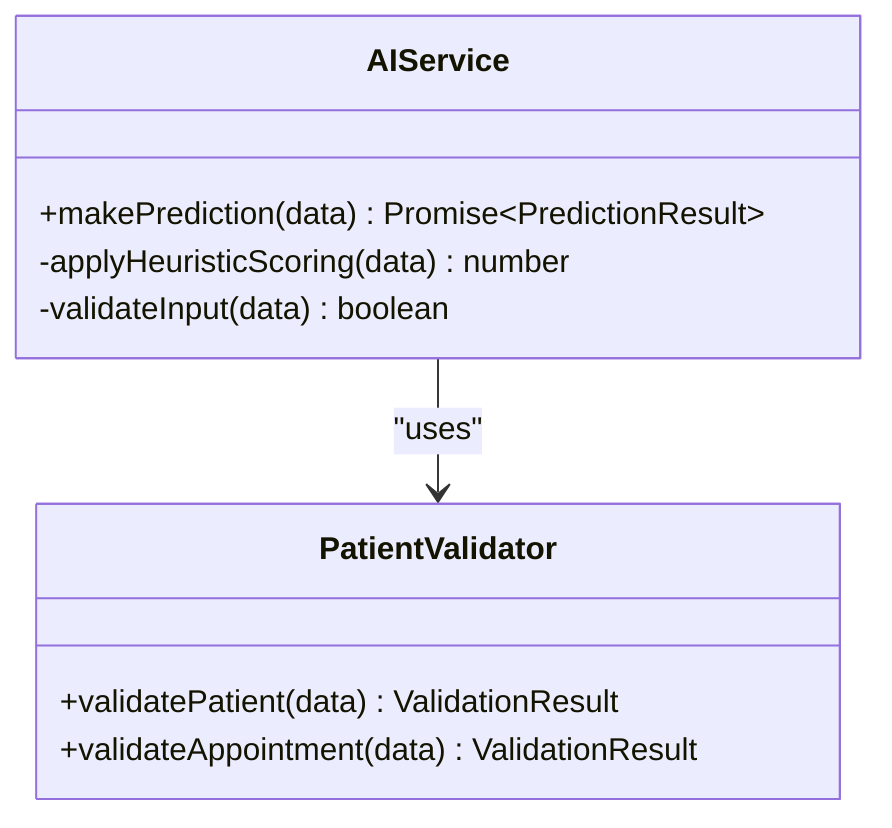
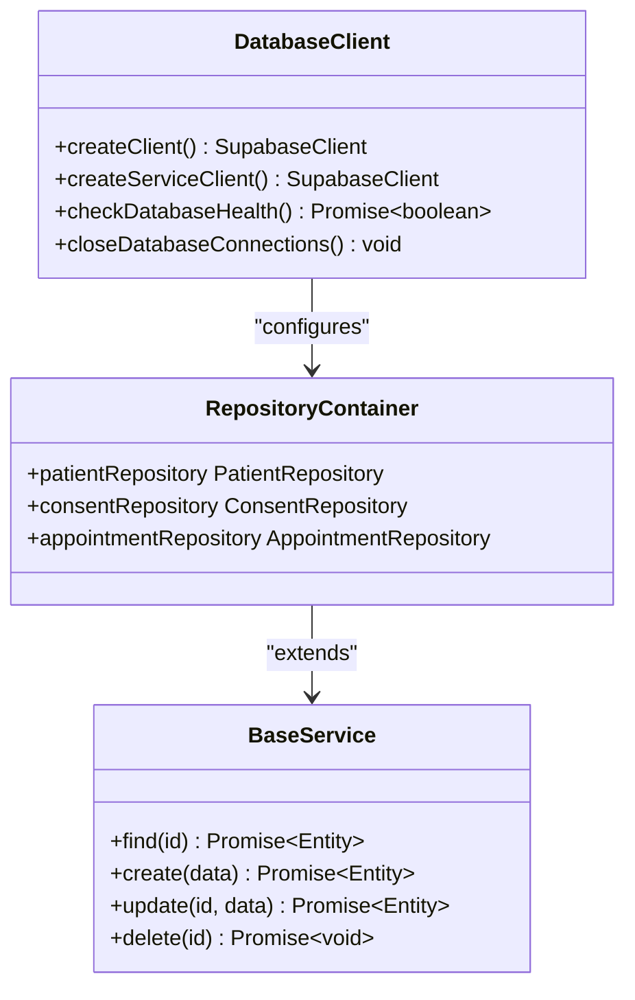
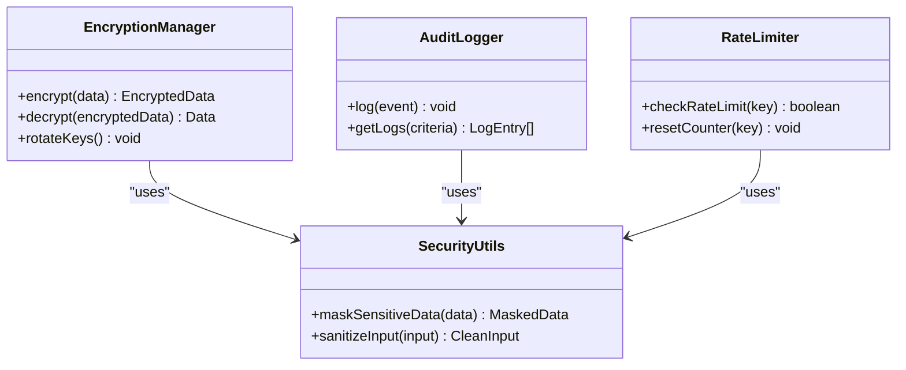
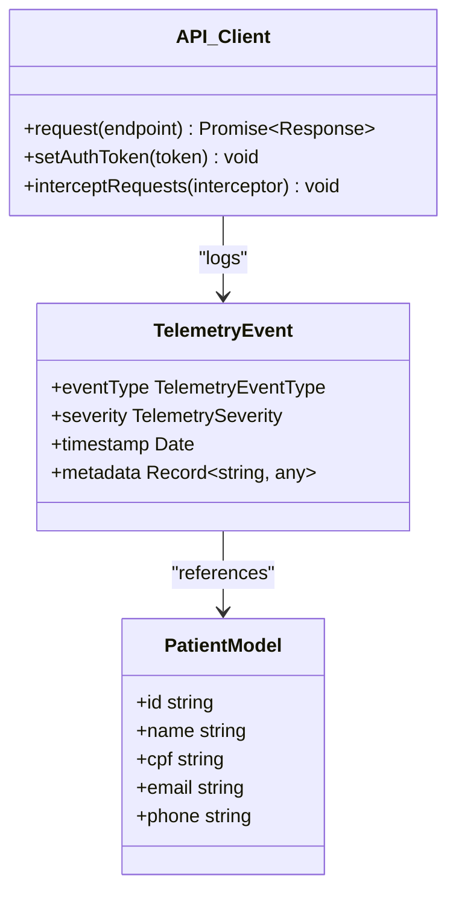
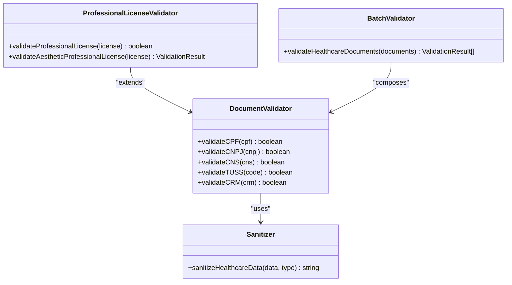

# Packages Directory

<cite>
**Referenced Files in This Document **   
- [core-services/README.md](file://packages/core-services/README.md)
- [database/README.md](file://packages/database/README.md)
- [security/src/index.ts](file://packages/security/src/index.ts)
- [shared/src/index.ts](file://packages/shared/src/index.ts)
- [validators/src/index.ts](file://packages/validators/src/index.ts)
- [core-services/src/index.ts](file://packages/core-services/src/index.ts)
- [database/src/index.ts](file://packages/database/src/index.ts)
- [monitoring/src/index.ts](file://packages/monitoring/src/index.ts)
- [analytics/src/index.ts](file://packages/analytics/src/index.ts)
</cite>

## Table of Contents
1. [Introduction](#introduction)
2. [Core Packages Overview](#core-packages-overview)
3. [Package Interdependencies and Architecture](#package-interdependencies-and-architecture)
4. [Import Patterns and Usage Examples](#import-patterns-and-usage-examples)
5. [Versioning and Monorepo Management](#versioning-and-monorepo-management)
6. [Best Practices for Package Creation](#best-practices-for-package-creation)
7. [Common Issues and Solutions](#common-issues-and-solutions)

## Introduction

The packages directory in the neonpro repository serves as the central hub for shared reusable components across the monorepo. This structure enables consistent implementation of common functionality, promotes code reuse, and reduces duplication across applications. By organizing shared logic into discrete packages, the architecture supports maintainability, testability, and independent evolution of core capabilities.

The package ecosystem follows a layered approach where specialized packages build upon foundational utilities, creating a coherent dependency hierarchy. Each package is designed with clear boundaries and well-defined interfaces, making them consumable by various applications within the monorepo including AI agents, API services, and web interfaces.

This documentation provides both conceptual guidance for developers new to the monorepo pattern and technical details for experienced contributors working with the package system.

## Core Packages Overview

### Core-Services Package

The `@neonpro/core-services` package provides essential business logic and domain services for the NeonPro platform. It includes AI prediction capabilities through the AIService class and validation schemas for patient data and compliance policies using Zod-based validators. The package implements heuristic scoring algorithms for appointment no-show predictions and other healthcare analytics use cases.



**Diagram sources **
- [core-services/README.md](file://packages/core-services/README.md)
- [core-services/src/index.ts](file://packages/core-services/src/index.ts)

**Section sources**
- [core-services/README.md](file://packages/core-services/README.md)
- [core-services/src/index.ts](file://packages/core-services/src/index.ts)

### Database Package

The `@neonpro/database` package offers Prisma ORM integration and a comprehensive data access layer optimized for healthcare applications. It provides factory functions for creating Supabase clients, service implementations for audit and consent management, repository patterns for patient and appointment data, and type definitions for database entities. The package includes health checking utilities and connection management functions to ensure reliable database operations.



**Diagram sources **
- [database/README.md](file://packages/database/README.md)
- [database/src/index.ts](file://packages/database/src/index.ts)

**Section sources**
- [database/README.md](file://packages/database/README.md)
- [database/src/index.ts](file://packages/database/src/index.ts)

### Security Package

The `@neonpro/security` package delivers comprehensive compliance and protection features aligned with Brazilian regulations like LGPD. It exports encryption managers, audit logging capabilities, rate limiting utilities, and security middleware for Hono framework applications. Key features include personal data anonymization functions (maskCPF, maskCNPJ), authentication and authorization middleware, and healthcare-specific data protection mechanisms.



**Diagram sources **
- [security/src/index.ts](file://packages/security/src/index.ts)

**Section sources**
- [security/src/index.ts](file://packages/security/src/index.ts)

### Shared Package

The `@neonpro/shared` package contains common utilities and components used throughout the monorepo. It exports type definitions for healthcare domains (patient, appointment, contact), validation helpers, telemetry models, API client utilities, real-time communication managers, and internationalization functions. The package serves as a foundation for consistent data modeling and cross-cutting concerns across applications.



**Diagram sources **
- [shared/src/index.ts](file://packages/shared/src/index.ts)

**Section sources**
- [shared/src/index.ts](file://packages/shared/src/index.ts)

### Validators Package

The `@neonpro/validators` package specializes in Brazilian document validation, providing robust functions for verifying CPF, CNPJ, CNS, TUSS codes, and professional licenses (CRM, COREN, CFF, CNEP). It includes comprehensive validation algorithms that check format, checksums, and state codes, along with sanitization utilities for secure logging of sensitive information. The package supports batch validation of multiple document types and detailed error reporting.



**Diagram sources **
- [validators/src/index.ts](file://packages/validators/src/index.ts)

**Section sources**
- [validators/src/index.ts](file://packages/validators/src/index.ts)

### Specialized Packages

Additional specialized packages enhance specific aspects of the platform:

- **Analytics**: Provides metrics collection, KPI tracking, and compliance monitoring for Brazilian healthcare environments with support for clinical and financial metrics.
- **Monitoring**: Offers comprehensive observability capabilities including metrics, tracing, logging, performance monitoring, and health checks.
- **Governance**: Implements governance frameworks and policy enforcement mechanisms for healthcare compliance.
- **UI**: Contains reusable UI components and design system elements for consistent user interfaces.

These packages export initialization functions and configuration interfaces that enable seamless integration into applications while maintaining separation of concerns.

## Package Interdependencies and Architecture

The package ecosystem follows a directed acyclic dependency graph where higher-level packages depend on more fundamental ones without creating circular references. The architecture adheres to the dependency inversion principle, with concrete implementations depending on abstractions rather than vice versa.

```mermaid
graph TD
A[apps/api] --> B[@neonpro/core-services]
A --> C[@neonpro/database]
A --> D[@neonpro/security]
A --> E[@neonpro/shared]
A --> F[@neonpro/validators]
B --> G[@neonpro/database]
B --> H[@neonpro/analytics]
B --> I[@neonpro/monitoring]
C --> J[@neonpro/shared]
D --> K[@neonpro/shared]
D --> L[@neonpro/utils]
E --> M[@neonpro/types]
F --> K
N[tools/testing-toolkit] --> B
N --> C
N --> D
N --> E
N --> F
```

**Diagram sources **
- [core-services/src/index.ts](file://packages/core-services/src/index.ts)
- [database/src/index.ts](file://packages/database/src/index.ts)
- [security/src/index.ts](file://packages/security/src/index.ts)
- [shared/src/index.ts](file://packages/shared/src/index.ts)
- [validators/src/index.ts](file://packages/validators/src/index.ts)

**Section sources**
- [core-services/src/index.ts](file://packages/core-services/src/index.ts)
- [database/src/index.ts](file://packages/database/src/index.ts)
- [security/src/index.ts](file://packages/security/src/index.ts)
- [shared/src/index.ts](file://packages/shared/src/index.ts)
- [validators/src/index.ts](file://packages/validators/src/index.ts)

Core-services depends on database for data persistence, analytics for metrics collection, and monitoring for observability. The security package utilizes shared types and utility functions while providing middleware that can be consumed by applications directly. This layered approach ensures that changes in lower-level packages do not cascade upward, promoting stability and maintainability.

## Import Patterns and Usage Examples

Applications consume shared packages through standardized import patterns that follow the monorepo's naming convention. Packages are imported using their scoped names (e.g., @neonpro/core-services) and specific functionality is accessed via named exports or default objects.

For example, an API service might import and use the core-services package as follows:
```typescript
import { AIService } from "@neonpro/core-services";
const ai = new AIService();
const result = await ai.makePrediction(predictionData);
```

Similarly, validation of Brazilian documents can be performed using the validators package:
```typescript
import { validateCPF, validateCNPJ } from "@neonpro/validators";
if (validateCPF(cpfValue)) {
  // Process valid CPF
}
```

Security middleware can be integrated into Hono applications:
```typescript
import { getSecurityMiddlewareStack } from "@neonpro/security";
app.use("*", getSecurityMiddlewareStack());
```

Database services are initialized with proper configuration:
```typescript
import { createClient } from "@neonpro/database";
const dbClient = createClient(databaseConfig);
```

Type definitions from shared packages ensure consistency across the codebase:
```typescript
import { Patient } from "@neonpro/shared";
const patient: Patient = { id: "123", name: "John Doe", cpf: "123.456.789-00" };
```

These import patterns promote discoverability and reduce configuration overhead, allowing developers to focus on business logic rather than infrastructure setup.

## Versioning and Monorepo Management

The monorepo employs independent versioning for each package, allowing teams to evolve functionality at different cadences based on consumer needs and release schedules. Version numbers follow semantic versioning principles (MAJOR.MINOR.PATCH), with breaking changes requiring major version increments.

Package updates are managed through automated tooling that handles version bumps, changelog generation, and dependency resolution across the monorepo. When a package is updated, consuming applications receive notifications through pull requests that update their package.json files with the new version constraints.

The versioning strategy prioritizes backward compatibility, with deprecated functionality maintained for one major version cycle before removal. This approach minimizes disruption to dependent applications while enabling gradual adoption of new features and improvements.

Version synchronization is coordinated through CI/CD pipelines that validate compatibility between package versions and prevent incompatible combinations from being deployed to production environments.

## Best Practices for Package Creation

When creating new shared packages, consider the following guidelines:

1. **Single Responsibility Principle**: Each package should have a clearly defined purpose and scope, avoiding feature creep.
2. **Clear Boundaries**: Define explicit public APIs with internal implementation details hidden from consumers.
3. **Comprehensive Testing**: Include unit tests, integration tests, and type safety checks to ensure reliability.
4. **Documentation**: Provide README files with usage examples, API references, and migration guides.
5. **Performance Considerations**: Optimize for tree-shaking and minimal bundle size impact.
6. **Backward Compatibility**: Maintain stable APIs and follow semantic versioning strictly.

Decide whether to extend an existing package or create a new one based on functional cohesion. Create a new package when the functionality represents a distinct domain concept or when it would significantly increase the complexity of an existing package. Extend existing packages when adding related features that naturally belong together, such as additional validation rules in the validators package.

Package naming should reflect its purpose clearly, using descriptive terms that indicate its role in the system. Avoid generic names like "utils" unless the package truly contains cross-cutting utilities used by many components.

## Common Issues and Solutions

### Circular Dependencies

Circular dependencies between packages can cause build failures and runtime errors. To resolve this issue:
1. Identify the dependency cycle using tools like madge or dependency-cruiser
2. Extract shared functionality into a new package that both original packages can depend on
3. Use dependency injection to break tight coupling
4. Apply the dependency inversion principle by introducing interfaces

For example, if core-services and analytics develop a circular dependency, extract common types into a new types package that both can reference without depending on each other.

### Version Conflicts

Version conflicts occur when different applications require incompatible versions of the same package. Mitigation strategies include:
1. Maintaining backward compatibility in package updates
2. Using peer dependencies for framework-specific packages
3. Implementing gradual rollout strategies for breaking changes
4. Providing migration guides and codemods

### Bundle Size Optimization

Large package sizes can impact application performance. Optimize by:
1. Enabling tree-shaking through ES module exports
2. Minimizing external dependencies
3. Using lazy loading for non-critical functionality
4. Implementing code splitting at the package level

By following these practices and leveraging the established package ecosystem, developers can effectively contribute to and utilize the shared components in the neonpro monorepo.