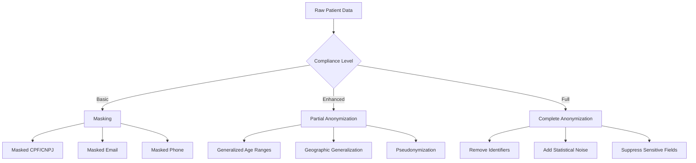
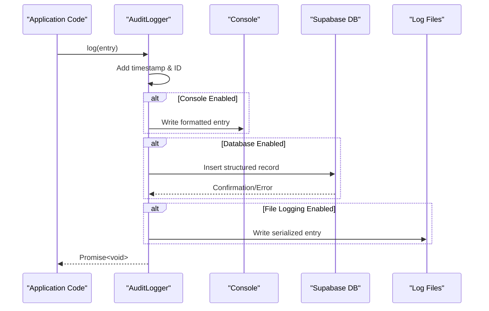
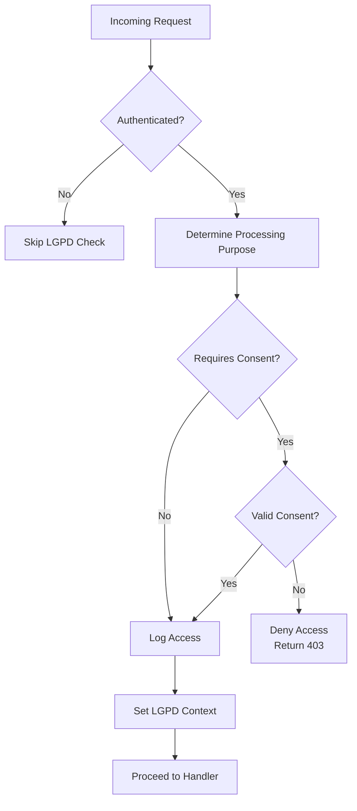
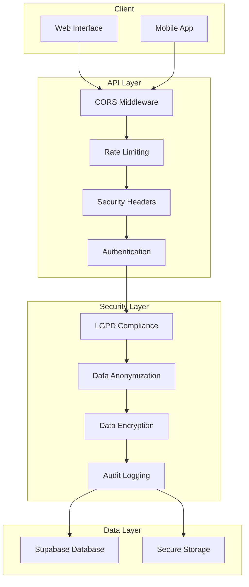

# Security Package

<cite>
**Referenced Files in This Document**
- [anonymization.ts](file://packages/security/src/anonymization.ts)
- [encryption.ts](file://packages/security/src/encryption.ts)
- [audit/logger.ts](file://packages/security/src/audit/logger.ts)
- [lgpd-middleware.ts](file://apps/api/src/middleware/lgpd-middleware.ts)
- [security-middleware.ts](file://apps/api/src/middleware/security-middleware.ts)
- [patient.ts](file://packages/shared/src/types/patient.ts)
</cite>

## Table of Contents
1. [Introduction](#introduction)
2. [Core Security Components](#core-security-components)
3. [Data Anonymization Framework](#data-anonymization-framework)
4. [Encryption and Key Management](#encryption-and-key-management)
5. [Audit Logging System](#audit-logging-system)
6. [LGPD Compliance Middleware](#lgpd-compliance-middleware)
7. [Security Integration Architecture](#security-integration-architecture)
8. [Implementation Examples](#implementation-examples)
9. [Common Issues and Best Practices](#common-issues-and-best-practices)
10. [Conclusion](#conclusion)

## Introduction

The security package in the neonpro repository provides a comprehensive healthcare-specific security framework designed to protect sensitive patient data while ensuring compliance with Brazilian regulations, particularly LGPD (Lei Geral de Proteção de Dados). This document details the architecture and implementation of key security features including data anonymization, encryption, audit logging, and regulatory compliance controls.

The security infrastructure is built around three core pillars: data protection through anonymization and encryption, comprehensive audit trails for accountability, and middleware integration that enforces security policies at the application level. These components work together to create a defense-in-depth approach to healthcare data security, addressing both technical requirements and regulatory obligations.

This documentation serves both beginners seeking to understand healthcare data privacy principles and experienced developers looking for detailed technical information about cryptographic implementations, secure configuration patterns, and compliance validation mechanisms.

**Section sources**
- [anonymization.ts](file://packages/security/src/anonymization.ts)
- [encryption.ts](file://packages/security/src/encryption.ts)
- [audit/logger.ts](file://packages/security/src/audit/logger.ts)

## Core Security Components

The security package consists of three primary modules that handle different aspects of healthcare data protection:

1. **Anonymization Module**: Implements LGPD-compliant data masking and anonymization techniques for personal and medical data.
2. **Encryption Module**: Provides AES-256-GCM encryption for sensitive data at rest and in transit, with robust key management.
3. **Audit Logging Module**: Creates comprehensive audit trails for all data access and operations, essential for compliance monitoring.

These components are designed to work independently but can be integrated seamlessly within the application stack. The anonymization module focuses on protecting personally identifiable information (PII) by either masking or completely removing identifying details based on compliance requirements. The encryption module ensures that even if data is accessed without authorization, it remains unreadable without the proper decryption keys. The audit logging system maintains a tamper-resistant record of all security-relevant events, providing transparency and accountability.

Each component follows the principle of least privilege and defense in depth, ensuring that multiple layers of protection exist for sensitive healthcare data. They are implemented as reusable services that can be incorporated into various parts of the application, from API endpoints to background processing jobs.

**Section sources**
- [anonymization.ts](file://packages/security/src/anonymization.ts)
- [encryption.ts](file://packages/security/src/encryption.ts)
- [audit/logger.ts](file://packages/security/src/audit/logger.ts)

## Data Anonymization Framework

The data anonymization framework implements multiple techniques for protecting patient information according to LGPD requirements. It supports different levels of anonymization based on the sensitivity of the data and the intended use case.



The framework provides specific functions for handling common Brazilian identifiers:
- CPF (Cadastro de Pessoas Físicas): Masked using configurable visible characters at start/end
- CNPJ (Cadastro Nacional da Pessoa Jurídica): Similar masking pattern with corporate format preservation
- Phone numbers: Country code and area code partially preserved
- Email addresses: Local part masked while preserving domain structure

For healthcare-specific data, the framework includes specialized anonymization techniques such as age range generalization, geographic spatial generalization, and pseudonymization that allows for data linkage without revealing identities. The system also generates privacy reports that document the anonymization process for compliance verification.

**Diagram sources**
- [anonymization.ts](file://packages/security/src/anonymization.ts)

**Section sources**
- [anonymization.ts](file://packages/security/src/anonymization.ts)
- [patient.ts](file://packages/shared/src/types/patient.ts)

## Encryption and Key Management

The encryption module implements AES-256-GCM authenticated encryption for protecting sensitive healthcare data. This provides both confidentiality and integrity verification, ensuring that encrypted data cannot be tampered with.

```mermaid
classDiagram
class EncryptionManager {
+algorithm : string
+keyLength : number
+ivLength : number
+generateKey() : string
+validateKey(key : string) : boolean
+encryptData(data : string, key : string) : string
+decryptData(encryptedData : string, key : string) : string
+encryptObject(obj : T, key : string, sensitiveFields : string[]) : T
+decryptObject(obj : T, key : string, sensitiveFields : string[]) : T
+hashData(data : string) : string
+compareHash(plaintext : string, hash : string) : boolean
}
class KeyManager {
-keys : Map<string, string>
-keyMetadata : Map<string, { createdAt : Date; expiresAt? : Date }>
+storeKey(keyId : string, key : string, expiresAt? : Date) : void
+getKey(keyId : string) : string | null
+removeKey(keyId : string) : void
+listKeys() : string[]
+rotateKey(keyId : string, ttl : number) : string
+cleanup() : void
}
EncryptionManager --> KeyManager : "uses"
```

The system uses a singleton KeyManager instance to handle secure key storage and rotation. Key management features include:
- Automatic key expiration and cleanup
- Key rotation with overlapping validity periods
- Secure storage in memory with no persistence
- Validation of key integrity before use

The encryption process combines the initialization vector (IV), encrypted data, and authentication tag into a single base64-encoded string for easy storage and transmission. For object-level encryption, specific fields can be targeted while leaving others in plaintext, allowing for efficient querying of non-sensitive attributes.

**Diagram sources**
- [encryption.ts](file://packages/security/src/encryption.ts)

**Section sources**
- [encryption.ts](file://packages/security/src/encryption.ts)

## Audit Logging System

The audit logging system captures comprehensive records of all security-relevant events, providing an essential tool for compliance monitoring and incident investigation.



The AuditLogger class supports multiple output destinations:
- Console logging for development and debugging
- Database storage via Supabase for permanent, queryable records
- File logging (currently placeholder) for backup and archival

Each audit entry includes metadata such as user ID, action type, resource affected, IP address, user agent, and timestamps. Healthcare-specific logging includes LGPD compliance indicators and data classification levels. The system automatically handles serialization of complex metadata objects while protecting against injection attacks.

For AI/ML operations, specialized logging captures model usage, token counts, processing times, and confidence scores, enabling cost tracking and performance analysis while maintaining compliance.

**Diagram sources**
- [audit/logger.ts](file://packages/security/src/audit/logger.ts)

**Section sources**
- [audit/logger.ts](file://packages/security/src/audit/logger.ts)

## LGPD Compliance Middleware

The LGPD compliance middleware enforces data protection rules at the request level, ensuring that all operations comply with Brazilian privacy regulations.



The middleware performs several critical functions:
- Determines the processing purpose based on the requested endpoint
- Checks for valid user consent when required
- Logs all data access for audit purposes
- Sets context variables for downstream handlers
- Handles consent management requests

Different processing purposes trigger varying levels of scrutiny:
- Medical care and appointment scheduling require explicit consent
- Legal obligations and vital interests may proceed without consent
- Billing operations follow specific financial regulation requirements

The system also includes specialized middleware for handling LGPD Article 18 rights, including data portability requests (allowing users to export their data) and data erasure requests (anonymizing or deleting personal information upon request).

**Diagram sources**
- [lgpd-middleware.ts](file://apps/api/src/middleware/lgpd-middleware.ts)

**Section sources**
- [lgpd-middleware.ts](file://apps/api/src/middleware/lgpd-middleware.ts)

## Security Integration Architecture

The security components are integrated throughout the application stack, forming a cohesive protection layer for healthcare data.



The integration follows a layered approach where each security component builds upon the previous ones. Incoming requests first pass through general security middleware (CORS, rate limiting, security headers) before reaching the healthcare-specific security layer. Within this layer, LGPD compliance checks determine whether further processing is permitted, followed by appropriate data protection measures.

For outgoing responses, the reverse process occurs: data is retrieved from storage, decrypted if necessary, potentially anonymized based on the requesting user's permissions, and logged for audit purposes before being sent to the client. This bidirectional protection ensures that sensitive data is safeguarded throughout its entire lifecycle.

**Diagram sources**
- [security-middleware.ts](file://apps/api/src/middleware/security-middleware.ts)
- [lgpd-middleware.ts](file://apps/api/src/middleware/lgpd-middleware.ts)

**Section sources**
- [security-middleware.ts](file://apps/api/src/middleware/security-middleware.ts)
- [lgpd-middleware.ts](file://apps/api/src/middleware/lgpd-middleware.ts)

## Implementation Examples

### Secure Data Handling Example

To implement secure handling of patient data, combine encryption and anonymization based on the use case:

```typescript
// [encryptObject](file://packages/security/src/encryption.ts#L200-L220)
// [maskPatientData](file://packages/security/src/anonymization.ts#L300-L330)
```

### Redacting PII in Logs

When logging sensitive information, use the anonymization utilities to redact PII:

```typescript
// [anonymizePersonalData](file://packages/security/src/anonymization.ts#L340-L380)
// [isDataAnonymized](file://packages/security/src/anonymization.ts#L390-L400)
```

### Conducting Security Audits

Use the audit logging system to track and verify compliance:

```typescript
// [logHealthcareAccess](file://packages/security/src/audit/logger.ts#L150-L170)
// [logAIOperation](file://packages/security/src/audit/logger.ts#L180-L220)
```

These examples demonstrate how to properly integrate security controls into application code, ensuring that sensitive healthcare data is protected according to regulatory requirements while maintaining functionality.

**Section sources**
- [anonymization.ts](file://packages/security/src/anonymization.ts)
- [encryption.ts](file://packages/security/src/encryption.ts)
- [audit/logger.ts](file://packages/security/src/audit/logger.ts)

## Common Issues and Best Practices

### Key Management Challenges

One common issue is improper key management, which can lead to data loss or unauthorized access. Best practices include:
- Never hardcode encryption keys in source code
- Use environment variables or secure secret management services
- Implement regular key rotation with overlapping validity periods
- Maintain backups of encryption keys in secure locations

### Regulatory Compliance Gaps

Organizations often struggle with maintaining continuous compliance. Recommended practices:
- Automate compliance checks through middleware enforcement
- Regularly audit data processing activities against LGPD requirements
- Maintain comprehensive documentation of data flows and processing purposes
- Implement automated reporting for compliance verification

### Performance Considerations

Cryptographic operations can impact application performance. Optimization strategies:
- Cache decrypted data when safe to do so
- Use selective field encryption rather than encrypting entire records
- Implement asynchronous logging to avoid blocking request processing
- Monitor and optimize the performance of security-critical paths

### Incident Response Preparedness

Ensure readiness for security incidents by:
- Maintaining immutable audit logs that cannot be altered
- Implementing real-time monitoring for suspicious activities
- Establishing clear procedures for data breach notification
- Conducting regular security drills and penetration testing

Following these best practices helps maintain a strong security posture while meeting the stringent requirements of healthcare data protection regulations.

**Section sources**
- [encryption.ts](file://packages/security/src/encryption.ts)
- [lgpd-middleware.ts](file://apps/api/src/middleware/lgpd-middleware.ts)
- [audit/logger.ts](file://packages/security/src/audit/logger.ts)

## Conclusion

The security package in the neonpro repository provides a robust framework for implementing healthcare-specific security controls that meet LGPD compliance requirements. By combining data anonymization, encryption, and comprehensive audit logging with middleware integration, the system creates multiple layers of protection for sensitive patient information.

The modular design allows developers to implement appropriate security measures based on specific use cases, from basic data masking to complete anonymization for research purposes. The integration with application middleware ensures that security policies are enforced consistently across all endpoints.

For organizations handling Brazilian healthcare data, this security framework provides not only technical protection but also the audit trails and compliance documentation required by regulators. By following the implementation examples and best practices outlined in this document, development teams can build secure applications that protect patient privacy while enabling innovative healthcare solutions.

Ongoing maintenance of the security posture requires regular review of encryption keys, audit log analysis, and updates to compliance policies as regulations evolve. The foundation provided by this security package enables organizations to adapt to changing requirements while maintaining trust in their healthcare data systems.