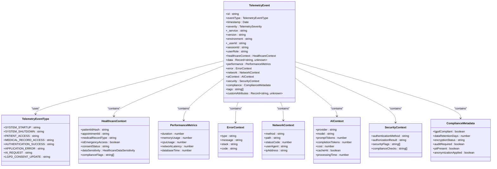

# Shared Package

<cite>
**Referenced Files in This Document**   
- [index.ts](file://packages/shared/src/index.ts)
- [useRealtimeQuery.ts](file://packages/shared/src/hooks/useRealtimeQuery.ts)
- [realtime-manager.ts](file://packages/shared/src/realtime/realtime-manager.ts)
- [healthcare-logger.ts](file://packages/shared/src/logging/healthcare-logger.ts)
- [telemetry-event.ts](file://packages/shared/src/models/telemetry-event.ts)
- [brazilian.ts](file://packages/shared/src/validators/brazilian.ts)
- [lgpd-consent.ts](file://packages/shared/src/types/lgpd-consent.ts)
- [protected-route.tsx](file://packages/shared/src/auth/protected-route.tsx)
</cite>

## Table of Contents
1. [Introduction](#introduction)
2. [Core Architecture and Organization](#core-architecture-and-organization)
3. [Key Modules Overview](#key-modules-overview)
4. [UI Components and React Hooks](#ui-components-and-react-hooks)
5. [Logging and Telemetry Utilities](#logging-and-telemetry-utilities)
6. [Type Definitions and Validation](#type-definitions-and-validation)
7. [Practical Usage Examples](#practical-usage-examples)
8. [Common Issues and Best Practices](#common-issues-and-best-practices)

## Introduction

The shared package serves as the central utility library within the neonpro monorepo, providing reusable components, hooks, services, and type definitions across all applications. As a foundational element of the monorepo architecture, it enables consistent implementation of business logic, enhances code maintainability, and reduces duplication across frontend and backend services.

This documentation provides comprehensive guidance for both beginners and experienced developers on leveraging the shared package effectively. It covers conceptual benefits of code reuse in monorepos, technical details about component composition patterns, hook usage guidelines, and type safety practices. The content includes practical examples demonstrating how to integrate shared components into frontend applications and utilize utility functions in backend services.

By standardizing critical functionality such as authentication, real-time data synchronization, logging, and Brazilian healthcare compliance validation, the shared package ensures uniform behavior and regulatory adherence throughout the application ecosystem.

**Section sources**
- [index.ts](file://packages/shared/src/index.ts)

## Core Architecture and Organization

The shared package follows a modular structure designed for maximum reusability and maintainability. Its organization reflects domain-driven design principles, with distinct directories for different types of utilities:

- **api-client**: Centralized API client configuration and request handling
- **auth**: Authentication providers and route protection components
- **components**: Reusable UI components specific to healthcare applications
- **errors**: Error mapping and healthcare-specific error handling
- **hooks**: Custom React hooks for state management and side effects
- **i18n**: Internationalization resources and translation utilities
- **logging**: Comprehensive logging infrastructure with healthcare compliance
- **models**: Domain models and event schemas for telemetry and analytics
- **realtime**: Real-time data synchronization managers using Supabase
- **services**: Business logic services and middleware implementations
- **telemetry**: Observability and monitoring configurations
- **types**: Type definitions for patients, appointments, and healthcare data
- **validators**: Data validation utilities for Brazilian identifiers
- **webrtc**: WebRTC infrastructure stubs for telemedicine features

The package exports its functionality through a centralized index.ts file, which carefully manages re-exports to prevent naming conflicts while ensuring essential utilities are readily accessible. This architectural approach enables seamless integration across diverse applications within the monorepo while maintaining clear boundaries between concerns.


**Diagram sources**
- [index.ts](file://packages/shared/src/index.ts)

## Key Modules Overview

The shared package contains several key modules that provide essential functionality across the neonpro ecosystem. These modules are designed to address common requirements in healthcare applications while ensuring compliance with Brazilian regulations such as LGPD (Lei Geral de Proteção de Dados).

The logging module implements a comprehensive healthcare-compliant logging system with specialized transports for different log types, including audit logs, error logs, and combined logs. This ensures proper separation of sensitive information and facilitates compliance auditing.

The telemetry module defines standardized event schemas for tracking system performance, user interactions, and security events. These schemas include built-in support for anonymization and data sensitivity classification, helping maintain patient privacy while enabling valuable analytics.

Validation utilities focus specifically on Brazilian healthcare requirements, providing robust validation for CPF (individual taxpayer registry), CNPJ (corporate taxpayer registry), CRM (medical license), and other national identifiers. These validators incorporate checks for known invalid patterns and implement the official verification digit algorithms.

Type definitions establish consistent interfaces for patient data, medical records, appointments, and consent management. By centralizing these definitions, the shared package ensures type safety across service boundaries and prevents drift between frontend and backend implementations.

Authentication components provide reusable route protection mechanisms that integrate with the monorepo's authentication system, supporting role-based access control and permission checking.

**Section sources**
- [index.ts](file://packages/shared/src/index.ts)

## UI Components and React Hooks

### React Hooks Implementation

The shared package provides custom React hooks that encapsulate complex logic and enable efficient state management across applications. The most significant hook is `useRealtimeQuery`, which combines TanStack Query with Supabase real-time capabilities to create a powerful data synchronization solution.


**Diagram sources**
- [useRealtimeQuery.ts](file://packages/shared/src/hooks/useRealtimeQuery.ts)
- [realtime-manager.ts](file://packages/shared/src/realtime/realtime-manager.ts)

The `useRealtimeQuery` hook integrates seamlessly with TanStack Query's caching mechanism while adding real-time updates from Supabase. It implements healthcare-appropriate rate limiting (100ms default) to prevent excessive updates and includes automatic retry logic with exponential backoff for connection resilience.

Key features include:
- Optimistic updates for immediate UI feedback
- Configurable refetch behavior (disabled on window focus by default)
- Built-in error handling with healthcare-specific logging
- Connection status and active channel monitoring
- Automatic cleanup on component unmount

### Authentication Components

The authentication module provides a `ProtectedRoute` component that handles route protection based on authentication status, user roles, and permissions. This component integrates with the application's authentication context and implements logging for security monitoring.


**Diagram sources**
- [protected-route.tsx](file://packages/shared/src/auth/protected-route.tsx)

The `ProtectedRoute` component supports optional role requirements and permission checks, with a placeholder implementation for granular permission validation. It logs authentication-related events for audit purposes and provides customizable fallback UIs for loading and unauthorized states.

**Section sources**
- [useRealtimeQuery.ts](file://packages/shared/src/hooks/useRealtimeQuery.ts)
- [realtime-manager.ts](file://packages/shared/src/realtime/realtime-manager.ts)
- [protected-route.tsx](file://packages/shared/src/auth/protected-route.tsx)

## Logging and Telemetry Utilities

### Healthcare-Compliant Logging System

The shared package implements a sophisticated logging infrastructure designed specifically for healthcare applications. The `createHealthcareLogger` function configures Winston loggers with multiple transports tailored to different log categories and environments.

In development mode, console output includes debug-level messages with formatted output for easy debugging. In production, console output is restricted to error-level messages only, while file transports handle different log types:

- **Error logs**: Errors only, rotated at 5MB with 5 files retained
- **Combined logs**: Info-level and above, rotated at 5MB with 5 files retained  
- **Audit logs**: Audit-level events only, rotated at 10MB with 10 files retained

The logging system uses custom levels that include "audit" for compliance-critical events, ensuring proper categorization of sensitive operations. All loggers include service metadata and implement non-blocking behavior to prevent application crashes during logging failures.

### Telemetry Event Model

The telemetry system defines a comprehensive event model through the `TelemetryEvent` interface and `TelemetryEventType` enum. This standardized schema ensures consistency across all observability data while incorporating healthcare-specific requirements.



**Diagram sources**
- [telemetry-event.ts](file://packages/shared/src/models/telemetry-event.ts)

The event model incorporates several healthcare-specific features:
- Patient ID hashing to protect personally identifiable information
- Data sensitivity classification for appropriate handling
- LGPD compliance flags and retention tracking
- Anonymized network context (truncated user agent, hashed IP)
- AI cost tracking for budget monitoring
- Emergency access indicators for audit trails

Event types are categorized into system, performance, healthcare-specific, security, error, user, AI/ML, and compliance domains, enabling effective filtering and analysis.

**Section sources**
- [healthcare-logger.ts](file://packages/shared/src/logging/healthcare-logger.ts)
- [telemetry-event.ts](file://packages/shared/src/models/telemetry-event.ts)

## Type Definitions and Validation

### Brazilian Healthcare Validation

The shared package provides comprehensive validation utilities for Brazilian healthcare identifiers through the `brazilian.ts` validator module. These utilities ensure data integrity and regulatory compliance when handling patient and provider information.

The validation suite includes functions for:
- CPF (Cadastro de Pessoas Físicas): Individual taxpayer registry
- CNPJ (Cadastro Nacional da Pessoa Jurídica): Corporate taxpayer registry  
- CRM (Conselho Regional de Medicina): Medical license numbers
- ANVISA codes: National Health Surveillance Agency identifiers
- SUS cards: Unified Health System identification
- Brazilian phone numbers and CEP (postal codes)

Each validator implements the official algorithms for verification digits and includes checks for known invalid patterns (e.g., all identical digits). The `cleanDocument` utility normalizes input by removing formatting characters before validation.


**Diagram sources**
- [brazilian.ts](file://packages/shared/src/validators/brazilian.ts)

### LGPD Consent Management

The LGPD consent model defines a comprehensive structure for managing patient consent in compliance with Brazil's General Data Protection Law. The `LGPDConsent` type includes essential fields for auditability and legal defensibility:

- Patient identifier (hashed for privacy)
- Consent version and date
- IP address and user agent (for proof of consent)
- Legal basis for processing
- Specific processing purposes
- Data categories being processed
- Consent history and revocation tracking

The package provides utility functions like `validateConsentCompleteness` to ensure all required fields are present before storing consent records. This function performs mandatory field validation to prevent incomplete consent captures.

Additional utilities support consent lifecycle management:
- `withdrawConsent`: Process consent revocation requests
- `renewConsent`: Handle consent renewal workflows
- `generateConsentSummary`: Create human-readable consent summaries
- `isConsentExpired`: Check consent validity period
- `auditLGPDCompliance`: Verify overall compliance status

These tools help ensure that the application maintains lawful grounds for processing personal health data while providing patients with transparency and control over their information.

**Section sources**
- [brazilian.ts](file://packages/shared/src/validators/brazilian.ts)
- [lgpd-consent.ts](file://packages/shared/src/types/lgpd-consent.ts)

## Practical Usage Examples

### Frontend Application Integration

To use shared components in a frontend application, import them directly from the shared package:

```typescript
import { useRealtimeQuery } from '@neonpro/shared';
import { ProtectedRoute } from '@neonpro/shared/auth';
import { validateCPF } from '@neonpro/shared/validators';

// Example: Real-time patient list
function PatientList() {
  const { data, isLoading } = useRealtimeQuery(
    ['patients'],
    fetchPatients,
    {
      tableName: 'patients',
      realtimeOptions: {
        onInsert: (patient) => console.log('New patient added:', patient),
        onUpdate: (patient) => console.log('Patient updated:', patient),
      },
    }
  );

  if (isLoading) return <div>Loading...</div>;
  return <ul>{data?.map(patient => <li key={patient.id}>{patient.name}</li>)}</ul>;
}

// Example: Route protection
function AdminDashboard() {
  return (
    <ProtectedRoute requiredRole="admin">
      <h1>Admin Dashboard</h1>
      {/* Protected content */}
    </ProtectedRoute>
  );
}

// Example: Form validation
function handlePatientSubmit(formData: any) {
  if (!validateCPF(formData.cpf)) {
    throw new Error('Invalid CPF');
  }
  // Process valid data
}
```

### Backend Service Utilization

Backend services can leverage shared utilities for consistent logging and data validation:

```typescript
import { healthcareLogger, logHealthcareError } from '@neonpro/shared/logging';
import { validateCNPJ } from '@neonpro/shared/validators';

const logger = healthcareLogger.createLogger('billing-service');

// Example: Service with shared validation
async function processInvoice(invoiceData: any) {
  try {
    if (!validateCNPJ(invoiceData.clinicCNPJ)) {
      logger.warn('Invalid CNPJ in invoice', { 
        clinicId: invoiceData.clinicId,
        cnpj: invoiceData.clinicCNPJ 
      });
      throw new Error('Invalid clinic identifier');
    }

    logger.info('Processing invoice', { 
      invoiceId: invoiceData.id,
      amount: invoiceData.amount 
    });

    // Process invoice...
  } catch (error) {
    logHealthcareError('billing-service', error, {
      context: 'invoice-processing',
      invoiceId: invoiceData.id
    });
    throw error;
  }
}
```

These examples demonstrate how the shared package enables consistent implementation patterns across the monorepo, reducing boilerplate code and ensuring uniform behavior.

**Section sources**
- [index.ts](file://packages/shared/src/index.ts)

## Common Issues and Best Practices

### Versioning Conflicts

When updating the shared package, follow semantic versioning principles:
- Patch versions (0.0.x) for bug fixes and minor improvements
- Minor versions (0.x.0) for backward-compatible feature additions  
- Major versions (x.0.0) for breaking changes

Coordinate updates across dependent applications using the monorepo's dependency management tools. Test shared package changes thoroughly in staging environments before deployment.

### Circular Dependencies

Avoid circular dependencies by:
- Organizing modules by domain rather than technical layer
- Using dependency inversion principles
- Creating intermediate modules for shared dependencies
- Regularly analyzing dependency graphs

The monorepo build system should detect and prevent circular dependencies during compilation.

### Contribution Guidelines

When contributing to the shared package:
1. Ensure new utilities have broad applicability across multiple applications
2. Follow existing coding standards and patterns
3. Include comprehensive TypeScript types
4. Add unit tests with high coverage (minimum 80%)
5. Document public APIs and usage examples
6. Consider performance implications of new features
7. Ensure compliance with healthcare data regulations

Prefer composition over inheritance in component design, and make hooks configurable through options parameters rather than creating multiple similar variants.

Regularly review the shared package for deprecated or underutilized functionality that could be removed to reduce bundle size and maintenance overhead.

**Section sources**
- [index.ts](file://packages/shared/src/index.ts)