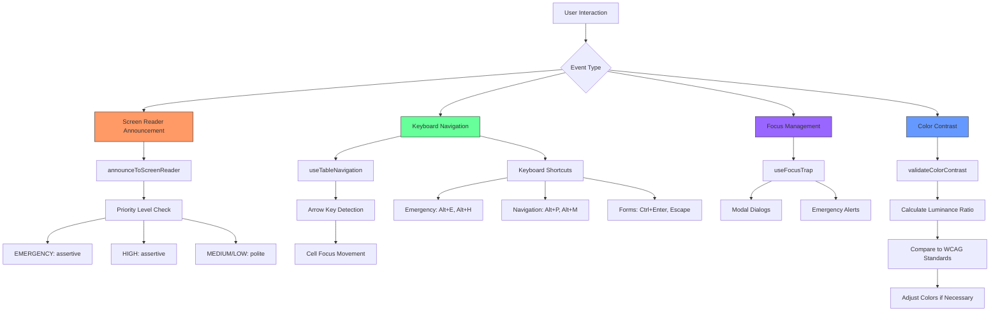
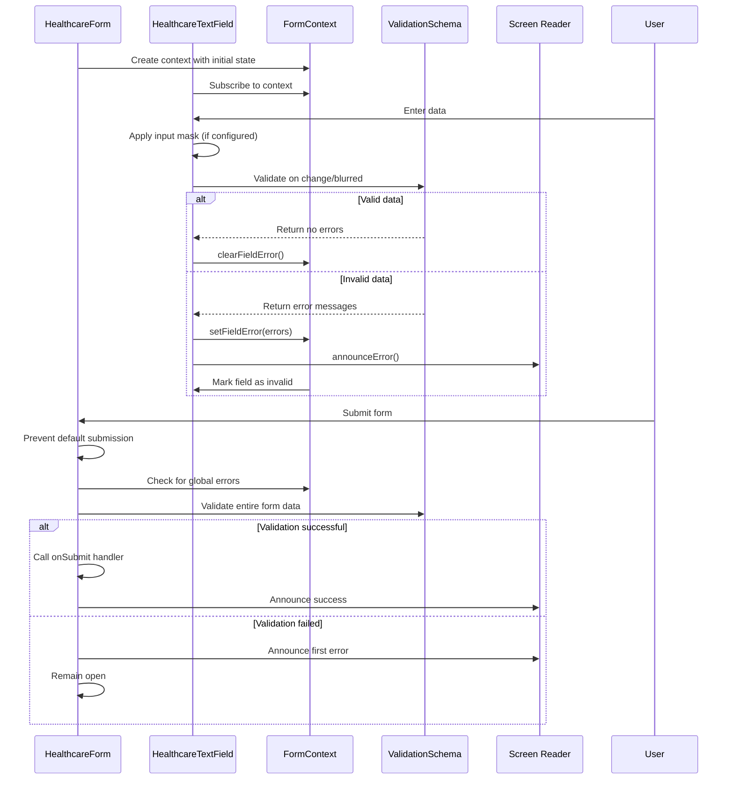
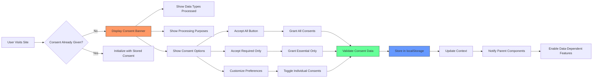

# UI Package

<cite>
**Referenced Files in This Document**
- [README.md](file://packages/ui/README.md)
- [lgpd-consent-banner.tsx](file://packages/ui/src/components/healthcare/lgpd-consent-banner.tsx)
- [healthcare-theme-provider.tsx](file://packages/ui/src/components/healthcare/healthcare-theme-provider.tsx)
- [healthcare-form.tsx](file://packages/ui/src/components/forms/healthcare-form.tsx)
- [healthcare-select.tsx](file://packages/ui/src/components/forms/healthcare-select.tsx)
- [healthcare-text-field.tsx](file://packages/ui/src/components/forms/healthcare-text-field.tsx)
- [healthcare-validation.ts](file://packages/ui/src/utils/healthcare-validation.ts)
- [accessibility.ts](file://packages/ui/src/utils/accessibility.ts)
- [index.ts](file://packages/ui/src/index.ts)
- [themeCss](file://packages/ui/src/theme/index.ts)
</cite>

## Table of Contents

1. [Introduction](#introduction)
2. [Component Library Architecture](#component-library-architecture)
3. [Theming System](#theming-system)
4. [Accessibility Features](#accessibility-features)
5. [Form Components](#form-components)
6. [Consent Management](#consent-management)
7. [Practical Examples](#practical-examples)
8. [Common Issues and Best Practices](#common-issues-and-best-practices)

## Introduction

The @neonpro/ui package serves as a comprehensive design system for healthcare applications, providing reusable, accessible, and compliant UI components that adhere to LGPD (Brazilian General Data Protection Law) requirements. Built on React 19 with Tailwind CSS, this component library offers a cohesive set of tools specifically designed for medical and healthcare applications where data privacy, accessibility, and regulatory compliance are paramount.

This documentation provides both conceptual overviews for beginners and technical details for experienced developers. The design system emphasizes patient safety, data sensitivity classification, and emergency mode functionality while maintaining WCAG 2.1 AA compliance. Components are structured to handle sensitive medical data appropriately, with visual indicators for data sensitivity levels and built-in validation for healthcare-specific data types like CPF (Brazilian individual taxpayer registry), CRM (medical license), and medical records.

The package follows a monorepo architecture with clear separation between generic UI components and healthcare-specific implementations. All components are designed to be app-agnostic while providing specialized variants for medical use cases. The library includes form controls with medical taxonomy support, consent management banners, theme providers with emergency mode capabilities, and accessibility utilities tailored for healthcare interfaces.

**Section sources**

- [README.md](file://packages/ui/README.md#L1-L23)

## Component Library Architecture

The UI package follows a modular architecture organized into distinct directories based on functionality and domain specificity. The component hierarchy separates generic UI primitives from healthcare-specific implementations, allowing for maximum reusability while accommodating medical application requirements.

At the core of the architecture is the `components` directory, which contains three main subdirectories: `ui`, `forms`, and `healthcare`. The `ui` directory houses generic, reusable components such as buttons, cards, dialogs, and tables that follow standard design patterns. These components serve as the foundation for the entire design system and can be used across various application types.

The `forms` directory contains enhanced form components specifically designed for healthcare data entry, including `healthcare-form.tsx`, `healthcare-select.tsx`, and `healthcare-text-field.tsx`. These components extend basic form elements with medical data validation, LGPD compliance features, and accessibility enhancements. They integrate with the healthcare form context to provide unified error handling and submission logic.

The `healthcare` directory contains specialized components for medical applications, most notably the `lgpd-consent-banner.tsx` and `healthcare-theme-provider.tsx`. These components address regulatory requirements and patient safety considerations unique to healthcare software. The consent banner implements granular consent options with audit trail capabilities, while the theme provider manages emergency modes and data sensitivity indicators.

Utility functions are organized in the `utils` directory, with `healthcare-validation.ts` containing Zod schemas for medical data types and `accessibility.ts` providing screen reader announcements and focus management. The `hooks` directory contains custom React hooks for state management and side effects specific to healthcare interfaces.

All components are exported through the root `index.ts` file, which serves as the single entry point for the package. This approach ensures consistent imports and prevents deep path resolution issues in consuming applications.

```mermaid
graph TD
A[@neonpro/ui] --> B[components]
A --> C[utils]
A --> D[hooks]
A --> E[theme]
A --> F[demo]
B --> G[ui]
B --> H[forms]
B --> I[healthcare]
B --> J[magicui]
B --> K[aceternity]
G --> L[Generic Components<br>Button, Card, Dialog]
H --> M[Healthcare Forms<br>Form, Select, TextField]
I --> N[Specialized Components<br>Consent Banner, Theme Provider]
C --> O[healthcare-validation]
C --> P[accessibility]
style A fill:#f9f,stroke:#333
style G fill:#bbf,stroke:#333
style H fill:#f96,stroke:#333
style I fill:#6f9,stroke:#333
```

**Diagram sources **

- [README.md](file://packages/ui/README.md#L1-L23)
- [index.ts](file://packages/ui/src/index.ts#L1-L155)

**Section sources**

- [README.md](file://packages/ui/README.md#L1-L23)
- [index.ts](file://packages/ui/src/index.ts#L1-L155)

## Theming System

The theming system in the @neonpro/ui package provides comprehensive control over visual presentation with special considerations for healthcare applications. At its core is the `HealthcareThemeProvider` component, which manages theme configuration through React context and localStorage persistence.

The theme configuration interface `HealthcareThemeConfig` defines multiple dimensions of customization, including visual settings (`colorMode`, `fontSize`, `animations`), healthcare-specific modes (`emergencyMode`, `patientDataMode`), and accessibility preferences (`highContrast`, `reduceMotion`). The default configuration prioritizes patient safety with conservative settings like reduced animations and enabled audit mode.

The theme provider applies styles through CSS variables and class toggles on the document element. When emergency mode is activated, the provider adds an `emergency-mode` class and sets high-contrast colors for critical visibility. Similarly, patient data mode triggers visual indicators and enables audit logging. The system respects user preferences by listening to `prefers-reduced-motion` media queries and synchronizing theme changes across application sessions via localStorage.

For aesthetic clinics, the package includes a specialized theme defined in `themeCss` using OKLCH color space for precise color representation. This theme features a gold primary color (#AC9469, Pantone 4007C) with complementary beige and green accents, creating a warm, professional appearance suitable for medical aesthetics. The theme supports both light and dark variants with carefully calibrated contrast ratios meeting WCAG 2.1 AA standards.

The theming system also incorporates data sensitivity indicators through border colors and background treatments. Confidential data receives a warning-colored left border, while restricted medical information uses a destructive (red) indicator. These visual cues help medical staff quickly identify the sensitivity level of displayed information.

```mermaid
classDiagram
class HealthcareThemeConfig {
+colorMode : "light"|"dark"|"high-contrast"
+fontSize : "small"|"medium"|"large"|"extra-large"
+animations : "full"|"reduced"|"none"
+emergencyMode : boolean
+patientDataMode : boolean
+compactMode : boolean
+screenReaderOptimized : boolean
+keyboardNavigationOnly : boolean
+highContrast : boolean
+reduceMotion : boolean
+dataSensitivityLevel : DataSensitivity
+auditMode : boolean
+consentRequired : boolean
}
class HealthcareThemeProviderProps {
+children : ReactNode
+initialTheme? : Partial~HealthcareThemeConfig~
+onThemeChange? : (theme : HealthcareThemeConfig) => void
+persistTheme? : boolean
}
class HealthcareThemeContextValue {
+theme : HealthcareThemeConfig
+updateTheme : (updates : Partial~HealthcareThemeConfig~) => void
+toggleEmergencyMode : () => void
+togglePatientDataMode : () => void
+setDataSensitivity : (level : DataSensitivity) => void
+accessibility : HealthcareA11yContext
}
HealthcareThemeProviderProps --> HealthcareThemeProvider : "props"
HealthcareThemeProvider --> HealthcareThemeContextValue : "provides"
HealthcareThemeContextValue --> HealthcareThemeConfig : "contains"
HealthcareThemeProvider --> "documentElement" : "applies classes/styles"
```

**Diagram sources **

- [healthcare-theme-provider.tsx](file://packages/ui/src/components/healthcare/healthcare-theme-provider.tsx#L1-L442)
- [index.ts](file://packages/ui/src/index.ts#L1-L155)

**Section sources**

- [healthcare-theme-provider.tsx](file://packages/ui/src/components/healthcare/healthcare-theme-provider.tsx#L1-L442)
- [index.ts](file://packages/ui/src/index.ts#L1-L155)
- [theme/index.ts](file://packages/ui/src/theme/index.ts#L1-L195)

## Accessibility Features

The @neonpro/ui package implements comprehensive accessibility features specifically designed for healthcare applications, ensuring compliance with WCAG 2.1 AA standards and addressing the unique needs of medical interfaces. The accessibility system is built around the `accessibility.ts` utility module, which provides programmatic access to assistive technologies and keyboard navigation support.

Screen reader announcements are managed through the `announceToScreenReader` function, which categorizes messages by healthcare priority levels: EMERGENCY, HIGH, MEDIUM, and LOW. This prioritization ensures critical medical alerts receive assertive politeness levels, while routine updates use polite announcements. Emergency mode activation triggers automatic announcements to inform users of the interface change.

Keyboard navigation is enhanced through several custom hooks. The `useFocusTrap` hook manages focus containment within modal dialogs and emergency alerts, preventing keyboard users from accidentally navigating outside critical interfaces. For data tables, the `useTableNavigation` hook implements arrow key navigation similar to spreadsheet applications, allowing efficient movement between cells in medical records and patient data tables.

The package includes specialized keyboard shortcuts for healthcare workflows, categorized into emergency, navigation, and form operations. Emergency shortcuts like Alt+H for calling assistance and Ctrl+Shift+S for quick saves are designed for rapid access during critical situations. Navigation shortcuts enable quick jumps between patient data sections, while form shortcuts streamline data entry processes.

Color contrast is programmatically validated using the `validateColorContrast` function, which calculates luminance ratios according to WCAG guidelines. The system automatically adjusts text and background colors to maintain minimum contrast ratios of 4.5:1 for normal text and 3:1 for large text. High contrast mode increases these ratios significantly for users with low vision.

Error handling is made accessible through properly associated error messages. Form fields with validation errors have their `aria-describedby` attribute linked to error message elements, ensuring screen readers announce errors when fields receive focus. Required fields are indicated with `aria-required` attributes, and all interactive elements have appropriate labels either through `aria-label`, `aria-labelledby`, or associated `<label>` elements.



**Diagram sources **

- [accessibility.ts](file://packages/ui/src/utils/accessibility.ts#L1-L499)

**Section sources**

- [accessibility.ts](file://packages/ui/src/utils/accessibility.ts#L1-L499)
- [healthcare-theme-provider.tsx](file://packages/ui/src/components/healthcare/healthcare-theme-provider.tsx#L1-L442)
- [healthcare-form.tsx](file://packages/ui/src/components/forms/healthcare-form.tsx#L1-L482)

## Form Components

The form component system in @neonpro/ui provides a robust foundation for healthcare data entry with built-in validation, accessibility features, and LGPD compliance. The architecture centers around the `HealthcareForm` component, which establishes a context for form state management and provides unified error handling across nested form fields.

The `HealthcareForm` component wraps standard HTML forms with additional healthcare-specific functionality. It manages submission states, tracks consent requirements, and handles emergency mode optimizations. The form context exposes methods for setting and clearing field errors, which child components can use to report validation issues. This centralized error management ensures consistent presentation of validation feedback across the application.

Form fields are implemented as specialized components that extend basic HTML inputs with medical data validation. The `HealthcareTextField` supports various healthcare field types including CPF, CRM, phone numbers, and medical record numbers. Each type has associated Zod validation schemas that enforce format requirements and perform algorithmic validation (e.g., CPF checksum verification). Input masking is supported to guide users in entering correctly formatted data.

The `HealthcareSelect` component enhances dropdown menus with medical taxonomy support, including predefined options for medical specialties, blood types, and urgency levels. It supports grouping of options and searching within long option lists, improving usability for complex medical classifications. Emergency options are visually distinguished with warning styling to draw attention to critical choices.

Both form components implement real-time validation with configurable timing. Validation can occur on change, on blur, or both, depending on the sensitivity of the field. Error messages are announced to screen readers with appropriate priority levels, and fields with errors receive focus when needed. The components also include data sensitivity indicators that display lock icons next to fields handling protected health information.



**Diagram sources **

- [healthcare-form.tsx](file://packages/ui/src/components/forms/healthcare-form.tsx#L1-L482)
- [healthcare-text-field.tsx](file://packages/ui/src/components/forms/healthcare-text-field.tsx#L1-L506)
- [healthcare-validation.ts](file://packages/ui/src/utils/healthcare-validation.ts#L1-L403)

**Section sources**

- [healthcare-form.tsx](file://packages/ui/src/components/forms/healthcare-form.tsx#L1-L482)
- [healthcare-select.tsx](file://packages/ui/src/components/forms/healthcare-select.tsx#L1-L738)
- [healthcare-text-field.tsx](file://packages/ui/src/components/forms/healthcare-text-field.tsx#L1-L506)
- [healthcare-validation.ts](file://packages/ui/src/utils/healthcare-validation.ts#L1-L403)

## Consent Management

The consent management system in @neonpro/ui implements a comprehensive solution for LGPD compliance, providing granular control over data processing permissions with audit trail capabilities. The centerpiece is the `LGPDConsentBanner` component, which displays a customizable banner or modal requesting user consent for data processing activities.

The consent banner supports multiple variants (banner, modal, inline) and positions (top, bottom, center) to accommodate different layout requirements. It presents required and optional consent categories with detailed descriptions, allowing users to make informed decisions about their data. The implementation includes five consent types: ESSENTIAL, FUNCTIONAL, ANALYTICS, MARKETING, and RESEARCH, each with specific purposes and descriptions tailored to healthcare contexts.

Data processing transparency is enhanced through detailed disclosure of data types and processing purposes. The banner explicitly lists the categories of healthcare data being collected (PERSONAL, MEDICAL, SENSITIVE, BIOMETRIC, GENETIC) and the reasons for processing (TREATMENT, PREVENTION, RESEARCH, ADMINISTRATION, LEGAL, EMERGENCY). This transparency helps organizations demonstrate compliance with LGPD's accountability principle.

Consent storage is implemented with both client-side persistence and schema validation. Granted consents are stored in localStorage with timestamps and version information, enabling audit trails and consent revocation tracking. The `lgpdConsentSchema` Zod schema validates the structure of stored consent data, ensuring integrity and consistency. Required consents cannot be declined, with appropriate feedback provided to users attempting to do so.

The package also includes the `useLGPDConsent` hook, which provides programmatic access to consent status and management functions. This hook allows components to check whether specific consents have been granted and to withdraw consents when necessary. The hook reads from the same storage mechanism as the banner, ensuring consistency across the application.



**Diagram sources **

- [lgpd-consent-banner.tsx](file://packages/ui/src/components/healthcare/lgpd-consent-banner.tsx#L1-L666)
- [healthcare-validation.ts](file://packages/ui/src/utils/healthcare-validation.ts#L1-L403)

**Section sources**

- [lgpd-consent-banner.tsx](file://packages/ui/src/components/healthcare/lgpd-consent-banner.tsx#L1-L666)
- [healthcare-validation.ts](file://packages/ui/src/utils/healthcare-validation.ts#L1-L403)

## Practical Examples

### Using Form Components

To implement a patient registration form with proper validation and accessibility:

```jsx
import { HealthcareForm, HealthcareSelect, HealthcareTextField } from '@neonpro/ui'

function PatientRegistrationForm() {
  return (
    <HealthcareForm
      dataSensitivity='confidential'
      patientDataForm={true}
      requireConsent={true}
      onSubmit={handleSubmit}
    >
      <HealthcareTextField
        name='name'
        label='Full Name'
        fieldType='patient-name'
        required={true}
      />

      <HealthcareTextField
        name='cpf'
        label='CPF'
        fieldType='cpf'
        required={true}
        mask='000.000.000-00'
      />

      <HealthcareTextField
        name='phone'
        label='Phone Number'
        fieldType='phone'
        mask='(00) 00000-0000'
      />

      <HealthcareSelect
        name='specialty'
        label='Medical Specialty'
        selectType='medical-specialty'
        options={customSpecialties}
      />

      <button type='submit'>Register Patient</button>
    </HealthcareForm>
  )
}
```

### Implementing Consent Banner

To add LGPD-compliant consent management to your application:

```jsx
import { LGPDConsentBanner, useLGPDConsent } from '@neonpro/ui'
import { useEffect } from 'react'

function App() {
  const { hasConsent } = useLGPDConsent()

  useEffect(() => {
    if (hasConsent) {
      // Initialize analytics and other services
      initializeAnalytics()
    }
  }, [hasConsent])

  return (
    <>
      <MainContent />
      <LGPDConsentBanner
        requiredConsents={[ConsentType.ESSENTIAL]}
        optionalConsents={[
          ConsentType.ANALYTICS,
          ConsentType.MARKETING,
        ]}
        dataTypes={[
          HealthcareDataType.PERSONAL,
          HealthcareDataType.MEDICAL,
        ]}
        processingPurposes={[
          DataProcessingPurpose.TREATMENT,
          DataProcessingPurpose.RESEARCH,
        ]}
        privacyPolicyUrl='/privacy'
        dataProcessingUrl='/data-processing'
      />
    </>
  )
}
```

### Customizing Theme

To configure the healthcare theme with emergency mode support:

```jsx
import { HealthcareThemeProvider } from '@neonpro/ui'

function RootLayout({ children }) {
  return (
    <HealthcareThemeProvider
      initialTheme={{
        colorMode: 'light',
        fontSize: 'medium',
        emergencyMode: false,
      }}
      persistTheme={true}
    >
      {children}
    </HealthcareThemeProvider>
  )
}

// Elsewhere in the application
function EmergencyButton() {
  const { toggleEmergencyMode } = useHealthcareTheme()

  return (
    <button onClick={toggleEmergencyMode}>
      Activate Emergency Mode
    </button>
  )
}
```

**Section sources**

- [healthcare-form.tsx](file://packages/ui/src/components/forms/healthcare-form.tsx#L1-L482)
- [healthcare-text-field.tsx](file://packages/ui/src/components/forms/healthcare-text-field.tsx#L1-L506)
- [healthcare-select.tsx](file://packages/ui/src/components/forms/healthcare-select.tsx#L1-L738)
- [lgpd-consent-banner.tsx](file://packages/ui/src/components/healthcare/lgpd-consent-banner.tsx#L1-L666)
- [healthcare-theme-provider.tsx](file://packages/ui/src/components/healthcare/healthcare-theme-provider.tsx#L1-L442)

## Common Issues and Best Practices

### Styling Conflicts

When integrating @neonpro/ui with existing applications, styling conflicts may occur due to CSS specificity issues. To resolve these:

1. Ensure Tailwind's purge settings include the UI package paths in your `tailwind.config.ts`:

```ts
content: ;
;[
  './src/**/*.{js,ts,jsx,tsx}',
  './node_modules/@neonpro/ui/src/**/*.{js,ts,jsx,tsx}',
]
```

2. Use the `!important` modifier sparingly and prefer composition over override:

```jsx
{/* Good: Compose classes */}
<HealthcareTextField className='max-w-md' />

{/* Avoid: Overriding internal styles */}
<HealthcareTextField className='!border-red-500 !text-lg' />
```

3. Wrap the application with the theme provider at the root level to ensure consistent styling.

### Accessibility Violations

Common accessibility issues and their solutions:

- **Missing labels**: Always provide meaningful labels for form fields. The components will warn in development if labels are missing.
- **Insufficient color contrast**: Use the built-in high contrast mode or validate custom colors with `validateColorContrast`.
- **Keyboard traps**: Ensure all modals and dialogs can be closed with the Escape key and support tab navigation.
- **Screen reader announcements**: Use `announceToScreenReader` for important state changes rather than relying solely on visual feedback.

### Performance Optimization

For optimal performance:

1. Import components directly rather than using namespace imports:

```ts
// Good
import { Button } from '@neonpro/ui'

// Avoid
import * as UI from '@neonpro/ui'
```

2. Use React.memo for components that render frequently with the same props.

3. Implement lazy loading for less frequently used components:

```ts
const HeavyComponent = React.lazy(() => import('@neonpro/ui/heavy-component'))
```

### Maintaining Consistent UX

Best practices for consistent user experience:

1. **Standardize data sensitivity levels**: Use the `DataSensitivity` enum consistently across components to maintain uniform visual treatment of sensitive information.

2. **Implement emergency protocols**: Establish clear procedures for emergency mode activation and deactivation, including user confirmation for exiting emergency mode.

3. **Maintain audit trails**: Enable audit mode when displaying or modifying patient data to ensure all actions are logged.

4. **Respect user preferences**: Honor system-level accessibility settings like reduced motion and high contrast mode.

5. **Provide clear consent language**: Customize consent banner content to accurately reflect your data processing activities rather than using default text.

6. **Test with real medical workflows**: Validate component usability with actual healthcare professionals to ensure they meet clinical workflow requirements.

**Section sources**

- [healthcare-validation.ts](file://packages/ui/src/utils/healthcare-validation.ts#L1-L403)
- [accessibility.ts](file://packages/ui/src/utils/accessibility.ts#L1-L499)
- [healthcare-theme-provider.tsx](file://packages/ui/src/components/healthcare/healthcare-theme-provider.tsx#L1-L442)
- [lgpd-consent-banner.tsx](file://packages/ui/src/components/healthcare/lgpd-consent-banner.tsx#L1-L666)
