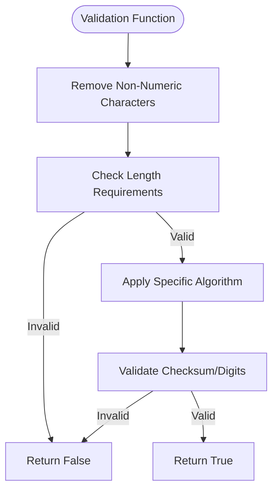
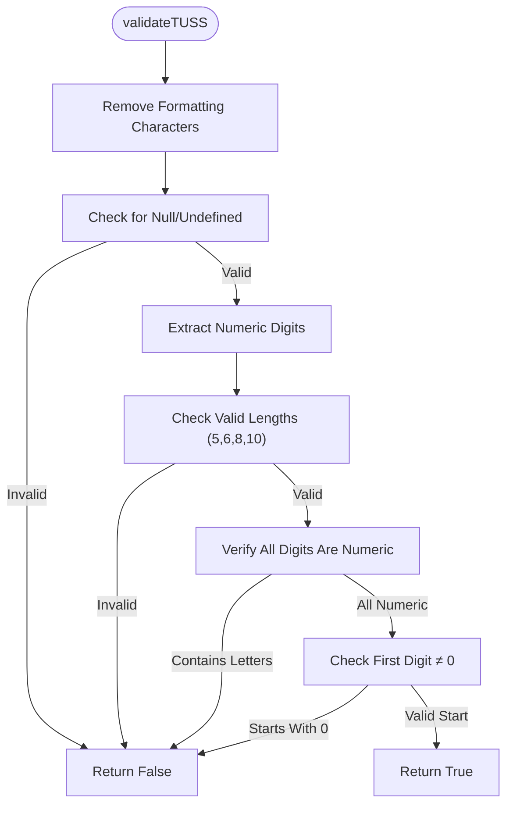
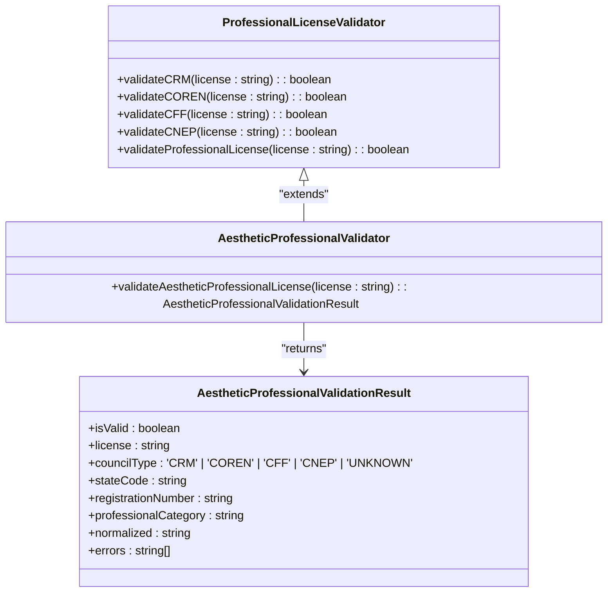
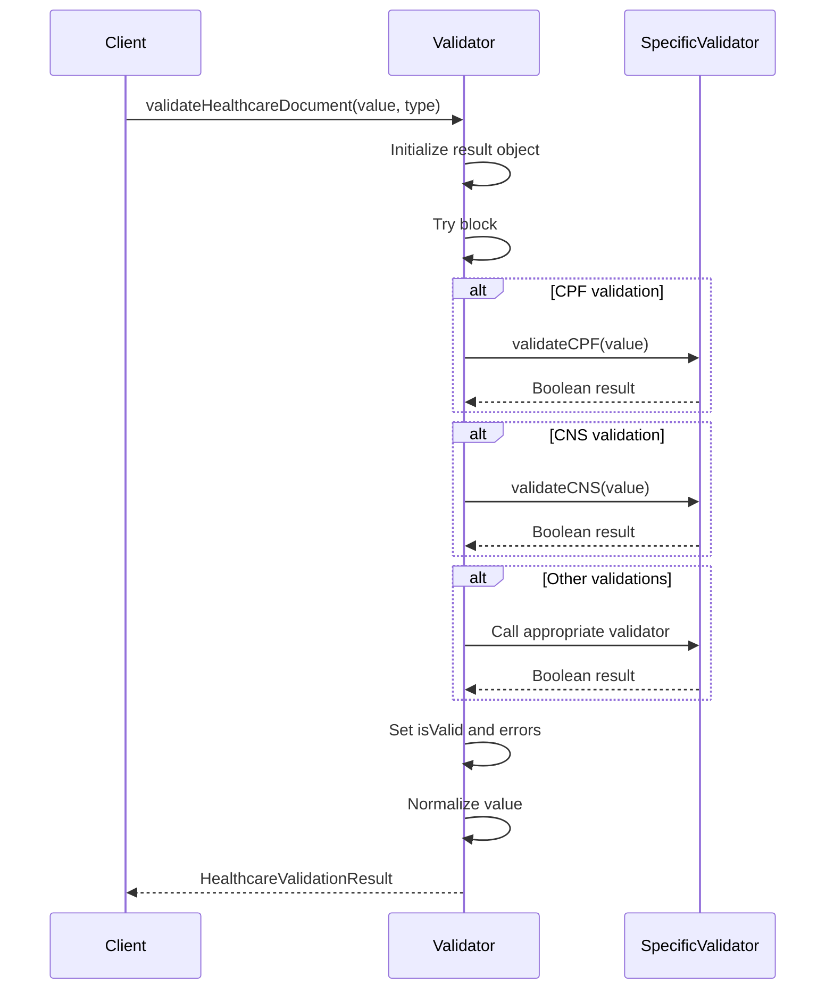
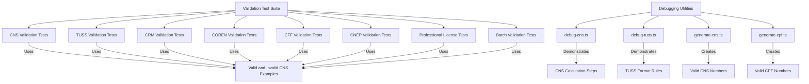

# Validators Package

<cite>
**Referenced Files in This Document **
- [index.ts](file://packages/validators/src/index.ts)
- [brazilian-healthcare.test.ts](file://packages/validators/src/__tests__/brazilian-healthcare.test.ts)
- [debug-cns.ts](file://packages/validators/debug-cns.ts)
- [debug-tuss.ts](file://packages/validators/debug-tuss.ts)
- [generate-cns.ts](file://packages/validators/generate-cns.ts)
- [generate-cpf.ts](file://packages/validators/generate-cpf.ts)
</cite>

## Table of Contents

1. [Introduction](#introduction)
2. [Core Validation Functions](#core-validation-functions)
3. [CNS Validation Algorithm](#cns-validation-algorithm)
4. [TUSS Code Validation](#tuss-code-validation)
5. [Professional License Validation](#professional-license-validation)
6. [Comprehensive Healthcare Document Validation](#comprehensive-healthcare-document-validation)
7. [Test Suite and Debugging Utilities](#test-suite-and-debugging-utilities)
8. [Integration Examples](#integration-examples)
9. [Common Issues and Best Practices](#common-issues-and-best-practices)

## Introduction

The validators package in the neonpro repository provides specialized validation functions for Brazilian healthcare identifiers, ensuring data integrity and regulatory compliance. This package is critical for healthcare systems that must validate patient and professional identifiers according to Brazilian standards. The validators implement precise algorithms for CPF (individual taxpayer registry), CNS (National Health Card), TUSS (Unified Healthcare Terminology), and various professional council registrations (CRM, COREN, CFF, CNEP). These validations are essential for maintaining accurate patient records, preventing fraud, and complying with Brazilian healthcare regulations such as LGPD (General Data Protection Law) and ANVISA requirements.

The package offers both simple validation functions and comprehensive validation utilities that provide detailed error reporting. It includes extensive test coverage and debugging tools to ensure reliability in production environments. The validators are designed to be integrated into forms, API endpoints, and data processing pipelines, providing consistent validation across the application stack.

**Section sources**

- [index.ts](file://packages/validators/src/index.ts#L1-L50)

## Core Validation Functions

The validators package provides a suite of functions for validating Brazilian identification documents. The core functions include `validateCPF`, `validateCNPJ`, `validatePhone`, `validateCEP`, `validateCNS`, and `validateTUSS`. Each function follows a consistent pattern: cleaning input data by removing non-numeric characters, checking basic format requirements, and applying specific validation algorithms. For example, CPF validation uses a weighted checksum algorithm with two verification digits, while CNPJ validation employs a different weighting pattern for its 14-digit structure.

These validation functions are designed to be robust against common input errors, such as formatting characters (dots, dashes, spaces) and case variations. They return boolean values indicating validity, making them easy to integrate into conditional logic. The functions also handle edge cases like null, undefined, or empty inputs gracefully, returning false without throwing exceptions. This design ensures that the validators can be safely used in various contexts without requiring additional error handling.



**Diagram sources **

- [index.ts](file://packages/validators/src/index.ts#L1-L100)

**Section sources**

- [index.ts](file://packages/validators/src/index.ts#L1-L100)

## CNS Validation Algorithm

The `validateCNS` function implements the official algorithm for validating Brazil's National Health Card (Cartão Nacional de Saúde). The CNS is a 15-digit identifier used throughout the Brazilian public healthcare system (SUS). The validation algorithm differs based on the first digit of the CNS number. For definitive CNS numbers (starting with 1 or 2), the algorithm uses a weighted sum with weights [15,14,13,12,11,10,9,8,7,6,5,4,3,2,1], requiring the total sum to be divisible by 11. For provisional CNS numbers (starting with 7, 8, or 9), the algorithm simply requires the sum of all 15 digits to be divisible by 11.

The validation process begins by removing any non-numeric characters and verifying the length is exactly 15 digits. It then checks that the first digit is valid (1, 2, 7, 8, or 9), as other starting digits are not permitted. The `calculateCNSChecksum` helper function performs the actual mathematical validation based on the type of CNS. This dual-algorithm approach reflects the historical evolution of the CNS system and ensures compatibility with both legacy and current numbering schemes.

```mermaid
flowchart TD
Start([validateCNS]) --> RemoveNonNumeric["Remove Non-Numeric Characters"]
RemoveNonNumeric --> CheckLength["Check 15-Digit Length"]
CheckLength --> |Invalid| ReturnFalse["Return False"]
CheckLength --> |Valid| CheckFirstDigit["Check First Digit (1,2,7,8,9)"]
CheckFirstDigit --> |Invalid| ReturnFalse
CheckFirstDigit --> |Valid| DetermineType["Determine CNS Type"]
DetermineType --> |Definitive (1,2)| WeightedSum["Calculate Weighted Sum"]
DetermineType --> |Provisional (7,8,9)| SimpleSum["Calculate Simple Sum"]
WeightedSum --> CheckDivisible["Check Sum % 11 === 0"]
SimpleSum --> CheckDivisible
CheckDivisible --> |Not Divisible| ReturnFalse
CheckDivisible --> |Divisible| ReturnTrue["Return True"]
```

**Diagram sources **

- [index.ts](file://packages/validators/src/index.ts#L132-L153)
- [index.ts](file://packages/validators/src/index.ts#L569-L600)

**Section sources**

- [index.ts](file://packages/validators/src/index.ts#L132-L153)
- [index.ts](file://packages/validators/src/index.ts#L569-L600)

## TUSS Code Validation

The `validateTUSS` function validates codes from the Unified Healthcare Terminology (Terminologia Unificada em Saúde Suplementar), which standardizes medical procedures and services in Brazil. TUSS codes have variable lengths, typically 5, 6, 8, or 10 digits, representing different levels of procedure classification. The validation function first removes any formatting characters and checks that the cleaned code has one of the valid lengths. It then verifies that the code consists only of numeric characters and does not start with zero, as TUSS codes are assigned starting from 1.

This validation is particularly important for billing, insurance claims, and healthcare statistics, where accurate procedure coding is essential. While the validator confirms the structural validity of TUSS codes, it does not verify whether a code corresponds to an actual approved procedure, as this would require access to the official TUSS registry. Instead, it ensures that submitted codes follow the correct format, helping to prevent data entry errors and invalid submissions.



**Diagram sources **

- [index.ts](file://packages/validators/src/index.ts#L167-L198)

**Section sources**

- [index.ts](file://packages/validators/src/index.ts#L167-L198)

## Professional License Validation

The validators package includes comprehensive validation for Brazilian healthcare professional licenses, supporting multiple councils including CRM (Regional Council of Medicine), COREN (Regional Nursing Council), CFF (Federal Pharmacy Council), and CNEP (National Aesthetic Professionals Council). Each council has its own validation function (`validateCRM`, `validateCOREN`, etc.) that checks the format and state code. The general pattern involves normalizing the input by removing spaces and converting to uppercase, then using regular expressions to match the council-specific format.

A key aspect of professional license validation is state code verification. Each council registration includes a two-letter state abbreviation (UF), which must correspond to one of Brazil's 27 federative units. The validation functions maintain a list of valid state codes and check that the extracted UF is present in this list. The `validateProfessionalLicense` function serves as a unified interface that automatically detects the council type and applies the appropriate validation rules, making it easier to validate multiple types of professional credentials with a single function call.



**Diagram sources **

- [index.ts](file://packages/validators/src/index.ts#L204-L426)
- [index.ts](file://packages/validators/src/index.ts#L432-L568)

**Section sources**

- [index.ts](file://packages/validators/src/index.ts#L204-L568)

## Comprehensive Healthcare Document Validation

The `validateHealthcareDocument` and `validateHealthcareDocuments` functions provide a unified interface for validating multiple types of healthcare-related documents. These functions accept a document value and type, then delegate to the appropriate specific validator. The comprehensive validation returns a structured `HealthcareValidationResult` object containing the validation status, document type, original value, any error messages, and a normalized version of the document. This detailed feedback is invaluable for user interfaces, allowing specific error messages to be displayed to users.

The batch validation function `validateHealthcareDocuments` enables efficient validation of multiple documents at once, which is particularly useful during patient registration or data import processes. By processing all validations in a single operation, it reduces code complexity and improves performance. The error handling is robust, catching any unexpected exceptions and converting them to standardized error messages, ensuring that validation failures do not crash the application.



**Diagram sources **

- [index.ts](file://packages/validators/src/index.ts#L620-L753)

**Section sources**

- [index.ts](file://packages/validators/src/index.ts#L620-L753)

## Test Suite and Debugging Utilities

The validators package includes a comprehensive test suite in `brazilian-healthcare.test.ts` that covers all validation functions with both positive and negative test cases. The tests validate correct functionality with properly formatted identifiers and verify rejection of invalid formats, incorrect checksums, and edge cases. For example, the CNS validation tests include valid examples starting with 1, 2, 7, 8, and 9, as well as numerous invalid cases with wrong lengths, invalid starting digits, and incorrect checksums.

In addition to automated tests, the package provides several debugging scripts to aid development and troubleshooting. The `debug-cns.ts` script demonstrates the CNS validation algorithm step by step, showing the calculation of the weighted sum and remainder for each test case. Similarly, `debug-tuss.ts` illustrates the TUSS validation process, displaying how formatting is removed and length checks are applied. These debugging utilities are invaluable for understanding the validation algorithms and diagnosing issues when expected results don't match actual outcomes.



**Diagram sources **

- [brazilian-healthcare.test.ts](file://packages/validators/src/__tests__/brazilian-healthcare.test.ts)
- [debug-cns.ts](file://packages/validators/debug-cns.ts)
- [debug-tuss.ts](file://packages/validators/debug-tuss.ts)

**Section sources**

- [brazilian-healthcare.test.ts](file://packages/validators/src/__tests__/brazilian-healthcare.test.ts)
- [debug-cns.ts](file://packages/validators/debug-cns.ts)
- [debug-tuss.ts](file://packages/validators/debug-tuss.ts)

## Integration Examples

Integrating the validators package into applications is straightforward. For form validation, developers can import specific validation functions and use them in input change handlers or form submission logic. For example, when validating a patient registration form, multiple fields can be validated using the batch validation function:

```typescript
// Example integration with a patient registration form
const patientData = [
  { value: formData.cpf, type: "cpf" as const },
  { value: formData.cns, type: "cns" as const },
  { value: formData.phone, type: "phone" as const },
  { value: formData.crm, type: "crm" as const }
];

const results = validateHealthcareDocuments(patientData);
```

For API endpoints, the validators can be used in middleware or service layers to ensure incoming data meets regulatory requirements before being processed or stored. The detailed error information returned by the comprehensive validation functions can be mapped directly to API response formats, providing clear feedback to clients about validation failures.

**Section sources**

- [index.ts](file://packages/validators/src/index.ts#L620-L753)

## Common Issues and Best Practices

When working with Brazilian healthcare identifier validation, several common issues should be anticipated. False positives can occur when validation algorithms are implemented incorrectly, particularly with the dual-algorithm approach for CNS numbers. To avoid this, always use the official validation logic as implemented in this package. Another common issue is handling formatted vs. unformatted inputs; the validators automatically clean input data, but applications should be consistent in how they store and display these identifiers.

Best practices include validating identifiers at multiple points in the data flow (client-side for immediate feedback, server-side for security), using the comprehensive validation functions to get detailed error information, and regularly updating validation rules to reflect any changes in Brazilian healthcare regulations. For performance-critical applications, consider caching validation results for frequently accessed identifiers, though this should be done carefully to avoid storing sensitive data unnecessarily.

**Section sources**

- [index.ts](file://packages/validators/src/index.ts)
- [brazilian-healthcare.test.ts](file://packages/validators/src/__tests__/brazilian-healthcare.test.ts)
