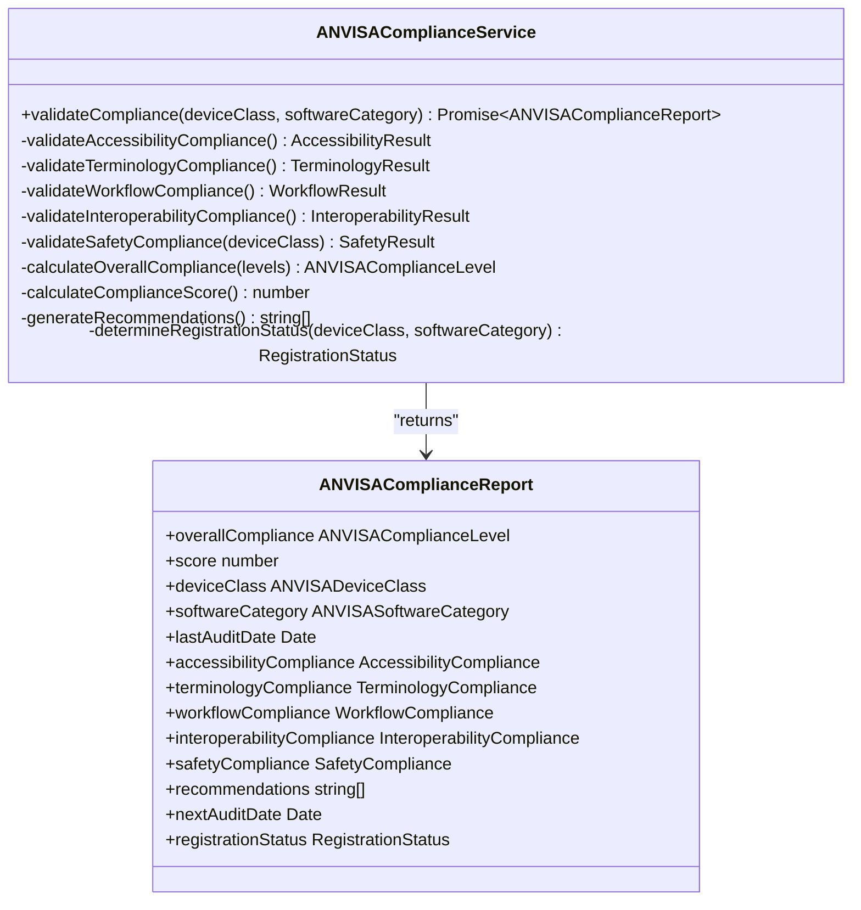
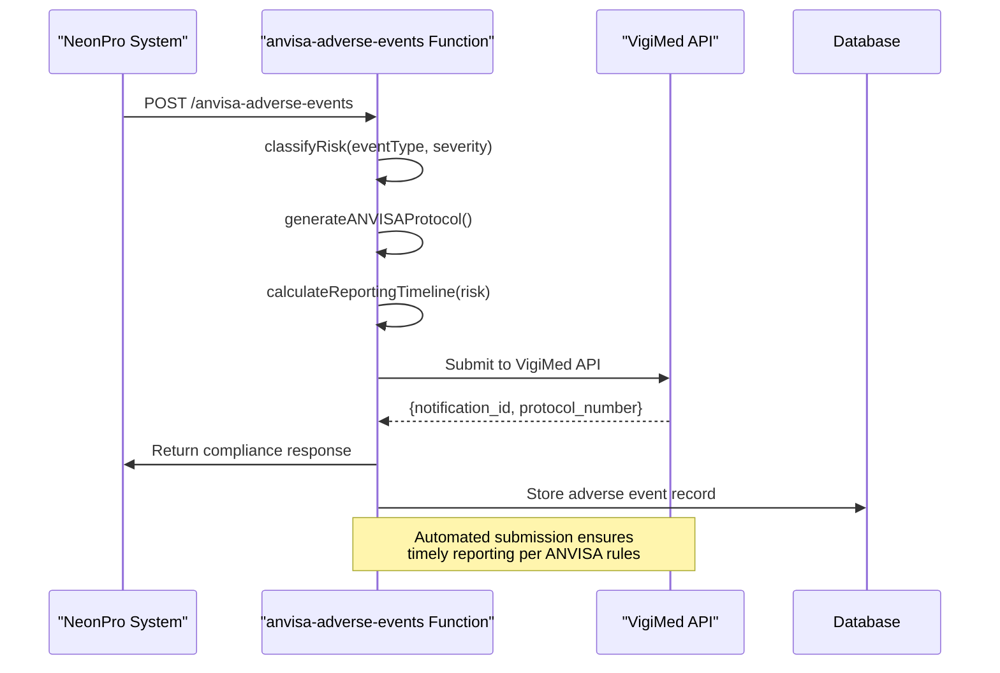
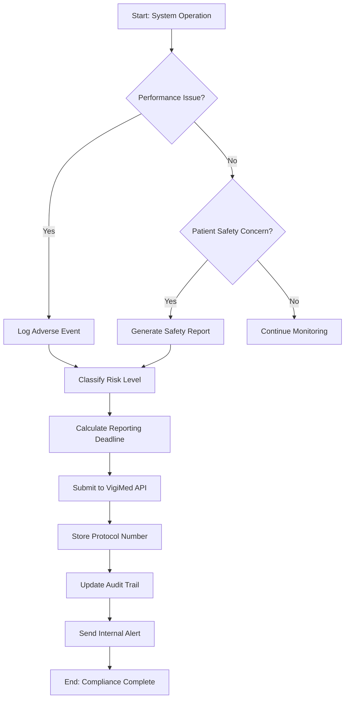
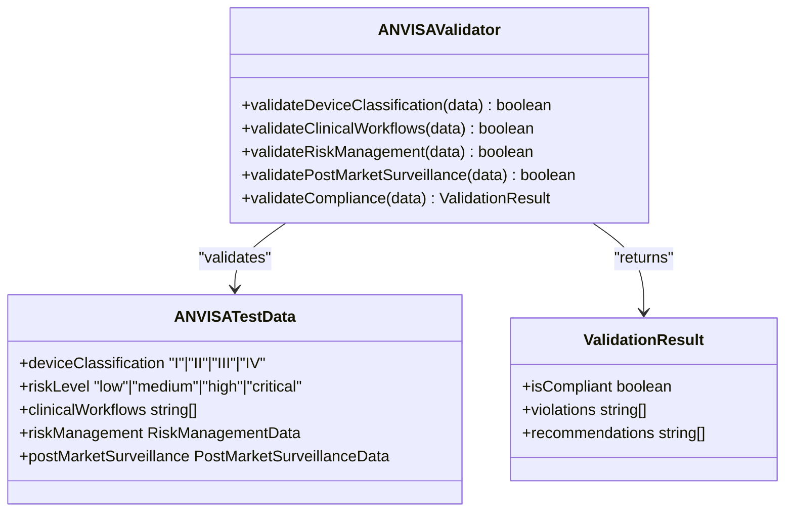

# ANVISA Regulatory Compliance

<cite>
**Referenced Files in This Document**
- [anvisa-compliance.ts](file://apps/api/src/services/anvisa-compliance.ts)
- [anvisa-reporting.test.ts](file://apps/api/tests/compliance/anvisa-reporting.test.ts)
- [anvisa.ts](file://tools/testing-toolkit/src/compliance/anvisa.ts)
- [index.ts](file://supabase/functions/anvisa-adverse-events/index.ts)
</cite>

## Table of Contents

1. [Introduction](#introduction)
2. [ANVISA Compliance Framework](#anvisa-compliance-framework)
3. [Adverse Event Reporting Workflow](#adverse-event-reporting-workflow)
4. [Post-Market Surveillance Integration](#post-market-surveillance-integration)
5. [Validation Framework for Treatment Documentation](#validation-framework-for-treatment-documentation)
6. [Automated Alerting and Reporting Deadlines](#automated-alerting-and-reporting-deadlines)
7. [Extending the Validation Framework](#extending-the-validation-framework)
8. [Troubleshooting Common Compliance Issues](#troubleshooting-common-compliance-issues)

## Introduction

The ANVISA (Agência Nacional de Vigilância Sanitária) regulatory compliance sub-component ensures adherence to Brazilian health surveillance requirements for medical software systems. This documentation details the implementation of adverse event reporting, medical product tracking, and validation frameworks that support cosmetic procedure documentation and treatment outcome tracking. The system is designed to meet RDC 657/2022 standards for Software as a Medical Device (SaMD), with automated checks integrated into clinical workflows.

The architecture supports both proactive monitoring and reactive reporting mechanisms, ensuring timely submission of adverse events to the VigiMed system while maintaining comprehensive audit trails. This document provides technical depth for developers extending the framework and accessible explanations for compliance officers managing regulatory submissions.

## ANVISA Compliance Framework

The core of the ANVISA compliance system is implemented in the `ANVISAComplianceService` class, which performs comprehensive validation across five key domains: accessibility, terminology, workflow, interoperability, and safety. The service evaluates compliance based on device classification and software category, returning a detailed report with issue tracking and remediation recommendations.

**Diagram sources**

- [anvisa-compliance.ts](file://apps/api/src/services/anvisa-compliance.ts#L154-L607)

**Section sources**

- [anvisa-compliance.ts](file://apps/api/src/services/anvisa-compliance.ts#L1-L607)

## Adverse Event Reporting Workflow

The adverse event reporting workflow follows a structured process from detection to submission, ensuring compliance with ANVISA's RDC 657/2022 requirements. When an adverse event is detected—such as a calculation error or performance degradation—the system automatically classifies its risk level and initiates appropriate reporting procedures.

Critical events trigger immediate alerts and require reporting within 24-48 hours, while moderate risks allow up to seven days for submission. All events are assigned a unique ANVISA protocol number following the format `ANVISA.{year}.{timestamp}.{random}` to ensure traceability throughout the reporting lifecycle.

**Diagram sources**

- [index.ts](file://supabase/functions/anvisa-adverse-events/index.ts#L29-L674)

**Section sources**

- [anvisa-reporting.test.ts](file://apps/api/tests/compliance/anvisa-reporting.test.ts#L759-L792)
- [index.ts](file://supabase/functions/anvisa-adverse-events/index.ts#L164-L217)

## Post-Market Surveillance Integration

Post-market surveillance is implemented through continuous monitoring of software performance and patient safety indicators. The system detects patterns in adverse events, such as recurring issues with specific procedures like Botox applications, and triggers proactive reporting when severity escalation or temporal clustering is identified.

The integration with ANVISA’s post-market surveillance requirements includes automated audit trail generation for all device uses, software updates, and maintenance activities. Each entry captures critical metadata including user ID, device serial, software version, and performance metrics, ensuring full traceability of system behavior over time.

**Diagram sources**

- [anvisa-reporting.test.ts](file://apps/api/tests/compliance/anvisa-reporting.test.ts#L24-L63)

**Section sources**

- [anvisa-reporting.test.ts](file://apps/api/tests/compliance/anvisa-reporting.test.ts#L24-L63)
- [index.ts](file://supabase/functions/anvisa-adverse-events/index.ts#L620-L674)

## Validation Framework for Treatment Documentation

The validation framework ensures proper documentation of treatment outcomes, side effects, and product batch tracing by enforcing structured data entry and automated consistency checks. For cosmetic procedures, this includes verification of dosage calculations, contraindication screening, and allergic reaction assessments before finalizing patient records.

The framework leverages predefined test suites that validate key compliance aspects including device classification, clinical workflows, risk management, and post-market surveillance readiness. These tests can be executed programmatically using the `createANVISATestSuite` function, which generates Vitest-compatible suites for continuous integration pipelines.

**Diagram sources**

- [anvisa.ts](file://tools/testing-toolkit/src/compliance/anvisa.ts#L50-L147)

**Section sources**

- [anvisa.ts](file://tools/testing-toolkit/src/compliance/anvisa.ts#L50-L147)

## Automated Alerting and Reporting Deadlines

To address common challenges with timely reporting deadlines, the system implements automated alerting based on risk classification. High-risk events trigger immediate notifications to compliance officers, with escalation procedures if unresolved within 24 hours. Moderate-risk events generate daily reminders until reported, while low-risk events are batched for monthly submission.

The `calculateReportingTimeline` function determines deadlines based on event type and severity, integrating with calendar systems to create actionable tasks. All alerts include direct links to the reporting interface and pre-filled forms containing relevant patient and device information, reducing administrative burden.

**Section sources**

- [index.ts](file://supabase/functions/anvisa-adverse-events/index.ts#L164-L217)

## Extending the Validation Framework

Developers can extend the validation framework for new medical device categories and treatment protocols by implementing additional validation modules and updating the core compliance service. New device classes can be added to the `ANVISA_DEVICE_CLASSES` enumeration, while novel software categories are registered in `ANVISA_SOFTWARE_CATEGORIES`.

For specialized treatment protocols, custom validators should implement the same interface pattern used in the existing `ANVISAValidator` class, ensuring compatibility with the test suite generation system. Integration with external classification APIs, such as SaMD determination tools, allows dynamic assessment of regulatory requirements based on intended use and healthcare decision impact.

**Section sources**

- [anvisa-compliance.ts](file://apps/api/src/services/anvisa-compliance.ts#L449-L504)
- [anvisa.ts](file://tools/testing-toolkit/src/compliance/anvisa.ts#L101-L147)

## Troubleshooting Common Compliance Issues

Common compliance issues include missing clinical evaluations for Class II+ devices, inadequate risk management documentation, and delayed adverse event reporting. The system identifies these through automated audits and generates detailed remediation plans with responsible teams, timeframes, and cost estimates.

When clinical evaluation is missing for non-Class I devices, the system flags it as a critical violation requiring 180-day remediation involving clinical studies and ethics committee approval. Similarly, gaps in risk management trigger recommendations for hazard analysis completion and control measure implementation within 60–90 days depending on severity.

**Section sources**

- [anvisa-compliance.ts](file://apps/api/src/services/anvisa-compliance.ts#L449-L504)
- [anvisa-reporting.test.ts](file://apps/api/tests/compliance/anvisa-reporting.test.ts#L24-L63)
