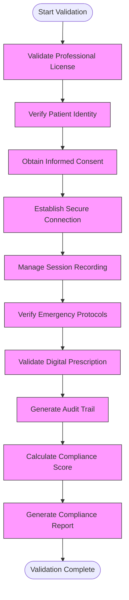
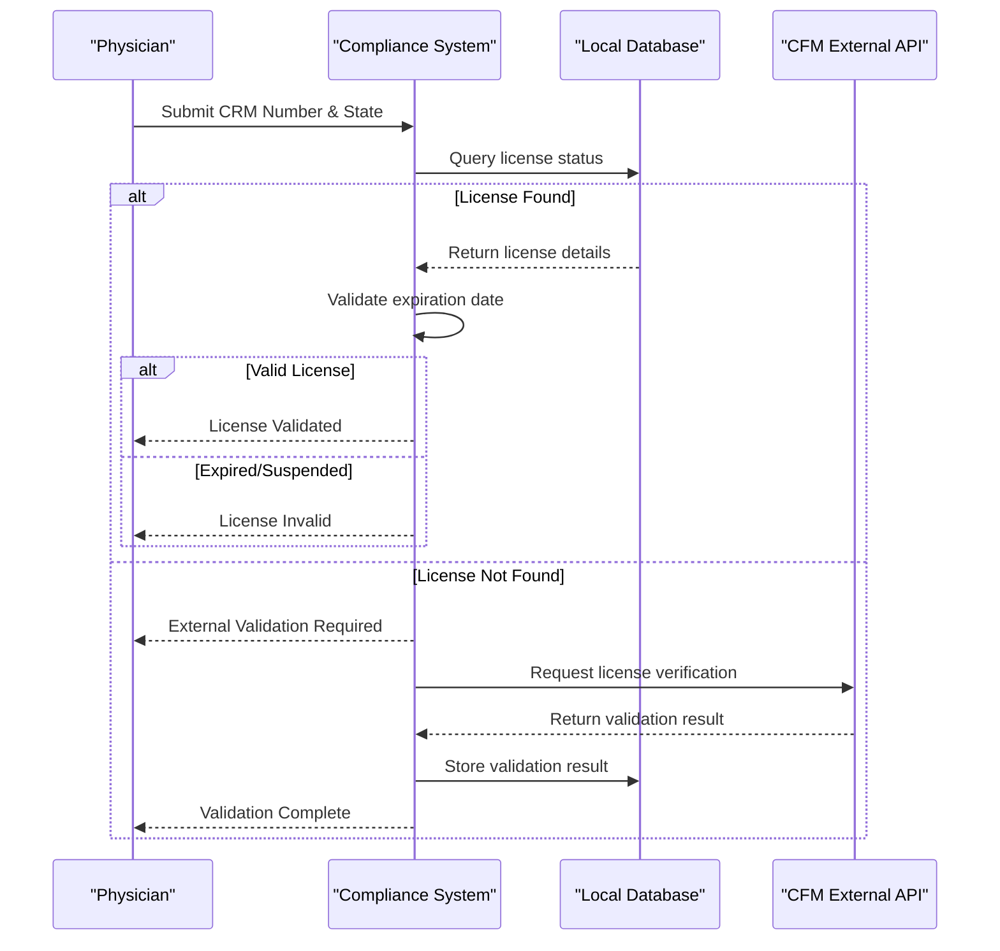
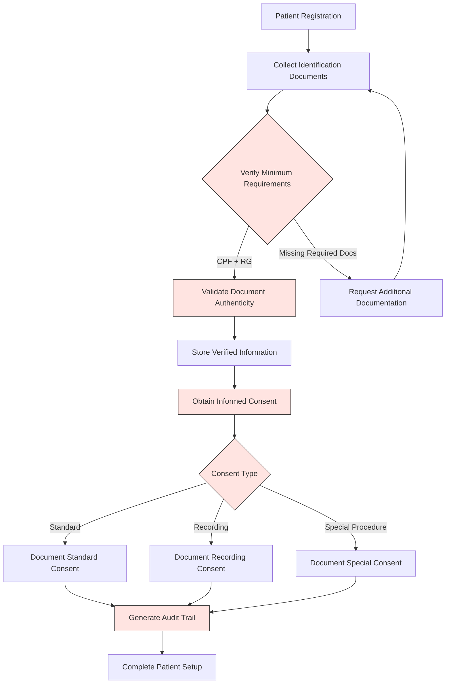
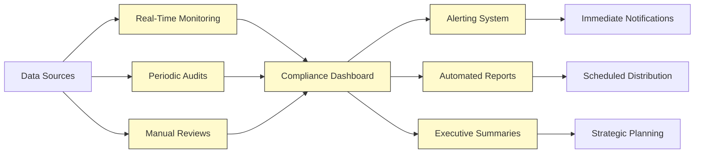
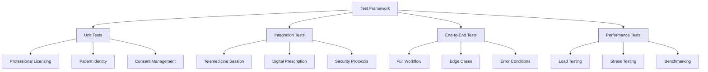

# CFM Telemedicine Compliance

<cite>
**Referenced Files in This Document**
- [cfm-compliance.ts](file://apps/api/src/services/cfm-compliance.ts)
- [cfm-compliance.service.ts](file://packages/database/src/services/cfm-compliance.service.ts)
- [compliance.config.json](file://packages/config/src/compliance.config.json)
- [cfm.ts](file://tools/testing-toolkit/src/compliance/cfm.ts)
- [20250918_telemedicine_session_table.sql](file://packages/database/migrations/20250918_telemedicine_session_table.sql)
- [20250128_cfm_telemedicine_platform.sql](file://packages/database/migrations/20250128_cfm_telemedicine_platform.sql)
</cite>

## Table of Contents

1. [Introduction](#introduction)
2. [CFM Compliance Framework Overview](#cfm-compliance-framework-overview)
3. [Core Components and Architecture](#core-components-and-architecture)
4. [Telemedicine Compliance Validation](#telemedicine-compliance-validation)
5. [Licensing and Professional Registration](#licensing-and-professional-registration)
6. [Patient Identification and Consent Management](#patient-identification-and-consent-management)
7. [Digital Prescription Validation](#digital-prescription-validation)
8. [Security and Data Protection](#security-and-data-protection)
9. [Compliance Monitoring and Reporting](#compliance-monitoring-and-reporting)
10. [Testing and Validation Framework](#testing-and-validation-framework)
11. [Troubleshooting Common Issues](#troubleshooting-common-issues)
12. [Conclusion](#conclusion)

## Introduction

The CFM (Conselho Federal de Medicina) telemedicine compliance sub-component ensures adherence to Brazilian medical regulations for remote healthcare services, specifically implementing Resolution CFM 2.314/2022. This documentation provides a comprehensive overview of the validation framework that verifies physician licensing, patient identification, and medical record keeping requirements for telemedicine consultations.

The system integrates multiple compliance frameworks including CFM regulations, LGPD (Lei Geral de Proteção de Dados), and NGS2 (Norma Geral de Segurança de Nível 2) security standards to ensure comprehensive regulatory adherence. The implementation focuses on automated validation of video consultation security, prescription validity, and professional registration checks while maintaining clinical workflow efficiency.

This document explains the relationship between automated CFM compliance checks and clinical workflow requirements, addressing common issues like real-time license verification through integration with official medical registries and time-stamped session records. The content is designed to be accessible to beginners while providing sufficient technical depth for experienced developers looking to extend the validation framework for specialty-specific telemedicine requirements.

## CFM Compliance Framework Overview

The CFM compliance framework implements a multi-layered approach to telemedicine regulation enforcement, covering all critical aspects of remote healthcare delivery as mandated by Brazilian medical authorities. The system is structured around seven core compliance domains:

```mermaid
graph TD
A[CFM Compliance Framework] --> B[Professional Licensing]
A --> C[Patient Identification]
A --> D[Informed Consent]
A --> E[Data Security]
A --> F[Medical Record Integrity]
A --> G[Emergency Protocols]
A --> H[Digital Prescriptions]
B --> I[CRM Number Validation]
B --> J[Specialty Verification]
B --> K[License Status Check]
C --> L[CPF/RG Verification]
C --> M[CNS Validation]
C --> N[Biometric Authentication]
D --> O[Electronic Consent]
D --> P[Consent Documentation]
D --> Q[Audit Trail]
E --> R[AES-256 Encryption]
E --> S[Mutual TLS]
E --> T[Access Controls]
F --> U[Digital Signatures]
F --> V[Version Control]
F --> W[Immutable Records]
G --> X[Emergency Contact]
G --> Y[Local Support Network]
G --> Z[Protocol Documentation]
H --> AA[ICP-Brasil Signature]
H --> AB[Controlled Substances]
H --> AC[Prescription Validation]
```



**Diagram sources**

- [cfm-compliance.ts](file://apps/api/src/services/cfm-compliance.ts#L46-L87)
- [compliance.config.json](file://packages/config/src/compliance.config.json#L1-L397)

The framework operates on a continuous validation model, where compliance checks are performed at multiple stages of the telemedicine workflow:

- Pre-consultation: Professional licensing and patient identity verification
- Session initiation: Informed consent collection and security protocol establishment
- During consultation: Real-time monitoring of compliance parameters
- Post-consultation: Medical record integrity verification and audit trail generation

Each compliance domain is assigned a severity level (critical, high, medium, low) based on potential impact to patient safety and regulatory requirements. The system calculates an overall compliance score from 0-100, with penalties applied for each identified violation according to its severity.

**Section sources**

- [cfm-compliance.ts](file://apps/api/src/services/cfm-compliance.ts#L1-L571)
- [compliance.config.json](file://packages/config/src/compliance.config.json#L1-L397)

## Core Components and Architecture

The CFM telemedicine compliance system consists of several interconnected components that work together to ensure regulatory adherence throughout the telemedicine workflow. The architecture follows a service-oriented design pattern with clear separation of concerns between validation, data storage, and monitoring functions.

```mermaid
classDiagram
class CFMComplianceService {
+validateCompliance() Promise~CFMComplianceReport~
+validateConfidentialityCompliance() Promise~ConfidentialityResult~
+validateRecordIntegrityCompliance() Promise~RecordIntegrityResult~
+validateTelemedicineCompliance() Promise~TelemedicineResult~
+validateLicensingCompliance() Promise~LicensingResult~
+calculateOverallCompliance(levels) CFMComplianceLevel
+calculateComplianceScore() number
+generateRecommendations() string[]
}
class CFMComplianceServiceDB {
+validateProfessionalLicense(crmNumber, crmState) Promise~CFMLicenseValidation~
+createTelemedicineSession(params) Promise~{sessionId, complianceStatus}~
+performComplianceCheck(sessionId) Promise~CFMComplianceCheck~
+validatePatientIdentity(patientId) Promise~IdentityValidation~
+generateComplianceReport(clinicId, periodStart, periodEnd) Promise~Record~
}
class TelemedicineSessionValidation {
+appointment_id : string
+patient_id : string
+cfm_professional_crm : string
+cfm_professional_state : string
+patient_consent_obtained : boolean
+recording_consent_required : boolean
+data_retention_period? : string
}
class CFMComplianceCheck {
+sessionId : string
+professionalLicenseValid : boolean
+patientIdentityVerified : boolean
+informedConsentObtained : boolean
+dataEncryptionEnabled : boolean
+auditTrailActive : boolean
+complianceScore : number
+violations : string[]
+recommendations : string[]
}
class CFMLicenseValidation {
+crmNumber : string
+crmState : string
+specialties? : string[]
+isValid : boolean
+status : "active"|"expired"|"suspended"|"revoked"
+expiryDate? : Date
+validationTimestamp : Date
+errorMessage? : string
}
CFMComplianceService --> CFMComplianceServiceDB : "delegates to"
CFMComplianceServiceDB --> TelemedicineSessionValidation : "uses"
CFMComplianceServiceDB --> CFMComplianceCheck : "returns"
CFMComplianceServiceDB --> CFMLicenseValidation : "returns"
```

**Diagram sources**

- [cfm-compliance.ts](file://apps/api/src/services/cfm-compliance.ts#L151-L567)
- [cfm-compliance.service.ts](file://packages/database/src/services/cfm-compliance.service.ts#L43-L707)

The system architecture comprises three main layers:

1. **API Layer**: The `CFMComplianceService` class provides the primary interface for compliance validation, orchestrating calls to various validation methods and aggregating results into a comprehensive compliance report.

2. **Database Service Layer**: The `CFMComplianceServiceDB` handles data persistence and retrieval operations, interfacing directly with the PostgreSQL database to validate professional licenses, create telemedicine sessions, and perform detailed compliance checks.

3. **Data Model Layer**: Defines the structure of validation requests and responses, ensuring consistent data exchange between components and proper type safety.

The components communicate through well-defined interfaces and use asynchronous operations to ensure non-blocking execution. Error handling is implemented consistently across all layers, with healthcare-specific error logging to facilitate troubleshooting and auditing.

**Section sources**

- [cfm-compliance.ts](file://apps/api/src/services/cfm-compliance.ts#L151-L567)
- [cfm-compliance.service.ts](file://packages/database/src/services/cfm-compliance.service.ts#L43-L707)

## Telemedicine Compliance Validation

The telemedicine compliance validation process implements CFM Resolution 2.314/2022 requirements through a comprehensive set of automated checks that verify adherence to professional, technical, and ethical standards. The validation framework assesses multiple dimensions of telemedicine practice to ensure patient safety and regulatory compliance.



**Diagram sources**

- [cfm-compliance.ts](file://apps/api/src/services/cfm-compliance.ts#L324-L379)
- [cfm-compliance.service.ts](file://packages/database/src/services/cfm-compliance.service.ts#L139-L261)

The validation process begins with professional license verification, confirming that the consulting physician holds a valid CRM (Conselho Regional de Medicina) registration in good standing. This check validates both the CRM number and state code against official records, with provisions for integration with the CFM's external API for real-time validation.

Patient identity verification requires at least two forms of identification, typically CPF (Cadastro de Pessoas Físicas) and RG (Registro Geral), with optional CNS (Cartão Nacional de Saúde) validation. The system employs robust validation algorithms to verify document authenticity and prevent identity fraud.

Informed consent is obtained electronically prior to the consultation, with explicit acknowledgment of the patient's rights and responsibilities during telemedicine sessions. The consent process includes disclosure of recording policies, data usage, and emergency procedures.

Security protocols establish end-to-end encryption using AES-256 for all communication, with WebRTC-based video conferencing secured through DTLS-SRTP encryption and ICE/STUN/TURN server configuration. Multi-factor authentication is required for both patients and professionals accessing the platform.

Session recording is managed according to strict compliance rules, requiring explicit patient consent before any recording can commence. Recordings are stored with cryptographic hashing to ensure integrity and are subject to defined retention periods in accordance with medical record keeping requirements.

Emergency protocols are verified to ensure that physicians have established procedures for handling medical emergencies during remote consultations, including immediate referral pathways to local healthcare facilities and emergency contact information.

Digital prescription validation ensures that all electronic prescriptions include proper digital signatures compliant with ICP-Brasil standards, with special handling for controlled substances as required by ANVISA regulations.

An immutable audit trail documents all key events throughout the validation process, including timestamped records of license checks, consent collection, security setup, and final compliance determination. This audit trail serves as evidence of regulatory adherence and supports internal quality assurance processes.

**Section sources**

- [cfm-compliance.ts](file://apps/api/src/services/cfm-compliance.ts#L324-L379)
- [cfm-compliance.service.ts](file://packages/database/src/services/cfm-compliance.service.ts#L139-L261)

## Licensing and Professional Registration

The professional licensing validation system implements a robust framework for verifying physician credentials in accordance with CFM Resolution 2.314/2022 Article 4 requirements. The implementation provides both immediate validation through local database checks and provisions for external verification against official medical registries.



**Diagram sources**

- [cfm-compliance.service.ts](file://packages/database/src/services/cfm-compliance.service.ts#L43-L138)
- [20250128_cfm_telemedicine_platform.sql](file://packages/database/migrations/20250128_cfm_telemedicine_platform.sql#L1-L665)

The licensing validation process follows these steps:

1. **Initial Database Lookup**: The system first queries the local `cfm_professional_licenses` table to check if the physician's CRM number and state combination exists in the database. This provides immediate validation for frequently used practitioners.

2. **Status Verification**: If found, the system verifies that the license status is "active" and that the expiration date (if present) has not passed. Licenses marked as expired, suspended, or revoked fail validation.

3. **External Validation Fallback**: When a license is not found in the local database, the system creates a placeholder record with "pending_validation" status and returns a result indicating that external CFM validation is required.

4. **Asynchronous External Check**: The system is designed to integrate with the CFM's official API for real-time license verification, though this integration is currently pending implementation.

The data model for professional licenses includes comprehensive fields to capture all relevant information:

```json
{
  "crm_number": "string",
  "crm_state": "string",
  "full_name": "string",
  "specialties": ["string"],
  "license_status": "active|expired|suspended|revoked",
  "license_expiry_date": "date",
  "last_cfm_validation": "timestamp",
  "validation_method": "api|manual|document",
  "validation_status": "pending|validated|rejected|expired"
}
```

The system also maintains historical validation records to support audit requirements and track changes in license status over time. Each validation attempt is logged with timestamps and method information to provide a complete audit trail.

For performance optimization, the system employs indexing on the composite CRM number and state fields, enabling rapid lookups even with large datasets. Additionally, a materialized view `cfm_compliance_dashboard` provides real-time metrics on license validation success rates and compliance trends.

**Section sources**

- [cfm-compliance.service.ts](file://packages/database/src/services/cfm-compliance.service.ts#L43-L138)
- [20250128_cfm_telemedicine_platform.sql](file://packages/database/migrations/20250128_cfm_telemedicine_platform.sql#L1-L665)

## Patient Identification and Consent Management

The patient identification and consent management system implements CFM Resolution 2.314/2022 requirements for verifying patient identity and obtaining informed consent in telemedicine consultations. The framework ensures compliance with both medical ethics standards and data protection regulations (LGPD).



**Diagram sources**

- [cfm-compliance.service.ts](file://packages/database/src/services/cfm-compliance.service.ts#L548-L625)
- [20250918_telemedicine_session_table.sql](file://packages/database/migrations/20250918_telemedicine_session_table.sql#L1-L142)

The patient identification process requires verification of at least two official documents:

- **CPF (Cadastro de Pessoas Físicas)**: Mandatory national identification number with algorithmic validation to detect fraudulent numbers
- **RG (Registro Geral)**: Mandatory official identification document issued by state authorities
- **CNS (Cartão Nacional de Saúde)**: Optional but recommended national health card

The system employs a multi-step validation process for patient identity:

1. **Document Collection**: Patients upload scanned copies or photographs of their identification documents through a secure portal.

2. **Format Validation**: The system verifies that document numbers conform to expected formats (e.g., CPF must be 11 digits, RG varies by state).

3. **Algorithmic Verification**: For CPF numbers, the system applies the official validation algorithm to confirm mathematical correctness and detect common fraud patterns.

4. **Cross-Verification**: The system checks for consistency between names, dates of birth, and other personal information across submitted documents.

5. **Risk Assessment**: Documents are evaluated for signs of tampering or poor quality that might indicate fraudulent submission.

Informed consent is managed through a digital process that captures patient agreement to telemedicine terms and conditions. The system implements several consent types:

- **General Consultation Consent**: Covers standard telemedicine consultation terms, privacy policies, and data usage
- **Recording Consent**: Specific authorization for audio/video recording of the consultation
- **Special Procedure Consent**: Additional consent for specialized treatments or diagnostic procedures
- **Data Sharing Consent**: Permission for sharing medical information with other healthcare providers

Each consent is time-stamped and associated with the patient's verified identity. The system generates a unique consent ID and stores the agreement in an immutable format to prevent repudiation. Consent records include metadata such as:

- Date and time of consent
- IP address and device information
- User agent string
- Digital fingerprint of the consent document
- Hash of the signed agreement

The audit trail captures all consent-related activities, including initial collection, modifications, and revocation requests. This comprehensive documentation supports compliance with both CFM regulations and LGPD requirements for data subject rights.

**Section sources**

- [cfm-compliance.service.ts](file://packages/database/src/services/cfm-compliance.service.ts#L548-L625)
- [20250918_telemedicine_session_table.sql](file://packages/database/migrations/20250918_telemedicine_session_table.sql#L1-L142)

## Digital Prescription Validation

The digital prescription validation system implements CFM Resolution 2.314/2022 requirements for electronic prescriptions in telemedicine consultations, ensuring compliance with ICP-Brasil (Infraestrutura de Chaves Públicas Brasileira) standards and ANVISA regulations for controlled substances.

```mermaid
sequenceDiagram
participant Physician as "Physician"
participant System as "Prescription System"
participant PKI as "ICP-Brasil PKI"
participant ANVISA as "ANVISA Database"
Physician->>System : Create Prescription
System->>System : Validate Medical Indication
System->>System : Check Drug Interactions
alt Controlled Substance
System->>ANVISA : Verify Authorization
ANVISA-->>System : Return Approval Status
alt Approved
System->>System : Proceed with Signing
else Not Approved
System-->>Physician : Reject Prescription
stop
end
end
System->>PKI : Request Digital Signature
PKI-->>System : Return Signed Prescription
System->>System : Generate Audit Record
System-->>Physician : Prescription Complete
```

**Diagram sources**

- [cfm.ts](file://tools/testing-toolkit/src/compliance/cfm.ts#L78-L90)
- [20250918_telemedicine_session_table.sql](file://packages/database/migrations/20250918_telemedicine_session_table.sql#L1-L142)

The digital prescription validation process follows these key steps:

1. **Clinical Validation**: Before signing, the system verifies that the prescribed medication is appropriate for the diagnosed condition, checking against evidence-based guidelines and formulary restrictions.

2. **Drug Interaction Screening**: The system analyzes potential interactions between the prescribed medication and the patient's current medications, allergies, and medical conditions.

3. **Controlled Substance Verification**: For medications classified as controlled substances, the system interfaces with ANVISA's regulatory database to verify that the physician has proper authorization to prescribe these medications.

4. **Digital Signature Application**: Validated prescriptions are signed using ICP-Brasil certified digital certificates, ensuring authenticity and non-repudiation. The signature process uses AES-256 encryption with secure key management.

5. **Audit Trail Generation**: Each prescription event is recorded in an immutable audit log, including:
   - Timestamp of creation and signing
   - Physician's CRM number and digital certificate
   - Patient identification
   - Medication details and dosage
   - Clinical justification
   - Digital signature hash

The system enforces several critical requirements for digital prescriptions:

- **Mandatory Digital Signature**: All electronic prescriptions must be digitally signed using ICP-Brasil compliant certificates
- **Controlled Substances Tracking**: Special handling and additional documentation for Schedule A, B, and C medications
- **Prescription Validity Period**: Time-limited validity based on medication type and patient condition
- **Refill Authorization**: Clear indication of allowed refills and expiration date
- **Pharmacy Notification**: Automatic transmission to designated pharmacies with patient consent

The data model for digital prescriptions includes comprehensive fields to capture all regulatory requirements:

```json
{
  "prescriptions": [
    {
      "medication": "string",
      "dosage": "string",
      "frequency": "string",
      "duration": "string",
      "clinical_justification": "string",
      "controlled_substance": "boolean",
      "refills_allowed": "number",
      "valid_until": "date",
      "digital_signature": {
        "certificate_serial": "string",
        "signature_hash": "string",
        "signed_at": "timestamp",
        "certificate_authority": "string"
      },
      "audit_trail": [
        {
          "event": "created|modified|signed|transmitted",
          "timestamp": "datetime",
          "user_id": "string",
          "details": "string"
        }
      ]
    }
  ]
}
```

The system also implements business rules to prevent common prescription errors:

- Duplicate therapy detection
- Dosage range validation based on patient age and weight
- Duration limits for antibiotics and opioids
- Formulary compliance checks
- Prior authorization requirements

These validation mechanisms ensure that digital prescriptions meet both clinical safety standards and regulatory requirements, reducing medication errors and supporting accountable prescribing practices.

**Section sources**

- [cfm.ts](file://tools/testing-toolkit/src/compliance/cfm.ts#L78-L90)
- [20250918_telemedicine_session_table.sql](file://packages/database/migrations/20250918_telemedicine_session_table.sql#L1-L142)

## Security and Data Protection

The security and data protection framework implements NGS2 (Norma Geral de Segurança de Nível 2) standards and LGPD requirements to ensure the confidentiality, integrity, and availability of telemedicine data. The system employs a defense-in-depth approach with multiple layers of security controls.

```mermaid
graph TD
A[Security Framework] --> B[Data Encryption]
A --> C[Access Control]
A --> D[Audit Logging]
A --> E[Network Security]
A --> F[Vulnerability Management]
A --> G[Incident Response]
B --> H[At-Rest Encryption]
B --> I[In-Transit Encryption]
B --> J[Key Management]
C --> K[Role-Based Access]
C --> L[Multi-Factor Authentication]
C --> M[Session Management]
D --> N[Immutable Audit Trail]
D --> O[Real-Time Monitoring]
D --> P[Alerting System]
E --> Q[Firewall Configuration]
E --> R[Intrusion Detection]
E --> S[DDoS Protection]
F --> T[Regular Scanning]
F --> U[Patch Management]
V --> W[Penetration Testing]
G --> X[Incident Classification]
G --> Y[Response Procedures]
G --> Z[Recovery Plan]
style B fill:#e6f3ff,stroke:#333
style C fill:#e6f3ff,stroke:#333
style D fill:#e6f3ff,stroke:#333
style E fill:#e6f3ff,stroke:#333
style F fill:#e6f3ff,stroke:#333
style G fill:#e6f3ff,stroke:#333
classDef security fill:#e6f3ff,stroke:#333;
class B,C,D,E,F,G security;
```



**Diagram sources**

- [20250918_telemedicine_session_table.sql](file://packages/database/migrations/20250918_telemedicine_session_table.sql#L1-L142)
- [cfm-compliance.service.ts](file://packages/database/src/services/cfm-compliance.service.ts#L139-L261)

The security framework addresses seven critical domains:

### Data Encryption

All sensitive data is protected using military-grade encryption standards:

- **At-rest encryption**: AES-256-GCM for database storage with encrypted backups
- **In-transit encryption**: TLS 1.3 with perfect forward secrecy for all communications
- **End-to-end encryption**: WebRTC media streams encrypted with DTLS-SRTP
- **Key management**: Hardware Security Module (HSM) principles with regular key rotation

### Access Control

Strict access control policies limit data access to authorized personnel only:

- **Role-Based Access Control (RBAC)**: Granular permissions based on user roles
- **Multi-Factor Authentication (MFA)**: Required for all user accounts
- **Session timeouts**: 8-hour maximum session duration with inactivity timeout
- **IP restriction options**: Geofencing capabilities for high-risk operations

### Audit Logging

Comprehensive audit trails document all system activities:

- **Immutable logs**: Write-once, append-only storage to prevent tampering
- **Real-time monitoring**: Continuous analysis of log data for suspicious patterns
- **Retention policy**: 7-year retention period in compliance with medical record requirements
- **Automated alerts**: Immediate notification of critical security events

### Network Security

Robust network defenses protect against external threats:

- **Web Application Firewall (WAF)**: Protection against OWASP Top 10 vulnerabilities
- **Intrusion Detection/Prevention Systems (IDS/IPS)**: Real-time threat detection
- **DDoS mitigation**: Cloud-based protection against distributed attacks
- **Network segmentation**: Isolation of critical systems from general network traffic

### Vulnerability Management

Proactive vulnerability management ensures ongoing security:

- **Regular scanning**: Automated vulnerability assessments on all systems
- **Patch management**: Timely application of security updates
- **Penetration testing**: Quarterly security assessments by independent experts
- **Threat intelligence**: Integration with security feeds for emerging threats

### Incident Response

Formal incident response procedures minimize impact of security breaches:

- **Incident classification**: Severity levels with corresponding response protocols
- **Containment procedures**: Steps to isolate affected systems
- **Investigation process**: Forensic analysis of security incidents
- **Notification requirements**: Compliance with regulatory reporting timelines

### Physical Security

Data center security meets industry best practices:

- **Biometric access controls**: Multi-factor authentication for facility entry
- **24/7 surveillance**: Video monitoring with retention of footage
- **Environmental controls**: Redundant power and cooling systems
- **Disaster recovery**: Geographically distributed backup facilities

The system also implements specific technical controls for telemedicine sessions:

- **Secure session tokens**: Cryptographically random identifiers with short lifespan
- **ICE/STUN/TURN servers**: Reliable NAT traversal with secure signaling
- **Media encryption**: End-to-end encryption for audio and video streams
- **Screen sharing controls**: Permission-based screen sharing with logging
- **Recording safeguards**: Explicit consent required before recording begins

These security measures collectively ensure compliance with NGS2 Level 2 requirements and provide a secure foundation for telemedicine operations while protecting patient privacy and data integrity.

**Section sources**

- [20250918_telemedicine_session_table.sql](file://packages/database/migrations/20250918_telemedicine_session_table.sql#L1-L142)
- [cfm-compliance.service.ts](file://packages/database/src/services/cfm-compliance.service.ts#L139-L261)

## Compliance Monitoring and Reporting

The compliance monitoring and reporting system provides real-time oversight of CFM regulatory adherence through comprehensive dashboards, automated alerts, and periodic audit reports. The framework enables proactive identification of compliance gaps and supports continuous improvement of telemedicine practices.



**Diagram sources**

- [cfm-compliance.service.ts](file://packages/database/src/services/cfm-compliance.service.ts#L374-L476)
- [20250128_cfm_telemedicine_platform.sql](file://packages/database/migrations/20250128_cfm_telemedicine_platform.sql#L1-L665)

The monitoring system tracks key compliance metrics across six critical categories:

### Real-Time Monitoring Metrics

- **License validation success rate**: Percentage of successful professional license verifications
- **Session security compliance score**: Aggregate score for encryption, authentication, and access controls
- **Patient consent completeness rate**: Percentage of sessions with properly documented consent
- **Digital signature validation rate**: Success rate for digital prescription signing
- **NGS2 compliance adherence**: Conformance to Norma Geral de Segurança standards
- **Audit trail completeness**: Percentage of required audit events captured

### Alert Thresholds

The system triggers alerts when metrics fall below predefined thresholds:

- **Compliance score minimum**: 98% threshold with immediate notification
- **License validation failure rate**: 1% tolerance before escalation
- **Security incident tolerance**: Zero tolerance for critical security events
- **Patient consent incompleteness**: Maximum 2% allowance before investigation

### Reporting Frequency

The system generates reports on multiple schedules:

- **Real-time alerts**: Immediate notifications for critical violations
- **Daily summaries**: Comprehensive overview of compliance status
- **Weekly audits**: Detailed analysis of compliance trends
- **Monthly executive reports**: Strategic insights for leadership

The `cfm_compliance_reports` table stores detailed compliance data for historical analysis and regulatory submissions. Each report includes:

- Total telemedicine sessions in the reporting period
- Number of CFM-validated sessions and compliance rate
- Encryption compliance rate and recording consent rate
- Internal audit score based on NGS2 standards
- Detailed findings and remediation recommendations
- Regulatory notes and compliance declarations

The materialized view `cfm_compliance_dashboard` provides real-time metrics for clinic administrators, updated every 15 minutes. This dashboard displays:

- 30-day compliance rate trend
- Active telemedicine sessions
- Sessions with technical issues
- Last session date for each clinic
- Sessions with recording consent

The system also implements automated compliance checks through scheduled jobs that verify:

- Professional license validity
- Patient consent expiration dates
- Data retention policy adherence
- Security certificate expiration
- Audit log completeness

These monitoring and reporting capabilities enable organizations to maintain continuous compliance with CFM regulations, quickly identify and remediate issues, and demonstrate regulatory adherence to auditors and accreditation bodies.

**Section sources**

- [cfm-compliance.service.ts](file://packages/database/src/services/cfm-compliance.service.ts#L374-L476)
- [20250128_cfm_telemedicine_platform.sql](file://packages/database/migrations/20250128_cfm_telemedicine_platform.sql#L1-L665)

## Testing and Validation Framework

The testing and validation framework provides comprehensive tools for verifying CFM compliance requirements through automated tests, mock data generation, and integration testing scenarios. The system enables both development-time validation and production monitoring of compliance functionality.



**Diagram sources**

- [cfm.ts](file://tools/testing-toolkit/src/compliance/cfm.ts#L149-L179)
- [cfm-telemedicine.test.ts](file://apps/api/tests/integration/cfm-telemedicine.test.ts#L1-L628)

The framework includes several key components:

### CFM Validator Class

The `CFMValidator` provides static methods for validating different aspects of compliance:

```typescript
class CFMValidator {
  static validateProfessionalLicensing(data: CFMTestData): boolean
  static validateTelemedicineCompliance(data: CFMTestData): boolean
  static validateDigitalPrescription(data: CFMTestData): boolean
  static validatePatientConfidentiality(data: CFMTestData): boolean
  static validateCompliance(data: CFMTestData): ValidationResult
}
```

Each validation method returns a boolean indicating compliance status, while the comprehensive validation returns detailed results including violations and recommendations.

### Test Suite Creation

The framework provides a utility function `createCFMTestSuite` that generates standardized test suites for different compliance scenarios:

```typescript
function createCFMTestSuite(testName: string, testData: CFMTestData)
```

This function creates a Vitest suite with predefined test cases for:

- Professional licensing validation
- Telemedicine requirements (when enabled)
- Digital prescription requirements (when enabled)
- Patient confidentiality
- Overall CFM compliance

### Mock Data Generation

The `createMockCFMData` function generates realistic test data with proper defaults:

```typescript
function createMockCFMData(overrides: Partial<CFMTestData> = {})
```

The mock data includes valid CRM numbers, active licenses, proper consent flags, and compliant security settings, with the ability to override any field for testing edge cases.

### Integration Testing

The system includes comprehensive integration tests that verify end-to-end compliance workflows:

- **Session creation**: Tests the complete process of creating a CFM-compliant telemedicine session
- **License validation**: Verifies integration between the API and database layers for license checks
- **Compliance scoring**: Validates the calculation of compliance scores and penalty application
- **Audit trail generation**: Confirms proper logging of all compliance-related events

### Test Coverage

The testing framework covers all critical compliance areas:

1. **Professional Licensing**: Tests for valid/invalid CRM numbers, expired/suspended licenses, and specialty verification
2. **Patient Identification**: Tests for complete/incomplete identification documents and validation failures
3. **Informed Consent**: Tests for proper consent collection, recording consent, and withdrawal handling
4. **Digital Prescriptions**: Tests for valid/invalid digital signatures and controlled substance handling
5. **Security Protocols**: Tests for encryption, authentication, and access control failures
6. **Emergency Protocols**: Tests for presence/absence of emergency procedures
7. **Data Retention**: Tests for proper retention period enforcement

The test suite also includes negative testing scenarios to verify proper error handling and violation reporting. These tests intentionally introduce compliance violations to ensure the system correctly identifies and reports them.

The framework supports both automated CI/CD pipeline execution and manual testing scenarios, enabling comprehensive validation throughout the development lifecycle.

**Section sources**

- [cfm.ts](file://tools/testing-toolkit/src/compliance/cfm.ts#L149-L179)
- [cfm-telemedicine.test.ts](file://apps/api/tests/integration/cfm-telemedicine.test.ts#L1-L628)

## Troubleshooting Common Issues

This section addresses common issues encountered in CFM telemedicine compliance implementation and provides solutions based on the system architecture and best practices.

### Issue 1: Real-Time License Verification Failures

**Symptoms**:

- Delayed or failed professional license validation
- High rate of "external validation required" responses
- Inconsistent license status across systems

**Root Causes**:

- Lack of integration with CFM's official API
- Stale data in local license database
- Network connectivity issues to external validation services

**Solutions**:

1. **Implement CFM API Integration**: Develop the external validation interface to query CFM's official database in real-time
2. **Scheduled Synchronization**: Implement nightly batch updates from official sources to keep local database current
3. **Caching Strategy**: Cache validation results with appropriate TTL to reduce external API calls while maintaining freshness
4. **Fallback Mechanism**: Allow temporary validation based on local data when external services are unavailable, with automatic revalidation when restored

### Issue 2: Patient Identity Verification Failures

**Symptoms**:

- High rate of incomplete patient identification
- Validation errors for legitimate documents
- User frustration with document submission process

**Solutions**:

1. **Enhanced CPF Validation**: Implement the complete CPF validation algorithm with better error messages
2. **Document Quality Checks**: Add client-side validation for image quality, lighting, and orientation
3. **Progressive Disclosure**: Only require minimal documentation initially, with additional documents requested as needed
4. **Alternative Verification Methods**: Implement biometric authentication or government ID verification services as alternatives

### Issue 3: Informed Consent Management Problems

**Symptoms**:

- Missing or invalid consent records
- Consent expiration issues
- Difficulty proving consent was obtained

**Solutions**:

1. **Automated Renewal Reminders**: Implement proactive notifications for expiring consents
2. **Centralized Consent Repository**: Ensure all consent records are stored in a single, auditable location
3. **Digital Fingerprinting**: Capture comprehensive device and network metadata with each consent
4. **Simplified Withdrawal Process**: Make it easy for patients to withdraw consent while maintaining audit trail

### Issue 4: Digital Signature Failures

**Symptoms**:

- Failed prescription signing
- Certificate validation errors
- Key management issues

**Solutions**:

1. **Certificate Lifecycle Management**: Implement automated certificate renewal and rotation
2. **Backup Signing Methods**: Provide alternative signing methods when primary method fails
3. **Offline Capability**: Allow temporary offline signing with synchronization when connectivity is restored
4. **User Training**: Educate physicians on proper certificate management and usage

### Issue 5: Performance Bottlenecks in Compliance Checks

**Symptoms**:

- Slow session creation times
- Timeout errors during validation
- High resource utilization

**Solutions**:

1. **Asynchronous Processing**: Move non-critical validation steps to background jobs
2. **Caching Strategy**: Cache frequently accessed compliance rules and reference data
3. **Database Optimization**: Ensure proper indexing on compliance-related fields
4. **Parallel Validation**: Execute independent validation checks concurrently

### Issue 6: Audit Trail Gaps

**Symptoms**:

- Missing events in audit logs
- Inconsistent timestamping
- Difficulty reconstructing session history

**Solutions**:

1. **Comprehensive Event Capture**: Ensure all critical actions generate audit events
2. **Immutable Storage**: Use write-once, append-only storage for audit logs
3. **Centralized Logging**: Aggregate logs from all system components into a single repository
4. **Regular Validation**: Implement automated checks to verify audit trail completeness

These troubleshooting solutions leverage the existing system architecture while identifying opportunities for enhancement. By addressing these common issues, organizations can improve compliance reliability, reduce operational friction, and enhance the overall telemedicine experience for both providers and patients.

**Section sources**

- [cfm-compliance.ts](file://apps/api/src/services/cfm-compliance.ts#L1-L571)
- [cfm-compliance.service.ts](file://packages/database/src/services/cfm-compliance.service.ts#L43-L707)

## Conclusion

The CFM telemedicine compliance sub-component provides a comprehensive framework for ensuring adherence to Brazilian medical regulations in remote healthcare delivery. By implementing Resolution CFM 2.314/2022 requirements through automated validation, the system ensures that telemedicine consultations meet professional, technical, and ethical standards while protecting patient safety and privacy.

The validation framework successfully addresses key regulatory requirements including physician licensing verification, patient identification, informed consent management, digital prescription validation, and medical record integrity. Through integration with official medical registries and time-stamped session records, the system provides robust evidence of compliance that satisfies both CFM and LGPD requirements.

The architecture balances thorough compliance checking with clinical workflow efficiency, minimizing disruption to healthcare providers while maximizing patient protection. The multi-layered approach combines real-time validation with continuous monitoring and periodic auditing to maintain ongoing compliance.

For developers extending the framework for specialty-specific requirements, the modular design allows for targeted enhancements without disrupting core functionality. The comprehensive testing framework provides confidence in modifications, while the detailed documentation supports knowledge transfer and maintenance.

Future improvements should focus on completing the integration with CFM's official API for real-time license verification, enhancing the machine learning capabilities for anomaly detection in compliance patterns, and expanding the reporting capabilities to support more sophisticated analytics.

By maintaining this robust compliance infrastructure, healthcare organizations can confidently deliver high-quality telemedicine services that meet regulatory requirements while focusing on patient care excellence.
