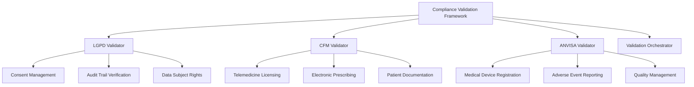
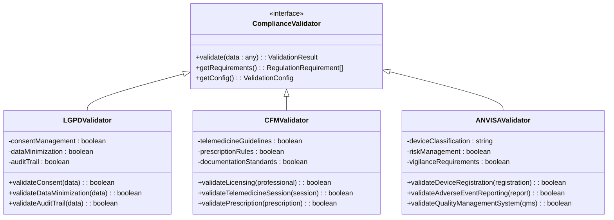
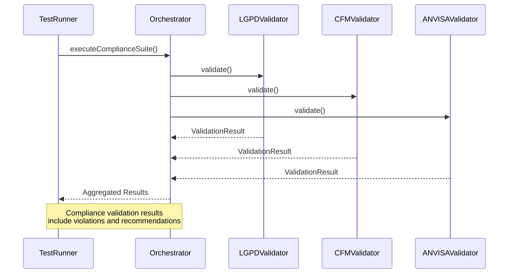
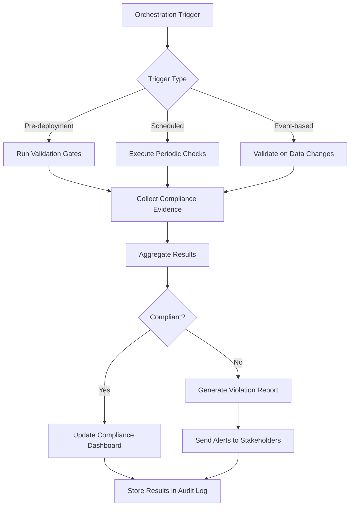
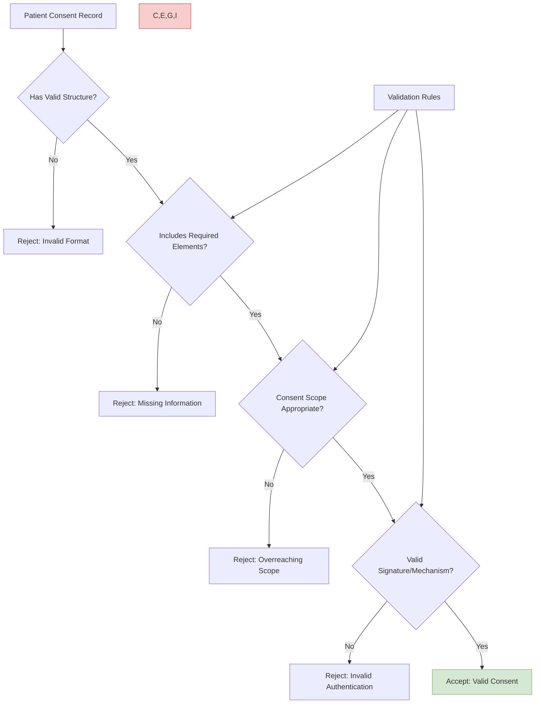
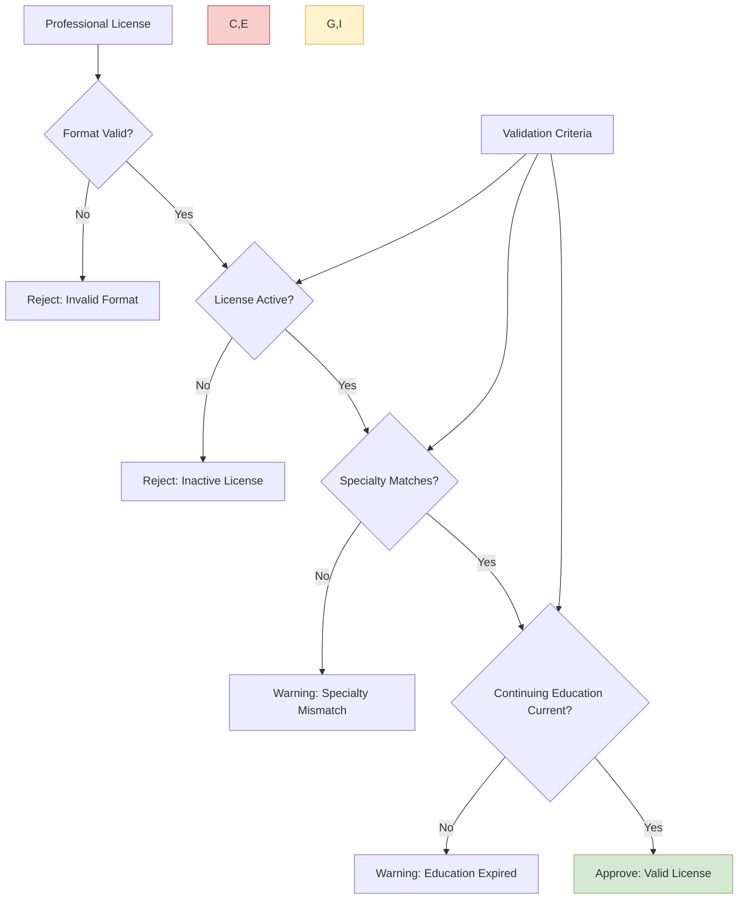
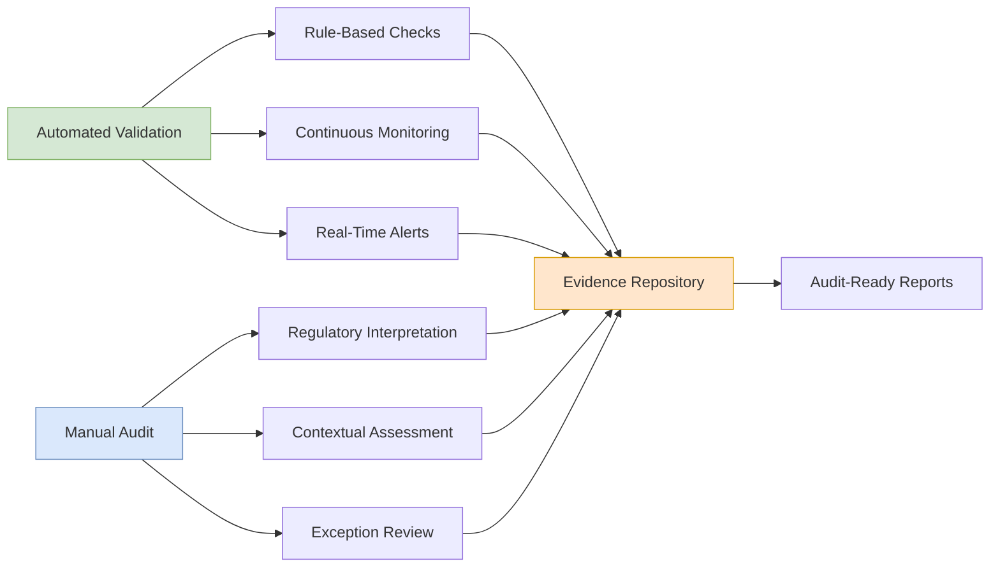
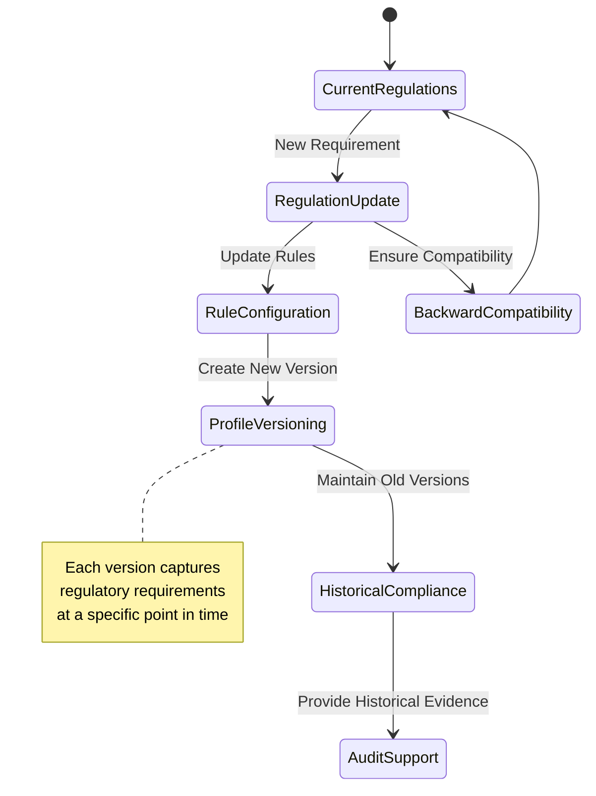
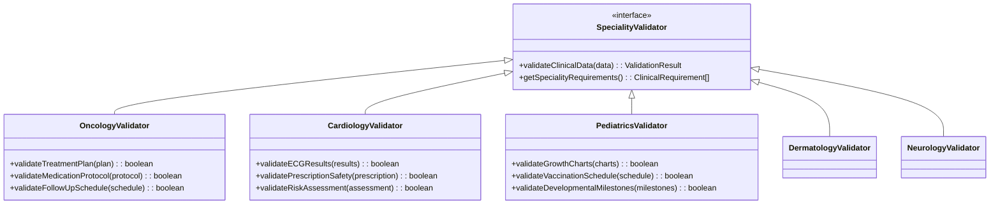

# Compliance Validation Tools

<cite>
**Referenced Files in This Document **   
- [healthcare-validation-schemas.ts](file://apps/api/src/schemas/healthcare-validation-schemas.ts)
- [healthcare-compliance-config.ts](file://config/vercel/healthcare-compliance-config.ts)
- [lgpd.ts](file://tools/testing-toolkit/src/compliance/lgpd.ts)
- [cfm.ts](file://tools/testing-toolkit/src/compliance/cfm.ts)
- [anvisa.ts](file://tools/testing-toolkit/src/compliance/anvisa.ts)
- [index.ts](file://tools/testing-toolkit/src/compliance/index.ts)
</cite>

## Table of Contents
1. [Introduction](#introduction)
2. [Core Compliance Validators](#core-compliance-validators)
3. [Healthcare Regulation Implementation](#healthcare-regulation-implementation)
4. [Integration with Testing Toolkit](#integration-with-testing-toolkit)
5. [Orchestration Framework Integration](#orchestration-framework-integration)
6. [Patient Consent Validation Example](#patient-consent-validation-example)
7. [Telemedicine Licensing Validation](#telemedicine-licensing-validation)
8. [Automated vs Manual Compliance](#automated-vs-manual-compliance)
9. [Handling Evolving Regulations](#handling-evolving-regulations)
10. [Extending the Validation Framework](#extending-the-validation-framework)

## Introduction
The Compliance Validation Tools sub-component provides a comprehensive framework for ensuring Brazilian healthcare regulatory compliance across the NeonPro platform. This system implements automated validators for LGPD (General Data Protection Law), CFM (Federal Council of Medicine) telemedicine guidelines, and ANVISA (National Health Surveillance Agency) medical device regulations. The validation framework integrates seamlessly with the testing toolkit and orchestration system to provide both automated checks and support for manual audit requirements. This documentation details the implementation approach, integration patterns, and extension mechanisms that enable healthcare organizations to maintain compliance with evolving Brazilian healthcare regulations.

## Core Compliance Validators
The compliance validation system is built around three primary validator types, each targeting specific Brazilian healthcare regulations. These validators are implemented as modular components within the testing toolkit, allowing for independent development, testing, and deployment. The core validation logic resides in dedicated TypeScript modules that expose standardized interfaces for configuration, execution, and reporting. Each validator follows a consistent pattern of defining regulatory requirements as testable assertions, enabling both automated verification and manual audit trail generation.

**Diagram sources**
- [lgpd.ts](file://tools/testing-toolkit/src/compliance/lgpd.ts)
- [cfm.ts](file://tools/testing-toolkit/src/compliance/cfm.ts)
- [anvisa.ts](file://tools/testing-toolkit/src/compliance/anvisa.ts)

**Section sources**
- [index.ts](file://tools/testing-toolkit/src/compliance/index.ts)
- [healthcare-compliance-config.ts](file://config/vercel/healthcare-compliance-config.ts)

## Healthcare Regulation Implementation
The implementation of healthcare-specific validators follows a structured approach that maps regulatory requirements to technical controls. For LGPD compliance, the system validates consent management, data minimization, and audit trail completeness. The CFM validator ensures adherence to Resolution 2266/2020 for telemedicine, including proper patient identification, informed consent, and secure communication channels. ANVISA compliance focuses on medical device classification, risk management, and post-market surveillance requirements.

Each validator implements a configuration-driven approach that allows organizations to customize validation rules based on their specific operational context. The configuration system supports versioned compliance profiles, enabling organizations to track changes in regulatory requirements over time. This approach ensures that the validation framework remains current with evolving regulations while maintaining historical compliance records for audit purposes.

**Diagram sources**
- [lgpd.ts](file://tools/testing-toolkit/src/compliance/lgpd.ts)
- [cfm.ts](file://tools/testing-toolkit/src/compliance/cfm.ts)
- [anvisa.ts](file://tools/testing-toolkit/src/compliance/anvisa.ts)

**Section sources**
- [healthcare-compliance-config.ts](file://config/vercel/healthcare-compliance-config.ts)
- [healthcare-validation-schemas.ts](file://apps/api/src/schemas/healthcare-validation-schemas.ts)

## Integration with Testing Toolkit
The compliance validators integrate directly with the testing toolkit through a standardized interface that enables both unit testing and end-to-end validation scenarios. The integration follows a plugin architecture where each validator registers itself with the test orchestrator and participates in the overall test execution lifecycle. This design allows compliance checks to be executed alongside functional, performance, and security tests, providing a comprehensive quality assessment.

The testing toolkit exposes utility functions that simplify the creation of compliance test suites, including mock data generators and assertion helpers. These utilities reduce the complexity of writing compliance tests while ensuring consistency across different validation scenarios. The integration also supports parallel execution of compliance checks, significantly reducing validation time for large datasets or complex workflows.

**Diagram sources**
- [index.ts](file://tools/testing-toolkit/src/compliance/index.ts)
- [lgpd.ts](file://tools/testing-toolkit/src/compliance/lgpd.ts)
- [cfm.ts](file://tools/testing-toolkit/src/compliance/cfm.ts)
- [anvisa.ts](file://tools/testing-toolkit/src/compliance/anvisa.ts)

**Section sources**
- [test-runner.ts](file://tools/testing-toolkit/src/core/test-runner.ts)
- [tdd-orchestrator.ts](file://tools/testing-toolkit/src/core/tdd-orchestrator.ts)

## Orchestration Framework Integration
The compliance validation tools are tightly integrated with the orchestration framework, which coordinates the execution of multiple validation checks across different system components. The orchestration system manages the workflow of compliance validation, including setup, execution, result aggregation, and reporting. This integration enables complex validation scenarios that span multiple services and data stores, ensuring end-to-end compliance coverage.

The orchestration framework supports configurable execution patterns, allowing organizations to define when and how compliance checks are performed. Options include pre-deployment validation gates, scheduled periodic checks, and event-triggered validation (such as after significant data modifications). The system also provides real-time monitoring of compliance status through dashboards and alerting mechanisms, enabling proactive identification and remediation of potential issues.

**Diagram sources**
- [tdd-orchestrator.ts](file://tools/testing-toolkit/src/core/tdd-orchestrator.ts)
- [quality-gates.ts](file://tools/testing-toolkit/src/core/quality-gates.ts)

**Section sources**
- [orchestration-system.ts](file://tools/orchestration/src/orchestration-system.ts)
- [workflows.ts](file://tools/orchestration/src/workflows.ts)

## Patient Consent Validation Example
The validation of patient consent records demonstrates the practical application of the LGPD validator in a healthcare context. The system verifies that patient consent is properly documented, includes all required elements, and aligns with the specified data processing purpose. The validation process examines both structural requirements (such as mandatory fields) and semantic requirements (such as appropriate consent scope).

For patient consent validation, the system checks that the consent record includes the patient's explicit agreement, the specific purpose of data processing, the duration of consent, and information about data subject rights. It also validates that the consent mechanism provides clear opt-in options without pre-checked boxes or default selections. The validator ensures that consent records are stored securely and can be retrieved for audit purposes.

**Diagram sources**
- [lgpd.ts](file://tools/testing-toolkit/src/compliance/lgpd.ts)
- [healthcare-validation-schemas.ts](file://apps/api/src/schemas/healthcare-validation-schemas.ts)

**Section sources**
- [lgpd-aesthetic-clinic-consent.test.ts](file://apps/api/src/__tests__/compliance/lgpd-aesthetic-clinic-consent.test.ts)
- [lgpd-data-subject-rights.test.ts](file://apps/api/src/__tests__/compliance/lgpd-data-subject-rights.test.ts)

## Telemedicine Licensing Validation
The CFM validator implements specific checks for telemedicine licensing requirements as defined in Resolution 2266/2020. This validation ensures that healthcare professionals conducting telemedicine consultations possess valid registration with the appropriate Regional Council of Medicine (CRM) and that their license is current and in good standing. The system verifies the format and authenticity of professional license numbers using the standard CRM/UF NNNNNN pattern.

In addition to license validation, the system checks that telemedicine sessions comply with documentation requirements, including proper patient identification, informed consent for remote consultation, and secure transmission of medical information. The validator also confirms that electronic prescriptions issued during telemedicine consultations meet CFM requirements for digital signatures and authentication.

**Diagram sources**
- [cfm.ts](file://tools/testing-toolkit/src/compliance/cfm.ts)
- [professional-schema.ts](file://apps/api/src/schemas/healthcare-validation-schemas.ts)

**Section sources**
- [cfm-telemedicine.test.ts](file://apps/api/tests/compliance/cfm-telemedicine.test.ts)
- [professional-schema.ts](file://apps/api/src/schemas/healthcare-validation-schemas.ts)

## Automated vs Manual Compliance
The compliance validation framework bridges automated checks with manual audit requirements through a hybrid approach that combines continuous automated monitoring with structured manual review processes. Automated validators handle repetitive, rule-based checks that can be consistently applied across large volumes of data, while reserving complex judgment calls for human reviewers.

The system generates comprehensive audit trails that document both automated validation results and manual review decisions. This evidence collection supports regulatory audits by providing a complete history of compliance activities. The framework also identifies areas where manual intervention is required, such as interpreting ambiguous regulatory language or assessing contextual factors that automated systems cannot evaluate.

**Diagram sources**
- [audit-trail.ts](file://tools/testing-toolkit/src/compliance/audit-trail.ts)
- [lgpd.ts](file://tools/testing-toolkit/src/compliance/lgpd.ts)

**Section sources**
- [lgpd-audit-trail-verification.test.ts](file://apps/api/src/__tests__/compliance/lgpd-audit-trail-verification.test.ts)
- [healthcare-governance.service.ts](file://packages/core-services/src/services/governance/healthcare-governance.service.ts)

## Handling Evolving Regulations
The validation framework addresses the challenge of evolving regulatory requirements through configurable rule sets and versioned compliance profiles. Each regulation is represented as a set of configurable rules that can be updated independently of the core validation logic. When regulations change, administrators can update the relevant rule configurations without requiring code changes or system downtime.

Versioned compliance profiles capture the state of regulatory requirements at specific points in time, enabling organizations to demonstrate compliance with historical regulations during audits. The system maintains a change log for all rule modifications, providing an audit trail of how validation criteria have evolved. This approach ensures that the platform can adapt to new regulations while maintaining continuity with past compliance requirements.

**Diagram sources**
- [healthcare-compliance-config.ts](file://config/vercel/healthcare-compliance-config.ts)
- [governance-provider.ts](file://packages/core-services/src/services/governance/governance-provider.ts)

**Section sources**
- [config.ts](file://tools/testing-toolkit/src/config/performance-budget.json)
- [zod-schemas.ts](file://packages/governance/src/services/zod-schemas.ts)

## Extending the Validation Framework
The validation framework is designed to be extensible for new medical specialties and regulatory requirements. Developers can create additional validators by implementing the standard compliance interface and registering them with the orchestration system. The extension mechanism supports both built-in validators for common specialties and custom validators for niche medical fields.

To extend the framework, developers define new validation rules using the provided schema definitions and integrate them with the existing testing infrastructure. The system supports dynamic loading of validators, allowing new specialties to be added without restarting the application. This flexibility enables healthcare organizations to adapt the platform to their specific clinical domains while maintaining consistent compliance validation practices.

**Diagram sources**
- [index.ts](file://tools/testing-toolkit/src/compliance/index.ts)
- [types.ts](file://tools/testing-toolkit/src/compliance/types.ts)

**Section sources**
- [setup.ts](file://tools/testing-toolkit/src/core/setup.ts)
- [agent-registry.ts](file://tools/orchestration/src/agent-registry.ts)