# LGPD Compliance Validation

<cite>
**Referenced Files in This Document **   
- [lgpd-middleware.ts](file://apps/api/src/middleware/lgpd-middleware.ts)
- [lgpd-compliance.ts](file://apps/api/src/services/lgpd-compliance.ts)
- [crud-compliance.ts](file://packages/utils/src/crud-compliance.ts)
- [compliance.config.json](file://packages/config/src/compliance.config.json)
- [lgpd.ts](file://apps/api/src/types/lgpd.ts)
- [export/lgpd-compliance.ts](file://apps/api/src/services/export/lgpd-compliance.ts)
</cite>

## Table of Contents
1. [Introduction](#introduction)
2. [LGPD Compliance Framework Overview](#lgpd-compliance-framework-overview)
3. [Data Subject Rights Implementation](#data-subject-rights-implementation)
4. [Consent Management System](#consent-management-system)
5. [Personal Data Processing Validation](#personal-data-processing-validation)
6. [Audit Trail Generation and Monitoring](#audit-trail-generation-and-monitoring)
7. [Cross-Border Data Transfer and Data Residency](#cross-border-data-transfer-and-data-residency)
8. [Technical Implementation for Developers](#technical-implementation-for-developers)
9. [Common Issues and Solutions](#common-issues-and-solutions)
10. [Conclusion](#conclusion)

## Introduction
This document provides comprehensive documentation on the LGPD (Lei Geral de Proteção de Dados) compliance validation sub-component within the NeonPro healthcare platform. The system ensures adherence to Brazil's General Data Protection Law by implementing robust mechanisms for data subject rights, consent management, personal data processing validation, and audit trail generation. The framework integrates automated checks with manual compliance processes to create a comprehensive data protection ecosystem that addresses both technical requirements and regulatory obligations.

The implementation focuses on healthcare-specific requirements while maintaining flexibility for various aesthetic clinic operations. By combining middleware enforcement, service-level validation, and configurable policies, the system provides a multi-layered approach to data protection that satisfies LGPD requirements while enabling efficient clinical workflows.

## LGPD Compliance Framework Overview
The LGPD compliance framework is implemented as a multi-layered architecture that spans middleware, services, and configuration layers. The system enforces data protection principles through automated validation, real-time monitoring, and comprehensive audit logging.

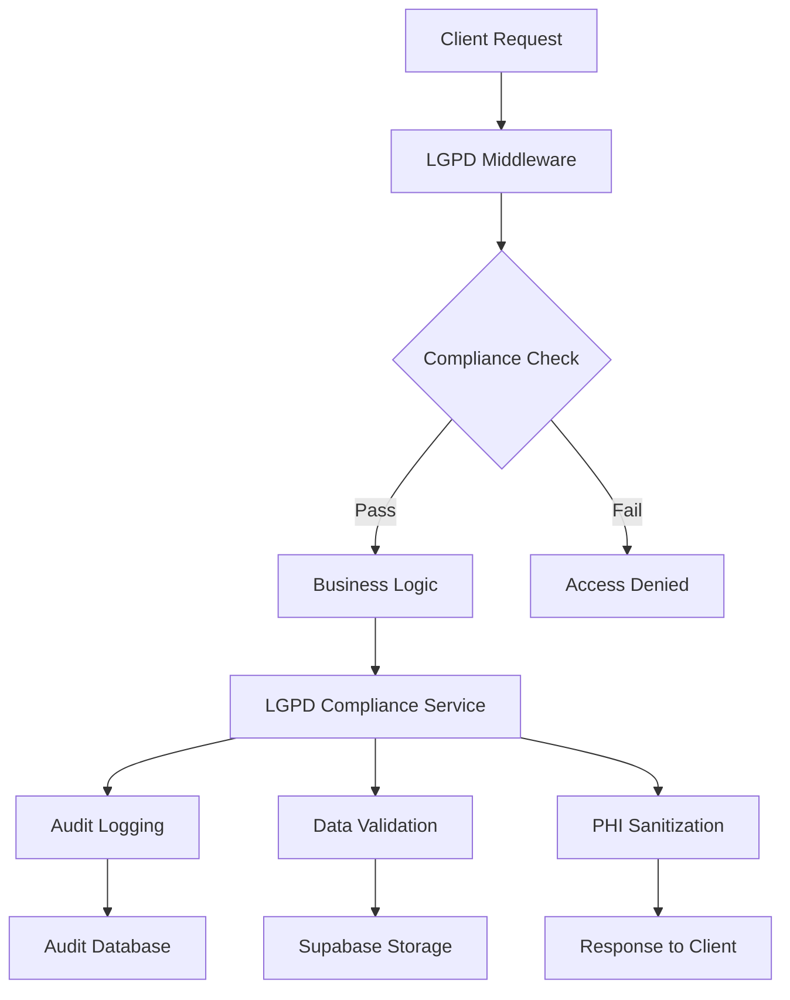

**Diagram sources **
- [lgpd-middleware.ts](file://apps/api/src/middleware/lgpd-middleware.ts#L1-L100)
- [lgpd-compliance.ts](file://apps/api/src/services/lgpd-compliance.ts#L1-L50)

**Section sources**
- [lgpd-middleware.ts](file://apps/api/src/middleware/lgpd-middleware.ts#L1-L100)
- [lgpd-compliance.ts](file://apps/api/src/services/lgpd-compliance.ts#L1-L50)

## Data Subject Rights Implementation
The system implements all data subject rights as required by LGPD Article 18, including access, correction, anonymization, portability, and deletion of personal data. These rights are exposed through dedicated endpoints and automated workflows that ensure timely response to data subject requests.

### Right to Access and Portability
The data portability implementation allows patients to request their complete data set in a structured, commonly used format. The system collects data from multiple sources including patient profiles, medical records, appointments, and audit logs, then packages it for secure delivery.

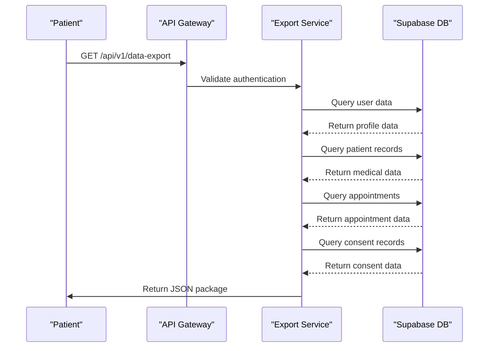

**Diagram sources **
- [lgpd-middleware.ts](file://apps/api/src/middleware/lgpd-middleware.ts#L500-L600)
- [export/lgpd-compliance.ts](file://apps/api/src/services/export/lgpd-compliance.ts#L1-L50)

**Section sources**
- [lgpd-middleware.ts](file://apps/api/src/middleware/lgpd-middleware.ts#L500-L600)
- [export/lgpd-compliance.ts](file://apps/api/src/services/export/lgpd-compliance.ts#L1-L50)

### Right to Erasure (Right to be Forgotten)
The data erasure implementation follows a two-step process of anonymization followed by selective deletion. Sensitive fields are redacted or nullified while maintaining necessary audit trails for compliance purposes. The system distinguishes between different data categories based on their retention requirements.

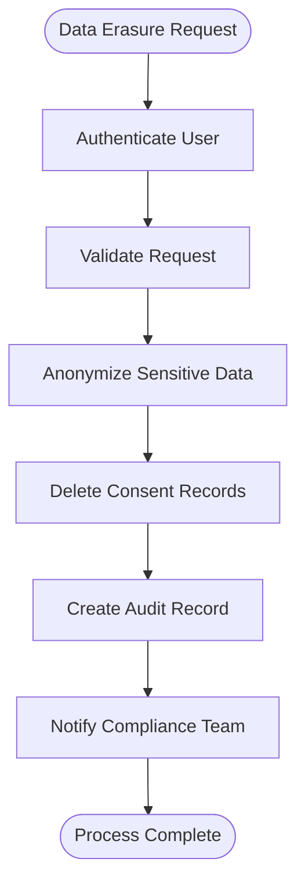

**Diagram sources **
- [lgpd-middleware.ts](file://apps/api/src/middleware/lgpd-middleware.ts#L600-L685)
- [lgpd-compliance.ts](file://apps/api/src/services/lgpd-compliance.ts#L200-L250)

**Section sources**
- [lgpd-middleware.ts](file://apps/api/src/middleware/lgpd-middleware.ts#L600-L685)
- [lgpd-compliance.ts](file://apps/api/src/services/lgpd-compliance.ts#L200-L250)

## Consent Management System
The consent management system implements granular consent tracking for different data processing purposes, with support for consent withdrawal and version tracking. The system distinguishes between various lawful bases for processing as defined in LGPD Article 7.

### Consent Lifecycle Management
The consent lifecycle includes collection, storage, verification, and withdrawal. Each consent record contains metadata about the processing purpose, timestamp, IP address, and user agent to ensure auditability.

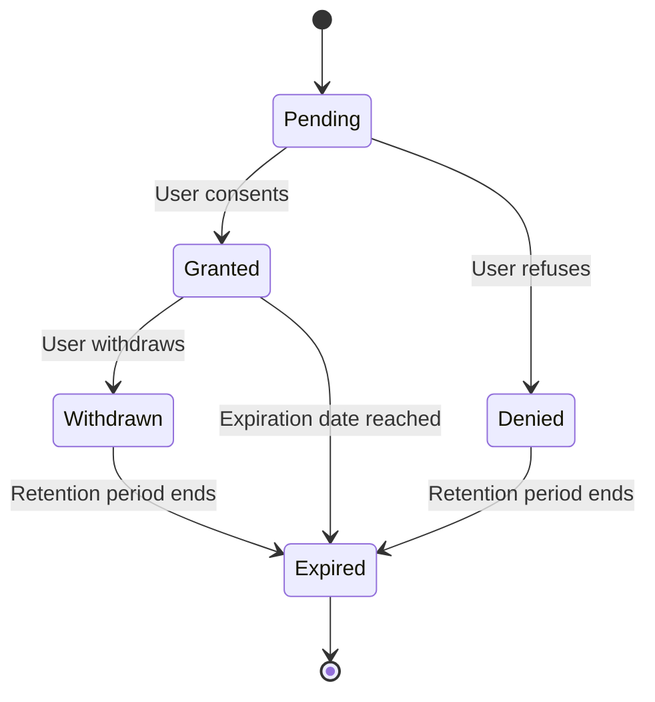

**Diagram sources **
- [lgpd-middleware.ts](file://apps/api/src/middleware/lgpd-middleware.ts#L50-L200)
- [compliance.config.json](file://packages/config/src/compliance.config.json#L100-L150)

**Section sources**
- [lgpd-middleware.ts](file://apps/api/src/middleware/lgpd-middleware.ts#L50-L200)
- [compliance.config.json](file://packages/config/src/compliance.config.json#L100-L150)

### Purpose-Based Consent Enforcement
Different processing purposes require different consent handling strategies. The system automatically determines the required purpose based on the requested endpoint and enforces appropriate consent requirements.

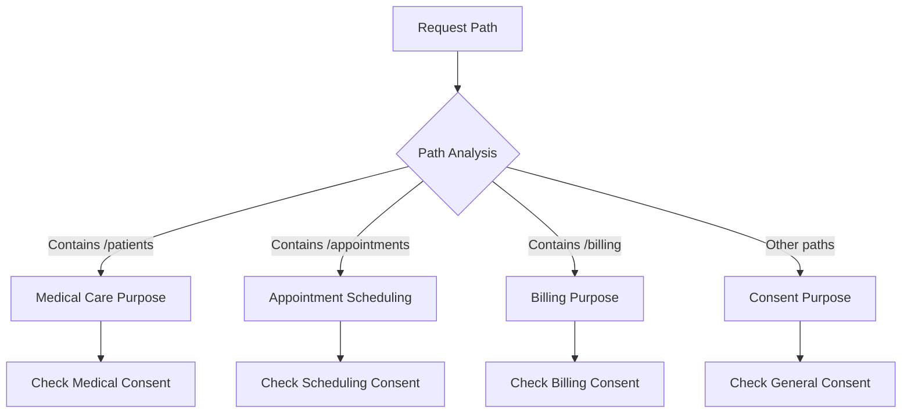

**Diagram sources **
- [lgpd-middleware.ts](file://apps/api/src/middleware/lgpd-middleware.ts#L250-L350)
- [compliance.config.json](file://packages/config/src/compliance.config.json#L100-L150)

**Section sources**
- [lgpd-middleware.ts](file://apps/api/src/middleware/lgpd-middleware.ts#L250-L350)
- [compliance.config.json](file://packages/config/src/compliance.config.json#L100-L150)

## Personal Data Processing Validation
The personal data processing validation framework ensures that all data handling activities comply with LGPD principles including purpose limitation, data minimization, and storage limitation.

### Data Minimization and Purpose Limitation
The system enforces data minimization by validating that only necessary data fields are processed for each specific purpose. The configuration defines retention periods for different data categories to ensure compliance with storage limitation principles.

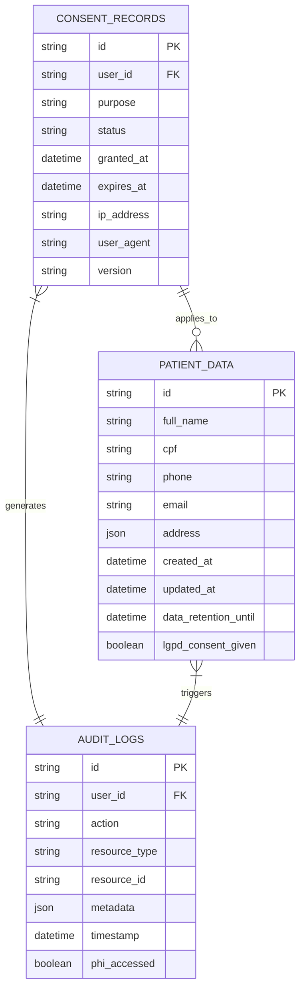

**Diagram sources **
- [compliance.config.json](file://packages/config/src/compliance.config.json#L150-L200)
- [lgpd-compliance.ts](file://apps/api/src/services/lgpd-compliance.ts#L1-L50)

**Section sources**
- [compliance.config.json](file://packages/config/src/compliance.config.json#L150-L200)
- [lgpd-compliance.ts](file://apps/api/src/services/lgpd-compliance.ts#L1-L50)

### PHI Sanitization and Redaction
Protected Health Information (PHI) is automatically sanitized in AI responses and exported data. The system identifies Brazilian-specific PHI patterns including CPF numbers, phone numbers, and medical record identifiers, replacing them with redacted placeholders.

```mermaid
flowchart LR
A[Raw Text Response] --> B{Contains PHI?}
B --> |Yes| C[Apply Redaction Rules]
C --> D[CPF Pattern Detection]
D --> E[Phone Number Detection]
E --> F[Email Detection]
F --> G[Medical Record Detection]
G --> H[Name Detection]
H --> I[Replace with [REDACTED]]
I --> J[Sanitized Output]
B --> |No| J
```

**Diagram sources **
- [lgpd-compliance.ts](file://apps/api/src/services/lgpd-compliance.ts#L150-L200)
- [lgpd.ts](file://apps/api/src/types/lgpd.ts#L300-L350)

**Section sources**
- [lgpd-compliance.ts](file://apps/api/src/services/lgpd-compliance.ts#L150-L200)
- [lgpd.ts](file://apps/api/src/types/lgpd.ts#L300-L350)

## Audit Trail Generation and Monitoring
The audit trail system creates comprehensive logs of all data access and processing activities, providing transparency and accountability as required by LGPD Article 38.

### Automated Audit Trail Creation
Every data access event generates an audit log entry containing contextual information such as user identity, action performed, resource accessed, and compliance status. The system also logs violations and security incidents for investigation.

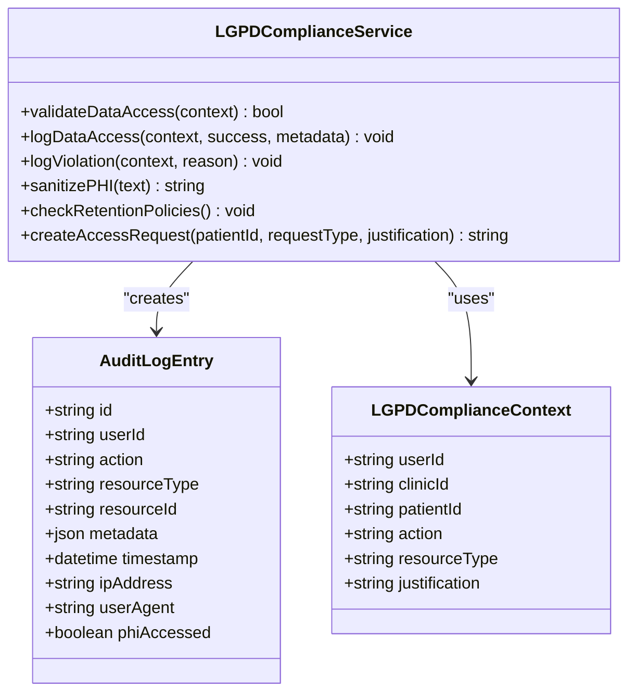

**Diagram sources **
- [lgpd-compliance.ts](file://apps/api/src/services/lgpd-compliance.ts#L1-L250)
- [export/lgpd-compliance.ts](file://apps/api/src/services/export/lgpd-compliance.ts#L1-L50)

**Section sources**
- [lgpd-compliance.ts](file://apps/api/src/services/lgpd-compliance.ts#L1-L250)
- [export/lgpd-compliance.ts](file://apps/api/src/services/export/lgpd-compliance.ts#L1-L50)

### Scheduled Compliance Monitoring
The system performs regular automated checks against LGPD requirements, including validation of consent records, data retention policies, and access controls. These checks generate compliance reports and trigger alerts when issues are detected.

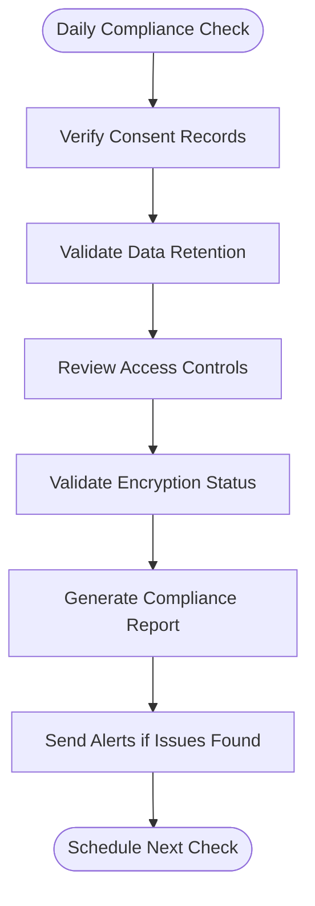

**Diagram sources **
- [crud-compliance.ts](file://packages/utils/src/crud-compliance.ts#L1-L100)
- [compliance.config.json](file://packages/config/src/compliance.config.json#L300-L350)

**Section sources**
- [crud-compliance.ts](file://packages/utils/src/crud-compliance.ts#L1-L100)
- [compliance.config.json](file://packages/config/src/compliance.config.json#L300-L350)

## Cross-Border Data Transfer and Data Residency
The system implements configurable data residency rules to address cross-border data transfer requirements specified in LGPD Article 7, Section X.

### Configurable Data Residency Rules
Organizations can configure data residency policies based on their operational needs and compliance requirements. The system supports multiple data storage locations with automatic routing based on patient location and data sensitivity.

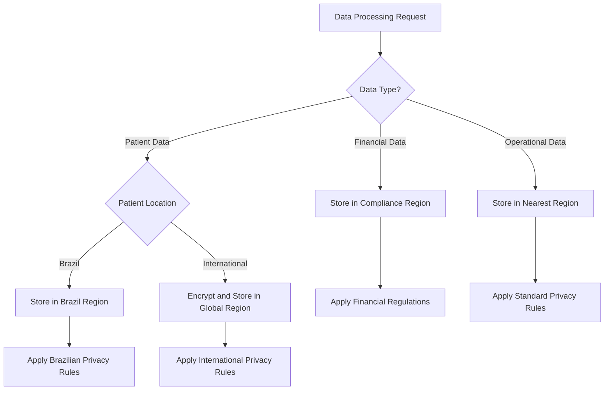

**Diagram sources **
- [compliance.config.json](file://packages/config/src/compliance.config.json#L200-L250)
- [lgpd-compliance.ts](file://apps/api/src/services/lgpd-compliance.ts#L1-L50)

**Section sources**
- [compliance.config.json](file://packages/config/src/compliance.config.json#L200-L250)
- [lgpd-compliance.ts](file://apps/api/src/services/lgpd-compliance.ts#L1-L50)

### Encryption Validation for Data Transfers
All cross-border data transfers are protected with end-to-end encryption using AES-256. The system validates encryption status before allowing data to leave the primary jurisdiction and maintains cryptographic proof of protection.

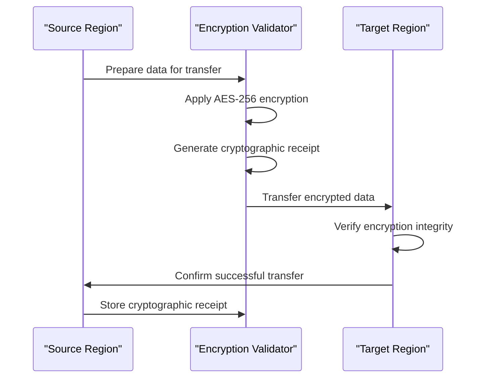

**Diagram sources **
- [compliance.config.json](file://packages/config/src/compliance.config.json#L250-L300)
- [lgpd.ts](file://apps/api/src/types/lgpd.ts#L1-L50)

**Section sources**
- [compliance.config.json](file://packages/config/src/compliance.config.json#L250-L300)
- [lgpd.ts](file://apps/api/src/types/lgpd.ts#L1-L50)

## Technical Implementation for Developers
This section provides guidance for developers extending the LGPD validation framework for new data processing scenarios.

### Extending the Validation Framework
Developers can extend the LGPD compliance system by implementing new validation rules, adding custom data categories, or integrating with additional data sources. The modular design allows for flexible customization while maintaining core compliance guarantees.

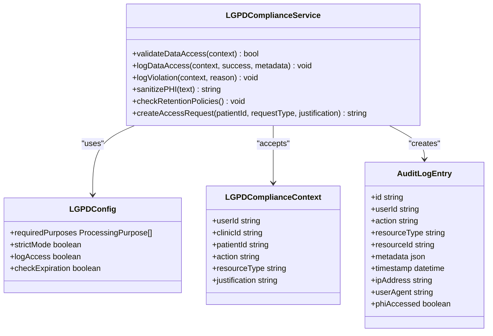

**Diagram sources **
- [lgpd-compliance.ts](file://apps/api/src/services/lgpd-compliance.ts#L1-L250)
- [lgpd-middleware.ts](file://apps/api/src/middleware/lgpd-middleware.ts#L1-L100)

**Section sources**
- [lgpd-compliance.ts](file://apps/api/src/services/lgpd-compliance.ts#L1-L250)
- [lgpd-middleware.ts](file://apps/api/src/middleware/lgpd-middleware.ts#L1-L100)

### Configuration-Driven Compliance
The system uses a centralized configuration file to define compliance rules, making it easy to adapt to changing regulations without code changes. Developers can extend the schema to support new compliance requirements.

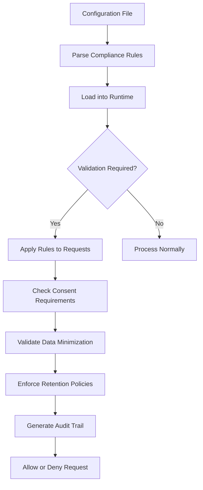

**Diagram sources **
- [compliance.config.json](file://packages/config/src/compliance.config.json#L1-L400)
- [lgpd-middleware.ts](file://apps/api/src/middleware/lgpd-middleware.ts#L1-L100)

**Section sources**
- [compliance.config.json](file://packages/config/src/compliance.config.json#L1-L400)
- [lgpd-middleware.ts](file://apps/api/src/middleware/lgpd-middleware.ts#L1-L100)

## Common Issues and Solutions
This section addresses common challenges encountered when implementing LGPD compliance and provides proven solutions.

### Handling Legacy Data
Existing patient data collected before LGPD implementation requires special handling to ensure compliance. The system provides migration tools to obtain retroactive consent or anonymize legacy records.

**Solution**: Implement a phased approach:
1. Identify legacy data without valid consent
2. Notify affected patients and request explicit consent
3. For non-responsive patients, apply data minimization and anonymization
4. Document the remediation process for audit purposes

### Performance Impact of Compliance Checks
Real-time compliance validation can introduce latency in critical clinical workflows. The system optimizes performance through caching, asynchronous processing, and selective enforcement.

**Solution**: Use context-aware validation:
- Apply strict checks for sensitive operations (e.g., accessing medical records)
- Use cached consent status for routine operations
- Perform retrospective auditing for low-risk activities
- Implement bulk processing for data export and deletion requests

### Multi-Jurisdictional Compliance
Healthcare providers serving international patients must navigate conflicting privacy regulations. The system supports hybrid compliance models that satisfy multiple regulatory frameworks simultaneously.

**Solution**: Implement location-based rule selection:
- Detect patient residence and applicable regulations
- Apply the most stringent requirements when regulations conflict
- Maintain separate audit trails for different compliance frameworks
- Provide clear disclosure about data handling practices to patients

## Conclusion
The LGPD compliance validation framework provides a comprehensive solution for healthcare organizations to meet Brazil's data protection requirements. By combining automated technical controls with configurable policies and comprehensive audit logging, the system enables compliant data processing while supporting efficient clinical workflows.

Key strengths of the implementation include:
- Modular architecture that separates concerns between middleware, services, and configuration
- Comprehensive coverage of all data subject rights as required by LGPD
- Flexible consent management supporting multiple lawful bases for processing
- Robust audit trail generation with automated monitoring
- Configurable data residency rules for cross-border data transfers

For developers extending the system, the configuration-driven approach allows adaptation to evolving regulatory requirements without extensive code changes. The well-documented APIs and extensible service classes make it straightforward to add support for new data processing scenarios while maintaining compliance guarantees.

Organizations implementing this framework should regularly review their compliance posture, update configurations as regulations evolve, and provide ongoing training to staff about data protection responsibilities. By treating compliance as an ongoing process rather than a one-time implementation, healthcare providers can build trust with patients and avoid regulatory penalties.