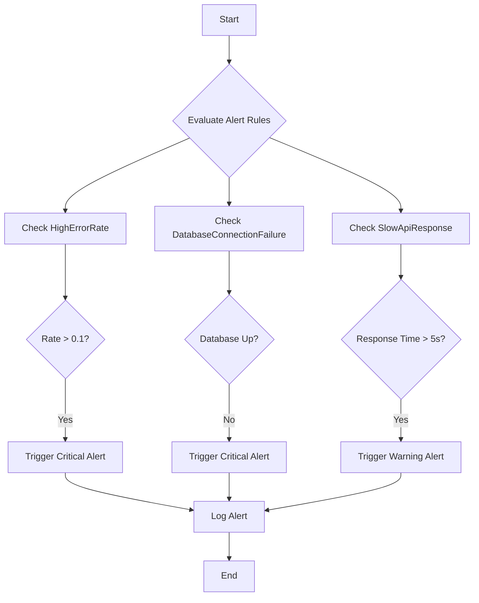
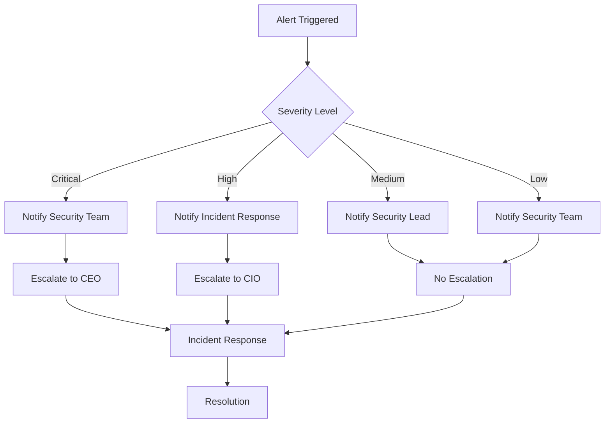
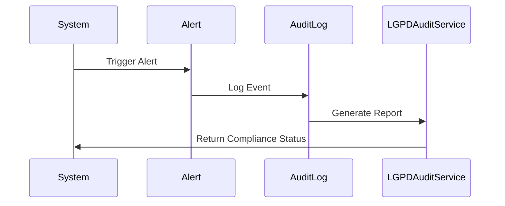

# Alert Configuration

<cite>
**Referenced Files in This Document **
- [healthcare-alerts.json](file://tools/monitoring/alerts/healthcare-alerts.json)
- [security-monitoring.json](file://tools/monitoring/security-monitoring.json)
- [notification-service.ts](file://packages/shared/src/services/notification-service.ts)
- [lgpd-audit-service.ts](file://apps/api/src/services/lgpd-audit-service.ts)
- [monitoring-config.ts](file://config/vercel/monitoring-config.ts)
</cite>

## Table of Contents

1. [Introduction](#introduction)
2. [Alert Rules Implementation](#alert-rules-implementation)
3. [Notification Policies and Escalation Paths](#notification-policies-and-escalation-paths)
4. [Critical Healthcare Scenarios](#critical-healthcare-scenarios)
5. [Integration with External Notification Systems](#integration-with-external-notification-systems)
6. [Audit Logging and LGPD Compliance](#audit-logging-and-lgpd-compliance)
7. [False Positive Mitigation](#false-positive-mitigation)
8. [Extending for Regulatory Requirements](#extending-for-regulatory-requirements)

## Introduction

The alert configuration system is designed to ensure the reliability, security, and compliance of healthcare operations. It monitors critical systems and triggers alerts based on predefined thresholds and patterns. The system integrates with audit logging to meet LGPD requirements and supports escalation paths for timely incident response. This document details the implementation of alert rules and notification policies, focusing on compliance violations, security incidents, and system outages.

## Alert Rules Implementation

Alert rules are defined in `healthcare-alerts.json` and `security-monitoring.json`, specifying conditions that trigger alerts. These rules use expressions to monitor metrics such as error rates, response times, and system availability. For example, the "HighErrorRate" rule triggers when the API error rate exceeds 0.1 errors per second over a 5-minute window. Each rule includes labels for severity, component, and healthcare impact, along with annotations for summary and description. The system evaluates these rules continuously and generates alerts when conditions are met.

**Diagram sources **

- [healthcare-alerts.json](file://tools/monitoring/alerts/healthcare-alerts.json#L1-L158)

**Section sources**

- [healthcare-alerts.json](file://tools/monitoring/alerts/healthcare-alerts.json#L1-L158)

## Notification Policies and Escalation Paths

Notification policies define how alerts are delivered and escalated. The system uses multiple channels, including email, SMS, Slack, and PagerDuty, to ensure timely delivery. Severity levels determine the notification channel; critical alerts are sent via PagerDuty and SMS, while warnings use email and Slack. Escalation paths are configured to notify appropriate teams based on incident severity, with critical incidents escalating to the CEO within 15 minutes.

**Diagram sources **

- [security-monitoring.json](file://tools/monitoring/security-monitoring.json#L1-L295)

**Section sources**

- [security-monitoring.json](file://tools/monitoring/security-monitoring.json#L1-L295)

## Critical Healthcare Scenarios

The system is configured to handle critical healthcare scenarios, including compliance violations, security incidents, and system outages. For compliance violations, the "ComplianceViolation" rule triggers when any violation is detected, requiring immediate action. Security incidents like data breaches or unauthorized access are monitored using rules such as "PatientDataBreach" and "Unauthorized Data Access." System outages, such as database connection failures or backup failures, are detected by rules like "DatabaseConnectionFailure" and "BackupFailure," ensuring prompt response to maintain system availability.

**Section sources**

- [healthcare-alerts.json](file://tools/monitoring/alerts/healthcare-alerts.json#L1-L158)
- [security-monitoring.json](file://tools/monitoring/security-monitoring.json#L1-L295)

## Integration with External Notification Systems

The alert system integrates with external notification systems to deliver alerts through various channels. Email notifications are sent to designated recipients, while SMS messages are used for high-severity alerts. Slack channels receive alerts for team visibility, and PagerDuty handles critical incidents requiring immediate attention. The integration ensures that alerts reach the right personnel through their preferred communication methods, facilitating quick response and resolution.

**Section sources**

- [security-monitoring.json](file://tools/monitoring/security-monitoring.json#L1-L295)
- [monitoring-config.ts](file://config/vercel/monitoring-config.ts#L368-L410)

## Audit Logging and LGPD Compliance

Alert triggers are linked to audit logging requirements under LGPD regulations. Every alert generates an audit log entry that records the event, including timestamp, user, and action taken. This ensures transparency and accountability, supporting compliance with LGPD's data protection principles. The system validates consent before processing personal data and logs all access to sensitive information, enabling comprehensive audit trails for regulatory reporting.

**Diagram sources **

- [lgpd-audit-service.ts](file://apps/api/src/services/lgpd-audit-service.ts#L400-L446)
- [healthcare-alerts.json](file://tools/monitoring/alerts/healthcare-alerts.json#L1-L158)

**Section sources**

- [lgpd-audit-service.ts](file://apps/api/src/services/lgpd-audit-service.ts#L400-L446)
- [healthcare-alerts.json](file://tools/monitoring/alerts/healthcare-alerts.json#L1-L158)

## False Positive Mitigation

To address false positives in medical monitoring systems, the system employs intelligent filtering and context-aware alerting. Filters analyze historical data and user behavior to distinguish between normal variations and genuine threats. Context-aware alerting considers additional factors, such as user role and access patterns, to reduce unnecessary alerts. For example, a high authentication failure rate from a known IP address may not trigger an alert if it aligns with typical user behavior.

**Section sources**

- [notification-service.ts](file://packages/shared/src/services/notification-service.ts#L749-L798)
- [lgpd-audit-service.ts](file://apps/api/src/services/lgpd-audit-service.ts#L669-L723)

## Extending for Regulatory Requirements

The alert system can be extended to support new regulatory requirements by adding custom rules and notification policies. Developers can define new alert expressions and integrate with additional notification channels. The system's modular design allows for easy updates, ensuring compliance with evolving regulations. For instance, adding support for a new regulation involves creating a new rule in `healthcare-alerts.json` and configuring the corresponding notification policy in `security-monitoring.json`.

**Section sources**

- [healthcare-alerts.json](file://tools/monitoring/alerts/healthcare-alerts.json#L1-L158)
- [security-monitoring.json](file://tools/monitoring/security-monitoring.json#L1-L295)
