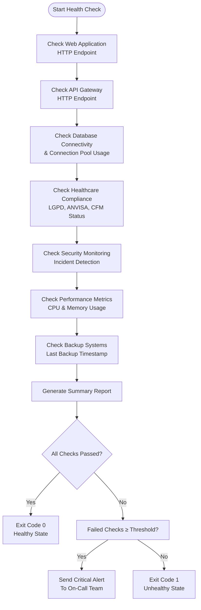
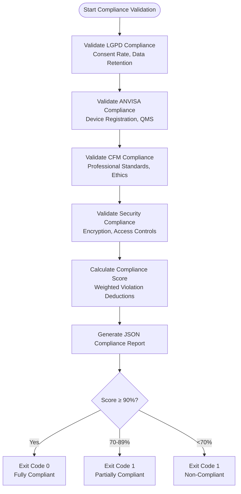
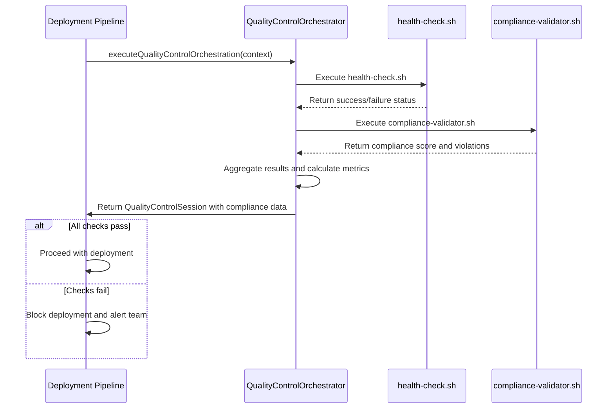
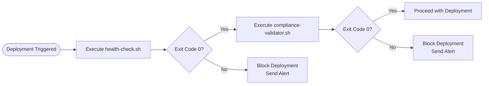

# Health Check Scripts

<cite>
**Referenced Files in This Document **   
- [health-check.sh](file://tools/monitoring/scripts/health-check.sh)
- [compliance-validator.sh](file://tools/monitoring/scripts/compliance-validator.sh)
- [quality-control-orchestrator.ts](file://tools/orchestration/src/quality-control-orchestrator.ts)
- [types.ts](file://tools/orchestration/src/types.ts)
</cite>

## Table of Contents
1. [Introduction](#introduction)
2. [Health Check Script Implementation](#health-check-script-implementation)
3. [Compliance Validation Script Implementation](#compliance-validation-script-implementation)
4. [Integration with Quality Control Orchestrator](#integration-with-quality-control-orchestrator)
5. [Exit Code Handling and Pipeline Integration](#exit-code-handling-and-pipeline-integration)
6. [Common Issues and Solutions](#common-issues-and-solutions)
7. [Extending Health Checks for New Integrations](#extending-health-checks-for-new-integrations)

## Introduction
The NeonPro Healthcare Platform utilizes two critical shell scripts—`health-check.sh` and `compliance-validator.sh`—to ensure system readiness and regulatory compliance. These scripts are essential components of the deployment pipeline, validating that all services are operational and compliant with healthcare regulations such as LGPD, ANVISA, and CFM before allowing deployments to proceed. The health checks integrate with the quality control orchestrator to influence deployment decisions based on system status and compliance scores.

**Section sources**
- [health-check.sh](file://tools/monitoring/scripts/health-check.sh#L1-L313)
- [compliance-validator.sh](file://tools/monitoring/scripts/compliance-validator.sh#L1-L475)

## Health Check Script Implementation
The `health-check.sh` script performs comprehensive validation of system components through HTTP endpoint checks, database connectivity verification, security monitoring, performance metrics assessment, and backup system validation. It uses curl to test various endpoints including the web application, API gateway, and database health endpoints, with configurable timeout settings and response time alerts.

The script implements structured logging with timestamped entries written to `/var/log/neonpro/health-check.log`, tracking both informational messages and errors. It maintains a counter of failed checks and collects names of failing services for reporting purposes. For database validation, it parses JSON responses to extract connection pool usage metrics and warns when usage exceeds 80%. Performance checks monitor CPU and memory usage, triggering warnings at 80% and 90% thresholds respectively.

**Diagram sources **
- [health-check.sh](file://tools/monitoring/scripts/health-check.sh#L1-L313)

**Section sources**
- [health-check.sh](file://tools/monitoring/scripts/health-check.sh#L1-L313)

## Compliance Validation Script Implementation
The `compliance-validator.sh` script validates adherence to healthcare regulations through dedicated checks for LGPD (data protection), ANVISA (medical device regulation), and CFM (medical ethics). Each compliance domain has specific validation criteria that contribute to an overall compliance score ranging from 0-100%.

For LGPD compliance, the script verifies data processing consent rates (must be ≥95%), data retention policy compliance, active data breach notification procedures, and enabled data portability features. ANVISA validation confirms valid medical device registration, compliant quality management systems, active risk management processes, and functional vigilance systems. CFM checks validate professional standards compliance, ethical guidelines adherence, active continuing education systems, and verified professional licenses.

The script calculates a weighted compliance score where violations deduct points based on severity (e.g., -20 for invalid medical device registration). A score ≥90% is considered fully compliant, 70-89% is partially compliant requiring attention, and below 70% is non-compliant requiring immediate action. Detailed violation information is captured and included in a JSON report saved to `/var/log/neonpro/compliance-report-{timestamp}.json`.

**Diagram sources **
- [compliance-validator.sh](file://tools/monitoring/scripts/compliance-validator.sh#L1-L475)

**Section sources**
- [compliance-validator.sh](file://tools/monitoring/scripts/compliance-validator.sh#L1-L475)

## Integration with Quality Control Orchestrator
Health check results are integrated into the quality control decision-making process through the `QualityControlOrchestrator` class, which coordinates validation workflows and makes deployment decisions based on collected metrics. The orchestrator receives context containing healthcare compliance requirements and processes agent results that include compliance metadata.

When healthcare compliance is required (`healthcare: true` in context), the orchestrator evaluates compliance validation results from agents and incorporates them into the final decision. The `QualityControlSession` interface includes a dedicated `healthcareCompliance` property that tracks compliance status for LGPD, ANVISA, and CFM regulations, along with detailed validation objects for each regulation type.

The orchestrator's execution strategy considers compliance scores alongside other quality metrics such as code coverage, performance, and security vulnerabilities. In parallel execution mode, compliance validation can occur simultaneously with other quality checks, but the final decision requires all compliance requirements to be satisfied. The orchestrator maintains detailed audit trails of compliance validation steps and outcomes for regulatory documentation purposes.

**Diagram sources **
- [quality-control-orchestrator.ts](file://tools/orchestration/src/quality-control-orchestrator.ts#L1-L79)
- [types.ts](file://tools/orchestration/src/types.ts#L70-L132)

**Section sources**
- [quality-control-orchestrator.ts](file://tools/orchestration/src/quality-control-orchestrator.ts#L1-L79)
- [types.ts](file://tools/orchestration/src/types.ts#L70-L132)

## Exit Code Handling and Pipeline Integration
Both health check scripts use standardized exit codes to communicate status to deployment pipelines: exit code 0 indicates success (all checks passed), while exit code 1 indicates failure (one or more checks failed). This convention allows CI/CD systems to automatically determine whether to proceed with deployments.

The `health-check.sh` script increments a `FAILED_CHECKS` counter for each failed validation and only exits successfully if this counter remains at zero. Similarly, `compliance-validator.sh` uses a compliance score threshold system where scores below 90% result in failure exit codes. Both scripts write detailed logs to persistent storage for auditing and troubleshooting.

In the deployment pipeline, these scripts are typically executed as pre-deployment gates. If either script fails, the pipeline stops immediately and sends alerts to the on-call team. The orchestrator can be configured to require both health and compliance validation, or to allow bypassing certain checks under specific conditions (e.g., emergency fixes).

**Diagram sources **
- [health-check.sh](file://tools/monitoring/scripts/health-check.sh#L1-L313)
- [compliance-validator.sh](file://tools/monitoring/scripts/compliance-validator.sh#L1-L475)

**Section sources**
- [health-check.sh](file://tools/monitoring/scripts/health-check.sh#L1-L313)
- [compliance-validator.sh](file://tools/monitoring/scripts/compliance-validator.sh#L1-L475)

## Common Issues and Solutions
A common issue during startup is race conditions where health checks execute before dependent services are fully initialized. This can cause false failures even when systems would eventually become healthy. The current implementation addresses this through proper dependency checking and retry mechanisms.

The scripts implement timeout controls (`HEALTH_CHECK_TIMEOUT=30`) to prevent hanging checks, but do not currently include built-in retry logic. To address startup race conditions, deployment pipelines should incorporate exponential backoff strategies when initial health checks fail. For example, retry up to 5 times with delays of 10, 20, 40, 80, and 160 seconds between attempts.

Another solution is implementing service-specific readiness probes that verify not just HTTP connectivity but actual service functionality. For database dependencies, the script already checks connection pool metrics rather than just connectivity, reducing false positives. For third-party services, circuit breaker patterns can prevent cascading failures during temporary outages.

Critical services should have higher alert thresholds (e.g., `ALERT_THRESHOLD=3`) to avoid alert fatigue from transient issues, while compliance violations should trigger immediate alerts regardless of frequency since they represent ongoing regulatory risks.

**Section sources**
- [health-check.sh](file://tools/monitoring/scripts/health-check.sh#L1-L313)
- [compliance-validator.sh](file://tools/monitoring/scripts/compliance-validator.sh#L1-L475)

## Extending Health Checks for New Integrations
To extend health checks for new medical device integrations or third-party service dependencies, developers should follow the modular pattern established in the existing scripts. New checks should be implemented as separate functions that can be easily added to the main execution flow without modifying core logic.

For medical device integrations requiring ANVISA compliance, additional validation points should be added to the `validate_anvisa()` function, such as checking device firmware version compliance, calibration status, or connectivity with device management systems. These validations should return appropriate violation details and apply suitable point deductions to the compliance score.

For third-party service dependencies, new HTTP endpoint checks should be added with appropriate timeouts and expected response codes. The `check_http_endpoint()` function provides a reusable template that handles error cases, response timing, and logging consistently. Developers should also consider implementing fallback mechanisms or degraded operation modes when third-party services are unavailable.

When adding new health checks, developers must update the corresponding types in `QualityControlResult` and `AgentResult` interfaces to include relevant metrics and compliance indicators. Test cases should be added to verify both successful and failed states of the new checks, ensuring proper integration with the quality control orchestrator's decision logic.

**Section sources**
- [health-check.sh](file://tools/monitoring/scripts/health-check.sh#L1-L313)
- [compliance-validator.sh](file://tools/monitoring/scripts/compliance-validator.sh#L1-L475)
- [types.ts](file://tools/orchestration/src/types.ts#L70-L132)