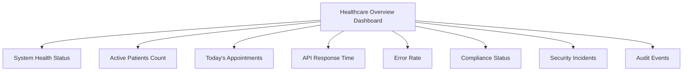
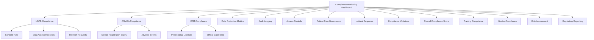
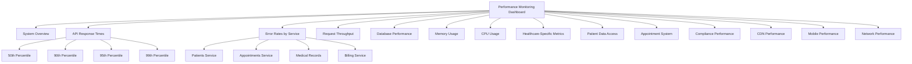

# Monitoring Dashboards

<cite>
**Referenced Files in This Document **   
- [healthcare-overview.json](file://tools/monitoring/dashboards/healthcare-overview.json)
- [compliance-monitoring.json](file://tools/monitoring/dashboards/compliance-monitoring.json)
- [performance-monitoring.json](file://tools/monitoring/dashboards/performance-monitoring.json)
</cite>

## Table of Contents
1. [Introduction](#introduction)
2. [Healthcare Overview Dashboard](#healthcare-overview-dashboard)
3. [Compliance Monitoring Dashboard](#compliance-monitoring-dashboard)
4. [Performance Monitoring Dashboard](#performance-monitoring-dashboard)
5. [Dashboard Configuration and Implementation](#dashboard-configuration-and-implementation)
6. [Data Source Integration](#data-source-integration)
7. [Real-Time Update Mechanisms](#real-time-update-mechanisms)
8. [Relationship with API Layer Monitoring Services](#relationship-with-api-layer-monitoring-services)
9. [Common Issues and Solutions](#common-issues-and-solutions)
10. [Creating Custom Dashboards](#creating-custom-dashboards)

## Introduction
The NeonPro Healthcare Platform utilizes a comprehensive monitoring system to ensure optimal performance, regulatory compliance, and operational efficiency for aesthetic clinics. This document details the implementation and configuration of three core JSON-based dashboards: healthcare-overview, compliance-monitoring, and performance-monitoring. These dashboards provide real-time visualization of critical metrics essential for clinical operations, including patient throughput, compliance status, and system performance. The dashboards are configured using Grafana-compatible JSON structures that define panels, data queries, visualizations, and update intervals.

## Healthcare Overview Dashboard
The healthcare-overview dashboard provides a high-level summary of the platform's health and key operational metrics. It displays system health status for web, API, and database services using UP/DOWN indicators with color-coded thresholds. Key patient metrics include active patient count and today's appointments (both scheduled and completed). The dashboard also monitors API response times through percentile-based quantiles (50th and 95th) and tracks error rates across the system. Compliance status is displayed for major Brazilian healthcare regulations including LGPD, ANVISA, and CFM. Security incidents and audit events are monitored to ensure data protection and regulatory adherence. This dashboard serves as the primary operational view for clinic administrators and technical staff.

**Diagram sources**
- [healthcare-overview.json](file://tools/monitoring/dashboards/healthcare-overview.json)

**Section sources**
- [healthcare-overview.json](file://tools/monitoring/dashboards/healthcare-overview.json)

## Compliance Monitoring Dashboard
The compliance-monitoring dashboard offers detailed tracking of regulatory requirements specific to healthcare operations in Brazil. It features a comprehensive overview of compliance status for LGPD (data protection), ANVISA (medical devices and pharmaceuticals), and CFM (medical professionals). The dashboard includes specialized sections for each regulatory framework, displaying metrics such as consent rates, adverse event reporting, professional license validity, and continuing education completion. Additional panels monitor data protection measures, audit logging effectiveness, access control compliance, and incident response capabilities. A bar chart visualizes compliance violations by type, while a gauge displays the overall compliance score. The dashboard also tracks training completion rates, third-party vendor compliance, and regulatory reporting status to ensure comprehensive governance.

**Diagram sources**
- [compliance-monitoring.json](file://tools/monitoring/dashboards/compliance-monitoring.json)

**Section sources**
- [compliance-monitoring.json](file://tools/monitoring/dashboards/compliance-monitoring.json)

## Performance Monitoring Dashboard
The performance-monitoring dashboard focuses on system health and technical performance metrics critical for maintaining reliable service delivery. It begins with an overview of system components (web server, API server, database) showing their operational status. Detailed performance metrics include API response times across multiple percentiles (50th, 90th, 95th, 99th), error rates segmented by service (patients, appointments, medical records, billing), and request throughput by HTTP method. Infrastructure performance is monitored through database query durations, connection counts, memory usage, and CPU utilization. The dashboard also includes healthcare-specific operational metrics such as patient data access patterns, appointment system performance, and compliance system processing times. Additional panels track CDN performance, mobile application metrics, and network traffic to ensure optimal user experience across all platforms.

**Diagram sources**
- [performance-monitoring.json](file://tools/monitoring/dashboards/performance-monitoring.json)

**Section sources**
- [performance-monitoring.json](file://tools/monitoring/dashboards/performance-monitoring.json)

## Dashboard Configuration and Implementation
The dashboards are implemented as JSON configuration files that follow Grafana's dashboard schema. Each dashboard contains metadata including ID, title, description, tags, timezone, and refresh interval. The core component is the "panels" array, which defines individual visualization widgets with unique IDs, titles, types, and grid positioning. Panel types include stat (for single-value displays), timeseries (for line charts), barchart, gauge, and table. Field configurations specify units, color thresholds, and value mappings to enhance readability. For example, binary states (UP/DOWN, COMPLIANT/NON-COMPLIANT) use value mappings to display meaningful text instead of numeric values. The healthcare-overview dashboard refreshes every 30 seconds, while compliance-monitoring updates every 5 minutes due to the nature of compliance data. All dashboards are configured for the America/Sao_Paulo timezone to align with the primary user base.

**Section sources**
- [healthcare-overview.json](file://tools/monitoring/dashboards/healthcare-overview.json)
- [compliance-monitoring.json](file://tools/monitoring/dashboards/compliance-monitoring.json)
- [performance-monitoring.json](file://tools/monitoring/dashboards/performance-monitoring.json)

## Data Source Integration
Each dashboard panel integrates with backend monitoring services through Prometheus-style metric queries. The dashboards rely on a standardized metric naming convention prefixed with "neonpro_" followed by the domain and specific measurement. For example, patient-related metrics use prefixes like "neonpro_patients_active_total" while API performance metrics use "neonpro_api_request_duration_seconds_bucket". The integration uses PromQL (Prometheus Query Language) expressions to retrieve and transform data. Statistical functions like "rate()" calculate per-second increases over time windows, while "histogram_quantile()" extracts percentile values from histogram buckets. The compliance-monitoring dashboard includes templating variables that allow users to filter by compliance framework, enhancing flexibility. Annotations are configured to display alerts and events directly on time series graphs, providing context for performance anomalies.

**Section sources**
- [healthcare-overview.json](file://tools/monitoring/dashboards/healthcare-overview.json)
- [compliance-monitoring.json](file://tools/monitoring/dashboards/compliance-monitoring.json)
- [performance-monitoring.json](file://tools/monitoring/dashboards/performance-monitoring.json)

## Real-Time Update Mechanisms
The dashboards implement real-time monitoring through automated refresh cycles and streaming data updates. The healthcare-overview and performance-monitoring dashboards are configured to refresh every 30 seconds, ensuring near real-time visibility into system operations. The compliance-monitoring dashboard has a longer refresh interval of 5 minutes, appropriate for compliance metrics that don't require second-by-second updates. Time ranges are set appropriately for each use case: "now-1h" for operational dashboards and "now-24h" for compliance trends. The underlying monitoring infrastructure collects metrics at regular intervals from various system components and exposes them via HTTP endpoints that are scraped by the monitoring server. This pull-based model ensures consistent data collection without overwhelming the monitored services. The real-time nature of these dashboards enables proactive issue detection and rapid response to emerging problems.

**Section sources**
- [healthcare-overview.json](file://tools/monitoring/dashboards/healthcare-overview.json)
- [compliance-monitoring.json](file://tools/monitoring/dashboards/compliance-monitoring.json)
- [performance-monitoring.json](file://tools/monitoring/dashboards/performance-monitoring.json)

## Relationship with API Layer Monitoring Services
The dashboard metrics are directly sourced from monitoring services implemented in the API layer. These services expose metrics endpoints that follow the OpenMetrics standard, allowing seamless integration with the monitoring stack. The API layer instruments key operations to collect timing data, error counts, and business metrics, which are then aggregated and exposed for dashboard consumption. Middleware components in the API routes capture request duration, status codes, and other telemetry data automatically. Specialized services handle domain-specific metrics collection, such as patient throughput tracking in the appointments service or compliance checks in the governance service. The monitoring services use counters, gauges, and histograms to represent different types of metrics appropriately. This tight integration between the API layer and monitoring infrastructure ensures that dashboard data accurately reflects the actual system behavior and performance.

**Section sources**
- [healthcare-overview.json](file://tools/monitoring/dashboards/healthcare-overview.json)
- [compliance-monitoring.json](file://tools/monitoring/dashboards/compliance-monitoring.json)
- [performance-monitoring.json](file://tools/monitoring/dashboards/performance-monitoring.json)

## Common Issues and Solutions
A common challenge in dashboard design is metric overload, where too many metrics create information overload and reduce usability. The NeonPro dashboards address this through hierarchical organization, grouping related metrics into logical sections and using appropriate visualization types. Role-based views could further mitigate this issue by showing only relevant metrics to different user roles (e.g., clinic administrators vs. compliance officers vs. technical staff). Another solution implemented is the use of threshold-based coloring and conditional formatting to highlight only anomalous values, allowing users to quickly identify issues. The dashboards also employ effective information hierarchy, placing the most critical metrics (system health, compliance status) prominently at the top. For complex compliance data, the use of summary statistics and trend indicators reduces cognitive load while still providing actionable insights. Regular review and refinement of dashboard content based on user feedback helps maintain relevance and prevent metric creep.

**Section sources**
- [healthcare-overview.json](file://tools/monitoring/dashboards/healthcare-overview.json)
- [compliance-monitoring.json](file://tools/monitoring/dashboards/compliance-monitoring.json)
- [performance-monitoring.json](file://tools/monitoring/dashboards/performance-monitoring.json)

## Creating Custom Dashboards
Developers can create custom dashboards for specialized clinical workflows by following the established JSON configuration pattern. The process begins with identifying the key metrics relevant to the specific workflow, such as treatment planning efficiency or inventory management for cosmetic products. Developers should leverage existing metrics exposed by the API layer when possible, or implement new instrumentation in the relevant services. The JSON structure should follow the same schema as the existing dashboards, with proper panel sizing and positioning for optimal layout. Custom dashboards can incorporate templating variables to enable dynamic filtering by clinic, practitioner, or time period. When designing visualizations, developers should choose appropriate panel types based on the data characteristics and user needs. Testing the dashboard with real data volumes ensures performance remains acceptable. Finally, documentation of the dashboard's purpose and metric definitions helps ensure proper interpretation by end users.

**Section sources**
- [healthcare-overview.json](file://tools/monitoring/dashboards/healthcare-overview.json)
- [compliance-monitoring.json](file://tools/monitoring/dashboards/compliance-monitoring.json)
- [performance-monitoring.json](file://tools/monitoring/dashboards/performance-monitoring.json)