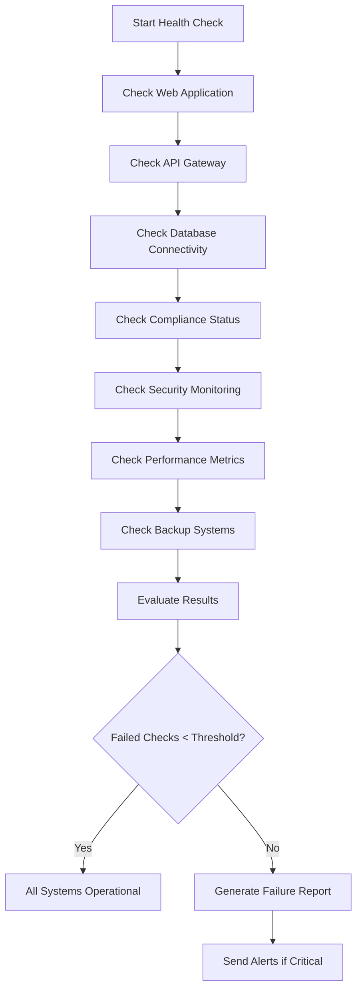
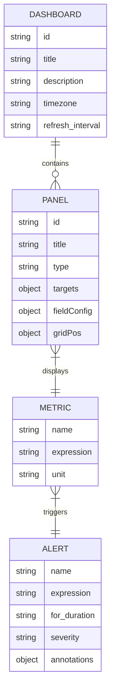
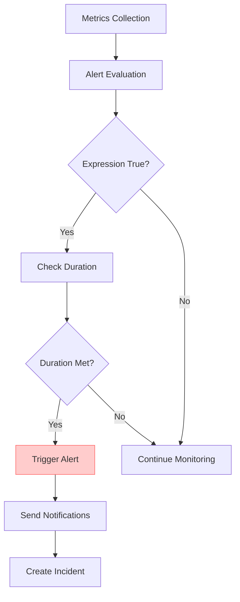
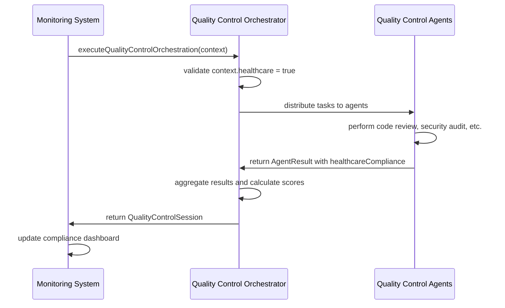
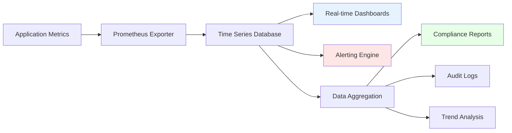
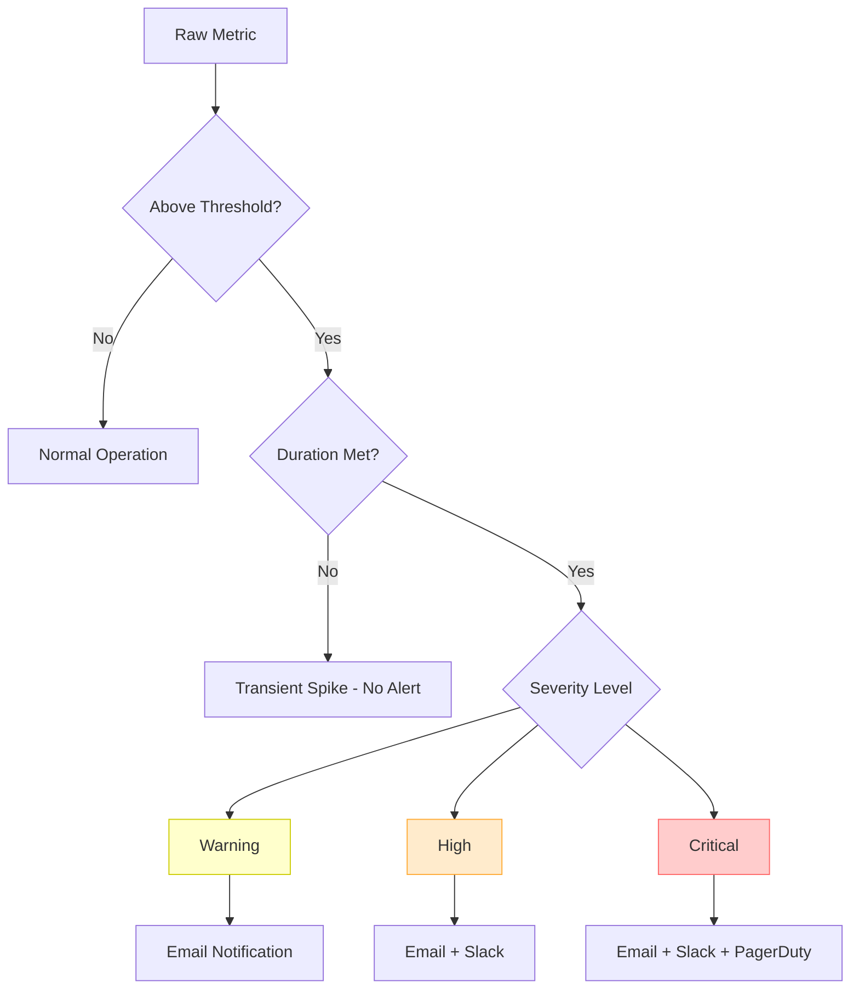
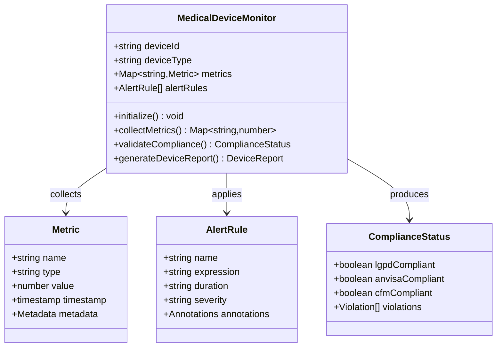

# Monitoring Systems

<cite>
**Referenced Files in This Document**
- [healthcare-overview.json](file://tools/monitoring/dashboards/healthcare-overview.json)
- [healthcare-alerts.json](file://tools/monitoring/alerts/healthcare-alerts.json)
- [health-check.sh](file://tools/monitoring/scripts/health-check.sh)
- [compliance-validator.sh](file://tools/monitoring/scripts/compliance-validator.sh)
- [quality-control-orchestrator.ts](file://tools/orchestration/src/quality-control-orchestrator.ts)
- [monitoring.ts](file://tools/quality/src/orchestrator/integrations/monitoring.ts)
- [metrics.ts](file://apps/api/src/services/metrics.ts)
- [healthcare-governance.service.ts](file://packages/governance/src/services/healthcare-governance.service.ts)
</cite>

## Table of Contents

1. [Monitoring Systems Overview](#monitoring-systems-overview)
2. [Operational Monitoring Implementation](#operational-monitoring-implementation)
3. [Healthcare Dashboard Visualization](#healthcare-dashboard-visualization)
4. [Alert Configuration and Compliance Violations](#alert-configuration-and-compliance-violations)
5. [Integration with Quality Control Orchestrator](#integration-with-quality-control-orchestrator)
6. [Real-time Monitoring and Long-term Reporting](#real-time-monitoring-and-long-term-reporting)
7. [Addressing Alert Fatigue](#addressing-alert-fatigue)
8. [Extending Monitoring for Medical Device Integration](#extending-monitoring-for-medical-device-integration)

## Monitoring Systems Overview

The NeonPro Healthcare Platform employs a comprehensive monitoring system designed to ensure operational excellence, regulatory compliance, and patient safety across aesthetic clinics. The monitoring architecture combines real-time dashboards, automated alerting, health check scripts, and compliance validation to provide complete visibility into system performance and healthcare regulatory adherence.

The monitoring ecosystem is built around three core components: JSON-based dashboards for visualization, declarative alert configurations for proactive issue detection, and shell scripts for comprehensive health validation. These components work together to monitor critical healthcare metrics while ensuring compliance with Brazilian regulations including LGPD (data protection), ANVISA (medical devices), and CFM (medical practice).

This documentation provides detailed insights into the implementation of these monitoring systems, their integration with quality control processes, and strategies for effective healthcare monitoring in clinical environments.

**Section sources**

- [healthcare-overview.json](file://tools/monitoring/dashboards/healthcare-overview.json)
- [healthcare-alerts.json](file://tools/monitoring/alerts/healthcare-alerts.json)
- [health-check.sh](file://tools/monitoring/scripts/health-check.sh)

## Operational Monitoring Implementation

The operational monitoring system implements a multi-layered approach to ensure continuous visibility into platform health and performance. At its foundation are JSON dashboard configurations and shell-based health check scripts that provide both real-time monitoring and scheduled validation capabilities.

The `health-check.sh` script serves as the primary health validation tool, performing comprehensive checks across all critical system components. This bash script evaluates web application availability, API gateway responsiveness, database connectivity, compliance status, security monitoring, performance metrics, and backup system integrity. The script uses curl to test HTTP endpoints with configurable timeout settings and jq for parsing JSON responses from health check APIs.

**Diagram sources**

- [health-check.sh](file://tools/monitoring/scripts/health-check.sh#L100-L300)

The monitoring system also includes the `compliance-validator.sh` script, which specifically validates adherence to healthcare regulations. This script performs targeted checks for LGPD data protection requirements, ANVISA medical device regulations, and CFM professional standards. It calls dedicated API endpoints to verify consent management, data retention policies, medical device registration, quality management systems, and professional licensure verification.

Both scripts implement standardized logging with color-coded output for different severity levels (INFO, WARNING, ERROR) and write comprehensive logs to `/var/log/neonpro/`. The health check script includes configurable thresholds for alerting, with a default threshold of 3 failed checks triggering critical alerts to on-call teams.

**Section sources**

- [health-check.sh](file://tools/monitoring/scripts/health-check.sh)
- [compliance-validator.sh](file://tools/monitoring/scripts/compliance-validator.sh)

## Healthcare Dashboard Visualization

The healthcare-overview dashboard provides a comprehensive visual representation of key metrics for aesthetic clinics, enabling clinical staff and administrators to monitor platform performance and compliance status at a glance. Implemented as a JSON configuration file (`healthcare-overview.json`), this dashboard integrates with monitoring tools like Grafana to display real-time system health and operational metrics.

The dashboard organizes information into eight key panels that cover system health, patient metrics, appointment scheduling, API performance, compliance status, security incidents, and audit activity. Each panel is configured with appropriate visualization types, thresholds, and refresh intervals to provide actionable insights.

**Diagram sources**

- [healthcare-overview.json](file://tools/monitoring/dashboards/healthcare-overview.json)
- [healthcare-alerts.json](file://tools/monitoring/alerts/healthcare-alerts.json)

Key dashboard panels include:

- **System Health Status**: Displays the UP/DOWN status of web server, API server, and database components using green/red indicators based on Prometheus `up{}` metric queries
- **Active Patients**: Shows the total number of active patients with threshold-based coloring (green <1000, yellow 1000-5000, red >5000)
- **Today's Appointments**: Tracks scheduled and completed appointments to monitor clinic workflow efficiency
- **API Response Time**: Visualizes 95th and 50th percentile response times to identify performance degradation
- **Compliance Status**: Monitors LGPD, ANVISA, and CFM compliance with binary COMPLIANT/NON-COMPLIANT indicators
- **Security Incidents**: Tracks data breaches and security events over the last 24 hours
- **Audit Events**: Monitors the rate of audit log entries to ensure proper logging functionality

The dashboard automatically refreshes every 30 seconds and displays data from the last hour by default, providing near real-time visibility into system operations. Panel layouts are optimized for quick assessment, with critical system health and compliance indicators positioned in the top row for immediate visibility.

**Section sources**

- [healthcare-overview.json](file://tools/monitoring/dashboards/healthcare-overview.json)

## Alert Configuration and Compliance Violations

The monitoring system implements a sophisticated alerting framework through the `healthcare-alerts.json` configuration file, which defines rules for detecting and responding to operational issues and compliance violations. These alerts are designed to balance sensitivity with specificity, ensuring critical issues are identified promptly while minimizing false positives in healthcare environments.

The alert configuration includes ten distinct alert rules categorized by severity (critical, high, warning) and healthcare impact. Each alert specifies an expression (Prometheus query), evaluation duration, severity level, component affected, and detailed annotations with summary and description templates.

**Diagram sources**

- [healthcare-alerts.json](file://tools/monitoring/alerts/healthcare-alerts.json#L1-L150)

Critical alerts include:

- **HighErrorRate**: Triggers when API error rate exceeds 0.1 errors per second for 5 minutes, indicating potential service disruption
- **DatabaseConnectionFailure**: Activates immediately when database becomes inaccessible, affecting all patient data access
- **PatientDataBreach**: Detects any security incidents in the last hour, requiring immediate investigation for LGPD compliance
- **BackupFailure**: Alerts after 1 hour of failed backups, impacting ANVISA compliance for medical record retention
- **ComplianceViolation**: Triggers immediately when any compliance violations are detected

Each alert includes rich metadata that enhances incident response:

- **Severity levels** (critical, high, warning) to prioritize response
- **Component tags** to identify affected system areas
- **Healthcare impact assessments** to understand clinical implications
- **Compliance framework associations** (LGPD, ANVISA, CFM)
- **Runbook URLs** linking to detailed resolution procedures

For example, the PatientDataBreach alert includes the annotation "Potential patient data breach detected" with a description template that incorporates the measured value and emphasizes the need for immediate LGPD compliance investigation. This contextual information helps on-call personnel understand both the technical issue and its regulatory implications.

The alerting system also considers healthcare-specific requirements by including compliance-focused alerts that monitor regulatory obligations such as audit logging (AuditLogFailure alert) and data retention (BackupFailure alert). These alerts help ensure continuous compliance with Brazilian healthcare regulations.

**Section sources**

- [healthcare-alerts.json](file://tools/monitoring/alerts/healthcare-alerts.json)

## Integration with Quality Control Orchestrator

The monitoring system is tightly integrated with the quality control orchestrator, creating a feedback loop between operational monitoring and development quality processes. This integration enables automatic quality control workflows to be triggered by monitoring events, ensuring that performance issues and compliance violations are addressed systematically.

The `QualityControlOrchestrator` class in `quality-control-orchestrator.ts` accepts a `QualityControlContext` that can include healthcare compliance requirements. When monitoring detects issues that require deeper investigation, it can initiate quality control orchestration with specific parameters targeting the affected area.

**Diagram sources**

- [quality-control-orchestrator.ts](file://tools/orchestration/src/quality-control-orchestrator.ts#L1-L79)
- [monitoring.ts](file://tools/quality/src/orchestrator/integrations/monitoring.ts)

The integration works through several mechanisms:

1. **Context Propagation**: The `QualityControlContext` interface includes a `healthcare` boolean flag that, when set to true, activates healthcare-specific compliance checks during quality control execution.

2. **Metrics Collection**: The `OrchestrationMonitoring` class collects detailed metrics about orchestration performance, including phase durations, agent execution times, and quality gate results, which feed back into monitoring dashboards.

3. **Compliance Validation**: The orchestrator's `executeQualityControlOrchestration` method returns a `QualityControlSession` that includes a `healthcareCompliance` object tracking LGPD, ANVISA, and CFM compliance status.

4. **Performance Analytics**: The orchestrator generates performance analytics including throughput and utilization metrics that can trigger scaling decisions in the monitoring system.

When a compliance violation is detected by monitoring, the system can initiate a quality control orchestration with healthcare context enabled. This triggers specialized agents to perform deeper analysis of code, configuration, and data handling practices to identify root causes and recommend remediation steps.

The integration also works in reverse - quality control results influence monitoring thresholds and alert configurations. For example, if code reviews consistently identify performance bottlenecks, the monitoring system may adjust its slow response time thresholds accordingly.

**Section sources**

- [quality-control-orchestrator.ts](file://tools/orchestration/src/quality-control-orchestrator.ts)
- [monitoring.ts](file://tools/quality/src/orchestrator/integrations/monitoring.ts)

## Real-time Monitoring and Long-term Reporting

The monitoring architecture bridges real-time operational oversight with long-term compliance reporting requirements through a coordinated system of metrics collection, aggregation, and historical analysis. This dual-purpose design ensures immediate issue detection while maintaining the audit trails necessary for regulatory compliance.

Real-time monitoring relies on Prometheus-style metrics exported by the application, including counters like `neonpro_api_errors_total`, gauges like `neonpro_disk_usage_percent`, and histograms like `neonpro_api_request_duration_seconds_bucket`. These metrics are scraped at regular intervals and used to power dashboards and alerting rules.

**Diagram sources**

- [metrics.ts](file://apps/api/src/services/metrics.ts)
- [healthcare-governance.service.ts](file://packages/governance/src/services/healthcare-governance.service.ts)

Long-term reporting is facilitated by the `HealthcareMetricsService` which aggregates metrics into compliance KPIs defined in the codebase. These include:

- LGPD Compliance Rate (target: 95%)
- CFM Validation Success Rate (target: 98%)
- ANVISA Procedure Compliance (target: 100%)
- Emergency Access Rate (target: ≤5%)

The service calculates an overall compliance score by weighting KPIs according to their compliance level (critical, high, medium, low). Critical violations, particularly those involving LGPD or ANVISA compliance, significantly impact the overall score and trigger immediate alerts.

Historical data is preserved to meet regulatory requirements:

- Audit logs are retained for minimum 3 years as required by LGPD
- Medical device operation records are maintained for 10+ years per ANVISA guidelines
- Patient safety metrics are archived with versioning for traceability
- Compliance reports are generated monthly and stored immutably

The system also implements trend analysis to identify gradual degradation that might not trigger immediate alerts but could lead to compliance issues over time. For example, a slowly decreasing LGPD consent rate might not violate thresholds immediately but would be flagged in monthly reports for proactive intervention.

This integration of real-time and historical monitoring ensures that the platform maintains continuous compliance while providing actionable insights for both immediate response and strategic improvement.

**Section sources**

- [metrics.ts](file://apps/api/src/services/metrics.ts)
- [healthcare-governance.service.ts](file://packages/governance/src/services/healthcare-governance.service.ts)

## Addressing Alert Fatigue

The monitoring system incorporates several strategies to prevent alert fatigue in healthcare environments, where excessive notifications can lead to desensitization and missed critical issues. These strategies focus on intelligent thresholding, escalation policies, and contextual prioritization to ensure alerts remain meaningful and actionable.

Intelligent thresholding is implemented through multiple mechanisms:

1. **Duration Requirements**: Most alerts require sustained conditions before triggering (e.g., HighErrorRate requires 5 minutes of elevated errors rather than momentary spikes)

2. **Tiered Severity Levels**: Different thresholds exist for warning vs. critical alerts, allowing graduated response

3. **Healthcare Impact Assessment**: Alerts are tagged with healthcare impact levels (critical, high, medium) to prioritize response based on clinical significance

**Diagram sources**

- [healthcare-alerts.json](file://tools/monitoring/alerts/healthcare-alerts.json)
- [config/vercel/monitoring-config.ts](file://config/vercel/monitoring-config.ts)

Escalation policies are designed to match healthcare operational realities:

- **Critical alerts** (database failure, data breach) notify on-call personnel through multiple channels (email, Slack, PagerDuty) with immediate response expected
- **High severity alerts** (appointment system failures) use email and Slack with response required within 15 minutes
- **Warning alerts** (low disk space, slow API) generate email notifications for daytime follow-up

The system also implements alert grouping and deduplication to prevent notification storms. Related alerts are correlated and presented as consolidated incidents rather than individual notifications. For example, a database outage might trigger multiple dependent service failures, but these are grouped under a single incident report.

Additional anti-fatigue measures include:

- **Business hour filtering**: Non-critical alerts are suppressed during nighttime hours unless they reach critical severity
- **Maintenance mode**: Scheduled maintenance periods suppress expected alerts
- **Auto-resolution**: Some alerts automatically resolve when conditions return to normal
- **Contextual runbooks**: Every alert includes links to specific runbooks with step-by-step resolution procedures

These strategies ensure that healthcare staff receive timely notifications about genuinely important issues without being overwhelmed by less critical alerts, maintaining vigilance for patient safety and regulatory compliance.

**Section sources**

- [healthcare-alerts.json](file://tools/monitoring/alerts/healthcare-alerts.json)
- [config/vercel/monitoring-config.ts](file://config/vercel/monitoring-config.ts)

## Extending Monitoring for Medical Device Integration

The monitoring architecture is designed to be extensible for new medical device integrations through a combination of standardized interfaces, configurable alert rules, and modular dashboard components. This flexibility allows the system to accommodate diverse medical devices while maintaining consistent monitoring and compliance standards.

The extension process follows a structured approach:

1. **Device Registration**: New medical devices are registered in the system with metadata including device type, manufacturer, model, and regulatory classification.

2. **Metric Definition**: Specific metrics are defined for each device type, following the pattern established in the `HealthcareMetricType` enum. Common metrics include connection status, data transmission rate, error count, and calibration status.

3. **Dashboard Integration**: New dashboard panels can be added to existing views or created as device-specific dashboards using the same JSON configuration format as the healthcare-overview dashboard.

4. **Alert Configuration**: Custom alert rules are defined in the healthcare-alerts.json format, with expressions tailored to the device's operational characteristics.

**Diagram sources**

- [healthcare-overview.json](file://tools/monitoring/dashboards/healthcare-overview.json)
- [healthcare-alerts.json](file://tools/monitoring/alerts/healthcare-alerts.json)

Key extension points include:

- **Custom Health Checks**: The `health-check.sh` script can be extended with device-specific health check functions that validate connectivity, calibration status, and data transmission.

- **ANVISA Compliance Validation**: The `compliance-validator.sh` script includes specific checks for medical device registration and quality management systems that can be adapted for new devices.

- **Performance Monitoring**: The monitoring infrastructure supports custom performance metrics collection for device-specific characteristics like image acquisition time or treatment delivery accuracy.

- **Alert Escalation**: Device-related alerts can be configured with appropriate escalation policies based on clinical impact, with life-critical devices receiving highest priority.

When integrating a new aesthetic medical device (such as laser systems or imaging equipment), developers would:

1. Define device-specific metrics in the monitoring schema
2. Create dashboard panels to visualize device status and performance
3. Configure alert rules for critical failure modes
4. Implement health check procedures in the monitoring scripts
5. Update compliance validation to include device-specific regulatory requirements
6. Integrate with the quality control orchestrator for automated validation

This extensible design ensures that new medical device integrations maintain the same high standards of monitoring, reliability, and compliance as the core platform, protecting patient safety while enabling innovation in aesthetic treatments.

**Section sources**

- [health-check.sh](file://tools/monitoring/scripts/health-check.sh)
- [compliance-validator.sh](file://tools/monitoring/scripts/compliance-validator.sh)
- [healthcare-overview.json](file://tools/monitoring/dashboards/healthcare-overview.json)
- [healthcare-alerts.json](file://tools/monitoring/alerts/healthcare-alerts.json)
