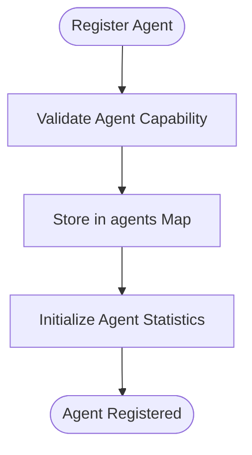
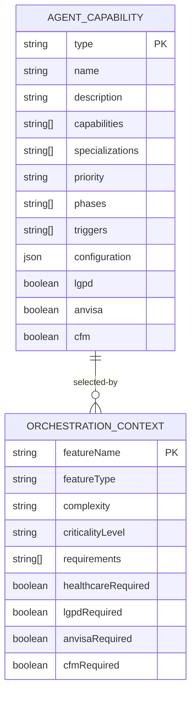
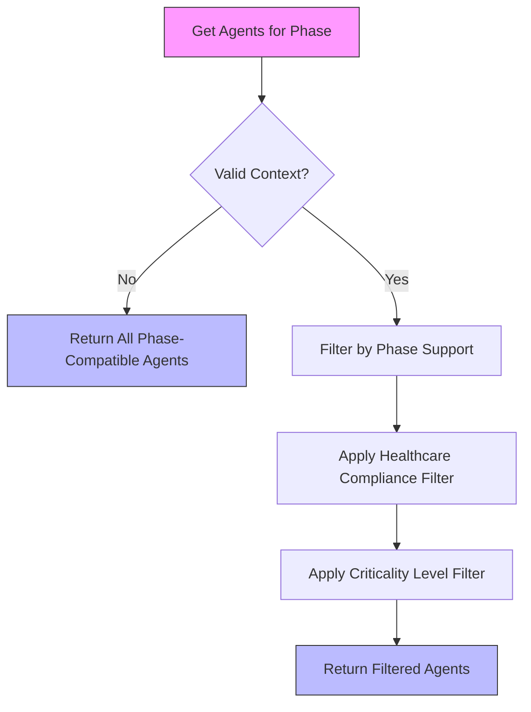
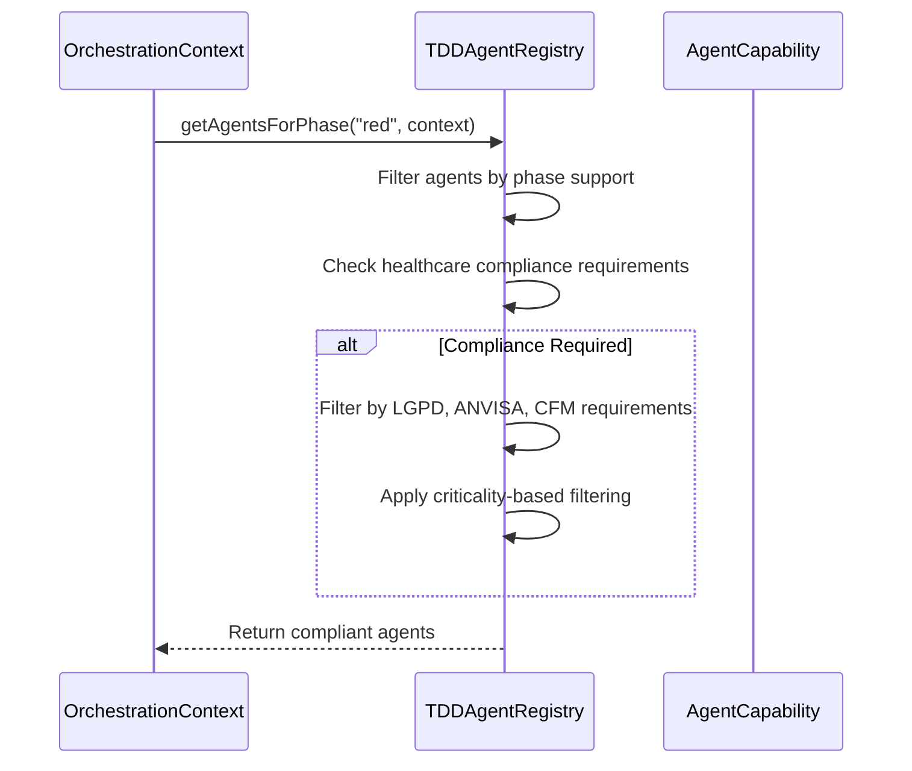
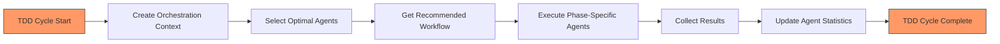
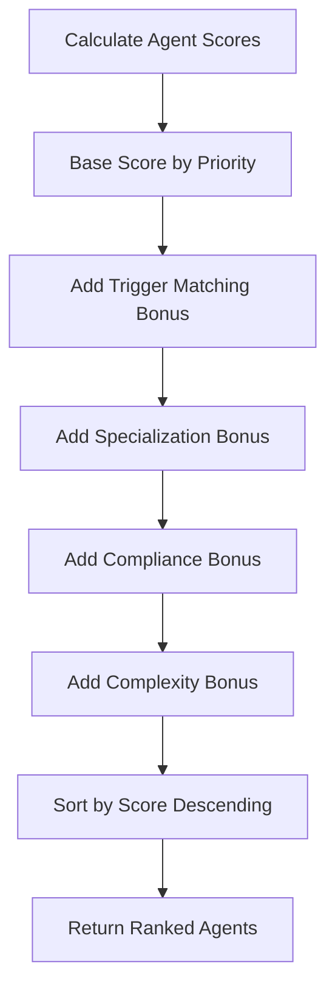
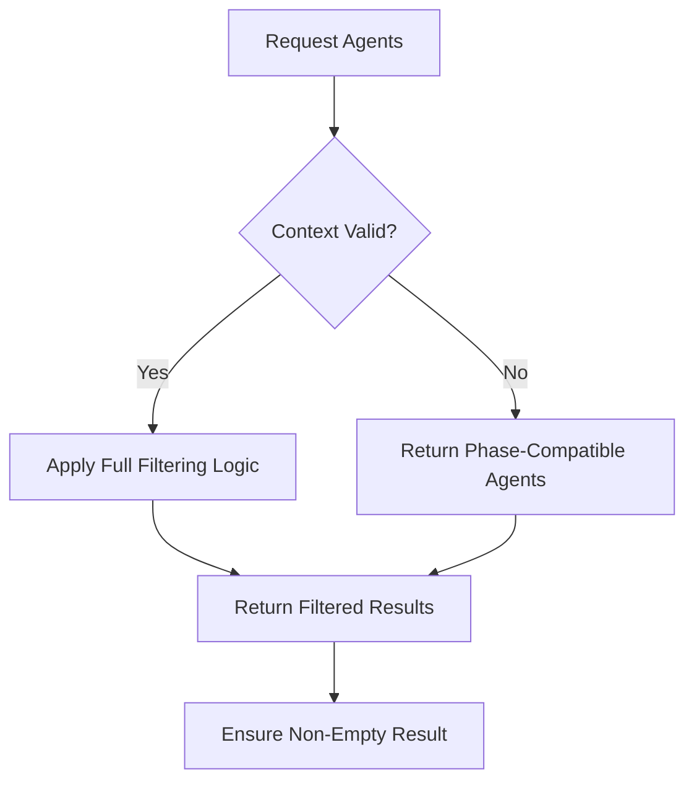

# Agent Registry

<cite>
**Referenced Files in This Document **
- [agent-registry.ts](file://tools/orchestration/src/agent-registry.ts)
- [agent-registry.test.ts](file://tools/orchestration/__tests__/agent-registry.test.ts)
- [types.ts](file://tools/orchestration/types.ts)
</cite>

## Table of Contents

1. [Introduction](#introduction)
2. [Core Architecture](#core-architecture)
3. [Agent Discovery and Registration](#agent-discovery-and-registration)
4. [Capability Management](#capability-management)
5. [TDD Phase-Based Agent Selection](#tdd-phase-based-agent-selection)
6. [Healthcare Compliance Integration](#healthcare-compliance-integration)
7. [Orchestration System Integration](#orchestration-system-integration)
8. [Fallback Mechanisms and Dynamic Loading](#fallback-mechanisms-and-dynamic-loading)
9. [Extending the Registry with Custom Agents](#extending-the-registry-with-custom-agents)
10. [Common Issues and Solutions](#common-issues-and-solutions)

## Introduction

The Agent Registry is a central component responsible for managing AI agents within the TDD (Test-Driven Development) workflow. It provides agent discovery, capability management, and intelligent selection based on development phase (red, green, refactor) and contextual requirements such as healthcare compliance. The registry serves as the backbone for coordinating quality checks across multiple tools and ensures appropriate agents are selected for each stage of development.

**Section sources**

- [agent-registry.ts](file://tools/orchestration/src/agent-registry.ts#L1-L50)

## Core Architecture

The Agent Registry implements a centralized pattern for managing agent lifecycle and capabilities. At its core, it maintains two primary data structures: a Map of registered agents indexed by their type, and a corresponding Map tracking performance statistics for each agent.

```mermaid
classDiagram
class TDDAgentRegistry {
-agents : Map<AgentType, AgentCapability>
-agentStats : Map<AgentType, AgentStats>
+registerAgent(agent : AgentCapability) : void
+getAgentsForPhase(phase : TDDPhase, context : OrchestrationContext) : AgentCapability[]
+selectOptimalAgents(context : OrchestrationContext) : AgentCapability[]
+getRecommendedWorkflow(context : OrchestrationContext) : AgentType[]
}
class AgentCapability {
+type : AgentType
+name : string
+description : string
+capabilities : string[]
+specializations : string[]
+priority : "primary"|"secondary"|"tertiary"
+phases : TDDPhase[]
+triggers : string[]
+configuration : Record<string, any>
+healthcareCompliance? : {lgpd : boolean, anvisa : boolean, cfm : boolean}
}
class OrchestrationContext {
+featureName : string
+featureType : string
+complexity : "low"|"medium"|"high"
+criticalityLevel : "low"|"medium"|"high"|"critical"
+requirements : string[]
+healthcareCompliance : {required : boolean, lgpd : boolean, anvisa : boolean, cfm : boolean}
}
class AgentStats {
+executionCount : number
+successRate : number
+averageExecutionTime : number
+lastExecution : Date | null
}
TDDAgentRegistry --> AgentCapability : "manages"
TDDAgentRegistry --> AgentStats : "tracks"
```

**Diagram sources **

- [agent-registry.ts](file://tools/orchestration/src/agent-registry.ts#L182-L474)
- [agent-registry.ts](file://tools/orchestration/src/agent-registry.ts#L3-L18)
- [agent-registry.ts](file://tools/orchestration/src/agent-registry.ts#L23-L35)
- [agent-registry.ts](file://tools/orchestration/src/agent-registry.ts#L57-L62)

**Section sources**

- [agent-registry.ts](file://tools/orchestration/src/agent-registry.ts#L182-L474)

## Agent Discovery and Registration

The Agent Registry supports dynamic agent registration and discovery through a straightforward API. Agents are registered with comprehensive metadata that enables intelligent selection based on various criteria.

### Registration Process

Agents are registered using the `registerAgent` method, which stores both capability information and initializes performance statistics:



The registry comes pre-configured with default agents for common TDD roles including test coordination, code review, architecture analysis, and security auditing. These defaults ensure immediate functionality while allowing customization.

**Section sources**

- [agent-registry.ts](file://tools/orchestration/src/agent-registry.ts#L200-L230)
- [agent-registry.ts](file://tools/orchestration/src/agent-registry.ts#L182-L190)

## Capability Management

The Agent Registry employs a rich capability model that enables fine-grained agent selection based on multiple dimensions including functional capabilities, specializations, priority levels, and phase compatibility.

### Agent Capability Model

Each agent is defined by the `AgentCapability` interface which includes:

- **Type**: Categorical classification of the agent
- **Capabilities**: Functional abilities the agent possesses
- **Specializations**: Domain-specific expertise areas
- **Priority**: Hierarchical importance (primary, secondary, tertiary)
- **Phases**: Compatible TDD phases (red, green, refactor)
- **Triggers**: Contextual keywords that activate the agent
- **Configuration**: Runtime configuration parameters
- **Healthcare Compliance**: Regulatory compliance flags (LGPD, ANVISA, CFM)

This multi-dimensional model allows the registry to make sophisticated selection decisions based on complex requirements.



**Diagram sources **

- [agent-registry.ts](file://tools/orchestration/src/agent-registry.ts#L3-L18)
- [agent-registry.ts](file://tools/orchestration/src/agent-registry.ts#L23-L35)

**Section sources**

- [agent-registry.ts](file://tools/orchestration/src/agent-registry.ts#L3-L18)

## TDD Phase-Based Agent Selection

The registry provides specialized methods for selecting agents appropriate to specific TDD phases, ensuring the right tools are applied at each stage of development.

### getAgentsForPhase Implementation

The `getAgentsForPhase` method implements a comprehensive filtering algorithm that considers both phase compatibility and contextual requirements:



The implementation handles edge cases gracefully, returning phase-compatible agents even when context is incomplete or invalid. For valid contexts, it applies multiple filters:

1. **Phase Compatibility**: Only agents supporting the requested phase are considered
2. **Healthcare Compliance**: Filters agents based on required regulatory standards
3. **Criticality Filtering**: Excludes tertiary agents for critical features

```typescript
[SPEC SYMBOL](file://tools/orchestration/src/agent-registry.ts#L246-L293)
```

**Section sources**

- [agent-registry.ts](file://tools/orchestration/src/agent-registry.ts#L246-L293)

## Healthcare Compliance Integration

The Agent Registry incorporates healthcare-specific compliance requirements into its selection logic, ensuring regulatory standards are met for sensitive medical applications.

### Compliance Framework

The registry supports three key Brazilian healthcare regulations:

- **LGPD**: General Data Protection Law
- **ANVISA**: National Health Surveillance Agency
- **CFM**: Federal Council of Medicine

These compliance requirements are integrated into both agent definitions and selection algorithms. Agents declare their compliance capabilities, while the orchestration context specifies required standards.

### Context-Aware Selection

When healthcare compliance is required, the registry applies strict filtering to ensure only compliant agents are selected. The selection process evaluates each agent's compliance profile against the requirements specified in the orchestration context.



**Diagram sources **

- [agent-registry.ts](file://tools/orchestration/src/agent-registry.ts#L246-L293)
- [agent-registry.ts](file://tools/orchestration/src/agent-registry.ts#L3-L18)

**Section sources**

- [agent-registry.ts](file://tools/orchestration/src/agent-registry.ts#L246-L293)

## Orchestration System Integration

The Agent Registry works in concert with the broader orchestration system to coordinate quality checks across multiple tools and phases.

### Workflow Coordination

The registry provides methods that integrate directly with the orchestration workflow:



The `getRecommendedWorkflow` method generates an optimal execution sequence based on feature characteristics:

```typescript
[SPEC SYMBOL](file://tools/orchestration/src/agent-registry.ts#L407-L424)
```

### Agent Scoring Algorithm

The `selectOptimalAgents` method employs a scoring algorithm that ranks agents based on relevance to the current context:



The scoring system weights different factors appropriately, with priority being the most significant factor followed by specialization and compliance matches.

```typescript
[SPEC SYMBOL](file://tools/orchestration/src/agent-registry.ts#L335-L393)
```

**Diagram sources **

- [agent-registry.ts](file://tools/orchestration/src/agent-registry.ts#L307-L330)
- [agent-registry.ts](file://tools/orchestration/src/agent-registry.ts#L335-L393)
- [agent-registry.ts](file://tools/orchestration/src/agent-registry.ts#L407-L424)

**Section sources**

- [agent-registry.ts](file://tools/orchestration/src/agent-registry.ts#L307-L330)
- [agent-registry.ts](file://tools/orchestration/src/agent-registry.ts#L335-L393)

## Fallback Mechanisms and Dynamic Loading

The Agent Registry incorporates robust fallback mechanisms to handle scenarios where expected agents are not available or configurations are missing.

### Graceful Degradation

The registry implements several fallback strategies:

1. **Context Validation**: When context is undefined or incomplete, the registry returns all agents compatible with the requested phase
2. **Default Agents**: A set of default agents is initialized at startup, ensuring basic functionality is always available
3. **Error Handling**: Methods include defensive programming to handle edge cases without failing



### Dynamic Agent Loading

While the current implementation focuses on registration, the architecture supports dynamic loading patterns. Custom agents can be loaded at runtime through the `registerAgent` method, enabling extension of capabilities without restarting the system.

**Section sources**

- [agent-registry.ts](file://tools/orchestration/src/agent-registry.ts#L246-L293)
- [agent-registry.ts](file://tools/orchestration/src/agent-registry.ts#L200-L230)

## Extending the Registry with Custom Agents

The Agent Registry is designed to be extensible, allowing developers to add custom agents for specialized compliance domains or unique project requirements.

### Custom Agent Registration

To extend the registry with custom agents, implement the `AgentCapability` interface and register the agent:

```typescript
[SPEC SYMBOL](file://tools/orchestration/src/agent-registry.ts#L222-L230)
```

Key considerations for custom agents:

- Define appropriate capabilities and specializations
- Set correct priority level based on importance
- Specify compatible TDD phases
- Include healthcare compliance flags if applicable
- Provide meaningful triggers for context-based activation

### Specialized Compliance Agents

For healthcare-specific domains, create agents with targeted compliance profiles. For example, a radiology compliance agent might emphasize ANVISA requirements, while a patient data agent would prioritize LGPD compliance.

**Section sources**

- [agent-registry.ts](file://tools/orchestration/src/agent-registry.ts#L222-L230)

## Common Issues and Solutions

This section addresses frequent challenges encountered when working with the Agent Registry, particularly in healthcare validation scenarios.

### Missing Agent Configurations

**Issue**: Healthcare-specific validation fails due to missing compliance agents.

**Solution**: Implement fallback to general-purpose agents while maintaining compliance requirements:

```typescript
// Ensure at least one compliant agent is available
const compliantAgents = registry.getAgentsForPhase(phase, context);
if (compliantAgents.length === 0 && context.healthcareCompliance.required) {
  // Fall back to default compliant agents
  return DEFAULT_AGENTS.filter(a =>
    a.phases.includes(phase)
    && a.healthcareCompliance?.lgpd
  );
}
```

### Dynamic Agent Loading Failures

**Issue**: Custom agents fail to load in specific environments.

**Solution**: Implement robust error handling and validation:

```typescript
try {
  registry.registerAgent(customAgent);
} catch (error) {
  console.warn('Failed to register agent, falling back to defaults:', error);
  // Continue with existing agents
}
```

### Performance Optimization

**Issue**: Agent selection becomes slow with many registered agents.

**Solution**: Cache results when appropriate and leverage the built-in statistics for performance monitoring:

```typescript
// Use getAgentStats to identify underperforming agents
const stats = registry.getAgentStats('security-auditor');
if (stats.averageExecutionTime > threshold) {
  // Consider alternative agents or optimization
}
```

**Section sources**

- [agent-registry.ts](file://tools/orchestration/src/agent-registry.ts#L246-L293)
- [agent-registry.ts](file://tools/orchestration/src/agent-registry.ts#L200-L230)
- [agent-registry.ts](file://tools/orchestration/src/agent-registry.ts#L445-L474)
