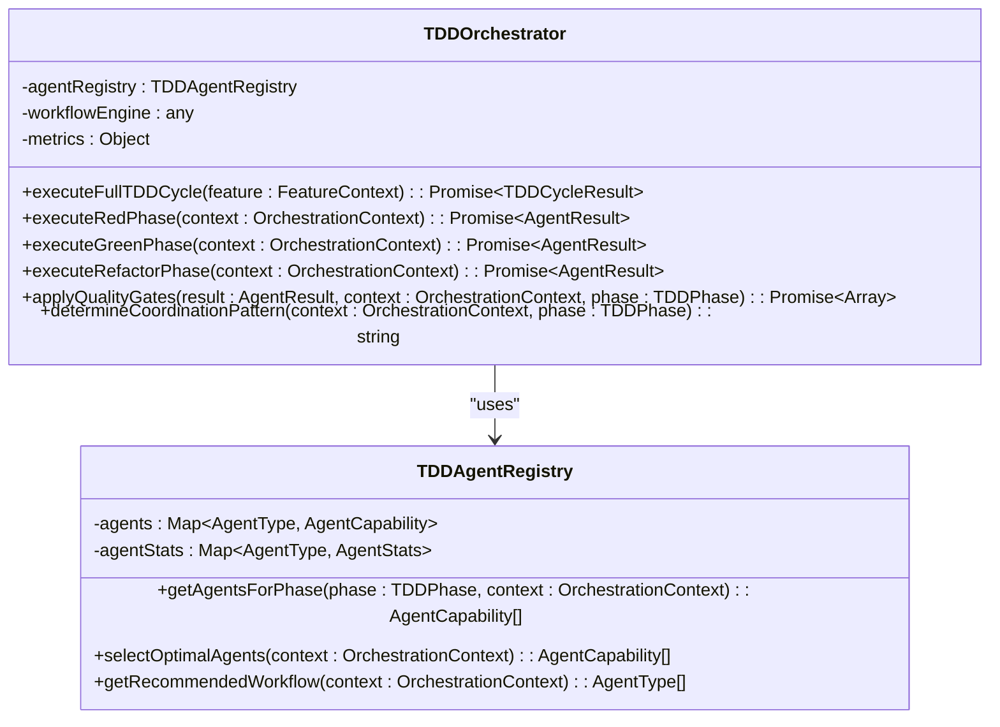
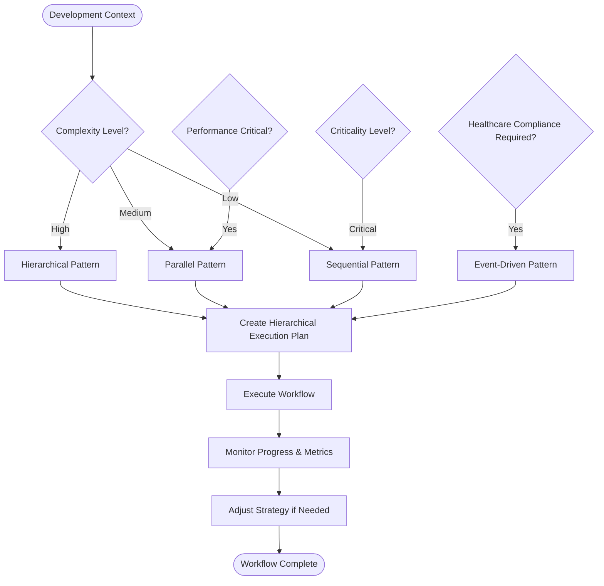
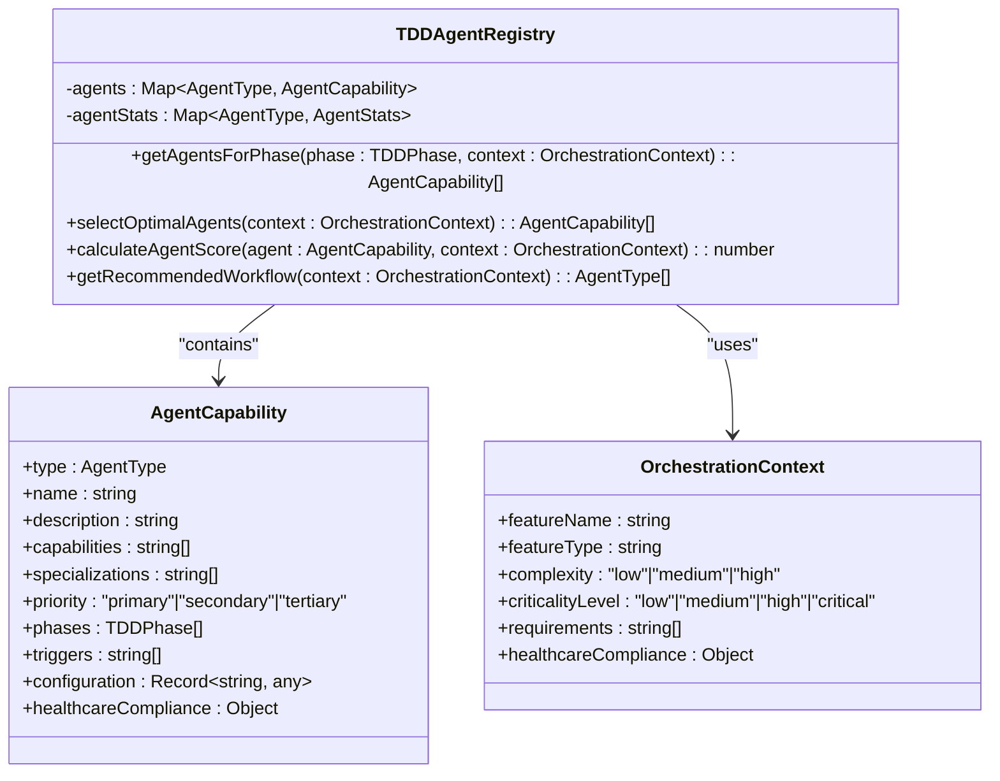
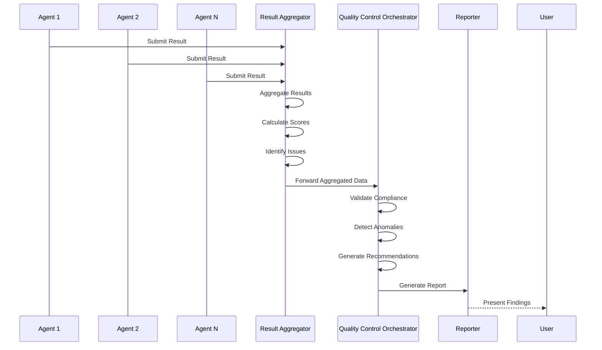
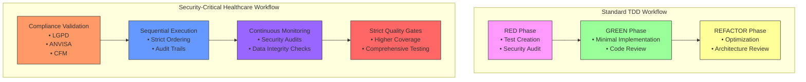
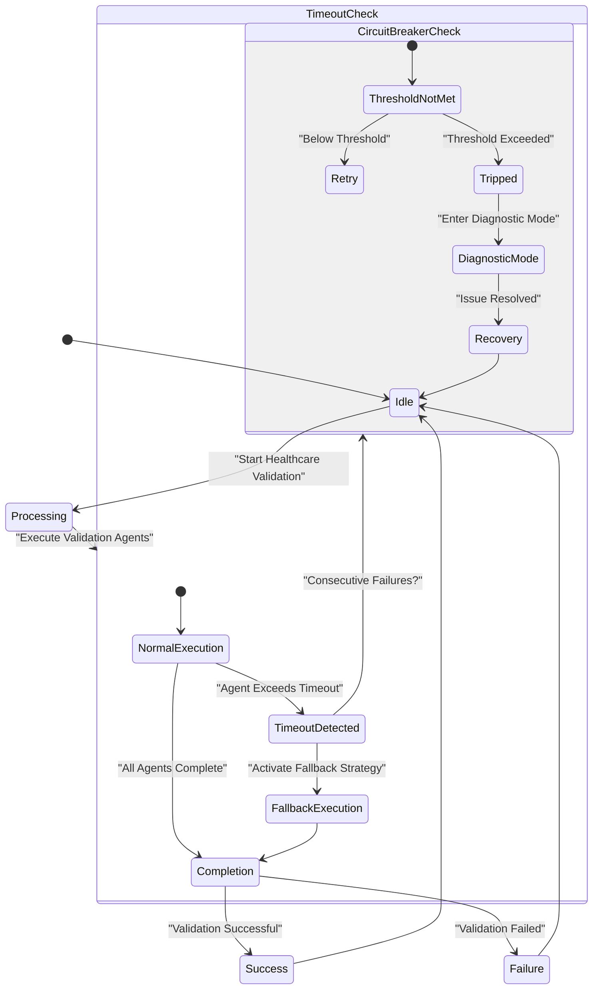

# Orchestration Framework

<cite>
**Referenced Files in This Document**
- [tdd-orchestrator.ts](file://tools/orchestration/src/tdd-orchestrator.ts)
- [workflow-engine.ts](file://tools/orchestration/src/workflow-engine.ts)
- [agent-registry.ts](file://tools/orchestration/src/agent-registry.ts)
- [execution-pattern-selector.ts](file://tools/orchestration/src/execution-pattern-selector.ts)
- [result-aggregator.ts](file://tools/orchestration/src/result-aggregator.ts)
- [quality-control-orchestrator.ts](file://tools/orchestration/src/quality-control-orchestrator.ts)
</cite>

## Table of Contents

1. [Introduction](#introduction)
2. [Core Components](#core-components)
3. [TDD Orchestrator Implementation](#tdd-orchestrator-implementation)
4. [Workflow Engine and Execution Patterns](#workflow-engine-and-execution-patterns)
5. [Agent Registry and Selection](#agent-registry-and-selection)
6. [Result Aggregation and Quality Control](#result-aggregation-and-quality-control)
7. [Concrete Workflow Examples](#concrete-workflow-examples)
8. [Healthcare Validation Scenarios and Deadlock Prevention](#healthcare-validation-scenarios-and-deadlock-prevention)
9. [Integration with Testing and Quality Tools](#integration-with-testing-and-quality-tools)
10. [Conclusion](#conclusion)

## Introduction

The Orchestration Framework is a sophisticated system designed to coordinate development processes through intelligent workflow management, agent coordination, and quality control. At its core, the framework implements a Test-Driven Development (TDD) orchestrator that manages the complete development lifecycle from test creation to implementation and refactoring. The system integrates a workflow engine that dynamically selects execution patterns based on project requirements, an agent registry that manages specialized development agents, and a result aggregator that consolidates outcomes across multiple quality checks.

This documentation provides comprehensive insight into how these components work together to streamline development workflows, particularly in complex domains like healthcare applications that require strict compliance with regulatory standards. The framework is designed to be accessible to beginners while offering sufficient technical depth for experienced developers who need to create custom workflows for new regulatory requirements or specialized development scenarios.

## Core Components

The orchestration framework consists of five primary components that work in concert to manage development workflows: the TDD Orchestrator, Workflow Engine, Agent Registry, Execution Pattern Selector, and Result Aggregator. These components form a cohesive system that coordinates development processes, selects appropriate execution strategies, manages specialized agents, and aggregates results across quality checks.

The TDD Orchestrator serves as the central coordinator, managing the complete TDD cycle through its three phases: RED (test creation), GREEN (implementation), and REFACTOR (optimization). It interfaces with the Agent Registry to identify appropriate agents for each phase based on context such as feature complexity, criticality level, and compliance requirements. The Workflow Engine determines the optimal execution pattern (sequential, parallel, or hierarchical) based on these same contextual factors, ensuring efficient processing while maintaining necessary constraints.

The Execution Pattern Selector analyzes the development context to recommend the most suitable coordination strategy, considering factors like performance requirements, healthcare compliance needs, and agent count. Finally, the Result Aggregator collects outputs from all agents, calculates quality scores, identifies issues, and generates recommendations for improvement. Together, these components create a robust system that can adapt to various development scenarios while maintaining high standards of code quality and regulatory compliance.

**Section sources**

- [tdd-orchestrator.ts](file://tools/orchestration/src/tdd-orchestrator.ts#L13-L487)
- [workflow-engine.ts](file://tools/orchestration/src/workflow-engine.ts#L39-L77)
- [agent-registry.ts](file://tools/orchestration/src/agent-registry.ts#L182-L474)
- [execution-pattern-selector.ts](file://tools/orchestration/src/execution-pattern-selector.ts#L25-L115)
- [result-aggregator.ts](file://tools/orchestration/src/result-aggregator.ts#L25-L514)

## TDD Orchestrator Implementation

The TDD Orchestrator is implemented as a class that manages the complete Test-Driven Development cycle through its three distinct phases: RED, GREEN, and REFACTOR. The orchestrator begins by converting feature context into an orchestration context that includes metadata such as feature name, type, complexity, criticality level, requirements, and healthcare compliance specifications. This context drives all subsequent decisions within the orchestration process.

The orchestrator's primary method, `executeFullTDDCycle`, initiates the complete development workflow by first selecting an appropriate workflow using the workflow engine, then sequentially executing each phase of the TDD cycle. During the RED phase, the orchestrator identifies agents capable of creating failing tests, with priority given to security auditors and test coordinators. The GREEN phase focuses on implementing minimal code to pass tests, typically involving code reviewers and implementation specialists. Finally, the REFACTOR phase optimizes code quality and performance, engaging architecture review agents and code quality specialists.

Throughout the process, the orchestrator applies quality gates specific to each phase, ensuring that certain standards are met before proceeding. For example, the RED phase enforces test structure and coverage requirements, while the GREEN phase validates implementation quality and test passing status. The REFACTOR phase emphasizes code quality and performance metrics. The orchestrator also maintains comprehensive metrics including total cycles, success rates, failure counts, and average duration, providing valuable insights into development efficiency and effectiveness.

**Diagram sources**

- [tdd-orchestrator.ts](file://tools/orchestration/src/tdd-orchestrator.ts#L13-L487)
- [agent-registry.ts](file://tools/orchestration/src/agent-registry.ts#L182-L474)

**Section sources**

- [tdd-orchestrator.ts](file://tools/orchestration/src/tdd-orchestrator.ts#L13-L487)

## Workflow Engine and Execution Patterns

The Workflow Engine and Execution Pattern Selector work together to determine the most appropriate execution strategy for development workflows based on contextual factors such as complexity, criticality, and compliance requirements. The system supports four primary execution patterns: sequential, parallel, hierarchical, and event-driven, each suited to different development scenarios.

The Execution Pattern Selector analyzes the development context to recommend the optimal workflow type. For high-complexity features, it selects a hierarchical pattern that organizes agents into structured tiers with clear reporting relationships. When healthcare compliance is required, it defaults to an event-driven pattern that ensures proper sequencing and validation. Low-complexity features typically use a sequential pattern for simplicity, while medium-complexity features benefit from parallel execution to improve efficiency.

The Workflow Engine implements the selected pattern through methods like `executeAdvancedParallelCoordination`, which manages concurrent agent execution while maintaining proper coordination. The engine creates detailed execution plans that specify phase ordering, agent assignments, parallelization factors, and conflict resolution strategies. Each plan includes estimated time calculations and parallelization factors to optimize resource utilization.

A key aspect of the pattern selection logic is its sensitivity to healthcare compliance requirements. When processing healthcare-related features, the system automatically enforces sequential execution to prevent potential data integrity issues and ensure proper audit trails. This is particularly important in regulated environments where concurrent modifications could lead to compliance violations or data corruption.

**Diagram sources**

- [execution-pattern-selector.ts](file://tools/orchestration/src/execution-pattern-selector.ts#L25-L115)
- [workflow-engine.ts](file://tools/orchestration/src/workflow-engine.ts#L39-L77)

**Section sources**

- [execution-pattern-selector.ts](file://tools/orchestration/src/execution-pattern-selector.ts#L25-L115)
- [workflow-engine.ts](file://tools/orchestration/src/workflow-engine.ts#L39-L77)

## Agent Registry and Selection

The Agent Registry is a central component that manages all available development agents, their capabilities, and their suitability for different development tasks. It maintains a collection of agent capabilities that include type, name, description, capabilities, specializations, priority levels, supported phases, triggers, configuration options, and healthcare compliance attributes.

The registry implements sophisticated selection algorithms that consider multiple factors when identifying appropriate agents for a given task. The primary method, `getAgentsForPhase`, filters agents based on phase compatibility, healthcare compliance requirements, and criticality level. For critical features, tertiary agents are excluded to ensure only the most reliable specialists are engaged. The registry also provides a `selectOptimalAgents` method that calculates relevance scores for each agent based on priority, matching triggers, specialization alignment, and compliance requirements.

Agents are categorized by priority levels: primary agents handle core functionality, secondary agents provide supporting capabilities, and tertiary agents offer specialized but less critical functions. The registry also tracks agent statistics including execution count, success rate, average execution time, and last execution timestamp, enabling performance-based optimization over time.

The selection process incorporates both explicit requirements and implicit contextual factors. For example, when processing a healthcare-related feature, the system prioritizes agents with LGPD, ANVISA, and CFM compliance capabilities. Similarly, high-complexity features receive additional weight for architecture review and scalability analysis capabilities. This comprehensive approach ensures that the most appropriate agents are selected for each development scenario.

**Diagram sources**

- [agent-registry.ts](file://tools/orchestration/src/agent-registry.ts#L182-L474)

**Section sources**

- [agent-registry.ts](file://tools/orchestration/src/agent-registry.ts#L182-L474)

## Result Aggregation and Quality Control

The Result Aggregator and Quality Control Orchestrator work together to collect, analyze, and report on outcomes from the development process, ensuring comprehensive quality assessment across multiple dimensions. The Result Aggregator receives outputs from all participating agents and consolidates them into a unified view of the development effort, calculating key metrics such as quality score, success rate, error count, performance score, and compliance score.

The aggregation process involves several analytical steps. First, individual agent results are collected and validated for completeness. Then, composite scores are calculated using weighted averages of quality, performance, and compliance metrics. The system identifies issues and generates actionable recommendations based on detected patterns, such as recurring errors, performance bottlenecks, or compliance violations. Trend analysis is performed on historical results to identify improving, degrading, or stable patterns in development quality.

The Quality Control Orchestrator extends this functionality by implementing a comprehensive quality control session that tracks the entire quality assessment process. It maintains detailed records of executed phases, healthcare compliance validation, agent results, conflicts, resolutions, and recommendations. The orchestrator also performs anomaly detection by comparing current results against historical baselines, flagging significant deviations that may indicate underlying issues.

Both components support advanced analytics including resource utilization calculations (average and peak memory/CPU usage), throughput measurements (requests per second), and efficiency metrics (success per millisecond). These insights enable continuous improvement of the development process by identifying areas for optimization and tracking progress over time.

**Diagram sources**

- [result-aggregator.ts](file://tools/orchestration/src/result-aggregator.ts#L25-L514)
- [quality-control-orchestrator.ts](file://tools/orchestration/src/quality-control-orchestrator.ts#L25-L202)

**Section sources**

- [result-aggregator.ts](file://tools/orchestration/src/result-aggregator.ts#L25-L514)
- [quality-control-orchestrator.ts](file://tools/orchestration/src/quality-control-orchestrator.ts#L25-L202)

## Concrete Workflow Examples

The orchestration framework demonstrates its capabilities through two distinct workflow implementations: the standard TDD workflow and a security-critical healthcare workflow. These examples illustrate how the system adapts to different requirements while maintaining consistent quality standards.

In the standard TDD workflow, the orchestrator follows the classic Red-Green-Refactor pattern. During the RED phase, it engages test coordination and security auditing agents to create comprehensive failing tests. The GREEN phase activates code reviewer and implementation specialist agents to develop minimal functionality that satisfies the tests. Finally, the REFACTOR phase employs architecture review and code quality agents to optimize the implementation without changing behavior. This workflow typically executes in parallel when possible, maximizing efficiency for non-critical features.

The security-critical healthcare workflow follows a more stringent approach due to regulatory requirements. When processing healthcare-related features, the system automatically switches to sequential execution to ensure proper audit trails and data integrity. The workflow begins with mandatory compliance validation agents that verify adherence to LGPD, ANVISA, and CFM regulations. Throughout all phases, security auditing agents maintain continuous monitoring, and all changes undergo rigorous validation before being accepted. The result aggregator applies stricter quality gates, requiring higher coverage thresholds and more comprehensive testing.

Both workflows demonstrate the framework's ability to balance efficiency with safety requirements. The standard workflow prioritizes speed and developer productivity, while the security-critical workflow emphasizes compliance and risk mitigation. The system's flexibility allows organizations to define custom workflows for specific regulatory requirements by configuring appropriate agent combinations, execution patterns, and quality gate parameters.

**Diagram sources**

- [tdd-orchestrator.ts](file://tools/orchestration/src/tdd-orchestrator.ts#L13-L487)
- [quality-control-orchestrator.ts](file://tools/orchestration/src/quality-control-orchestrator.ts#L25-L202)

**Section sources**

- [tdd-orchestrator.ts](file://tools/orchestration/src/tdd-orchestrator.ts#L13-L487)
- [quality-control-orchestrator.ts](file://tools/orchestration/src/quality-control-orchestrator.ts#L25-L202)

## Healthcare Validation Scenarios and Deadlock Prevention

Healthcare validation scenarios present unique challenges due to strict regulatory requirements, sensitive data handling, and the critical nature of medical applications. The orchestration framework addresses these challenges through specialized execution patterns and deadlock prevention mechanisms that ensure reliable processing while maintaining compliance.

In complex healthcare validation scenarios, the primary risk of deadlocks arises from circular dependencies between validation agents, particularly when multiple compliance checks must be performed concurrently. To prevent these issues, the framework implements a timeout configuration system that limits the maximum execution time for each agent and phase. When a timeout occurs, the system automatically escalates the issue and attempts alternative validation approaches, preventing indefinite blocking.

Additionally, the framework employs circuit breaker patterns to detect and respond to cascading failures. When a series of consecutive failures occur in healthcare compliance validation, the circuit breaker trips, temporarily halting further validation attempts and triggering a diagnostic mode. This prevents overwhelming downstream systems and allows engineers to investigate root causes without compromising ongoing operations.

The system also implements hierarchical coordination for complex healthcare workflows, organizing validation agents into a clear hierarchy with well-defined responsibilities and reporting relationships. This structure eliminates ambiguity about execution order and reduces the likelihood of conflicting validations. For mission-critical healthcare applications, the framework can be configured to use sequential execution exclusively, ensuring predictable behavior at the cost of some processing efficiency.

These mechanisms work together to create a resilient system capable of handling the most demanding healthcare validation scenarios while maintaining high availability and regulatory compliance.

**Diagram sources**

- [tdd-orchestrator.ts](file://tools/orchestration/src/tdd-orchestrator.ts#L13-L487)
- [execution-pattern-selector.ts](file://tools/orchestration/src/execution-pattern-selector.ts#L25-L115)

**Section sources**

- [tdd-orchestrator.ts](file://tools/orchestration/src/tdd-orchestrator.ts#L13-L487)
- [execution-pattern-selector.ts](file://tools/orchestration/src/execution-pattern-selector.ts#L25-L115)

## Integration with Testing and Quality Tools

The orchestration framework seamlessly integrates with various testing and quality tools through its modular architecture and standardized interfaces. The system acts as a central hub that coordinates specialized tools for static analysis, security scanning, performance testing, and compliance validation, aggregating their results into a unified quality assessment.

The integration is facilitated through the agent-based architecture, where each external tool is represented as a specialized agent with defined capabilities and execution characteristics. For example, a security scanning tool becomes a "security-auditor" agent that participates in relevant phases of the development workflow. The framework provides standardized interfaces for agent communication, result submission, and configuration management, ensuring consistent interaction regardless of the underlying tool technology.

Quality gates serve as the primary integration point, defining measurable criteria that external tools must satisfy. These gates are configurable and can be tailored to specific project requirements, regulatory standards, or organizational policies. The result aggregator normalizes outputs from different tools into a common format, enabling cross-tool analysis and comprehensive reporting.

This integration approach allows organizations to incorporate new testing and quality tools simply by creating corresponding agent implementations. The framework's flexibility supports both open-source and commercial tools, enabling teams to build customized quality assurance pipelines that evolve with changing requirements and technological advancements.

**Section sources**

- [tdd-orchestrator.ts](file://tools/orchestration/src/tdd-orchestrator.ts#L13-L487)
- [result-aggregator.ts](file://tools/orchestration/src/result-aggregator.ts#L25-L514)
- [quality-control-orchestrator.ts](file://tools/orchestration/src/quality-control-orchestrator.ts#L25-L202)

## Conclusion

The Orchestration Framework provides a comprehensive solution for coordinating development processes through intelligent workflow management, agent coordination, and quality control. By integrating the TDD Orchestrator, Workflow Engine, Agent Registry, Execution Pattern Selector, and Result Aggregator, the system creates a cohesive environment that adapts to various development scenarios while maintaining high standards of code quality and regulatory compliance.

The framework's strength lies in its ability to balance flexibility with consistency, allowing customization for specific requirements while enforcing essential quality gates and compliance checks. Its agent-based architecture enables seamless integration with existing testing and quality tools, creating a unified pipeline that aggregates results across multiple dimensions of software quality.

For healthcare applications and other regulated domains, the framework offers specialized features like sequential execution enforcement, comprehensive compliance validation, and deadlock prevention mechanisms that address the unique challenges of these environments. At the same time, its design remains accessible to beginners while providing sufficient depth for experienced developers to create custom workflows for emerging regulatory requirements.

As development practices continue to evolve, the orchestration framework provides a solid foundation for implementing modern software engineering methodologies while ensuring reliability, security, and compliance in increasingly complex application landscapes.
