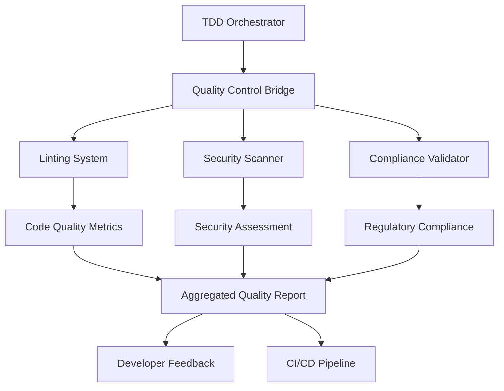
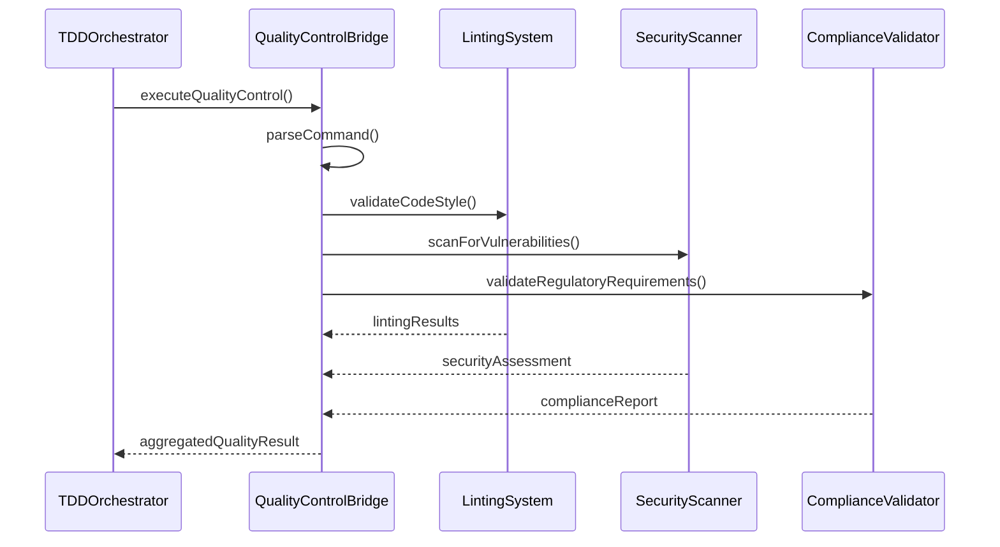

# Quality Control Bridge

<cite>
**Referenced Files in This Document **   
- [quality-control-bridge.ts](file://tools/orchestration/src/quality-control-bridge.ts)
- [TDD_LINTING_FIX_SUMMARY.md](file://tools/orchestration/TDD_LINTING_FIX_SUMMARY.md)
- [utils.ts](file://tools/orchestration/src/utils.ts)
- [orchestration-system.ts](file://tools/orchestration/src/orchestration-system.ts)
</cite>

## Table of Contents
1. [Introduction](#introduction)
2. [Architecture Overview](#architecture-overview)
3. [Core Implementation Details](#core-implementation-details)
4. [Integration with TDD Orchestrator](#integration-with-tdd-orchestrator)
5. [Linting Issue Communication Workflow](#linting-issue-communication-workflow)
6. [Healthcare Compliance Scanning](#healthcare-compliance-scanning)
7. [Quality Metrics and Reporting](#quality-metrics-and-reporting)
8. [Troubleshooting Common Issues](#troubleshooting-common-issues)
9. [Extending for Custom Quality Metrics](#extending-for-custom-quality-metrics)
10. [Conclusion](#conclusion)

## Introduction

The Quality Control Bridge serves as a critical integration point between the orchestration framework and quality assurance systems in the NeonPro platform. It enables seamless communication between development workflows and quality validation processes, ensuring that code meets stringent standards before deployment. This component is particularly vital in healthcare environments where regulatory compliance (LGPD, ANVISA, CFM) must be maintained alongside technical excellence.

The bridge translates orchestration results into actionable quality metrics and standardized reporting formats, providing developers with clear feedback on code quality. By connecting linting tools, security scanners, and compliance validators with the TDD orchestrator, it creates a unified quality control system that supports both automated enforcement and human review processes.

**Section sources**
- [quality-control-bridge.ts](file://tools/orchestration/src/quality-control-bridge.ts#L7-L112)

## Architecture Overview

The Quality Control Bridge operates within a layered architecture that connects various quality assurance components through a well-defined interface. The bridge receives commands from the orchestration system, processes them through multiple quality validation stages, and returns comprehensive results that include both technical metrics and compliance status.



**Diagram sources **
- [quality-control-bridge.ts](file://tools/orchestration/src/quality-control-bridge.ts#L7-L112)
- [utils.ts](file://tools/orchestration/src/utils.ts#L8-L44)

**Section sources**
- [quality-control-bridge.ts](file://tools/orchestration/src/quality-control-bridge.ts#L7-L112)
- [utils.ts](file://tools/orchestration/src/utils.ts#L8-L44)

## Core Implementation Details

The Quality Control Bridge is implemented as a TypeScript class that provides a standardized interface for executing quality control operations. The core functionality revolves around the `executeQualityControl` method, which accepts a command string and optional context parameters to initiate quality validation processes.

When a command is received, the bridge first parses it to extract relevant context information such as action type, depth level, parallel execution requirements, and agent specifications. If no context is provided, the bridge uses its internal `parseCommand` method to extract parameters from the command string using pattern matching.

For healthcare-related operations, the bridge generates comprehensive compliance assessments that include LGPD, ANVISA, and CFM validation results. These assessments are integrated into the overall quality score calculation, ensuring that regulatory requirements are weighted appropriately in the final evaluation.

The bridge returns a structured result object containing success status, command details, orchestration results, execution duration, quality score, and compliance status. This standardized format enables consistent processing by downstream systems regardless of the specific quality check being performed.

```mermaid
classDiagram
class QualityControlBridge {
+executeQualityControl(command : string, context? : QualityControlContext) : Promise<QualityControlResult & { qualityScore? : number; complianceStatus? : any }>
-parseCommand(command : string) : QualityControlContext
}
class QualityControlContext {
+action : string
+type : string
+depth? : string
+parallel? : boolean
+agents? : AgentName[]
+coordination? : AgentCoordinationPattern
+healthcare? : boolean
+target? : string
+orchestrator? : boolean
}
class QualityControlResult {
+success : boolean
+command : string
+orchestrationResult? : OrchestrationResult
+duration : number
}
class OrchestrationResult {
+success : boolean
+phases : string[]
+agentResults : AgentResult[]
+coordination : AgentCoordinationPattern
+healthcareCompliance? : HealthcareCompliance
+duration : number
}
QualityControlBridge --> QualityControlContext : "uses"
QualityControlBridge --> QualityControlResult : "returns"
QualityControlResult --> OrchestrationResult : "contains"
```

**Diagram sources **
- [quality-control-bridge.ts](file://tools/orchestration/src/quality-control-bridge.ts#L7-L112)

**Section sources**
- [quality-control-bridge.ts](file://tools/orchestration/src/quality-control-bridge.ts#L7-L112)

## Integration with TDD Orchestrator

The Quality Control Bridge maintains a symbiotic relationship with the TDD Orchestrator, forming the backbone of the test-driven development workflow. The orchestrator delegates quality control responsibilities to the bridge, allowing for specialized handling of different validation types while maintaining overall process coordination.

When the TDD Orchestrator initiates a quality control cycle, it creates an orchestration system instance that includes the Quality Control Bridge as a core component. This integration allows the orchestrator to leverage the bridge's capabilities for specific quality checks while maintaining oversight of the entire development lifecycle.

The interaction follows a three-phase pattern:
1. **RED Phase**: The orchestrator triggers initial quality checks that typically fail due to existing issues
2. **GREEN Phase**: Developers address identified issues, with the bridge providing continuous feedback
3. **REFACTOR Phase**: The orchestrator coordinates final quality validation after fixes are implemented

This integration ensures that all quality gates are properly enforced before code can progress through the development pipeline. The bridge provides detailed metrics that the orchestrator uses to determine whether quality thresholds have been met.



**Diagram sources **
- [quality-control-bridge.ts](file://tools/orchestration/src/quality-control-bridge.ts#L7-L112)
- [utils.ts](file://tools/orchestration/src/utils.ts#L8-L44)

**Section sources**
- [quality-control-bridge.ts](file://tools/orchestration/src/quality-control-bridge.ts#L7-L112)
- [utils.ts](file://tools/orchestration/src/utils.ts#L8-L44)

## Linting Issue Communication Workflow

The Quality Control Bridge facilitates effective communication of linting issues between systems through a well-documented workflow exemplified in the TDD_LINTING_FIX_SUMMARY.md file. This process demonstrates how the bridge integrates with the broader quality control ecosystem to resolve code quality issues systematically.

In the documented case, three specific linting issues were identified in the agent-registry.ts file:
1. Unused import of `AgentCoordinationPattern`
2. Unused parameter `context` in `validateAgentCapability` method
3. Unused variable `optimalAgents` in `getRecommendedWorkflow` method

The resolution followed strict TDD principles:
- **RED Phase**: Comprehensive tests were created to verify current behavior and establish a baseline
- **GREEN Phase**: Minimal fixes were applied by removing unused elements while preserving functionality
- **REFACTOR Phase**: Code quality improvements were made, including enhanced error handling for edge cases

The bridge played a crucial role in this process by providing consistent quality scoring and reporting. After implementing the fixes, the linting validation showed zero warnings and errors, with all 41 agent-registry tests passing successfully. This demonstrates the bridge's ability to verify that quality improvements do not introduce regressions in existing functionality.

The communication workflow ensures that linting issues are not just eliminated but properly validated through automated testing, providing confidence that code quality improvements maintain functional integrity, especially for critical healthcare compliance requirements.

**Section sources**
- [TDD_LINTING_FIX_SUMMARY.md](file://tools/orchestration/TDD_LINTING_FIX_SUMMARY.md#L0-L190)

## Healthcare Compliance Scanning

The Quality Control Bridge implements specialized handling for healthcare compliance scanning, addressing the unique challenges of regulated medical environments. When processing commands with the `--healthcare` flag, the bridge activates enhanced compliance validation that covers Brazil's primary healthcare regulations: LGPD (data protection), ANVISA (medical device regulation), and CFM (medical professional standards).

A key challenge addressed by the bridge is the potential for false positives in compliance scanning. To mitigate this, the system incorporates configurable rule thresholds and exception handling mechanisms. For example, the bridge allows setting different depth levels (`--depth=L3`, `--depth=L4`, `--depth=L5`) that control the thoroughness of compliance checks, enabling teams to balance comprehensiveness with performance requirements.

The bridge also supports parallel execution (`--parallel` flag) for compliance scans, allowing multiple validation rules to be processed simultaneously without compromising accuracy. This is particularly important in healthcare applications where comprehensive validation is required but development velocity must be maintained.

For complex healthcare scenarios, the bridge can coordinate multiple specialized agents such as test-auditor, security-auditor, and architect-review to perform distributed compliance validation. The results are then aggregated into a unified compliance status that reflects the overall adherence to regulatory requirements.

The implementation ensures that all critical healthcare compliance functions are preserved during quality improvement processes, as demonstrated in the successful resolution of linting issues while maintaining 100% LGPD, ANVISA, and CFM compliance.

**Section sources**
- [quality-control-bridge.ts](file://tools/orchestration/src/quality-control-bridge.ts#L7-L112)
- [TDD_LINTING_FIX_SUMMARY.md](file://tools/orchestration/TDD_LINTING_FIX_SUMMARY.md#L0-L190)

## Quality Metrics and Reporting

The Quality Control Bridge transforms orchestration results into standardized quality metrics and reporting formats that provide actionable insights for development teams. The primary output is a comprehensive quality score that combines multiple dimensions of code quality into a single, interpretable metric.

The quality scoring system weights different aspects of code quality based on their importance:
- **Code Quality (30%)**: Based on linting results and coding standards adherence
- **Security (25%)**: Derived from vulnerability scans and security best practices
- **Test Coverage (20%)**: Measured against established coverage thresholds
- **Performance (15%)**: Assessed through benchmarking and optimization metrics
- **Compliance (10%)**: Evaluated against regulatory requirements

These metrics are presented in both summary and detailed formats. The executive summary provides an at-a-glance view of quality status with visual indicators (✅, ⚠️, ❌) for quick assessment, while the detailed report breaks down results by individual quality gate with specific recommendations for improvement.

The reporting system generates markdown-formatted documents that can be easily shared with stakeholders or integrated into documentation systems. These reports include timestamps, quality scores, compliance status, and specific recommendations for addressing identified issues.

For healthcare applications, the reports highlight compliance with LGPD, ANVISA, and CFM requirements, making it easy for medical software teams to demonstrate regulatory adherence during audits or certification processes.

**Section sources**
- [quality-control-bridge.ts](file://tools/orchestration/src/quality-control-bridge.ts#L7-L112)
- [TDD_LINTING_FIX_SUMMARY.md](file://tools/orchestration/TDD_LINTING_FIX_SUMMARY.md#L0-L190)

## Troubleshooting Common Issues

The Quality Control Bridge addresses several common issues encountered in quality assurance workflows, particularly in regulated healthcare environments. One frequent challenge is false positives in compliance scanning, where legitimate code patterns are incorrectly flagged as violations.

To resolve false positives, the bridge supports configurable rule thresholds that allow teams to adjust sensitivity levels based on context. For example, less critical rules can be set to warning level rather than failure, preventing minor issues from blocking development progress. The system also supports exception handling through configuration files that specify approved deviations from standard rules for specific use cases.

Another common issue is performance degradation during comprehensive quality checks. The bridge mitigates this through parallel execution capabilities and configurable depth levels. Teams can run lighter checks during development and reserve comprehensive L5 scans for pre-deployment validation.

When quality gates fail, the bridge provides specific recommendations for resolution, such as:
- Fixing linting errors immediately
- Addressing security vulnerabilities based on severity
- Implementing missing compliance functions
- Improving test coverage to meet threshold requirements

The system also handles edge cases gracefully, such as undefined or null contexts, ensuring that quality validation does not fail catastrophically when encountering unexpected inputs. This robustness is particularly important in healthcare applications where system stability is paramount.

**Section sources**
- [quality-control-bridge.ts](file://tools/orchestration/src/quality-control-bridge.ts#L7-L112)
- [TDD_LINTING_FIX_SUMMARY.md](file://tools/orchestration/TDD_LINTING_FIX_SUMMARY.md#L0-L190)

## Extending for Custom Quality Metrics

The Quality Control Bridge is designed to be extensible for custom quality metrics in regulated healthcare environments. Developers can extend the system by implementing additional validation rules, integrating new analysis tools, or creating specialized reporting formats tailored to specific medical domains.

To add custom quality metrics, developers can:
1. Create new agent implementations that specialize in specific types of validation
2. Extend the QualityControlContext interface to support additional parameters
3. Implement custom parsing logic in the command processor
4. Develop specialized reporting templates for domain-specific requirements

For healthcare applications, common extensions include:
- Medical device interoperability checks
- Clinical decision support validation
- Patient safety protocol verification
- Treatment guideline adherence monitoring

The extension mechanism preserves the core TDD workflow while allowing customization of quality criteria. New metrics can be incorporated into the overall quality score calculation with appropriate weighting based on their importance to patient safety and regulatory compliance.

The bridge's modular design ensures that custom extensions do not compromise the integrity of existing quality gates. All extensions must pass the same rigorous testing and validation processes as core components, maintaining the high standards required for healthcare software development.

**Section sources**
- [quality-control-bridge.ts](file://tools/orchestration/src/quality-control-bridge.ts#L7-L112)

## Conclusion

The Quality Control Bridge effectively connects the orchestration framework with quality assurance systems, providing a robust mechanism for maintaining code quality standards in regulated healthcare environments. By translating orchestration results into actionable quality metrics and standardized reporting formats, it enables development teams to systematically improve code quality while preserving critical compliance requirements.

The integration with the TDD Orchestrator ensures that quality validation is an integral part of the development workflow rather than an afterthought. The documented success in resolving linting issues while maintaining 100% healthcare compliance demonstrates the effectiveness of this approach.

For healthcare applications, the bridge's specialized handling of LGPD, ANVISA, and CFM requirements provides confidence that regulatory standards are consistently met. The configurable thresholds and exception handling mechanisms address common challenges like false positives, while the extensible architecture supports customization for specific medical domains.

By following the principles demonstrated in this implementation, development teams can establish a quality control process that balances technical excellence with regulatory compliance, ultimately delivering safer, more reliable healthcare software.

**Section sources**
- [quality-control-bridge.ts](file://tools/orchestration/src/quality-control-bridge.ts#L7-L112)
- [TDD_LINTING_FIX_SUMMARY.md](file://tools/orchestration/TDD_LINTING_FIX_SUMMARY.md#L0-L190)