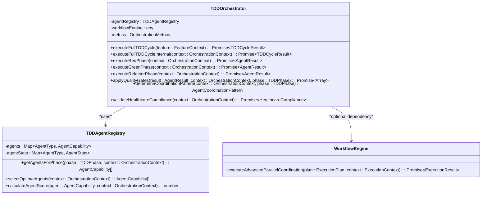
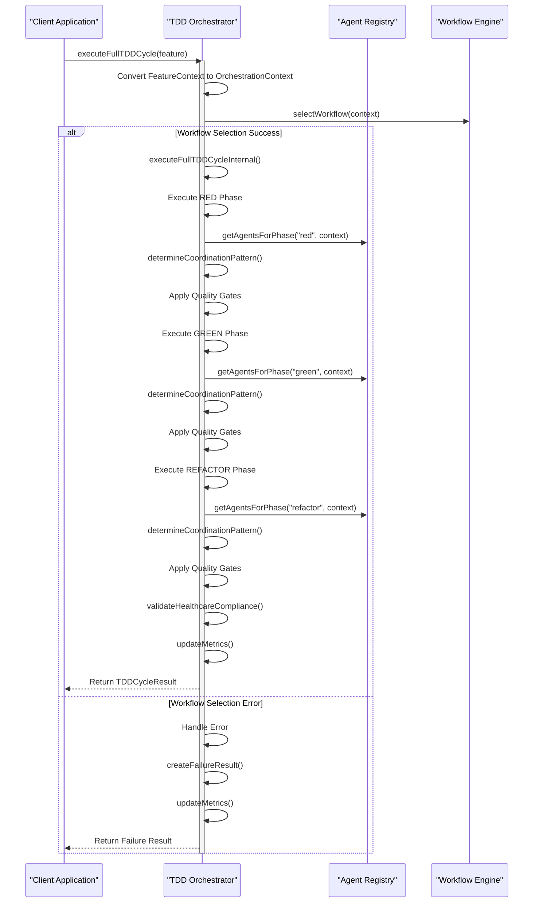
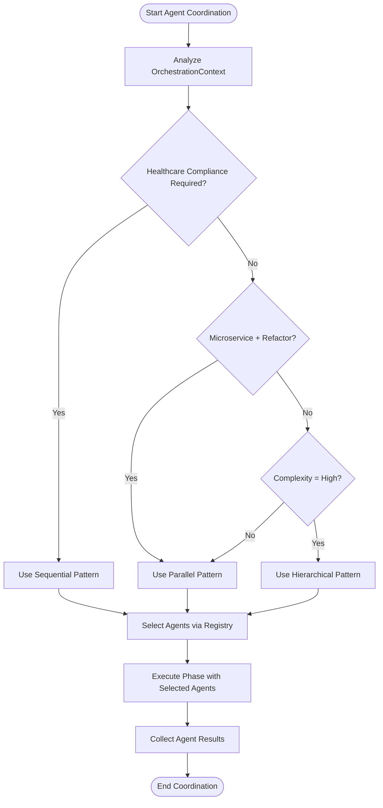
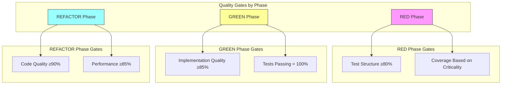
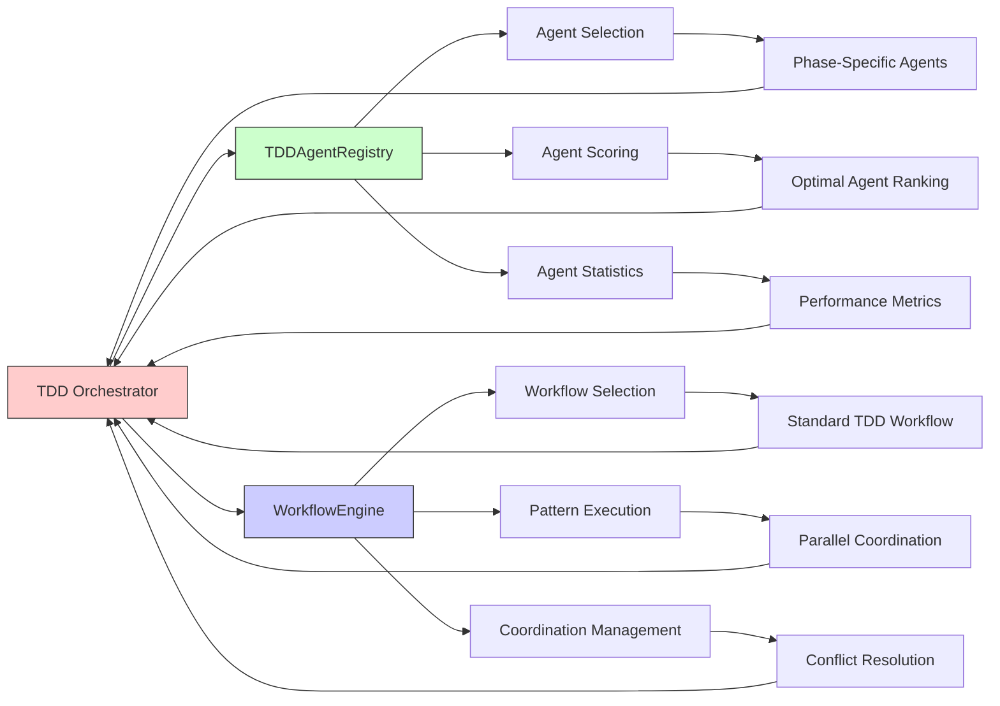
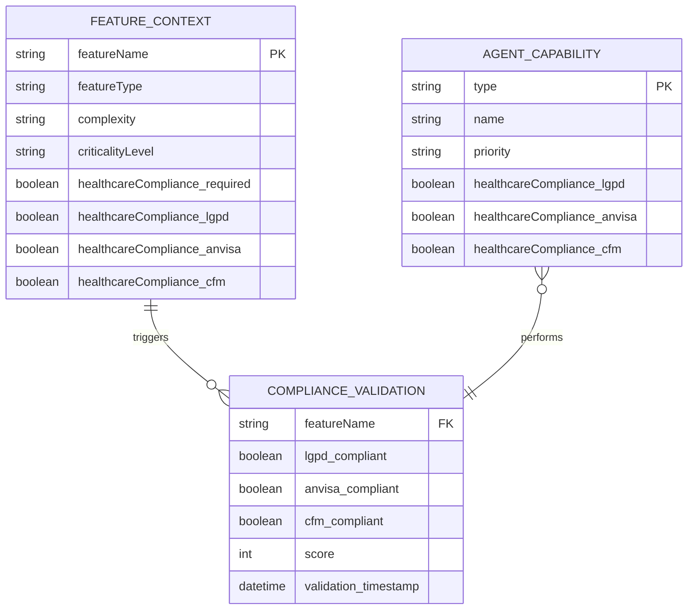
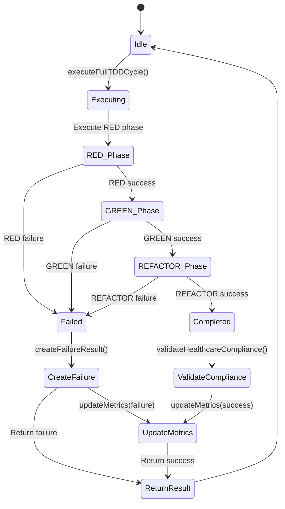
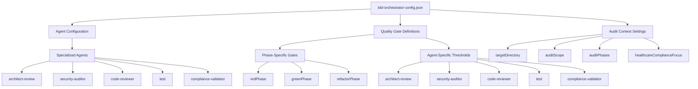

# TDD Orchestrator

<cite>
**Referenced Files in This Document**   
- [tdd-orchestrator.ts](file://tools/orchestration/src/tdd-orchestrator.ts)
- [agent-registry.ts](file://tools/orchestration/src/agent-registry.ts)
- [types.ts](file://tools/orchestration/types.ts)
- [workflow-engine.ts](file://tools/orchestration/src/workflow-engine.ts)
- [tdd-orchestrator.test.ts](file://tools/orchestration/__tests__/tdd-orchestrator.test.ts)
- [tdd-orchestrator-config.json](file://tdd-orchestrator-config.json)
</cite>

## Table of Contents
1. [Introduction](#introduction)
2. [Core Architecture](#core-architecture)
3. [Red-Green-Refactor Cycle Execution](#red-green-refactor-cycle-execution)
4. [Agent Management and Coordination](#agent-management-and-coordination)
5. [Quality Gate Validation](#quality-gate-validation)
6. [Integration with Agent Registry and Workflow Engine](#integration-with-agent-registry-and-workflow-engine)
7. [Healthcare Compliance Integration](#healthcare-compliance-integration)
8. [Error Handling and Recovery Mechanisms](#error-handling-and-recovery-mechanisms)
9. [Configuration and Customization](#configuration-and-customization)
10. [Testing and Validation](#testing-and-validation)

## Introduction

The TDD Orchestrator is a central component responsible for managing the complete Test-Driven Development (TDD) workflow within the system. It coordinates the execution of the Red-Green-Refactor cycle, manages agent participation, enforces quality gates, and ensures compliance with healthcare regulations when required. The orchestrator serves as the conductor of the TDD process, ensuring that each phase is executed properly and that all quality standards are met before progressing to the next phase.

Designed with extensibility in mind, the TDD Orchestrator can be customized for different project types and complexity levels. It integrates seamlessly with the agent registry to dynamically select appropriate agents based on feature context and coordinates with the workflow engine to execute testing workflows according to predefined patterns. The orchestrator also maintains comprehensive metrics about cycle execution, success rates, and performance characteristics.

This documentation provides a detailed explanation of the TDD Orchestrator's implementation, focusing on its core functionality, integration points, and operational patterns. It includes concrete examples from the codebase and explains how developers can extend the orchestrator for custom TDD workflows while maintaining system integrity and compliance requirements.

**Section sources**
- [tdd-orchestrator.ts](file://tools/orchestration/src/tdd-orchestrator.ts#L13-L487)
- [tdd-orchestrator-config.json](file://tdd-orchestrator-config.json#L1-L188)

## Core Architecture

The TDD Orchestrator follows a modular architecture that separates concerns between cycle management, agent coordination, quality validation, and metrics tracking. At its core, the orchestrator implements the `TDDOrchestrator` class which encapsulates all functionality related to TDD cycle execution. The architecture is designed around several key components that work together to ensure reliable and efficient test-driven development workflows.

The orchestrator maintains references to critical dependencies including the `TDDAgentRegistry` for agent management and an optional `workflowEngine` for advanced workflow execution. It also tracks internal metrics such as total cycles executed, success/failure rates, and average duration. These metrics provide valuable insights into the effectiveness of the TDD process and help identify areas for improvement.

The orchestrator operates on two primary data structures: `FeatureContext` and `OrchestrationContext`. The `FeatureContext` represents the input parameters for a TDD cycle, including feature name, domain, complexity level, requirements, and healthcare compliance needs. During cycle initialization, this context is transformed into an `OrchestrationContext` which adds additional metadata like criticality level and structured compliance requirements that guide the orchestration process.

**Diagram sources **
- [tdd-orchestrator.ts](file://tools/orchestration/src/tdd-orchestrator.ts#L13-L487)
- [agent-registry.ts](file://tools/orchestration/src/agent-registry.ts#L182-L474)
- [workflow-engine.ts](file://tools/orchestration/src/workflow-engine.ts#L39-L78)

**Section sources**
- [tdd-orchestrator.ts](file://tools/orchestration/src/tdd-orchestrator.ts#L13-L487)
- [types.ts](file://tools/orchestration/types.ts#L291-L325)

## Red-Green-Refactor Cycle Execution

The TDD Orchestrator implements the classic Red-Green-Refactor cycle through a well-defined execution pattern that ensures proper sequencing and validation at each stage. The cycle begins with the `executeFullTDDCycle` method, which serves as the primary entry point for initiating a complete TDD workflow. This method accepts a `FeatureContext` parameter containing all necessary information about the feature being developed and converts it into an `OrchestrationContext` for internal processing.

The execution flow follows a strict sequence: RED phase → GREEN phase → REFACTOR phase. Each phase is executed through dedicated methods (`executeRedPhase`, `executeGreenPhase`, `executeRefactorPhase`) that coordinate the appropriate agents and apply phase-specific quality gates. The orchestrator ensures that subsequent phases only proceed if the previous phase was successful, maintaining the integrity of the TDD process.

During execution, the orchestrator generates a unique cycle ID using the `generateCycleId` method, which combines a timestamp with a random string to ensure global uniqueness. This ID is used for tracking and metrics purposes throughout the cycle. The entire process is wrapped in error handling to ensure that failures are properly captured and reported, even if they occur during setup or configuration.

**Diagram sources **
- [tdd-orchestrator.ts](file://tools/orchestration/src/tdd-orchestrator.ts#L39-L65)
- [tdd-orchestrator.ts](file://tools/orchestration/src/tdd-orchestrator.ts#L70-L125)
- [tdd-orchestrator.ts](file://tools/orchestration/src/tdd-orchestrator.ts#L130-L193)

**Section sources**
- [tdd-orchestrator.ts](file://tools/orchestration/src/tdd-orchestrator.ts#L39-L193)
- [tdd-orchestrator.ts](file://tools/orchestration/src/tdd-orchestrator.ts#L70-L125)

## Agent Management and Coordination

The TDD Orchestrator employs sophisticated agent management and coordination strategies to ensure optimal execution of the TDD workflow. Central to this capability is the integration with the `TDDAgentRegistry`, which maintains a catalog of available agents, their capabilities, and performance statistics. The orchestrator queries this registry to identify the most appropriate agents for each phase of the TDD cycle based on the specific feature context.

Agent selection follows a multi-criteria approach that considers several factors:
- **Phase compatibility**: Agents must support the current TDD phase (RED, GREEN, or REFACTOR)
- **Healthcare compliance**: When healthcare regulations apply, only agents with appropriate compliance capabilities are selected
- **Criticality level**: For critical features, tertiary agents are excluded to ensure reliability
- **Feature context matching**: Agents are scored based on how well their triggers and specializations match the feature name and requirements

The orchestrator implements three distinct coordination patterns: sequential, parallel, and hierarchical. The choice of pattern is determined by the `determineCoordinationPattern` method, which evaluates the context and phase to select the most appropriate approach. Healthcare compliance requirements always trigger sequential execution to ensure proper audit trails, while microservice refactoring typically uses parallel coordination for efficiency.

**Diagram sources **
- [tdd-orchestrator.ts](file://tools/orchestration/src/tdd-orchestrator.ts#L438-L457)
- [agent-registry.ts](file://tools/orchestration/src/agent-registry.ts#L182-L474)

**Section sources**
- [tdd-orchestrator.ts](file://tools/orchestration/src/tdd-orchestrator.ts#L438-L457)
- [agent-registry.ts](file://tools/orchestration/src/agent-registry.ts#L182-L474)

## Quality Gate Validation

Quality gate validation is a critical function of the TDD Orchestrator, ensuring that each phase of the TDD cycle meets predefined quality standards before progression. The orchestrator implements phase-specific quality gates through the `applyQualityGates` method, which evaluates agent results against criteria tailored to the current phase's objectives.

For the RED phase, quality gates focus on test structure and coverage requirements. The "Test Structure" gate verifies that tests follow established patterns (minimum 80% score), while the "Coverage" gate ensures adequate test coverage based on the feature's criticality level. Critical features require 95% coverage, high complexity features require 85%, medium complexity requires 75%, and others require 70%.

During the GREEN phase, the orchestrator validates implementation quality and test passage. The "Implementation Quality" gate requires a minimum score of 85, while the "Tests Passing" gate confirms that all tests successfully pass. These gates ensure that the implementation not only works but also meets quality standards.

In the REFACTOR phase, quality gates emphasize code quality improvements and performance optimization. The "Code Quality" gate requires a minimum score of 90, while the "Performance" gate ensures that refactored code maintains or improves performance characteristics (minimum 85% score).

**Diagram sources **
- [tdd-orchestrator.ts](file://tools/orchestration/src/tdd-orchestrator.ts#L198-L256)

**Section sources**
- [tdd-orchestrator.ts](file://tools/orchestration/src/tdd-orchestrator.ts#L198-L256)
- [tdd-orchestrator-config.json](file://tdd-orchestrator-config.json#L120-L158)

## Integration with Agent Registry and Workflow Engine

The TDD Orchestrator integrates tightly with both the agent registry and workflow engine to deliver a cohesive testing workflow. This integration enables dynamic agent selection, coordinated execution, and workflow pattern application based on the specific feature context. The orchestrator acts as the central coordinator, leveraging these components to implement the complete TDD process.

Integration with the `TDDAgentRegistry` occurs through multiple methods that query for appropriate agents based on phase and context. The `getAgentsForPhase` method filters agents by their supported phases and applies additional constraints based on healthcare compliance requirements and criticality levels. The `selectOptimalAgents` method uses a scoring algorithm to rank agents by relevance, considering factors like priority, trigger matching, specialization alignment, and healthcare compliance capabilities.

The workflow engine integration allows the orchestrator to leverage predefined workflow patterns for different scenarios. Through the `selectWorkflow` method, the orchestrator can choose between standard TDD workflows and specialized patterns like security-critical workflows. This enables adaptive behavior where critical or healthcare-related features automatically receive enhanced validation processes.

**Diagram sources **
- [tdd-orchestrator.ts](file://tools/orchestration/src/tdd-orchestrator.ts#L13-L487)
- [agent-registry.ts](file://tools/orchestration/src/agent-registry.ts#L182-L474)
- [workflow-engine.ts](file://tools/orchestration/src/workflow-engine.ts#L39-L78)

**Section sources**
- [tdd-orchestrator.ts](file://tools/orchestration/src/tdd-orchestrator.ts#L70-L78)
- [agent-registry.ts](file://tools/orchestration/src/agent-registry.ts#L182-L474)
- [workflow-engine.ts](file://tools/orchestration/src/workflow-engine.ts#L39-L78)

## Healthcare Compliance Integration

Healthcare compliance is a critical aspect of the TDD Orchestrator's functionality, particularly for features involving patient data, medical systems, or regulated healthcare domains. The orchestrator implements comprehensive compliance validation through the `validateHealthcareCompliance` method, which assesses adherence to major regulatory frameworks including LGPD (Brazilian General Data Protection Law), ANVISA (National Health Surveillance Agency), and CFM (Federal Council of Medicine).

When healthcare compliance is required, the orchestrator modifies its behavior significantly. The `determineCoordinationPattern` method forces sequential execution regardless of other factors, ensuring proper audit trails and deterministic behavior. The agent selection process prioritizes compliance-capable agents like the security-auditor and compliance-validator, and quality gates include mandatory compliance checks in all phases.

The compliance validation process assigns scores based on the presence of required regulations. LGPD compliance contributes 33 points, ANVISA compliance contributes 33 points, and CFM compliance contributes 34 points to the overall compliance score. This weighted system ensures that all three frameworks are equally important while allowing for a perfect score of 100.

**Diagram sources **
- [tdd-orchestrator.ts](file://tools/orchestration/src/tdd-orchestrator.ts#L462-L477)
- [agent-registry.ts](file://tools/orchestration/src/agent-registry.ts#L182-L474)
- [tdd-orchestrator-config.json](file://tdd-orchestrator-config.json#L80-L118)

**Section sources**
- [tdd-orchestrator.ts](file://tools/orchestration/src/tdd-orchestrator.ts#L462-L477)
- [agent-registry.ts](file://tools/orchestration/src/agent-registry.ts#L182-L474)
- [tdd-orchestrator-config.json](file://tdd-orchestrator-config.json#L80-L118)

## Error Handling and Recovery Mechanisms

The TDD Orchestrator implements robust error handling and recovery mechanisms to ensure resilience in the face of failures during the TDD cycle. These mechanisms protect against various failure modes including agent errors, workflow engine issues, and invalid input contexts, providing graceful degradation and meaningful error reporting.

When exceptions occur during cycle execution, the orchestrator catches them in the main try-catch block of `executeFullTDDCycleInternal` and generates a standardized failure result using the `createFailureResult` method. This ensures that even when unexpected errors occur, the client receives a consistent response structure with clear indication of failure.

For phase-specific failures, the orchestrator follows a cascading failure model where failure in an earlier phase prevents execution of subsequent phases. For example, if the RED phase fails, the GREEN and REFACTOR phases are skipped entirely. This preserves the fundamental principle of TDD that implementation should not proceed until tests are properly defined and failing.

The orchestrator also implements retry mechanisms through its integration with the workflow engine. While the core orchestrator does not handle retries directly, it provides sufficient context and metrics that enable higher-level systems to implement retry logic based on failure patterns and historical success rates.

**Diagram sources **
- [tdd-orchestrator.ts](file://tools/orchestration/src/tdd-orchestrator.ts#L70-L125)
- [tdd-orchestrator.ts](file://tools/orchestration/src/tdd-orchestrator.ts#L360-L395)

**Section sources**
- [tdd-orchestrator.ts](file://tools/orchestration/src/tdd-orchestrator.ts#L70-L125)
- [tdd-orchestrator.ts](file://tools/orchestration/src/tdd-orchestrator.ts#L360-L395)

## Configuration and Customization

The TDD Orchestrator supports extensive configuration and customization options, enabling adaptation to different project requirements and development workflows. Configuration is primarily managed through the `tdd-orchestrator-config.json` file, which defines agent behaviors, quality gate thresholds, and workflow parameters.

The configuration system allows customization of specialized agents including architect-review, security-auditor, code-reviewer, test, and compliance-validator. Each agent can be configured with specific roles, focus areas, activation triggers, and file patterns that determine when and where they are engaged during the TDD process. For example, the security-auditor agent activates when files contain patterns like "**/auth/**" or "**/*patient*" indicating sensitive functionality.

Quality gates can be customized for each phase of the TDD cycle, allowing teams to adjust thresholds based on project requirements. The configuration defines specific criteria for test structure, coverage, security validation, and compliance requirements. Agent-specific thresholds provide additional granularity, allowing different standards for architectural compliance (≥90%), security vulnerabilities (0 critical), code quality (≥85%), and test coverage (≥90%).

**Diagram sources **
- [tdd-orchestrator-config.json](file://tdd-orchestrator-config.json#L1-L188)

**Section sources**
- [tdd-orchestrator-config.json](file://tdd-orchestrator-config.json#L1-L188)

## Testing and Validation

The TDD Orchestrator is thoroughly tested through a comprehensive suite of unit and integration tests that validate its core functionality, error handling, and integration points. The primary test file `tdd-orchestrator.test.ts` contains over 600 lines of test code covering various aspects of the orchestrator's behavior, ensuring reliability and correctness.

Testing focuses on several key areas:
- **Constructor and initialization**: Verifies proper setup of the orchestrator with agent registry and workflow engine, and correct initialization of metrics
- **Full TDD cycle execution**: Tests successful completion of the complete Red-Green-Refactor cycle with various feature contexts
- **Phase-specific execution**: Validates correct behavior of individual phases (RED, GREEN, REFACTOR) and their quality gate applications
- **Agent coordination patterns**: Confirms proper selection and execution of sequential, parallel, and hierarchical coordination patterns
- **Quality gates**: Ensures phase-specific quality gates are applied correctly with appropriate thresholds
- **Healthcare compliance**: Tests validation of LGPD, ANVISA, and CFM compliance requirements
- **Metrics and reporting**: Verifies accurate tracking of cycle metrics including success rates and execution times
- **Error handling**: Confirms graceful handling of various failure scenarios including agent registry errors and workflow engine failures

The test suite uses mocking extensively to isolate the orchestrator from its dependencies, allowing focused testing of specific behaviors. For example, the workflow engine is mocked to simulate both successful workflow selection and error conditions, enabling comprehensive testing of both success and failure paths.

**Section sources**
- [tdd-orchestrator.test.ts](file://tools/orchestration/__tests__/tdd-orchestrator.test.ts#L1-L635)