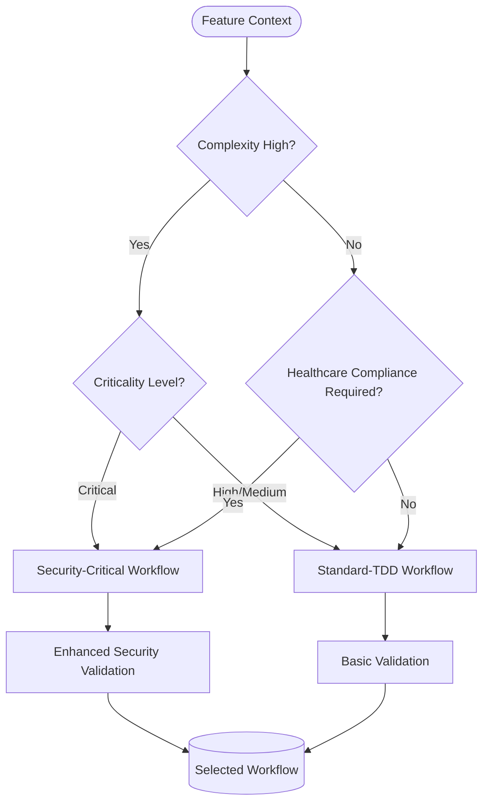
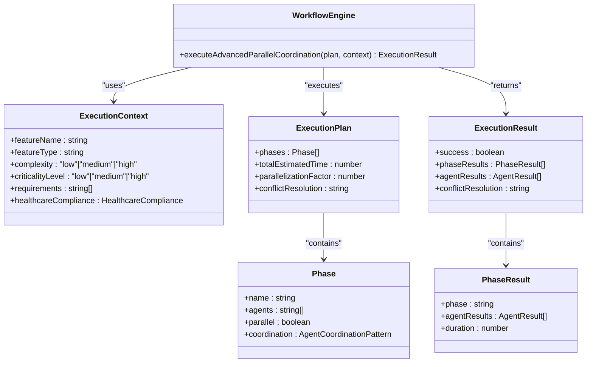
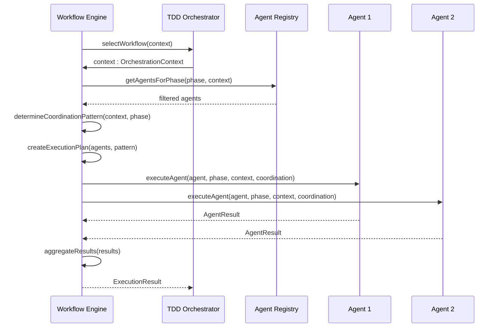
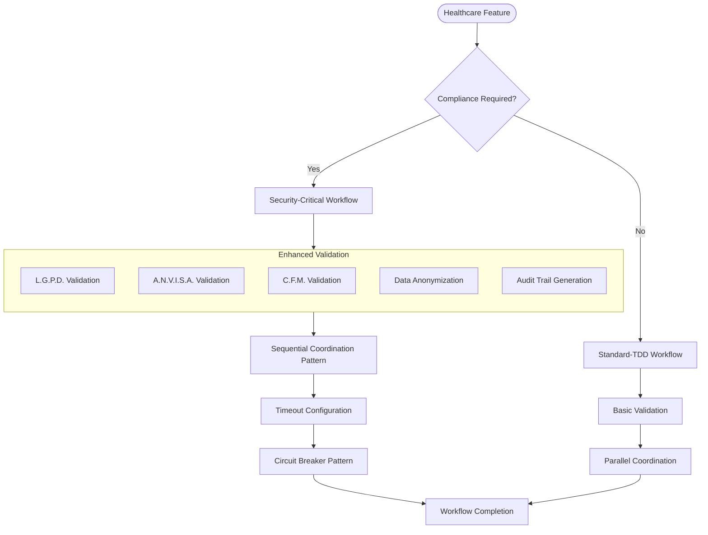
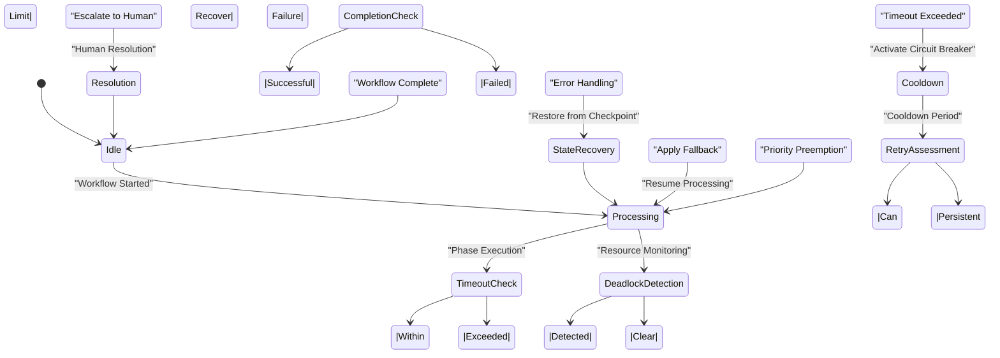
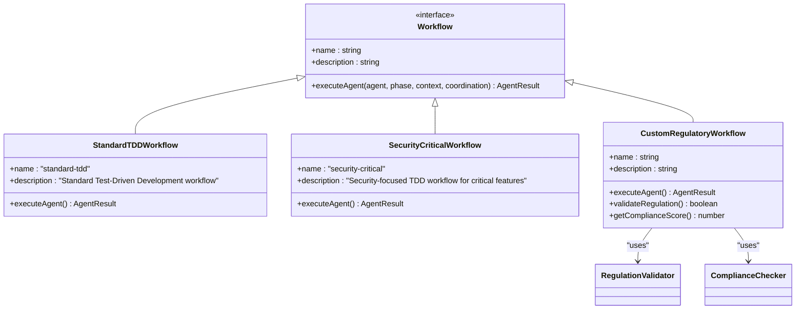

# Workflow Engine

<cite>
**Referenced Files in This Document **
- [workflow-engine.ts](file://tools/orchestration/src/workflow-engine.ts)
- [tdd-orchestrator.ts](file://tools/orchestration/src/tdd-orchestrator.ts)
- [workflows.ts](file://tools/orchestration/src/workflows.ts)
- [agent-registry.ts](file://tools/orchestration/src/agent-registry.ts)
- [types.ts](file://tools/orchestration/src/types.ts)
</cite>

## Table of Contents

1. [Introduction](#introduction)
2. [Workflow Selection Mechanism](#workflow-selection-mechanism)
3. [Execution Pattern Determination](#execution-pattern-determination)
4. [Coordination Strategy Based on Context](#coordination-strategy-based-on-context)
5. [Relationship with TDD Orchestrator](#relationship-with-tdd-orchestrator)
6. [Healthcare Compliance Workflows](#healthcare-compliance-workflows)
7. [Error Handling and Resilience](#error-handling-and-resilience)
8. [Custom Workflow Development](#custom-workflow-development)

## Introduction

The Workflow Engine is a core component responsible for orchestrating development lifecycle phases through intelligent workflow selection, execution pattern determination, and context-aware coordination strategies. It integrates tightly with the TDD Orchestrator to manage complex software development workflows, particularly in healthcare compliance scenarios where regulatory requirements demand rigorous validation processes.

The engine evaluates feature complexity, criticality levels, and compliance needs to select optimal workflows such as standard-tdd or security-critical patterns. By analyzing contextual parameters including feature type, domain-specific requirements, and healthcare regulations (LGPD, ANVISA, CFM), it dynamically configures execution strategies that balance efficiency with regulatory adherence.

This documentation provides comprehensive insights into the engine's architecture, decision-making logic, and integration points, enabling both beginners to understand fundamental concepts and experienced developers to extend functionality for new regulatory frameworks.

## Workflow Selection Mechanism

The Workflow Engine implements a sophisticated selection mechanism that chooses appropriate workflows based on feature characteristics and compliance requirements. The selection process begins when the TDD Orchestrator invokes the `selectWorkflow` method, passing an OrchestrationContext containing detailed information about the feature being developed.

Workflow selection considers multiple dimensions:

- Feature complexity (low, medium, high)
- Criticality level (low, medium, high, critical)
- Healthcare compliance requirements (LGPD, ANVISA, CFM)
- Domain-specific characteristics
- Required quality gates

The engine evaluates these factors against predefined workflow templates, choosing between StandardTDDWorkflow for general features and SecurityCriticalWorkflow for healthcare-sensitive components. The decision logic prioritizes compliance requirements above all other factors - any feature marked with healthcareCompliance.required automatically triggers the security-critical workflow regardless of other attributes.

For non-compliance features, the engine applies a tiered evaluation system where high-complexity features receive more rigorous workflows with additional quality gates and extended test coverage requirements. The selection algorithm also considers feature domains, applying specialized workflows for microservices, UI components, or data processing pipelines.



**Diagram sources**

- [workflows.ts](file://tools/orchestration/src/workflows.ts#L24-L82)
- [tdd-orchestrator.ts](file://tools/orchestration/src/tdd-orchestrator.ts#L70-L125)

**Section sources**

- [workflow-engine.ts](file://tools/orchestration/src/workflow-engine.ts#L0-L79)
- [workflows.ts](file://tools/orchestration/src/workflows.ts#L24-L82)

## Execution Pattern Determination

The Workflow Engine determines execution patterns through a context-aware analysis that balances performance requirements with regulatory constraints. The pattern selection process evaluates several key factors including feature complexity, healthcare compliance status, and phase-specific requirements.

When determining execution patterns, the engine follows a priority-based decision tree:

1. Healthcare compliance requirements take precedence - all healthcare-related features use sequential execution patterns to ensure auditability and traceability
2. Feature type and phase combinations trigger specific patterns - microservice refactoring always uses parallel execution
3. Complexity levels influence pattern selection - high-complexity features default to hierarchical coordination
4. Performance requirements may override default patterns when specified

The engine supports multiple execution patterns including parallel, sequential, hierarchical, event-driven, and consensus-based coordination. Each pattern serves specific purposes:

- Parallel: Maximizes throughput for independent tasks
- Sequential: Ensures ordered execution for dependent operations
- Hierarchical: Organizes agents by priority levels for complex features
- Event-driven: Responds to system events in real-time
- Consensus: Requires agreement among multiple agents

The pattern determination occurs during each phase of the TDD cycle (red, green, refactor), allowing different patterns to be applied at different stages of development. This flexibility enables optimized execution strategies that adapt to the specific needs of each development phase.



**Diagram sources**

- [workflow-engine.ts](file://tools/orchestration/src/workflow-engine.ts#L0-L79)
- [types.ts](file://tools/orchestration/src/types.ts#L0-L231)

**Section sources**

- [workflow-engine.ts](file://tools/orchestration/src/workflow-engine.ts#L40-L77)
- [tdd-orchestrator.ts](file://tools/orchestration/src/tdd-orchestrator.ts#L438-L457)

## Coordination Strategy Based on Context

The Workflow Engine employs a dynamic coordination strategy that adapts to contextual factors such as feature complexity, healthcare compliance requirements, and development phase. This context-aware approach ensures optimal resource utilization while maintaining regulatory compliance and code quality standards.

The coordination strategy operates on three primary dimensions: agent selection, phase management, and conflict resolution. For agent selection, the engine consults the Agent Registry to identify appropriate agents based on their capabilities, specializations, and compliance qualifications. Agents are filtered according to the feature's healthcare compliance requirements - only agents with matching compliance certifications participate in healthcare-related workflows.

Phase management coordinates the execution of TDD lifecycle phases (red, green, refactor) with appropriate timing and dependencies. The engine adjusts phase durations and quality gate thresholds based on criticality levels, requiring higher coverage scores (95%) for critical features compared to standard features (70-85%). This adaptive approach ensures that safety-critical healthcare applications receive more rigorous testing.

Conflict resolution mechanisms handle potential issues that arise during parallel execution, using priority-based resolution strategies where primary agents' decisions take precedence over secondary or tertiary agents. The engine also implements timeout configurations and circuit breaker patterns to prevent deadlocks in complex validation scenarios, automatically escalating stuck processes to human review when necessary.



**Diagram sources**

- [workflow-engine.ts](file://tools/orchestration/src/workflow-engine.ts#L40-L77)
- [tdd-orchestrator.ts](file://tools/orchestration/src/tdd-orchestrator.ts#L70-L125)
- [agent-registry.ts](file://tools/orchestration/src/agent-registry.ts#L200-L300)

**Section sources**

- [workflow-engine.ts](file://tools/orchestration/src/workflow-engine.ts#L40-L77)
- [agent-registry.ts](file://tools/orchestration/src/agent-registry.ts#L200-L300)

## Relationship with TDD Orchestrator

The Workflow Engine maintains a symbiotic relationship with the TDD Orchestrator, serving as its strategic decision-making component while the orchestrator handles tactical execution management. This division of responsibilities creates a clear separation between workflow planning and phase execution, enhancing modularity and maintainability.

The integration occurs through well-defined interfaces where the TDD Orchestrator delegates workflow selection and coordination pattern determination to the Workflow Engine. During the TDD cycle, the orchestrator first converts feature context into an OrchestrationContext object, then invokes the workflow engine's `selectWorkflow` method. Once the appropriate workflow is selected, the orchestrator proceeds with phase execution, consulting the workflow engine for coordination pattern recommendations before each phase.

Key interaction points include:

- Workflow selection at the beginning of each TDD cycle
- Coordination pattern determination before each phase (red, green, refactor)
- Agent selection guidance through the Agent Registry
- Quality gate configuration based on workflow type
- Compliance validation integration
- Metrics collection and reporting

The orchestrator acts as the conductor, managing the overall flow of the development process, while the workflow engine serves as the composer, defining the structure and rules that govern how development activities are coordinated. This architectural pattern allows independent evolution of workflow logic and execution mechanics, enabling teams to modify development processes without disrupting core orchestration functionality.

```mermaid
graph TB
subgraph "TDD Orchestrator"
TO[TDDOrchestrator]
MR[Metrics Recorder]
QG[Quality Gates]
end
subgraph "Workflow Engine"
WE[WorkflowEngine]
AR[AgentRegistry]
WF[Workflows]
end
Client --> TO
TO --> WE: selectWorkflow(context)
WE --> AR: getAgentsForPhase()
WE --> WF: executeAgent()
WE --> TO: selected workflow
TO --> TO: executeRedPhase()
TO --> TO: executeGreenPhase()
TO --> TO: executeRefactorPhase()
TO --> QG: applyQualityGates()
TO --> MR: updateMetrics()
MR --> Analytics
```

**Diagram sources**

- [tdd-orchestrator.ts](file://tools/orchestration/src/tdd-orchestrator.ts#L70-L125)
- [workflow-engine.ts](file://tools/orchestration/src/workflow-engine.ts#L0-L79)

**Section sources**

- [tdd-orchestrator.ts](file://tools/orchestration/src/tdd-orchestrator.ts#L70-L125)
- [workflow-engine.ts](file://tools/orchestration/src/workflow-engine.ts#L0-L79)

## Healthcare Compliance Workflows

The Workflow Engine implements specialized handling for healthcare compliance scenarios through dedicated workflows and enhanced validation processes. When processing features with healthcareCompliance.required set to true, the engine activates strict protocols that prioritize regulatory adherence over performance optimization.

Two primary workflows serve healthcare compliance needs:

- **Standard-TDD Workflow**: Used for general healthcare features with basic compliance requirements
- **Security-Critical Workflow**: Activated for features handling sensitive patient data or medical decision support

The Security-Critical Workflow incorporates additional validation layers, including mandatory LGPD, ANVISA, and CFM compliance checks. Each agent participating in healthcare workflows must possess corresponding compliance certifications, verified through the Agent Registry's filtering mechanism. The engine calculates a compliance score by aggregating individual regulation validations (LGPD: 33%, ANVISA: 33%, CFM: 34%), ensuring comprehensive coverage of Brazilian healthcare regulations.

During execution, the engine enforces sequential coordination patterns for all healthcare-related phases, preventing potential race conditions and ensuring complete audit trails. This approach sacrifices some performance efficiency but guarantees regulatory compliance and data integrity. The validation process includes automatic detection of personally identifiable health information (PIHI) and application of appropriate data protection measures.

For complex healthcare validation scenarios, the engine implements timeout configurations (default: 30 seconds per validation step) and circuit breaker patterns that halt processing if validation delays exceed acceptable thresholds. These resilience mechanisms prevent system-wide deadlocks while maintaining data safety standards.



**Diagram sources**

- [workflows.ts](file://tools/orchestration/src/workflows.ts#L51-L82)
- [tdd-orchestrator.ts](file://tools/orchestration/src/tdd-orchestrator.ts#L400-L420)
- [agent-registry.ts](file://tools/orchestration/src/agent-registry.ts#L300-L350)

**Section sources**

- [workflows.ts](file://tools/orchestration/src/workflows.ts#L51-L82)
- [tdd-orchestrator.ts](file://tools/orchestration/src/tdd-orchestrator.ts#L400-L420)

## Error Handling and Resilience

The Workflow Engine incorporates robust error handling and resilience mechanisms to address common issues in complex healthcare validation scenarios. These safeguards prevent system failures, mitigate risks of workflow deadlocks, and ensure graceful degradation when processing challenging compliance requirements.

Key resilience features include:

- **Timeout Configurations**: Each workflow phase has configurable timeout limits that prevent infinite execution loops. Default timeouts vary by phase and complexity level, with healthcare compliance phases having longer allowances (up to 60 seconds) to accommodate thorough validation.
- **Circuit Breaker Patterns**: Implemented at both workflow and agent levels, these patterns detect repeated failures and temporarily halt processing to prevent cascading failures. After a cooldown period, the system attempts recovery with reduced load.
- **Deadlock Prevention**: The engine uses resource locking with lease-based mechanisms, ensuring that no single process can monopolize system resources indefinitely. Priority-based preemption allows critical workflows to proceed when lower-priority processes stall.
- **Fallback Strategies**: When primary validation methods fail, the engine activates alternative compliance checking procedures, including simplified rule sets or manual review escalation paths.
- **State Recovery**: Periodic checkpoints preserve workflow state, enabling resumption from the last known good state after interruptions.

For healthcare-specific scenarios, additional safeguards include redundant validation chains, where multiple independent agents verify compliance requirements, and automatic alerting to compliance officers when threshold violations occur. The engine also maintains detailed audit logs of all validation attempts, successful and failed, supporting regulatory investigations and process improvement initiatives.



**Diagram sources**

- [workflow-engine.ts](file://tools/orchestration/src/workflow-engine.ts#L40-L77)
- [tdd-orchestrator.ts](file://tools/orchestration/src/tdd-orchestrator.ts#L150-L200)

**Section sources**

- [workflow-engine.ts](file://tools/orchestration/src/workflow-engine.ts#L40-L77)
- [tdd-orchestrator.ts](file://tools/orchestration/src/tdd-orchestrator.ts#L150-L200)

## Custom Workflow Development

Developing custom workflows for new regulatory requirements involves extending the existing workflow framework while maintaining compatibility with the TDD Orchestrator and Agent Registry. The process follows a structured approach that ensures seamless integration with the existing ecosystem.

To create a custom workflow:

1. Implement the Workflow interface from types.ts, defining the required executeAgent method
2. Register the workflow with the Workflow Engine through dependency injection
3. Define healthcare compliance mappings in the OrchestrationContext
4. Configure quality gates and coverage requirements specific to the regulation
5. Integrate with the Agent Registry to specify required agent capabilities
6. Implement validation logic for the new regulatory framework

The extensibility model supports both simple extensions of existing workflows and completely new workflow implementations. For example, adding support for a new healthcare regulation like HIPAA would involve creating a HIPAACriticalWorkflow class that extends the base Workflow interface, implementing regulation-specific validation rules, and configuring appropriate agent requirements.

Best practices for custom workflow development include:

- Maintaining backward compatibility with existing feature contexts
- Using configuration files for easily adjustable parameters
- Implementing comprehensive logging for audit purposes
- Including automated tests that validate both functionality and compliance
- Documenting assumptions and limitations clearly
- Planning for graceful degradation when external validation services are unavailable

The framework's modular design allows custom workflows to leverage existing components such as the Agent Registry for agent selection and the Quality Control Bridge for validation, reducing implementation effort while ensuring consistency across different regulatory domains.



**Diagram sources**

- [workflows.ts](file://tools/orchestration/src/workflows.ts#L24-L82)
- [types.ts](file://tools/orchestration/src/types.ts#L100-L150)

**Section sources**

- [workflows.ts](file://tools/orchestration/src/workflows.ts#L24-L82)
- [types.ts](file://tools/orchestration/src/types.ts#L100-L150)
