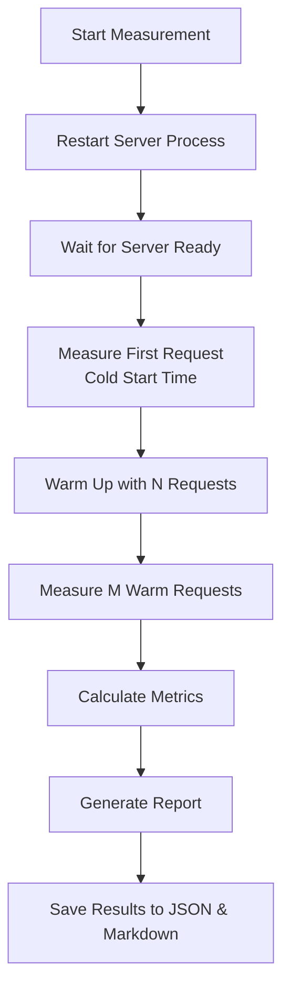
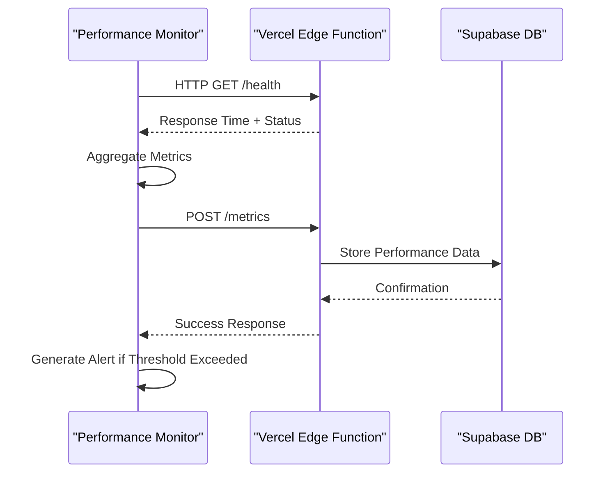

# Performance Validation

<cite>
**Referenced Files in This Document**   
- [performance-budgets.test.ts](file://tools/quality/src/performance/performance-budgets.test.ts)
- [cold-start-measurement.ts](file://tools/quality/src/performance/cold-start-measurement.ts)
- [performance-monitor.js](file://apps/api/scripts/performance-monitor.js)
- [lighthouserc.js](file://lighthouserc.js)
- [lighthouse-budget.json](file://lighthouse-budget.json)
- [validate-performance-budgets.sh](file://tools/performance/validate-performance-budgets.sh)
- [healthcare-performance-monitor/index.ts](file://supabase/functions/healthcare-performance-monitor/index.ts)
</cite>

## Table of Contents
1. [Performance Budget Enforcement](#performance-budget-enforcement)
2. [Cold Start Measurement for Serverless Functions](#cold-start-measurement-for-serverless-functions)
3. [Real-User Monitoring with Vercel Edge Functions](#real-user-monitoring-with-vercel-edge-functions)
4. [Integration with CI/CD Quality Gates](#integration-with-cicd-quality-gates)
5. [Handling Test Environment Variability](#handling-test-environment-variability)
6. [Configuring Custom Performance Budgets](#configuring-custom-performance-budgets)

## Performance Budget Enforcement

The performance budget enforcement system ensures healthcare application responsiveness meets clinical workflow requirements through strict thresholds defined in `lighthouserc.js` and `lighthouse-budget.json`. These budgets are validated using Lighthouse CI, which runs automated audits against predefined metrics critical to patient care.

Healthcare-specific performance budgets include:
- **Largest Contentful Paint (LCP)**: ≤2000ms (2 seconds) - ensures key medical content loads quickly
- **First Contentful Paint (FCP)**: ≤1500ms (1.5 seconds) - guarantees rapid initial feedback
- **Cumulative Layout Shift (CLS)**: ≤0.05 - maintains interface stability during data loading
- **Total Blocking Time (TBT)**: ≤200ms - preserves interactivity for clinical workflows
- **Interaction to Next Paint (INP)**: ≤150ms - ensures responsive UI interactions

These budgets are enforced via the `performance-budgets.test.ts` test suite, which validates that configuration files contain appropriate thresholds. The test intentionally creates violation scenarios to verify detection mechanisms work correctly. For example, it checks that impossible budgets (e.g., 1ms LCP) trigger proper error responses, confirming the validation system functions as expected.

The validation process is integrated into the CI/CD pipeline through a shell script (`validate-performance-budgets.sh`) that executes `lhci autorun` with healthcare-specific settings. This script verifies compliance before deployment, preventing performance regressions from reaching production environments where they could impact patient safety.

**Section sources**
- [performance-budgets.test.ts](file://tools/quality/src/performance/performance-budgets.test.ts#L91-L127)
- [lighthouserc.js](file://lighthouserc.js#L80-L100)
- [lighthouse-budget.json](file://lighthouse-budget.json#L5-L25)
- [validate-performance-budgets.sh](file://tools/performance/validate-performance-budgets.sh#L25-L35)

## Cold Start Measurement for Serverless Functions

Cold start measurement is implemented through `cold-start-measurement.ts`, a specialized tool designed to evaluate serverless function initialization times on Vercel Edge Runtime. This component simulates cold start conditions by restarting the server process between requests, then measures the time difference between the first (cold) request and subsequent (warm) requests.

The measurement process follows these steps:
1. Simulate cold start by terminating and restarting the API server
2. Measure response time of the first request after restart
3. Execute warm-up requests to establish baseline performance
4. Measure multiple subsequent requests to calculate average warm execution time
5. Calculate cold start penalty as the difference between cold and warm times

Key metrics captured include:
- Initial startup duration
- First request response time (cold)
- Average warm request time
- Cold start delta (penalty)
- Memory usage patterns
- Environmental context (Node.js version, platform)

This approach provides accurate assessment of serverless function performance under real-world conditions where instances may be spun down due to inactivity. The results help identify optimization opportunities such as reducing bundle size, minimizing imports in entry points, and implementing dynamic imports for heavy dependencies.



**Diagram sources **
- [cold-start-measurement.ts](file://tools/quality/src/performance/cold-start-measurement.ts#L100-L300)

**Section sources**
- [cold-start-measurement.ts](file://tools/quality/src/performance/cold-start-measurement.ts#L32-L398)

## Real-User Monitoring with Vercel Edge Functions

Real-user monitoring is implemented through `performance-monitor.js`, which integrates with Vercel edge functions to track actual user experience metrics. This monitoring system collects data on response times, availability, error rates, and bundle sizes across critical healthcare endpoints.

The monitoring configuration defines strict SLA requirements essential for clinical operations:
- Maximum response time: <100ms
- Minimum availability: 99.9%
- Maximum error rate: <0.1%
- Bundle size limit: 244KB (Vercel edge runtime constraint)

Monitored endpoints include `/api/health/check`, `/api/compliance/report`, `/api/patients/lookup`, `/api/telemedicine/session`, and `/api/anvisa/adverse-events`. The monitor performs health checks every minute, calculating rolling averages for key metrics and generating alerts when thresholds are exceeded.

Data collection occurs through the Supabase edge function `healthcare-performance-monitor/index.ts`, which receives performance metrics and stores them in the database. This function implements Brazilian healthcare compliance requirements (LGPD, CFM, ANVISA) with specific thresholds for different service levels:
- Excellent: <50ms response time
- Good: <100ms response time  
- Acceptable: <200ms response time
- Critical: >500ms response time

The system automatically generates performance alerts based on threshold violations and provides dashboard data for monitoring tools. This real-time visibility enables rapid detection and resolution of performance issues that could impact patient care.



**Diagram sources **
- [performance-monitor.js](file://apps/api/scripts/performance-monitor.js#L40-L87)
- [healthcare-performance-monitor/index.ts](file://supabase/functions/healthcare-performance-monitor/index.ts#L150-L200)

**Section sources**
- [performance-monitor.js](file://apps/api/scripts/performance-monitor.js#L0-L43)
- [healthcare-performance-monitor/index.ts](file://supabase/functions/healthcare-performance-monitor/index.ts#L0-L150)

## Integration with CI/CD Quality Gates

Performance validation is tightly integrated with the CI/CD pipeline through quality gates that enforce healthcare-specific requirements at each stage of development. The quality gate system evaluates multiple dimensions including security, code quality, test coverage, performance, and compliance.

Performance quality gates are configured with thresholds that align with clinical workflow requirements:
- Maximum response time: 100ms
- Minimum availability: 99.9%
- Maximum error rate: 0.1%

These gates are validated in the orchestration layer (`quality-gates.ts`), which coordinates testing phases and ensures all requirements are met before progression to the next stage. The system skips performance testing during red phases (initial implementation) but enforces strict validation during green and refactor phases.

When performance budgets are violated, the CI/CD pipeline fails the build, preventing deployment of substandard code. The validation script (`validate-performance-budgets.sh`) runs as part of the continuous integration workflow, executing Lighthouse CI audits and reporting results to GitHub Actions. This integration ensures that every commit is evaluated against healthcare performance standards.

The quality gate system also supports statistical analysis of performance data over time, enabling trend identification and regression detection. Historical data is used to establish baselines and detect gradual degradation that might not trigger immediate threshold violations but could accumulate into significant issues.

**Section sources**
- [quality-gates.ts](file://tools/quality/src/orchestrator/quality-gates.ts#L264-L308)
- [validate-performance-budgets.sh](file://tools/performance/validate-performance-budgets.sh#L25-L35)
- [ci.yml](file://.github/workflows/ci.yml#L50-L60)

## Handling Test Environment Variability

Test environment variability is addressed through statistical analysis and tolerance-based thresholds rather than fixed limits. The performance budget system incorporates tolerance values in `lighthouse-budget.json` to account for normal fluctuations in test conditions.

For example, timing metrics include both budget and tolerance values:
- LCP: budget 2000ms, tolerance 300ms
- FCP: budget 1500ms, tolerance 200ms  
- TBT: budget 200ms, tolerance 50ms

This approach recognizes that minor variations in network conditions, CPU load, and other environmental factors can affect measurements without indicating actual performance degradation. By analyzing multiple runs (configured as `numberOfRuns: 3` in `lighthouserc.js`), the system establishes confidence intervals and reduces false positives.

Additional strategies for managing variability include:
- Using desktop preset with controlled throttling parameters
- Running tests against local preview servers to minimize network effects
- Implementing retry logic for transient failures
- Collecting historical data for trend analysis
- Applying statistical significance testing to performance changes

The cold start measurement tool further mitigates variability by averaging results across multiple warm requests and providing percentile-based metrics (minimum, maximum, P95). This comprehensive approach ensures that performance validation reflects true application characteristics rather than temporary environmental conditions.

**Section sources**
- [lighthouse-budget.json](file://lighthouse-budget.json#L10-L30)
- [lighthouserc.js](file://lighthouserc.js#L40-L50)
- [cold-start-measurement.ts](file://tools/quality/src/performance/cold-start-measurement.ts#L200-L250)

## Configuring Custom Performance Budgets

Custom performance budgets for telemedicine applications can be configured by modifying the `lighthouse-budget.json` file or creating application-specific variants. The budget configuration supports path-based rules, allowing different thresholds for various parts of the application.

To configure custom budgets:
1. Define path patterns (e.g., `/dashboard*`, `/consultation*`)
2. Set timing budgets for core web vitals
3. Configure resource size limits by type (script, image, font, etc.)
4. Specify resource count limits
5. Adjust tolerance values based on expected variability

Example configuration for a telemedicine video consultation interface:
```json
{
  "path": "/consultation*",
  "timings": [
    {
      "metric": "first-contentful-paint",
      "budget": 1200,
      "tolerance": 150
    },
    {
      "metric": "largest-contentful-paint",
      "budget": 1800,
      "tolerance": 250
    },
    {
      "metric": "interactive",
      "budget": 3000,
      "tolerance": 400
    }
  ],
  "resourceSizes": [
    {
      "resourceType": "script",
      "budget": 600
    },
    {
      "resourceType": "media",
      "budget": 500
    },
    {
      "resourceType": "total",
      "budget": 1800
    }
  ]
}
```

This configuration prioritizes faster initial rendering (1.2s FCP) while accommodating larger media resources needed for video consultations. The system automatically applies the most specific matching rule based on URL path, enabling tailored performance requirements across different application modules.

**Section sources**
- [lighthouse-budget.json](file://lighthouse-budget.json#L0-L160)
- [lighthouserc.js](file://lighthouserc.js#L70-L90)