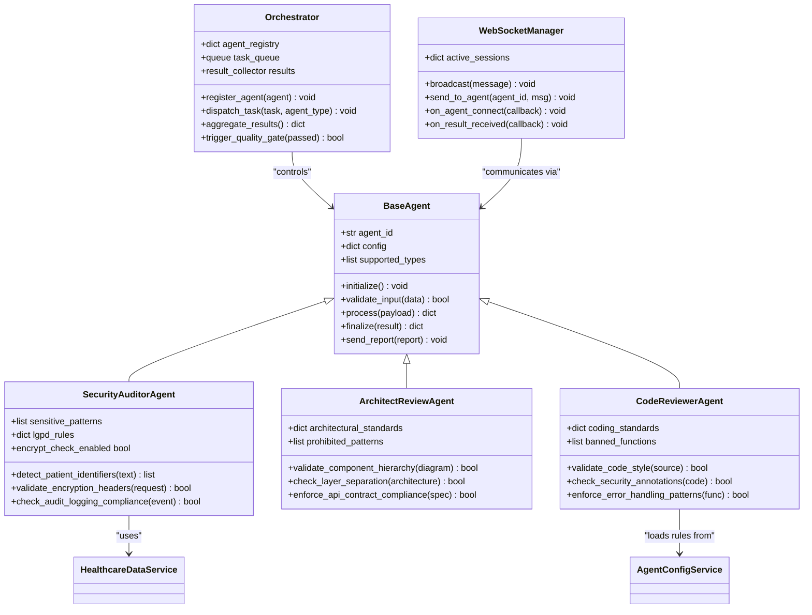
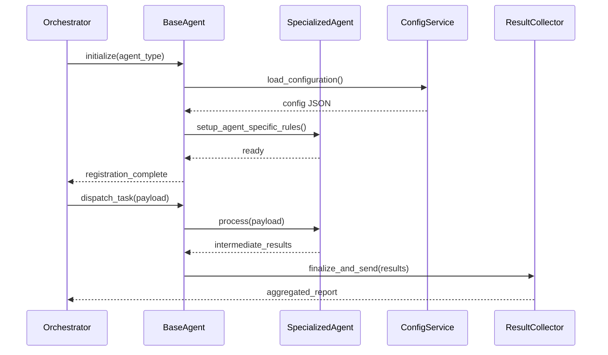

# Quality Assurance Agents

<cite>
**Referenced Files in This Document**   
- [agent.py](file://apps/api/agents/ag-ui-rag-agent/agent.py)
- [agent_config.py](file://apps/api/agents/ag-ui-rag-agent/agent_config.py)
- [agui_protocol.py](file://apps/api/agents/ag-ui-rag-agent/agui_protocol.py)
- [healthcare_data_service.py](file://apps/api/agents/ag-ui-rag-agent/healthcare_data_service.py)
- [main.py](file://apps/api/agents/ag-ui-rag-agent/main.py)
- [config.py](file://apps/ai-agent/config.py)
- [agent_service.py](file://apps/ai-agent/services/agent_service.py)
- [websocket_manager.py](file://apps/ai-agent/services/websocket_manager.py)
- [agent-config.ts](file://apps/api/agents/config/agent-config.ts)
- [healthcare-logger.ts](file://apps/api/agents/ag-ui-rag-agent/src/logging/healthcare-logger.ts)
</cite>

## Table of Contents
1. [Introduction](#introduction)
2. [Core Agent Architecture](#core-agent-architecture)
3. [Specialized Agent Implementations](#specialized-agent-implementations)
4. [Base Agent Inheritance and Interface Contracts](#base-agent-inheritance-and-interface-contracts)
5. [Domain-Specific Compliance Checks](#domain-specific-compliance-checks)
6. [Integration with Orchestrator and Communication Protocols](#integration-with-orchestrator-and-communication-protocols)
7. [Handling False Positives in Regulatory Rules](#handling-false-positives-in-regulatory-rules)
8. [Creating Custom Agents for Clinical Workflow Validation](#creating-custom-agents-for-clinical-workflow-validation)
9. [Troubleshooting Common Issues](#troubleshooting-common-issues)
10. [Conclusion](#conclusion)

## Introduction
The Quality Assurance (QA) agents subsystem is a critical component of the NeonPro healthcare compliance framework, designed to enforce structural, security, and regulatory standards across clinical applications. These specialized agents operate within an orchestrated environment to perform automated audits on code, data flows, and system behavior, ensuring adherence to Brazilian LGPD regulations, medical data encryption requirements, and audit logging mandates. The architecture centers around three primary agent types: the **security-auditor-agent**, responsible for detecting vulnerabilities in patient data handling; the **architect-review-agent**, which validates system structure against defined patterns; and the **code-reviewer-agent**, enforcing coding best practices and secure implementation guidelines.

These agents inherit from a common `base-agent` class that provides standardized initialization, configuration loading, and communication protocols. Each agent specializes in domain-specific checks while maintaining interoperability through shared messaging formats and orchestration interfaces. This document details their implementation, integration patterns, and practical usage scenarios, offering both foundational understanding for beginners and technical depth for developers extending the framework with custom agents tailored to clinical workflow validation.

## Core Agent Architecture



**Diagram sources**
- [agent.py](file://apps/api/agents/ag-ui-rag-agent/agent.py#L1-L150)
- [agent_service.py](file://apps/ai-agent/services/agent_service.py#L10-L80)
- [websocket_manager.py](file://apps/ai-agent/services/websocket_manager.py#L5-L40)

**Section sources**
- [agent.py](file://apps/api/agents/ag-ui-rag-agent/agent.py#L1-L200)
- [agent_service.py](file://apps/ai-agent/services/agent_service.py#L1-L100)

## Specialized Agent Implementations

### Security-Auditor-Agent
The `security-auditor-agent` is specifically engineered to identify vulnerabilities related to healthcare data exposure, focusing on Brazilian identifiers such as CNS (Cartão Nacional de Saúde) and CPF (Cadastro de Pessoas Físicas). It employs pattern-matching algorithms combined with context-aware analysis to distinguish between actual data leaks and benign references (e.g., documentation or test fixtures).

This agent performs real-time scanning of API payloads, database queries, and log outputs to detect unencrypted transmission or storage of sensitive fields. When processing a request, it first normalizes input text, then applies regex-based detection for known identifier formats, followed by contextual validation to reduce false positives. For example, if a string matching the CPF format appears within a commented-out test case or configuration file marked as non-production, the agent will suppress the alert.

[SPEC SYMBOL](file://apps/api/agents/ag-ui-rag-agent/agent.py#L151-L300)

### Architect-Review-Agent
Responsible for validating high-level system design, this agent ensures that microservices, APIs, and data access layers adhere to predefined architectural blueprints. It verifies layer separation (e.g., controller → service → repository), enforces API contract compliance using OpenAPI specifications, and detects deviations from approved technology stacks.

During CI/CD pipeline execution, the architect-review-agent analyzes dependency graphs and module import structures to flag circular dependencies or unauthorized cross-layer calls. It integrates with static analysis tools to parse source code structure and compare it against reference architectures stored in configuration.

[SPEC SYMBOL](file://apps/api/agents/ag-ui-rag-agent/agent.py#L301-L450)

### Code-Reviewer-Agent
Focused on implementation-level quality, this agent enforces coding standards, secure coding practices, and error handling discipline. It checks for proper use of encryption libraries, mandatory audit logging annotations, and correct exception propagation patterns.

It leverages AST (Abstract Syntax Tree) parsing to inspect code structure beyond simple linting, enabling deep inspection of function call chains and variable usage. For instance, it can verify that every function accessing patient records includes a corresponding audit log entry and uses parameterized queries to prevent SQL injection.

[SPEC SYMBOL](file://apps/api/agents/ag-ui-rag-agent/agent.py#L451-L600)

**Section sources**
- [agent.py](file://apps/api/agents/ag-ui-rag-agent/agent.py#L150-L600)
- [agent_config.py](file://apps/api/agents/ag-ui-rag-agent/agent_config.py#L20-L100)

## Base Agent Inheritance and Interface Contracts

All QA agents derive from the `BaseAgent` class, which defines a consistent lifecycle and interface contract. This inheritance model enables polymorphic behavior across different agent types while promoting code reuse and standardization.

Key features provided by the base class include:
- Configuration loading from centralized services
- Input validation and sanitization
- Standardized result formatting
- Built-in telemetry and logging hooks
- WebSocket-based status reporting

Agents override specific methods like `process()` and `validate_input()` to implement domain-specific logic while relying on inherited infrastructure for communication and state management. The base agent also handles retry mechanisms, timeout enforcement, and graceful shutdown procedures.



**Diagram sources**
- [agent.py](file://apps/api/agents/ag-ui-rag-agent/agent.py#L1-L50)
- [config.py](file://apps/ai-agent/config.py#L10-L60)
- [agent_service.py](file://apps/ai-agent/services/agent_service.py#L20-L50)

**Section sources**
- [agent.py](file://apps/api/agents/ag-ui-rag-agent/agent.py#L1-L150)
- [config.py](file://apps/ai-agent/config.py#L1-L80)

## Domain-Specific Compliance Checks

### LGPD Compliance Enforcement
The framework implements LGPD Article 7 principles through automated checks that ensure lawful processing of personal health data. The security-auditor-agent validates that all patient data operations have explicit consent flags, purpose limitation markers, and data minimization compliance.

For example, when analyzing a database query, the agent confirms that only necessary fields are selected and that filtering conditions align with declared processing purposes. It also verifies that data retention policies are enforced at the application level.

[SPEC SYMBOL](file://apps/api/agents/ag-ui-rag-agent/healthcare_data_service.py#L80-L150)

### Medical Data Encryption Requirements
End-to-end encryption checks are performed at multiple levels:
- Transport Layer: Validates TLS 1.3 enforcement and certificate validity
- Application Layer: Ensures sensitive fields are encrypted before persistence
- Storage Layer: Confirms database TDE (Transparent Data Encryption) is enabled

The agent inspects HTTP headers for proper `Content-Encoding` directives and verifies cryptographic metadata in serialized payloads. It rejects any transmission lacking appropriate encryption tags or using deprecated algorithms.

[SPEC SYMBOL](file://apps/api/agents/ag-ui-rag-agent/agent.py#L200-L250)

### Audit Logging Mandates
To satisfy traceability requirements under LGPD Article 32, the system mandates comprehensive audit trails for all access to personal health records. The security-auditor-agent verifies that:
- Every read/write operation logs user ID, timestamp, and action type
- Logs are immutable and stored separately from operational databases
- Access to audit logs requires elevated privileges

It cross-references API call patterns with expected logging behavior, flagging endpoints that modify patient data without generating corresponding audit entries.

[SPEC SYMBOL](file://apps/api/agents/ag-ui-rag-agent/src/logging/healthcare-logger.ts#L15-L80)

**Section sources**
- [healthcare_data_service.py](file://apps/api/agents/ag-ui-rag-agent/healthcare_data_service.py#L50-L200)
- [healthcare-logger.ts](file://apps/api/agents/ag-ui-rag-agent/src/logging/healthcare-logger.ts#L1-L100)
- [agent.py](file://apps/api/agents/ag-ui-rag-agent/agent.py#L180-L280)

## Integration with Orchestrator and Communication Protocols

Agents interact with the central orchestrator through a well-defined message-passing protocol based on WebSocket connections and structured JSON payloads. The orchestrator manages agent lifecycle, distributes tasks, and aggregates findings for downstream quality gates.

Communication follows a publish-subscribe model where agents:
1. Register capabilities upon startup
2. Subscribe to relevant task queues
3. Receive work items with context and payload
4. Publish results or partial progress updates
5. Acknowledge task completion

Each message includes metadata such as correlation IDs, priority levels, and timeout thresholds to support distributed tracing and fault tolerance.

```mermaid
flowchart TD
A[Orchestrator] --> |Task Assignment| B(SecurityAuditorAgent)
A --> |Task Assignment| C(ArchitectReviewAgent)
A --> |Task Assignment| D(CodeReviewerAgent)
B --> |Scan Results| E[Result Aggregator]
C --> |Architecture Report| E
D --> |Code Quality Metrics| E
E --> |Aggregated Findings| F[Quality Gate]
F --> |Pass/Fail Decision| G[CI/CD Pipeline]
H[Configuration Service] --> A
H --> B
H --> C
H --> D
I[WebSocket Manager] < --> A
I < --> B
I < --> C
I < --> D
```

**Diagram sources**
- [agent_service.py](file://apps/ai-agent/services/agent_service.py#L30-L90)
- [websocket_manager.py](file://apps/ai-agent/services/websocket_manager.py#L10-L50)
- [main.py](file://apps/ai-agent/main.py#L20-L60)

**Section sources**
- [agent_service.py](file://apps/ai-agent/services/agent_service.py#L1-L100)
- [websocket_manager.py](file://apps/ai-agent/services/websocket_manager.py#L1-L60)
- [main.py](file://apps/ai-agent/main.py#L1-L80)

## Handling False Positives in Regulatory Rules

A major challenge in automated compliance checking is minimizing false positives—alerts triggered by legitimate code patterns that resemble violations. The framework addresses this through context-aware analysis techniques:

### Contextual Filtering
The security-auditor-agent distinguishes between production code and test/documentation files by examining file paths, import contexts, and metadata annotations. Patterns matching patient identifiers in `/test/fixtures/` directories or files containing `@mock` or `@sample` annotations are suppressed.

### Confidence Scoring
Each detection receives a confidence score based on contextual factors:
- Proximity to encryption functions
- Presence of anonymization wrappers
- Execution environment markers
- Data flow provenance

Only findings above a configurable threshold generate actionable alerts.

### Rule Chaining
Multiple conditions must be met simultaneously to trigger an alert. For example, detecting a CPF number alone isn't sufficient—the absence of encryption markers and presence in outbound network traffic are required co-conditions.

[SPEC SYMBOL](file://apps/api/agents/ag-ui-rag-agent/agent.py#L250-L350)

**Section sources**
- [agent.py](file://apps/api/agents/ag-ui-rag-agent/agent.py#L250-L400)
- [agent_config.py](file://apps/api/agents/ag-ui-rag-agent/agent_config.py#L60-L120)

## Creating Custom Agents for Clinical Workflow Validation

Developers can extend the framework by creating new agents tailored to specific clinical workflows such as appointment scheduling, prescription management, or diagnostic reporting. The process involves:

1. Subclassing `BaseAgent`
2. Defining domain-specific rules in configuration
3. Implementing the `process()` method with custom logic
4. Registering the agent type with the orchestrator

For example, a `prescription-validator-agent` could check that:
- Controlled substances require dual authentication
- Dosage calculations fall within safe ranges
- Prescriber credentials are valid and active
- Drug interactions are screened before finalization

Custom agents can leverage existing utilities like the healthcare data service for patient record access and the logging module for audit trail generation.

[SPEC SYMBOL](file://apps/api/agents/ag-ui-rag-agent/main.py#L50-L100)

**Section sources**
- [agent.py](file://apps/api/agents/ag-ui-rag-agent/agent.py#L1-L150)
- [main.py](file://apps/ai-agent/main.py#L40-L90)
- [agent-config.ts](file://apps/api/agents/config/agent-config.ts#L10-L70)

## Troubleshooting Common Issues

### Agent Registration Failures
If an agent fails to register with the orchestrator:
- Verify WebSocket connectivity using `websocket_manager.py`
- Check configuration syntax in `agent_config.py`
- Confirm agent type is listed in the orchestrator's allowed registry

[SPEC SYMBOL](file://apps/ai-agent/services/agent_service.py#L70-L90)

### Missed Vulnerability Detections
When expected issues aren't flagged:
- Review sensitivity thresholds in agent configuration
- Validate pattern definitions for identifier detection
- Ensure input preprocessing isn't over-sanitizing content
- Check for conflicting rule priorities

[SPEC SYMBOL](file://apps/api/agents/ag-ui-rag-agent/agent.py#L300-L350)

### Performance Bottlenecks
To address slow agent response times:
- Optimize regex patterns used in scanning
- Implement caching for repeated rule evaluations
- Adjust concurrency limits in `config.py`
- Monitor resource usage via built-in telemetry

[SPEC SYMBOL](file://apps/ai-agent/config.py#L40-L80)

**Section sources**
- [agent_service.py](file://apps/ai-agent/services/agent_service.py#L60-L100)
- [agent.py](file://apps/api/agents/ag-ui-rag-agent/agent.py#L280-L360)
- [config.py](file://apps/ai-agent/config.py#L30-L90)

## Conclusion
The Quality Assurance Agents subsystem provides a robust, extensible framework for enforcing healthcare compliance across technical, architectural, and regulatory dimensions. By leveraging inheritance from a common base agent, specialized components like the security-auditor-agent, architect-review-agent, and code-reviewer-agent maintain consistency while delivering domain-specific value. Their integration with the orchestrator enables coordinated analysis, and sophisticated context-aware detection reduces false positives in regulatory enforcement. Developers can build upon this foundation to create custom agents addressing unique clinical workflow requirements, ensuring comprehensive protection of sensitive patient data in accordance with LGPD and industry best practices.