# Quality Assurance Tools

<cite>
**Referenced Files in This Document **
- [parallel-quality-check.sh](file://tools/quality/parallel-quality-check.sh)
- [oxlint.config.mjs](file://tools/quality/oxlint.config.mjs)
- [dprint.json](file://tools/quality/dprint.json)
- [security-auditor-agent.ts](file://tools/quality/src/orchestrator/agents/security-auditor-agent.ts)
- [types.ts](file://tools/quality/src/orchestrator/types.ts)
</cite>

## Table of Contents

1. [Introduction](#introduction)
2. [Core Quality Enforcement Tools](#core-quality-enforcement-tools)
3. [Parallel Quality Check Orchestration](#parallel-quality-check-orchestration)
4. [Security Auditor Agent Implementation](#security-auditor-agent-implementation)
5. [Healthcare-Specific Compliance Rules](#healthcare-specific-compliance-rules)
6. [False Positive Management and Rule Customization](#false-positive-management-and-rule-customization)
7. [Creating Custom Quality Rules for Medical Data](#creating-custom-quality-rules-for-medical-data)
8. [CI/CD Integration Strategy](#cicd-integration-strategy)
9. [Conclusion](#conclusion)

## Introduction

The NeonPro platform implements a comprehensive quality assurance system designed to enforce code quality, formatting standards, and security compliance across all components. This document details the implementation of key quality tools including oxlint for static analysis, dprint for code formatting, and the security-auditor-agent for healthcare-specific vulnerability scanning. The system is orchestrated through the parallel-quality-check.sh script that integrates these tools into a cohesive quality control pipeline. This documentation provides both beginner-friendly explanations and technical depth for developers creating custom rules for medical data handling.

## Core Quality Enforcement Tools

The quality assurance system is built on three core tools that work together to maintain code integrity:

### Oxlint Static Analysis

Oxlint serves as the primary static analysis tool, providing 50x faster performance compared to traditional ESLint while maintaining comprehensive rule coverage. The configuration in `oxlint.config.mjs` includes specialized rules for TypeScript safety, React best practices, accessibility (WCAG 2.1 AA+), and security vulnerabilities.

### Dprint Formatting

Dprint ensures consistent code formatting across the codebase with near-instantaneous formatting checks. The configuration in `dprint.json` defines style rules for TypeScript, JavaScript, JSON, and Markdown files, with specific settings for line width, indentation, and syntax preferences.

### Security Auditor Agent

The security-auditor-agent performs specialized security validation with a focus on healthcare compliance requirements. It operates as part of the TDD orchestration system, providing phase-specific security recommendations during red, green, and refactor cycles.

**Section sources**

- [oxlint.config.mjs](file://tools/quality/oxlint.config.mjs#L1-L162)
- [dprint.json](file://tools/quality/dprint.json#L1-L68)
- [security-auditor-agent.ts](file://tools/quality/src/orchestrator/agents/security-auditor-agent.ts#L1-L677)

## Parallel Quality Check Orchestration

```mermaid
flowchart TD
Start([Parallel Quality Check]) --> CheckSelection["Determine Execution Method"]
CheckSelection --> GNUAvailable{"GNU Parallel Available?"}
GNUAvailable --> |Yes| RunParallel["Run oxlint, dprint, typecheck in parallel via GNU parallel"]
GNUAvailable --> |No| BackgroundProcesses["Start background processes for each check"]
RunParallel --> WaitAll["Wait for all processes to complete"]
BackgroundProcesses --> OXLINT[run_oxlint &]
BackgroundProcesses --> DPRINT[run_dprint &]
BackgroundProcesses --> TYPECHECK[run_typecheck &]
OXLINT --> WaitOXLINT["wait $OXLINT_PID"]
DPRINT --> WaitDPRINT["wait $DPRINT_PID"]
TYPECHECK --> WaitTYPECHECK["wait $TYPECHECK_PID"]
WaitOXLINT --> CollectResults["Collect exit codes"]
WaitDPRINT --> CollectResults
WaitTYPECHECK --> CollectResults
CollectResults --> AllPassed{"All checks passed?"}
AllPassed --> |Yes| Success["🎉 All quality checks passed!"]
AllPassed --> |No| Failure["💥 Some quality checks failed!"]
Success --> Exit0["exit 0"]
Failure --> Exit1["exit 1"]
```



**Diagram sources **

- [parallel-quality-check.sh](file://tools/quality/parallel-quality-check.sh#L1-L86)

**Section sources**

- [parallel-quality-check.sh](file://tools/quality/parallel-quality-check.sh#L1-L86)

The `parallel-quality-check.sh` script orchestrates multiple quality checks by running oxlint, dprint, and TypeScript type checking in parallel. This approach maximizes performance by leveraging concurrent execution. The script first attempts to use GNU parallel for optimal efficiency, falling back to background processes if GNU parallel is not available. Each quality check runs independently, and the script collects results to determine overall success or failure. This parallel execution reduces total quality check time from sequential minutes to near-instantaneous completion, making it suitable for pre-commit hooks and CI/CD pipelines.

## Security Auditor Agent Implementation

```mermaid
classDiagram
class BaseAgent {
+agentType : string
+constructor(agentType : string)
+canHandle(phase : TDDPhase, context : FeatureContext) : boolean
+execute(phase : TDDPhase, context : FeatureContext) : Promise~AgentResult~
+createFinding(type : FindingType, description : string, severity : Priority, location : string, suggestion : string) : Finding
+createRecommendation(type : RecommendationType, description : string, priority : Priority, action : string) : Recommendation
}
class SecurityAuditorAgent {
-startTime : number
-findings : Finding[]
-recommendations : Recommendation[]
+constructor()
+canHandle(phase : TDDPhase, context : FeatureContext) : boolean
+executePhase(phase : TDDPhase, context : FeatureContext) : Promise~AgentResult~
+executeRedPhase(context : FeatureContext, findings : Finding[], recommendations : Recommendation[]) : Promise~void~
+executeGreenPhase(context : FeatureContext, findings : Finding[], recommendations : Recommendation[]) : Promise~void~
+executeRefactorPhase(context : FeatureContext, findings : Finding[], recommendations : Recommendation[]) : Promise~void~
+calculateRiskScore(findings : Finding[]) : number
+getCapabilities() : string[]
+getConfiguration() : Record~string, any~
}
BaseAgent <|-- SecurityAuditorAgent : "extends"
class FeatureContext {
+name : string
+description : string
+domain : string | string[]
+complexity : number | ComplexityLevel
+securityCritical : boolean
+complianceRequirements : string[]
+files : {implementation? : string, tests? : string}
}
class AgentResult {
+agent : AgentName
+phase : TDDPhase
+status : "success" | "failure"
+findings : Finding[]
+recommendations : Recommendation[]
+metrics : Record~string, number~
+duration : number
}
SecurityAuditorAgent --> FeatureContext : "analyzes"
SecurityAuditorAgent --> AgentResult : "produces"
```

**Diagram sources **

- [security-auditor-agent.ts](file://tools/quality/src/orchestrator/agents/security-auditor-agent.ts#L1-L677)
- [types.ts](file://tools/quality/src/orchestrator/types.ts#L1-L333)

**Section sources**

- [security-auditor-agent.ts](file://tools/quality/src/orchestrator/agents/security-auditor-agent.ts#L1-L677)
- [types.ts](file://tools/quality/src/orchestrator/types.ts#L1-L333)

The SecurityAuditorAgent extends the BaseAgent class and implements comprehensive security validation across all TDD phases. The agent's `canHandle` method determines eligibility based on feature characteristics such as security criticality, compliance requirements, and domain relevance (auth, payment, data, api, user). During execution, the agent delegates to phase-specific methods (`executeRedPhase`, `executeGreenPhase`, `executeRefactorPhase`) that generate findings and recommendations appropriate to the current development stage.

In the RED phase, the agent focuses on security test planning and threat modeling, identifying areas that require comprehensive security testing strategies. In the GREEN phase, it validates implementation security, checking for proper input validation, authentication mechanisms, data encryption, and secure error handling. In the REFACTOR phase, it performs comprehensive security analysis, recommending architectural improvements, cryptographic best practices, access control hardening, and compliance automation.

The agent calculates a risk score based on finding severity, providing a quantitative measure of security posture. It also exposes its capabilities and configuration through dedicated methods, enabling integration with the broader orchestration system.

## Healthcare-Specific Compliance Rules


**Diagram sources **

- [security-auditor-agent.ts](file://tools/quality/src/orchestrator/agents/security-auditor-agent.ts#L1-L677)
- [oxlint.config.mjs](file://tools/quality/oxlint.config.mjs#L1-L162)

**Section sources**

- [security-auditor-agent.ts](file://tools/quality/src/orchestrator/agents/security-auditor-agent.ts#L1-L677)
- [oxlint.config.mjs](file://tools/quality/oxlint.config.mjs#L1-L162)

The security-auditor-agent performs healthcare-specific vulnerability scanning by analyzing the FeatureContext object passed to it during TDD cycles. When processing features with healthcare-related domains or compliance requirements, the agent applies specialized rules that address medical data handling concerns.

For example, when `context.complianceRequirements` includes standards like HIPAA or LGPD, the agent generates findings requiring compliance validation testing and recommends implementing automated compliance checking with audit trail generation. For features handling patient data (`context.domain.includes("data")` or `context.domain.includes("user")`), the agent mandates privacy protection improvements, recommending data anonymization, user consent management, and privacy-preserving techniques.

The agent's configuration explicitly lists healthcare-relevant compliance standards including GDPR, HIPAA, PCI-DSS, SOX, and CCPA. It also identifies vulnerability categories particularly relevant to healthcare applications, such as data exposure, access control, and logging. These specialized rules ensure that medical data handling receives appropriate scrutiny throughout the development lifecycle.

## False Positive Management and Rule Customization


**Diagram sources **

- [oxlint.config.mjs](file://tools/quality/oxlint.config.mjs#L1-L162)

**Section sources**

- [oxlint.config.mjs](file://tools/quality/oxlint.config.mjs#L1-L162)

The quality assurance system addresses false positives in healthcare compliance rules through strategic rule customization and suppression patterns. The oxlint configuration employs file-specific overrides to reduce false positives in appropriate contexts:

1. **Test files**: The override for `**/*.test.{ts,tsx}` disables strict rules like `no-console`, `no-unused-vars`, and `typescript/no-explicit-any` which are commonly needed in test code but would trigger warnings in production code.

2. **Configuration files**: The override for `**/*.config.{js,ts}` disables `import/no-extraneous-dependencies` since configuration files often reference development dependencies not listed in package.json.

3. **Compliance modules**: Files in `src/compliance/**` have stricter rules enforced, including mandatory console usage and enhanced security checks, ensuring compliance-critical code meets higher standards.

4. **Agent implementations**: Files in `src/agents/**` require JSDoc documentation and prohibit non-null assertions, maintaining high documentation standards for critical components.

The system also supports standard suppression patterns:

- Single-line suppression: `// eslint-disable-line rule-name`
- Block suppression: `/* eslint-disable rule-name */`
- File-level suppression: `/* eslint-disable-next*/` at the top of a file

These patterns allow developers to address legitimate false positives while maintaining overall code quality. The security-auditor-agent itself contributes to false positive reduction by considering context before generating findings, only flagging issues relevant to the feature's domain and compliance requirements.

## Creating Custom Quality Rules for Medical Data

Developers can create custom quality rules for medical data handling by extending the existing quality assurance framework. The process involves several approaches depending on the type of rule needed:

For static analysis rules related to medical data, developers can extend the oxlint configuration by adding new rules to the `rules` section of `oxlint.config.mjs`. For example, to enforce PHI (Protected Health Information) handling standards:

```javascript
// Example custom rule addition
'custom/phi-handling': ['error', {
  'requireEncryption': true,
  'prohibitLocalStorage': true,
  'requireAuditLogging': true
}]
```

For behavioral rules within the TDD process, developers can extend the SecurityAuditorAgent by adding phase-specific logic. For instance, in the `executeGreenPhase` method, additional checks could validate that medical data fields are properly encrypted:

```typescript
// Example extension to executeGreenPhase
if (context.domain.includes('medical-data') || context.files?.implementation?.includes('phi')) {
  findings.push(
    this.createFinding(
      'security-implementation',
      'Medical data handling requires PHI encryption validation',
      'critical',
      context.files.implementation,
      'Ensure all PHI fields are encrypted using approved algorithms and key management practices',
    ),
  );
}
```

Custom rules should follow the existing pattern of severity classification (critical, high, medium, low) and provide actionable suggestions. They should also consider the TDD phase, with red-phase rules focusing on test planning, green-phase rules on implementation validation, and refactor-phase rules on architectural improvements.

When creating rules for medical data, developers should reference established healthcare standards such as HIPAA, GDPR Article 9, and NIST 800-66. Rules should distinguish between different types of medical data (PHI, EHI, research data) and apply appropriate requirements to each.

**Section sources**

- [oxlint.config.mjs](file://tools/quality/oxlint.config.mjs#L1-L162)
- [security-auditor-agent.ts](file://tools/quality/src/orchestrator/agents/security-auditor-agent.ts#L1-L677)

## CI/CD Integration Strategy

The quality assurance tools are integrated into the CI/CD pipeline through the `parallel-quality-check.sh` script, which serves as the primary quality gate. This script is executed at multiple stages of the development workflow:

1. **Pre-commit hook**: Developers run the script locally before committing code, catching quality issues early.

2. **Pull request validation**: The CI system runs the script on every pull request, preventing low-quality code from being merged.

3. **Build pipeline**: The script runs as an early step in the build process, failing the build if quality checks don't pass.

4. **Deployment gate**: Before production deployment, the script verifies that all quality standards are met.

The parallel execution model ensures that these checks complete quickly, minimizing pipeline wait times. The script's exit code (0 for success, 1 for failure) integrates seamlessly with CI/CD systems, allowing automatic blocking of deployments that don't meet quality standards.

Additional CI/CD integrations include:

- Quality reports published as PR comments
- Security findings integrated with issue tracking
- Compliance status displayed in deployment dashboards
- Historical quality metrics tracked over time

This comprehensive integration ensures that code quality, formatting standards, and security compliance are maintained throughout the software development lifecycle.

**Section sources**

- [parallel-quality-check.sh](file://tools/quality/parallel-quality-check.sh#L1-L86)

## Conclusion

The NeonPro quality assurance system provides a robust framework for maintaining code quality, enforcing formatting standards, and ensuring security compliance. By combining oxlint for ultra-fast static analysis, dprint for consistent formatting, and the security-auditor-agent for healthcare-specific vulnerability scanning, the system addresses the unique challenges of medical software development. The parallel-quality-check.sh script orchestrates these tools efficiently, integrating them into CI/CD pipelines without introducing significant delays. Through strategic rule customization and suppression patterns, the system minimizes false positives while maintaining rigorous standards for medical data handling. Developers can extend the system with custom rules tailored to specific healthcare compliance requirements, ensuring that the quality assurance framework evolves with the application's needs.
