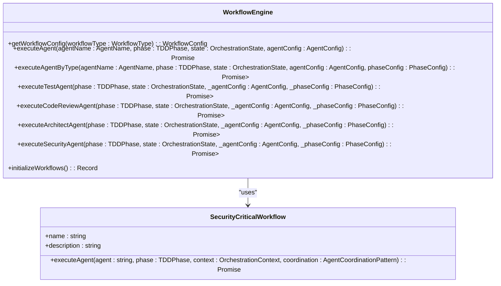
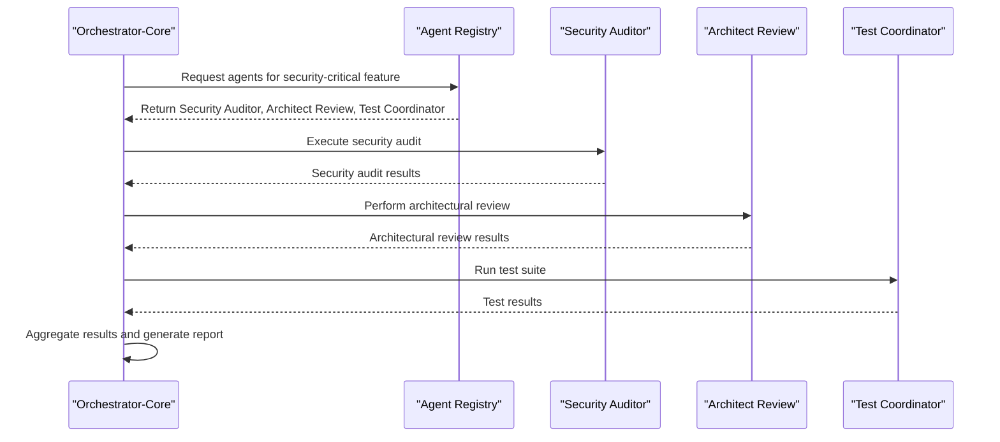
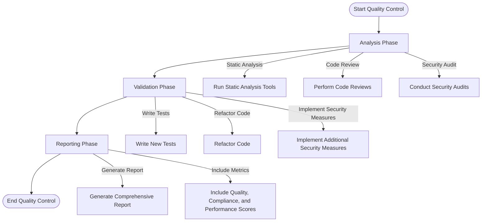
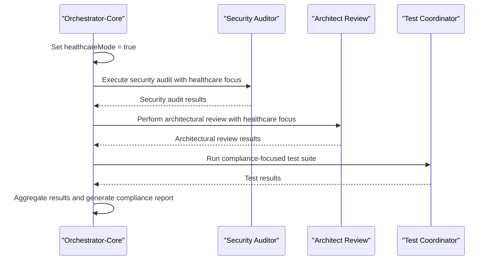
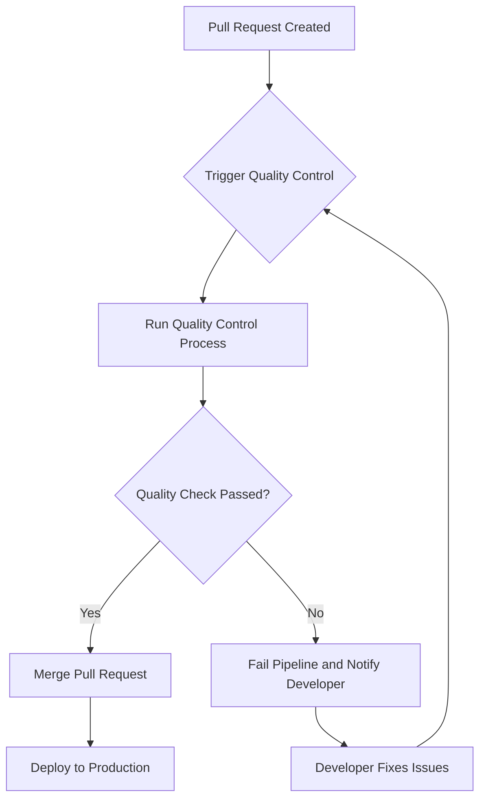
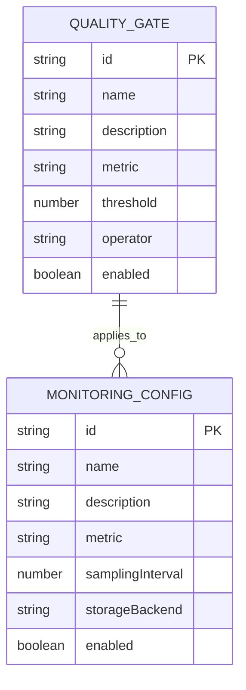
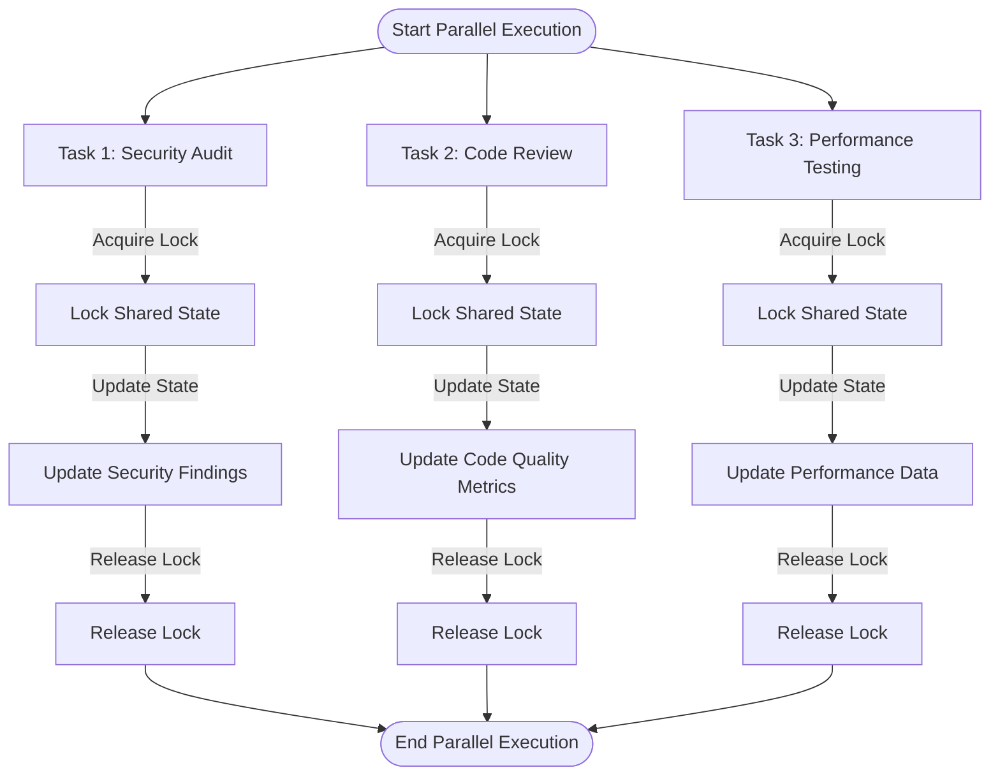
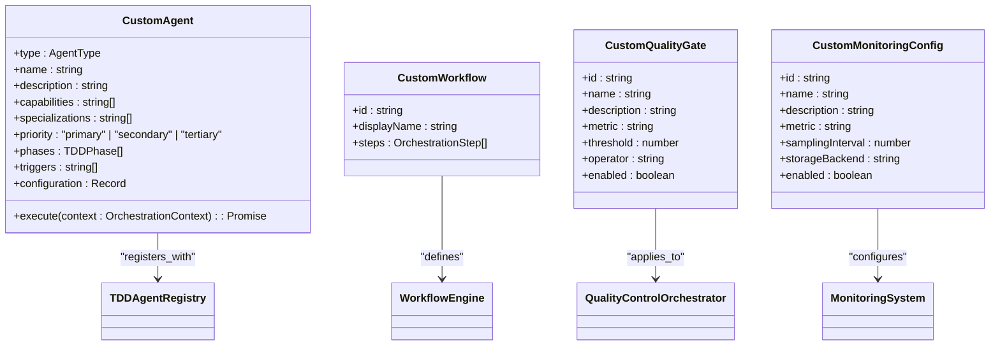

# Quality Orchestration System

<cite>
**Referenced Files in This Document**
- [quality-control-orchestrator.ts](file://tools/orchestration/src/quality-control-orchestrator.ts)
- [workflow-engine.ts](file://tools/orchestration/src/workflow-engine.ts)
- [agent-registry.ts](file://tools/orchestration/src/agent-registry.ts)
- [result-aggregator.ts](file://tools/orchestration/src/result-aggregator.ts)
- [tdd-orchestrator.ts](file://tools/orchestration/src/tdd-orchestrator.ts)
- [orchestration-system.ts](file://tools/orchestration/src/orchestration-system.ts)
- [types.ts](file://tools/orchestration/src/types.ts)
- [config.ts](file://tools/orchestration/src/config.ts)
</cite>

## Table of Contents
1. [Introduction](#introduction)
2. [Orchestrator-Core Architecture](#orchestrator-core-architecture)
3. [Workflow Engine Design](#workflow-engine-design)
4. [Agent Coordination and Execution Flow](#agent-coordination-and-execution-flow)
5. [Quality Control Orchestration](#quality-control-orchestration)
6. [Healthcare Compliance Validation](#healthcare-compliance-validation)
7. [CI/CD Pipeline Integration](#cicd-pipeline-integration)
8. [Monitoring Configurations and Quality Gates](#monitoring-configurations-and-quality-gates)
9. [Parallel Execution and State Management](#parallel-execution-and-state-management)
10. [Extending the Orchestration Workflow](#extending-the-orchestration-workflow)

## Introduction

The Quality Orchestration System is a comprehensive framework designed to coordinate multiple quality checks across the codebase, ensuring high standards of software quality, security, and compliance. This system integrates various agents responsible for different aspects of quality assurance, including security, architecture, testing, and healthcare compliance. The orchestrator-core and workflow-engine modules play pivotal roles in managing the execution flow between these agents, aggregating results, and generating detailed reports.

This document provides an in-depth analysis of the orchestrator-core and workflow-engine modules, explaining their architecture, functionality, and integration with CI/CD pipelines. It also covers how the system handles failure scenarios, particularly in healthcare compliance validation, and addresses common issues such as race conditions in parallel execution through proper state management. The content is structured to be accessible to beginners while offering sufficient technical depth for experienced developers looking to extend the orchestration workflow for new quality dimensions.

**Section sources**
- [README.md](file://tools/orchestration/README.md#L1-L223)

## Orchestrator-Core Architecture

The orchestrator-core module serves as the central component of the Quality Orchestration System, responsible for coordinating the execution of various quality checks and managing the overall workflow. It leverages a modular design that allows for flexible configuration and extension, making it suitable for a wide range of use cases.

At its core, the orchestrator-core utilizes a registry pattern to manage and select agents based on their capabilities and the specific requirements of the task at hand. The `TDDAgentRegistry` class maintains a collection of registered agents, each with defined capabilities, specializations, and priority levels. This registry enables dynamic agent selection, ensuring that the most appropriate agents are chosen for each phase of the TDD cycle.

The orchestrator-core also incorporates a robust error handling mechanism, which is crucial for maintaining the reliability of the system. When an agent fails to execute successfully, the orchestrator captures the error and logs it for further analysis. Additionally, the system supports retry mechanisms, allowing failed tasks to be retried a specified number of times before being marked as a permanent failure.

To ensure efficient resource utilization, the orchestrator-core implements a queuing system that manages the execution of tasks. This queue helps prevent overloading the system by limiting the number of concurrent executions and prioritizing critical tasks. The queuing system is configurable, allowing administrators to adjust settings such as maximum concurrency and task priorities based on the specific needs of their environment.

```mermaid
classDiagram
class TDDOrchestrator {
+executeFullTDDCycle(feature : FeatureContext) : Promise<TDDCycleResult>
+executeRedPhase(context : OrchestrationContext) : Promise<AgentResult>
+executeGreenPhase(context : OrchestrationContext) : Promise<AgentResult>
+executeRefactorPhase(context : OrchestrationContext) : Promise<AgentResult>
+applyQualityGates(result : AgentResult, context : OrchestrationContext, phase : TDDPhase) : Promise<Array<{ name : string; passed : boolean; score : number }>>
+aggregateResults(results : AgentResult[], success : boolean) : { success : boolean; results : any[]; agentResults : AgentResult[] }
+createFailureResult(cycleId : string, phase : string, error : string) : TDDCycleResult
+calculateQualityScore(results : AgentResult[]) : number
+updateMetrics(cycleId : string, duration : number, success : boolean) : void
+determineCoordinationPattern(context : OrchestrationContext, phase : TDDPhase) : "parallel" | "sequential" | "hierarchical"
+validateHealthcareCompliance(context : OrchestrationContext) : Promise<HealthcareCompliance>
+generateCycleId() : string
}
class TDDAgentRegistry {
+getAllAgents() : AgentCapability[]
+getAgent(type : AgentType) : AgentCapability | undefined
+registerAgent(agent : AgentCapability) : void
+unregisterAgent(type : AgentType) : boolean
+getAgentsForPhase(phase : TDDPhase, context : OrchestrationContext) : AgentCapability[]
+getAgentsForCapability(capability : string) : AgentCapability[]
+selectOptimalAgents(context : OrchestrationContext) : AgentCapability[]
+calculateAgentScore(agent : AgentCapability, context : OrchestrationContext) : number
+validateAgentCapability(agent : AgentCapability) : boolean
+getRecommendedWorkflow(context : OrchestrationContext) : AgentType[]
+updateAgentConfiguration(type : AgentType, config : Record<string, any>) : boolean
+getAgentStats(type : AgentType) : AgentStats
+extractRequiredCapabilities(context : OrchestrationContext) : string[]
}
TDDOrchestrator --> TDDAgentRegistry : "uses"
```

**Diagram sources**
- [tdd-orchestrator.ts](file://tools/orchestration/src/tdd-orchestrator.ts#L1-L488)
- [agent-registry.ts](file://tools/orchestration/src/agent-registry.ts#L1-L475)

**Section sources**
- [tdd-orchestrator.ts](file://tools/orchestration/src/tdd-orchestrator.ts#L1-L488)
- [agent-registry.ts](file://tools/orchestration/src/agent-registry.ts#L1-L475)

## Workflow Engine Design

The workflow-engine module is responsible for defining and executing the various workflows that govern the quality control process. It provides a flexible and extensible framework for creating custom workflows tailored to specific project requirements. The engine supports multiple coordination patterns, including sequential, parallel, hierarchical, and event-driven, allowing for complex and sophisticated quality control processes.

One of the key features of the workflow-engine is its ability to dynamically select the appropriate workflow based on the context of the task. For example, when dealing with security-critical features, the engine can automatically switch to a more rigorous workflow that includes additional security checks and validations. This dynamic selection ensures that the quality control process is always aligned with the specific needs of the project.

The workflow-engine also includes a powerful configuration system that allows administrators to define and customize workflows using a simple and intuitive syntax. Workflows are defined as JSON objects, making them easy to read and modify. Each workflow consists of a series of phases, with each phase specifying the agents to be used, the quality gates to be applied, and the coordination pattern to be employed.

To facilitate the execution of workflows, the workflow-engine uses a state machine model. This model tracks the current state of the workflow, including the active phase, the status of each agent, and any pending tasks. The state machine ensures that the workflow progresses smoothly from one phase to the next, handling transitions and dependencies between phases seamlessly.



**Diagram sources**
- [workflow-engine.ts](file://tools/orchestration/src/workflow-engine.ts#L1-L78)
- [security-critical.ts](file://tools/orchestration/src/workflows/security-critical.ts#L1-L42)

**Section sources**
- [workflow-engine.ts](file://tools/orchestration/src/workflow-engine.ts#L1-L78)
- [security-critical.ts](file://tools/orchestration/src/workflows/security-critical.ts#L1-L42)

## Agent Coordination and Execution Flow

The Quality Orchestration System employs a sophisticated agent coordination mechanism to manage the execution flow between different quality check agents. These agents, including security, architecture, and testing, work together to ensure comprehensive quality assurance across the codebase. The orchestrator-core module coordinates these agents by defining clear execution patterns and managing their interactions.

Each agent is registered with the `TDDAgentRegistry`, which maintains a list of available agents along with their capabilities and specializations. When a quality check is initiated, the orchestrator selects the appropriate agents based on the specific requirements of the task. For instance, if the task involves security-critical features, the orchestrator will prioritize agents with strong security auditing capabilities.

The execution flow is managed through a series of well-defined phases, typically following the red-green-refactor pattern of Test-Driven Development (TDD). In the red phase, the system identifies potential issues and creates failing tests. During the green phase, the identified issues are addressed, and the tests are made to pass. Finally, in the refactor phase, the code is optimized for performance and maintainability without changing its external behavior.

To ensure smooth coordination, the orchestrator uses a message bus to facilitate real-time communication between agents. This message bus allows agents to exchange information and synchronize their actions, preventing conflicts and ensuring that all agents are working towards the same goal. The message bus also supports conflict resolution strategies, such as priority-based decision-making and consensus algorithms, to handle situations where multiple agents have conflicting recommendations.



**Diagram sources**
- [tdd-orchestrator.ts](file://tools/orchestration/src/tdd-orchestrator.ts#L1-L488)
- [agent-registry.ts](file://tools/orchestration/src/agent-registry.ts#L1-L475)

**Section sources**
- [tdd-orchestrator.ts](file://tools/orchestration/src/tdd-orchestrator.ts#L1-L488)
- [agent-registry.ts](file://tools/orchestration/src/agent-registry.ts#L1-L475)

## Quality Control Orchestration

The quality-control-orchestrator module is responsible for executing comprehensive quality control processes across the codebase. It integrates various quality check agents and coordinates their activities to ensure that all aspects of software quality are thoroughly evaluated. The orchestrator follows a structured approach to quality control, dividing the process into distinct phases and applying specific quality gates at each stage.

The quality control process begins with the analysis phase, where the system evaluates the codebase for potential issues and vulnerabilities. This phase involves running static analysis tools, performing code reviews, and conducting security audits. The results from this phase are then aggregated and analyzed to identify areas that require further attention.

Following the analysis phase, the system moves on to the validation phase, where the identified issues are addressed and resolved. This phase may involve writing new tests, refactoring code, or implementing additional security measures. The orchestrator ensures that all changes are properly validated and that the code meets the required quality standards.

Finally, the reporting phase generates a comprehensive report summarizing the findings and recommendations from the quality control process. This report includes metrics such as quality scores, compliance scores, and performance scores, providing stakeholders with a clear overview of the codebase's health and readiness for deployment.



**Diagram sources**
- [quality-control-orchestrator.ts](file://tools/orchestration/src/quality-control-orchestrator.ts#L1-L202)

**Section sources**
- [quality-control-orchestrator.ts](file://tools/orchestration/src/quality-control-orchestrator.ts#L1-L202)

## Healthcare Compliance Validation

The Quality Orchestration System places a strong emphasis on healthcare compliance validation, ensuring that all software developed for healthcare applications adheres to relevant regulations and standards. This is particularly important given the sensitive nature of healthcare data and the stringent requirements imposed by regulatory bodies such as LGPD (Lei Geral de Proteção de Dados), ANVISA (Agência Nacional de Vigilância Sanitária), and CFM (Conselho Federal de Medicina).

The system includes specialized agents dedicated to healthcare compliance validation. These agents perform thorough checks to ensure that the codebase complies with all applicable regulations. For example, the security auditor agent verifies that personal data is handled securely and that consent management is properly implemented. The architect review agent ensures that the system design aligns with best practices for healthcare software development, while the test coordinator agent runs a suite of compliance-focused tests to validate the implementation.

When a healthcare compliance check is initiated, the orchestrator sets the `healthcareMode` flag to true, triggering the activation of all healthcare-specific agents. These agents then execute their respective tasks, collecting evidence and generating reports that demonstrate compliance with the relevant regulations. The results are aggregated and presented in a comprehensive compliance report, which can be used to satisfy audit requirements and provide assurance to stakeholders.

In the event of a compliance violation, the system generates detailed error messages and recommendations for remediation. These recommendations are designed to help developers quickly address the issue and bring the codebase back into compliance. The system also supports automatic retries, allowing failed compliance checks to be re-evaluated after the necessary fixes have been made.



**Diagram sources**
- [tdd-orchestrator.ts](file://tools/orchestration/src/tdd-orchestrator.ts#L1-L488)
- [quality-control-orchestrator.ts](file://tools/orchestration/src/quality-control-orchestrator.ts#L1-L202)

**Section sources**
- [tdd-orchestrator.ts](file://tools/orchestration/src/tdd-orchestrator.ts#L1-L488)
- [quality-control-orchestrator.ts](file://tools/orchestration/src/quality-control-orchestrator.ts#L1-L202)

## CI/CD Pipeline Integration

The Quality Orchestration System is designed to integrate seamlessly with CI/CD pipelines, enabling automated quality control throughout the software development lifecycle. This integration ensures that every code change undergoes rigorous quality checks before being deployed to production, helping to maintain high standards of software quality and reduce the risk of introducing bugs or security vulnerabilities.

The system provides a command-line interface (CLI) that can be easily incorporated into existing CI/CD workflows. Developers can use the CLI to trigger quality control processes, specify the scope of the checks, and configure various options such as parallel execution and healthcare compliance validation. The CLI outputs detailed reports that can be consumed by CI/CD tools, allowing for automated decision-making based on the results of the quality control process.

For example, a typical CI/CD pipeline might include a step that runs the quality control process whenever a pull request is created or updated. If the quality control process detects any issues, the pipeline can be configured to fail, preventing the problematic code from being merged. Conversely, if the process completes successfully, the pipeline can proceed with the deployment.

The system also supports integration with popular CI/CD platforms such as Jenkins, GitLab CI, and GitHub Actions. Pre-built plugins and configurations are available for these platforms, making it easy to set up and maintain the integration. Additionally, the system provides webhooks that can be used to notify external services of the status of quality control processes, enabling real-time monitoring and alerting.



**Diagram sources**
- [orchestration-system.ts](file://tools/orchestration/src/orchestration-system.ts#L1-L193)
- [utils.ts](file://tools/orchestration/src/utils.ts#L1-L107)

**Section sources**
- [orchestration-system.ts](file://tools/orchestration/src/orchestration-system.ts#L1-L193)
- [utils.ts](file://tools/orchestration/src/utils.ts#L1-L107)

## Monitoring Configurations and Quality Gates

The Quality Orchestration System includes a comprehensive monitoring and quality gate framework to ensure that software quality remains consistently high. This framework allows administrators to define and enforce quality standards across the codebase, providing early feedback on potential issues and preventing low-quality code from being merged.

Quality gates are predefined thresholds that must be met for a code change to be considered acceptable. These gates can be applied to various metrics, such as code coverage, performance, and security. For example, a quality gate might require that all unit tests pass, code coverage exceeds 80%, and no critical security vulnerabilities are present. If any of these gates are not satisfied, the quality control process will fail, and the code change will be rejected.

The system provides a flexible configuration mechanism for defining quality gates. Administrators can create custom gates based on their specific requirements and apply them to different parts of the codebase. The configuration is stored in a JSON file, making it easy to version control and share among team members.

Monitoring configurations are used to track the health and performance of the quality control process itself. These configurations define what metrics should be collected, how often they should be sampled, and where they should be stored. The system supports integration with popular monitoring tools such as Prometheus and Grafana, allowing for real-time visualization of quality metrics and historical trend analysis.



**Diagram sources**
- [types.ts](file://tools/orchestration/src/types.ts#L1-L231)
- [config.ts](file://tools/orchestration/src/config.ts#L1-L99)

**Section sources**
- [types.ts](file://tools/orchestration/src/types.ts#L1-L231)
- [config.ts](file://tools/orchestration/src/config.ts#L1-L99)

## Parallel Execution and State Management

The Quality Orchestration System supports parallel execution of quality check agents to improve efficiency and reduce the overall time required for quality control processes. This capability is particularly useful for large codebases where running all checks sequentially would be prohibitively slow. However, parallel execution introduces challenges related to race conditions and state consistency, which the system addresses through careful state management.

To enable parallel execution, the orchestrator divides the quality control process into independent tasks that can be executed concurrently. Each task is assigned to a separate agent, and the agents communicate through a shared message bus to coordinate their actions. The message bus ensures that all agents have access to the latest state information and can react appropriately to changes in the environment.

State management is achieved through a combination of locking mechanisms and transactional updates. When an agent needs to modify shared state, it acquires a lock to prevent other agents from accessing the same data simultaneously. Once the modification is complete, the agent releases the lock, allowing other agents to proceed. Transactional updates ensure that state changes are atomic and consistent, even in the presence of failures.

The system also includes a conflict resolution mechanism to handle situations where multiple agents attempt to modify the same data. This mechanism uses a priority-based approach, where higher-priority agents take precedence over lower-priority ones. In cases where priorities are equal, the system falls back to a consensus algorithm to reach a mutually agreeable solution.



**Diagram sources**
- [workflow-engine.ts](file://tools/orchestration/src/workflow-engine.ts#L1-L78)
- [result-aggregator.ts](file://tools/orchestration/src/result-aggregator.ts#L1-L514)

**Section sources**
- [workflow-engine.ts](file://tools/orchestration/src/workflow-engine.ts#L1-L78)
- [result-aggregator.ts](file://tools/orchestration/src/result-aggregator.ts#L1-L514)

## Extending the Orchestration Workflow

The Quality Orchestration System is designed to be highly extensible, allowing developers to add new quality dimensions and customize the workflow to meet their specific needs. This flexibility is achieved through a modular architecture that separates concerns and promotes loose coupling between components.

To extend the orchestration workflow, developers can create new agents that implement specific quality check functionalities. These agents can be registered with the `TDDAgentRegistry` and integrated into existing workflows or used to create entirely new workflows. The registration process involves defining the agent's capabilities, specializations, and priority level, as well as implementing the necessary methods for executing the quality check.

New workflows can be defined using the workflow-engine's configuration system. Developers can create JSON files that describe the structure of the workflow, including the phases, agents, and quality gates. These workflows can then be loaded into the system and used to coordinate the execution of quality checks.

Additionally, the system supports the creation of custom quality gates and monitoring configurations. Developers can define new metrics and thresholds that reflect their organization's quality standards and integrate them into the quality control process. This allows for fine-grained control over the quality criteria and ensures that the system remains aligned with evolving business requirements.



**Diagram sources**
- [agent-registry.ts](file://tools/orchestration/src/agent-registry.ts#L1-L475)
- [workflow-engine.ts](file://tools/orchestration/src/workflow-engine.ts#L1-L78)
- [quality-control-orchestrator.ts](file://tools/orchestration/src/quality-control-orchestrator.ts#L1-L202)
- [types.ts](file://tools/orchestration/src/types.ts#L1-L231)

**Section sources**
- [agent-registry.ts](file://tools/orchestration/src/agent-registry.ts#L1-L475)
- [workflow-engine.ts](file://tools/orchestration/src/workflow-engine.ts#L1-L78)
- [quality-control-orchestrator.ts](file://tools/orchestration/src/quality-control-orchestrator.ts#L1-L202)
- [types.ts](file://tools/orchestration/src/types.ts#L1-L231)