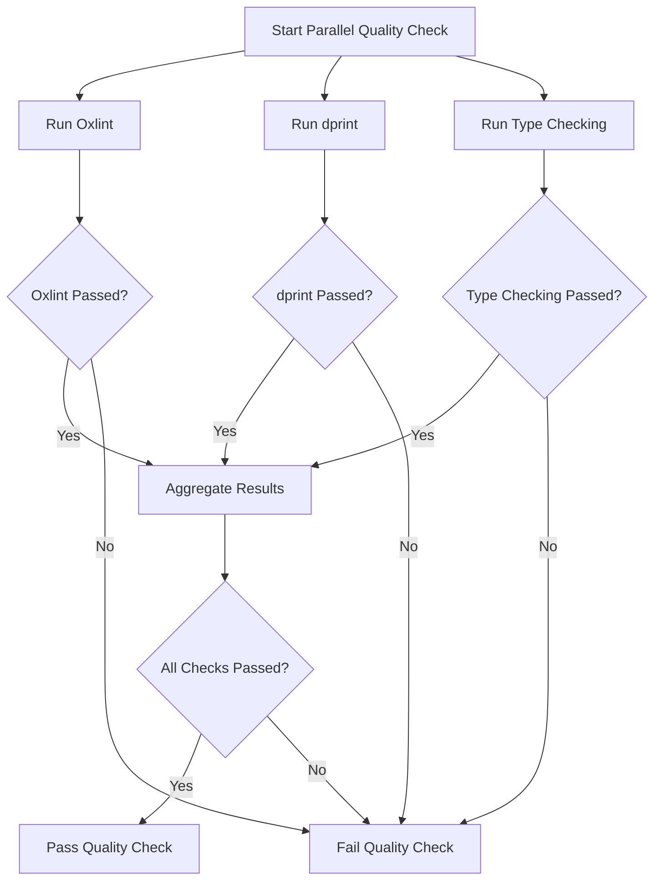

# Static Analysis Tools

<cite>
**Referenced Files in This Document **
- [oxlint.config.mjs](file://tools/quality/oxlint.config.mjs)
- [dprint.json](file://dprint.json)
- [parallel-quality-check.sh](file://tools/quality/parallel-quality-check.sh)
</cite>

## Table of Contents

1. [Introduction](#introduction)
2. [Oxlint Configuration for TypeScript Linting](#oxlint-configuration-for-typescript-linting)
3. [Dprint Setup for Code Formatting Consistency](#dprint-setup-for-code-formatting-consistency)
4. [Healthcare-Specific Rule Enforcement](#healthcare-specific-rule-enforcement)
5. [Integration with Editors and CI/CD Pipelines](#integration-with-editors-and-cicd-pipelines)
6. [Performance Optimization Strategies](#performance-optimization-strategies)
7. [Extending Rulesets for Medical Compliance](#extending-rulesets-for-medical-compliance)
8. [Troubleshooting Common Issues](#troubleshooting-common-issues)

## Introduction

This document provides comprehensive guidance on the static analysis tools used within the NeonPro healthcare platform monorepo. It details the implementation and configuration of oxlint for TypeScript linting and dprint for code formatting consistency. These tools are critical for enforcing coding standards, preventing vulnerabilities such as PII exposure, and ensuring compliance with healthcare regulations like LGPD and HIPAA. The integration of these tools into development workflows and CI/CD pipelines is described, along with strategies to address performance bottlenecks during large-scale analysis.

## Oxlint Configuration for TypeScript Linting

The oxlint tool is configured through the `oxlint.config.mjs` file located in the `tools/quality` directory. This configuration enables a range of plugins including TypeScript, React, import, JSDoc, node, promise, security, and JSX accessibility rules. The rules are designed to enforce type safety, prevent common JavaScript pitfalls, and ensure secure coding practices. For example, the `typescript/no-explicit-any` rule is set to error level with automatic fixing to unknown types, enhancing type safety across the codebase. Additionally, security rules such as `security/detect-object-injection` and `security/detect-non-literal-fs-filename` are enforced to mitigate risks associated with dynamic code execution and file system access.

**Section sources**

- [oxlint.config.mjs](file://tools/quality/oxlint.config.mjs#L0-L161)

## Dprint Setup for Code Formatting Consistency

Code formatting consistency is maintained using dprint, which is configured via the `dprint.json` file at the root of the repository. This configuration specifies the inclusion of TypeScript, JSON, and Markdown files while excluding test directories and build artifacts. The TypeScript plugin settings define a line width of 100 characters, indentation using spaces (width 2), preferred semicolons, single quotes, and trailing commas only in multi-line contexts. These settings ensure uniform code style across the monorepo, reducing cognitive load and minimizing merge conflicts.

**Section sources**

- [dprint.json](file://dprint.json#L0-L43)

## Healthcare-Specific Rule Enforcement

Custom rule configurations in both oxlint and dprint are tailored to prevent common vulnerabilities related to patient data handling and security practices. In oxlint, specific overrides are applied to files under `src/compliance/**` and `src/agents/**`, where stricter rules such as mandatory JSDoc comments and prohibition of non-null assertions are enforced. These rules help maintain high documentation standards and reduce the risk of runtime errors that could compromise patient data integrity. Furthermore, the ignore patterns exclude generated files and dependencies, focusing the linting process on application code.

**Section sources**

- [oxlint.config.mjs](file://tools/quality/oxlint.config.mjs#L122-L159)

## Integration with Editors and CI/CD Pipelines

The parallel-quality-check.sh script integrates oxlint and dprint into the development workflow by running them concurrently alongside TypeScript type checking. This script leverages GNU parallel for maximum efficiency or falls back to background processes if GNU parallel is unavailable. Each tool runs in its own function (`run_oxlint`, `run_dprint`, `run_typecheck`), allowing independent execution and result aggregation. Successful completion of all checks results in a positive exit status, signaling readiness for deployment. This integration ensures that code quality gates are met before merging into main branches.

**Diagram sources **

- [parallel-quality-check.sh](file://tools/quality/parallel-quality-check.sh#L0-L85)

**Section sources**

- [parallel-quality-check.sh](file://tools/quality/parallel-quality-check.sh#L0-L85)

## Performance Optimization Strategies

To address performance bottlenecks during large-scale analysis, several optimization strategies are employed. The use of oxlint, which is reported to be 50x faster than ESLint, significantly reduces linting time. Similarly, dprint offers 3x faster formatting compared to Prettier due to incremental processing of modified files only. The parallel execution model further enhances performance by utilizing multiple CPU cores effectively. Additionally, caching mechanisms and pre-commit hooks minimize redundant operations, ensuring rapid feedback loops for developers.

**Section sources**

- [parallel-quality-check.sh](file://tools/quality/parallel-quality-check.sh#L50-L85)

## Extending Rulesets for Medical Compliance

Extending the existing rulesets to meet medical compliance requirements involves adding custom rules focused on data protection, audit logging, and secure communication protocols. For instance, new rules can be introduced to detect improper handling of sensitive health information (SHI) or enforce encryption of data at rest and in transit. These extensions can be implemented by creating additional configuration files or modifying the current ones to include domain-specific validations. Regular reviews and updates of these rules ensure ongoing alignment with evolving regulatory standards.

**Section sources**

- [oxlint.config.mjs](file://tools/quality/oxlint.config.mjs#L0-L161)

## Troubleshooting Common Issues

Common issues encountered when using these static analysis tools include false positives from oxlint, inconsistent formatting from dprint, and failures in parallel execution. To resolve false positives, developers should review the specific rule causing the issue and consider adding exceptions in the configuration file or using inline comments to disable the rule locally. For formatting inconsistencies, clearing the dprint cache or reinstalling the binary may help. If parallel execution fails, verifying script permissions and installing GNU parallel can restore functionality. Detailed debugging commands are available for inspecting tool behavior and configuration validity.

**Section sources**

- [parallel-quality-check.sh](file://tools/quality/parallel-quality-check.sh#L0-L85)
