# Compliance Testing Modules

<cite>
**Referenced Files in This Document**
- [lgpd-aesthetic-clinic-consent.test.ts](file://apps/api/src/__tests__/compliance/lgpd-aesthetic-clinic-consent.test.ts)
- [lgpd-data-anonymization-pseudonymization.test.ts](file://apps/api/src/__tests__/compliance/lgpd-data-anonymization-pseudonymization.test.ts)
- [anvisa-reporting.test.ts](file://apps/api/tests/compliance/anvisa-reporting.test.ts)
- [cfm-telemedicine.test.ts](file://apps/api/tests/compliance/cfm-telemedicine.test.ts)
- [lgpd-validation.test.ts](file://apps/api/tests/compliance/lgpd-validation.test.ts)
- [lgpd.test.ts](file://apps/api/tests/compliance/lgpd.test.ts)
- [anvisa.ts](file://tools/testing-toolkit/src/compliance/anvisa.ts)
- [cfm.ts](file://tools/testing-toolkit/src/compliance/cfm.ts)
- [lgpd.test.ts](file://tools/testing-toolkit/src/compliance/lgpd.test.ts)
- [lgpd-anvisa-cfm.md](file://docs/compliance/lgpd-anvisa-cfm.md)
- [lgpd-anonymization.md](file://docs/compliance/lgpd-anonymization.md)
- [lgpd-audit-checklist.md](file://docs/compliance/lgpd-audit-checklist.md)
- [README.md](file://docs/compliance/README.md)
</cite>

## Table of Contents

1. [Introduction](#introduction)
2. [Core Regulatory Frameworks](#core-regulatory-frameworks)
3. [LGPD Compliance Testing](#lgpd-compliance-testing)
4. [ANVISA Adverse Event Reporting](#anvisa-adverse-event-reporting)
5. [CFM Telemedicine Compliance](#cfm-telemedicine-compliance)
6. [Compliance Testing Architecture](#compliance-testing-architecture)
7. [Extending the Compliance Suite](#extending-the-compliance-suite)
8. [Quality Gates and Continuous Compliance](#quality-gates-and-continuous-compliance)
9. [Troubleshooting Common Issues](#troubleshooting-common-issues)
10. [Conclusion](#conclusion)

## Introduction

This document provides comprehensive guidance on the compliance testing modules for Brazilian healthcare standards, focusing on LGPD (Lei Geral de Proteção de Dados), ANVISA (Agência Nacional de Vigilância Sanitária), and CFM (Conselho Federal de Medicina) requirements. The compliance testing framework ensures that healthcare applications meet stringent regulatory standards through automated validation, audit trail verification, and continuous monitoring.

The testing modules are designed to validate specific regulatory aspects including patient data protection, telemedicine rules, and adverse event reporting. Each compliance module implements targeted tests that verify adherence to legal requirements while maintaining system functionality. The framework supports both granular testing of individual compliance aspects and comprehensive integration testing across multiple regulatory domains.

These compliance tests follow Test-Driven Development (TDD) principles, with test cases designed to initially fail (RED phase) to drive proper implementation. The modular architecture allows for easy extension to support new regulations and evolving compliance requirements.

**Section sources**

- [README.md](file://docs/compliance/README.md#L1-L458)

## Core Regulatory Frameworks

The compliance testing suite addresses three primary Brazilian regulatory frameworks that govern healthcare operations:

### LGPD (Lei Geral de Proteção de Dados)

LGPD establishes comprehensive data protection requirements for personal information processing. Key compliance areas include:

- Lawful basis for data processing (consent, vital interests, legitimate interests)
- Data subject rights enforcement (access, rectification, erasure, portability)
- Data minimization and purpose limitation principles
- Security measures for sensitive health data
- Cross-border data transfer restrictions
- Data breach notification procedures

### ANVISA (Agência Nacional de Vigilância Sanitária)

ANVISA regulates medical devices and pharmaceutical products, with specific requirements for software as a medical device (SaMD). Key compliance areas include:

- Medical device classification and registration
- Risk management according to ISO 14971
- Software lifecycle processes per IEC 62304
- Post-market surveillance and adverse event reporting
- Clinical evidence requirements
- Usability engineering per IEC 62366

### CFM (Conselho Federal de Medicina)

CFM establishes professional standards for medical practice, particularly regarding telemedicine. Key compliance areas include:

- Professional licensing validation (CRM verification)
- Telemedicine consultation protocols
- Digital prescription requirements with ICP-Brasil certificates
- Patient-doctor relationship establishment
- Medical ethics in digital environments
- Emergency procedure documentation

The compliance framework integrates these regulatory requirements into a cohesive testing strategy that validates both technical implementation and operational procedures.

**Section sources**

- [lgpd-anvisa-cfm.md](file://docs/compliance/lgpd-anvisa-cfm.md#L1-L607)

## LGPD Compliance Testing

The LGPD compliance testing module validates adherence to Brazil's General Data Protection Law, focusing on healthcare-specific requirements for patient data protection.

### Data Anonymization and Pseudonymization

The framework implements robust anonymization techniques to protect patient privacy while enabling data utility for research and analytics. Three compliance levels are supported:

```mermaid
flowchart TD
A[Original Patient Data] --> B{Anonymization Level}
B --> C[Basic: Partial Masking]
B --> D[Enhanced: Aggressive Masking]
B --> E[Full Anonymization]
C --> F[Partially masked CPF/CNPJ<br>Email with visible prefix<br>Name with first letter visible]
D --> G[Fully masked identifiers<br>Birth date converted to year only<br>Addresses completely masked]
E --> H[Replaced with "ANONIMIZADO"<br>Dates converted to age groups<br>All direct identifiers removed]
```

**Diagram sources**

- [lgpd-anonymization.md](file://docs/compliance/lgpd-anonymization.md#L1-L224)
- [lgpd-data-anonymization-pseudonymization.test.ts](file://apps/api/src/__tests__/compliance/lgpd-data-anonymization-pseudonymization.test.ts#L1-L100)

### Consent Management Validation

The testing suite verifies comprehensive consent management implementation, ensuring compliance with LGPD Article 55-I requirements:


The tests validate that consent is granular, allowing patients to provide separate consent for different processing purposes such as medical treatment, marketing communications, and research participation.

**Diagram sources**

- [lgpd-aesthetic-clinic-consent.test.ts](file://apps/api/src/__tests__/compliance/lgpd-aesthetic-clinic-consent.test.ts#L1-L100)
- [lgpd-validation.test.ts](file://apps/api/tests/compliance/lgpd-validation.test.ts#L1-L100)

### Data Subject Rights Enforcement

The framework thoroughly tests all LGPD data subject rights, ensuring timely and complete responses to patient requests:

| Right         | Implementation Requirements                  | Response Time |
| ------------- | -------------------------------------------- | ------------- |
| Access        | Complete data retrieval in structured format | ≤ 15 days     |
| Rectification | Update mechanisms for inaccurate data        | ≤ 15 days     |
| Erasure       | Secure deletion with retention exceptions    | ≤ 15 days     |
| Portability   | Machine-readable export in standard formats  | ≤ 15 days     |
| Objection     | Opt-out from specific processing activities  | Immediate     |

The tests verify that the system correctly identifies which data can be erased versus retained based on legal obligations and medical record retention requirements.

**Section sources**

- [lgpd-validation.test.ts](file://apps/api/tests/compliance/lgpd-validation.test.ts#L1-L100)
- [lgpd.test.ts](file://apps/api/tests/compliance/lgpd.test.ts#L1-L100)

## ANVISA Adverse Event Reporting

The ANVISA compliance module focuses on validating adverse event reporting requirements for medical device software, particularly Software as a Medical Device (SaMD).

### Automated Adverse Event Detection

The testing framework implements proactive detection of potential adverse events through performance monitoring and safety indicator analysis:


The tests simulate various scenarios including software malfunctions, patient safety concerns, and recurring issues that require proactive reporting to ANVISA.

**Diagram sources**

- [anvisa-reporting.test.ts](file://apps/api/tests/compliance/anvisa-reporting.test.ts#L1-L100)

### SaMD Compliance Validation

The framework verifies compliance with ANVISA's SaMD requirements, including risk management and post-market surveillance:


The tests validate that the system complies with ISO 14971 risk management requirements and maintains active post-market surveillance with adverse event tracking capabilities.

**Diagram sources**

- [anvisa.ts](file://tools/testing-toolkit/src/compliance/anvisa.ts#L1-L193)
- [anvisa-reporting.test.ts](file://apps/api/tests/compliance/anvisa-reporting.test.ts#L1-L100)

## CFM Telemedicine Compliance

The CFM compliance module validates adherence to telemedicine regulations established by the Federal Council of Medicine.

### Professional License Verification

The testing framework ensures accurate validation of medical professionals' credentials through integration with CFM systems:


The tests verify that only doctors with active licenses and proper telemedicine authorization can conduct virtual consultations.

**Diagram sources**

- [cfm-telemedicine.test.ts](file://apps/api/tests/compliance/cfm-telemedicine.test.ts#L1-L100)

### Digital Prescription Validation

The framework validates compliance with CFM requirements for digital prescriptions, including ICP-Brasil certificate authentication:


The tests ensure that digital prescriptions include valid cryptographic signatures and comply with controlled substance regulations when applicable.

**Diagram sources**

- [cfm-telemedicine.test.ts](file://apps/api/tests/compliance/cfm-telemedicine.test.ts#L1-L100)
- [cfm.ts](file://tools/testing-toolkit/src/compliance/cfm.ts#L1-L215)

## Compliance Testing Architecture

The compliance testing framework follows a modular architecture that enables extensibility and reusability across different regulatory domains.

### Modular Design Pattern

The framework implements a consistent design pattern across all compliance modules:

```mermaid
classDiagram
class Validator {
<<abstract>>
+validateCompliance(data) ValidationResult
}
class LGPDValidator {
+validateConsent(data) boolean
+validateDataMinimization(data, fields) boolean
+validateAuditTrail(data) boolean
+validateDataSubjectRights(data) boolean
+validateCompliance(data, fields) ValidationResult
}
class ANVISAValidator {
+validateDeviceClassification(data) boolean
+validateClinicalWorkflows(data) boolean
+validateRiskManagement(data) boolean
+validatePostMarketSurveillance(data) boolean
+validateCompliance(data) ValidationResult
}
class CFMValidator {
+validateProfessionalLicensing(data) boolean
+validateTelemedicineCompliance(data) boolean
+validateDigitalPrescription(data) boolean
+validatePatientConfidentiality(data) boolean
+validateCompliance(data) ValidationResult
}
Validator <|-- LGPDValidator
Validator <|-- ANVISAValidator
Validator <|-- CFMValidator
class TestData {
<<interface>>
}
class LGPDTestData {
+consentGiven boolean
+dataProcessingPurpose string
+auditTrail AuditEntry[]
+personalData PersonalData
+dataSubjectRights DataRights
}
class ANVISATestData {
+deviceClassification String
+riskLevel String
+clinicalWorkflows String[]
+riskManagement RiskManagementData
+postMarketSurveillance PostMarketData
}
class CFMTestData {
+professionalLicensing LicensingData
+telemedicineCompliance TelemedicineData
+digitalPrescription PrescriptionData
+patientConfidentiality ConfidentialityData
}
TestData <|-- LGPDTestData
TestData <|-- ANVISATestData
TestData <|-- CFMTestData
class MockDataGenerator {
+createMockLGPDData(overrides) LGPDTestData
+createMockANVISAData(overrides) ANVISATestData
+createMockCFMData(overrides) CFMTestData
}
class TestSuiteCreator {
+createLGPDTestSuite(name, data, fields)
+createANVISATestSuite(name, data)
+createCFMTestSuite(name, data)
}
MockDataGenerator --> LGPDTestData
MockDataGenerator --> ANVISATestData
MockDataGenerator --> CFMTestData
TestSuiteCreator --> LGPDValidator
TestSuiteCreator --> ANVISAValidator
TestSuiteCreator --> CFMValidator
```



This architecture promotes consistency while allowing each validator to implement domain-specific checks.

**Diagram sources**

- [lgpd.test.ts](file://tools/testing-toolkit/src/compliance/lgpd.test.ts#L1-L228)
- [anvisa.ts](file://tools/testing-toolkit/src/compliance/anvisa.ts#L1-L193)
- [cfm.ts](file://tools/testing-toolkit/src/compliance/cfm.ts#L1-L215)

### Configuration and Versioning

The framework supports modular rule configuration and versioned compliance checks to address evolving regulatory requirements:


This approach allows the organization to maintain multiple versions of compliance checks and gradually migrate to updated requirements.

**Section sources**

- [lgpd-anvisa-cfm.md](file://docs/compliance/lgpd-anvisa-cfm.md#L1-L607)

## Extending the Compliance Suite

The framework is designed to be easily extended to support new regulations and compliance requirements.

### Adding New Compliance Modules

To add a new compliance module, follow this standardized process:

1. **Define the regulatory requirements** and identify key compliance areas
2. **Create a validator class** that implements the core validation logic
3. **Define the test data interface** with properties relevant to the regulation
4. **Implement validation methods** for each compliance requirement
5. **Create a mock data generator** for testing purposes
6. **Develop a test suite creator** function
7. **Integrate with existing quality gates**

For example, adding a new HIPAA compliance module would follow the same pattern as existing modules:

```typescript
// Example structure for a new compliance module
export interface HIPAATestData {
  hipaaCompliance: {
    privacyRule: boolean;
    securityRule: boolean;
    breachNotification: boolean;
    businessAssociateAgreements: boolean;
  };
  electronicHealthRecords: {
    accessControls: boolean;
    auditLogging: boolean;
    encryption: boolean;
    integrityControls: boolean;
  };
}

export class HIPAAValidator {
  static validateCompliance(data: HIPAATestData): ValidationResult {
    // Implementation follows same pattern as other validators
  }
}

export function createMockHIPAAData(overrides: Partial<HIPAATestData> = {}): HIPAATestData {
  // Follows same pattern as other mock generators
}

export function createHIPAATestSuite(testName: string, testData: HIPAATestData) {
  // Follows same pattern as other test suite creators
}
```

**Section sources**

- [anvisa.ts](file://tools/testing-toolkit/src/compliance/anvisa.ts#L1-L193)
- [cfm.ts](file://tools/testing-toolkit/src/compliance/cfm.ts#L1-L215)

### Integration with Testing Framework

New compliance modules integrate seamlessly with the existing testing infrastructure:


The use of standardized interfaces and patterns ensures that new compliance modules work with existing test runners, reporting tools, and quality gates.

**Section sources**

- [anvisa-reporting.test.ts](file://apps/api/tests/compliance/anvisa-reporting.test.ts#L1-L100)
- [cfm-telemedicine.test.ts](file://apps/api/tests/compliance/cfm-telemedicine.test.ts#L1-L100)

## Quality Gates and Continuous Compliance

The compliance testing modules are integrated into quality gates that enforce regulatory requirements throughout the development lifecycle.

### Pre-commit Quality Gates

Pre-commit hooks run basic compliance checks to catch issues early:


These fast-running tests provide immediate feedback to developers while preventing obvious compliance violations from entering the codebase.

**Section sources**

- [lgpd-audit-checklist.md](file://docs/compliance/lgpd-audit-checklist.md#L1-L479)

### CI/CD Pipeline Integration

Comprehensive compliance testing runs in the CI/CD pipeline before deployment:


The pipeline generates comprehensive compliance reports that document test results and provide evidence for regulatory audits.

**Section sources**

- [lgpd-validation.test.ts](file://apps/api/tests/compliance/lgpd-validation.test.ts#L1-L100)
- [anvisa-reporting.test.ts](file://apps/api/tests/compliance/anvisa-reporting.test.ts#L1-L100)
- [cfm-telemedicine.test.ts](file://apps/api/tests/compliance/cfm-telemedicine.test.ts#L1-L100)

## Troubleshooting Common Issues

This section addresses common challenges encountered when implementing and maintaining compliance testing modules.

### Evolving Regulatory Requirements

Regulations frequently change, creating challenges for maintaining compliance:

**Solutions:**

- Implement versioned compliance checks to support multiple regulation versions
- Establish a regulatory monitoring process to track changes
- Use modular rule configuration to update specific requirements without rewriting entire modules
- Maintain a compliance calendar for scheduled reviews and updates

The framework's modular design allows teams to update specific validation rules without affecting the entire compliance suite.

### False Positives in Automated Testing

Automated compliance tests may generate false positives due to overly strict rules:

**Solutions:**

- Implement configurable thresholds for performance and security checks
- Use machine learning to identify patterns and reduce false alarms
- Allow manual override with proper documentation
- Continuously refine test criteria based on historical data

### Integration with Legacy Systems

Legacy systems may not support modern compliance requirements:

**Solutions:**

- Implement adapter patterns to bridge compliance requirements
- Use proxy services to enforce security controls
- Gradually refactor legacy components to meet compliance standards
- Document exceptions and mitigation strategies

### Performance Impact

Comprehensive compliance testing can impact system performance:

**Solutions:**

- Run intensive tests during off-peak hours
- Implement sampling for certain compliance checks
- Use asynchronous processing for non-critical validations
- Optimize database queries and indexing

**Section sources**

- [lgpd-anvisa-cfm.md](file://docs/compliance/lgpd-anvisa-cfm.md#L1-L607)

## Conclusion

The compliance testing modules provide a robust framework for validating adherence to Brazilian healthcare regulations including LGPD, ANVISA, and CFM requirements. By implementing automated testing for data protection, adverse event reporting, and telemedicine rules, organizations can ensure continuous compliance while maintaining high-quality healthcare services.

The modular architecture enables easy extension to support new regulations and evolving compliance requirements. Integration with quality gates ensures that regulatory requirements are enforced throughout the development lifecycle, from pre-commit checks to production deployment.

By following the patterns and practices outlined in this document, development teams can build and maintain compliant healthcare applications that protect patient privacy, ensure data security, and meet all regulatory obligations. The framework balances thorough validation with practical implementation, providing both technical depth for experienced developers and accessible guidance for beginners.
