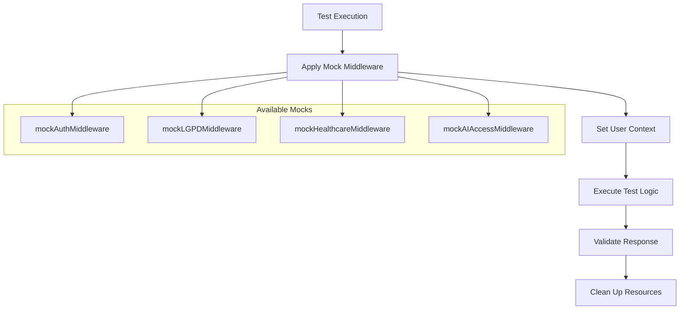
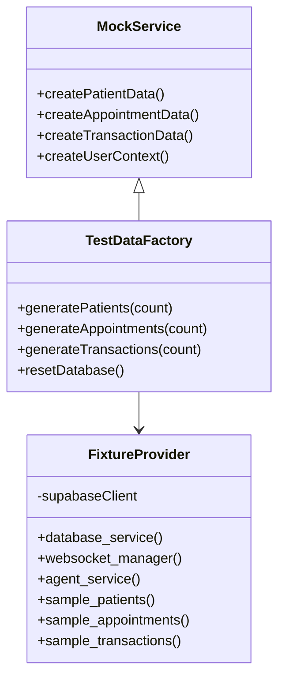
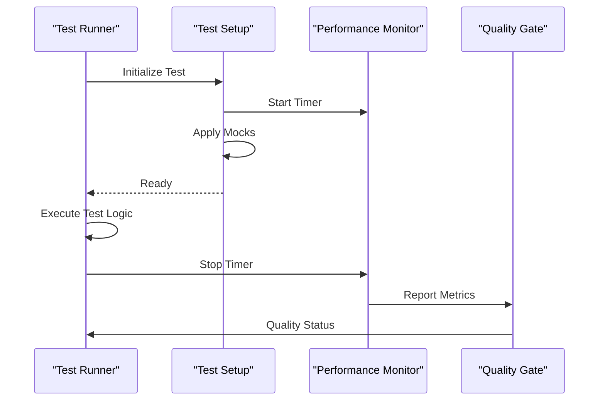
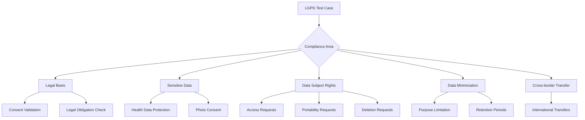
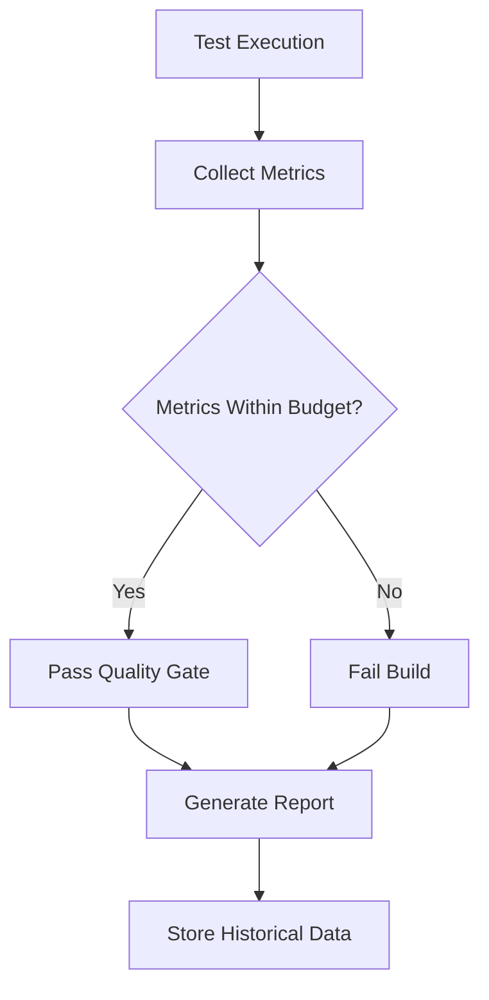
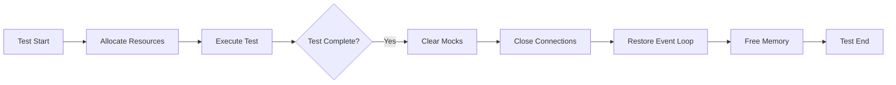
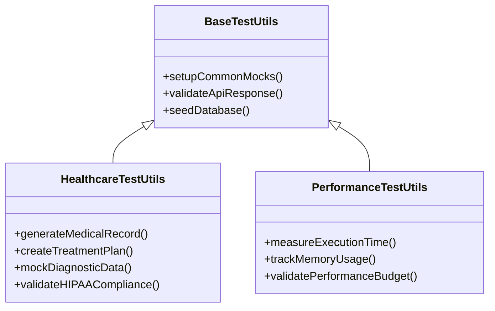

# Core Testing Utilities

<cite>
**Referenced Files in This Document**
- [conftest.py](file://apps/ai-agent/tests/conftest.py)
- [test-setup.ts](file://apps/api/src/test-setup.ts)
- [lgpd-aesthetic-clinic-consent.test.ts](file://apps/api/src/__tests__/compliance/lgpd-aesthetic-clinic-consent.test.ts)
</cite>

## Table of Contents
1. [Introduction](#introduction)
2. [Test Helper Functions](#test-helper-functions)
3. [Mock Generation System](#mock-generation-system)
4. [Performance Measurement Tools](#performance-measurement-tools)
5. [LGPD Test Data Generation](#lgpd-test-data-generation)
6. [Quality Gates Integration](#quality-gates-integration)
7. [Memory Management and Resource Cleanup](#memory-management-and-resource-cleanup)
8. [Extending the Testing Utility Library](#extending-the-testing-utility-library)

## Introduction
The core testing utilities provide a comprehensive framework for building reliable, maintainable, and compliant tests across the NeonPro platform. These utilities simplify common testing operations through shared helper functions, robust mock generation, and performance measurement tools. The system is designed to support both beginner developers who need straightforward testing patterns and experienced engineers requiring advanced customization for healthcare-specific scenarios.

## Test Helper Functions
The test helper functions provide reusable utilities that standardize common testing operations across the codebase. These helpers simplify authentication setup, database seeding, and API response validation, ensuring consistency and reducing boilerplate code.

The framework includes middleware mocks for authentication, LGPD compliance, healthcare professional access, and AI access control. These mocks allow tests to simulate various user roles and permissions without requiring actual authentication flows.

**Diagram sources**
- [test-setup.ts](file://apps/api/src/test-setup.ts#L10-L50)

**Section sources**
- [test-setup.ts](file://apps/api/src/test-setup.ts#L1-L82)

## Mock Generation System
The mock generation system provides fixtures and mock objects that simulate real-world data and service interactions. This system enables isolated testing of components without dependencies on external systems or databases.

The framework uses pytest fixtures to create consistent test data for patients, appointments, and financial transactions. These fixtures ensure that tests have predictable input data while maintaining readability and reusability.

**Diagram sources**
- [conftest.py](file://apps/ai-agent/tests/conftest.py#L15-L145)

**Section sources**
- [conftest.py](file://apps/ai-agent/tests/conftest.py#L1-L145)

## Performance Measurement Tools
The performance measurement tools integrate with the testing framework to monitor execution metrics and enforce quality gates. These tools track test duration, resource utilization, and execution patterns to identify performance regressions.

While specific performance monitoring files exist in the codebase, the core utilities focus on providing the foundation for performance-aware testing through standardized setup and measurement patterns.

**Diagram sources**
- [test-setup.ts](file://apps/api/src/test-setup.ts#L1-L82)

## LGPD Test Data Generation
The LGPD test data generation system creates compliant patient data for testing privacy and data protection scenarios. This system ensures that tests can validate LGPD compliance requirements while using realistic but synthetic data.

The framework includes comprehensive test cases for LGPD compliance, covering legal bases for processing, sensitive data handling, data subject rights, and aesthetic clinic-specific consent scenarios. Tests validate proper implementation of consent management, data minimization, purpose limitation, and retention policies.

**Diagram sources**
- [lgpd-aesthetic-clinic-consent.test.ts](file://apps/api/src/__tests__/compliance/lgpd-aesthetic-clinic-consent.test.ts#L1-L519)

**Section sources**
- [lgpd-aesthetic-clinic-consent.test.ts](file://apps/api/src/__tests__/compliance/lgpd-aesthetic-clinic-consent.test.ts#L1-L519)

## Quality Gates Integration
The testing utilities integrate with the quality gates system to monitor test execution metrics and enforce standards. Performance thresholds are validated during test runs, ensuring that both functional correctness and performance requirements are met.

The framework supports automated reporting of compliance status, including LGPD adherence, security controls, and data protection measures. This integration enables continuous validation of regulatory requirements throughout the development lifecycle.

**Diagram sources**
- [lgpd-aesthetic-clinic-consent.test.ts](file://apps/api/src/__tests__/compliance/lgpd-aesthetic-clinic-consent.test.ts#L1-L519)

## Memory Management and Resource Cleanup
The testing framework addresses memory leaks in long test runs through proper resource cleanup and garbage collection practices. Each test suite includes teardown logic that restores mocked services and clears allocated resources.

The event loop fixture ensures proper initialization and cleanup of asynchronous operations, preventing resource accumulation between test runs. Mock clearing mechanisms reset service state and prevent test contamination.

**Diagram sources**
- [conftest.py](file://apps/ai-agent/tests/conftest.py#L140-L145)

## Extending the Testing Utility Library
Developers can extend the utility library with domain-specific healthcare testing functions by following established patterns. New utilities should be implemented as reusable modules that can be easily imported across test suites.

For healthcare-specific extensions, developers should consider adding specialized mock generators for medical records, treatment plans, and diagnostic data. These extensions should maintain compatibility with existing LGPD compliance requirements and performance monitoring systems.

**Diagram sources**
- [test-setup.ts](file://apps/api/src/test-setup.ts#L1-L82)
- [conftest.py](file://apps/ai-agent/tests/conftest.py#L1-L145)