# TDD Orchestration Framework

<cite>
**Referenced Files in This Document**
- [tdd-orchestrator.ts](file://tools/orchestration/src/tdd-orchestrator.ts)
- [agent-registry.ts](file://tools/orchestration/src/agent-registry.ts)
- [red-phase.sh](file://tools/testing/phase-executors/red-phase.sh)
- [green-phase.sh](file://tools/testing/phase-executors/green-phase.sh)
- [refactor-phase.sh](file://tools/testing/phase-executors/refactor-phase.sh)
- [quality-gate-phase.sh](file://tools/testing/phase-executors/quality-gate-phase.sh)
- [types.ts](file://tools/orchestration/src/types.ts)
- [standard-tdd.ts](file://tools/orchestration/src/workflows/standard-tdd.ts)
- [security-critical.ts](file://tools/orchestration/src/workflows/security-critical.ts)
- [README.md](file://tools/orchestration/README.md)
</cite>

## Table of Contents
1. [Introduction](#introduction)
2. [TDD Cycle Execution Flow](#tdd-cycle-execution-flow)
3. [Phase Coordination and Quality Gates](#phase-coordination-and-quality-gates)
4. [Healthcare Compliance Integration](#healthcare-compliance-integration)
5. [Agent Registry and Selection](#agent-registry-and-selection)
6. [Configuration and Extension](#configuration-and-extension)
7. [Error Handling and Recovery](#error-handling-and-recovery)
8. [Performance and Metrics](#performance-and-metrics)

## Introduction

The TDD Orchestration Framework is a comprehensive system designed to manage the complete Test-Driven Development lifecycle within the NeonPro platform. This framework coordinates the red-green-refactor phases through a sophisticated agent-based architecture that ensures code quality, performance optimization, and regulatory compliance. The orchestration engine integrates with various testing tools and quality control mechanisms to provide a seamless development workflow that emphasizes automated validation and continuous improvement.

At its core, the framework leverages TypeScript-based orchestration logic that coordinates with shell script phase executors to implement the TDD cycle. This hybrid approach combines the flexibility and type safety of TypeScript with the operational capabilities of shell scripting, creating a robust system for managing complex development workflows. The framework is particularly focused on healthcare compliance, ensuring that all developed features meet stringent regulatory requirements including LGPD (Brazilian General Data Protection Law), ANVISA (National Health Surveillance Agency), and CFM (Federal Council of Medicine) standards.

**Section sources**
- [README.md](file://tools/orchestration/README.md#L1-L20)
- [tdd-orchestrator.ts](file://tools/orchestration/src/tdd-orchestrator.ts#L1-L50)

## TDD Cycle Execution Flow

The TDD Orchestration Framework implements the classic red-green-refactor cycle through a series of coordinated phases, each with specific objectives and execution patterns. The framework begins with the RED phase, where test definitions and structure analysis are performed, followed by the GREEN phase for comprehensive test execution, and concludes with the REFACTOR phase for optimization and improvement.

### RED Phase: Test Definition & Structure Analysis

The RED phase focuses on establishing the foundation for testing by defining test structures and validating architectural patterns. This phase executes through the `red-phase.sh` script, which orchestrates multiple specialized agents to analyze different aspects of the codebase:

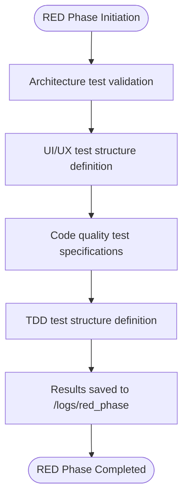

**Diagram sources**
- [red-phase.sh](file://tools/testing/phase-executors/red-phase.sh#L1-L38)

The RED phase utilizes several specialized agents:
- **Architect Review Agent**: Validates frontend architecture test patterns across component structure, routing patterns, state management, API integration, and error boundaries
- **Apex UI/UX Designer Agent**: Defines UI/UX test structures for aesthetic clinic workflows, focusing on patient registration flows, appointment scheduling interfaces, and WhatsApp integration components
- **Code Reviewer Agent**: Establishes code quality test specifications covering TypeScript type safety, component performance, bundle size analysis, and security patterns
- **Test Auditor Agent**: Defines comprehensive TDD test structures with coverage requirements for unit tests, integration tests, and end-to-end tests

This phase sets the stage for subsequent testing by ensuring that proper test infrastructure and quality standards are in place before implementation begins.

### GREEN Phase: Comprehensive Test Execution

The GREEN phase executes the actual tests defined in the RED phase, verifying that the implemented code meets the specified requirements. This phase runs through the `green-phase.sh` script, which coordinates multiple testing modalities:

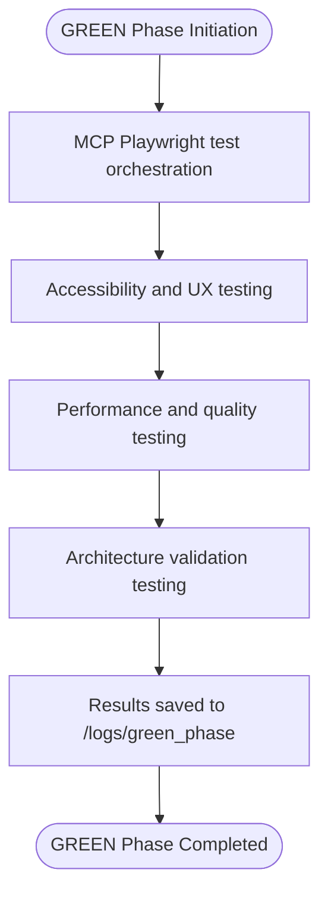

**Diagram sources**
- [green-phase.sh](file://tools/testing/phase-executors/green-phase.sh#L1-L41)

Key activities in the GREEN phase include:
- **MCP Playwright Test Orchestration**: Executes a comprehensive test suite across multiple browsers (Chromium, Firefox, WebKit, Mobile Chrome, Mobile Safari) with detailed reporting including HTML, JSON, screenshots, videos, and trace files
- **Accessibility Validation**: Performs WCAG 2.1 AA+ accessibility checks focusing on color contrast validation, keyboard navigation, screen reader compatibility, and mobile responsiveness across eight device sizes from iPhone 5 to desktop
- **Performance Testing**: Conducts thorough performance assessments measuring page load performance, component render performance, and API response performance using Lighthouse integration, bundle analysis, and memory usage assessment
- **Architecture Validation**: Verifies frontend architecture patterns including component composition, routing patterns, state management, and error boundaries

The GREEN phase ensures that the implemented solution not only functions correctly but also meets quality standards for accessibility, performance, and architectural integrity.

### REFACTOR Phase: Optimization & Improvement

The REFACTOR phase focuses on optimizing the codebase based on insights gained from previous phases. Executed via the `refactor-phase.sh` script, this phase generates recommendations for improvement across multiple dimensions:

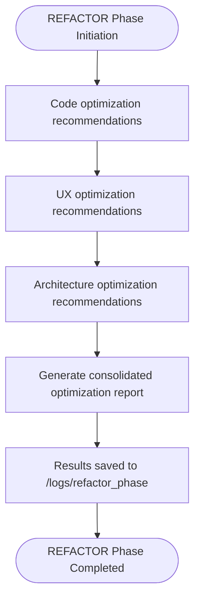

**Diagram sources**
- [refactor-phase.sh](file://tools/testing/phase-executors/refactor-phase.sh#L1-L62)

The REFACTOR phase produces a comprehensive optimization summary that categorizes improvements into:
- **Code Optimizations**: Identifies opportunities for bundle size reduction, addresses performance bottlenecks, improves API efficiency, and optimizes memory usage
- **UX Optimizations**: Resolves accessibility issues, enhances mobile responsiveness, improves overall user experience, and ensures design system consistency
- **Architecture Optimizations**: Recommends improvements to component composition, optimizes state management, enhances error handling strategies, and improves scalability

This structured approach to refactoring ensures that improvements are systematically identified and prioritized, with critical performance issues addressed first, followed by high-impact UX improvements, architecture scalability enhancements, and code maintainability refinements.

**Section sources**
- [red-phase.sh](file://tools/testing/phase-executors/red-phase.sh#L1-L38)
- [green-phase.sh](file://tools/testing/phase-executors/green-phase.sh#L1-L41)
- [refactor-phase.sh](file://tools/testing/phase-executors/refactor-phase.sh#L1-L62)

## Phase Coordination and Quality Gates

The TDD Orchestration Framework implements a sophisticated coordination system that manages the execution of different phases and enforces quality gates to ensure code quality standards are met. The core orchestration logic, implemented in TypeScript, coordinates with the shell script phase executors to create a seamless workflow that adapts to different project requirements and complexity levels.

### Quality Gate Implementation

Quality gates are enforced through the `quality-gate-phase.sh` script, which validates that all quality thresholds have been met before considering a feature ready for production:

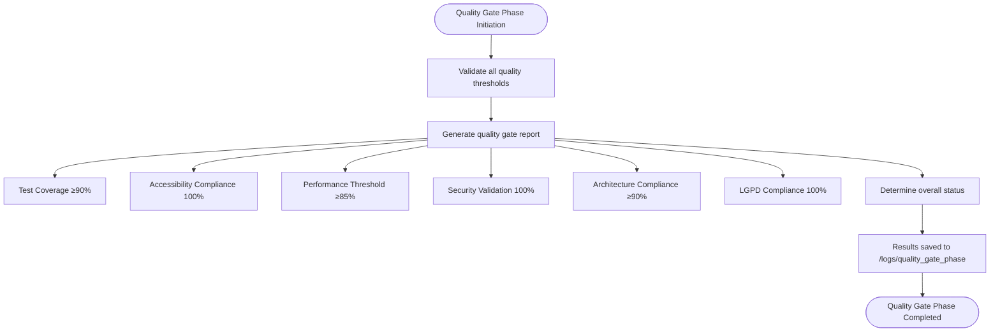

**Diagram sources**
- [quality-gate-phase.sh](file://tools/testing/phase-executors/quality-gate-phase.sh#L1-L63)

The quality gate validation process assesses multiple critical metrics:
- **Test Coverage**: Requires a minimum of 90% coverage, with detailed component coverage analysis
- **Accessibility Compliance**: Mandates 100% WCAG 2.1 AA+ compliance, with thorough violation analysis and recommended fixes
- **Performance Thresholds**: Sets a target of at least 85% Lighthouse score, with detailed breakdown of performance metrics
- **Security Validation**: Demands zero high or critical vulnerabilities, with comprehensive security scan results
- **Architecture Compliance**: Requires at least 90% pattern compliance, with detailed architecture validation results
- **LGPD Compliance**: Ensures 100% data protection compliance, with thorough privacy validation

The final determination of production readiness depends on passing all these quality gates, with any failures preventing deployment until resolved.

### Phase Synchronization in Distributed Environments

One of the key challenges in distributed development environments is maintaining proper synchronization between different phases of the TDD cycle. The framework addresses this through several mechanisms:

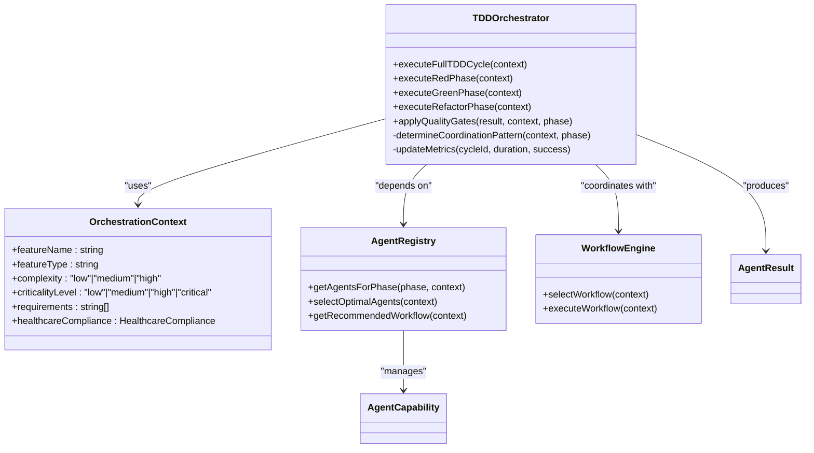

**Diagram sources**
- [tdd-orchestrator.ts](file://tools/orchestration/src/tdd-orchestrator.ts#L1-L489)
- [agent-registry.ts](file://tools/orchestration/src/agent-registry.ts#L1-L476)

The framework uses an `OrchestrationContext` object to maintain state throughout the TDD cycle, ensuring that information flows seamlessly between phases. This context contains essential information about the feature being developed, including its name, type, complexity, criticality level, requirements, and healthcare compliance needs. The `TDDOrchestrator` uses this context to make intelligent decisions about agent selection, coordination patterns, and quality gate requirements.

For distributed environments, the framework implements three primary coordination patterns:
- **Sequential**: Agents execute one after another, ideal for healthcare compliance scenarios where strict ordering is required
- **Parallel**: Multiple agents execute simultaneously, maximizing efficiency for non-critical features
- **Hierarchical**: Agents are organized in a hierarchy with primary agents coordinating secondary agents, suitable for high-complexity features

The choice of coordination pattern is determined dynamically based on the feature's characteristics, with healthcare compliance always triggering sequential execution to ensure regulatory requirements are properly validated.

**Section sources**
- [quality-gate-phase.sh](file://tools/testing/phase-executors/quality-gate-phase.sh#L1-L63)
- [tdd-orchestrator.ts](file://tools/orchestration/src/tdd-orchestrator.ts#L1-L489)
- [agent-registry.ts](file://tools/orchestration/src/agent-registry.ts#L1-L476)

## Healthcare Compliance Integration

The TDD Orchestration Framework places significant emphasis on healthcare compliance, recognizing the critical importance of regulatory adherence in medical applications. The framework integrates compliance validation throughout the TDD cycle, ensuring that all developed features meet the stringent requirements of Brazilian healthcare regulations.

### Regulatory Framework Support

The framework specifically supports three major Brazilian healthcare regulations:
- **LGPD (Lei Geral de Proteção de Dados)**: Brazil's General Data Protection Law, which establishes guidelines for personal data processing and protection
- **ANVISA (Agência Nacional de Vigilância Sanitária)**: The National Health Surveillance Agency, which regulates medical devices and healthcare software
- **CFM (Conselho Federal de Medicina)**: The Federal Council of Medicine, which sets standards for telemedicine and medical software

These regulations are integrated into the TDD cycle through dedicated validation steps and quality gates that ensure compliance is maintained throughout development.

### Compliance Validation Process

The framework implements healthcare compliance validation through a multi-layered approach that spans all phases of the TDD cycle:

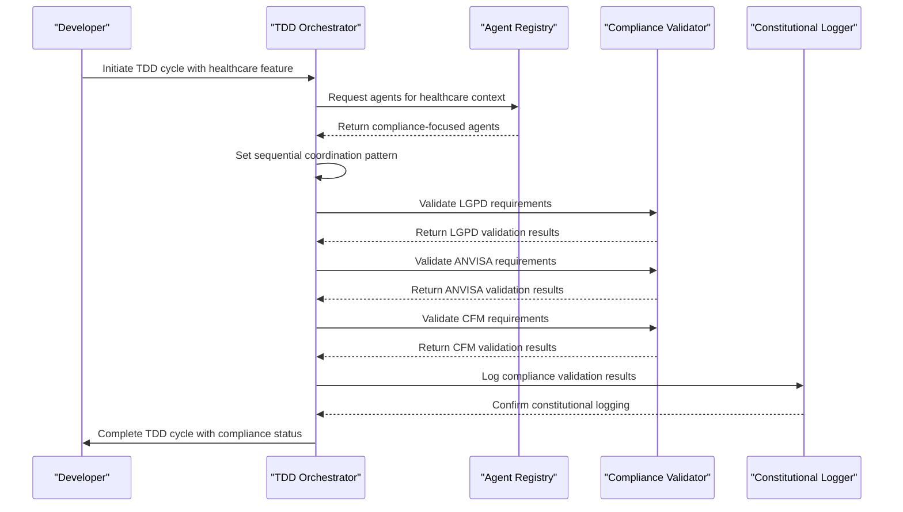

**Diagram sources**
- [tdd-orchestrator.ts](file://tools/orchestration/src/tdd-orchestrator.ts#L1-L489)
- [agent-registry.ts](file://tools/orchestration/src/agent-registry.ts#L1-L476)

When a feature with healthcare compliance requirements is initiated, the `TDDOrchestrator` automatically adjusts its behavior to ensure proper validation. This includes:
- Selecting only agents that have healthcare compliance capabilities
- Enforcing sequential coordination to ensure proper validation order
- Applying stricter quality gates for security and data protection
- Generating comprehensive compliance reports

The `validateHealthcareCompliance` method in the `TDDOrchestrator` calculates a compliance score based on the presence of LGPD, ANVISA, and CFM requirements, with each regulation contributing to the overall score (LGPD: 33 points, ANVISA: 33 points, CFM: 34 points).

### Configuration for Healthcare Compliance Testing

To configure the TDD Orchestration Framework for healthcare compliance testing, developers can use the following example configuration:

```typescript
const result = await runTDDCycle('patient-authentication', {
  workflow: 'security-critical-tdd',
  healthcareCompliance: true,
  coordination: 'sequential',
  agents: [
    'architect-review',
    'code-reviewer',
    'security-auditor',
    'tdd-orchestrator'
  ],
  qualityGates: [
    'test-coverage',
    'code-quality-score',
    'security-vulnerabilities',
    'healthcare-compliance'
  ]
});
```

This configuration ensures that:
- The security-critical workflow is used, which includes enhanced security validation
- Healthcare compliance is explicitly enabled, triggering additional validation steps
- Sequential coordination is enforced to maintain proper validation order
- A comprehensive set of agents is engaged, including those with specific healthcare compliance expertise
- Quality gates include specific healthcare compliance validation

The framework also supports constitutional logging, which records all compliance activities with reference to constitutional principles, providing an auditable trail of compliance validation.

**Section sources**
- [tdd-orchestrator.ts](file://tools/orchestration/src/tdd-orchestrator.ts#L1-L489)
- [agent-registry.ts](file://tools/orchestration/src/agent-registry.ts#L1-L476)
- [README.md](file://tools/orchestration/README.md#L1-L224)

## Agent Registry and Selection

The Agent Registry is a fundamental component of the TDD Orchestration Framework, responsible for managing and selecting appropriate agents for each phase of the TDD cycle. This registry maintains a catalog of available agents, their capabilities, and their specializations, enabling intelligent agent selection based on the specific requirements of each development task.

### Agent Capability Model

Agents in the framework are defined by a comprehensive capability model that includes:
- **Type**: Categorization of the agent (e.g., tdd-orchestrator, architect-review, code-reviewer, security-auditor, test)
- **Name and Description**: Human-readable identification and explanation of the agent's purpose
- **Capabilities**: Specific skills and functions the agent can perform
- **Specializations**: Areas of expertise or focus
- **Priority**: Classification as primary, secondary, or tertiary based on importance
- **Supported Phases**: TDD phases in which the agent can participate (red, green, refactor)
- **Triggers**: Keywords or conditions that activate the agent
- **Configuration**: Settings and parameters for the agent
- **Healthcare Compliance**: Specific regulatory compliance capabilities (LGPD, ANVISA, CFM)

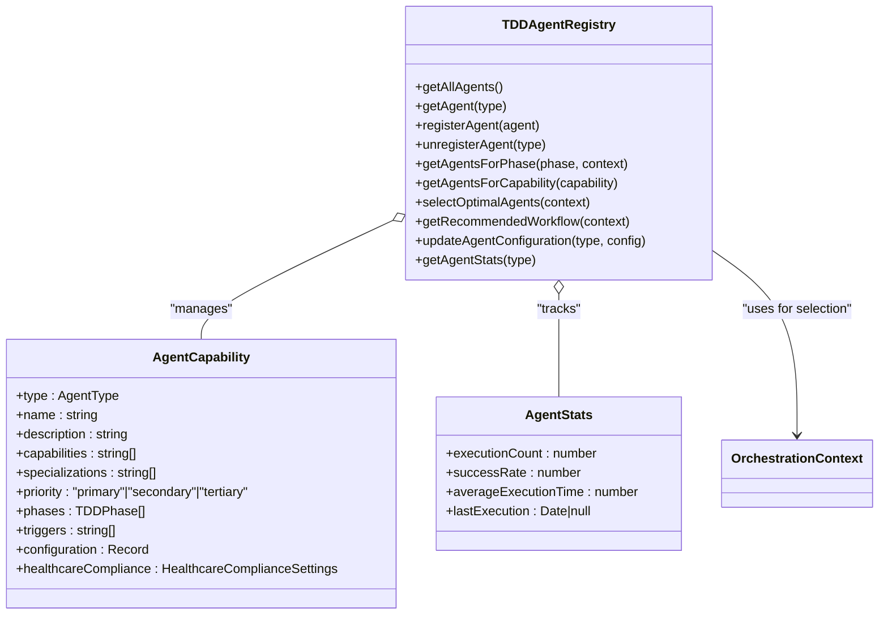

**Diagram sources**
- [agent-registry.ts](file://tools/orchestration/src/agent-registry.ts#L1-L476)

### Agent Selection Algorithm

The agent selection process is driven by a sophisticated algorithm that evaluates multiple factors to determine the optimal set of agents for a given development context. The `selectOptimalAgents` method in the `TDDAgentRegistry` calculates a relevance score for each agent based on:

1. **Base Score by Priority**: Primary agents receive 100 points, secondary agents 75 points, and tertiary agents 50 points
2. **Matching Triggers**: Each matching trigger adds 10 points to the agent's score
3. **Matching Specializations**: Each matching specialization adds 15 points to the agent's score
4. **Healthcare Compliance Bonus**: When healthcare compliance is required, agents with relevant compliance capabilities receive additional points (up to 75 points total)
5. **Complexity Matching**: High-complexity features provide a 20-point bonus to primary agents

The algorithm then sorts agents by their calculated scores and returns them in descending order of relevance. This ensures that the most appropriate agents are selected for each development task.

### Context-Aware Agent Selection

The framework's agent selection is highly context-aware, adapting to the specific characteristics of each development feature. The `getAgentsForPhase` method filters agents based on both the current TDD phase and the orchestration context:

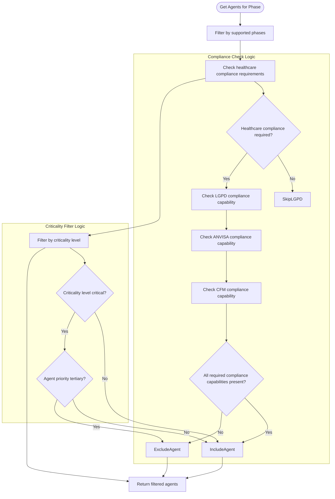

**Diagram sources**
- [agent-registry.ts](file://tools/orchestration/src/agent-registry.ts#L1-L476)

This context-aware filtering ensures that:
- Only agents capable of supporting the current phase are selected
- For healthcare compliance features, only agents with the necessary compliance capabilities are included
- For critical features, tertiary agents are excluded to ensure reliability
- The final selection represents the optimal combination of capabilities for the specific development context

The framework includes several default agents with healthcare compliance capabilities, ensuring that regulatory requirements are consistently addressed:
- **TDD Orchestrator**: Has full LGPD, ANVISA, and CFM compliance capabilities
- **Architecture Review Agent**: Supports all three healthcare regulations
- **Code Reviewer Agent**: Compliant with all healthcare regulations
- **Security Audit Agent**: Validated for LGPD, ANVISA, and CFM compliance
- **Test Coordination Agent**: Certified for all healthcare compliance requirements

This comprehensive approach to agent management and selection ensures that the right expertise is applied to each development task, with particular attention to regulatory compliance in healthcare applications.

**Section sources**
- [agent-registry.ts](file://tools/orchestration/src/agent-registry.ts#L1-L476)

## Configuration and Extension

The TDD Orchestration Framework is designed to be highly configurable and extensible, allowing teams to adapt the system to their specific development workflows and requirements. The framework provides multiple extension points that enable customization of the TDD cycle, agent behavior, and quality gate enforcement.

### Customizing the TDD Cycle

Teams can customize the TDD cycle through configuration options that control workflow selection, coordination patterns, and agent participation. The framework supports multiple workflow types, each optimized for different development scenarios:

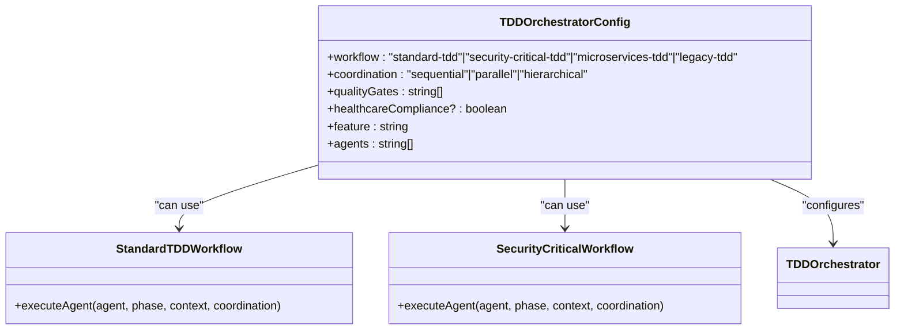

**Diagram sources**
- [tdd-orchestrator.ts](file://tools/orchestration/src/tdd-orchestrator.ts#L1-L489)
- [standard-tdd.ts](file://tools/orchestration/src/workflows/standard-tdd.ts#L1-L34)
- [security-critical.ts](file://tools/orchestration/src/workflows/security-critical.ts#L1-L43)

The available workflow types include:
- **Standard TDD**: Balanced approach suitable for general development tasks
- **Security-Critical TDD**: Enhanced security validation for sensitive features
- **Microservices TDD**: Optimized for distributed microservice architectures
- **Legacy TDD**: Adapted for maintaining and enhancing legacy systems

Each workflow type implements specific validation and execution patterns tailored to its use case. For example, the `SecurityCriticalWorkflow` applies enhanced security validation and assigns higher compliance scores when healthcare requirements are present.

### Extending with New Agents

The framework supports easy extension through the addition of new agents. Developers can register custom agents with specific capabilities and specializations:

```typescript
// Example: Registering a custom healthcare compliance agent
const healthcareAuditAgent: AgentCapability = {
  type: "healthcare-audit",
  name: "Healthcare Audit Agent",
  description: "Specialized agent for healthcare regulation auditing",
  capabilities: [
    "lgpd-audit",
    "anvisa-compliance-check",
    "cfm-guideline-validation",
    "medical-data-protection"
  ],
  specializations: [
    "healthcare-regulations",
    "patient-data-security",
    "medical-software-compliance"
  ],
  priority: "secondary",
  phases: ["red", "green", "refactor"],
  triggers: ["healthcare", "compliance", "audit", "lgpd", "anvisa", "cfm"],
  configuration: {
    auditFrequency: "daily",
    complianceThreshold: 95,
    reportingFormat: "detailed"
  },
  healthcareCompliance: {
    lgpd: true,
    anvisa: true,
    cfm: true
  }
};

// Register the agent with the registry
agentRegistry.registerAgent(healthcareAuditAgent);
```

New agents can be integrated into the existing TDD cycle without modifying the core orchestration logic, thanks to the framework's modular design.

### Configuring Quality Gates

Quality gates can be customized to meet specific project requirements. The framework allows teams to define their own quality gate configurations and thresholds:

```typescript
// Example: Custom quality gate configuration for a healthcare project
const healthcareQualityConfig = {
  "test-coverage": {
    threshold: 95,
    requirement: "All patient data handling must be thoroughly tested"
  },
  "accessibility-compliance": {
    threshold: 100,
    requirement: "WCAG 2.1 AA+ compliance required for all interfaces"
  },
  "security-vulnerabilities": {
    threshold: 0,
    requirement: "Zero high/critical vulnerabilities allowed"
  },
  "lgpd-compliance": {
    threshold: 100,
    requirement: "Full LGPD compliance required for all patient data operations"
  },
  "performance-threshold": {
    threshold: 90,
    requirement: "Lighthouse performance score must exceed 90"
  }
};
```

These custom quality gates are automatically enforced during the quality gate validation phase, ensuring that project-specific requirements are consistently applied.

**Section sources**
- [tdd-orchestrator.ts](file://tools/orchestration/src/tdd-orchestrator.ts#L1-L489)
- [standard-tdd.ts](file://tools/orchestration/src/workflows/standard-tdd.ts#L1-L34)
- [security-critical.ts](file://tools/orchestration/src/workflows/security-critical.ts#L1-L43)

## Error Handling and Recovery

The TDD Orchestration Framework implements comprehensive error handling and recovery mechanisms to ensure reliable operation even in the face of unexpected issues. These mechanisms are designed to maintain the integrity of the TDD cycle while providing clear feedback about problems and facilitating recovery.

### Phase-Level Error Handling

Each phase of the TDD cycle includes specific error handling strategies to address common failure modes:

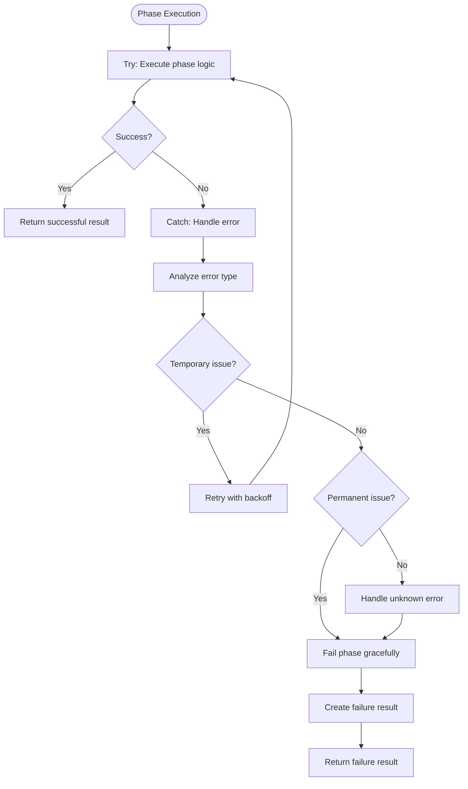

**Diagram sources**
- [tdd-orchestrator.ts](file://tools/orchestration/src/tdd-orchestrator.ts#L1-L489)

The framework distinguishes between temporary and permanent errors, applying different recovery strategies accordingly:
- **Temporary errors** (e.g., network timeouts, resource contention) trigger automatic retry mechanisms with exponential backoff
- **Permanent errors** (e.g., syntax errors, missing dependencies) result in graceful phase failure with detailed error reporting
- **Unknown errors** are logged extensively to facilitate debugging and future improvement of error handling

### State Management for Recovery

To support recovery from failures, the framework implements robust state management that preserves progress across the TDD cycle:

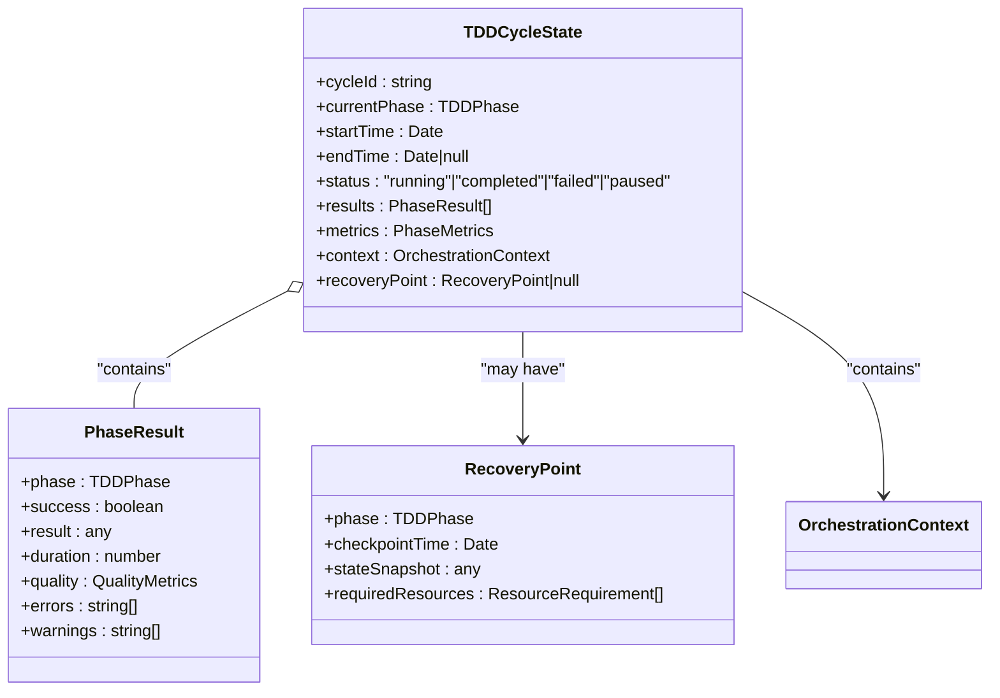

**Diagram sources**
- [tdd-orchestrator.ts](file://tools/orchestration/src/tdd-orchestrator.ts#L1-L489)
- [types.ts](file://tools/orchestration/src/types.ts#L1-L232)

The `TDDCycleState` object maintains comprehensive information about the current TDD cycle, including:
- Unique cycle identifier and timing information
- Current phase and overall status
- Detailed results from completed phases
- Performance metrics and quality scores
- The original orchestration context
- Recovery points that allow resumption from specific checkpoints

This state management enables the framework to resume interrupted TDD cycles from the last successful phase, avoiding redundant work and preserving valuable test results.

### Error Recovery Strategies

The framework employs several error recovery strategies to maximize the chances of successful TDD cycle completion:

1. **Automatic Retry with Backoff**: For transient errors, the framework automatically retries failed operations with increasing delays between attempts
2. **Graceful Degradation**: When certain agents or capabilities are unavailable, the framework can continue with a reduced set of validations
3. **Checkpoint Restart**: If a phase fails, the framework can restart from the last successful checkpoint rather than beginning from scratch
4. **Fallback Workflows**: In cases where the primary workflow fails, the framework can switch to alternative workflows better suited to the current context

These recovery mechanisms ensure that the TDD Orchestration Framework remains resilient in the face of various failure modes, from temporary infrastructure issues to more persistent code-level problems.

**Section sources**
- [tdd-orchestrator.ts](file://tools/orchestration/src/tdd-orchestrator.ts#L1-L489)
- [types.ts](file://tools/orchestration/src/types.ts#L1-L232)

## Performance and Metrics

The TDD Orchestration Framework includes comprehensive performance monitoring and metrics collection to provide insights into the efficiency and effectiveness of the T