# Test Fixtures & Data Management

<cite>
**Referenced Files in This Document**
- [healthcare-data.ts](file://tools/testing-toolkit/src/fixtures/healthcare-data.ts)
- [mock-services.ts](file://tools/testing-toolkit/src/fixtures/mock-services.ts)
- [index.ts](file://tools/testing-toolkit/src/fixtures/index.ts)
- [appointment.contract.test.ts](file://apps/api/src/__tests__/contracts/appointment.contract.test.ts)
- [ai-appointment-scheduling-service.test.ts](file://apps/api/src/services/ai-scheduling/ai-appointment-scheduling-service.test.ts)
</cite>

## Table of Contents

1. [Introduction](#introduction)
2. [Healthcare Test Data Generation](#healthcare-test-data-generation)
3. [Mock Service Implementation](#mock-service-implementation)
4. [Fixture Usage in E2E Testing](#fixture-usage-in-e2e-testing)
5. [API Handler and External Service Integration](#api-handler-and-external-service-integration)
6. [Test Data Isolation and Cleanup](#test-data-isolation-and-cleanup)
7. [Creating Custom Fixture Types](#creating-custom-fixture-types)
8. [Conclusion](#conclusion)

## Introduction

This document provides comprehensive guidance on the test fixtures and data management system for healthcare applications, focusing on realistic test data generation and mock service setup. The system ensures consistent testing environments while maintaining compliance with Brazilian healthcare regulations such as LGPD (Lei Geral de Proteção de Dados). The documentation covers fixture factories for patient records, appointments, and consent forms, along with practical examples of their usage in end-to-end testing scenarios.

## Healthcare Test Data Generation

The healthcare test data generation system creates realistic patient records, clinics, professionals, and consent forms that comply with Brazilian healthcare regulations. The system uses fixture factories to generate valid test data with proper formatting for CPF (Cadastro de Pessoas Físicas), CNPJ (Cadastro Nacional da Pessoa Jurídica), and CRM (Conselho Regional de Medicina) identifiers.

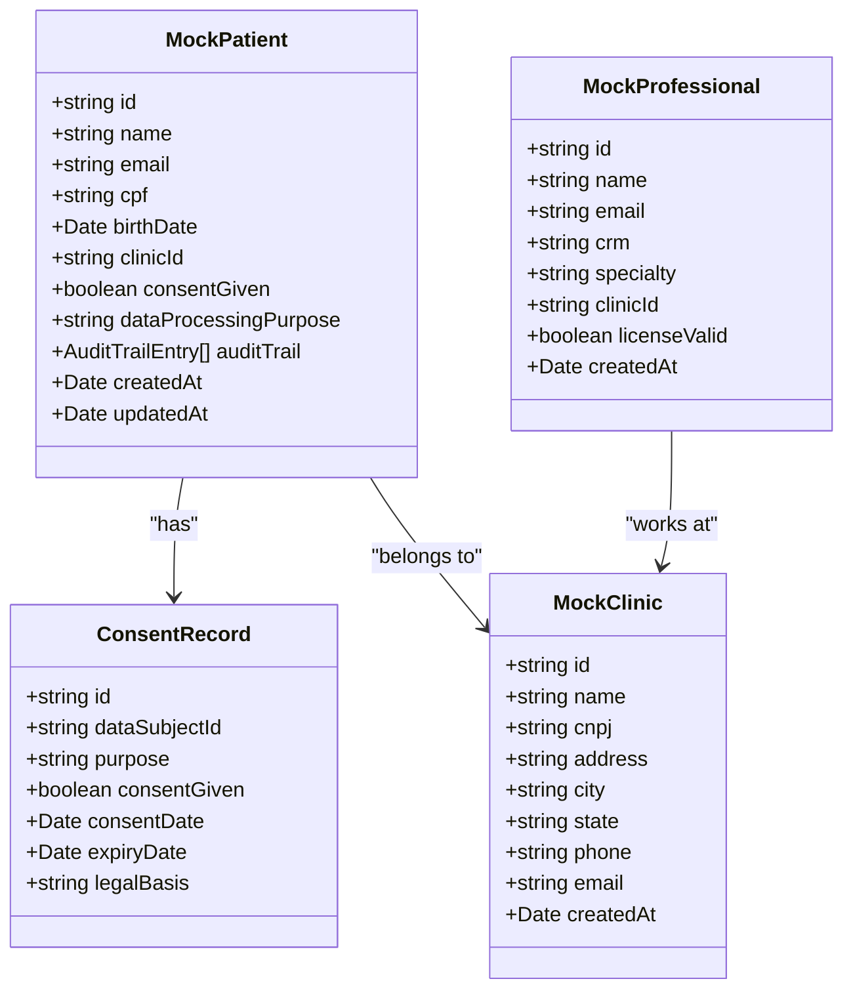

**Diagram sources**

- [healthcare-data.ts](file://tools/testing-toolkit/src/fixtures/healthcare-data.ts#L10-L100)

**Section sources**

- [healthcare-data.ts](file://tools/testing-toolkit/src/fixtures/healthcare-data.ts#L50-L100)

### Patient Record Creation

The `createMockPatient` function generates valid patient records with realistic Brazilian names, email addresses, and CPF numbers formatted according to Brazilian standards. The function includes audit trail entries that comply with LGPD requirements for data processing transparency.

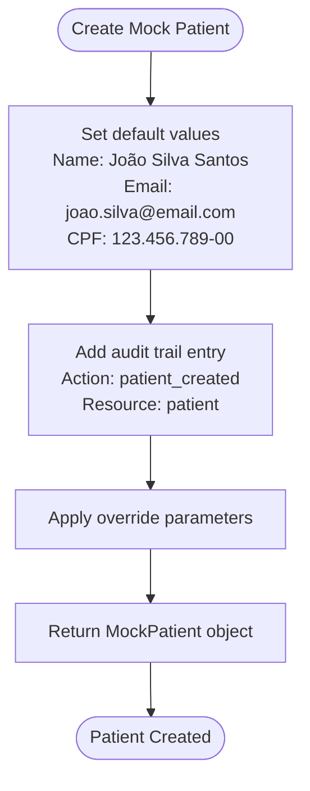

**Diagram sources**

- [healthcare-data.ts](file://tools/testing-toolkit/src/fixtures/healthcare-data.ts#L50-L79)

**Section sources**

- [healthcare-data.ts](file://tools/testing-toolkit/src/fixtures/healthcare-data.ts#L50-L79)

### Consent Management

The system implements comprehensive consent management that aligns with LGPD Article 7, which requires explicit consent for personal data processing. The `createMockConsentRecord` function generates consent records with valid legal basis references and expiration dates set two years from creation, following Brazilian healthcare data retention guidelines.

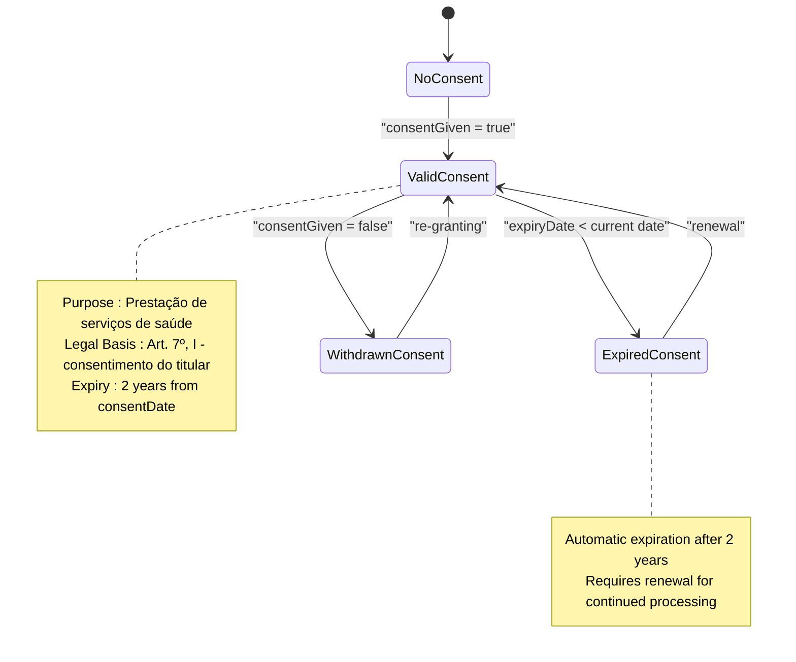

**Diagram sources**

- [healthcare-data.ts](file://tools/testing-toolkit/src/fixtures/healthcare-data.ts#L123-L141)

**Section sources**

- [healthcare-data.ts](file://tools/testing-toolkit/src/fixtures/healthcare-data.ts#L123-L141)

## Mock Service Implementation

The mock service implementation provides isolated testing environments by simulating real service behavior without external dependencies. These mocks enable consistent test execution across different environments while maintaining healthcare compliance requirements.

```mermaid
classDiagram
class MockAuthService {
+Map<string, MockUser> users
+Map<string, MockSession> sessions
+addUser(user) void
+login(email, password) Promise~{user, token}~
+validateToken(token) Promise~MockUser~
+logout(token) Promise~boolean~
+reset() void
}
class MockPatientService {
+Map<string, MockPatient> patients
+addPatient(patient) void
+getPatient(id) Promise~MockPatient~
+getPatientsByClinic(clinicId) Promise~MockPatient[]~
+createPatient(patientData) Promise~MockPatient~
+updatePatient(id, updates) Promise~MockPatient~
+deletePatient(id) Promise~boolean~
+reset() void
}
class MockClinicService {
+Map<string, MockClinic> clinics
+addClinic(clinic) void
+getClinic(id) Promise~MockClinic~
+getAllClinics() Promise~MockClinic[]~
+reset() void
}
MockAuthService --> MockPatientService : "authenticates"
MockPatientService --> MockClinicService : "associates with"
```

**Diagram sources**

- [mock-services.ts](file://tools/testing-toolkit/src/fixtures/mock-services.ts#L9-L133)

**Section sources**

- [mock-services.ts](file://tools/testing-toolkit/src/fixtures/mock-services.ts#L9-L133)

### Authentication Flow

The mock authentication service simulates JWT-based authentication flows commonly used in healthcare applications. It validates credentials against predefined test patterns and generates time-limited tokens that expire after 24 hours, reflecting real-world security practices.

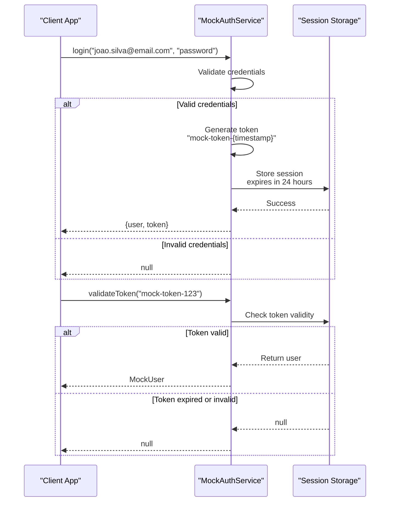

**Diagram sources**

- [mock-services.ts](file://tools/testing-toolkit/src/fixtures/mock-services.ts#L9-L67)

**Section sources**

- [mock-services.ts](file://tools/testing-toolkit/src/fixtures/mock-services.ts#L9-L67)

## Fixture Usage in E2E Testing

The test fixtures are extensively used in end-to-end testing scenarios for appointment scheduling workflows. These tests validate the complete integration between frontend components, API handlers, and backend services while ensuring healthcare compliance.

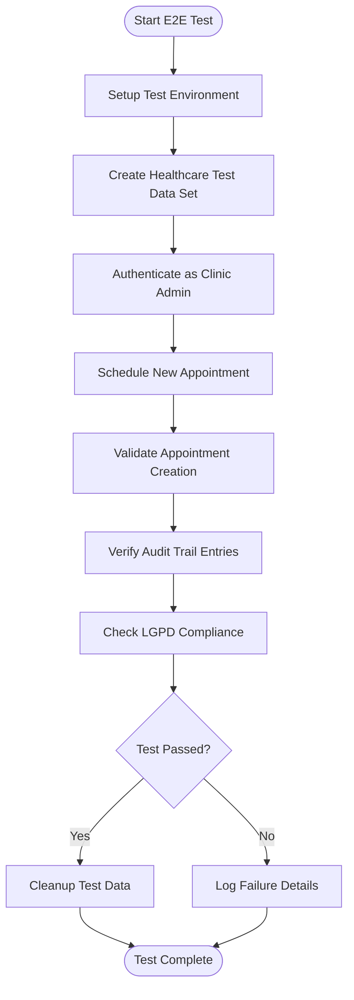

**Section sources**

- [appointment.contract.test.ts](file://apps/api/src/__tests__/contracts/appointment.contract.test.ts#L55-L100)
- [ai-appointment-scheduling-service.test.ts](file://apps/api/src/services/ai-scheduling/ai-appointment-scheduling-service.test.ts#L1-L50)

### Appointment Scheduling Scenario

The following example demonstrates how healthcare test fixtures are used in an end-to-end appointment scheduling scenario:

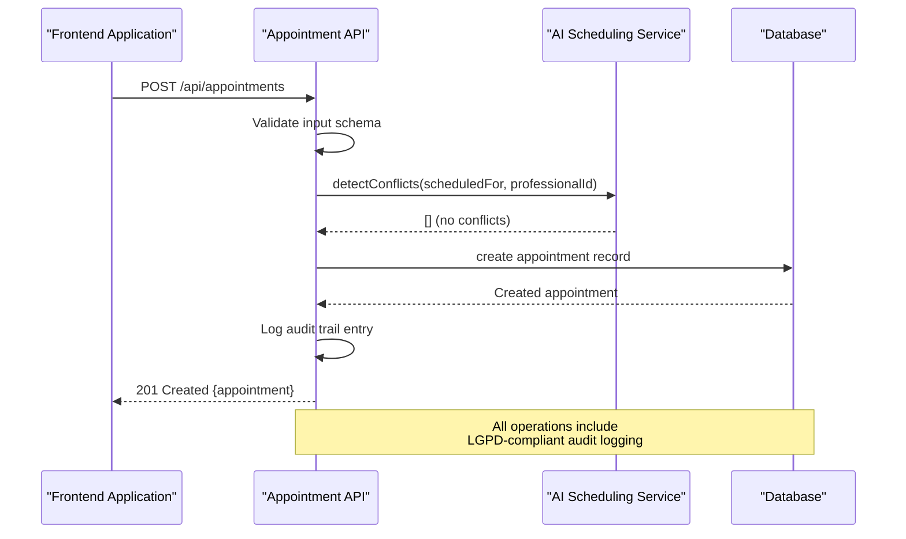

**Section sources**

- [appointment.contract.test.ts](file://apps/api/src/__tests__/contracts/appointment.contract.test.ts#L55-L100)

## API Handler and External Service Integration

The system integrates API handlers with mocked external services to simulate interactions with payment gateways, AI providers, and other third-party systems. This integration ensures that healthcare applications can be tested comprehensively without relying on external dependencies.

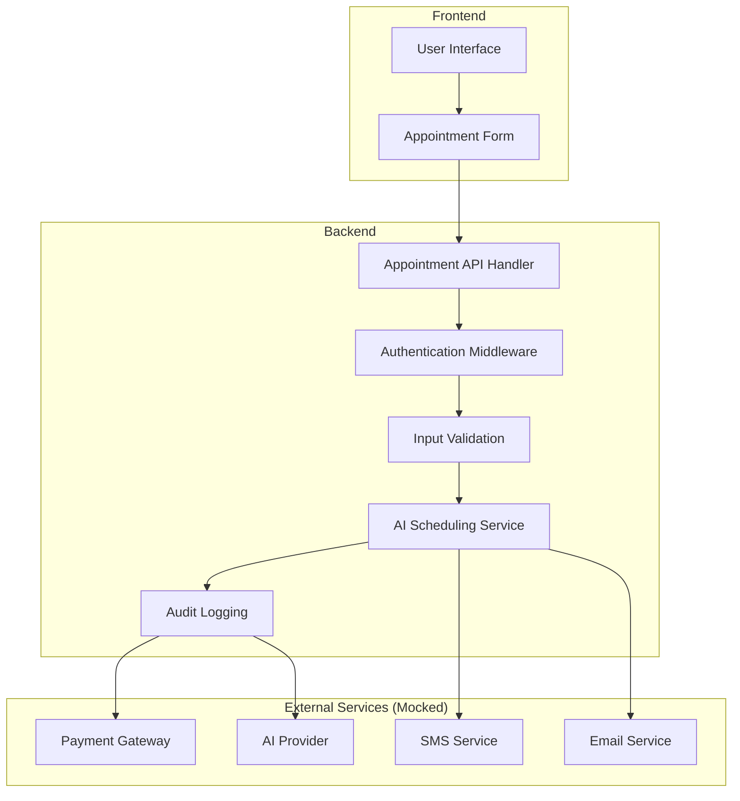

**Section sources**

- [ai-appointment-scheduling-service.test.ts](file://apps/api/src/services/ai-scheduling/ai-appointment-scheduling-service.test.ts#L1-L50)

### AI Provider Integration

The mock AI provider service simulates intelligent appointment scheduling capabilities while maintaining healthcare compliance. The service responds to medical-related queries and appointment requests with appropriate responses that reflect Brazilian healthcare practices.

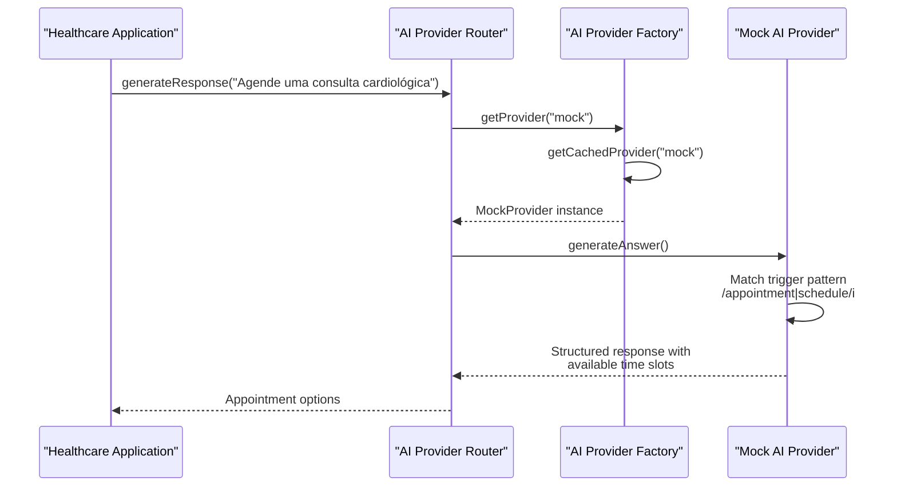

**Section sources**

- [ai-appointment-scheduling-service.test.ts](file://apps/api/src/services/ai-scheduling/ai-appointment-scheduling-service.test.ts#L1-L50)

## Test Data Isolation and Cleanup

The system implements robust mechanisms for test data isolation and cleanup to prevent data pollution across test suites. These mechanisms ensure that each test runs in a clean environment with predictable initial conditions.

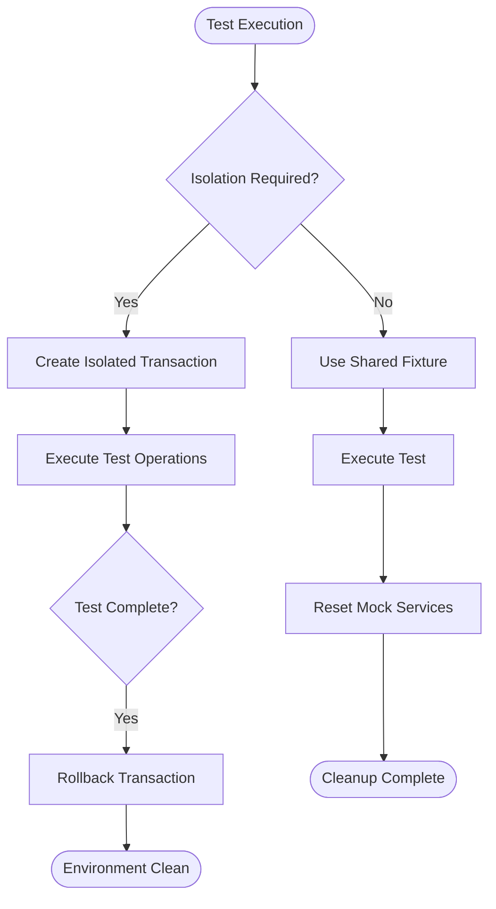

**Section sources**

- [mock-services.ts](file://tools/testing-toolkit/src/fixtures/mock-services.ts#L135-L159)
- [index.ts](file://tools/testing-toolkit/src/fixtures/index.ts#L1-L35)

### Automated Cleanup Process

The automated cleanup process ensures that all test data is properly removed after test execution, preventing data pollution and maintaining database integrity. Each mock service provides a reset method that clears its internal state.

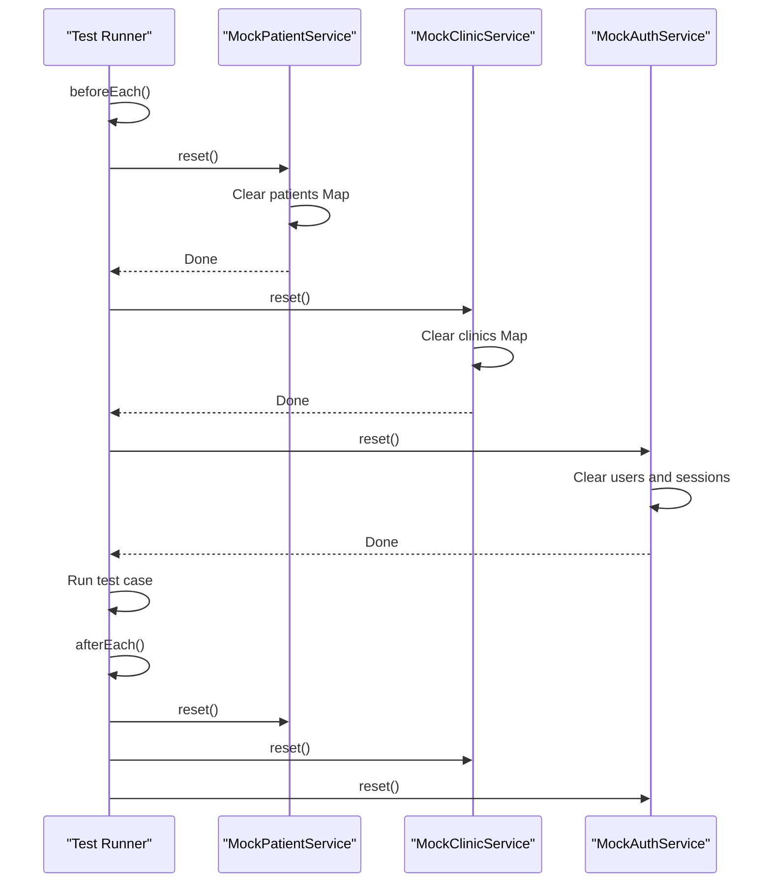

**Section sources**

- [mock-services.ts](file://tools/testing-toolkit/src/fixtures/mock-services.ts#L135-L159)

## Creating Custom Fixture Types

Developers can extend the fixture system to create custom fixture types for specialized clinical workflows. The system provides a flexible foundation that can be adapted to various healthcare domains including aesthetic clinics, telemedicine services, and diagnostic centers.

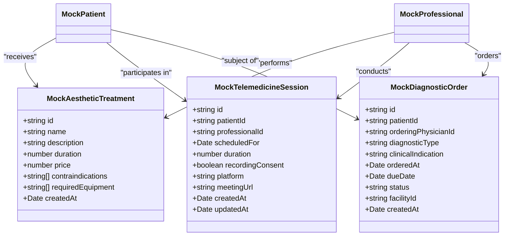

**Section sources**

- [healthcare-data.ts](file://tools/testing-toolkit/src/fixtures/healthcare-data.ts#L146-L176)

### Extending the Fixture System

To create new fixture types for specialized clinical workflows, developers should follow these steps:

1. Define the interface for the new entity
2. Implement a factory function that generates instances with realistic data
3. Ensure compliance with relevant healthcare regulations
4. Integrate with existing mock services
5. Add validation rules for data integrity

The `createHealthcareTestDataSet` function serves as a template for creating comprehensive test data sets that include multiple related entities and their relationships.

## Conclusion

The test fixtures and data management system provides a robust foundation for testing healthcare applications while ensuring compliance with Brazilian regulations. By using realistic test data generation and comprehensive mock services, the system enables thorough testing of appointment scheduling scenarios and other clinical workflows. The automated cleanup processes prevent test data pollution, while the extensible fixture architecture allows developers to create custom test data for specialized healthcare domains. This approach ensures that healthcare applications are thoroughly tested in isolated environments that accurately reflect production conditions.
