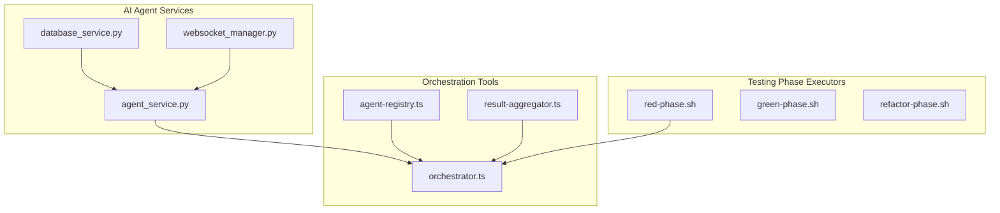
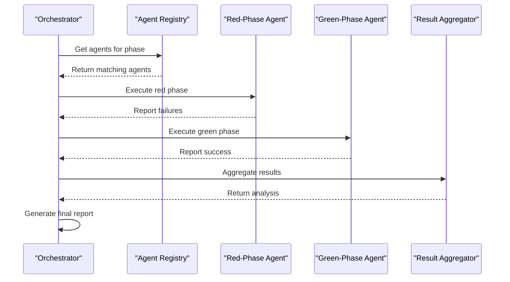
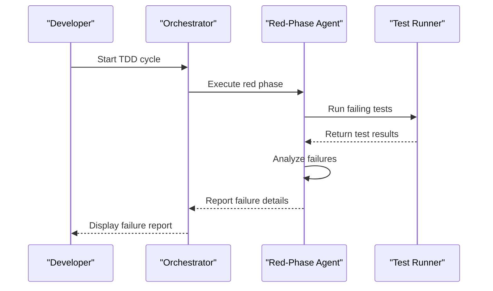
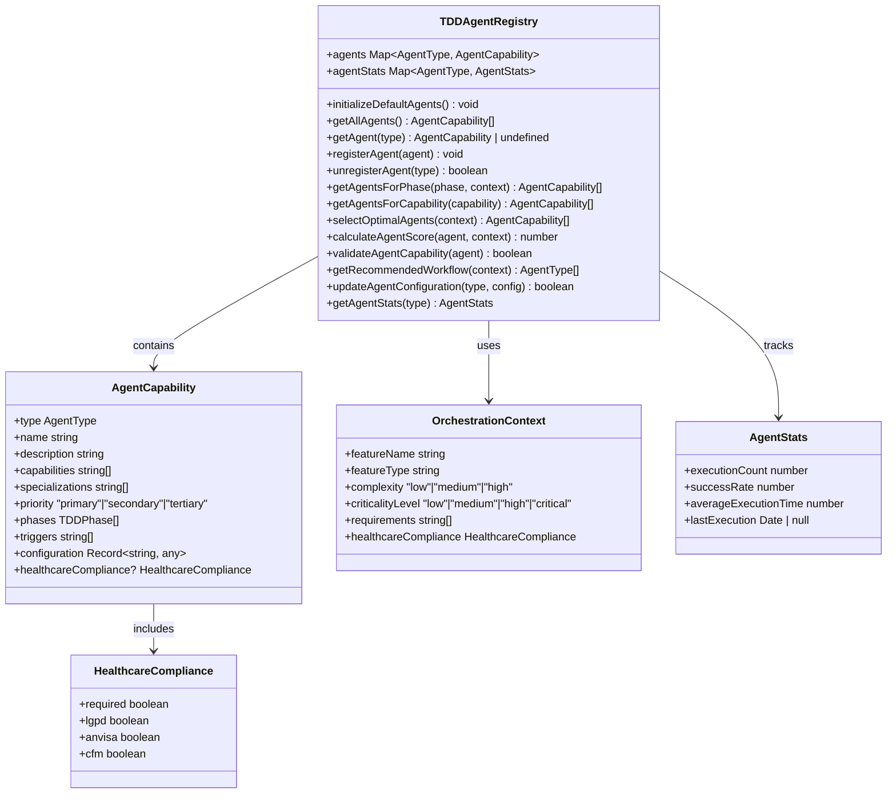
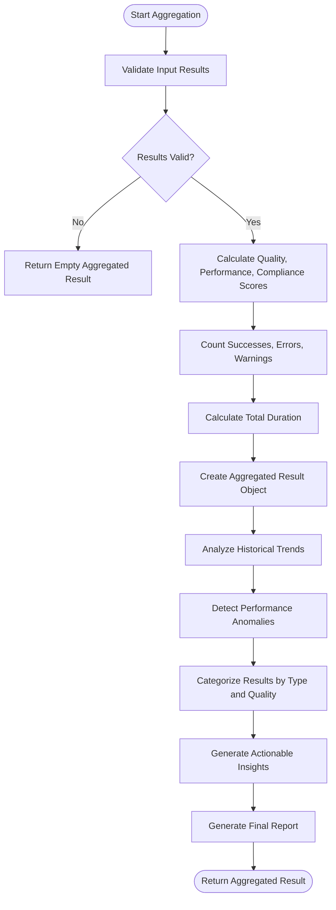
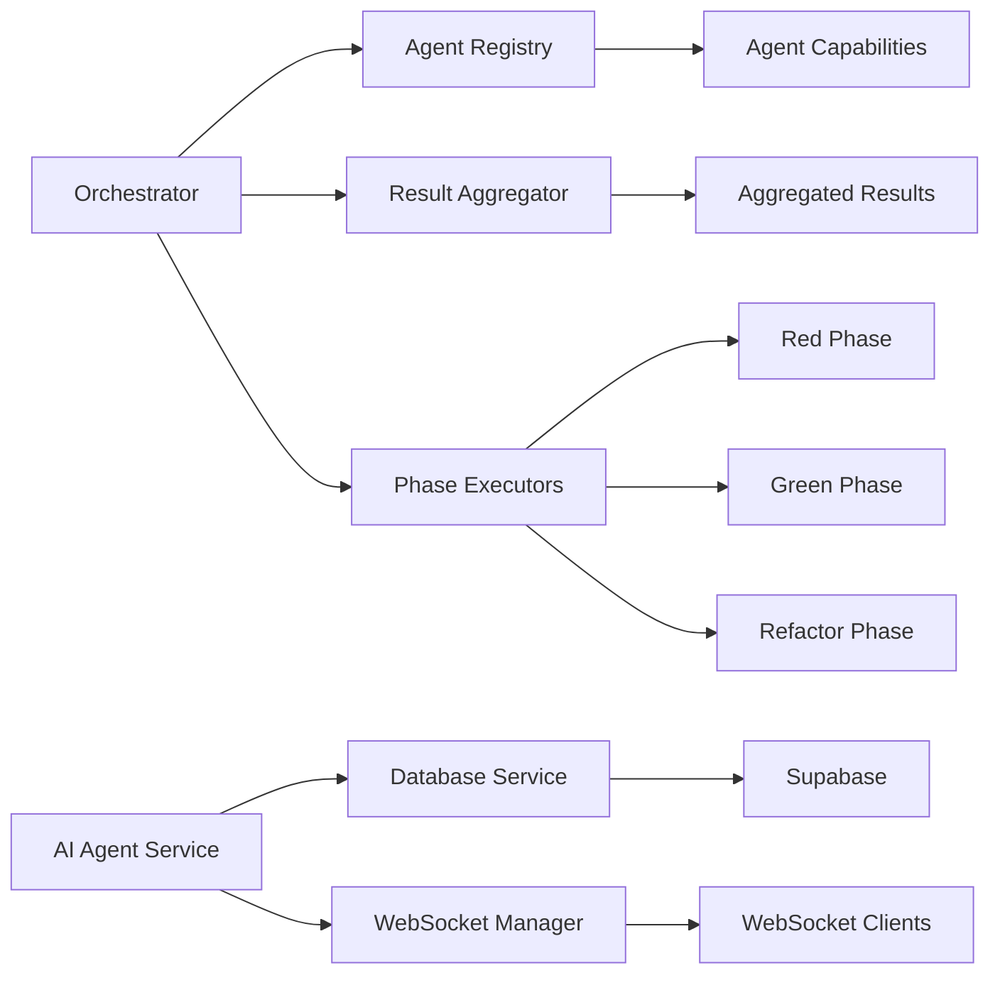

# Testing Agents Coordination

<cite>
**Referenced Files in This Document **
- [agent_service.py](file://apps/ai-agent/services/agent_service.py)
- [database_service.py](file://apps/ai-agent/services/database_service.py)
- [websocket_manager.py](file://apps/ai-agent/services/websocket_manager.py)
- [orchestrator.ts](file://tools/orchestration/src/orchestrator.ts)
- [agent-registry.ts](file://tools/orchestration/src/agent-registry.ts)
- [result-aggregator.ts](file://tools/orchestration/src/result-aggregator.ts)
- [red-phase.sh](file://tools/testing/phase-executors/red-phase.sh)
</cite>

## Table of Contents

1. [Introduction](#introduction)
2. [Project Structure](#project-structure)
3. [Core Components](#core-components)
4. [Architecture Overview](#architecture-overview)
5. [Detailed Component Analysis](#detailed-component-analysis)
6. [Dependency Analysis](#dependency-analysis)
7. [Performance Considerations](#performance-considerations)
8. [Troubleshooting Guide](#troubleshooting-guide)
9. [Conclusion](#conclusion)

## Introduction

This document provides a comprehensive overview of the testing agents coordination system within the NeonPro platform, with a focus on specialized agents responsible for quality assurance phases. The system is designed to ensure robust healthcare compliance validation through coordinated agent execution, intelligent task distribution, and centralized result aggregation. Special attention is given to the red-phase specialist agent for failure detection and reporting, which plays a critical role in identifying defects early in the development lifecycle. The documentation explains how the coordinator manages agent registration, task distribution, and result aggregation while addressing common challenges such as agent timeout in long-running tests through heartbeat monitoring and fallback strategies.

## Project Structure

The testing agents coordination system is organized across multiple directories within the NeonPro repository, with core components located in both the AI agent services and orchestration tools. The architecture follows a modular design pattern that separates concerns between agent implementation, coordination logic, and execution workflows.

**Diagram sources **

- [agent_service.py](file://apps/ai-agent/services/agent_service.py#L1-L500)
- [orchestrator.ts](file://tools/orchestration/src/orchestrator.ts#L1-L311)
- [red-phase.sh](file://tools/testing/phase-executors/red-phase.sh#L1-L50)

**Section sources**

- [agent_service.py](file://apps/ai-agent/services/agent_service.py#L1-L500)
- [orchestrator.ts](file://tools/orchestration/src/orchestrator.ts#L1-L311)

## Core Components

The testing agents coordination system comprises several core components that work together to manage the execution of specialized testing agents. These include the Agent Service for handling AI-driven interactions, Database Service for data persistence, WebSocket Manager for real-time communication, Orchestrator for workflow management, Agent Registry for capability tracking, Result Aggregator for outcome analysis, and phase-specific executors like the red-phase specialist agent. Each component plays a distinct role in ensuring effective coordination and execution of quality assurance processes, particularly in the context of healthcare compliance validation where regulatory requirements demand rigorous testing protocols.

**Section sources**

- [agent_service.py](file://apps/ai-agent/services/agent_service.py#L1-L500)
- [orchestrator.ts](file://tools/orchestration/src/orchestrator.ts#L1-L311)
- [agent-registry.ts](file://tools/orchestration/src/agent-registry.ts#L1-L476)

## Architecture Overview

The testing agents coordination architecture implements a distributed agent-based model where specialized agents handle different phases of quality assurance. The system follows a hub-and-spoke pattern with the orchestrator serving as the central coordination point that manages agent registration, task distribution, and result aggregation. Agents are registered with the TDDAgentRegistry based on their capabilities, specializations, and compliance requirements, allowing the orchestrator to select appropriate agents for specific testing phases.

**Diagram sources **

- [orchestrator.ts](file://tools/orchestration/src/orchestrator.ts#L1-L311)
- [agent-registry.ts](file://tools/orchestration/src/agent-registry.ts#L1-L476)
- [result-aggregator.ts](file://tools/orchestration/src/result-aggregator.ts#L1-L515)

## Detailed Component Analysis

### Red-Phase Specialist Agent Analysis

The red-phase specialist agent is specifically designed for failure detection and reporting during the initial phase of test-driven development. This agent executes test cases against unimplemented or incomplete functionality, intentionally expecting failures as part of the TDD workflow. The agent's primary responsibility is to identify and report these failures with detailed diagnostic information that helps developers understand what needs to be implemented.

#### For API/Service Components:

**Diagram sources **

- [red-phase.sh](file://tools/testing/phase-executors/red-phase.sh#L1-L50)
- [orchestrator.ts](file://tools/orchestration/src/orchestrator.ts#L1-L311)

**Section sources**

- [red-phase.sh](file://tools/testing/phase-executors/red-phase.sh#L1-L50)
- [orchestrator.ts](file://tools/orchestration/src/orchestrator.ts#L1-L311)

### Agent Registration and Task Distribution

The agent registration and task distribution mechanism is implemented through the TDDAgentRegistry class, which maintains a collection of available agents and their capabilities. When a new agent is registered, it provides information about its type, name, description, capabilities, specializations, priority level, supported phases, triggers, configuration options, and healthcare compliance attributes. The registry uses this information to match agents with appropriate tasks based on the current orchestration context.

#### For Object-Oriented Components:

**Diagram sources **

- [agent-registry.ts](file://tools/orchestration/src/agent-registry.ts#L1-L476)

**Section sources**

- [agent-registry.ts](file://tools/orchestration/src/agent-registry.ts#L1-L476)

### Result Aggregation and Analysis

The result aggregation component is responsible for collecting, analyzing, and reporting outcomes from multiple testing agents. Implemented in the ResultAggregator class, this component processes agent results to calculate various quality metrics including quality score, success rate, performance score, and compliance score. The aggregator also identifies trends over time, detects anomalies, categorizes results by type and quality level, and generates actionable insights and recommendations.

#### For Complex Logic Components:

**Diagram sources **

- [result-aggregator.ts](file://tools/orchestration/src/result-aggregator.ts#L1-L515)

**Section sources**

- [result-aggregator.ts](file://tools/orchestration/src/result-aggregator.ts#L1-L515)

## Dependency Analysis

The testing agents coordination system has well-defined dependencies between components that enable seamless interaction and data flow. The orchestrator depends on the agent registry to discover available agents and their capabilities, while the result aggregator depends on standardized result formats from all agents. The AI agent services depend on external systems like Supabase for database operations and WebSocket connections for real-time communication.

**Diagram sources **

- [orchestrator.ts](file://tools/orchestration/src/orchestrator.ts#L1-L311)
- [agent-registry.ts](file://tools/orchestration/src/agent-registry.ts#L1-L476)
- [result-aggregator.ts](file://tools/orchestration/src/result-aggregator.ts#L1-L515)
- [agent_service.py](file://apps/ai-agent/services/agent_service.py#L1-L500)

**Section sources**

- [orchestrator.ts](file://tools/orchestration/src/orchestrator.ts#L1-L311)
- [agent-registry.ts](file://tools/orchestration/src/agent-registry.ts#L1-L476)
- [result-aggregator.ts](file://tools/orchestration/src/result-aggregator.ts#L1-L515)

## Performance Considerations

The testing agents coordination system incorporates several performance optimizations to handle the demands of continuous testing in a healthcare environment. The orchestrator supports both sequential and parallel execution modes, allowing for concurrency control based on system resources and test requirements. For long-running tests, the system implements timeout handling and heartbeat monitoring to prevent agent stalls. The result aggregator is optimized to process large volumes of test results efficiently, using batch processing and caching mechanisms to minimize latency. Additionally, the agent registry employs scoring algorithms to quickly identify the most suitable agents for specific tasks, reducing selection overhead.

## Troubleshooting Guide

Common issues in the testing agents coordination system typically involve agent timeouts during long-running tests, connectivity problems with external services, or misconfigurations in agent capabilities. For agent timeout issues, the recommended solution is to implement heartbeat monitoring that verifies agent responsiveness during execution. If an agent fails to respond within a specified interval, the orchestrator can trigger fallback strategies such as reassigning the task to another agent or escalating the issue to system administrators. Connectivity issues with the database service can be addressed by implementing retry mechanisms with exponential backoff. Configuration problems can be prevented through schema validation of agent capability definitions before registration.

**Section sources**

- [agent_service.py](file://apps/ai-agent/services/agent_service.py#L1-L500)
- [database_service.py](file://apps/ai-agent/services/database_service.py#L1-L285)
- [websocket_manager.py](file://apps/ai-agent/services/websocket_manager.py#L1-L231)

## Conclusion

The testing agents coordination system in NeonPro provides a robust framework for managing specialized testing agents across different phases of quality assurance. By implementing a centralized orchestrator with intelligent agent selection, comprehensive result aggregation, and healthcare-specific compliance validation, the system ensures thorough testing of critical healthcare applications. The red-phase specialist agent plays a vital role in the TDD workflow by systematically identifying failures and providing detailed diagnostic information. Future enhancements could include machine learning-based prediction of test outcomes and automated remediation suggestions for common failure patterns.
