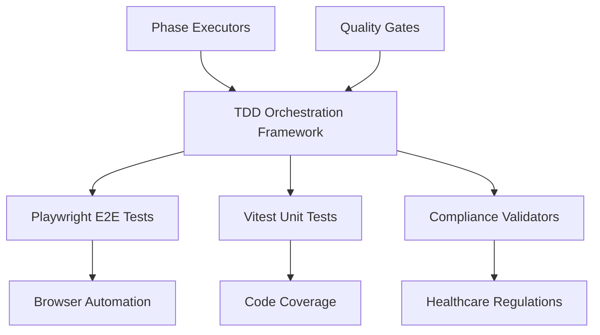
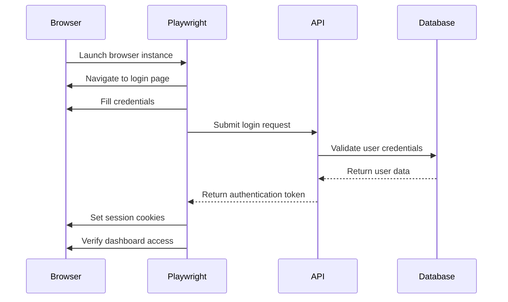
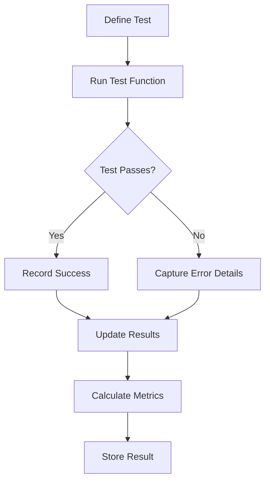
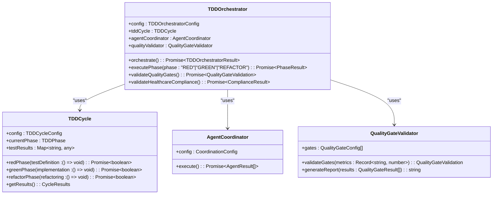
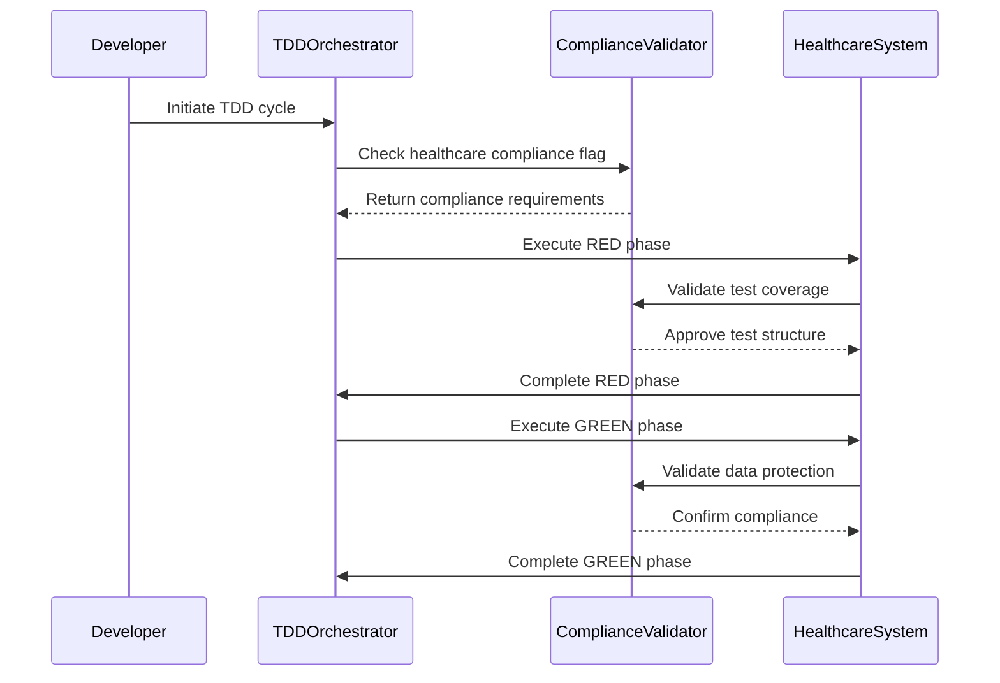
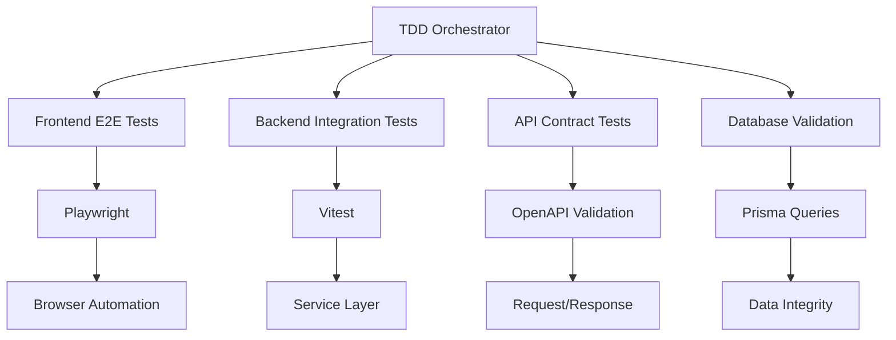
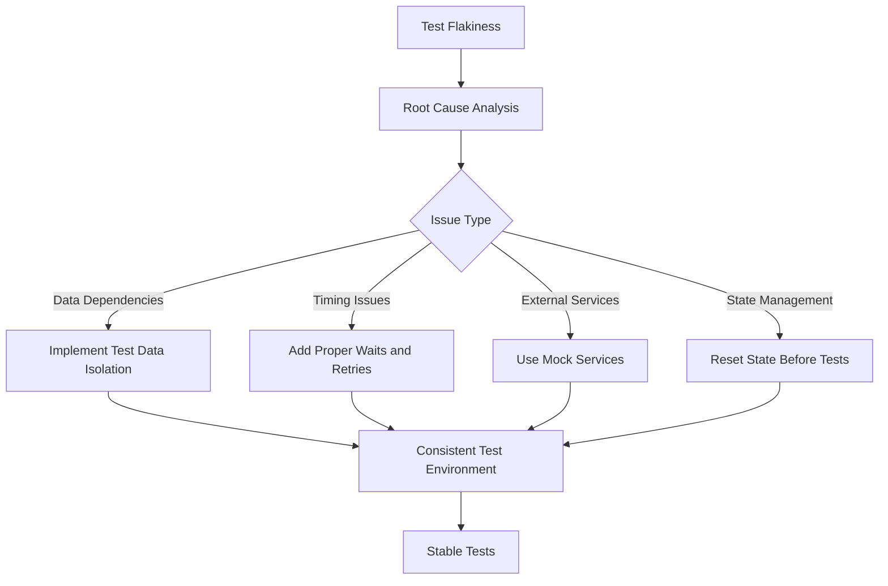
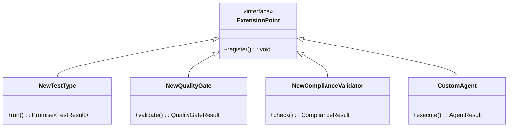

# Testing Tools

<cite>
**Referenced Files in This Document**   
- [red-phase.sh](file://tools/testing/phase-executors/red-phase.sh)
- [green-phase.sh](file://tools/testing/phase-executors/green-phase.sh)
- [refactor-phase.sh](file://tools/testing/phase-executors/refactor-phase.sh)
- [tdd-orchestrator.ts](file://tools/orchestration/src/tdd-orchestrator.ts)
- [tdd-orchestrator.ts](file://tools/testing-toolkit/src/core/tdd-orchestrator.ts)
- [tdd-cycle.ts](file://tools/testing-toolkit/src/core/tdd-cycle.ts)
- [test-runner.ts](file://tools/testing-toolkit/src/core/test-runner.ts)
- [types.ts](file://tools/testing-toolkit/src/core/types.ts)
- [quality-gates.ts](file://tools/testing-toolkit/src/core/quality-gates.ts)
- [clinic-authentication.spec.ts](file://apps/tools/e2e/clinic-authentication.spec.ts)
- [lgpd-sensitive-health-data-protection.test.ts](file://apps/api/src/__tests__/compliance/lgpd-sensitive-health-data-protection.test.ts)
</cite>

## Table of Contents
1. [Introduction](#introduction)
2. [Testing Framework Overview](#testing-framework-overview)
3. [End-to-End Testing with Playwright](#end-to-end-testing-with-playwright)
4. [Unit Testing with Vitest](#unit-testing-with-vitest)
5. [TDD Orchestration Framework](#tdd-orchestration-framework)
6. [Phase-Based Testing Workflow](#phase-based-testing-workflow)
7. [Healthcare Compliance Testing Examples](#healthcare-compliance-testing-examples)
8. [Integration Between Test Layers](#integration-between-test-layers)
9. [Common Issues and Solutions](#common-issues-and-solutions)
10. [Extending the Testing Framework](#extending-the-testing-framework)

## Introduction
This document provides comprehensive documentation for the testing tools sub-component, focusing on end-to-end testing with Playwright, unit testing with Vitest, and the TDD orchestration framework. The system implements a phase-based testing workflow that ensures robust validation of healthcare compliance scenarios while maintaining high code quality standards.

**Section sources**
- [red-phase.sh](file://tools/testing/phase-executors/red-phase.sh)
- [green-phase.sh](file://tools/testing/phase-executors/green-phase.sh)
- [refactor-phase.sh](file://tools/testing/phase-executors/refactor-phase.sh)

## Testing Framework Overview
The testing ecosystem combines multiple frameworks to ensure comprehensive coverage across different testing levels. Playwright handles end-to-end browser testing, Vitest manages unit and integration tests, and a custom TDD orchestration framework coordinates the complete test lifecycle. The architecture is designed specifically for healthcare applications, with built-in compliance checks for LGPD, ANVISA, and CFM regulations.

**Diagram sources**
- [tdd-orchestrator.ts](file://tools/orchestration/src/tdd-orchestrator.ts)
- [tdd-cycle.ts](file://tools/testing-toolkit/src/core/tdd-cycle.ts)

**Section sources**
- [tdd-orchestrator.ts](file://tools/orchestration/src/tdd-orchestrator.ts)
- [tdd-cycle.ts](file://tools/testing-toolkit/src/core/tdd-cycle.ts)

## End-to-End Testing with Playwright
The Playwright implementation provides comprehensive browser automation for validating user workflows in healthcare applications. The framework supports multiple browsers (Chromium, Firefox, WebKit) and device types, ensuring consistent behavior across different environments. E2E tests are organized around clinical workflows such as patient registration, appointment scheduling, and treatment planning.

The `clinic-authentication.spec.ts` file demonstrates how authentication flows are tested, covering both successful login scenarios and error conditions. Each test includes accessibility validation to ensure WCAG 2.1 AA+ compliance, which is critical for healthcare applications serving diverse patient populations.

**Diagram sources**
- [clinic-authentication.spec.ts](file://apps/tools/e2e/clinic-authentication.spec.ts)
- [green-phase.sh](file://tools/testing/phase-executors/green-phase.sh)

**Section sources**
- [clinic-authentication.spec.ts](file://apps/tools/e2e/clinic-authentication.spec.ts)
- [green-phase.sh](file://tools/testing/phase-executors/green-phase.sh)

## Unit Testing with Vitest
Vitest serves as the primary unit testing framework, providing fast execution and excellent TypeScript support. The framework is configured to run in both node and jsdom environments, allowing for testing of backend services and frontend components. Unit tests focus on isolated functionality, such as data validation, business logic, and utility functions.

The test runner collects detailed metrics including execution time, pass/fail status, and coverage information. These results are used by the quality gate system to determine whether code meets the required standards before proceeding to the next development phase.

**Diagram sources**
- [test-runner.ts](file://tools/testing-toolkit/src/core/test-runner.ts)
- [types.ts](file://tools/testing-toolkit/src/core/types.ts)

**Section sources**
- [test-runner.ts](file://tools/testing-toolkit/src/core/test-runner.ts)
- [types.ts](file://tools/testing-toolkit/src/core/types.ts)

## TDD Orchestration Framework
The TDD orchestration framework coordinates the complete test-driven development cycle, ensuring that all phases are executed in the correct order with proper validation. The system uses a pluggable agent architecture where different specialists (architect-review, code-reviewer, security-auditor) contribute to each phase of the development process.

The orchestrator manages dependencies between phases and enforces quality gates that must be satisfied before progressing. For healthcare applications, additional compliance checks are automatically enabled when the feature context indicates healthcare relevance.

**Diagram sources**
- [tdd-orchestrator.ts](file://tools/testing-toolkit/src/core/tdd-orchestrator.ts)
- [tdd-cycle.ts](file://tools/testing-toolkit/src/core/tdd-cycle.ts)
- [quality-gates.ts](file://tools/testing-toolkit/src/core/quality-gates.ts)

**Section sources**
- [tdd-orchestrator.ts](file://tools/testing-toolkit/src/core/tdd-orchestrator.ts)
- [tdd-cycle.ts](file://tools/testing-toolkit/src/core/tdd-cycle.ts)
- [quality-gates.ts](file://tools/testing-toolkit/src/core/quality-gates.ts)

## Phase-Based Testing Workflow
The phase-based testing workflow follows the traditional red-green-refactor pattern but extends it with automated quality gates and compliance checks. Each phase is implemented as a separate script in the phase-executors directory, allowing for independent execution and monitoring.

The RED phase focuses on test definition and structure analysis, ensuring that appropriate tests are in place before implementation begins. The GREEN phase executes comprehensive testing across all levels (unit, integration, E2E) to verify functionality. The REFACTOR phase analyzes results and generates optimization recommendations.

```mermaid
flowchart LR
A[RED Phase] --> B[Test Definition]
B --> C[Structure Analysis]
C --> D[Architecture Validation]
D --> E[GREEN Phase]
E --> F[Test Execution]
F --> G[Performance Testing]
G --> H[Accessibility Checks]
H --> I[REFACTOR Phase]
I --> J[Optimization Recommendations]
J --> K[Code Improvements]
K --> L[Final Validation]
```

**Diagram sources**
- [red-phase.sh](file://tools/testing/phase-executors/red-phase.sh)
- [green-phase.sh](file://tools/testing/phase-executors/green-phase.sh)
- [refactor-phase.sh](file://tools/testing/phase-executors/refactor-phase.sh)

**Section sources**
- [red-phase.sh](file://tools/testing/phase-executors/red-phase.sh)
- [green-phase.sh](file://tools/testing/phase-executors/green-phase.sh)
- [refactor-phase.sh](file://tools/testing/phase-executors/refactor-phase.sh)

## Healthcare Compliance Testing Examples
Healthcare compliance testing is integrated throughout the testing workflow, with specific validators for LGPD, ANVISA, and CFM regulations. The `lgpd-sensitive-health-data-protection.test.ts` file demonstrates how sensitive patient data is protected through encryption, access controls, and audit logging.

Tests validate that personal health information is properly anonymized or pseudonymized when required, and that data retention policies are enforced. The framework also verifies that appropriate consent mechanisms are in place and that patients can exercise their data subject rights.

**Diagram sources**
- [lgpd-sensitive-health-data-protection.test.ts](file://apps/api/src/__tests__/compliance/lgpd-sensitive-health-data-protection.test.ts)
- [tdd-orchestrator.ts](file://tools/orchestration/src/tdd-orchestrator.ts)

**Section sources**
- [lgpd-sensitive-health-data-protection.test.ts](file://apps/api/src/__tests__/compliance/lgpd-sensitive-health-data-protection.test.ts)
- [tdd-orchestrator.ts](file://tools/orchestration/src/tdd-orchestrator.ts)

## Integration Between Test Layers
The testing framework ensures tight integration between frontend E2E tests, backend integration tests, and the orchestration system. The TDD orchestrator coordinates the execution of tests across all layers, collecting results and enforcing quality gates that span multiple test types.

When a new feature is developed, the orchestrator first validates the test structure (RED phase), then executes all tests (GREEN phase), and finally analyzes the results to identify optimization opportunities (REFACTOR phase). This integrated approach ensures that issues are caught early and that the entire system works together as expected.

**Diagram sources**
- [tdd-orchestrator.ts](file://tools/orchestration/src/tdd-orchestrator.ts)
- [clinic-authentication.spec.ts](file://apps/tools/e2e/clinic-authentication.spec.ts)
- [lgpd-sensitive-health-data-protection.test.ts](file://apps/api/src/__tests__/compliance/lgpd-sensitive-health-data-protection.test.ts)

**Section sources**
- [tdd-orchestrator.ts](file://tools/orchestration/src/tdd-orchestrator.ts)
- [clinic-authentication.spec.ts](file://apps/tools/e2e/clinic-authentication.spec.ts)
- [lgpd-sensitive-health-data-protection.test.ts](file://apps/api/src/__tests__/compliance/lgpd-sensitive-health-data-protection.test.ts)

## Common Issues and Solutions
Test flakiness in healthcare data scenarios is addressed through proper test data isolation and mocking strategies. The framework uses dedicated test databases and mock services to ensure consistent test conditions. For sensitive healthcare data, the system employs data anonymization techniques that preserve data structure while removing personally identifiable information.

The quality gate system helps prevent common issues by enforcing minimum standards for test coverage, performance, and security. When tests fail, the framework provides detailed error reports and recommendations for resolution, helping developers quickly identify and fix problems.

**Diagram sources**
- [test-runner.ts](file://tools/testing-toolkit/src/core/test-runner.ts)
- [fixtures](file://tools/testing-toolkit/src/fixtures)
- [mock-services.ts](file://tools/testing-toolkit/src/fixtures/mock-services.ts)

**Section sources**
- [test-runner.ts](file://tools/testing-toolkit/src/core/test-runner.ts)
- [mock-services.ts](file://tools/testing-toolkit/src/fixtures/mock-services.ts)

## Extending the Testing Framework
The testing framework is designed to be extensible, allowing developers to add new test types, quality gates, and compliance validators. Custom agents can be registered with the orchestrator to participate in the TDD cycle, and new phase executors can be created for specialized workflows.

To extend the framework, developers should implement the appropriate interfaces and register their components with the orchestrator. The system supports both sequential and parallel execution patterns, allowing for efficient processing of large test suites.

**Diagram sources**
- [tdd-orchestrator.ts](file://tools/orchestration/src/tdd-orchestrator.ts)
- [types.ts](file://tools/testing-toolkit/src/core/types.ts)
- [agents](file://tools/testing-toolkit/src/agents)

**Section sources**
- [tdd-orchestrator.ts](file://tools/orchestration/src/tdd-orchestrator.ts)
- [types.ts](file://tools/testing-toolkit/src/core/types.ts)
- [agents](file://tools/testing-toolkit/src/agents)