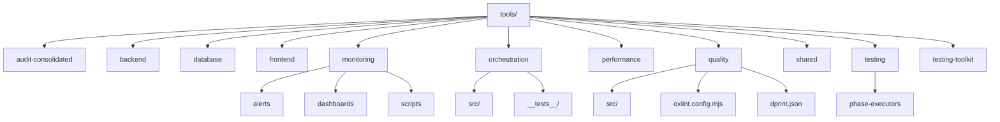
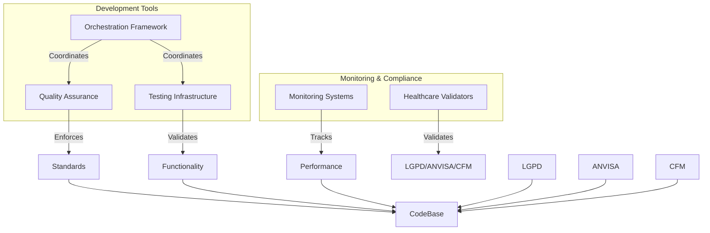
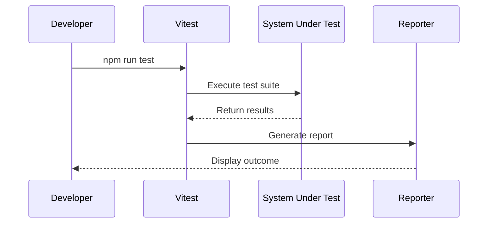
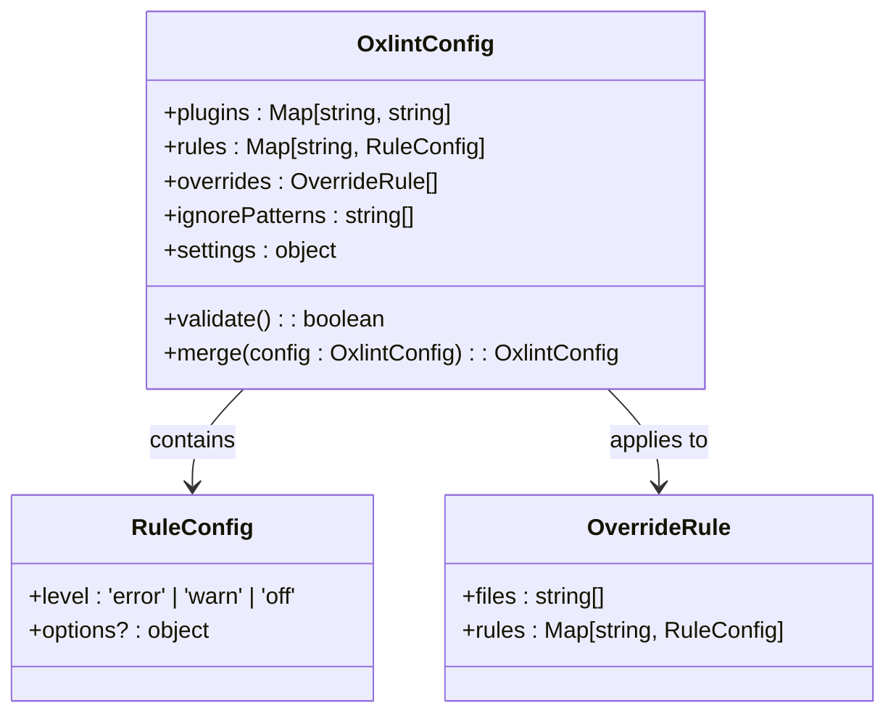
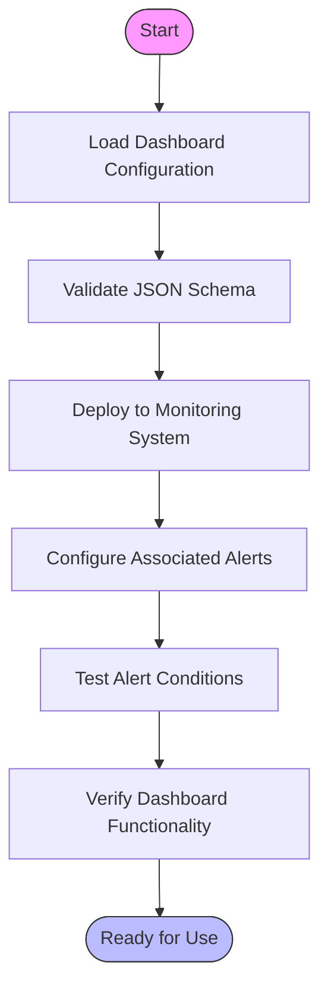
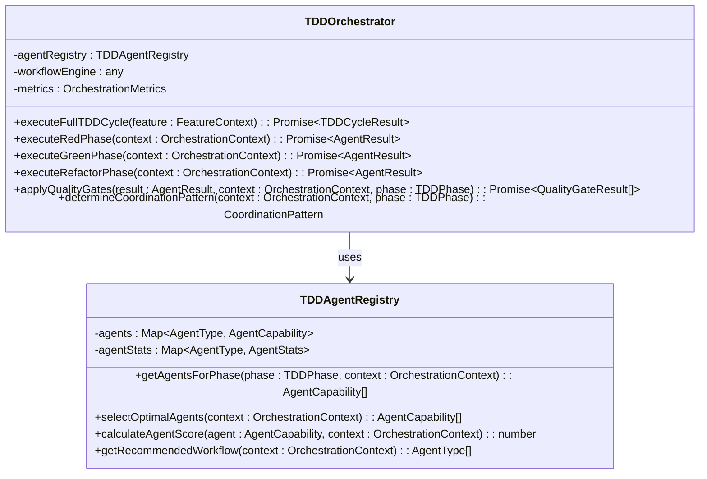
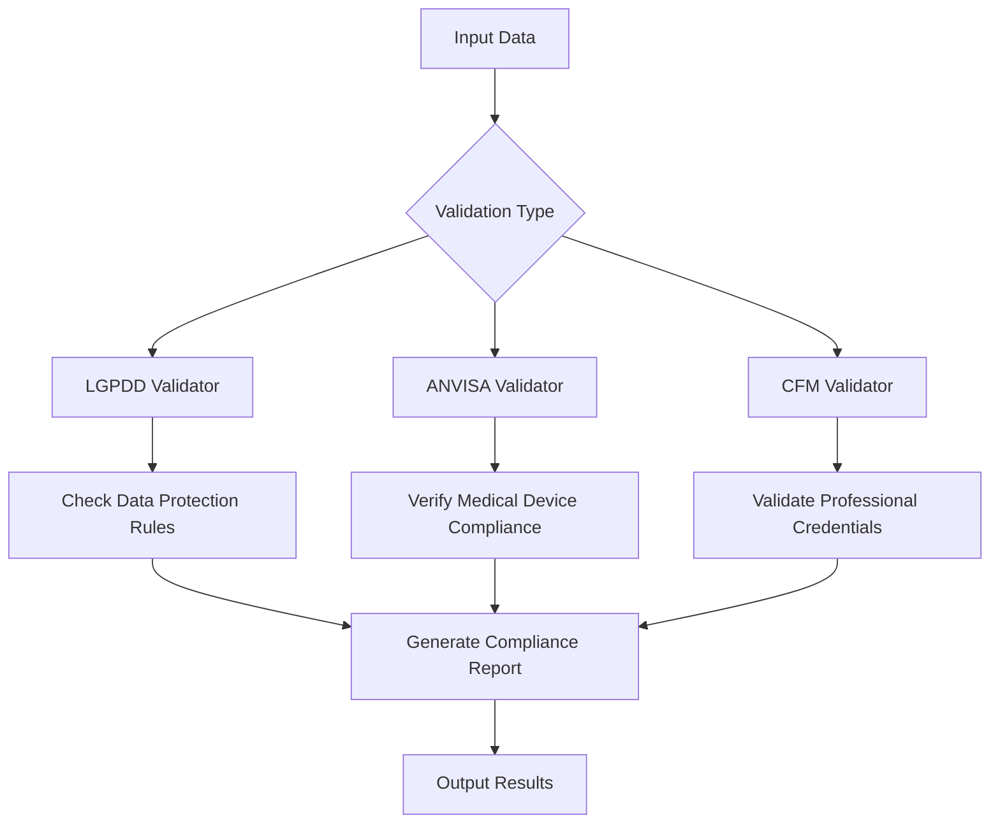
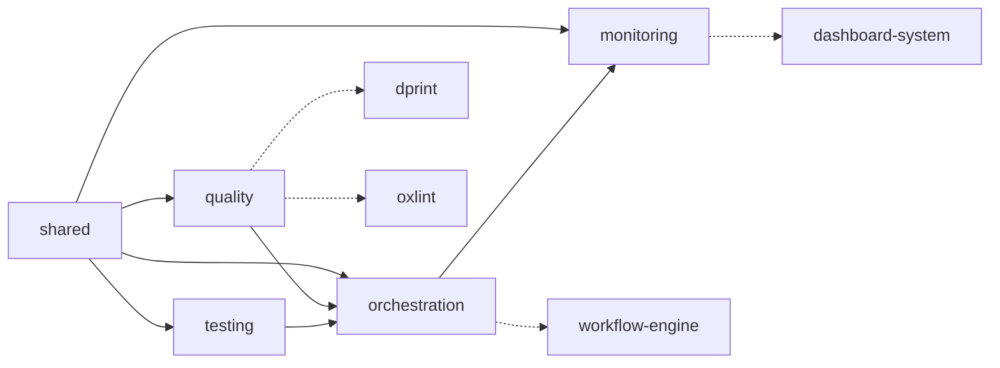

# Tools Directory

<cite>
**Referenced Files in This Document**
- [oxlint.config.mjs](file://tools/quality/oxlint.config.mjs)
- [dprint.json](file://tools/quality/dprint.json)
- [tdd-orchestrator.ts](file://tools/orchestration/src/tdd-orchestrator.ts)
- [agent-registry.ts](file://tools/orchestration/src/agent-registry.ts)
- [compliance-monitoring.json](file://tools/monitoring/dashboards/compliance-monitoring.json)
- [healthcare-overview.json](file://tools/monitoring/dashboards/healthcare-overview.json)
- [performance-monitoring.json](file://tools/monitoring/dashboards/performance-monitoring.json)
- [healthcare-alerts.json](file://tools/monitoring/alerts/healthcare-alerts.json)
</cite>

## Table of Contents

1. [Introduction](#introduction)
2. [Project Structure](#project-structure)
3. [Core Components](#core-components)
4. [Architecture Overview](#architecture-overview)
5. [Detailed Component Analysis](#detailed-component-analysis)
6. [Dependency Analysis](#dependency-analysis)
7. [Performance Considerations](#performance-considerations)
8. [Troubleshooting Guide](#troubleshooting-guide)
9. [Conclusion](#conclusion)

## Introduction

The tools directory in the neonpro repository serves as the central hub for development, testing, monitoring, and quality assurance infrastructure. It houses a comprehensive ecosystem of tooling that supports the entire codebase across multiple dimensions: automated testing, code quality enforcement, system monitoring, workflow orchestration, and healthcare compliance validation. This document provides both conceptual overviews for new developers and technical deep dives for experienced engineers, covering configuration patterns, integration mechanisms, execution workflows, and extension points.

## Project Structure

The tools directory is organized into specialized subdirectories based on functional domains:

**Diagram sources**

- [tools](file://tools)

**Section sources**

- [tools](file://tools)

## Core Components

The tools directory contains several key component categories that work together to ensure code quality, system reliability, and regulatory compliance. These include testing infrastructure (Playwright E2E tests, Vitest unit tests), quality assurance tools (linting, formatting), monitoring systems (dashboards, alerts), orchestration frameworks (TDD orchestrator, workflow engine), and specialized healthcare compliance validators.

**Section sources**

- [tools](file://tools)

## Architecture Overview

The architecture of the tools ecosystem follows a modular, layered approach where each tool category operates independently but can be orchestrated through centralized coordination mechanisms. The system enables both standalone execution and integrated workflows, with clear separation between concerns while maintaining interoperability through shared configurations and data formats.

**Diagram sources**

- [oxlint.config.mjs](file://tools/quality/oxlint.config.mjs)
- [tdd-orchestrator.ts](file://tools/orchestration/src/tdd-orchestrator.ts)
- [compliance-monitoring.json](file://tools/monitoring/dashboards/compliance-monitoring.json)

## Detailed Component Analysis

### Testing Infrastructure

The testing infrastructure supports both unit and end-to-end testing through Vitest and Playwright respectively. Unit tests are configured via vitest.config.ts files across various tool packages, enabling isolated component verification. End-to-end testing is implemented using Playwright with scenario-specific specifications in the apps/tools/e2e directory.

#### For API/Service Components:

**Diagram sources**

- [vitest.config.ts](file://tools/backend/vitest.config.ts)
- [vitest.config.ts](file://tools/database/vitest.config.ts)

**Section sources**

- [vitest.config.ts](file://tools/backend/vitest.config.ts)

### Quality Assurance Tools

The quality assurance subsystem enforces coding standards through oxlint and dprint configurations. Oxlint provides ultra-fast TypeScript linting with healthcare-specific rules, while dprint ensures consistent code formatting across the codebase.

#### For Object-Oriented Components:

**Diagram sources**

- [oxlint.config.mjs](file://tools/quality/oxlint.config.mjs)

**Section sources**

- [oxlint.config.mjs](file://tools/quality/oxlint.config.mjs)

### Monitoring Systems

The monitoring subsystem includes pre-configured dashboards and alert definitions for tracking system health, performance metrics, and compliance status. Dashboards are defined as JSON configurations that can be imported into visualization tools.

#### For Complex Logic Components:

**Diagram sources**

- [compliance-monitoring.json](file://tools/monitoring/dashboards/compliance-monitoring.json)
- [healthcare-alerts.json](file://tools/monitoring/alerts/healthcare-alerts.json)

**Section sources**

- [compliance-monitoring.json](file://tools/monitoring/dashboards/compliance-monitoring.json)
- [healthcare-alerts.json](file://tools/monitoring/alerts/healthcare-alerts.json)

### Orchestration Framework

The orchestration framework coordinates multi-phase development workflows, particularly TDD cycles, by managing agent execution and phase transitions. It uses a registry pattern to manage available agents and select appropriate ones based on context.

#### For Object-Oriented Components:

**Diagram sources**

- [tdd-orchestrator.ts](file://tools/orchestration/src/tdd-orchestrator.ts)
- [agent-registry.ts](file://tools/orchestration/src/agent-registry.ts)

**Section sources**

- [tdd-orchestrator.ts](file://tools/orchestration/src/tdd-orchestrator.ts)
- [agent-registry.ts](file://tools/orchestration/src/agent-registry.ts)

### Healthcare Compliance Validators

Specialized validation tools ensure adherence to Brazilian healthcare regulations including LGPD, ANVISA, and CFM requirements. These validators are integrated into the testing toolkit and can be executed as part of quality gates.

**Diagram sources**

- [lgpd.ts](file://tools/testing-toolkit/src/compliance/lgpd.ts)
- [anvisa.ts](file://tools/testing-toolkit/src/compliance/anvisa.ts)
- [cfm.ts](file://tools/testing-toolkit/src/compliance/cfm.ts)

**Section sources**

- [lgpd.ts](file://tools/testing-toolkit/src/compliance/lgpd.ts)

## Dependency Analysis

The tools ecosystem demonstrates a well-defined dependency structure with minimal circular dependencies. The shared utilities provide common functionality across tool categories, while domain-specific tools maintain independence.

**Diagram sources**

- [package.json](file://tools/shared/package.json)
- [package.json](file://tools/quality/package.json)
- [package.json](file://tools/orchestration/package.json)

**Section sources**

- [package.json](file://tools/shared/package.json)

## Performance Considerations

The tools directory prioritizes performance through several optimization strategies:

- Oxlint configuration enables ultra-fast linting (50x faster than ESLint)
- Parallel execution patterns in orchestration framework
- Incremental processing in dprint formatter
- Pre-compiled configurations for monitoring dashboards
- Efficient agent selection algorithms based on scoring mechanisms

These optimizations ensure rapid feedback loops during development while maintaining comprehensive validation coverage.

## Troubleshooting Guide

Common issues in the tools ecosystem include configuration conflicts, performance bottlenecks, and integration failures. Key solutions include:

- Using ignore patterns in oxlint.config.mjs for generated files
- Adjusting coordination patterns based on feature complexity
- Validating dashboard JSON schemas before deployment
- Monitoring agent statistics for performance degradation
- Ensuring proper healthcare compliance flag propagation through contexts

Configuration validation should be performed using the built-in schema checking capabilities, and all changes should be tested in isolation before integration into main workflows.

## Conclusion

The tools directory in the neonpro repository represents a sophisticated, multi-layered ecosystem designed to support high-quality software development in a regulated healthcare environment. By integrating testing, quality assurance, monitoring, orchestration, and compliance validation into a cohesive system, it enables development teams to maintain rigorous standards while accelerating delivery. The modular architecture allows for incremental adoption and customization, making it adaptable to evolving project requirements and regulatory landscapes.
