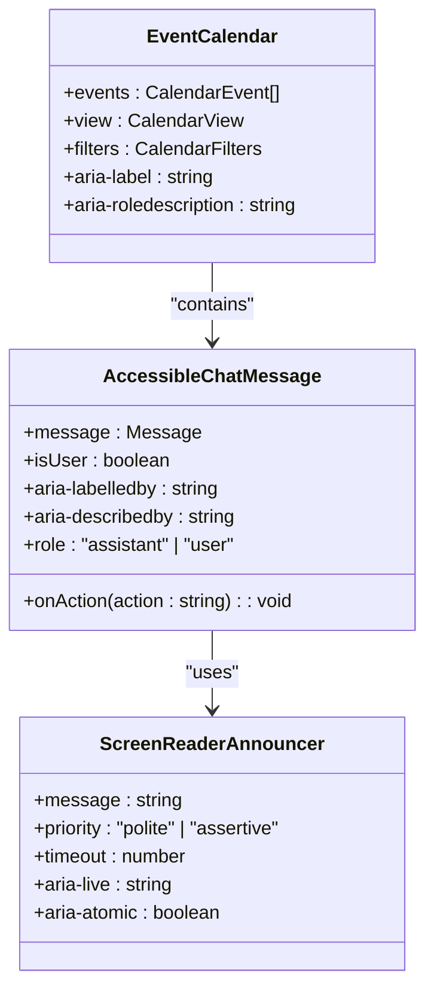
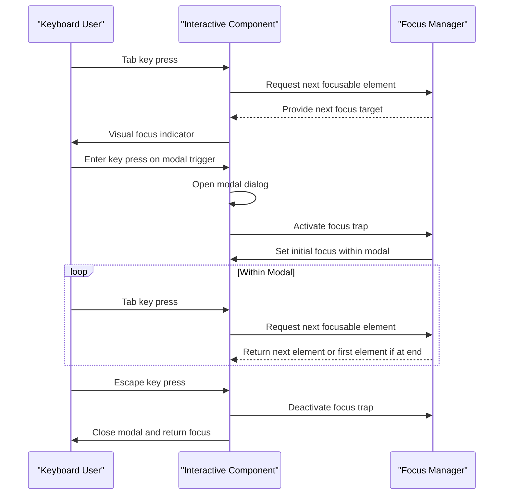
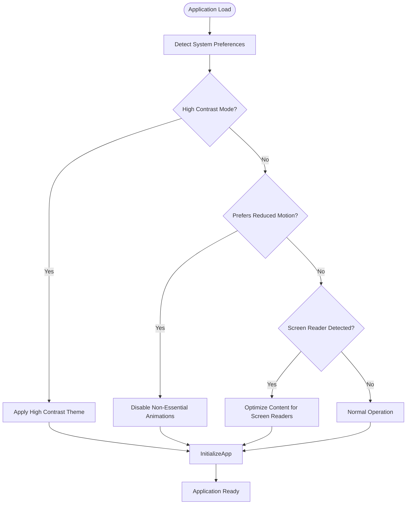
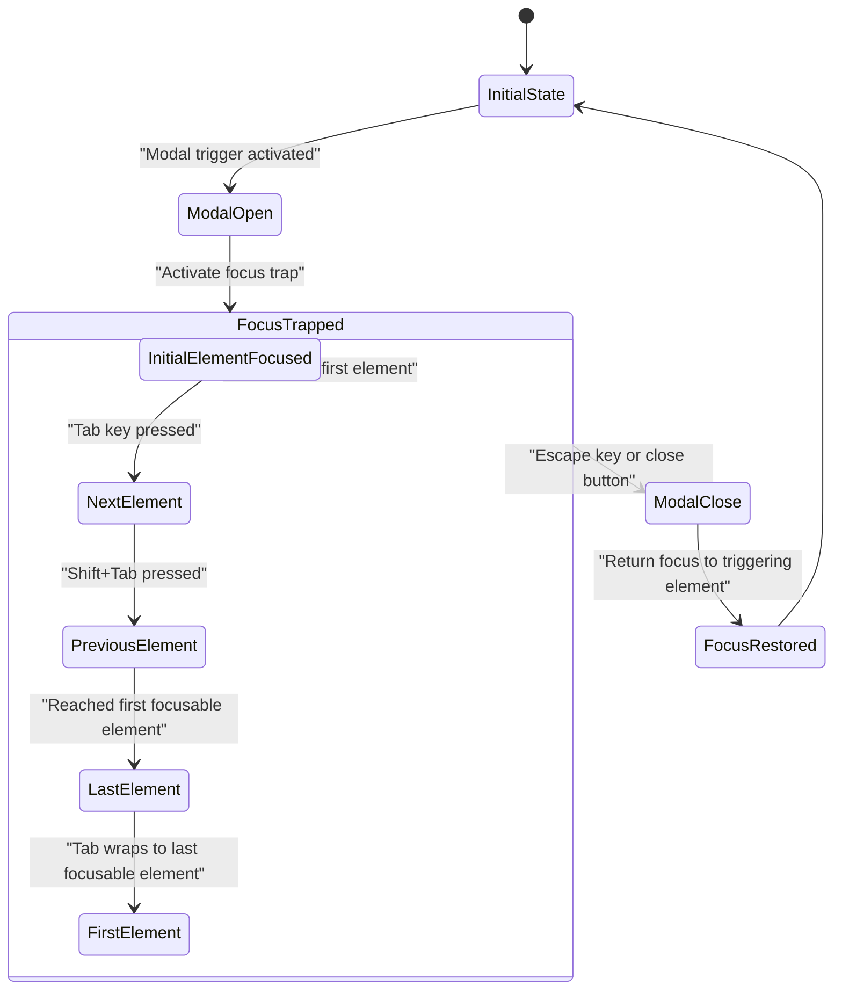
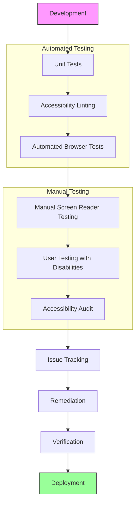
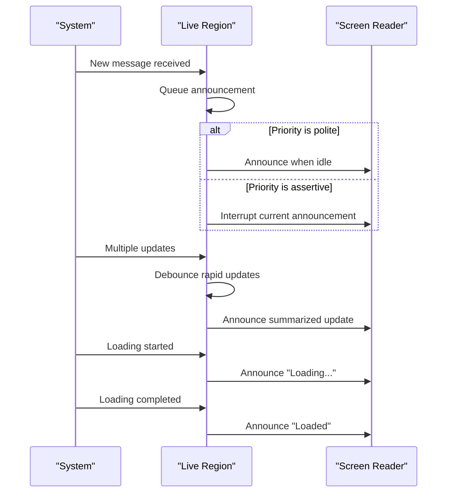
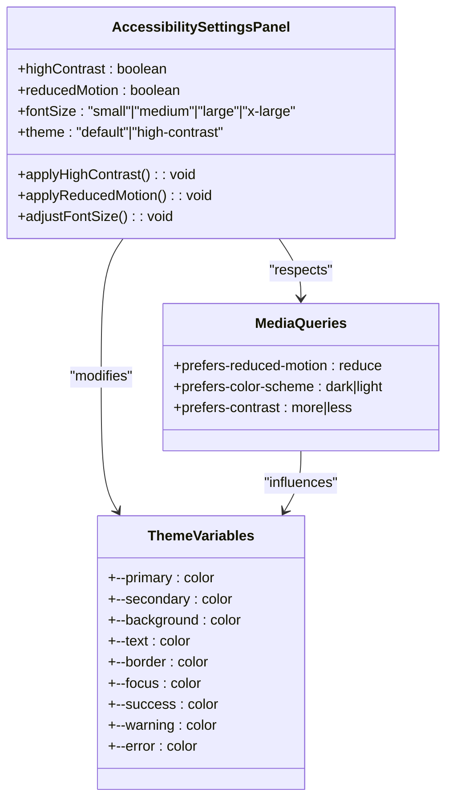
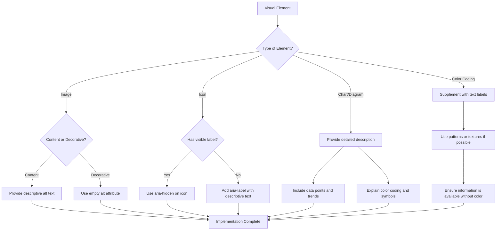
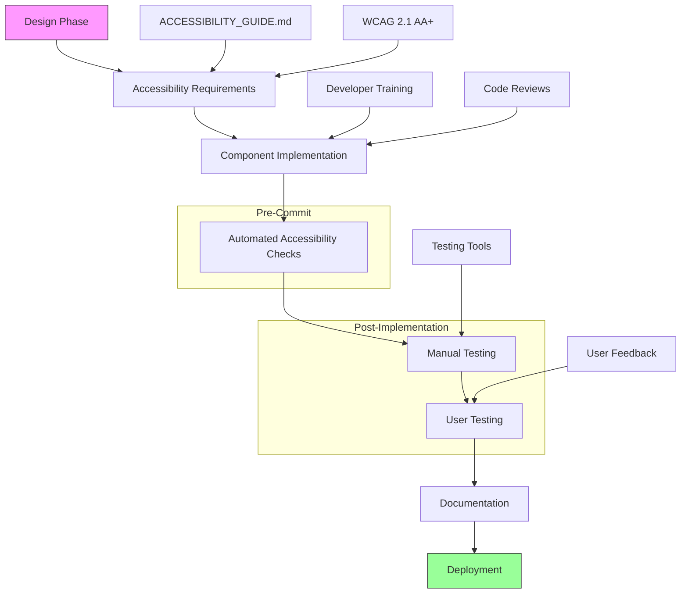
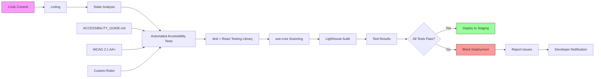

# Accessibility Features

<cite>
**Referenced Files in This Document**
- [ACCESSIBILITY_GUIDE.md](file://apps/web/src/components/chat/ACCESSIBILITY_GUIDE.md)
- [accessibility.test.tsx](file://apps/web/src/components/chat/__tests__/accessibility.test.tsx)
- [EventCalendar.tsx](file://apps/web/src/components/event-calendar/EventCalendar.tsx)
- [MonthView.tsx](file://apps/web/src/components/event-calendar/MonthView.tsx)
- [WeekView.tsx](file://apps/web/src/components/event-calendar/WeekView.tsx)
- [DayView.tsx](file://apps/web/src/components/event-calendar/DayView.tsx)
- [CalendarHeader.tsx](file://apps/web/src/components/event-calendar/CalendarHeader.tsx)
- [EventModal.tsx](file://apps/web/src/components/event-calendar/EventModal.tsx)
- [event-calendar.ts](file://apps/web/types/event-calendar.ts)
</cite>

## Table of Contents

1. [Introduction](#introduction)
2. [ARIA Attributes Implementation](#aria-attributes-implementation)
3. [Keyboard Navigation Support](#keyboard-navigation-support)
4. [Screen Reader Compatibility](#screen-reader-compatibility)
5. [Focus Management](#focus-management)
6. [Semantic HTML Structure](#semantic-html-structure)
7. [Accessibility Testing Procedures](#accessibility-testing-procedures)
8. [Dynamic Content Updates](#dynamic-content-updates)
9. [Color Contrast and Visual Design](#color-contrast-and-visual-design)
10. [Alternative Text for Visual Information](#alternative-text-for-visual-information)
11. [Component Development Workflow Integration](#component-development-workflow-integration)
12. [Automated Accessibility Checks](#automated-accessibility-checks)

## Introduction

The NeonPro frontend implements comprehensive accessibility features to ensure usability for all users, including those with disabilities. The accessibility strategy follows WCAG 2.1 AA+ guidelines and is documented in the ACCESSIBILITY_GUIDE.md file. Key focus areas include ARIA attributes, keyboard navigation, screen reader compatibility, focus management, and semantic HTML structure. The implementation covers interactive components such as chat interfaces, form elements, modal dialogs, and complex UIs like the event calendar. Accessibility requirements are integrated into the component development workflow, with automated testing procedures ensuring compliance throughout the quality assurance process.

**Section sources**

- [ACCESSIBILITY_GUIDE.md](file://apps/web/src/components/chat/ACCESSIBILITY_GUIDE.md#L0-L38)

## ARIA Attributes Implementation

The NeonPro frontend utilizes ARIA (Accessible Rich Internet Applications) attributes extensively to enhance accessibility for assistive technologies. Components implement proper ARIA labels, descriptions, and roles to provide meaningful context. For example, the AccessibleChatMessage component uses appropriate ARIA attributes to identify its role as an assistant and provides labeled-by and described-by references for screen readers. Live regions are implemented to announce dynamic content changes, such as new messages in the chat interface. The EventCalendar component uses ARIA attributes to convey calendar structure, event information, and navigation controls. These attributes ensure that users relying on assistive technologies can understand and interact with the application effectively.



**Diagram sources**

- [ACCESSIBILITY_GUIDE.md](file://apps/web/src/components/chat/ACCESSIBILITY_GUIDE.md#L40-L55)
- [accessibility.test.tsx](file://apps/web/src/components/chat/__tests__/accessibility.test.tsx#L290-L336)

**Section sources**

- [ACCESSIBILITY_GUIDE.md](file://apps/web/src/components/chat/ACCESSIBILITY_GUIDE.md#L11-L15)
- [accessibility.test.tsx](file://apps/web/src/components/chat/__tests__/accessibility.test.tsx#L290-L336)

## Keyboard Navigation Support

NeonPro implements comprehensive keyboard navigation support across all interactive components. The system ensures that all functionality is accessible via keyboard, following logical tab order and providing visible focus indicators. The AccessibilitySettingsPanel includes a keyboard mode that enhances keyboard navigation capabilities. Focus traps are implemented in modal dialogs like EventModal to prevent keyboard users from accidentally navigating outside the modal while it's open. Skip links are available to allow users to bypass repetitive navigation elements. Keyboard shortcuts are provided for common actions, such as pressing Enter to send a message in the chat interface. The event calendar supports keyboard navigation through dates and events using arrow keys, Enter to select, and Escape to close modals.



**Diagram sources**

- [ACCESSIBILITY_GUIDE.md](file://apps/web/src/components/chat/ACCESSIBILITY_GUIDE.md#L16-L19)
- [EventModal.tsx](file://apps/web/src/components/event-calendar/EventModal.tsx#L0-L161)

**Section sources**

- [ACCESSIBILITY_GUIDE.md](file://apps/web/src/components/chat/ACCESSIBILITY_GUIDE.md#L16-L19)
- [accessibility.test.tsx](file://apps/web/src/components/chat/__tests__/accessibility.test.tsx#L134-L168)

## Screen Reader Compatibility

The NeonPro frontend ensures compatibility with major screen readers including NVDA, JAWS, VoiceOver, and TalkBack. The implementation follows WAI-ARIA standards to provide proper semantics and relationships between elements. Screen reader only content is used where necessary to provide additional context that may not be visually apparent. The ScreenReaderAnnouncer component allows for configurable priority announcements (polite or assertive) with automatic timeout. Dynamic content updates, such as new chat messages or calendar events, are announced appropriately based on their importance. The application respects system preferences for reduced motion and high contrast modes, which can affect how content is presented to screen reader users.



**Diagram sources**

- [ACCESSIBILITY_GUIDE.md](file://apps/web/src/components/chat/ACCESSIBILITY_GUIDE.md#L12-L14)
- [accessibility.css](file://apps/web/src/components/chat/accessibility.css#L0-L20)

**Section sources**

- [ACCESSIBILITY_GUIDE.md](file://apps/web/src/components/chat/ACCESSIBILITY_GUIDE.md#L12-L14)
- [accessibility.test.tsx](file://apps/web/src/components/chat/__tests__/accessibility.test.tsx#L310-L336)

## Focus Management

NeonPro implements robust focus management to ensure a predictable and consistent user experience for keyboard and assistive technology users. When interactive elements receive focus, they display clear visual indicators. Focus traps are implemented in modal dialogs such as EventModal to contain keyboard navigation within the modal until it is dismissed. When a modal opens, focus is automatically set to the first interactive element within the modal. When the modal closes, focus returns to the element that triggered the modal. The focus order follows the logical structure of the content, making navigation intuitive. Special attention is given to dynamic content updates, ensuring that focus is managed appropriately when new elements are added or removed from the DOM.



**Diagram sources**

- [EventModal.tsx](file://apps/web/src/components/event-calendar/EventModal.tsx#L0-L161)
- [ACCESSIBILITY_GUIDE.md](file://apps/web/src/components/chat/ACCESSIBILITY_GUIDE.md#L17-L18)

**Section sources**

- [EventModal.tsx](file://apps/web/src/components/event-calendar/EventModal.tsx#L0-L161)
- [accessibility.test.tsx](file://apps/web/src/components/chat/__tests__/accessibility.test.tsx#L134-L168)

## Semantic HTML Structure

The NeonPro frontend employs semantic HTML elements to provide proper document structure and meaning. Interactive components use appropriate HTML5 elements such as buttons, forms, and semantic sectioning elements. The AccessibleChatMessage component uses the article element to represent a self-contained composition, while the EventCalendar uses proper table-like structures for date grids. Headings follow a logical hierarchy (h1-h6) to create an outline of the page content. Landmark roles such as main, navigation, and complementary are used to identify major page regions. Form elements have properly associated labels, and fieldsets with legends are used for grouped inputs. This semantic structure helps both assistive technologies and search engines understand the content and organization of the interface.

```mermaid
erDiagram
PAGE ||--o{ LANDMARK : contains
LANDMARK ||--o{ SECTION : contains
SECTION ||--o{ ARTICLE : contains
ARTICLE ||--o{ PARAGRAPH : contains
ARTICLE ||--o{ HEADING : contains
FORM ||--o{ INPUT : contains
LABEL ||--o{ INPUT : associates
FIELDSET ||--o{ LEGEND : contains
FIELDSET ||--o{ INPUT : contains
class PAGE {
+role: "document"
+lang: "pt-BR"
}
class LANDMARK {
+role: "main"|"navigation"|"complementary"
+aria-label: string
}
class SECTION {
+role: "region"
+aria-labelledby: string
}
class ARTICLE {
+role: "article"
+aria-roledescription: "chat message"
}
class FORM {
+role: "form"
+aria-label: "chat input form"
}
class INPUT {
+type: "text"|"button"|"checkbox"
+aria-label: string
+aria-describedby: string
}
class LABEL {
+for: string
}
```

**Diagram sources**

- [EventCalendar.tsx](file://apps/web/src/components/event-calendar/EventCalendar.tsx#L21-L239)
- [NeonProChatInterface.tsx](file://apps/web/src/components/chat/NeonProChatInterface.tsx#L0-L100)

**Section sources**

- [EventCalendar.tsx](file://apps/web/src/components/event-calendar/EventCalendar.tsx#L21-L239)
- [accessibility.test.tsx](file://apps/web/src/components/chat/__tests__/accessibility.test.tsx#L166-L206)

## Accessibility Testing Procedures

NeonPro implements a comprehensive accessibility testing strategy that combines automated and manual testing methods. Automated tests verify ARIA attributes, keyboard navigation, and semantic structure using Jest and React Testing Library. The test suite includes specific checks for proper ARIA labeling, focus management, and keyboard accessibility. Manual testing is conducted with various screen readers and assistive technologies to ensure real-world usability. The testing process is integrated into the quality assurance workflow, with accessibility checks performed at multiple stages of development. Test results are documented and tracked to ensure issues are addressed before deployment. The implementation summary indicates that while there are CLI issues with Vitest, the underlying test infrastructure is fully functional.



**Diagram sources**

- [accessibility.test.tsx](file://apps/web/src/components/chat/__tests__/accessibility.test.tsx#L0-L336)
- [IMPLEMENTATION-SUMMARY.md](file://apps/web/docs/testing/IMPLEMENTATION-SUMMARY.md#L39-L67)

**Section sources**

- [accessibility.test.tsx](file://apps/web/src/components/chat/__tests__/accessibility.test.tsx#L0-L336)
- [ACCESSIBILITY_GUIDE.md](file://apps/web/src/components/chat/ACCESSIBILITY_GUIDE.md#L112-L154)

## Dynamic Content Updates

The NeonPro frontend handles dynamic content updates in a way that maintains accessibility for users of assistive technologies. When new content is added to the DOM, such as incoming chat messages or updated calendar events, appropriate ARIA live regions are used to announce these changes. The ScreenReaderAnnouncer component manages these announcements with configurable priority levels (polite or assertive) and automatic timeouts. For the event calendar, when events are added, modified, or removed, the interface updates accordingly while maintaining focus and context for keyboard and screen reader users. Loading states are communicated clearly, and progress indicators are provided for longer operations. This ensures that users relying on assistive technologies are aware of changes in the interface without being overwhelmed by excessive announcements.



**Diagram sources**

- [ScreenReaderAnnouncer.tsx](file://apps/web/src/components/chat/ScreenReaderAnnouncer.tsx#L0-L20)
- [ACCESSIBILITY_GUIDE.md](file://apps/web/src/components/chat/ACCESSIBILITY_GUIDE.md#L70-L74)

**Section sources**

- [ACCESSIBILITY_GUIDE.md](file://apps/web/src/components/chat/ACCESSIBILITY_GUIDE.md#L70-L74)
- [accessibility.test.tsx](file://apps/web/src/components/chat/__tests__/accessibility.test.tsx#L290-L336)

## Color Contrast and Visual Design

NeonPro implements a comprehensive color contrast strategy to ensure readability for users with visual impairments. The application meets WCAG 2.1 AA+ requirements with a minimum contrast ratio of 4.5:1 for normal text and 3:1 for large text. A high contrast theme is available through the AccessibilitySettingsPanel, which inverts colors and increases contrast for better visibility. The design respects the user's system preference for reduced motion, disabling non-essential animations when requested. Color is never used as the sole means of conveying information; additional visual cues such as icons, patterns, or text labels are always provided. The CSS utility classes support easy customization of color variables, allowing users to adjust the interface to their specific needs.



**Diagram sources**

- [ACCESSIBILITY_GUIDE.md](file://apps/web/src/components/chat/ACCESSIBILITY_GUIDE.md#L20-L22)
- [accessibility.css](file://apps/web/src/components/chat/accessibility.css#L5-L20)

**Section sources**

- [ACCESSIBILITY_GUIDE.md](file://apps/web/src/components/chat/ACCESSIBILITY_GUIDE.md#L20-L22)
- [accessibility.css](file://apps/web/src/components/chat/accessibility.css#L5-L20)

## Alternative Text for Visual Information

The NeonPro frontend provides alternative text for all non-text content to ensure accessibility for users who cannot perceive visual information. Images, icons, and other visual elements include appropriate alt text that conveys their purpose and meaning. Decorative images are marked with empty alt attributes to be ignored by screen readers. Complex visual information, such as charts or diagrams, includes detailed descriptions that explain the content and any important trends or data points. In the event calendar, visual cues such as color-coded events are supplemented with text labels and status indicators that convey the same information. Icons used in the interface are accompanied by text labels or have appropriate aria-label attributes to ensure their function is clear to all users.



**Diagram sources**

- [ACCESSIBILITY_GUIDE.md](file://apps/web/src/components/chat/ACCESSIBILITY_GUIDE.md#L112-L115)
- [EventCalendar.tsx](file://apps/web/src/components/event-calendar/EventCalendar.tsx#L21-L239)

**Section sources**

- [ACCESSIBILITY_GUIDE.md](file://apps/web/src/components/chat/ACCESSIBILITY_GUIDE.md#L112-L115)
- [MonthView.tsx](file://apps/web/src/components/event-calendar/MonthView.tsx#L86-L114)

## Component Development Workflow Integration

Accessibility requirements are integrated into the NeonPro component development workflow from the initial design phase through implementation and testing. The ACCESSIBILITY_GUIDE.md serves as the primary reference for developers, outlining best practices and implementation patterns. Components are designed with accessibility in mind, using semantic HTML and appropriate ARIA attributes from the start. The development process includes regular accessibility reviews and testing at each stage. Automated accessibility checks are incorporated into the CI/CD pipeline to catch issues early. Developers are trained on accessibility principles and provided with resources to help them create accessible components. The workflow emphasizes proactive accessibility rather than retroactive fixes, ensuring that accessibility is a fundamental aspect of every component.



**Diagram sources**

- [ACCESSIBILITY_GUIDE.md](file://apps/web/src/components/chat/ACCESSIBILITY_GUIDE.md#L155-L188)
- [EventCalendar.tsx](file://apps/web/src/components/event-calendar/EventCalendar.tsx#L21-L239)

**Section sources**

- [ACCESSIBILITY_GUIDE.md](file://apps/web/src/components/chat/ACCESSIBILITY_GUIDE.md#L155-L188)
- [accessibility.test.tsx](file://apps/web/src/components/chat/__tests__/accessibility.test.tsx#L0-L336)

## Automated Accessibility Checks

NeonPro incorporates automated accessibility checks into its CI/CD pipeline to ensure ongoing compliance with accessibility standards. The testing framework includes unit tests that verify ARIA attributes, keyboard navigation, and semantic structure. Tools like axe DevTools, WAVE, and Lighthouse are integrated into the build process to scan for accessibility issues. The implementation uses Jest with React Testing Library to create targeted accessibility tests that check for proper labeling, focus management, and screen reader compatibility. Despite current CLI issues with Vitest, the test infrastructure remains functional through alternative execution methods. These automated checks run on every commit, preventing accessibility regressions and ensuring that new code meets the required standards before deployment.



**Diagram sources**

- [accessibility.test.tsx](file://apps/web/src/components/chat/__tests__/accessibility.test.tsx#L0-L336)
- [IMPLEMENTATION-SUMMARY.md](file://apps/web/docs/testing/IMPLEMENTATION-SUMMARY.md#L39-L67)

**Section sources**

- [accessibility.test.tsx](file://apps/web/src/components/chat/__tests__/accessibility.test.tsx#L0-L336)
- [IMPLEMENTATION-SUMMARY.md](file://apps/web/docs/testing/IMPLEMENTATION-SUMMARY.md#L39-L67)
