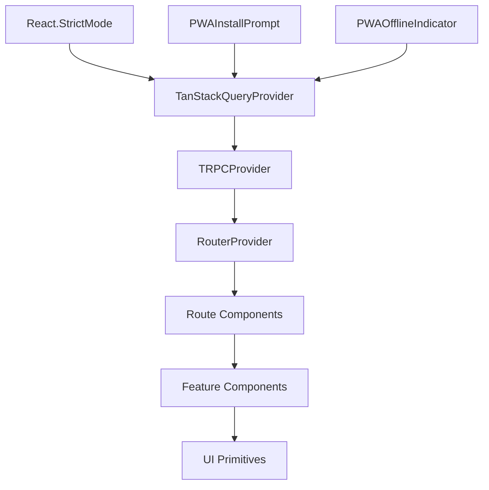
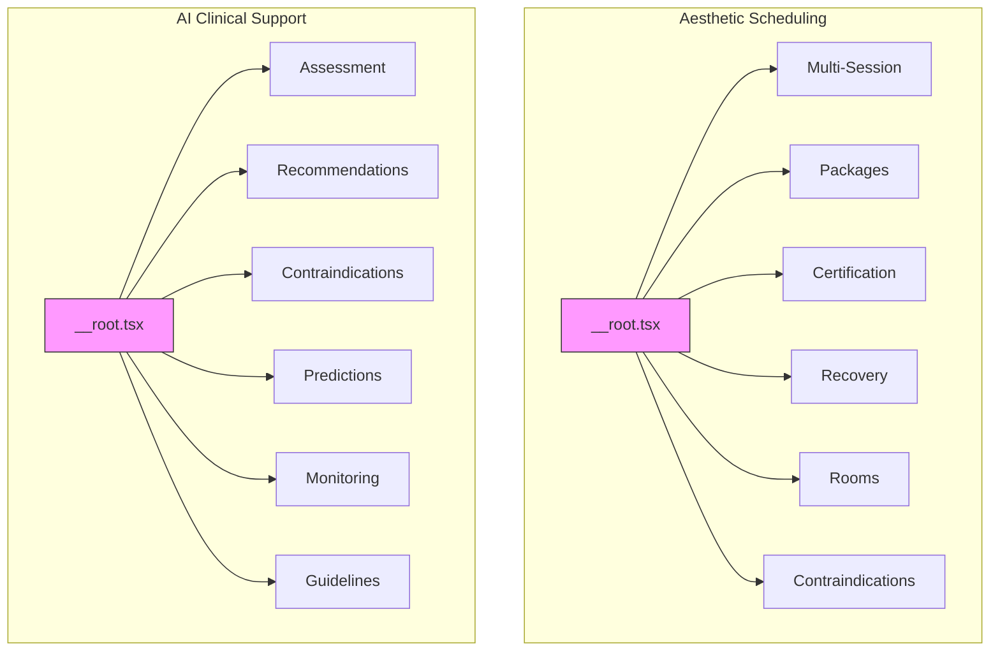
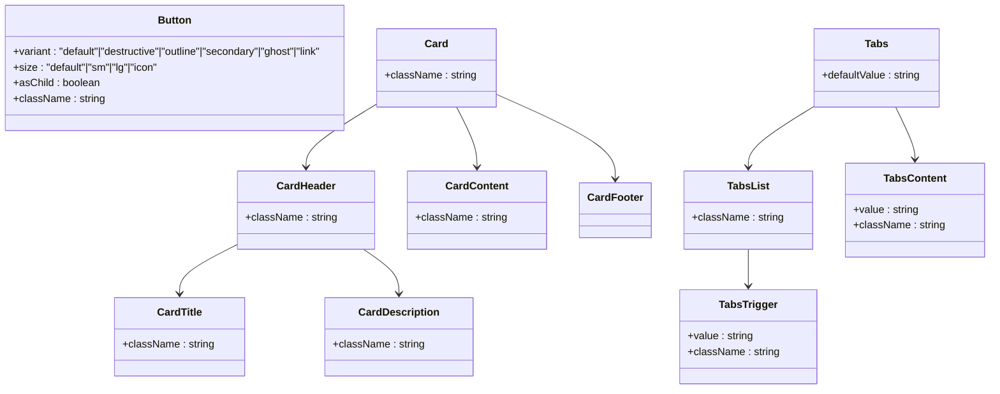
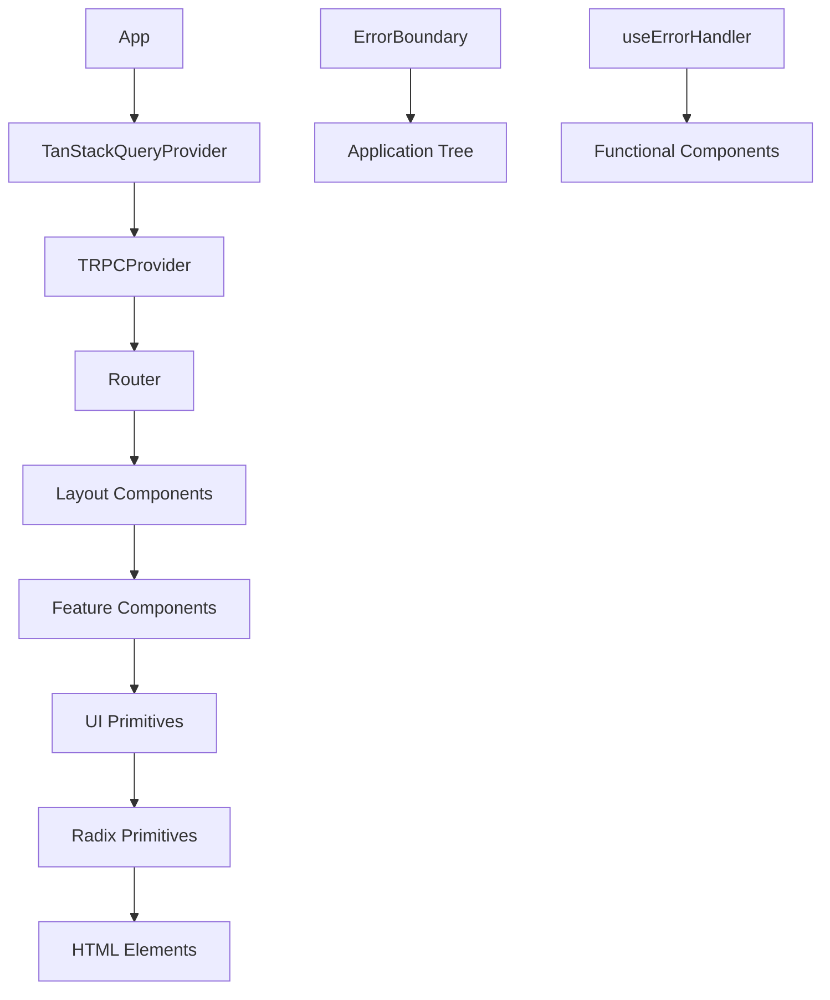
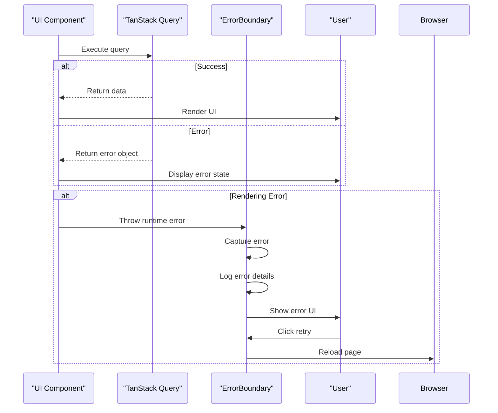

# Component Hierarchy

<cite>
**Referenced Files in This Document **
- [App.tsx](file://apps/web/src/App.tsx)
- [main.tsx](file://apps/web/src/main.tsx)
- [TRPCProvider.tsx](file://apps/web/src/components/providers/TRPCProvider.tsx)
- [TanStackQueryProvider.tsx](file://apps/web/src/components/providers/TanStackQueryProvider.tsx)
- [__root.tsx](file://apps/web/src/routes/aesthetic-scheduling/__root.tsx)
- [__root.tsx](file://apps/web/src/routes/ai-clinical-support/__root.tsx)
- [button.tsx](file://apps/web/src/components/ui/button.tsx)
- [card.tsx](file://apps/web/src/components/ui/card.tsx)
- [tabs.tsx](file://apps/web/src/components/ui/tabs.tsx)
- [alert.tsx](file://apps/web/src/components/ui/alert.tsx)
- [ErrorBoundary.tsx](file://apps/web/src/components/ErrorBoundary.tsx)
</cite>

## Table of Contents

1. [Introduction](#introduction)
2. [Root Application Structure](#root-application-structure)
3. [Provider Architecture](#provider-architecture)
4. [Route-Level Component Organization](#route-level-component-organization)
5. [Shared UI Components and Design System](#shared-ui-components-and-design-system)
6. [Component Composition Patterns](#component-composition-patterns)
7. [Error Handling Strategy](#error-handling-strategy)
8. [Performance Considerations](#performance-considerations)

## Introduction

This document provides a comprehensive analysis of the frontend component hierarchy in the neonpro application, focusing on the React component tree structure starting from App.tsx as the root container. The documentation details how higher-order components enable type-safe API communication and state management, describes composition patterns used throughout the application, and explains the organization of components by feature domains such as aesthetic-scheduling and ai-clinical-support. The content is designed to be accessible to developers of all experience levels while providing technical depth on best practices in component organization.

## Root Application Structure

The neonpro application follows a well-structured component hierarchy with App.tsx serving as the root container that orchestrates the entire application's rendering flow. The component tree begins with strict mode enabled for development safety, ensuring potential issues are caught early in the development cycle.

At the foundation of the component hierarchy, the application implements Progressive Web App (PWA) capabilities through service worker registration and install handlers. These PWA features are integrated at the root level to ensure they're available across all routes and components. The App component manages critical lifecycle events including online/offline status detection, dispatching custom events for network state changes that can be consumed by other components.

The root component wraps the entire application with QueryClientProvider from TanStack Query, establishing a global state management context for data fetching and caching. This provider pattern ensures consistent data handling across the application while allowing configuration of default behaviors such as stale time and refetch policies.



**Diagram sources **

- [App.tsx](file://apps/web/src/App.tsx#L41-L93)
- [main.tsx](file://apps/web/src/main.tsx#L70-L98)

**Section sources**

- [App.tsx](file://apps/web/src/App.tsx#L41-L93)
- [main.tsx](file://apps/web/src/main.tsx#L70-L98)

## Provider Architecture

The neonpro application employs a sophisticated provider architecture that wraps the application with essential services for type-safe API communication and state management. Two key providers—TRPCProvider and TanStackQueryProvider—form the backbone of this architecture, enabling seamless integration between frontend components and backend services.

The TanStackQueryProvider establishes a globally available QueryClient instance configured with optimized settings for healthcare applications. It implements intelligent caching strategies with a 5-minute stale time and 30-minute garbage collection period, balancing data freshness with performance. The provider also configures smart retry logic that distinguishes between client errors (4xx) and server errors (5xx), preventing unnecessary retries for validation failures while maintaining resilience against transient server issues.

```mermaid
classDiagram
class TanStackQueryProvider {
+queryClient : QueryClient
+children : ReactNode
+defaultOptions : {
queries : {
staleTime : 300000,
retry : function,
gcTime : 1800000,
refetchOnWindowFocus : true,
refetchOnReconnect : true
},
mutations : {
retry : 2,
gcTime : 300000
}
}
}
class TRPCProvider {
+trpcClient : any
+queryClient : QueryClient
+children : ReactNode
}
class App {
+queryClient : QueryClient
}
App --> TanStackQueryProvider : "uses"
TanStackQueryProvider --> TRPCProvider : "wraps"
TRPCProvider --> RouterProvider : "wraps"
```

**Diagram sources **

- [TanStackQueryProvider.tsx](file://apps/web/src/components/providers/TanStackQueryProvider.tsx#L35-L45)
- [TRPCProvider.tsx](file://apps/web/src/components/providers/TRPCProvider.tsx#L8-L15)

**Section sources**

- [TanStackQueryProvider.tsx](file://apps/web/src/components/providers/TanStackQueryProvider.tsx#L1-L57)
- [TRPCProvider.tsx](file://apps/web/src/components/providers/TRPCProvider.tsx#L1-L16)

The TRPCProvider leverages tRPC's end-to-end typesafety to connect React components with backend procedures. It integrates tightly with the TanStack Query client, enabling automatic query invalidation and real-time updates when mutations occur. This combination creates a powerful data layer that eliminates manual state management while ensuring type safety from API endpoints to UI components.

Both providers are instantiated in the main.tsx file, where they wrap the RouterProvider in a deliberate order that ensures proper context availability. The TanStackQueryProvider must be outermost since both the TRPCProvider and routed components depend on its query client instance.

## Route-Level Component Organization

The neonpro application organizes route-level components around distinct feature domains, with clear separation between aesthetic-scheduling and ai-clinical-support functionalities. Each feature domain follows a consistent organizational pattern using layout components that provide shared structure and navigation.

The aesthetic-scheduling feature implements a tab-based interface through its __root.tsx layout component, offering six distinct functionality areas: multi-session scheduling, treatment packages, certification validation, recovery planning, room allocation, and contraindication checking. This tabbed navigation pattern provides an intuitive user experience while maintaining a clean component hierarchy where each tab content is managed by dedicated route components.

Similarly, the ai-clinical-support feature domain uses a parallel structure with its own __root.tsx layout, organizing AI-powered clinical tools into assessment, recommendations, contraindications analysis, outcome predictions, progress monitoring, and treatment guidelines. Both feature domains use identical UI patterns with cards, tabs, and icons, demonstrating consistent design principles across the application.



**Diagram sources **

- [aesthetic-scheduling/__root.tsx](file://apps/web/src/routes/aesthetic-scheduling/__root.tsx#L1-L166)
- [ai-clinical-support/__root.tsx](file://apps/web/src/routes/ai-clinical-support/__root.tsx#L1-L168)

**Section sources**

- [aesthetic-scheduling/__root.tsx](file://apps/web/src/routes/aesthetic-scheduling/__root.tsx#L1-L166)
- [ai-clinical-support/__root.tsx](file://apps/web/src/routes/ai-clinical-support/__root.tsx#L1-L168)

Each route-level component renders its content within an Outlet provided by TanStack Router, enabling nested routing and shared layout elements. This approach reduces code duplication while maintaining clear separation of concerns between different feature areas.

## Shared UI Components and Design System

The neonpro application implements a robust design system through reusable UI primitives organized in the components/ui directory. These shared components follow the Headless UI pattern, leveraging Radix UI primitives for accessible interactions while applying consistent styling through Tailwind CSS and class-variance-authority (CVA).

Key UI components include Button, Card, Tabs, Alert, and Input, each implementing variant patterns that support multiple visual styles while maintaining consistent behavior. The Button component, for example, supports six variants (default, destructive, outline, secondary, ghost, link) and four sizes (default, sm, lg, icon), enabling flexible usage across the application while enforcing design consistency.

The Card component implements a compound pattern with subcomponents (CardHeader, CardTitle, CardDescription, CardContent, CardFooter) that work together to create cohesive information containers. This pattern promotes consistent spacing, typography, and visual hierarchy throughout the application.



**Diagram sources **

- [button.tsx](file://apps/web/src/components/ui/button.tsx#L1-L56)
- [card.tsx](file://apps/web/src/components/ui/card.tsx#L1-L85)
- [tabs.tsx](file://apps/web/src/components/ui/tabs.tsx#L1-L53)

**Section sources**

- [button.tsx](file://apps/web/src/components/ui/button.tsx#L1-L56)
- [card.tsx](file://apps/web/src/components/ui/card.tsx#L1-L85)
- [tabs.tsx](file://apps/web/src/components/ui/tabs.tsx#L1-L53)

These shared components are imported throughout the application using path aliases (e.g., "@/components/ui/button"), which are configured in the TypeScript compiler options. This import pattern simplifies module resolution and avoids relative path complexity in deeply nested component trees.

## Component Composition Patterns

The neonpro application demonstrates several effective component composition patterns that promote reusability, maintainability, and type safety. The most prominent pattern is the compound component pattern used extensively in UI primitives like Card and Tabs, where a parent component defines a namespace for related subcomponents that share implicit context.

Higher-order component patterns are employed through the provider components (TRPCProvider and TanStackQueryProvider), which use React Context to inject dependencies into the component tree without prop drilling. These providers follow the "wrapper component" pattern, accepting children as props and enhancing them with additional capabilities.

The application also implements the layout component pattern, where route-level __root.tsx files serve as wrappers that provide consistent structure, navigation, and styling for their child routes. These layout components eliminate the need to repeat common UI elements in individual route components.

For error handling, the application uses both class-based and hook-based patterns. The ErrorBoundary component implements React's error boundary lifecycle methods, providing a fallback UI when runtime errors occur in the component tree. Additionally, a custom useErrorHandler hook offers functional components a way to participate in error handling.



**Diagram sources **

- [App.tsx](file://apps/web/src/App.tsx#L41-L93)
- [ErrorBoundary.tsx](file://apps/web/src/components/ErrorBoundary.tsx#L1-L73)

**Section sources**

- [App.tsx](file://apps/web/src/App.tsx#L41-L93)
- [ErrorBoundary.tsx](file://apps/web/src/components/ErrorBoundary.tsx#L1-L73)

The composition hierarchy follows a clear progression from general to specific, with higher-level components providing context and structure that lower-level components consume and extend. This layered approach enables consistent behavior across the application while allowing flexibility for feature-specific requirements.

## Error Handling Strategy

The neonpro application implements a comprehensive error handling strategy centered around the ErrorBoundary component, which serves as a safety net for the entire component tree. This class component catches JavaScript errors anywhere in the child component tree, logs them for debugging, and displays a user-friendly fallback interface.

When an error occurs, the ErrorBoundary renders a modal-like error card with a clear message, an error icon, and a retry button that triggers a page reload. This recovery mechanism ensures users can continue using the application even after encountering unexpected errors. The component also exposes a useErrorHandler hook for functional components that need more granular control over error states.

The error boundary pattern is complemented by the built-in error handling of TanStack Query, which manages fetch errors separately from rendering errors. Query errors are handled locally within components using error callbacks and suspense boundaries, while the ErrorBoundary focuses on catastrophic rendering failures.



**Diagram sources **

- [ErrorBoundary.tsx](file://apps/web/src/components/ErrorBoundary.tsx#L1-L73)

**Section sources**

- [ErrorBoundary.tsx](file://apps/web/src/components/ErrorBoundary.tsx#L1-L73)

This dual-layer error handling approach separates expected operational errors (like failed API calls) from unexpected programming errors (like null reference exceptions), allowing each type to be handled appropriately. The strategy prioritizes user experience by preventing the entire application from crashing due to isolated component failures.

## Performance Considerations

The neonpro application incorporates several performance optimizations at the component hierarchy level. The provider architecture minimizes unnecessary re-renders by using stable QueryClient instances created with useState in the App component. This prevents recreation of the query client on every render, which could trigger widespread re-renders across connected components.

The TanStackQueryProvider configures sensible defaults for data caching, including a 5-minute stale time and 30-minute garbage collection period. These settings reduce redundant network requests while ensuring data remains reasonably fresh. The configuration also enables refetching on window focus and reconnect, providing real-time updates without aggressive polling.

The component tree structure follows React best practices by placing providers as high as possible in the hierarchy, minimizing the number of components that need to subscribe to context changes. The use of React StrictMode in development helps identify potential issues related to side effects and deprecated APIs.

For large component trees, the application could benefit from additional optimizations such as code splitting at the route level, memoization of expensive components, and selective hydration. However, the current architecture provides a solid foundation for performance with its efficient state management and thoughtful component organization.

**Section sources**

- [TanStackQueryProvider.tsx](file://apps/web/src/components/providers/TanStackQueryProvider.tsx#L1-L57)
- [App.tsx](file://apps/web/src/App.tsx#L41-L93)
