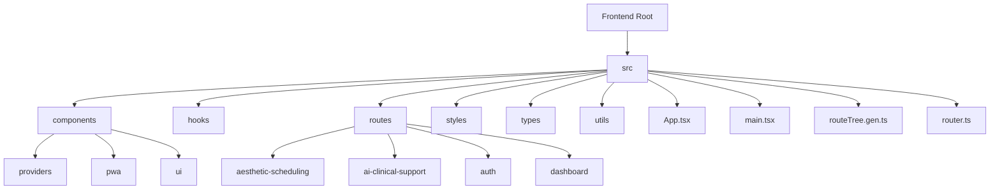
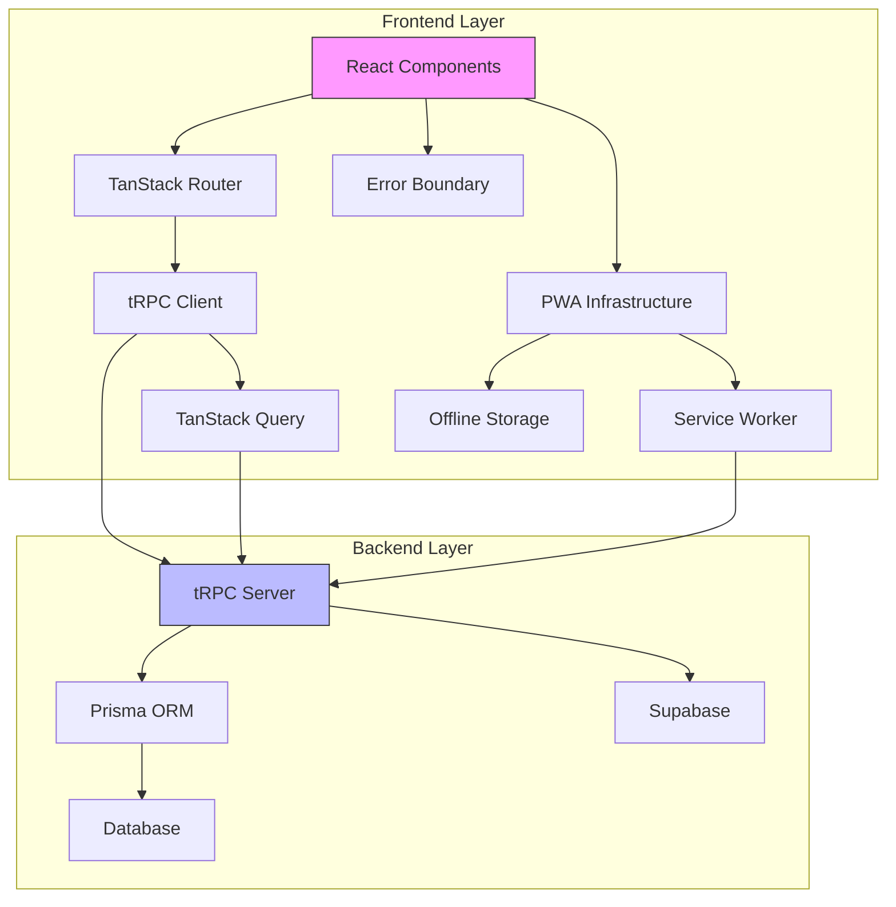
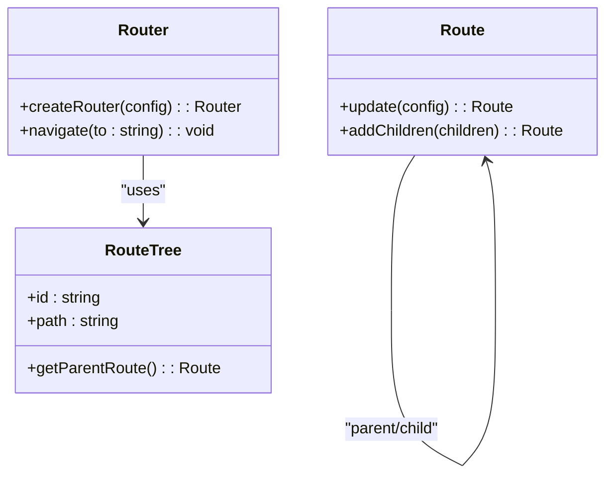
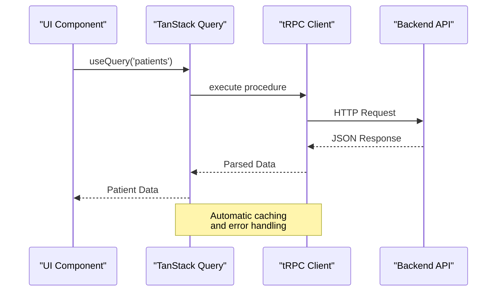
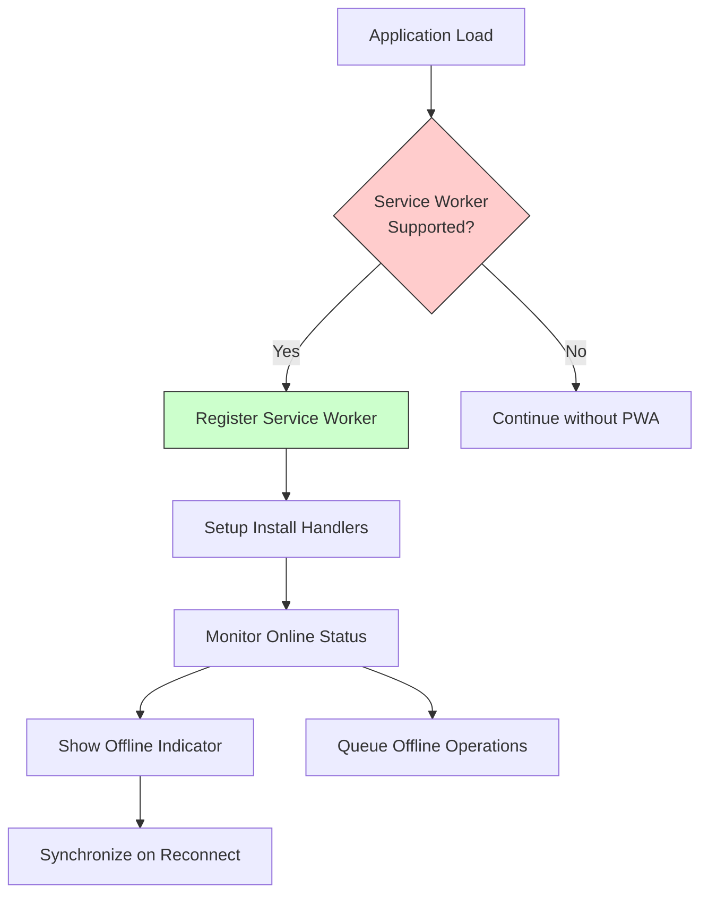

# Frontend Architecture

<cite>
**Referenced Files in This Document **
- [App.tsx](file://apps/web/src/App.tsx)
- [main.tsx](file://apps/web/src/main.tsx)
- [routeTree.gen.ts](file://apps/web/src/routeTree.gen.ts)
- [TRPCProvider.tsx](file://apps/web/src/components/providers/TRPCProvider.tsx)
- [TanStackQueryProvider.tsx](file://apps/web/src/components/providers/TanStackQueryProvider.tsx)
- [vite.config.ts](file://apps/web/vite.config.ts)
- [router.ts](file://apps/web/src/router.ts)
- [ErrorBoundary.tsx](file://apps/web/src/components/ErrorBoundary.tsx)
</cite>

## Table of Contents

1. [Introduction](#introduction)
2. [Project Structure](#project-structure)
3. [Core Components](#core-components)
4. [Architecture Overview](#architecture-overview)
5. [Detailed Component Analysis](#detailed-component-analysis)
6. [Dependency Analysis](#dependency-analysis)
7. [Performance Considerations](#performance-considerations)
8. [Troubleshooting Guide](#troubleshooting-guide)
9. [Conclusion](#conclusion)

## Introduction

The NeonPro frontend architecture is built on React with Vite as the build tool, following modern component-based patterns. The application implements a robust PWA (Progressive Web App) architecture with offline capabilities, service worker integration, and installability features. The system leverages tRPC for type-safe API communication and TanStack Router for efficient routing. This documentation provides a comprehensive overview of the architectural design, component hierarchy, state management, routing system, and integration patterns with backend services.

## Project Structure



**Diagram sources**

- [App.tsx](file://apps/web/src/App.tsx)
- [main.tsx](file://apps/web/src/main.tsx)
- [routeTree.gen.ts](file://apps/web/src/routeTree.gen.ts)

**Section sources**

- [App.tsx](file://apps/web/src/App.tsx)
- [main.tsx](file://apps/web/src/main.tsx)
- [vite.config.ts](file://apps/web/vite.config.ts)

## Core Components

The core components of the NeonPro frontend include the main application shell, routing system, state management providers, and PWA infrastructure. The architecture follows a provider pattern for dependency injection, with specialized providers for tRPC and TanStack Query. The ErrorBoundary component implements resilient error handling across the application. The PWA components enable offline functionality and installation prompts.

**Section sources**

- [App.tsx](file://apps/web/src/App.tsx#L41-L93)
- [main.tsx](file://apps/web/src/main.tsx)
- [ErrorBoundary.tsx](file://apps/web/src/components/ErrorBoundary.tsx#L12-L61)

## Architecture Overview



**Diagram sources**

- [App.tsx](file://apps/web/src/App.tsx)
- [main.tsx](file://apps/web/src/main.tsx)
- [TRPCProvider.tsx](file://apps/web/src/components/providers/TRPCProvider.tsx)
- [TanStackQueryProvider.tsx](file://apps/web/src/components/providers/TanStackQueryProvider.tsx)

## Detailed Component Analysis

### Routing System Analysis

The routing system is implemented using TanStack Router with code generation. The routeTree.gen.ts file contains the generated route configuration that maps URL paths to component imports. This approach enables type-safe routing with autocompletion and compile-time validation of route parameters.



**Diagram sources**

- [routeTree.gen.ts](file://apps/web/src/routeTree.gen.ts#L0-L113)
- [router.ts](file://apps/web/src/router.ts)

### State Management Analysis

The state management architecture combines tRPC for API communication with TanStack Query for client-side state management. The TRPCProvider wraps the application with tRPC context, while the TanStackQueryProvider manages query caching, refetching, and mutation state.



**Diagram sources**

- [TRPCProvider.tsx](file://apps/web/src/components/providers/TRPCProvider.tsx#L8-L15)
- [TanStackQueryProvider.tsx](file://apps/web/src/components/providers/TanStackQueryProvider.tsx#L35-L45)

### PWA Implementation Analysis

The PWA implementation includes service worker registration, install prompts, and online/offline status detection. The architecture ensures reliable offline access to critical functionality and seamless installation on supported devices.



**Diagram sources**

- [App.tsx](file://apps/web/src/App.tsx#L41-L93)
- [main.tsx](file://apps/web/src/main.tsx)
- [PWAInstallPrompt.tsx](file://apps/web/src/components/pwa/PWAInstallPrompt.tsx)

## Dependency Analysis

```mermaid
graph LR
A[Vite] --> B[React]
A --> C[TanStack Router]
A --> D[tRPC]
A --> E[Tailwind CSS]
B --> F[TanStack Query]
D --> G[Superjson]
F --> H[React Query Devtools]
C --> I[TypeScript]
A --> J[ESBuild]
class A,B,C,D,E,F,G,H,I,J node;
linkStyle 0 stroke:#4c1,stroke-width:2px;
linkStyle 1 stroke:#4c1,stroke-width:2px;
linkStyle 2 stroke:#4c1,stroke-width:2px;
linkStyle 3 stroke:#4c1,stroke-width:2px;
linkStyle 4 stroke:#4c1,stroke-width:2px;
linkStyle 5 stroke:#4c1,stroke-width:2px;
linkStyle 6 stroke:#4c1,stroke-width:2px;
linkStyle 7 stroke:#4c1,stroke-width:2px;
linkStyle 8 stroke:#4c1,stroke-width:2px;
linkStyle 9 stroke:#4c1,stroke-width:2px;
```

**Diagram sources**

- [vite.config.ts](file://apps/web/vite.config.ts)
- [package.json](file://apps/web/package.json)

**Section sources**

- [vite.config.ts](file://apps/web/vite.config.ts)
- [package.json](file://apps/web/package.json)

## Performance Considerations

The frontend architecture incorporates several performance optimizations:

- Code splitting via route-based chunking
- Pre-bundling of dependencies in Vite config
- Efficient query caching with staleTime and gcTime settings
- Service worker caching for offline access
- Minimized re-renders through proper state management
- Tree-shaking enabled through ESBuild

The Vite configuration specifies key dependencies to include in the pre-bundle optimization list, reducing initial load time. The TanStack Query configuration balances freshness with performance by setting appropriate stale times and enabling refetch on window focus only when necessary.

**Section sources**

- [vite.config.ts](file://apps/web/vite.config.ts)
- [TanStackQueryProvider.tsx](file://apps/web/src/components/providers/TanStackQueryProvider.tsx)

## Troubleshooting Guide

The application implements comprehensive error handling through the ErrorBoundary component, which catches runtime errors and displays a user-friendly recovery interface. The PWA infrastructure includes monitoring for service worker registration failures and offline operation issues. Common troubleshooting scenarios include:

- Service worker registration failures: Check HTTPS requirements and scope configuration
- tRPC connection issues: Verify backend endpoint availability and authentication
- Query cache inconsistencies: Inspect network conditions and cache invalidation logic
- PWA installation blocked: Ensure all PWA criteria are met (HTTPS, manifest, service worker)
- Routing errors: Validate routeTree.gen.ts generation and import paths

**Section sources**

- [ErrorBoundary.tsx](file://apps/web/src/components/ErrorBoundary.tsx#L12-L61)
- [main.tsx](file://apps/web/src/main.tsx)

## Conclusion

The NeonPro frontend architecture demonstrates a modern, production-ready React application with PWA capabilities, type-safe API communication through tRPC, and efficient state management via TanStack Query. The routing system leverages code generation for type safety and maintainability. The PWA implementation ensures reliability across network conditions, while the error boundary pattern provides resilience against runtime exceptions. This architecture supports scalability through code splitting and optimized dependency management, making it suitable for complex healthcare applications with stringent compliance requirements.
