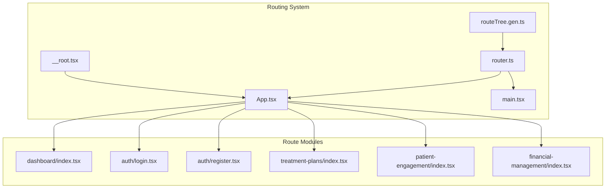
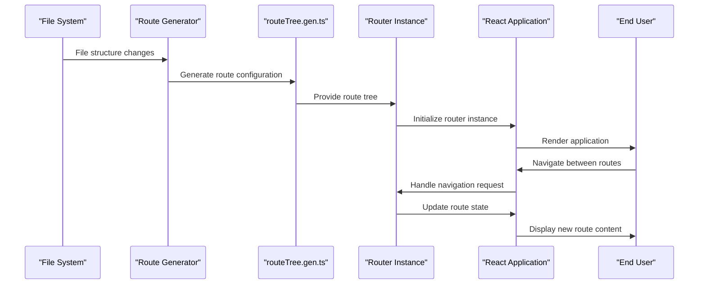
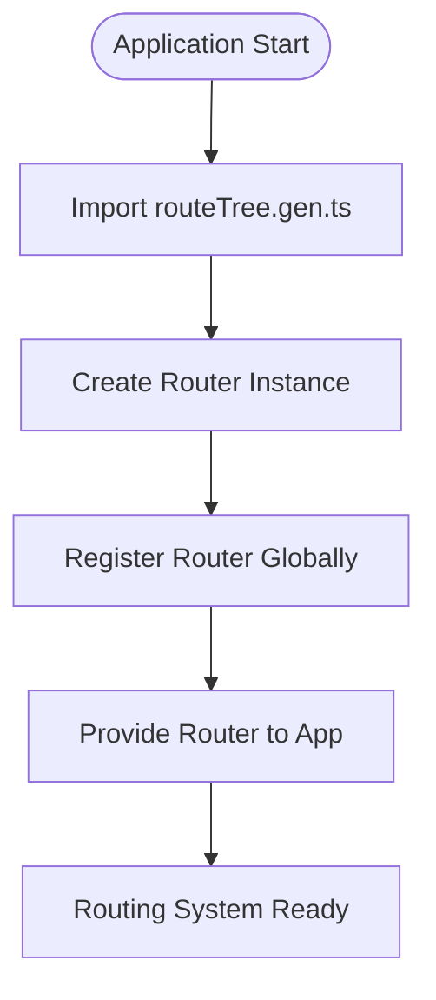
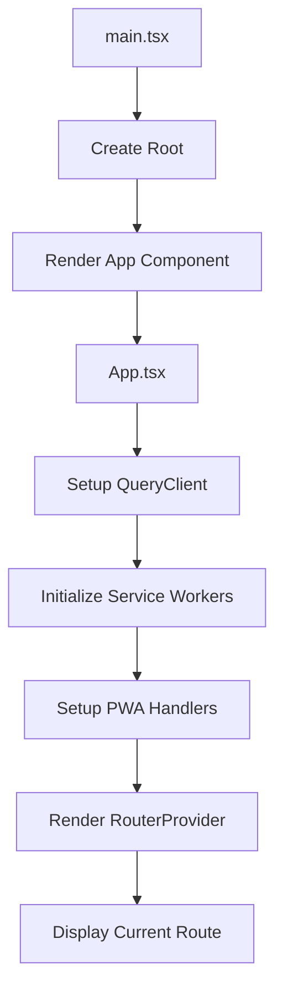
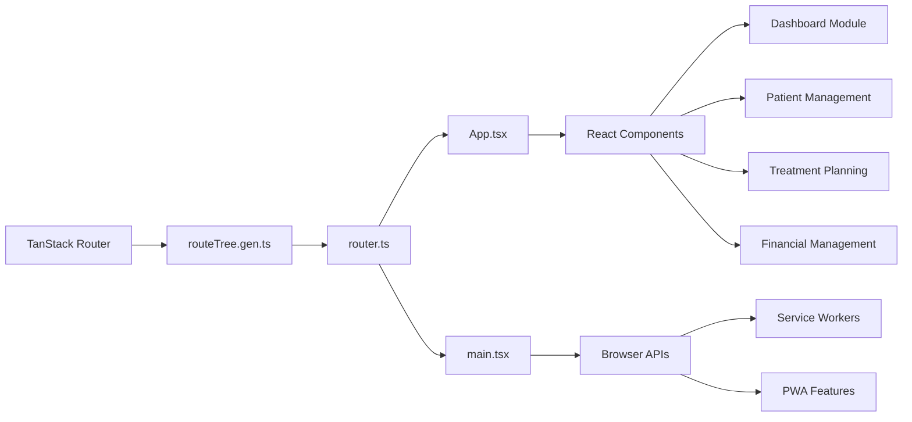

# Routing System

<cite>
**Referenced Files in This Document**
- [routeTree.gen.ts](file://apps/web/src/routeTree.gen.ts)
- [router.ts](file://apps/web/src/router.ts)
- [__root.tsx](file://apps/web/src/routes/__root.tsx)
- [App.tsx](file://apps/web/src/App.tsx)
- [main.tsx](file://apps/web/src/main.tsx)
</cite>

## Table of Contents

1. [Introduction](#introduction)
2. [Project Structure](#project-structure)
3. [Core Components](#core-components)
4. [Architecture Overview](#architecture-overview)
5. [Detailed Component Analysis](#detailed-component-analysis)
6. [Dependency Analysis](#dependency-analysis)
7. [Performance Considerations](#performance-considerations)
8. [Troubleshooting Guide](#troubleshooting-guide)
9. [Conclusion](#conclusion)

## Introduction

The neonpro application implements a modern file-based routing system powered by TanStack Router, enabling type-safe navigation and efficient route management across various healthcare modules including dashboard, patient management, treatment planning, and financial operations. This document details the implementation of the routing architecture, focusing on the automated generation of route configurations through `routeTree.gen.ts`, integration with React Router, and the mechanisms that ensure type safety and optimal performance.

## Project Structure

The routing system is organized within the web application's source directory following a feature-based structure where each major module corresponds to a dedicated route file. The routing configuration is automatically generated based on the file system hierarchy under `/apps/web/src/routes/`.



**Diagram sources**

- [routeTree.gen.ts](file://apps/web/src/routeTree.gen.ts#L1-L114)
- [router.ts](file://apps/web/src/router.ts#L1-L12)

**Section sources**

- [routeTree.gen.ts](file://apps/web/src/routeTree.gen.ts#L1-L114)
- [routes](file://apps/web/src/routes)

## Core Components

The routing system consists of several core components that work together to provide a seamless navigation experience. The `routeTree.gen.ts` file serves as the central configuration point, automatically generated from the file system structure. The router instance created in `router.ts` connects this configuration with the React application, while `__root.tsx` provides the base layout for all routes.

**Section sources**

- [routeTree.gen.ts](file://apps/web/src/routeTree.gen.ts#L1-L114)
- [router.ts](file://apps/web/src/router.ts#L1-L12)
- [__root.tsx](file://apps/web/src/routes/__root.tsx#L1-L19)

## Architecture Overview

The routing architecture follows a layered approach where the file system structure directly defines the application's URL structure. TanStack Router analyzes the route files and generates type-safe route configurations that are then used to create a router instance. This instance is provided to the React application through context, enabling navigation throughout the component tree.



**Diagram sources**

- [routeTree.gen.ts](file://apps/web/src/routeTree.gen.ts#L1-L114)
- [router.ts](file://apps/web/src/router.ts#L1-L12)

## Detailed Component Analysis

### Route Configuration Generation

The `routeTree.gen.ts` file is automatically generated by TanStack Router based on the file system structure under the routes directory. This file contains type definitions and route configurations for all available routes in the application, ensuring type safety throughout the routing system.

```mermaid
classDiagram
class Route {
+id : string
+path : string
+fullPath : string
+preLoaderRoute : typeof RouteImport
+parentRoute : typeof rootRouteImport
}
class FileRoutesByFullPath {
"/" : IndexRoute
"/auth/login" : AuthLoginRoute
"/auth/register" : AuthRegisterRoute
"/dashboard" : DashboardIndexRoute
}
class FileRoutesByTo {
"/" : IndexRoute
"/auth/login" : AuthLoginRoute
"/auth/register" : AuthRegisterRoute
"/dashboard" : DashboardIndexRoute
}
class FileRoutesById {
__root__ : rootRouteImport
"/" : IndexRoute
"/auth/login" : AuthLoginRoute
"/auth/register" : AuthRegisterRoute
"/dashboard/" : DashboardIndexRoute
}
Route <|-- FileRoutesByFullPath
Route <|-- FileRoutesByTo
Route <|-- FileRoutesById
```

**Diagram sources**

- [routeTree.gen.ts](file://apps/web/src/routeTree.gen.ts#L1-L114)

**Section sources**

- [routeTree.gen.ts](file://apps/web/src/routeTree.gen.ts#L1-L114)

### Router Initialization

The router instance is created in `router.ts` by importing the generated route tree and passing it to TanStack Router's `createRouter` function. This instance is then registered globally to enable type-safe routing throughout the application.



**Diagram sources**

- [router.ts](file://apps/web/src/router.ts#L1-L12)

**Section sources**

- [router.ts](file://apps/web/src/router.ts#L1-L12)

### Application Integration

The routing system is integrated into the main application through `App.tsx` and `main.tsx`, where the router provider is set up to manage navigation state and render the appropriate components based on the current route.



**Diagram sources**

- [App.tsx](file://apps/web/src/App.tsx#L1-L96)
- [main.tsx](file://apps/web/src/main.tsx#L1-L99)

**Section sources**

- [App.tsx](file://apps/web/src/App.tsx#L1-L96)
- [main.tsx](file://apps/web/src/main.tsx#L1-L99)

## Dependency Analysis

The routing system has well-defined dependencies that ensure proper functionality and type safety across the application.



**Diagram sources**

- [package.json](file://apps/web/package.json)
- [router.ts](file://apps/web/src/router.ts#L1-L12)

**Section sources**

- [router.ts](file://apps/web/src/router.ts#L1-L12)
- [App.tsx](file://apps/web/src/App.tsx#L1-L96)

## Performance Considerations

The routing system implements several performance optimizations including code splitting through dynamic imports, lazy loading of route components, and efficient state management through React Query integration. The generated route configuration minimizes runtime overhead by providing static route definitions that can be optimized during build time.

## Troubleshooting Guide

Common issues with the routing system typically involve incorrect file naming conventions, missing route imports, or type errors in the generated route configuration. When encountering routing issues, verify that route files follow the correct naming pattern and are placed in the appropriate directory structure.

**Section sources**

- [routeTree.gen.ts](file://apps/web/src/routeTree.gen.ts#L1-L114)
- [router.ts](file://apps/web/src/router.ts#L1-L12)

## Conclusion

The neonpro application's routing system provides a robust, type-safe foundation for navigating between different sections of the healthcare platform. By leveraging TanStack Router's file-based routing approach with automatic route tree generation, the system ensures consistency, maintainability, and developer productivity across the application's various modules.
