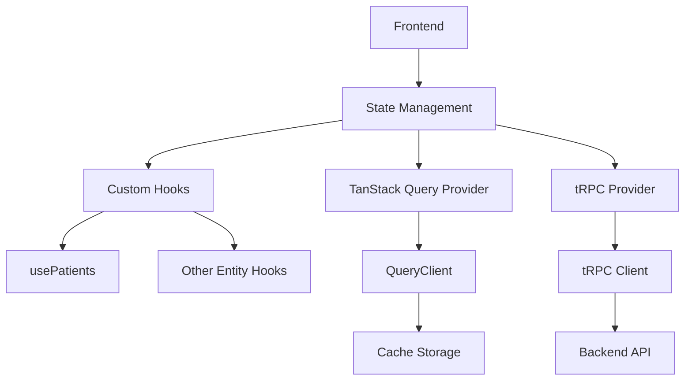
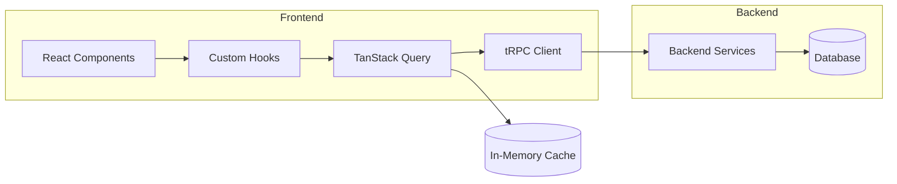
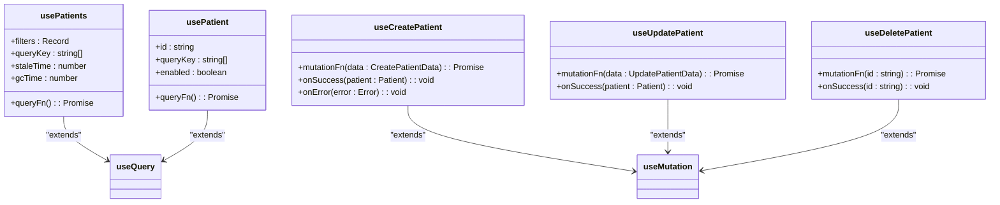
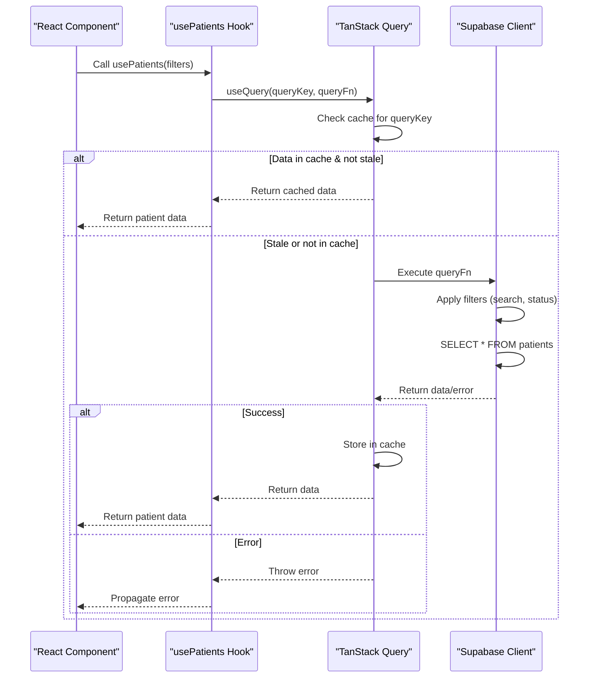
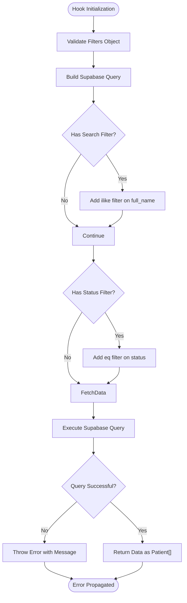
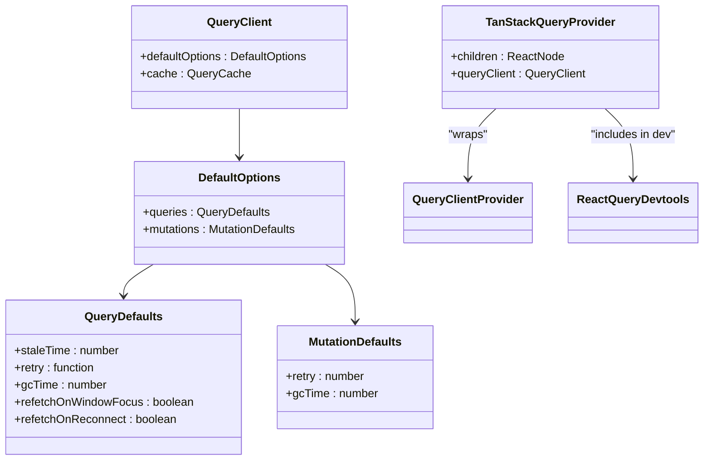
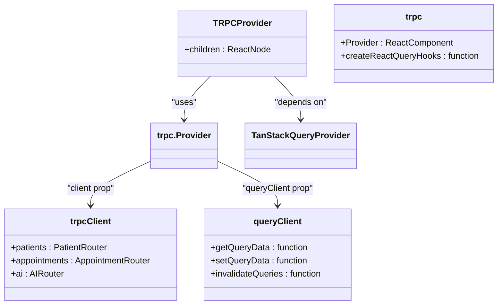
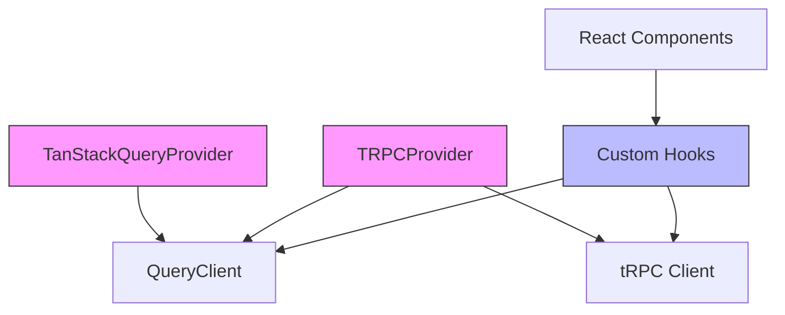

# State Management

<cite>
**Referenced Files in This Document **   
- [usePatients.ts](file://apps/web/src/hooks/usePatients.ts)
- [TanStackQueryProvider.tsx](file://apps/web/src/components/providers/TanStackQueryProvider.tsx)
- [TRPCProvider.tsx](file://apps/web/src/components/providers/TRPCProvider.tsx)
- [context.ts](file://apps/api/src/trpc/context.ts)
- [router.ts](file://apps/api/src/trpc/router.ts)
- [patients.ts](file://apps/api/src/trpc/routers/patients.ts)
</cite>

## Table of Contents
1. [Introduction](#introduction)
2. [Project Structure](#project-structure)
3. [Core Components](#core-components)
4. [Architecture Overview](#architecture-overview)
5. [Detailed Component Analysis](#detailed-component-analysis)
6. [Dependency Analysis](#dependency-analysis)
7. [Performance Considerations](#performance-considerations)
8. [Troubleshooting Guide](#troubleshooting-guide)
9. [Conclusion](#conclusion)

## Introduction
This document provides a comprehensive analysis of the state management system in the neonpro frontend application. It details how TanStack Query and React hooks are used to manage server state, with a focus on the integration between frontend data fetching and backend tRPC services. The documentation explains custom hooks like `usePatients`, cache management strategies, error handling, and real-time data synchronization patterns.

## Project Structure
The state management system is organized across multiple directories within the web application. Key components are located in dedicated folders for hooks, providers, and API integrations. The architecture follows a modular pattern that separates concerns between data fetching, state management, and UI presentation layers.

**Diagram sources **
- [TanStackQueryProvider.tsx](file://apps/web/src/components/providers/TanStackQueryProvider.tsx)
- [TRPCProvider.tsx](file://apps/web/src/components/providers/TRPCProvider.tsx)
- [usePatients.ts](file://apps/web/src/hooks/usePatients.ts)

**Section sources**
- [apps/web/src](file://apps/web/src)
- [apps/web/src/hooks](file://apps/web/src/hooks)
- [apps/web/src/components/providers](file://apps/web/src/components/providers)

## Core Components
The core components of the state management system include the TanStack Query provider, tRPC integration layer, and custom React hooks that abstract data fetching logic. These components work together to provide a seamless experience for managing server state while maintaining compliance with healthcare regulations like LGPD.

**Section sources**
- [TanStackQueryProvider.tsx](file://apps/web/src/components/providers/TanStackQueryProvider.tsx#L35-L45)
- [TRPCProvider.tsx](file://apps/web/src/components/providers/TRPCProvider.tsx#L8-L15)
- [usePatients.ts](file://apps/web/src/hooks/usePatients.ts#L39-L65)

## Architecture Overview
The architecture implements a layered approach to state management, with clear separation between the UI layer, data fetching layer, and backend services. TanStack Query serves as the central caching mechanism, while tRPC provides type-safe communication with the backend. Custom hooks encapsulate business logic and provide a clean API for components to interact with data.

**Diagram sources **
- [TanStackQueryProvider.tsx](file://apps/web/src/components/providers/TanStackQueryProvider.tsx)
- [TRPCProvider.tsx](file://apps/web/src/components/providers/TRPCProvider.tsx)
- [usePatients.ts](file://apps/web/src/hooks/usePatients.ts)

## Detailed Component Analysis
This section provides an in-depth analysis of the key components that make up the state management system, including their implementation details, configuration options, and interaction patterns.

### usePatients Hook Analysis
The `usePatients` hook demonstrates how data fetching logic is abstracted using TanStack Query. It handles patient data retrieval with support for filtering, caching, and error handling. The hook uses query keys for consistent cache invalidation and includes proper error propagation mechanisms.

#### For Object-Oriented Components:

**Diagram sources **
- [usePatients.ts](file://apps/web/src/hooks/usePatients.ts#L39-L65)
- [usePatients.ts](file://apps/web/src/hooks/usePatients.ts#L70-L85)

#### For API/Service Components:

**Diagram sources **
- [usePatients.ts](file://apps/web/src/hooks/usePatients.ts#L39-L65)
- [usePatients.ts](file://apps/web/src/hooks/usePatients.ts#L8-L19)

#### For Complex Logic Components:

**Diagram sources **
- [usePatients.ts](file://apps/web/src/hooks/usePatients.ts#L45-L60)

**Section sources**
- [usePatients.ts](file://apps/web/src/hooks/usePatients.ts#L1-L197)

### TanStack Query Provider Analysis
The TanStack Query provider configures the global query client with optimized settings for the healthcare application. It includes development tools and establishes default behaviors for queries and mutations.

**Diagram sources **
- [TanStackQueryProvider.tsx](file://apps/web/src/components/providers/TanStackQueryProvider.tsx#L35-L45)

**Section sources**
- [TanStackQueryProvider.tsx](file://apps/web/src/components/providers/TanStackQueryProvider.tsx#L1-L57)

### tRPC Integration Analysis
The tRPC provider establishes the connection between the frontend and backend services, enabling type-safe API calls with automatic serialization and deserialization. It integrates with TanStack Query to provide seamless data fetching capabilities.

**Diagram sources **
- [TRPCProvider.tsx](file://apps/web/src/components/providers/TRPCProvider.tsx#L8-L15)

**Section sources**
- [TRPCProvider.tsx](file://apps/web/src/components/providers/TRPCProvider.tsx#L1-L16)

## Dependency Analysis
The state management system has well-defined dependencies between components, ensuring loose coupling and high cohesion. The architecture leverages dependency injection through React context to provide necessary clients and configuration to consuming components.

**Diagram sources **
- [TanStackQueryProvider.tsx](file://apps/web/src/components/providers/TanStackQueryProvider.tsx)
- [TRPCProvider.tsx](file://apps/web/src/components/providers/TRPCProvider.tsx)
- [usePatients.ts](file://apps/web/src/hooks/usePatients.ts)

**Section sources**
- [TanStackQueryProvider.tsx](file://apps/web/src/components/providers/TanStackQueryProvider.tsx#L1-L57)
- [TRPCProvider.tsx](file://apps/web/src/components/providers/TRPCProvider.tsx#L1-L16)
- [usePatients.ts](file://apps/web/src/hooks/usePatients.ts#L1-L197)

## Performance Considerations
The state management system incorporates several performance optimizations, including configurable stale times, garbage collection intervals, and intelligent refetching strategies. The default configuration balances freshness of data with network efficiency, particularly important in healthcare applications where data accuracy is critical.

**Section sources**
- [TanStackQueryProvider.tsx](file://apps/web/src/components/providers/TanStackQueryProvider.tsx#L10-L30)

## Troubleshooting Guide
Common issues in the state management system typically involve cache invalidation, authentication errors, or type mismatches between frontend and backend. The React Query Devtools provide valuable insights into query states and can help diagnose problems with data fetching and caching behavior.

**Section sources**
- [TanStackQueryProvider.tsx](file://apps/web/src/components/providers/TanStackQueryProvider.tsx#L40-L45)
- [usePatients.ts](file://apps/web/src/hooks/usePatients.ts#L55-L60)

## Conclusion
The state management system in neonpro effectively combines TanStack Query and tRPC to create a robust, type-safe solution for managing server state in a healthcare application. The architecture prioritizes data consistency, regulatory compliance, and developer experience through well-abstracted custom hooks and comprehensive error handling. By leveraging these patterns, the application maintains optimal performance while ensuring sensitive patient data is handled according to strict privacy requirements.