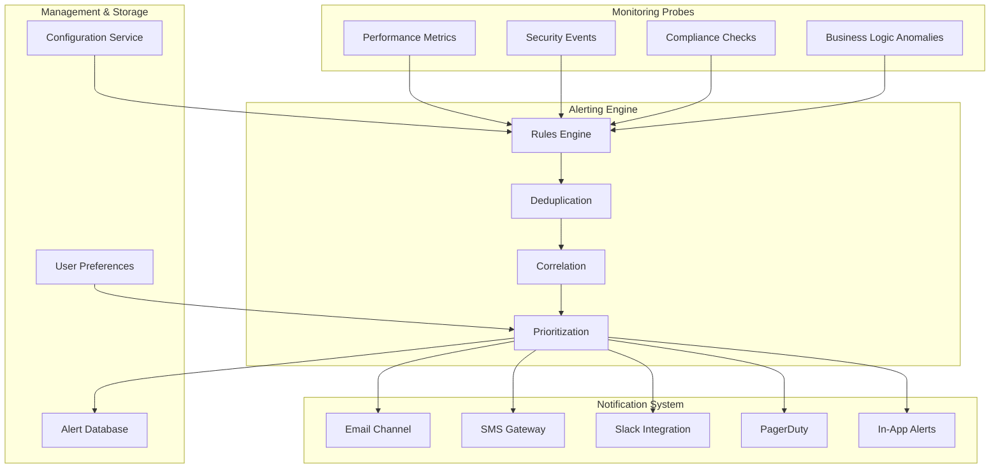
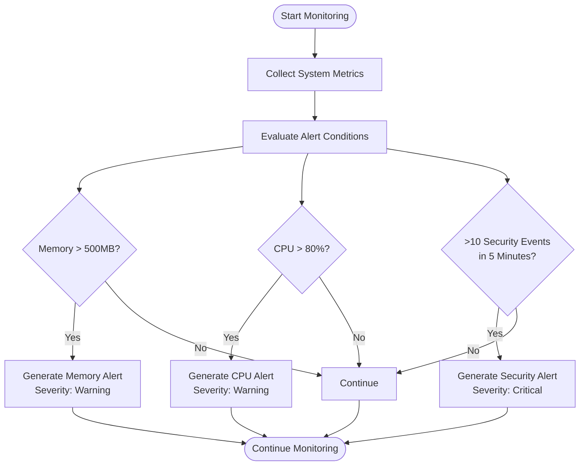
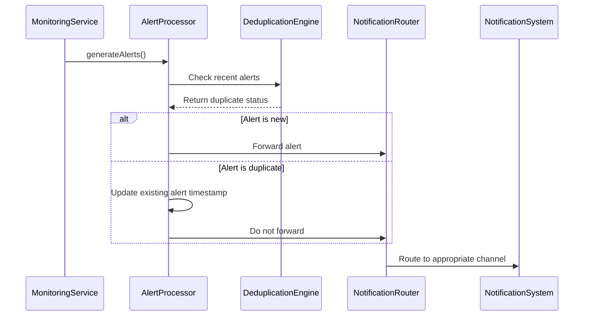
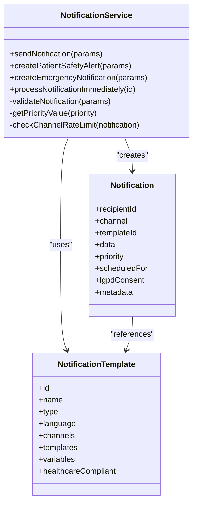
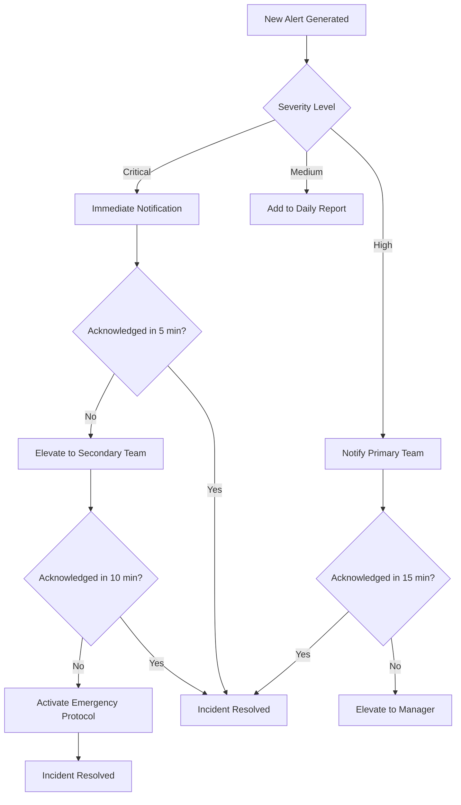
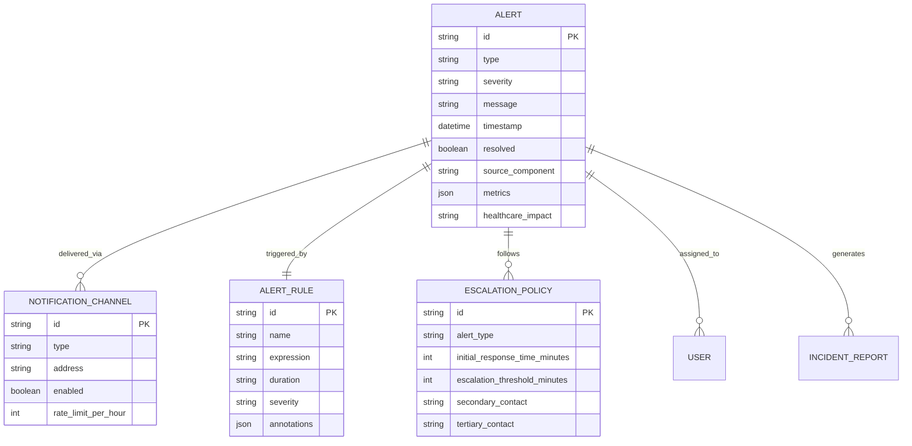
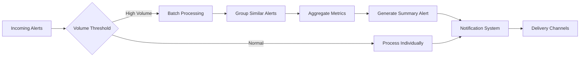

# Alerting System

<cite>
**Referenced Files in This Document**
- [monitoring-service.ts](file://apps/api/src/services/monitoring-service.ts)
- [healthcare-alerts.json](file://tools/monitoring/alerts/healthcare-alerts.json)
- [monitoring-config.ts](file://config/vercel/monitoring-config.ts)
- [notification-service.ts](file://apps/api/src/services/notification-service.ts)
- [aesthetic-notification-service.ts](file://apps/api/src/services/agui-protocol/aesthetic-notification-service.ts)
- [anomaly-detection.ts](file://apps/api/src/services/financial-ai-agent/anomaly-detection.ts)
- [https-monitoring-service.ts](file://apps/api/src/services/monitoring/https-monitoring-service.ts)
</cite>

## Table of Contents

1. [Introduction](#introduction)
2. [System Architecture Overview](#system-architecture-overview)
3. [Alert Generation and Detection](#alert-generation-and-detection)
4. [Alert Processing and Deduplication](#alert-processing-and-deduplication)
5. [Notification Channels and Delivery](#notification-channels-and-delivery)
6. [Escalation Procedures](#escalation-procedures)
7. [Infrastructure Requirements](#infrastructure-requirements)
8. [Scalability Considerations](#scalability-considerations)
9. [Deployment Topology](#deployment-topology)
10. [Cross-Cutting Concerns](#cross-cutting-concerns)
11. [Technology Stack and Dependencies](#technology-stack-and-dependencies)

## Introduction

The alerting system in the neonpro application is designed to provide proactive incident detection and response coordination for healthcare operations. This system monitors various aspects of the application including system performance, security events, compliance requirements, and business-critical workflows. The architecture is built to detect anomalies, generate alerts based on predefined rules, process these alerts through deduplication and correlation mechanisms, and deliver notifications through multiple channels to ensure operational teams are promptly informed of critical issues.

The system focuses on healthcare-specific requirements including LGPD (Brazilian General Data Protection Law), ANVISA (National Health Surveillance Agency), and CFM (Federal Council of Medicine) compliance. It integrates with third-party services like PagerDuty and Slack for incident management while maintaining strict data protection standards for patient information.

This documentation provides a comprehensive overview of the alerting system's architecture, component interactions, data flows, and operational procedures.

## System Architecture Overview

The alerting system follows a modular architecture with distinct components responsible for monitoring, alert processing, notification delivery, and escalation management. The system is designed with healthcare compliance as a primary concern, ensuring that all alerts involving patient data adhere to strict privacy regulations.

**Diagram sources**

- [monitoring-service.ts](file://apps/api/src/services/monitoring-service.ts)
- [healthcare-alerts.json](file://tools/monitoring/alerts/healthcare-alerts.json)
- [monitoring-config.ts](file://config/vercel/monitoring-config.ts)

**Section sources**

- [monitoring-service.ts](file://apps/api/src/services/monitoring-service.ts)
- [monitoring-config.ts](file://config/vercel/monitoring-config.ts)

## Alert Generation and Detection

The alert generation process begins with monitoring probes that collect metrics from various system components. These probes detect anomalies in system behavior, performance degradation, security incidents, and compliance violations. The monitoring service continuously evaluates system metrics against predefined thresholds to identify potential issues.

The system uses a combination of real-time monitoring and periodic checks to detect incidents. For example, the `MonitoringService` class collects system metrics every 10 seconds and performs health checks every 30 seconds. When specific conditions are met, such as high memory usage or elevated error rates, the system generates alerts with appropriate severity levels.

The alert rules are defined in both code and configuration files. The `healthcare-alerts.json` file contains PromQL-style expressions that define alert conditions for critical healthcare scenarios such as database connection failures, high API error rates, and potential patient data breaches. Each alert includes metadata specifying its severity, impact on healthcare operations, and links to runbooks for incident resolution.

**Section sources**

- [monitoring-service.ts](file://apps/api/src/services/monitoring-service.ts#L481-L575)
- [healthcare-alerts.json](file://tools/monitoring/alerts/healthcare-alerts.json)
- [https-monitoring-service.ts](file://apps/api/src/services/monitoring/https-monitoring-service.ts#L131-L176)

## Alert Processing and Deduplication

Once alerts are generated, they undergo processing to eliminate duplicates, correlate related incidents, and prioritize based on severity and impact. The system implements deduplication logic to prevent alert fatigue by suppressing repeated notifications for the same underlying issue.

The `generateAlerts()` method in the monitoring service filters and consolidates similar alerts before they are propagated to the notification system. For example, multiple security events occurring within a 5-minute window are aggregated into a single critical alert rather than generating individual notifications for each event.

The system also implements temporal deduplication by tracking alert history and applying cooldown periods. The `cleanupOldEvents()` method removes resolved alerts after a specified period while maintaining unresolved alerts for up to one hour to ensure proper incident tracking.

**Diagram sources**

- [monitoring-service.ts](file://apps/api/src/services/monitoring-service.ts#L516-L557)
- [dynamic-connection-pool.ts](file://apps/api/src/services/dynamic-connection-pool.ts#L794-L834)

**Section sources**

- [monitoring-service.ts](file://apps/api/src/services/monitoring-service.ts#L516-L557)
- [dynamic-connection-pool.ts](file://apps/api/src/services/dynamic-connection-pool.ts#L794-L834)

## Notification Channels and Delivery

The notification system supports multiple delivery channels including email, SMS, Slack, PagerDuty, and in-app alerts. The `NotificationService` class manages the delivery of notifications across these channels, ensuring reliable message delivery while adhering to healthcare compliance requirements.

Each notification channel has specific configuration parameters and rate limits to prevent abuse and ensure service reliability. The system implements exponential backoff retry mechanisms for failed deliveries, with the `retryNotification()` function calculating the next retry time based on the number of previous attempts.

The system prioritizes patient safety alerts and emergency notifications, bypassing normal rate limits to ensure immediate delivery. For critical healthcare incidents, notifications are sent through multiple channels simultaneously to maximize the likelihood of timely response.

**Diagram sources**

- [notification-service.ts](file://apps/api/src/services/notification-service.ts)
- [aesthetic-notification-service.ts](file://apps/api/src/services/agui-protocol/aesthetic-notification-service.ts)

**Section sources**

- [notification-service.ts](file://apps/api/src/services/notification-service.ts)
- [aesthetic-notification-service.ts](file://apps/api/src/services/agui-protocol/aesthetic-notification-service.ts)

## Escalation Procedures

The alerting system implements automated escalation procedures to ensure critical incidents receive appropriate attention. The `AnomalyDetection` component evaluates escalation conditions based on alert severity and other factors, automatically escalating high-severity alerts to on-call personnel if not acknowledged within a specified timeframe.

The escalation logic is configurable through the monitoring configuration, allowing different escalation paths for various alert types. For example, database connection failures trigger immediate escalation to the database team, while compliance violations follow a separate escalation path involving legal and compliance officers.

The system maintains an escalation chain for each alert type, with the `updateAlertStatus()` method tracking the current assignee and resolution progress. This ensures accountability and provides audit trails for incident management.

**Section sources**

- [anomaly-detection.ts](file://apps/api/src/services/financial-ai-agent/anomaly-detection.ts#L1301-L1362)
- [monitoring-config.ts](file://config/vercel/monitoring-config.ts#L368-L410)

## Infrastructure Requirements

The alerting system requires specific infrastructure components to support reliable operation and data persistence. The system stores alert data in a dedicated database with retention policies aligned with healthcare compliance requirements.

Alert storage requirements include:

- **Database**: PostgreSQL with Supabase integration for notification data
- **Retention**: 365 days for audit-compliant alerts, 30 days for operational alerts
- **Indexing**: Optimized indexes on timestamp, severity, and status fields
- **Backup**: Automated daily backups with point-in-time recovery

The system also requires message queue infrastructure for handling high-volume alert scenarios. The notification service implements a priority-based queue that processes critical alerts before lower-priority notifications.

**Diagram sources**

- [notification-service.ts](file://apps/api/src/services/notification-service.ts)
- [monitoring-service.ts](file://apps/api/src/services/monitoring-service.ts)

**Section sources**

- [notification-service.ts](file://apps/api/src/services/notification-service.ts)
- [monitoring-service.ts](file://apps/api/src/services/monitoring-service.ts)

## Scalability Considerations

The alerting system is designed to handle high-volume alert scenarios typical in healthcare environments with thousands of concurrent users. The architecture incorporates several scalability features to maintain performance under load.

Key scalability considerations include:

- **Horizontal scaling**: The monitoring service can be deployed across multiple instances with load balancing
- **Queue-based processing**: Notifications are processed through a priority queue to handle traffic spikes
- **Rate limiting**: Per-channel and per-user rate limits prevent system overload
- **Batch processing**: Alerts are processed in batches to reduce database load

The system implements predictive scaling based on healthcare patterns, with the `getCurrentScalingPolicy()` method adjusting thresholds based on current operational demands. During peak hours, the system lowers the scale-up threshold to 70% utilization to ensure adequate capacity.

The notification service also implements circuit breaker patterns to prevent cascading failures when external services are unavailable. If a notification channel fails repeatedly, the system temporarily disables it and redirects alerts to alternative channels.

**Section sources**

- [dynamic-connection-pool.ts](file://apps/api/src/services/dynamic-connection-pool.ts#L669-L715)
- [notification-service.ts](file://apps/api/src/services/notification-service.ts)

## Deployment Topology

The alerting system is deployed across staging and production environments with identical topology to ensure consistent behavior. Each environment consists of independent monitoring, alert processing, and notification components.

Production deployment topology:

- **Primary Region**: AWS sa-east-1 (São Paulo)
- **Secondary Region**: AWS us-east-1 (Virginia)
- **Database**: Supabase PostgreSQL with cross-region replication
- **Monitoring**: Separate instances for each microservice
- **Notification Gateways**: Isolated from core application services

Staging environment mirrors production but with reduced resource allocation and disabled critical alert channels. This allows testing of alert rules and notification templates without impacting operational teams.

The system implements environment-specific configuration through the `monitoringConfig` object, which loads different settings based on the `NODE_ENV` variable. Production alerts are configured to notify real operational teams, while staging alerts are directed to development personnel.

**Section sources**

- [monitoring-config.ts](file://config/vercel/monitoring-config.ts)
- [notification-service.ts](file://apps/api/src/services/notification-service.ts)

## Cross-Cutting Concerns

The alerting system addresses several cross-cutting concerns essential for healthcare applications, particularly around alert fatigue mitigation, maintenance windows, and incident post-mortem workflows.

### Alert Fatigue Mitigation

To prevent alert fatigue, the system implements multiple strategies:

- **Intelligent deduplication**: Suppresses repeated alerts for the same issue
- **Priority-based filtering**: Allows users to filter notifications by severity
- **Quiet hours**: Respects user-defined quiet periods for non-critical alerts
- **Summary reports**: Consolidates low-severity alerts into periodic digests

The notification preferences system allows users to customize their alert experience, specifying preferred channels and setting quiet hours when they do not wish to receive notifications.

### Maintenance Windows

The system supports scheduled maintenance windows during which certain alerts are automatically suppressed. This prevents unnecessary notifications during planned outages or system upgrades. Maintenance windows are configured through the monitoring configuration and can be applied to specific components or the entire system.

### Incident Post-Mortem Workflows

After an incident is resolved, the system supports post-mortem workflows by:

- Maintaining detailed audit logs of all alert activity
- Tracking resolution times and response effectiveness
- Generating incident reports with timeline analysis
- Integrating with external systems for formal post-mortem documentation

The `updateAlertStatus()` method captures resolution notes and timestamps, providing valuable data for retrospective analysis and process improvement.

**Section sources**

- [notification-service.ts](file://packages/shared/src/services/notification-service.ts#L58-L118)
- [anomaly-detection.ts](file://apps/api/src/services/financial-ai-agent/anomaly-detection.ts#L1301-L1362)

## Technology Stack and Dependencies

The alerting system leverages a modern technology stack with specific dependencies tailored to healthcare requirements:

**Core Technologies:**

- **Runtime**: Node.js with TypeScript
- **Database**: Supabase PostgreSQL
- **Monitoring**: Custom monitoring service with Prometheus-style expressions
- **Messaging**: WebSocket and HTTP APIs

**Third-Party Dependencies:**

- **PagerDuty**: Critical alert integration for incident management
- **Slack**: Real-time communication channel for team notifications
- **Sentry**: Error tracking and performance monitoring
- **Supabase**: Authentication and database services

**Version Compatibility:**

- **Alerting Protocols**: Compatible with PagerDuty v2 API and Slack Webhook API
- **Database**: Requires PostgreSQL 12+ for JSONB field support
- **Node.js**: Minimum version 18.x for performance and security features

The system implements healthcare-specific integrations for LGPD, ANVISA, and CFM compliance, with dedicated monitoring rules and alert categories for regulatory requirements. The configuration system allows easy updates to third-party service credentials and API endpoints without code changes.

**Section sources**

- [monitoring-config.ts](file://config/vercel/monitoring-config.ts)
- [notification-service.ts](file://apps/api/src/services/notification-service.ts)
- [healthcare-alerts.json](file://tools/monitoring/alerts/healthcare-alerts.json)
