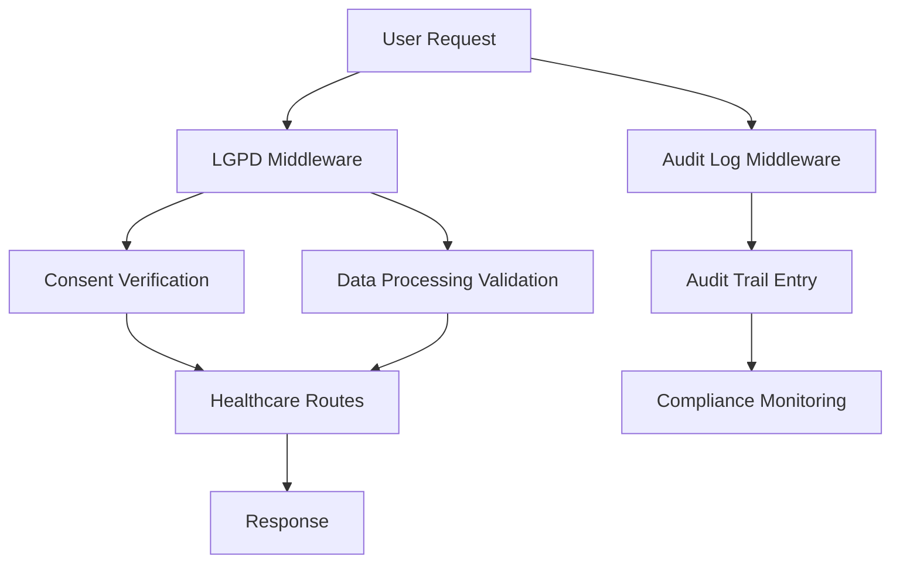
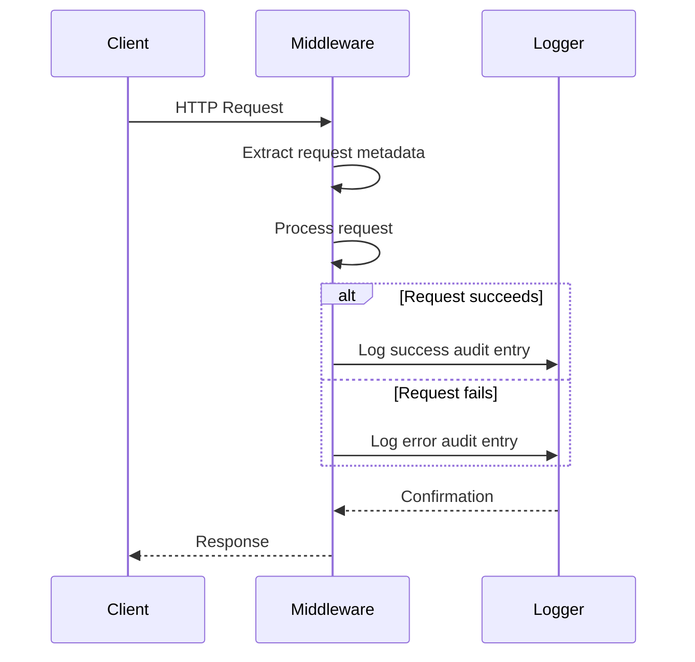
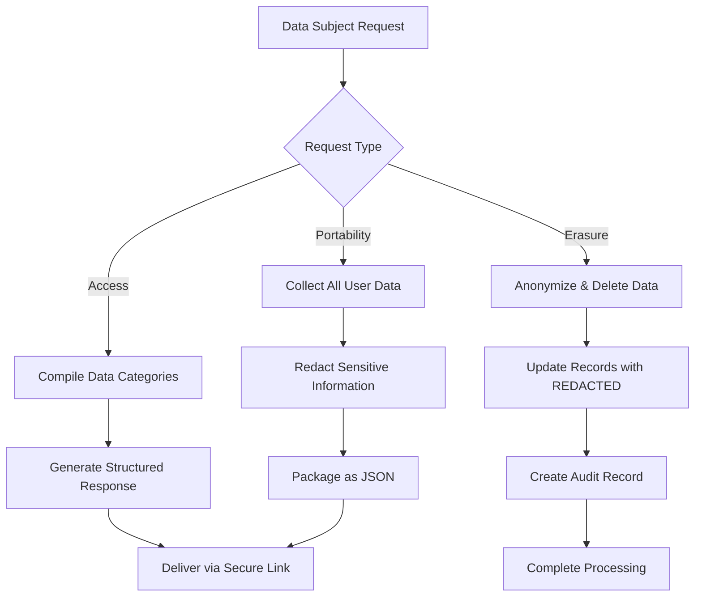

# Compliance Reporting

<cite>
**Referenced Files in This Document**
- [lgpd-middleware.ts](file://apps/api/src/middleware/lgpd-middleware.ts)
- [audit-log.ts](file://apps/api/src/middleware/audit-log.ts)
- [healthcare.ts](file://apps/api/src/routes/healthcare.ts)
- [lgpd.ts](file://packages/utils/src/lgpd.ts)
- [telemetry-event.ts](file://packages/shared/src/models/telemetry-event.ts)
- [types.ts](file://packages/shared/src/telemetry/types.ts)
</cite>

## Table of Contents

1. [Introduction](#introduction)
2. [Core Components](#core-components)
3. [Automated Compliance Checks](#automated-compliance-checks)
4. [Audit Trail Generation](#audit-trail-generation)
5. [Regulatory Reporting Mechanisms](#regulatory-reporting-mechanisms)
6. [Invocation Relationships with User Data Operations](#invocation-relationships-with-user-data-operations)
7. [Domain Models for Compliance Events](#domain-models-for-compliance-events)
8. [Data Retention Policies](#data-retention-policies)
9. [LGPD Compliance Validation in Patient Data Workflows](#lgpd-compliance-validation-in-patient-data-workflows)
10. [Integration with Audit Logging and Security Policies](#integration-with-audit-logging-and-security-policies)
11. [Common Compliance Issues and Solutions](#common-compliance-issues-and-solutions)
12. [Conclusion](#conclusion)

## Introduction

This document provides a comprehensive analysis of the compliance reporting sub-feature focused on Brazilian healthcare regulations (Lei Geral de Proteção de Dados - LGPD). The system implements automated compliance checks, audit trail generation, and regulatory reporting mechanisms to ensure adherence to Brazil's strict data protection requirements in healthcare contexts. The implementation covers consent verification, data access logging, patient rights enforcement, and cross-border data transfer restrictions. This documentation explains the technical architecture, domain models, and integration points while providing accessible explanations for both beginners and experienced developers.

## Core Components

The compliance reporting system is built around several core components that work together to enforce LGPD requirements across the application. These include middleware layers for real-time compliance checking, utility functions for PII redaction, and specialized route handlers for regulatory operations.



**Diagram sources**

- [lgpd-middleware.ts](file://apps/api/src/middleware/lgpd-middleware.ts#L1-L685)
- [audit-log.ts](file://apps/api/src/middleware/audit-log.ts#L1-L330)

**Section sources**

- [lgpd-middleware.ts](file://apps/api/src/middleware/lgpd-middleware.ts#L1-L685)
- [audit-log.ts](file://apps/api/src/middleware/audit-log.ts#L1-L330)
- [healthcare.ts](file://apps/api/src/routes/healthcare.ts#L1-L621)

## Automated Compliance Checks

The system implements automated compliance checks through middleware that intercepts requests and validates them against LGPD requirements. The `lgpdMiddleware` function performs real-time validation of data processing purposes, consent status, and user permissions before allowing access to protected resources.

The middleware determines the required processing purpose based on the request path, checking whether explicit consent is needed for operations involving patient data. For medical care and appointment scheduling, the system applies strict mode enforcement, requiring valid consent for access. The implementation includes specialized middleware variants like `healthcareLGPDMiddleware` that configure appropriate settings for healthcare contexts.

When a request lacks proper consent, the system logs the violation and returns a 403 Forbidden response with details about the missing consent and instructions for obtaining it. This automated checking occurs at the middleware layer, ensuring consistent enforcement across all healthcare-related endpoints without requiring individual route implementations to handle compliance logic.

**Section sources**

- [lgpd-middleware.ts](file://apps/api/src/middleware/lgpd-middleware.ts#L1-L685)

## Audit Trail Generation

Audit trail generation is implemented through the `auditLogMiddleware` which creates detailed records of all significant operations involving patient data. Each audit entry captures essential information including timestamp, user ID, action performed, resource affected, IP address, user agent, and request duration.

The middleware automatically extracts action and resource information from HTTP methods and request paths, mapping GET requests to "read" actions, POST to "create", and so on. For healthcare-specific operations, the `healthcareAuditMiddleware` variant includes additional safeguards, redacting sensitive fields like CPF (Brazilian individual taxpayer registry), RG (identity document), CNS (National Health Card), and medical record details from the logged request bodies.

Audit entries are stored in structured format and can be queried for compliance reviews. The system ensures audit trail integrity by logging both successful operations and failed attempts, providing a complete picture of data access patterns. Specialized middleware variants exist for different domains, including financial operations and authentication events, each with appropriate sensitivity configurations.



**Diagram sources**

- [audit-log.ts](file://apps/api/src/middleware/audit-log.ts#L1-L330)

**Section sources**

- [audit-log.ts](file://apps/api/src/middleware/audit-log.ts#L1-L330)

## Regulatory Reporting Mechanisms

Regulatory reporting mechanisms are implemented through specialized endpoints and middleware that support LGPD-mandated patient rights. The system provides three key regulatory functions: data portability, data erasure, and consent management, each accessible through dedicated middleware handlers.

The `dataPortabilityMiddleware` handles data export requests (LGPD Article 18), collecting all user data from various systems into a structured JSON format. This includes profile information, patient records, appointments, medical records (with sensitive data redacted), consents, and related audit logs. The exported data includes compliance metadata specifying the legal basis and retention period.

For data erasure requests, the `dataErasureMiddleware` implements a hybrid approach combining anonymization and deletion. Sensitive patient data in tables like 'patients' and 'users' is anonymized rather than completely deleted, preserving necessary information for legal obligations while respecting patient rights. Related records like consents and audit logs are permanently deleted, and the entire operation is itself audited for transparency.



**Diagram sources**

- [lgpd-middleware.ts](file://apps/api/src/middleware/lgpd-middleware.ts#L1-L685)

**Section sources**

- [lgpd-middleware.ts](file://apps/api/src/middleware/lgpd-middleware.ts#L1-L685)

## Invocation Relationships with User Data Operations

The compliance monitoring system is tightly integrated with user data operations through middleware chaining. When a user accesses healthcare data, the request flows through multiple middleware layers that collectively enforce compliance requirements.

The invocation sequence begins with authentication, followed by LGPD compliance checking, then audit logging, and finally the target route handler. The `lgpdMiddleware` verifies that the user has valid consent for the requested operation based on the processing purpose derived from the request path. If consent is valid, the request proceeds to the `auditLogMiddleware` which records the access attempt.

In healthcare routes, these middleware functions are applied globally using `healthcare.use('*', middleware)`, ensuring consistent enforcement across all endpoints. The `healthcareAuthMiddleware` establishes user context, which is then used by both compliance and audit middleware to determine authorization and log appropriate information.

This layered approach creates a clear separation of concerns while maintaining tight integration between compliance monitoring and data operations. Each middleware component can be independently configured and tested, yet they work together to provide comprehensive protection for patient data.

**Section sources**

- [healthcare.ts](file://apps/api/src/routes/healthcare.ts#L1-L621)
- [lgpd-middleware.ts](file://apps/api/src/middleware/lgpd-middleware.ts#L1-L685)

## Domain Models for Compliance Events

The system defines two primary domain models for compliance events, reflecting different levels of detail and usage contexts. These models capture the essential attributes needed for regulatory compliance and auditing.

The first model, defined in `telemetry/types.ts`, represents a basic compliance event with core attributes:

```typescript
export interface ComplianceEvent {
  eventType: 'data_access' | 'data_export' | 'data_deletion' | 'consent_update'
  timestamp: string
  _userId: string
  clinicId: string
  dataClassification: string
  complianceNotes: string
  auditTrailId: string
}
```

The second, more comprehensive model in `telemetry-event.ts` extends a base telemetry event with detailed compliance metadata:

```typescript
export interface ComplianceEvent extends Omit<TelemetryEvent, 'eventType'> {
  eventType:
    | TelemetryEventType.LGPD_CONSENT_UPDATE
    | TelemetryEventType.LGPD_DATA_EXPORT
    | TelemetryEventType.LGPD_DATA_DELETION
    | TelemetryEventType.AUDIT_TRAIL_ENTRY

  compliance: {
    lgpdCompliant: true
    dataRetentionDays: number
    encryptionStatus: 'encrypted' | 'hashed'
    auditRequired: true
    piiPresent: boolean
    anonymizationApplied: boolean
  }

  data: {
    action: string
    resourceType: string
    affectedRecords: number
    legalBasis?: string
    justification?: string
  }
}
```

These models support different use cases, with the simpler version used for basic event tracking and the richer version employed when detailed compliance metadata is required for regulatory reporting.

**Section sources**

- [types.ts](file://packages/shared/src/telemetry/types.ts#L67-L75)
- [telemetry-event.ts](file://packages/shared/src/models/telemetry-event.ts#L217-L240)

## Data Retention Policies

Data retention policies are implemented through a combination of database operations and compliance rules that align with Brazilian healthcare regulations. The system follows the principle that medical records must be retained for 20 years as required by Brazilian law, while other data categories have shorter retention periods.

During data erasure operations, the system distinguishes between complete deletion and anonymization. When a patient requests data deletion, the system retains medical records and billing information for legal compliance but anonymizes personally identifiable information. Fields like name, CPF, phone, and email are replaced with generic values or nullified, while the record structure remains intact for audit purposes.

The `deleteUserData` function implements this hybrid approach, performing updates to anonymize sensitive data in patient and user tables while deleting associated records like consents and audit logs. The operation itself is logged with details about the records affected and the retention exceptions applied, creating an immutable record of the compliance decision.

These retention policies are enforced programmatically rather than relying solely on database constraints, allowing for nuanced handling of different data categories and legal requirements.

**Section sources**

- [lgpd-middleware.ts](file://apps/api/src/middleware/lgpd-middleware.ts#L1-L685)

## LGPD Compliance Validation in Patient Data Workflows

LGPD compliance validation is deeply integrated into patient data workflows through the healthcare routes implementation. When accessing patient information, the system performs multi-layered validation that includes authentication, authorization, compliance checking, and audit logging.

In the `/patients/:id` route, for example, the system first verifies that the authenticated user has the necessary permissions to read patient data. Then, through the chained middleware, it confirms that the access complies with LGPD requirements and logs the data access attempt. The response includes only the necessary data fields, adhering to the data minimization principle.

For data creation and modification operations, the system validates input against defined schemas and checks that the operation aligns with the user's role and permissions. Appointment creation, for instance, includes validation that the scheduled time is in the future and checks for scheduling conflicts, demonstrating how business rules and compliance requirements are combined in workflow validation.

The comprehensive test suite demonstrates expected compliance behavior across the data lifecycle, from collection with proper consent to storage with geographic restrictions (data localization in Brazil) and eventual deletion or anonymization according to retention policies.

**Section sources**

- [healthcare.ts](file://apps/api/src/routes/healthcare.ts#L1-L621)
- [lgpd-validation.test.ts](file://apps/api/tests/compliance/lgpd-validation.test.ts#L1-L1022)

## Integration with Audit Logging and Security Policies

The compliance system is closely integrated with audit logging and security policies to create a cohesive protection framework for patient data. The middleware components work together to enforce security controls while maintaining detailed records of all access attempts.

The `lgpdMiddleware` and `auditLogMiddleware` are designed to complement each other, with the former preventing unauthorized access and the latter recording authorized access. This dual-layer approach ensures that both compliance violations and legitimate data operations are properly tracked and reported.

Security policies are enforced through field-level redaction in audit logs, where sensitive information like passwords, tokens, CPF numbers, and medical records are automatically replaced with "[REDACTED]" before logging. The `sanitizeData` function recursively processes objects to identify and redact sensitive fields based on configurable patterns.

The system also integrates with broader security infrastructure, including role-based access control, JWT validation, and HTTPS enforcement. These components work in concert with compliance middleware to create defense-in-depth protection for healthcare data, ensuring that technical security measures and regulatory compliance requirements are simultaneously satisfied.

**Section sources**

- [lgpd-middleware.ts](file://apps/api/src/middleware/lgpd-middleware.ts#L1-L685)
- [audit-log.ts](file://apps/api/src/middleware/audit-log.ts#L1-L330)

## Common Compliance Issues and Solutions

The system addresses several common compliance issues through proactive monitoring and automated enforcement mechanisms.

**Incomplete Audit Trails**: To prevent incomplete audit trails, the system uses middleware chaining to ensure that every request passes through the audit logging component. The healthcare routes apply audit middleware globally, eliminating the possibility of unprotected endpoints. Additionally, the system logs both successful operations and failed access attempts, providing a complete record of data access patterns.

**Expired Consents**: The system handles expired consents through timestamp validation in the `hasValidConsent` function, which checks that the current date falls within the consent validity period. When a consent expires, the system automatically treats it as invalid and requires renewal before further data processing can occur. The test suite verifies that expired consents are properly detected and handled.

**Cross-Border Data Transfer Violations**: To prevent unauthorized international data transfers, the system implements data localization policies that restrict database regions, backup locations, and processing locations to Brazilian territories only. The test suite explicitly verifies that no international vendors are used and that all infrastructure components reside within Brazil. Attempts to transfer data internationally are blocked and logged as security incidents.

These solutions demonstrate how the system moves beyond simple compliance checking to implement comprehensive data governance that addresses both technical and procedural aspects of regulatory requirements.

**Section sources**

- [lgpd-validation.test.ts](file://apps/api/tests/compliance/lgpd-validation.test.ts#L1-L1022)
- [lgpd-middleware.ts](file://apps/api/src/middleware/lgpd-middleware.ts#L1-L685)

## Conclusion

The compliance reporting system for Brazilian healthcare regulations (LGPD) provides a robust framework for automated compliance checks, audit trail generation, and regulatory reporting. By implementing middleware-based enforcement, the system ensures consistent application of compliance rules across all healthcare data operations without requiring individual route handlers to manage complex regulatory requirements.

The architecture effectively separates concerns while maintaining tight integration between compliance monitoring, audit logging, and user data operations. Domain models for compliance events capture the necessary metadata for regulatory reporting, and data retention policies align with Brazilian legal requirements for medical record keeping.

For beginners, the system demonstrates how regulatory requirements can be translated into technical implementations through well-defined interfaces and reusable components. For experienced developers, the implementation offers insights into advanced compliance automation strategies, including hybrid data erasure approaches, multi-layered audit logging, and proactive prevention of common compliance issues.

The comprehensive test suite provides confidence in the system's ability to meet LGPD requirements throughout the data lifecycle, from collection with informed consent to secure storage and eventual deletion or anonymization according to retention policies.
