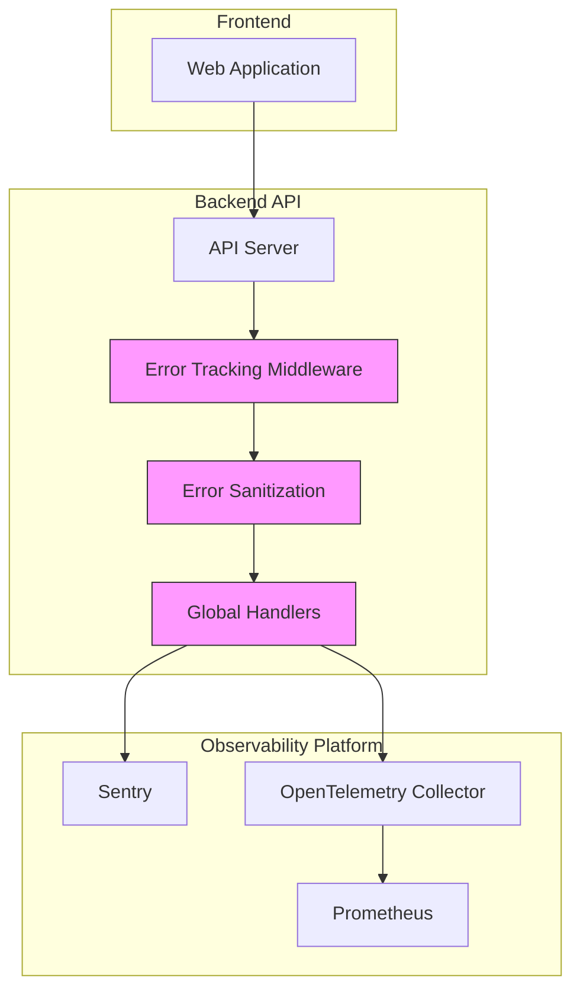
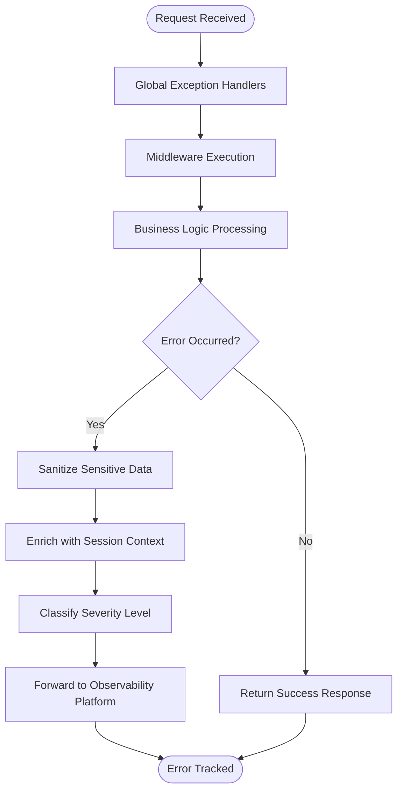
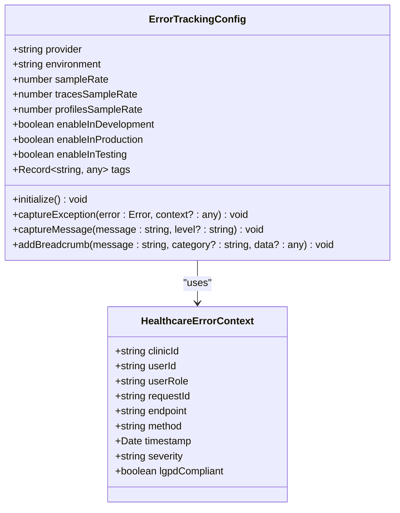

# Error Tracking

<cite>
**Referenced Files in This Document **   
- [error-tracking.ts](file://apps/api/src/config/error-tracking.ts)
- [error-handler.ts](file://apps/api/src/middleware/error-handler.ts)
- [error-sanitization.ts](file://apps/api/src/middleware/error-sanitization.ts)
- [error-tracking.ts](file://apps/api/src/middleware/error-tracking.ts)
- [error-tracking.ts](file://apps/api/src/services/error-tracking.ts)
- [monitoring-config.ts](file://config/vercel/monitoring-config.ts)
</cite>

## Table of Contents
1. [Introduction](#introduction)
2. [Error Tracking Architecture](#error-tracking-architecture)
3. [Core Components](#core-components)
4. [Middleware Pipeline](#middleware-pipeline)
5. [Configuration Options](#configuration-options)
6. [Error Capture Examples](#error-capture-examples)
7. [Integration with Monitoring Systems](#integration-with-monitoring-systems)
8. [Common Issues and Solutions](#common-issues-and-solutions)
9. [Structured Logging Format](#structured-logging-format)
10. [Error Correlation in Distributed Systems](#error-correlation-in-distributed-systems)

## Introduction
The error tracking system in the neonpro application provides comprehensive monitoring and analysis of runtime exceptions across frontend, backend, and AI agent services. Designed with healthcare compliance as a core principle, this system captures, categorizes, and analyzes errors while ensuring sensitive patient data protection under LGPD regulations. The implementation focuses on secure error interception, context enrichment, and integration with observability platforms to enable effective debugging and system reliability improvements.

**Section sources**
- [error-tracking.ts](file://apps/api/src/config/error-tracking.ts#L1-L20)
- [monitoring-config.ts](file://config/vercel/monitoring-config.ts#L1-L50)

## Error Tracking Architecture
The error tracking architecture implements a multi-layered approach that combines global handlers, middleware components, and service-level tracking to ensure comprehensive coverage of all error scenarios. This design enables consistent error capture regardless of origin while maintaining separation between error detection, processing, and reporting concerns.



**Diagram sources **
- [error-tracking.ts](file://apps/api/src/middleware/error-tracking.ts#L11-L58)
- [error-sanitization.ts](file://apps/api/src/middleware/error-sanitization.ts#L122-L146)

**Section sources**
- [error-tracking.ts](file://apps/api/src/middleware/error-tracking.ts#L1-L114)
- [error-sanitization.ts](file://apps/api/src/middleware/error-sanitization.ts#L1-L148)

## Core Components
The error tracking system consists of several key components that work together to provide comprehensive error monitoring. These include configuration management, middleware layers, and specialized services for error processing and reporting. The HealthcareErrorTracker class serves as the central component responsible for redacting sensitive information, classifying error types, and determining appropriate severity levels based on both technical and business impact.

**Section sources**
- [error-tracking.ts](file://apps/api/src/services/error-tracking.ts#L1-L100)
- [error-tracking.ts](file://apps/api/src/config/error-tracking.ts#L27-L175)

## Middleware Pipeline
The error tracking middleware pipeline processes exceptions through multiple stages to ensure proper handling and sanitization before forwarding to observability platforms. This pipeline begins with global error handlers that catch unhandled exceptions and promise rejections, followed by request-specific middleware that adds contextual information and performs initial sanitization.



**Diagram sources **
- [error-tracking.ts](file://apps/api/src/middleware/error-tracking.ts#L70-L113)
- [error-handler.ts](file://apps/api/src/middleware/error-handler.ts#L1-L47)

**Section sources**
- [error-tracking.ts](file://apps/api/src/middleware/error-tracking.ts#L70-L113)
- [error-handler.ts](file://apps/api/src/middleware/error-handler.ts#L1-L47)

## Configuration Options
The error tracking system provides extensive configuration options to control sampling rates, severity levels, and context enrichment. These settings are defined in environment variables and configuration files, allowing different behaviors across development, staging, and production environments. Key configuration parameters include sampleRate for controlling the percentage of errors sent to monitoring services, tracesSampleRate for distributed tracing, and profilesSampleRate for performance profiling.



**Diagram sources **
- [error-tracking.ts](file://apps/api/src/config/error-tracking.ts#L27-L101)
- [monitoring-config.ts](file://config/vercel/monitoring-config.ts#L1-L50)

**Section sources**
- [error-tracking.ts](file://apps/api/src/config/error-tracking.ts#L27-L287)
- [monitoring-config.ts](file://config/vercel/monitoring-config.ts#L1-L485)

## Error Capture Examples
The system demonstrates robust error capture capabilities across various components, particularly in handling AI service failures and database connectivity issues. For AI agent services, the error tracker identifies specific failure patterns such as model invocation timeouts or invalid response formats. In database operations, it distinguishes between connection failures, query timeouts, and constraint violations, providing appropriate classification and severity levels for each scenario.

**Section sources**
- [error-tracking.ts](file://apps/api/src/services/error-tracking.ts#L349-L387)
- [error-tracking.test.ts](file://apps/api/src/__tests__/error-tracking.test.ts#L1-L215)

## Integration with Monitoring Systems
The error tracking system integrates seamlessly with external monitoring platforms including Sentry and OpenTelemetry. This integration enables centralized visibility into application health and performance metrics. The system forwards sanitized error reports to these platforms while maintaining compliance with healthcare data protection regulations. Additionally, it correlates error events with audit logs and performance monitoring data to provide comprehensive insights into system behavior.

**Section sources**
- [error-tracking.ts](file://apps/api/src/config/error-tracking.ts#L27-L175)
- [monitoring-config.ts](file://config/vercel/monitoring-config.ts#L1-L485)

## Common Issues and Solutions
The implementation addresses several common challenges in error tracking, particularly around sensitive data leakage, rate limiting, and integration complexity. To prevent sensitive data exposure, the system employs comprehensive redaction rules that mask personal health information (PHI), financial data, and authentication credentials. Rate limiting is managed through configurable sampling rates that balance monitoring needs with resource constraints. External service integrations are handled through standardized interfaces that support multiple observability platforms.

**Section sources**
- [error-sanitization.ts](file://apps/api/src/middleware/error-sanitization.ts#L1-L148)
- [error-tracking.ts](file://apps/api/src/services/error-tracking.ts#L349-L460)

## Structured Logging Format
The system uses a standardized structured logging format that includes essential error information while excluding sensitive data. Each log entry contains fields for error severity, type classification, redacted message content, and relevant contextual information such as request ID, endpoint, and timestamp. This consistent format enables efficient parsing and analysis by monitoring tools and supports automated alerting based on specific error patterns.

```json
{
  "level": "critical",
  "message": "Database connection timeout",
  "error_type": "database_error",
  "redacted_fields": ["cpf", "email"],
  "context": {
    "clinic_id": "clinic-789",
    "operation_type": "read",
    "endpoint": "/api/v1/patients",
    "request_id": "req-123",
    "timestamp": "2024-01-15T10:30:00Z"
  },
  "healthcare_compliant": true,
  "timestamp": "2024-01-15T10:30:01Z"
}
```

**Section sources**
- [error-tracking.ts](file://apps/api/src/services/error-tracking.ts#L547-L578)
- [monitoring-config.ts](file://config/vercel/monitoring-config.ts#L150-L250)

## Error Correlation in Distributed Systems
The error tracking system implements robust correlation mechanisms to trace errors across distributed components. By propagating request IDs and trace contexts through service boundaries, it enables end-to-end visibility into transaction flows. This capability is particularly valuable in identifying root causes of failures that span multiple services, such as when an AI agent's failure cascades into downstream processing components. The integration with OpenTelemetry ensures consistent context propagation across the entire technology stack.

**Section sources**
- [error-tracking.ts](file://apps/api/src/services/error-tracking.ts#L392-L460)
- [config/error-tracking.ts](file://apps/api/src/config/error-tracking.ts#L106-L175)