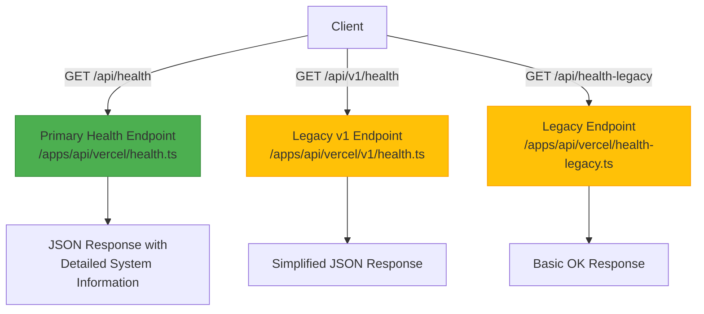
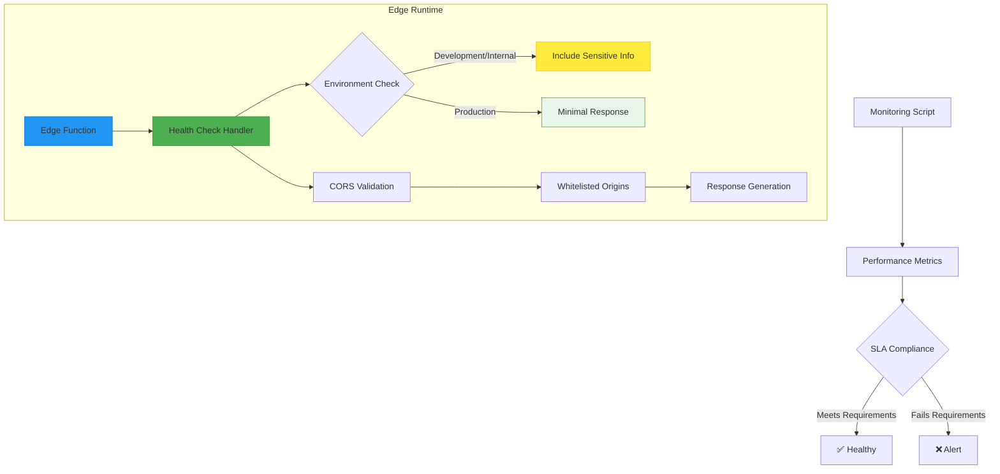
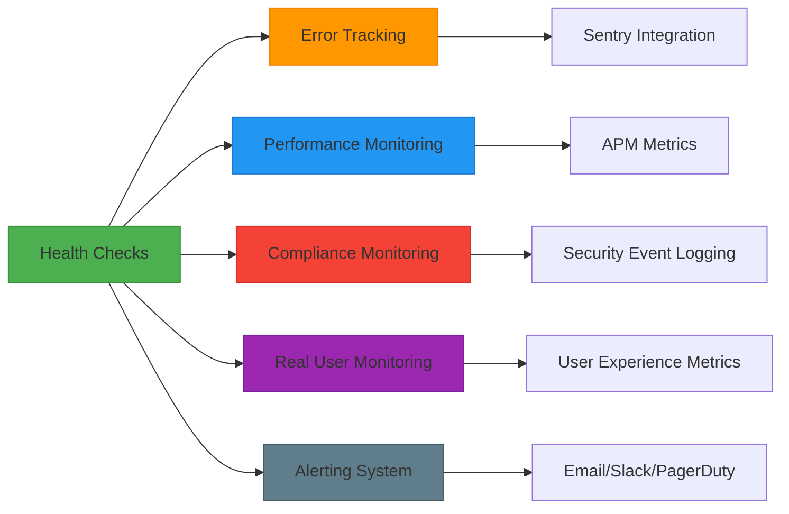
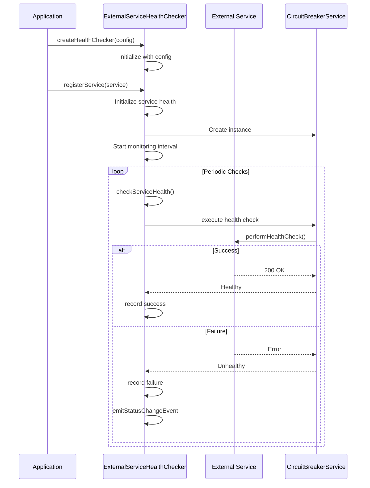
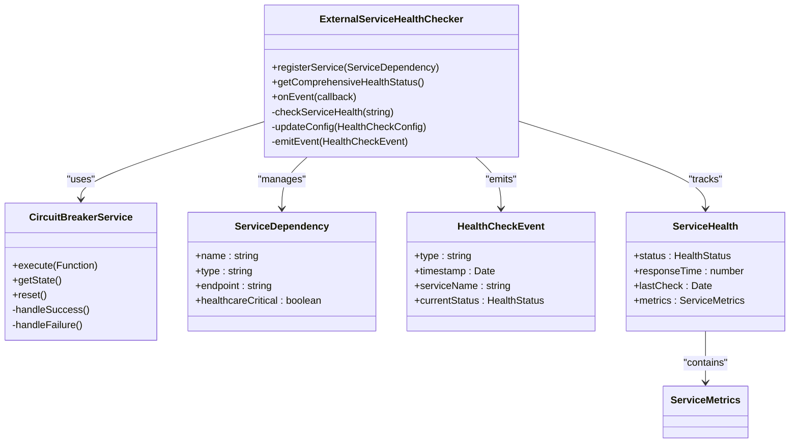

# Health Checks

<cite>
**Referenced Files in This Document**
- [health.ts](file://apps/api/vercel/health.ts)
- [health-legacy.ts](file://apps/api/vercel/health-legacy.ts)
- [monitoring-config.ts](file://config/vercel/monitoring-config.ts)
- [health-checker.ts](file://apps/api/src/services/circuit-breaker/health-checker.ts)
- [init.ts](file://packages/monitoring/src/health/init.ts)
</cite>

## Table of Contents

1. [Introduction](#introduction)
2. [Health Check Endpoints](#health-check-endpoints)
3. [Response Formats and Status Indicators](#response-formats-and-status-indicators)
4. [Integration with Vercel Edge Functions](#integration-with-vercel-edge-functions)
5. [Configuration Options](#configuration-options)
6. [Usage Patterns](#usage-patterns)
7. [Relationship with Monitoring Components](#relationship-with-monitoring-components)
8. [Common Issues and Environment Considerations](#common-issues-and-environment-considerations)
9. [Initialization Process and Dependency Validation](#initialization-process-and-dependency-validation)
10. [Architecture Overview](#architecture-overview)

## Introduction

The health check system in the neonpro application serves as a critical component for ensuring system reliability and uptime monitoring. It provides comprehensive monitoring capabilities that integrate seamlessly with Vercel's edge functions and legacy health endpoints. The system is designed to validate service dependencies, monitor performance metrics, and ensure compliance with healthcare regulations. This documentation details the implementation, configuration, and usage patterns of the health check system, providing insights into its role within the broader observability framework.

## Health Check Endpoints

The neonpro application exposes multiple health check endpoints to accommodate different deployment scenarios and client requirements. The primary endpoint at `/api/health` serves as the main health check interface, returning detailed system status information including deployment version, environment context, and request metadata. For backward compatibility, legacy endpoints such as `/api/v1/health` and `/api/health-legacy` are maintained with simplified response formats. These endpoints support CORS configuration with origin whitelisting, allowing secure access from authorized domains while preventing unauthorized cross-origin requests.

**Diagram sources**

- [health.ts](file://apps/api/vercel/health.ts)
- [health-legacy.ts](file://apps/api/vercel/health-legacy.ts)

**Section sources**

- [health.ts](file://apps/api/vercel/health.ts#L1-L47)
- [health-legacy.ts](file://apps/api/vercel/health-legacy.ts#L1-L12)

## Response Formats and Status Indicators

The health check system employs standardized response formats that provide clear status indicators and comprehensive system information. The primary endpoint returns a JSON object containing status, message, timestamp, deployment identifier, environment, and request details. In development or when internal health checks are enabled, additional diagnostic information about environment variables is included to assist with troubleshooting. The response includes a `status` field with values like "ok" or "healthy" to indicate system state, along with timestamps for monitoring purposes. Legacy endpoints maintain simpler formats with boolean `ok` fields and basic status messages to ensure compatibility with existing monitoring systems.

**Section sources**

- [health.ts](file://apps/api/vercel/health.ts#L1-L47)
- [health-legacy.ts](file://apps/api/vercel/health-legacy.ts#L1-L12)

## Integration with Vercel Edge Functions

The health check system is specifically designed to integrate with Vercel's edge functions, leveraging their global distribution and low-latency characteristics. The edge runtime optimization ensures rapid response times, typically under 100ms, meeting strict healthcare application SLA requirements. The system monitors edge function performance through dedicated scripts that track response times, availability, and error rates against defined thresholds. Configuration options allow for region-specific deployments with automatic failover capabilities, ensuring high availability across different geographic locations. The integration also supports edge-specific features such as streaming responses and cold start optimization, making it suitable for mission-critical healthcare applications requiring immediate responsiveness.

**Diagram sources**

- [health.ts](file://apps/api/vercel/health.ts)
- [performance-monitor.js](file://apps/api/scripts/performance-monitor.js)

## Configuration Options

The health check system offers extensive configuration options to customize behavior according to specific requirements. Configuration parameters include check intervals, timeout durations, retry policies, and response time thresholds that can be adjusted based on service criticality. Healthcare-critical services use more stringent settings with shorter check intervals (30 seconds) and lower tolerance for failures, while standard services employ less aggressive monitoring (60-second intervals). The system supports both healthcare-specific and general configurations through predefined constants like `HEALTHCARE_HEALTH_CONFIG` and `STANDARD_HEALTH_CONFIG`. Additional options control the inclusion of sensitive environment information, CORS policy enforcement, and compliance validation features.

**Section sources**

- [health-checker.ts](file://apps/api/src/services/circuit-breaker/health-checker.ts#L99-L138)
- [health.ts](file://apps/api/vercel/health.ts#L1-L47)

## Usage Patterns

The health check system supports multiple usage patterns for both internal monitoring and external uptime services. Internal monitoring leverages the comprehensive health status endpoint to validate system integrity and detect potential issues before they impact users. External uptime monitoring services can utilize the simplified legacy endpoints for basic availability checks without requiring access to detailed system information. The system also supports synthetic monitoring through automated scripts that simulate user interactions and validate critical healthcare workflows. Development environments can enable enhanced diagnostics by setting the `INTERNAL_HEALTH` flag, providing visibility into environment variable presence for troubleshooting purposes.

**Section sources**

- [health.ts](file://apps/api/vercel/health.ts#L1-L47)
- [health-checker.ts](file://apps/api/src/services/circuit-breaker/health-checker.ts#L1-L817)

## Relationship with Monitoring Components

The health check system integrates closely with other monitoring components such as performance tracking and error reporting to provide a comprehensive observability solution. It shares metrics with the application performance monitoring (APM) system, contributing to transaction sampling and distributed tracing capabilities. Error events detected during health checks trigger alerts through the centralized error tracking system, ensuring timely notification of potential issues. The system also contributes to compliance monitoring by validating LGPD, ANVISA, and CFM requirements, with violations logged to dedicated security event streams. Performance metrics collected during health checks feed into real user monitoring (RUM) dashboards, providing insights into system behavior under actual usage conditions.

**Diagram sources**

- [monitoring-config.ts](file://config/vercel/monitoring-config.ts)
- [health-checker.ts](file://apps/api/src/services/circuit-breaker/health-checker.ts)

## Common Issues and Environment Considerations

The health check system addresses common issues such as false negatives, timeout configurations, and environment-specific considerations through robust design patterns. False negatives are mitigated through retry mechanisms and circuit breaker patterns that distinguish between transient failures and sustained outages. Timeout configurations are adjustable based on network conditions and service responsiveness, with healthcare-critical services employing shorter timeouts to ensure rapid failure detection. Environment-specific considerations include conditional inclusion of sensitive information in development versus production environments, with internal health data only exposed when explicitly enabled. The system also handles CORS requirements appropriately, validating origin headers against whitelisted domains to prevent security vulnerabilities while maintaining accessibility.

**Section sources**

- [health.ts](file://apps/api/vercel/health.ts#L1-L47)
- [health-checker.ts](file://apps/api/src/services/circuit-breaker/health-checker.ts#L1-L817)

## Initialization Process and Dependency Validation

The health check system initialization process begins with the registration of service dependencies and configuration of monitoring parameters. During startup, the system creates instances of `ExternalServiceHealthChecker` using predefined configuration objects that specify check intervals, timeouts, and retry policies. Each registered service receives a dedicated circuit breaker instance configured according to its criticality level, with healthcare-critical services receiving more aggressive failure detection settings. The initialization process establishes monitoring intervals for each service and begins periodic health checks, recording results in comprehensive health status objects. Dependency validation occurs continuously through automated health checks that verify service availability, response times, and compliance requirements, triggering appropriate events and alerts when issues are detected.

**Diagram sources**

- [health-checker.ts](file://apps/api/src/services/circuit-breaker/health-checker.ts)
- [init.ts](file://packages/monitoring/src/health/init.ts)

## Architecture Overview

The health check system architecture follows a modular design with clear separation of concerns between health monitoring, circuit breaking, and event handling components. At its core, the `ExternalServiceHealthChecker` class manages the lifecycle of health checks for registered services, coordinating with `CircuitBreakerService` instances to handle failure detection and recovery. The system employs event-driven architecture, emitting status change events that can be consumed by alerting systems and logging frameworks. Configuration is centralized through environment variables and configuration files, allowing for flexible deployment across different environments. The architecture supports both push-based monitoring through periodic checks and pull-based queries through HTTP endpoints, providing comprehensive visibility into system health.

**Diagram sources**

- [health-checker.ts](file://apps/api/src/services/circuit-breaker/health-checker.ts)
- [init.ts](file://packages/monitoring/src/health/init.ts)
